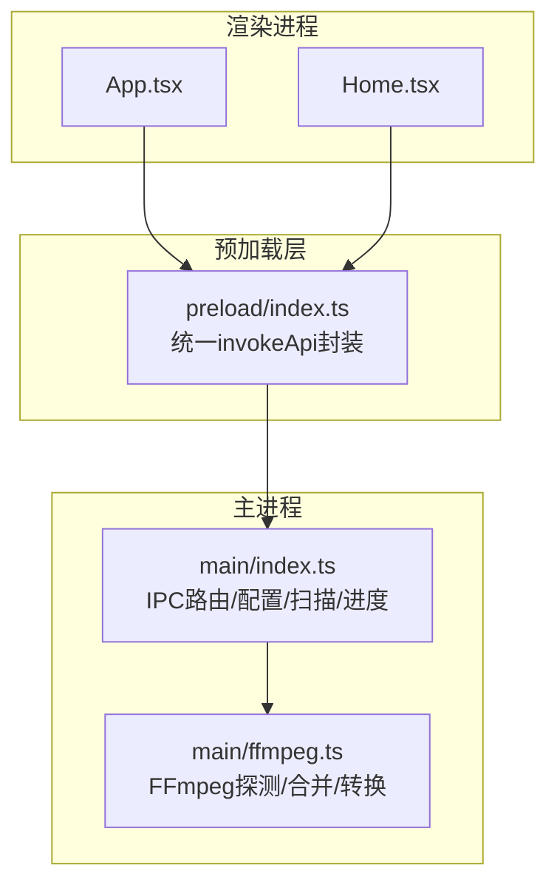
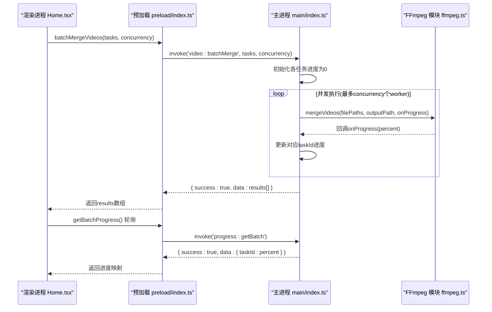
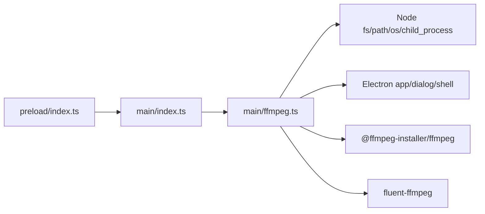

# API参考文档

<cite>
**本文引用的文件**   
- [src/main/index.ts](file://src/main/index.ts)
- [src/main/ffmpeg.ts](file://src/main/ffmpeg.ts)
- [src/preload/index.ts](file://src/preload/index.ts)
- [package.json](file://package.json)
- [tests/invokeApi.test.ts](file://tests/invokeApi.test.ts)
- [tests/configAndUtils.test.ts](file://tests/configAndUtils.test.ts)
- [tests/ffmpegParsing.test.ts](file://tests/ffmpegParsing.test.ts)
- [src/renderer/src/App.tsx](file://src/renderer/src/App.tsx)
- [src/renderer/src/pages/Home.tsx](file://src/renderer/src/pages/Home.tsx)
</cite>

## 目录
1. [简介](#简介)
2. [项目结构](#项目结构)
3. [核心组件](#核心组件)
4. [架构总览](#架构总览)
5. [详细API定义](#详细api定义)
6. [依赖关系分析](#依赖关系分析)
7. [性能与限制](#性能与限制)
8. [错误码与处理模式](#错误码与处理模式)
9. [调试技巧与常见问题](#调试技巧与常见问题)
10. [结论](#结论)
11. [附录：调用示例与最佳实践](#附录调用示例与最佳实践)

## 简介
本API参考文档面向前端开发者与系统集成人员，完整说明视频合并应用的IPC通信接口、配置管理API、文件操作API和视频处理API。文档包含参数说明、返回值类型、错误码、版本兼容性、调用限制与安全考虑，并提供实际调用示例与错误处理模式，帮助快速集成与稳定使用。

## 项目结构
应用采用Electron架构，主进程负责系统能力（文件系统、对话框、FFmpeg进程），预加载脚本通过contextBridge暴露安全API到渲染进程，渲染进程通过window.api调用后端能力。

图表来源
- [src/renderer/src/App.tsx:1-49](file://src/renderer/src/App.tsx#L1-L49)
- [src/renderer/src/pages/Home.tsx:1-760](file://src/renderer/src/pages/Home.tsx#L1-L760)
- [src/preload/index.ts:1-64](file://src/preload/index.ts#L1-L64)
- [src/main/index.ts:1-530](file://src/main/index.ts#L1-L530)
- [src/main/ffmpeg.ts:1-305](file://src/main/ffmpeg.ts#L1-L305)

章节来源
- [src/main/index.ts:1-120](file://src/main/index.ts#L1-L120)
- [src/preload/index.ts:1-64](file://src/preload/index.ts#L1-L64)
- [src/main/ffmpeg.ts:1-30](file://src/main/ffmpeg.ts#L1-L30)

## 核心组件
- 预加载层：提供统一的invokeApi封装，自动解包{success, data?, message?}格式，失败时抛出错误，成功返回data。
- 主进程IPC：注册所有channel处理器，实现配置读写、文件夹选择、文件扫描、视频信息获取、合并、转换、批量并行合并与进度轮询。
- FFmpeg模块：基于fluent-ffmpeg与@ffmpeg-installer/ffmpeg，提供快速探测、流拷贝合并、H.264+AAC转码等能力。

章节来源
- [src/preload/index.ts:9-18](file://src/preload/index.ts#L9-L18)
- [src/main/index.ts:101-110](file://src/main/index.ts#L101-L110)
- [src/main/ffmpeg.ts:60-77](file://src/main/ffmpeg.ts#L60-L77)

## 架构总览
下图展示一次“批量并行合并”的端到端流程：渲染进程构造任务列表，调用批量合并API；主进程按并发度启动多个worker，逐个调用FFmpeg进行合并，实时上报每个任务的进度；渲染进程每500ms轮询批量进度并计算总体进度。

图表来源
- [src/renderer/src/pages/Home.tsx:204-298](file://src/renderer/src/pages/Home.tsx#L204-L298)
- [src/preload/index.ts:42-48](file://src/preload/index.ts#L42-L48)
- [src/main/index.ts:421-478](file://src/main/index.ts#L421-L478)
- [src/main/ffmpeg.ts:87-245](file://src/main/ffmpeg.ts#L87-L245)

## 详细API定义

### 通用约定
- 通道命名：以功能域前缀+冒号分隔，如config:*、dialog:*、scan:*、video:*、progress:*。
- 返回格式：统一为对象{ success: boolean, data?: any, message?: string }。
- 预加载封装：成功时返回data字段，失败时抛出Error(message)。
- 错误处理：渲染侧建议try/catch捕获错误并通过用户提示反馈。

章节来源
- [src/preload/index.ts:9-18](file://src/preload/index.ts#L9-L18)
- [tests/invokeApi.test.ts:14-22](file://tests/invokeApi.test.ts#L14-L22)

### 配置管理API

#### 加载配置
- 通道：config:load
- 入参：无
- 返回：AppConfig对象
- 错误：无（始终返回{ success: true, data }）
- 说明：应用启动时读取用户数据目录下的config.json，不存在则返回空对象。

章节来源
- [src/main/index.ts:101-104](file://src/main/index.ts#L101-L104)
- [src/main/index.ts:38-52](file://src/main/index.ts#L38-L52)

#### 保存配置
- 通道：config:save
- 入参：config: AppConfig
- 返回：{ success: true }
- 错误：无（写入异常会记录日志但不抛错）
- 说明：增量合并旧配置与新配置，避免覆盖未修改字段。

章节来源
- [src/main/index.ts:106-110](file://src/main/index.ts#L106-L110)
- [src/main/index.ts:54-65](file://src/main/index.ts#L54-L65)
- [tests/configAndUtils.test.ts:8-46](file://tests/configAndUtils.test.ts#L8-L46)

#### 配置项定义(AppConfig)
- inputFolder?: string
- outputFolder?: string
- outputFileName?: string
- darkMode?: boolean
- concurrency?: number
- maxIntervalHours?: number
- autoOpenWebsite?: boolean
- autoOpenFolder?: boolean
- hiddenFolderKeys?: string[]

章节来源
- [src/main/index.ts:18-28](file://src/main/index.ts#L18-L28)

### 文件操作API

#### 选择输入文件夹
- 通道：dialog:selectFolder
- 入参：无
- 返回：{ success: true, data: folderPath } 或 { success: false, message }
- 行为：选择后自动保存inputFolder到配置。

章节来源
- [src/main/index.ts:112-124](file://src/main/index.ts#L112-L124)

#### 选择输出文件夹
- 通道：dialog:selectOutputFolder
- 入参：无
- 返回：{ success: true, data: folderPath } 或 { success: false, message }
- 行为：选择后自动保存outputFolder到配置。

章节来源
- [src/main/index.ts:367-378](file://src/main/index.ts#L367-L378)

#### 打开目录
- 通道：dialog:openDirectory
- 入参：path: string
- 返回：{ success: true } 或 { success: false, message }

章节来源
- [src/main/index.ts:347-355](file://src/main/index.ts#L347-L355)

#### 打开外部链接
- 通道：dialog:openExternal
- 入参：url: string
- 返回：{ success: true } 或 { success: false, message }

章节来源
- [src/main/index.ts:357-365](file://src/main/index.ts#L357-L365)

#### 扫描FLV分段文件并分组
- 通道：scan:flvFiles
- 入参：folderPath: string, maxIntervalHours?: number (默认2.5)
- 返回：{ success: true, data: { rootPath: string, folders: FolderGroup[] } } 或 { success: false, message }
- 说明：
  - 支持扩展名：.flv, .m4s, .ts, .blv
  - 文件名解析规则：日期+时间戳+标题，用于同场直播判定
  - 过滤已合并结果：若同名MP4存在则排除该组
  - 分组策略：按标题相同且间隔不超过阈值合并

章节来源
- [src/main/index.ts:145-345](file://src/main/index.ts#L145-L345)
- [tests/configAndUtils.test.ts:48-83](file://tests/configAndUtils.test.ts#L48-L83)

### 视频处理API

#### 获取视频信息
- 通道：video:getInfo
- 入参：filePath: string
- 返回：{ success: true, data: VideoInfo } 或 { success: false, message }
- VideoInfo字段：
  - duration: number (秒)
  - codec: string
  - width: number
  - height: number

章节来源
- [src/main/index.ts:380-388](file://src/main/index.ts#L380-L388)
- [src/main/ffmpeg.ts:60-77](file://src/main/ffmpeg.ts#L60-L77)

#### 合并视频（单批）
- 通道：video:merge
- 入参：filePaths: string[], outputPath: string
- 返回：{ success: true, data: warning? } 或 { success: false, message }
- 说明：
  - 使用concat demuxer + stream copy，不重新编码
  - 自动跳过被占用的片段文件，返回warning提示
  - 超时保护：30分钟，失败清理临时文件

章节来源
- [src/main/index.ts:390-403](file://src/main/index.ts#L390-L403)
- [src/main/ffmpeg.ts:87-245](file://src/main/ffmpeg.ts#L87-L245)

#### 转换视频（转MP4）
- 通道：video:convert
- 入参：filePath: string, outputPath: string
- 返回：{ success: true } 或 { success: false, message }
- 说明：H.264视频 + AAC音频，启用faststart优化

章节来源
- [src/main/index.ts:480-493](file://src/main/index.ts#L480-L493)
- [src/main/ffmpeg.ts:247-305](file://src/main/ffmpeg.ts#L247-L305)

#### 批量并行合并
- 通道：video:batchMerge
- 入参：tasks: BatchMergeTask[], concurrency?: number (默认3)
- 返回：{ success: true, data: BatchMergeResult[] }
- BatchMergeTask字段：
  - taskId: string
  - filePaths: string[]
  - outputPath: string
  - folderName: string
- BatchMergeResult字段：
  - taskId: string
  - folderName: string
  - success: boolean
  - warning?: string
  - error?: string

章节来源
- [src/main/index.ts:405-469](file://src/main/index.ts#L405-L469)

#### 获取当前进度（单任务）
- 通道：progress:get
- 入参：无
- 返回：{ mergeProgress: number, convertProgress: number }
- 说明：渲染进程轮询获取，值范围0-100，失败时为0

章节来源
- [src/main/index.ts:495-498](file://src/main/index.ts#L495-L498)

#### 获取批量合并进度
- 通道：progress:getBatch
- 入参：无
- 返回：{ success: true, data: Record<string, number> }
- 说明：key为taskId，value为百分比；-1表示失败

章节来源
- [src/main/index.ts:471-478](file://src/main/index.ts#L471-L478)

## 依赖关系分析
- 预加载层依赖electron的contextBridge与ipcRenderer，将主进程能力安全暴露给渲染进程。
- 主进程依赖Electron API（app、BrowserWindow、ipcMain、dialog、shell）、Node.js fs/path/os/child_process以及FFmpeg工具链。
- FFmpeg模块依赖fluent-ffmpeg与@ffmpeg-installer/ffmpeg，并在打包后重定位可执行路径以避免asar虚拟文件系统问题。

图表来源
- [src/preload/index.ts:1-64](file://src/preload/index.ts#L1-L64)
- [src/main/index.ts:1-10](file://src/main/index.ts#L1-L10)
- [src/main/ffmpeg.ts:1-11](file://src/main/ffmpeg.ts#L1-L11)
- [package.json:17-20](file://package.json#L17-L20)

章节来源
- [package.json:17-20](file://package.json#L17-L20)
- [src/main/ffmpeg.ts:8-11](file://src/main/ffmpeg.ts#L8-L11)

## 性能与限制
- 合并性能：采用stream copy拼接，速度接近磁盘IO上限；预估时长基于首个文件的比特率推算，误差取决于源一致性。
- 并发控制：批量合并默认并发数3，可根据CPU与磁盘性能调整（建议2-4）。
- 超时保护：单次合并最长30分钟，超时将清理临时文件并返回错误。
- 进度轮询：推荐每500ms轮询一次批量进度，避免频繁IPC造成阻塞。
- 文件占用：自动跳过正在录制的片段，返回warning提示。

章节来源
- [src/main/ffmpeg.ts:127-144](file://src/main/ffmpeg.ts#L127-L144)
- [src/main/ffmpeg.ts:154-160](file://src/main/ffmpeg.ts#L154-L160)
- [src/main/index.ts:421-469](file://src/main/index.ts#L421-L469)
- [src/renderer/src/pages/Home.tsx:221-236](file://src/renderer/src/pages/Home.tsx#L221-L236)

## 错误码与处理模式
- 统一返回结构：{ success, data?, message? }
- 预加载封装：
  - success=true：返回data
  - success=false：抛出Error(message)，若无message则抛出“操作失败”
- 常见错误场景：
  - 未选择文件夹：返回message提示
  - 文件被占用：合并时跳过并返回warning
  - 无法创建输出目录：返回错误消息
  - 覆盖已有文件：尝试备份后覆盖，失败返回错误
  - FFmpeg启动失败/退出码非0：返回错误消息
  - 超时：返回“合并超时（30分钟）...”

章节来源
- [tests/invokeApi.test.ts:24-69](file://tests/invokeApi.test.ts#L24-L69)
- [src/main/ffmpeg.ts:110-125](file://src/main/ffmpeg.ts#L110-L125)
- [src/main/ffmpeg.ts:200-244](file://src/main/ffmpeg.ts#L200-L244)
- [src/main/index.ts:390-403](file://src/main/index.ts#L390-L403)

## 调试技巧与常见问题
- 查看FFmpeg命令：合并与转换均打印命令行，便于复现与诊断。
- 解析stderr：合并过程实时解析time=...计算进度，失败时保留最后若干行stderr辅助定位。
- 路径转义：生成concat列表时对单引号进行转义，避免特殊字符导致命令失败。
- 进度轮询：确保在批量合并期间定时调用getBatchProgress，并在完成后清理定时器。
- 权限与路径：确认输出目录存在且可写；Windows下注意盘符与反斜杠。
- 资源占用：若提示文件被占用，等待录制结束或手动关闭占用进程后再试。

章节来源
- [src/main/ffmpeg.ts:172-191](file://src/main/ffmpeg.ts#L172-L191)
- [src/main/ffmpeg.ts:200-206](file://src/main/ffmpeg.ts#L200-L206)
- [tests/configAndUtils.test.ts:85-109](file://tests/configAndUtils.test.ts#L85-L109)
- [src/renderer/src/pages/Home.tsx:221-236](file://src/renderer/src/pages/Home.tsx#L221-L236)

## 结论
本API体系围绕Electron IPC构建，提供稳定的配置管理、文件操作与视频处理能力。通过统一的返回结构与预加载封装，简化了前端调用与错误处理。结合并发控制、超时保护与进度轮询，适合大规模分段视频的自动化合并与转码场景。

## 附录：调用示例与最佳实践

### 前置准备
- 在渲染进程中确保window.api可用（由preload注入）。
- 首次启动时调用loadConfig，恢复上次设置。

章节来源
- [src/renderer/src/App.tsx:10-22](file://src/renderer/src/App.tsx#L10-L22)
- [src/renderer/src/pages/Home.tsx:44-102](file://src/renderer/src/pages/Home.tsx#L44-L102)

### 典型调用流程（批量合并）
- 选择输入/输出目录：selectFolder / selectOutputFolder
- 扫描分组：scanFlvFiles(inputFolder, maxIntervalHours)
- 构造任务列表：为每个分组生成taskId、filePaths、outputPath、folderName
- 发起批量合并：batchMergeVideos(tasks, concurrency)
- 轮询进度：getBatchProgress() 每500ms一次，计算总体进度
- 完成后：可选openDirectory(outputFolder)、openExternal(投稿页面)

章节来源
- [src/renderer/src/pages/Home.tsx:112-165](file://src/renderer/src/pages/Home.tsx#L112-L165)
- [src/renderer/src/pages/Home.tsx:204-298](file://src/renderer/src/pages/Home.tsx#L204-L298)

### 错误处理模式
- try/catch包裹每次API调用，捕获Error(message)并提示用户。
- 对批量结果逐条判断success，分别处理warning与error。
- 清理定时器与状态，避免内存泄漏。

章节来源
- [tests/invokeApi.test.ts:40-48](file://tests/invokeApi.test.ts#L40-L48)
- [src/renderer/src/pages/Home.tsx:249-297](file://src/renderer/src/pages/Home.tsx#L249-L297)

### 版本兼容性与安全考虑
- 版本：当前应用版本1.0.0（见package.json）。
- 兼容性：
  - Electron 33.x
  - fluent-ffmpeg 2.1.x
  - @ffmpeg-installer/ffmpeg 1.1.x
- 安全：
  - 仅通过contextBridge暴露必要方法，避免直接访问Node API
  - 外部链接打开使用shell.openExternal，受浏览器窗口策略控制
  - 配置文件存储于userData目录，开发模式下可切换至项目内目录便于调试

章节来源
- [package.json:1-16](file://package.json#L1-L16)
- [src/main/index.ts:500-503](file://src/main/index.ts#L500-L503)
- [src/preload/index.ts:51-63](file://src/preload/index.ts#L51-L63)