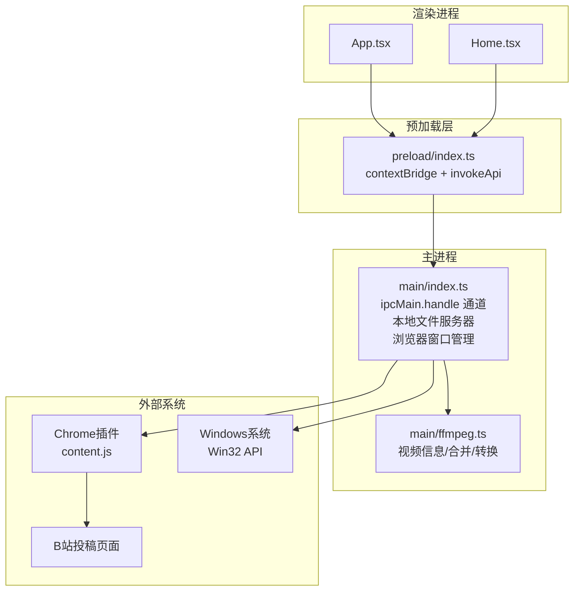
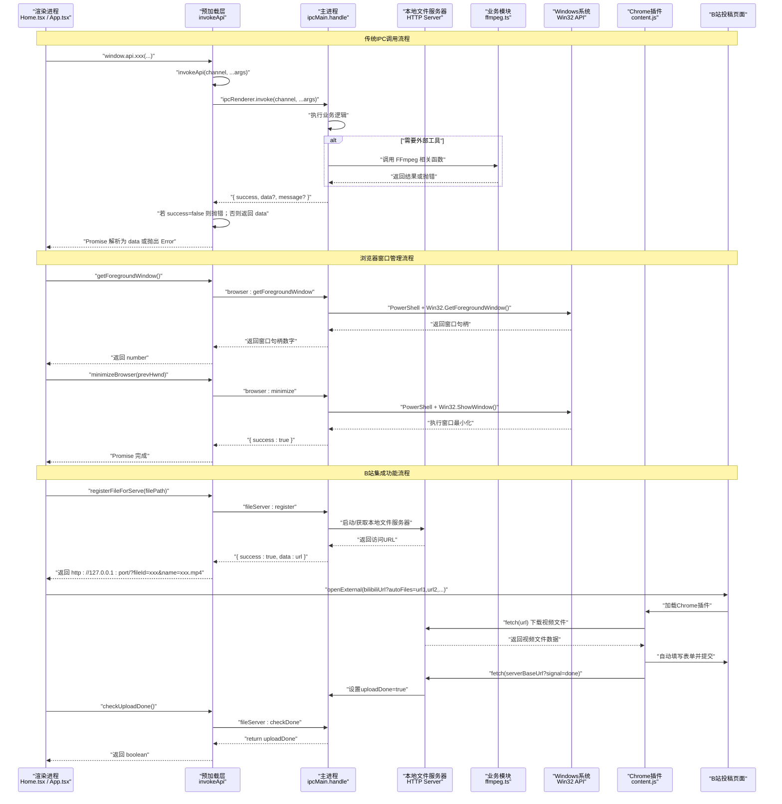
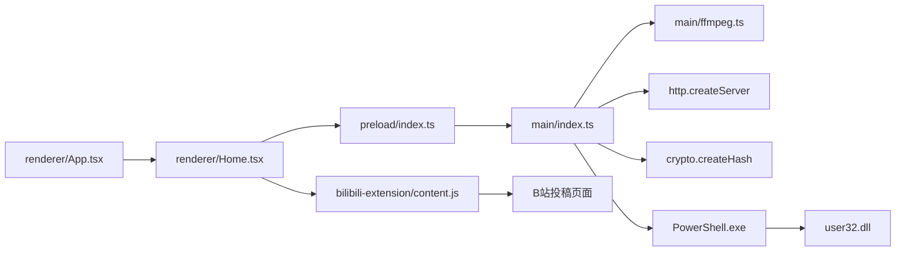

# IPC通信接口

<cite>
**本文引用的文件**   
- [src/main/index.ts](file://src/main/index.ts)
- [src/preload/index.ts](file://src/preload/index.ts)
- [src/renderer/src/env.d.ts](file://src/renderer/src/env.d.ts)
- [tests/invokeApi.test.ts](file://tests/invokeApi.test.ts)
- [src/main/ffmpeg.ts](file://src/main/ffmpeg.ts)
- [src/renderer/src/App.tsx](file://src/renderer/src/App.tsx)
- [src/renderer/src/pages/Home.tsx](file://src/renderer/src/pages/Home.tsx)
- [bilibili-extension/content.js](file://bilibili-extension/content.js)
</cite>

## 更新摘要
**变更内容**   
- 新增浏览器窗口管理相关IPC接口，支持智能浏览器窗口控制
- 添加getForegroundWindow接口用于获取当前前台窗口句柄
- 添加minimizeBrowser接口用于最小化抢焦点的外部浏览器窗口
- 完善Windows平台特定的Win32 API集成和PowerShell脚本调用机制
- 优化B站集成功能的用户体验，避免浏览器窗口抢占应用焦点

## 目录
1. [简介](#简介)
2. [项目结构](#项目结构)
3. [核心组件](#核心组件)
4. [架构总览](#架构总览)
5. [详细组件分析](#详细组件分析)
6. [依赖关系分析](#依赖关系分析)
7. [性能与并发特性](#性能与并发特性)
8. [错误处理与统一响应格式](#错误处理与统一响应格式)
9. [调用示例与最佳实践](#调用示例与最佳实践)
10. [故障排查指南](#故障排查指南)
11. [结论](#结论)

## 简介
本文件面向前端开发者，系统化说明 Electron 主进程与渲染进程之间的 IPC 通信机制。重点包括：
- invokeApi 的实现原理、消息传递格式与错误处理模式
- 所有 IPC 通道的命名规范、参数传递方式与返回值结构
- 统一的响应格式 {success, data?, message?} 的设计理念与策略
- 在渲染进程中安全调用主进程功能的实际示例与最佳实践
- **新增** 浏览器窗口管理功能，支持智能窗口控制和跨平台兼容性
- **新增** B站集成功能的本地文件服务器机制和插件联动流程

## 项目结构
本项目采用分层组织：
- 主进程（main）：注册 ipcMain.handle 通道，实现业务逻辑（配置、文件系统、FFmpeg 操作、本地文件服务器、浏览器窗口管理等）
- 预加载脚本（preload）：通过 contextBridge 暴露安全的 API 给渲染进程，封装 invokeApi 统一解包返回结果
- 渲染进程（renderer）：使用 window.api 调用主进程能力，负责 UI 交互与状态管理
- **新增** Chrome插件（bilibili-extension）：实现B站投稿页面的自动化上传功能



**图表来源**
- [src/preload/index.ts:1-72](file://src/preload/index.ts#L1-L72)
- [src/main/index.ts:1-668](file://src/main/index.ts#L1-L668)
- [src/main/ffmpeg.ts:1-305](file://src/main/ffmpeg.ts#L1-L305)
- [src/renderer/src/App.tsx:1-49](file://src/renderer/src/App.tsx#L1-L49)
- [src/renderer/src/pages/Home.tsx:1-835](file://src/renderer/src/pages/Home.tsx#L1-L835)
- [bilibili-extension/content.js:1-1037](file://bilibili-extension/content.js#L1-L1037)

章节来源
- [src/preload/index.ts:1-72](file://src/preload/index.ts#L1-L72)
- [src/main/index.ts:1-668](file://src/main/index.ts#L1-L668)
- [src/main/ffmpeg.ts:1-305](file://src/main/ffmpeg.ts#L1-L305)
- [src/renderer/src/App.tsx:1-49](file://src/renderer/src/App.tsx#L1-L49)
- [src/renderer/src/pages/Home.tsx:1-835](file://src/renderer/src/pages/Home.tsx#L1-L835)
- [bilibili-extension/content.js:1-1037](file://bilibili-extension/content.js#L1-L1037)

## 核心组件
- 预加载层（invokeApi）
  - 职责：统一调用 ipcRenderer.invoke，自动解包 {success, data?, message?} 的响应；成功时返回 data，失败时抛出 Error
  - 暴露 API：将各通道包装为类型化的方法，供渲染进程直接调用
  - **新增** 浏览器窗口管理API：getForegroundWindow、minimizeBrowser
- 主进程（IPC 处理器）
  - 职责：注册并处理所有 ipcMain.handle 通道，执行业务逻辑（配置读写、对话框、文件扫描、FFmpeg 操作、进度查询、本地文件服务器、浏览器窗口管理等）
  - **新增** 浏览器窗口管理：通过PowerShell脚本调用Win32 API实现智能窗口控制
  - **新增** 本地文件服务器：提供HTTP服务让Chrome插件访问合并后的视频文件
- 渲染进程（调用方）
  - 职责：通过 window.api 调用功能，处理 Promise 成功/失败分支，展示用户反馈
  - **新增** B站集成：支持自动注册文件、打开投稿页面、智能窗口控制、轮询等待插件完成
- **新增** Chrome插件
  - 职责：在B站投稿页面注入自动化脚本，从本地服务器下载视频并自动填写表单提交

章节来源
- [src/preload/index.ts:1-72](file://src/preload/index.ts#L1-L72)
- [src/main/index.ts:1-668](file://src/main/index.ts#L1-L668)
- [src/renderer/src/env.d.ts:1-80](file://src/renderer/src/env.d.ts#L1-80)
- [bilibili-extension/content.js:1-1037](file://bilibili-extension/content.js#L1-L1037)

## 架构总览
下图展示了从渲染进程到主进程的完整调用链路，以及新增的浏览器窗口管理和B站集成功能的完整工作流程。



**图表来源**
- [src/preload/index.ts:9-18](file://src/preload/index.ts#L9-L18)
- [src/main/index.ts:87-127](file://src/main/index.ts#L87-L127)
- [src/main/index.ts:628-637](file://src/main/index.ts#L628-L637)
- [src/main/index.ts:595-608](file://src/main/index.ts#L595-L608)
- [bilibili-extension/content.js:980-1037](file://bilibili-extension/content.js#L980-L1037)
- [src/renderer/src/pages/Home.tsx:302-314](file://src/renderer/src/pages/Home.tsx#L302-L314)

## 详细组件分析

### 预加载层：invokeApi 与 API 桥接
- 设计要点
  - 统一入口：所有对外暴露的方法内部均通过 invokeApi 调用对应 channel
  - 统一解包：对标准响应进行解包，简化渲染端调用体验
  - 安全隔离：仅通过 contextBridge 暴露必要方法，避免直接访问 Node/Electron 原生对象
- 关键行为
  - 当后端返回包含 success 字段且为 false 时，抛出 Error(message || '操作失败')
  - 当 success 为 true 时，返回 data 字段（可能为 undefined/null/基本类型/对象/数组）
  - 非标准响应（无 success 字段）原样返回，兼容历史或特殊场景
- **新增API**
  - registerFileForServe: 注册文件到本地服务器，返回可访问的URL
  - checkUploadDone: 检查插件投稿是否完成，返回布尔值
  - getForegroundWindow: 获取当前前台窗口句柄，返回数字ID
  - minimizeBrowser: 最小化抢焦点的外部浏览器窗口，接受前一个窗口句柄作为参数

章节来源
- [src/preload/index.ts:9-18](file://src/preload/index.ts#L9-L18)
- [src/preload/index.ts:54-56](file://src/preload/index.ts#L54-L56)
- [tests/invokeApi.test.ts:14-22](file://tests/invokeApi.test.ts#L14-L22)
- [tests/invokeApi.test.ts:24-69](file://tests/invokeApi.test.ts#L24-L69)

### 主进程：IPC 通道与业务逻辑
- 通道命名规范
  - 采用"领域:动作"形式，如 config:load、dialog:selectFolder、video:merge、progress:get 等
  - **新增** fileServer:register、fileServer:checkDone 用于本地文件服务器管理
  - **新增** browser:getForegroundWindow、browser:minimize 用于浏览器窗口管理
  - 语义清晰、可分组、易扩展
- 参数与返回值
  - 参数：通过 ipcRenderer.invoke 的剩余参数传递，支持任意可序列化数据
  - 返回值：统一遵循 { success, data?, message? } 格式
- 典型通道清单（按功能域）
  - 配置管理
    - config:load → 返回 { success: true, data: AppConfig }
    - config:save → 返回 { success: true }
  - 对话框与系统交互
    - dialog:selectFolder → 返回 { success: true, data: string } 或 { success: false, message }
    - dialog:selectOutputFolder → 同上
    - dialog:openDirectory(path) → 返回 { success: true } 或 { success: false, message }
    - dialog:openExternal(url) → 返回 { success: true } 或 { success: false, message }
  - 文件扫描
    - scan:flvFiles(folderPath, maxIntervalHours?) → 返回 { success: true, data: ScanResult } 或 { success: false, message }
  - 视频处理
    - video:getInfo(filePath) → 返回 { success: true, data: VideoInfo } 或 { success: false, message }
    - video:merge(filePaths[], outputPath) → 返回 { success: true, data?: string|undefined } 或 { success: false, message }
    - video:convert(filePath, outputPath) → 返回 { success: true } 或 { success: false, message }
  - 批量并行合并
    - video:batchMerge(tasks[], concurrency?) → 返回 { success: true, data: BatchMergeResult[] } 或 { success: false, message }
  - 进度查询
    - progress:get → 返回 { mergeProgress, convertProgress }（注意：该通道未包裹统一响应，见后文说明）
    - progress:getBatch → 返回 { success: true, data: Record<string, number> }
  - **新增** 本地文件服务器
    - fileServer:register(filePath) → 返回 { success: true, data: string } 或 { success: false, message }
      - 参数：filePath - 要注册的本地文件路径
      - 返回值：可访问的HTTP URL，格式为 http://127.0.0.1:port/?fileId=xxx&name=filename.ext
    - fileServer:checkDone → 返回 boolean
      - 返回值：true表示插件已完成投稿，false表示仍在进行中
  - **新增** 浏览器窗口管理
    - browser:getForegroundWindow → 返回 number
      - 返回值：当前前台窗口的句柄ID，非Windows平台返回0
      - 用途：记录打开浏览器前的前台窗口，用于后续判断是否需要最小化
    - browser:minimize(prevHwnd) → 返回 { success: true }
      - 参数：prevHwnd - 打开浏览器前的前台窗口句柄
      - 功能：如果当前前台窗口不是之前的窗口且不是0，则最小化当前窗口
      - 平台限制：仅在Windows平台有效，其他平台直接返回成功

章节来源
- [src/main/index.ts:87-127](file://src/main/index.ts#L87-L127)
- [src/main/index.ts:628-637](file://src/main/index.ts#L628-L637)
- [src/main/index.ts:197-205](file://src/main/index.ts#L197-L205)
- [src/main/index.ts:207-217](file://src/main/index.ts#L207-L217)
- [src/main/index.ts:567-573](file://src/main/index.ts#L567-L573)
- [src/main/index.ts:575-588](file://src/main/index.ts#L575-L588)
- [src/main/index.ts:590-593](file://src/main/index.ts#L590-L593)
- [src/main/index.ts:595-608](file://src/main/index.ts#L595-L608)
- [src/main/index.ts:610-614](file://src/main/index.ts#L610-L614)

### 浏览器窗口管理实现
- 技术实现
  - 基于PowerShell脚本调用Win32 API实现窗口管理
  - 使用user32.dll的GetForegroundWindow和ShowWindow函数
  - 跨平台兼容：非Windows平台直接返回默认值或空操作
- 核心功能
  - getForegroundWindow: 获取当前活动窗口的句柄ID
  - minimizeBrowser: 智能最小化抢焦点的浏览器窗口
- 安全考虑
  - 仅在Windows平台执行PowerShell命令
  - 使用windowsHide选项隐藏PowerShell控制台窗口
  - 异常处理确保即使PowerShell执行失败也不会影响主流程
- 使用场景
  - B站集成功能中，打开浏览器后如果浏览器抢了焦点，自动最小化以保持应用在前台
  - 提升用户体验，避免频繁的手动窗口切换

章节来源
- [src/main/index.ts:87-127](file://src/main/index.ts#L87-L127)

### 本地文件服务器实现
- 服务器特性
  - 基于Node.js内置http模块创建轻量级HTTP服务器
  - 监听127.0.0.1随机端口，避免端口冲突
  - 支持跨域访问（Access-Control-Allow-Origin: *）
  - 支持Range请求，便于大文件断点续传
- 文件管理机制
  - 使用Map存储 fileId -> filePath 映射关系
  - 通过SHA256哈希生成唯一fileId，确保文件名安全性
  - 自动根据文件扩展名设置正确的Content-Type
- 插件通信协议
  - 文件访问：GET /?fileId={id}&name={filename}
  - 完成信号：GET /?signal=done
  - 错误处理：404表示文件不存在

章节来源
- [src/main/index.ts:26-85](file://src/main/index.ts#L26-L85)

### 渲染进程：类型定义与调用约定
- 类型声明
  - Window.api 方法签名与返回类型在 env.d.ts 中集中定义，提供 TS 类型提示
  - **新增** registerFileForServe: (filePath: string) => Promise<string>
  - **新增** checkUploadDone: () => Promise<boolean>
  - **新增** getForegroundWindow: () => Promise<number>
  - **新增** minimizeBrowser: (prevHwnd: number) => Promise<void>
- 调用约定
  - 所有方法返回 Promise，成功时 resolve(data)，失败时 reject(Error)
  - 建议始终使用 try/catch 捕获异常，并在 UI 中给出友好提示

章节来源
- [src/renderer/src/env.d.ts:27-32](file://src/renderer/src/env.d.ts#L27-L32)
- [src/renderer/src/App.tsx:10-22](file://src/renderer/src/App.tsx#L10-L22)
- [src/renderer/src/pages/Home.tsx:44-102](file://src/renderer/src/pages/Home.tsx#L44-L102)

### Chrome插件：B站投稿自动化
- 插件功能
  - 自动检测URL中的autoFiles参数，从本地服务器下载视频文件
  - 智能识别B站投稿页面的各种UI元素和表单控件
  - 自动填写标题、创作声明、可见范围等表单字段
  - 支持多P视频上传和封面自动设置
- 通信机制
  - 通过fetch API与本地文件服务器通信
  - 完成后发送signal=done信号通知应用
  - 提供详细的日志输出便于调试

章节来源
- [bilibili-extension/content.js:980-1037](file://bilibili-extension/content.js#L980-L1037)
- [bilibili-extension/content.js:1-1037](file://bilibili-extension/content.js#L1-L1037)

## 依赖关系分析
- 模块耦合
  - preload 仅依赖 electron 的 contextBridge/ipcRenderer，不直接访问 Node API
  - main 依赖 fs/path/electron/dialog/shell/http/crypto 及 ffmpeg 工具链
  - renderer 仅依赖 React/AntD 与 window.api 暴露的接口
  - **新增** Chrome插件独立运行，通过HTTP与主进程通信
  - **新增** Windows平台特定依赖：PowerShell脚本和Win32 API
- 外部依赖
  - FFmpeg 子进程用于视频探测、合并与转码
  - Electron 内置对话框与系统 shell 打开能力
  - Node.js http模块用于本地文件服务器
  - crypto模块用于生成文件ID哈希
  - **新增** PowerShell.exe用于Windows系统API调用
  - **新增** user32.dll用于窗口管理操作



**图表来源**
- [src/renderer/src/App.tsx:1-49](file://src/renderer/src/App.tsx#L1-L49)
- [src/renderer/src/pages/Home.tsx:1-835](file://src/renderer/src/pages/Home.tsx#L1-L835)
- [src/preload/index.ts:1-72](file://src/preload/index.ts#L1-L72)
- [src/main/index.ts:1-668](file://src/main/index.ts#L1-L668)
- [src/main/ffmpeg.ts:1-305](file://src/main/ffmpeg.ts#L1-L305)
- [bilibili-extension/content.js:1-1037](file://bilibili-extension/content.js#L1-L1037)

章节来源
- [src/renderer/src/env.d.ts:1-80](file://src/renderer/src/env.d.ts#L1-80)
- [src/main/ffmpeg.ts:1-305](file://src/main/ffmpeg.ts#L1-L305)

## 性能与并发特性
- 批量并行合并
  - 主进程维护任务队列与并发 worker，根据 concurrency 控制同时执行的任务数
  - 每个任务独立更新 batchMergeProgress Map，渲染端轮询获取整体与各任务进度
- 进度上报
  - 单任务合并/转换通过回调更新全局进度变量，渲染端通过 progress:get 轮询
  - 批量任务通过 progress:getBatch 轮询，粒度更细，用户体验更好
- **新增** 本地文件服务器性能优化
  - 懒启动：仅在首次注册文件时启动HTTP服务器
  - 内存映射：使用Map存储文件映射，查找时间复杂度O(1)
  - 流式传输：使用createReadStream管道传输，避免大文件内存占用
- **新增** 浏览器窗口管理性能考虑
  - PowerShell脚本异步执行，不阻塞主线程
  - 窗口句柄获取和最小化操作快速完成，延迟通常在毫秒级
  - 跨平台兼容：非Windows平台直接返回，避免不必要的系统调用

章节来源
- [src/main/index.ts:567-573](file://src/main/index.ts#L567-L573)
- [src/main/index.ts:590-593](file://src/main/index.ts#L590-L593)
- [src/main/index.ts:26-85](file://src/main/index.ts#L26-L85)
- [src/main/index.ts:87-127](file://src/main/index.ts#L87-L127)
- [src/renderer/src/pages/Home.tsx:221-236](file://src/renderer/src/pages/Home.tsx#L221-L236)

## 错误处理与统一响应格式
- 统一响应格式
  - 成功：{ success: true, data?: any }
  - 失败：{ success: false, message?: string }
- 预加载层解包策略
  - 若 result.success === false，抛出 Error(result.message || '操作失败')
  - 若 result.success === true，返回 result.data
  - 若无 success 字段，原样返回（兼容旧接口）
- 主进程错误处理
  - 所有异步业务逻辑使用 try/catch，捕获异常后返回 { success: false, message }
  - 部分通道（如 progress:get）返回原始结构，未包裹统一响应，调用方需注意
  - **新增** 本地文件服务器错误处理：文件不存在返回404，服务器启动失败返回错误消息
  - **新增** 浏览器窗口管理错误处理：PowerShell执行失败不影响主流程，返回默认值
- **新增** 跨平台错误处理
  - 非Windows平台：getForegroundWindow返回0，minimizeBrowser直接返回成功
  - 确保应用在macOS和Linux上也能正常运行

```mermaid
flowchart TD
Start(["收到 IPC 响应"]) --> CheckObj{"是否对象且有 success 字段?"}
CheckObj --> |否| ReturnRaw["原样返回"]
CheckObj --> |是| SuccessCheck{"success 是否为 true?"}
SuccessCheck --> |否| ThrowErr["抛出 Error(message||'操作失败')"]
SuccessCheck --> |是| ReturnData["返回 data 字段"]
Note: 浏览器窗口管理特殊处理
BrowserAPI["browser:* 接口"] --> PlatformCheck{"是否Windows平台?"}
PlatformCheck --> |否| DefaultReturn["返回默认值/空操作"]
PlatformCheck --> |是| ExecutePS["执行PowerShell脚本"]
ExecutePS --> PSResult{"脚本执行成功?"}
PSResult --> |否| SafeReturn["返回安全默认值"]
PSResult --> |是| NormalReturn["正常返回值"]
```

**图表来源**
- [src/preload/index.ts:9-18](file://src/preload/index.ts#L9-L18)
- [tests/invokeApi.test.ts:14-22](file://tests/invokeApi.test.ts#L14-L22)
- [src/main/index.ts:87-127](file://src/main/index.ts#L87-L127)
- [src/main/index.ts:45-50](file://src/main/index.ts#L45-L50)

章节来源
- [src/preload/index.ts:9-18](file://src/preload/index.ts#L9-L18)
- [tests/invokeApi.test.ts:24-69](file://tests/invokeApi.test.ts#L24-L69)
- [src/main/index.ts:197-205](file://src/main/index.ts#L197-L205)
- [src/main/index.ts:207-217](file://src/main/index.ts#L207-L217)
- [src/main/index.ts:567-573](file://src/main/index.ts#L567-L573)
- [src/main/index.ts:575-588](file://src/main/index.ts#L575-L588)
- [src/main/index.ts:590-593](file://src/main/index.ts#L590-L593)
- [src/main/index.ts:595-608](file://src/main/index.ts#L595-L608)
- [src/main/index.ts:610-614](file://src/main/index.ts#L610-L614)
- [src/main/index.ts:87-127](file://src/main/index.ts#L87-L127)

## 调用示例与最佳实践

### 统一响应格式设计理念
- 优点
  - 明确的成功/失败语义，便于上层统一处理
  - 错误信息集中化，利于日志与用户提示
  - 兼容无 success 字段的旧接口，平滑演进
- 注意事项
  - 对于未包裹统一响应的通道（如 progress:get），调用方需自行判断返回结构
  - **新增** 本地文件服务器URL具有时效性，应在合理时间内使用
  - **新增** 浏览器窗口管理功能仅在Windows平台有效，其他平台会返回默认值

章节来源
- [src/preload/index.ts:9-18](file://src/preload/index.ts#L9-L18)
- [src/main/index.ts:590-593](file://src/main/index.ts#L590-L593)
- [src/main/index.ts:87-127](file://src/main/index.ts#L87-L127)

### 渲染进程安全调用示例（概念性步骤）
- 选择输入文件夹
  - 调用 selectFolder()，成功后设置 inputFolder；失败时捕获错误并提示
- 扫描视频文件
  - 调用 scanFlvFiles(inputFolder, maxIntervalHours?)，成功后得到 ScanResult，过滤隐藏分组并展示
- 批量合并
  - 构造 tasks 列表（含 taskId、filePaths、outputPath、folderName）
  - 启动定时器每 500ms 轮询 getBatchProgress()，计算总体进度
  - 调用 batchMergeVideos(tasks, concurrency)，完成后根据 results 统计成功/失败并提示
- **新增** B站集成功能与智能窗口管理
  - 记录当前前台窗口：调用 getForegroundWindow() 保存窗口句柄
  - 注册文件：调用 registerFileForServe(outputPath) 获取可访问URL
  - 打开投稿页面：调用 openExternal(bilibiliUrl?autoFiles=url1,url2,...)
  - 智能窗口控制：调用 minimizeBrowser(prevHwnd) 最小化抢焦点的浏览器
  - 轮询完成状态：调用 checkUploadDone() 检测插件是否完成投稿
  - 自动关闭：检测到完成后调用 window.close() 关闭应用
- 打开目录/外链
  - 调用 openDirectory(outputFolder)、openExternal(url) 完成后续操作

章节来源
- [src/renderer/src/pages/Home.tsx:112-139](file://src/renderer/src/pages/Home.tsx#L112-L139)
- [src/renderer/src/pages/Home.tsx:141-165](file://src/renderer/src/pages/Home.tsx#L141-L165)
- [src/renderer/src/pages/Home.tsx:183-298](file://src/renderer/src/pages/Home.tsx#L183-L298)
- [src/renderer/src/pages/Home.tsx:302-314](file://src/renderer/src/pages/Home.tsx#L302-L314)
- [src/renderer/src/pages/Home.tsx:280-335](file://src/renderer/src/pages/Home.tsx#L280-L335)
- [src/renderer/src/pages/Home.tsx:300-311](file://src/renderer/src/pages/Home.tsx#L300-L311)

### 最佳实践
- 始终使用 try/catch 包裹异步调用，确保错误可见
- 对长耗时操作（合并/转换）启用进度轮询，提升用户体验
- 合理设置并发度（concurrency），避免资源争用导致卡顿
- 输出路径前校验目录存在性与写入权限，减少 IO 错误
- 对可选参数提供默认值，增强鲁棒性
- **新增** B站集成最佳实践
  - 文件注册失败不影响其他文件处理，应继续处理其他文件
  - 插件投稿超时保护：设置最大轮询次数（如600次，约10分钟）
  - 智能窗口管理：先记录前台窗口句柄，打开浏览器后判断是否需要最小化
  - 跨平台兼容：浏览器窗口管理功能在非Windows平台会自动降级
  - 网络错误处理：本地服务器不可用时降级为手动上传模式
- **新增** 浏览器窗口管理最佳实践
  - 仅在需要时调用窗口管理API，避免不必要的系统调用
  - 理解PowerShell脚本的执行时机，2秒延迟是为了等待浏览器完全启动
  - 正确处理窗口句柄比较逻辑，避免误操作其他应用程序窗口

[本节为通用指导，无需具体文件引用]

### B站集成功能与智能窗口管理完整流程示例
```javascript
// 1. 记录当前前台窗口句柄（用于后续窗口管理）
let prevHwnd = 0
if (pluginLinkage && fileUrls.length > 0) {
  prevHwnd = await window.api.getForegroundWindow()
}

// 2. 注册合并后的视频文件到本地服务器
const fileUrls = []
for (const task of successTasks) {
  try {
    const url = await window.api.registerFileForServe(task.outputPath)
    fileUrls.push(url)
  } catch (err) {
    console.error('文件注册失败:', err.message)
    // 单个文件失败不影响其他文件处理
  }
}

// 3. 构建B站投稿URL并打开
let bilibiliUrl = 'https://member.bilibili.com/platform/upload/video/frame'
if (fileUrls.length > 0) {
  bilibiliUrl += '?autoFiles=' + fileUrls.map(u => encodeURIComponent(u)).join(',')
}
await window.api.openExternal(bilibiliUrl)

// 4. 智能窗口管理：如果浏览器抢了焦点，自动最小化
if (pluginLinkage && fileUrls.length > 0) {
  window.api.minimizeBrowser(prevHwnd)
}

// 5. 轮询等待插件完成投稿
if (pluginLinkage && fileUrls.length > 0) {
  let pollCount = 0
  const maxPoll = 600 // 最多等10分钟
  const pollTimer = setInterval(async () => {
    pollCount++
    try {
      const done = await window.api.checkUploadDone()
      if (done) {
        clearInterval(pollTimer)
        console.log('[App] 插件投稿完成，自动关闭')
        window.close()
      }
    } catch (err) {
      console.error('检查投稿状态失败:', err.message)
    }
    if (pollCount >= maxPoll) {
      clearInterval(pollTimer)
      console.log('[App] 投稿等待超时')
    }
  }, 1000)
}
```

**章节来源**
- [src/renderer/src/pages/Home.tsx:302-314](file://src/renderer/src/pages/Home.tsx#L302-L314)
- [src/renderer/src/pages/Home.tsx:280-335](file://src/renderer/src/pages/Home.tsx#L280-L335)

## 故障排查指南
- 常见问题定位
  - 选择文件夹失败：检查 dialog:selectFolder 返回的 message，确认用户取消或未选择
  - 扫描失败：查看 scan:flvFiles 的错误信息，确认路径有效、权限充足
  - 合并失败：检查 video:merge 返回的 message，常见原因包括文件被占用、输出目录不可写、FFmpeg 执行失败
  - 批量合并部分失败：根据 results 中的 error 字段定位具体任务
  - **新增** 文件服务器问题：检查本地端口是否被占用，确认防火墙设置允许本地连接
  - **新增** 插件无法访问文件：确认URL格式正确，检查fileId是否在servedFiles映射中存在
  - **新增** 插件投稿完成检测失败：检查signal=done请求是否正确发送，确认uploadDone状态是否正确设置
  - **新增** 浏览器窗口管理问题：确认当前系统是Windows平台，检查PowerShell是否可用
  - **新增** 窗口最小化无效：检查窗口句柄比较逻辑，确认浏览器确实抢了焦点
- 调试建议
  - 在主进程控制台查看日志（如 FFmpeg 命令、错误堆栈、文件服务器请求日志）
  - 在渲染端打印错误对象，确认 message 内容
  - 对进度轮询增加超时与重试保护，避免 UI 卡死
  - **新增** 插件调试：在Chrome开发者工具中查看content.js日志，确认文件下载和表单填写过程
  - **新增** 网络调试：使用浏览器开发者工具检查HTTP请求和响应状态
  - **新增** 窗口管理调试：在PowerShell中手动测试Win32 API调用，确认系统环境正常
  - **新增** 跨平台测试：在不同操作系统上验证功能降级行为是否符合预期

章节来源
- [src/main/index.ts:207-217](file://src/main/index.ts#L207-L217)
- [src/main/index.ts:567-573](file://src/main/index.ts#L567-L573)
- [src/main/index.ts:575-588](file://src/main/index.ts#L575-L588)
- [src/main/index.ts:590-593](file://src/main/index.ts#L590-L593)
- [src/main/index.ts:595-608](file://src/main/index.ts#L595-L608)
- [src/main/index.ts:610-614](file://src/main/index.ts#L610-L614)
- [src/main/index.ts:87-127](file://src/main/index.ts#L87-L127)
- [src/main/ffmpeg.ts:200-244](file://src/main/ffmpeg.ts#L200-L244)
- [bilibili-extension/content.js:980-1037](file://bilibili-extension/content.js#L980-L1037)

## 结论
本项目通过预加载层的 invokeApi 实现了统一的 IPC 调用与响应解包，结合主进程清晰的通道命名与一致的错误处理策略，为渲染进程提供了稳定、易用、可扩展的跨进程通信能力。**新增的浏览器窗口管理功能**通过PowerShell脚本和Win32 API实现了智能的窗口控制，显著提升了B站集成功能的用户体验。**新增的B站集成功能**通过本地文件服务器和Chrome插件实现了完整的自动化投稿流程，既保证了性能，也提升了用户体验。配合批量并行合并与进度轮询机制，形成了从视频处理到在线发布的完整工作流。建议在新功能开发中继续遵循现有命名规范与响应格式，保持前后端一致性，同时充分利用本地文件服务器提供的便捷的文件共享能力和智能窗口管理功能。跨平台兼容性设计确保了应用在各种操作系统上的稳定运行。