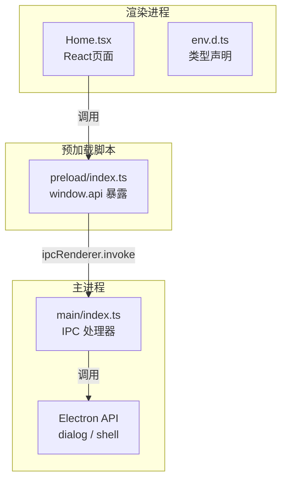
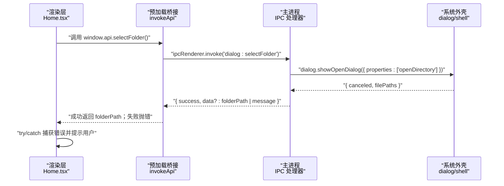
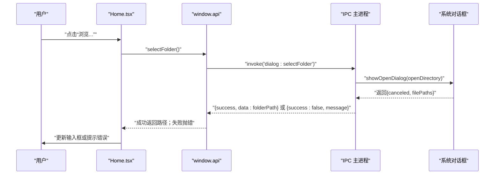
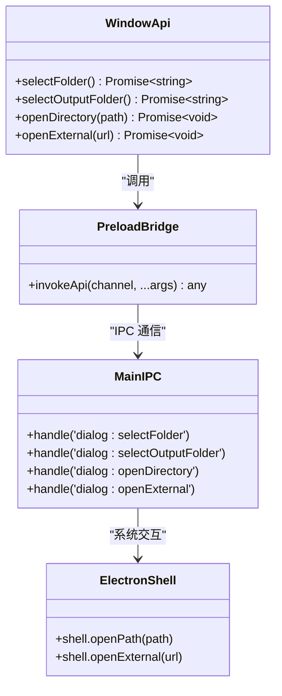

# 文件对话框API

<cite>
**本文引用的文件**
- [src/main/index.ts](file://src/main/index.ts)
- [src/preload/index.ts](file://src/preload/index.ts)
- [src/renderer/src/pages/Home.tsx](file://src/renderer/src/pages/Home.tsx)
- [src/renderer/src/env.d.ts](file://src/renderer/src/env.d.ts)
- [tests/invokeApi.test.ts](file://tests/invokeApi.test.ts)
</cite>

## 目录
1. [简介](#简介)
2. [项目结构](#项目结构)
3. [核心组件](#核心组件)
4. [架构总览](#架构总览)
5. [详细接口定义与使用示例](#详细接口定义与使用示例)
6. [依赖关系分析](#依赖关系分析)
7. [性能与可用性建议](#性能与可用性建议)
8. [故障排查指南](#故障排查指南)
9. [结论](#结论)

## 简介
本文件面向UI开发者与交互设计人员，系统化梳理“文件对话框API”的四个关键接口：selectFolder、selectOutputFolder、openDirectory、openExternal。文档覆盖接口用途、参数与返回值约定、错误处理策略、跨平台行为差异、权限控制要点以及用户体验优化建议，并附带实际调用流程与典型使用场景说明。

## 项目结构
该应用基于 Electron + React + TypeScript 构建，文件对话框相关能力由主进程通过 IPC 暴露，预加载脚本统一封装为 window.api，渲染层直接调用。

图表来源
- [src/main/index.ts:100-378](file://src/main/index.ts#L100-L378)
- [src/preload/index.ts:20-31](file://src/preload/index.ts#L20-L31)
- [src/renderer/src/pages/Home.tsx:112-139](file://src/renderer/src/pages/Home.tsx#L112-L139)
- [src/renderer/src/env.d.ts:7-15](file://src/renderer/src/env.d.ts#L7-L15)

章节来源
- [src/main/index.ts:100-378](file://src/main/index.ts#L100-L378)
- [src/preload/index.ts:20-31](file://src/preload/index.ts#L20-L31)
- [src/renderer/src/pages/Home.tsx:112-139](file://src/renderer/src/pages/Home.tsx#L112-L139)
- [src/renderer/src/env.d.ts:7-15](file://src/renderer/src/env.d.ts#L7-L15)

## 核心组件
- 主进程 IPC 处理器：实现 selectFolder、selectOutputFolder、openDirectory、openExternal 四个通道，返回统一格式 { success, data?, message? }。
- 预加载桥接：将上述通道包装为 window.api 方法，并在 invokeApi 中自动解包成功/失败结果（成功返回 data，失败抛出 Error）。
- 渲染层调用：在 Home.tsx 中以 async/await 方式调用 window.api 对应方法，结合 Ant Design 提示用户操作结果。

章节来源
- [src/main/index.ts:112-124](file://src/main/index.ts#L112-L124)
- [src/main/index.ts:347-365](file://src/main/index.ts#L347-L365)
- [src/main/index.ts:367-378](file://src/main/index.ts#L367-L378)
- [src/preload/index.ts:9-18](file://src/preload/index.ts#L9-L18)
- [src/preload/index.ts:26-30](file://src/preload/index.ts#L26-L30)
- [src/renderer/src/pages/Home.tsx:112-139](file://src/renderer/src/pages/Home.tsx#L112-L139)

## 架构总览
下图展示了从渲染层到系统外壳的完整调用链路，包括错误路径与返回值归一化。

图表来源
- [src/preload/index.ts:9-18](file://src/preload/index.ts#L9-L18)
- [src/main/index.ts:112-124](file://src/main/index.ts#L112-L124)
- [src/renderer/src/pages/Home.tsx:112-129](file://src/renderer/src/pages/Home.tsx#L112-L129)

## 详细接口定义与使用示例

### 通用约定
- 调用方式：所有接口均通过 window.api 暴露，采用 Promise 风格。
- 返回值：
  - 成功：返回 data 字段（例如文件夹路径字符串或 undefined）。
  - 失败：抛出 Error，message 来自后端返回的 message 或默认“操作失败”。
- 错误处理：建议在调用处使用 try/catch 捕获错误，并通过 UI 提示用户。

章节来源
- [src/preload/index.ts:9-18](file://src/preload/index.ts#L9-L18)
- [tests/invokeApi.test.ts:24-69](file://tests/invokeApi.test.ts#L24-L69)

### selectFolder
- 用途：选择输入文件夹（用于扫描视频片段）。
- 参数：无。
- 返回值：Promise<string>，成功时返回所选文件夹路径字符串。
- 行为细节：
  - 内部使用系统目录选择器，仅允许选择目录。
  - 若用户取消或未选择，返回失败并携带消息。
  - 成功后会持久化保存该路径（作为配置项），便于下次启动自动恢复。
- 典型用法：
  - 点击“浏览...”按钮后调用，获取路径并更新输入框显示。
  - 若输出目录为空，可将其默认设置为同一目录。
- 错误处理：
  - 捕获异常后展示“选择文件夹失败”等提示。

章节来源
- [src/main/index.ts:112-124](file://src/main/index.ts#L112-L124)
- [src/preload/index.ts:27](file://src/preload/index.ts#L27)
- [src/renderer/src/pages/Home.tsx:112-129](file://src/renderer/src/pages/Home.tsx#L112-L129)
- [src/renderer/src/env.d.ts:12](file://src/renderer/src/env.d.ts#L12)

### selectOutputFolder
- 用途：选择输出文件夹（合并后的 MP4 保存位置）。
- 参数：无。
- 返回值：Promise<string>，成功时返回所选文件夹路径字符串。
- 行为细节：
  - 内部使用系统目录选择器，仅允许选择目录。
  - 若用户取消或未选择，返回失败并携带消息。
  - 成功后会持久化保存该路径（作为配置项）。
- 典型用法：
  - 点击“浏览...”按钮后调用，获取路径并更新输出框显示。
- 错误处理：
  - 捕获异常后展示“选择输出文件夹失败”等提示。

章节来源
- [src/main/index.ts:367-378](file://src/main/index.ts#L367-L378)
- [src/preload/index.ts:28](file://src/preload/index.ts#L28)
- [src/renderer/src/pages/Home.tsx:131-139](file://src/renderer/src/pages/Home.tsx#L131-L139)
- [src/renderer/src/env.d.ts:13](file://src/renderer/src/env.d.ts#L13)

### openDirectory
- 用途：打开指定目录（常用于快速查看输出结果）。
- 参数：path: string，目标目录的绝对路径。
- 返回值：Promise<void>，成功时无返回值；失败时抛出错误。
- 行为细节：
  - 调用系统外壳打开目录。
  - 若路径无效或不可访问，返回失败并携带错误信息。
- 典型用法：
  - 合并完成后根据设置自动打开输出目录。
  - 用户手动点击“打开目录”按钮查看当前输入目录。
- 错误处理：
  - 捕获异常后展示“打开目录失败”等提示。

章节来源
- [src/main/index.ts:347-355](file://src/main/index.ts#L347-L355)
- [src/preload/index.ts:29](file://src/preload/index.ts#L29)
- [src/renderer/src/pages/Home.tsx:300-311](file://src/renderer/src/pages/Home.tsx#L300-L311)
- [src/renderer/src/env.d.ts:14](file://src/renderer/src/env.d.ts#L14)

### openExternal
- 用途：在系统默认浏览器中打开外部链接（如投稿页面、帮助文档等）。
- 参数：url: string，合法的 URL 字符串。
- 返回值：Promise<void>，成功时无返回值；失败时抛出错误。
- 行为细节：
  - 调用系统外壳打开链接。
  - 若链接非法或系统无法打开，返回失败并携带错误信息。
- 典型用法：
  - 合并完成后根据设置自动打开 B站投稿页面。
  - 在窗口内点击外链时统一交由系统处理。
- 错误处理：
  - 捕获异常后展示“打开链接失败”等提示。

章节来源
- [src/main/index.ts:357-365](file://src/main/index.ts#L357-L365)
- [src/preload/index.ts:30](file://src/preload/index.ts#L30)
- [src/renderer/src/pages/Home.tsx:270-284](file://src/renderer/src/pages/Home.tsx#L270-L284)
- [src/renderer/src/env.d.ts:15](file://src/renderer/src/env.d.ts#L15)

### 调用时序图（以 selectFolder 为例）

图表来源
- [src/preload/index.ts:9-18](file://src/preload/index.ts#L9-L18)
- [src/main/index.ts:112-124](file://src/main/index.ts#L112-L124)
- [src/renderer/src/pages/Home.tsx:112-129](file://src/renderer/src/pages/Home.tsx#L112-L129)

## 依赖关系分析
- 渲染层依赖预加载桥接暴露的 window.api 方法，类型定义位于 env.d.ts。
- 预加载桥接负责统一解包 IPC 返回结果，保证上层无需关心后端返回格式。
- 主进程通过 Electron 的 dialog 和 shell 模块与系统交互。

图表来源
- [src/renderer/src/env.d.ts:7-15](file://src/renderer/src/env.d.ts#L7-L15)
- [src/preload/index.ts:9-18](file://src/preload/index.ts#L9-L18)
- [src/main/index.ts:112-124](file://src/main/index.ts#L112-L124)
- [src/main/index.ts:347-365](file://src/main/index.ts#L347-L365)
- [src/main/index.ts:367-378](file://src/main/index.ts#L367-L378)

章节来源
- [src/renderer/src/env.d.ts:7-15](file://src/renderer/src/env.d.ts#L7-L15)
- [src/preload/index.ts:9-18](file://src/preload/index.ts#L9-L18)
- [src/main/index.ts:112-124](file://src/main/index.ts#L112-L124)
- [src/main/index.ts:347-365](file://src/main/index.ts#L347-L365)
- [src/main/index.ts:367-378](file://src/main/index.ts#L367-L378)

## 性能与可用性建议
- 避免阻塞 UI：目录选择与系统外壳调用均为异步，渲染层应使用 await 并配合 loading 状态提升体验。
- 合理默认值：首次选择输入目录时可同时默认输出目录，减少用户操作步骤。
- 进度与反馈：对耗时操作（如后续合并）提供明确的状态提示与错误信息，增强可感知性。
- 错误提示本地化：统一使用友好的中文提示文案，避免技术术语。

[本节为通用建议，不直接分析具体文件]

## 故障排查指南
- 常见错误来源
  - 用户取消选择：返回失败并携带消息，应在 UI 层静默处理或提示“未选择文件夹”。
  - 路径无效或不可访问：openDirectory/openExternal 可能抛出错误，需捕获并提示。
  - 网络或系统限制：openExternal 在某些环境可能被安全策略拦截。
- 调试建议
  - 检查 window.api 是否可用（开发环境下确保 preload 正确注入）。
  - 确认 IPC 通道名称一致且未被误改。
  - 查看主进程日志中的错误信息，定位具体失败原因。

章节来源
- [src/main/index.ts:112-124](file://src/main/index.ts#L112-L124)
- [src/main/index.ts:347-365](file://src/main/index.ts#L347-L365)
- [src/main/index.ts:367-378](file://src/main/index.ts#L367-L378)
- [src/preload/index.ts:9-18](file://src/preload/index.ts#L9-L18)
- [tests/invokeApi.test.ts:40-48](file://tests/invokeApi.test.ts#L40-L48)

## 结论
本文档围绕 selectFolder、selectOutputFolder、openDirectory、openExternal 四个接口，给出了完整的定义、调用约定、错误处理与使用示例，并结合实际代码路径说明了其在 Electron 架构中的职责划分与数据流向。遵循统一的返回值与错误模型，有助于在 UI 层获得一致的调用体验与健壮的错误处理能力。