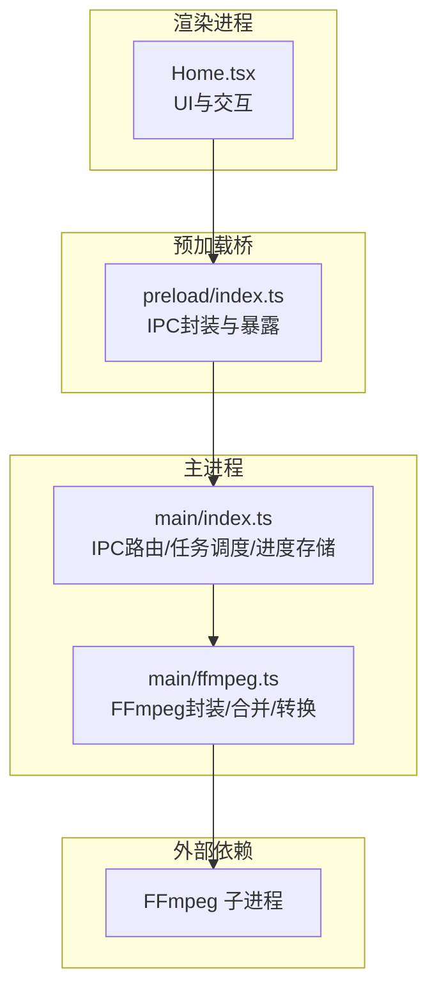
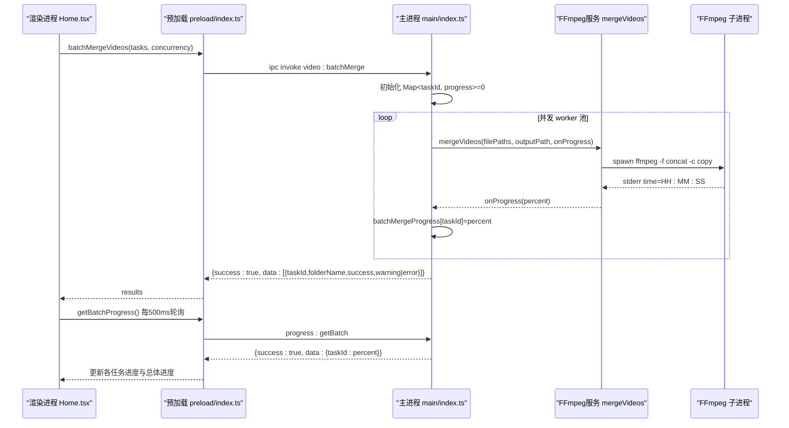
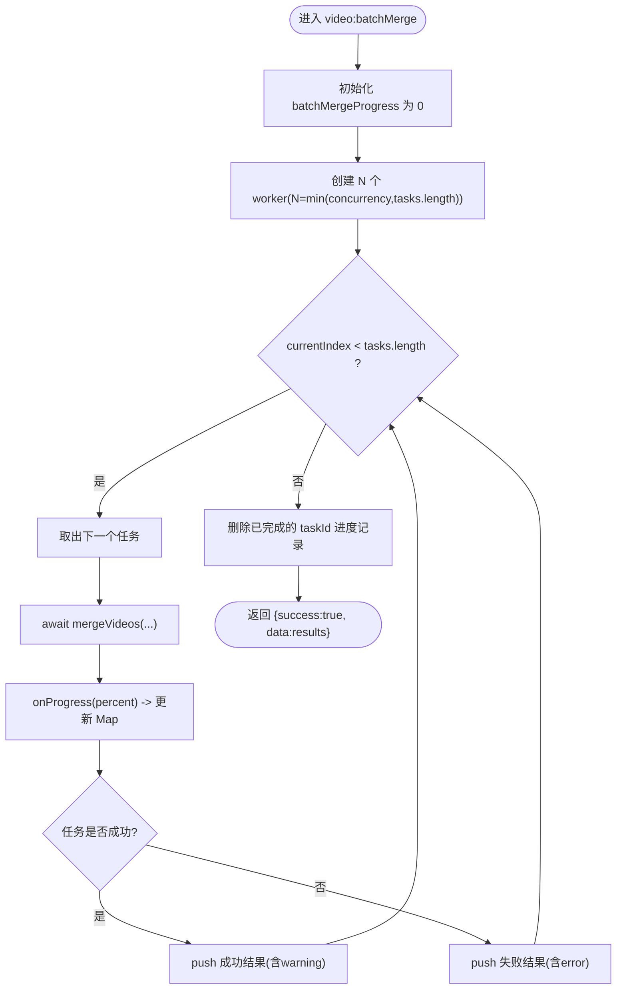
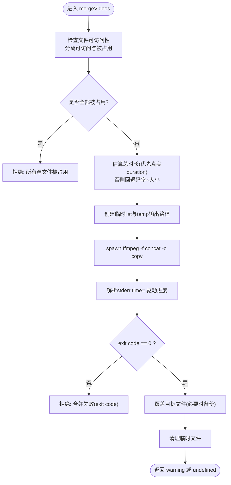
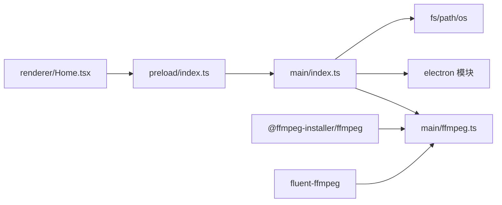

# 批量处理API

<cite>
**本文引用的文件**   
- [src/main/index.ts](file://src/main/index.ts)
- [src/main/ffmpeg.ts](file://src/main/ffmpeg.ts)
- [src/preload/index.ts](file://src/preload/index.ts)
- [src/renderer/src/pages/Home.tsx](file://src/renderer/src/pages/Home.tsx)
- [package.json](file://package.json)
</cite>

## 目录
1. [简介](#简介)
2. [项目结构](#项目结构)
3. [核心组件](#核心组件)
4. [架构总览](#架构总览)
5. [详细组件分析](#详细组件分析)
6. [依赖关系分析](#依赖关系分析)
7. [性能与资源管理](#性能与资源管理)
8. [故障排查指南](#故障排查指南)
9. [结论](#结论)
10. [附录：接口定义与使用示例](#附录接口定义与使用示例)

## 简介
本文件面向需要处理大量视频文件的开发者，系统化说明“批量并行处理”能力，重点围绕 batchMergeVideos 接口的实现原理、任务队列管理、并发控制、进度监控、错误重试与失败恢复策略、内存与磁盘空间管理以及性能优化方案。文档同时提供完整的接口定义、任务配置和结果汇总方法，帮助快速集成与落地。

## 项目结构
本项目基于 Electron 构建，主进程负责 IPC 路由、任务调度与 FFmpeg 子进程调用；预加载脚本统一封装 IPC 调用并暴露给渲染进程；渲染层提供 UI 与交互逻辑。

图表来源
- [src/renderer/src/pages/Home.tsx:200-298](file://src/renderer/src/pages/Home.tsx#L200-L298)
- [src/preload/index.ts:20-49](file://src/preload/index.ts#L20-L49)
- [src/main/index.ts:405-478](file://src/main/index.ts#L405-L478)
- [src/main/ffmpeg.ts:87-245](file://src/main/ffmpeg.ts#L87-L245)

章节来源
- [src/main/index.ts:1-120](file://src/main/index.ts#L1-L120)
- [src/main/ffmpeg.ts:1-120](file://src/main/ffmpeg.ts#L1-L120)
- [src/preload/index.ts:1-64](file://src/preload/index.ts#L1-L64)
- [src/renderer/src/pages/Home.tsx:1-200](file://src/renderer/src/pages/Home.tsx#L1-L200)
- [package.json:1-42](file://package.json#L1-L42)

## 核心组件
- 批量合并入口（IPC）：video:batchMerge
- 任务执行器：worker 工作函数 + Promise.all 并发池
- 进度存储：Map<taskId, progress>
- 底层合并：mergeVideos（基于 concat demuxer 的流拷贝）
- 进度查询：progress:getBatch
- 前端轮询：每 500ms 拉取批量进度并计算总体进度

章节来源
- [src/main/index.ts:405-478](file://src/main/index.ts#L405-L478)
- [src/main/ffmpeg.ts:87-245](file://src/main/ffmpeg.ts#L87-L245)
- [src/preload/index.ts:42-49](file://src/preload/index.ts#L42-L49)
- [src/renderer/src/pages/Home.tsx:200-298](file://src/renderer/src/pages/Home.tsx#L200-L298)

## 架构总览
下图展示从渲染进程发起批量合并到主进程调度、并发执行、进度上报与结果汇总的完整时序。

图表来源
- [src/renderer/src/pages/Home.tsx:200-298](file://src/renderer/src/pages/Home.tsx#L200-L298)
- [src/preload/index.ts:42-49](file://src/preload/index.ts#L42-L49)
- [src/main/index.ts:405-478](file://src/main/index.ts#L405-L478)
- [src/main/ffmpeg.ts:162-245](file://src/main/ffmpeg.ts#L162-L245)

## 详细组件分析

### 1) 批量合并 API：video:batchMerge
- 职责
  - 接收任务列表与并发数
  - 为每个任务初始化进度为 0
  - 启动 N 个 worker（N=min(concurrency, tasks.length)），按顺序从任务队列中取出任务执行
  - 通过回调将单个任务的实时进度写入全局 Map
  - 收集成功/失败结果，完成后清理进度记录并返回汇总数据
- 并发模型
  - 基于 Promise.all 启动固定数量的异步 worker
  - 共享索引 currentIndex 保证任务不重复分配
- 进度语义
  - 0~100：正常进行中
  - 100：完成
  - -1：失败
- 错误处理
  - 捕获异常后标记 taskId 为 -1，并将 error.message 写入结果
  - 不影响其他任务继续执行

章节来源
- [src/main/index.ts:405-478](file://src/main/index.ts#L405-L478)

#### 并发控制流程图

图表来源
- [src/main/index.ts:405-478](file://src/main/index.ts#L405-L478)

### 2) 底层合并：mergeVideos
- 职责
  - 校验源文件可访问性，跳过被占用的片段
  - 估算总时长用于进度计算（优先真实时长，回退码率×大小估算）
  - 生成临时 list 文件与临时输出文件
  - 使用 concat demuxer 直接拼接 FLV 并输出 MP4（stream copy，不重新编码）
  - 解析 FFmpeg stderr 中的 time= 字段驱动进度回调
  - 成功后原子替换目标文件（必要时备份旧文件）
- 超时保护
  - 设置 30 分钟超时，超时则清理临时文件并拒绝
- 错误处理
  - 对 exit code 非 0 的情况，保留最后若干行日志并拒绝
  - 对 IO 错误进行明确提示

章节来源
- [src/main/ffmpeg.ts:87-245](file://src/main/ffmpeg.ts#L87-L245)

#### 合并算法流程

图表来源
- [src/main/ffmpeg.ts:87-245](file://src/main/ffmpeg.ts#L87-L245)

### 3) 进度查询 API：progress:getBatch
- 职责
  - 返回当前正在进行的任务进度快照
  - 值域：0~100 表示百分比，-1 表示失败
- 使用方式
  - 渲染进程定时轮询（例如每 500ms）
  - 根据各任务进度计算总体进度（仅统计非负值）

章节来源
- [src/main/index.ts:471-478](file://src/main/index.ts#L471-L478)
- [src/renderer/src/pages/Home.tsx:221-236](file://src/renderer/src/pages/Home.tsx#L221-L236)

### 4) 预加载桥：api.batchMergeVideos / api.getBatchProgress
- 职责
  - 统一封装 IPC 调用，自动解包 {success,data,message}
  - 暴露 batchMergeVideos 与 getBatchProgress 供渲染进程使用
- 错误传播
  - 当后端返回 success=false 时抛出 Error(message)

章节来源
- [src/preload/index.ts:42-49](file://src/preload/index.ts#L42-L49)

### 5) 渲染端集成：Home.tsx
- 任务构造
  - 根据选中的分组生成任务数组，包含 taskId、filePaths、outputPath、folderName
- 并发参数
  - 支持用户配置并发数（默认 3）
- 进度轮询
  - 每 500ms 调用 getBatchProgress，更新各任务进度与总体进度
- 结果汇总
  - 统计成功/失败数量，移除已完成分组，可选打开输出目录与投稿页面

章节来源
- [src/renderer/src/pages/Home.tsx:200-298](file://src/renderer/src/pages/Home.tsx#L200-L298)

## 依赖关系分析
- 运行时依赖
  - @ffmpeg-installer/ffmpeg：提供打包后可用的 FFmpeg 二进制
  - fluent-ffmpeg：封装 FFmpeg 命令与事件（主要用于 convertToMp4）
- 主进程依赖
  - electron：窗口、IPC、文件系统、对话框等系统能力
  - fs/path/os：文件扫描、路径操作、临时目录
- 预加载与渲染
  - contextBridge/exposeInMainWorld：安全暴露 API 到渲染进程
  - antd/react：UI 组件与状态管理

图表来源
- [src/main/index.ts:1-120](file://src/main/index.ts#L1-L120)
- [src/main/ffmpeg.ts:1-20](file://src/main/ffmpeg.ts#L1-L20)
- [src/preload/index.ts:1-20](file://src/preload/index.ts#L1-L20)
- [package.json:17-20](file://package.json#L17-L20)

章节来源
- [package.json:1-42](file://package.json#L1-L42)

## 性能与资源管理
- 并发控制
  - 通过 concurrency 限制同时运行的 worker 数量，避免过多 FFmpeg 子进程争用 CPU/IO
  - 建议值：CPU 核数 × 0.8~1.2，结合磁盘 I/O 能力调优
- 进度估算
  - 优先使用首个文件的真实 duration 推算总时长；若不可用，回退为“首文件大小/时长”估算码率再乘以总大小
  - 注意：VBR 场景下估算可能失准，但不会阻塞处理
- 超时保护
  - 单次合并最长 30 分钟，防止长时间挂起
- 临时文件与磁盘空间
  - 使用系统临时目录存放 list 与 temp 输出，合并成功后复制到目标路径并清理
  - 建议在批处理前检查目标盘剩余空间，确保大于最大单组输出体积
- 内存管理
  - 合并采用 stream copy，不引入额外解码/编码内存峰值
  - 批量任务结束后立即清理 Map 中的进度记录，避免长期驻留
- 负载均衡
  - 当前为简单 FIFO 分配，适合大多数场景
  - 如需更细粒度负载，可按任务大小或预估时长加权分配

章节来源
- [src/main/index.ts:405-478](file://src/main/index.ts#L405-L478)
- [src/main/ffmpeg.ts:127-144](file://src/main/ffmpeg.ts#L127-L144)
- [src/main/ffmpeg.ts:154-161](file://src/main/ffmpeg.ts#L154-L161)
- [src/main/ffmpeg.ts:198-234](file://src/main/ffmpeg.ts#L198-L234)

## 故障排查指南
- 常见错误与定位
  - “所有源文件都被占用”：部分片段仍在录制中，等待或跳过后再试
  - “合并失败 (exit code X)”：查看 FFmpeg 最后若干行 stderr 日志，确认输入一致性/损坏情况
  - “无法覆盖已有文件”：目标文件被占用或权限不足，先关闭占用或手动清理
  - “启动 FFmpeg 失败”：检查 FFmpeg 安装路径与权限
- 进度异常
  - 进度始终为 0：可能是时长探测失败且无有效时间信息，属预期回退行为
  - 进度为 -1：对应任务失败，请查看该任务 error 消息
- 批量结果汇总
  - 成功：success=true，可能有 warning（如跳过了正在录制的片段）
  - 失败：success=false，error 包含具体原因
- 调试建议
  - 降低并发数逐步验证
  - 在渲染端打印 getBatchProgress 返回值，观察各 taskId 的状态变化
  - 关注临时目录是否存在残留文件，确认清理逻辑是否生效

章节来源
- [src/main/ffmpeg.ts:110-118](file://src/main/ffmpeg.ts#L110-L118)
- [src/main/ffmpeg.ts:200-206](file://src/main/ffmpeg.ts#L200-L206)
- [src/main/ffmpeg.ts:225-234](file://src/main/ffmpeg.ts#L225-L234)
- [src/main/ffmpeg.ts:237-244](file://src/main/ffmpeg.ts#L237-L244)
- [src/main/index.ts:447-455](file://src/main/index.ts#L447-L455)

## 结论
本实现以轻量、稳定为核心目标，通过固定并发池与 FIFO 任务分配，配合实时进度回调与轮询机制，实现了高效可靠的批量视频合并能力。对于大规模场景，建议结合磁盘 I/O 与 CPU 能力调整并发度，并在批处理前进行空间与文件可用性检查。

## 附录：接口定义与使用示例

### 接口定义
- 批量合并
  - 通道：video:batchMerge
  - 入参
    - tasks: Array<{ taskId: string; filePaths: string[]; outputPath: string; folderName: string }>
    - concurrency?: number（默认 3）
  - 出参
    - { success: true, data: Array<{ taskId: string; folderName: string; success: boolean; warning?: string; error?: string }> }
- 批量进度查询
  - 通道：progress:getBatch
  - 入参：无
  - 出参：{ success: true, data: Record<string, number> }（key=taskId，value=0~100 或 -1）

章节来源
- [src/main/index.ts:405-478](file://src/main/index.ts#L405-L478)
- [src/preload/index.ts:42-49](file://src/preload/index.ts#L42-L49)

### 任务配置建议
- 并发数
  - 小盘/机械盘：2~4
  - SSD/NVMe：4~8
  - 多核 CPU：不超过物理核心数
- 任务拆分
  - 按直播场次/日期+标题分组，每组内片段顺序按时间戳排序
- 命名规范
  - 输出文件名建议包含日期、标题与时间戳，便于溯源

章节来源
- [src/renderer/src/pages/Home.tsx:205-219](file://src/renderer/src/pages/Home.tsx#L205-L219)

### 进度追踪与实时状态更新
- 轮询频率：500ms
- 总体进度计算：对所有非负任务进度求平均
- 状态映射
  - 100：成功
  - -1：失败
  - 0~99：进行中

章节来源
- [src/renderer/src/pages/Home.tsx:221-236](file://src/renderer/src/pages/Home.tsx#L221-L236)

### 错误重试与失败恢复策略
- 当前策略
  - 单个任务失败不影响其他任务
  - 失败任务标记为 -1，并提供 error 消息
- 建议扩展
  - 在渲染层增加重试按钮，针对失败任务二次提交
  - 在主进程侧增加指数退避与最大重试次数
  - 失败任务持久化至本地，应用重启后恢复队列

章节来源
- [src/main/index.ts:447-455](file://src/main/index.ts#L447-L455)

### 完整批量处理示例（步骤）
- 选择输入文件夹与输出文件夹
- 扫描并按日期+标题分组
- 勾选需要合并的分组
- 设置并发数
- 点击“一键合并选中视频”
- 轮询查看各任务进度与总体进度
- 完成后查看结果，必要时打开输出目录

章节来源
- [src/renderer/src/pages/Home.tsx:183-298](file://src/renderer/src/pages/Home.tsx#L183-L298)