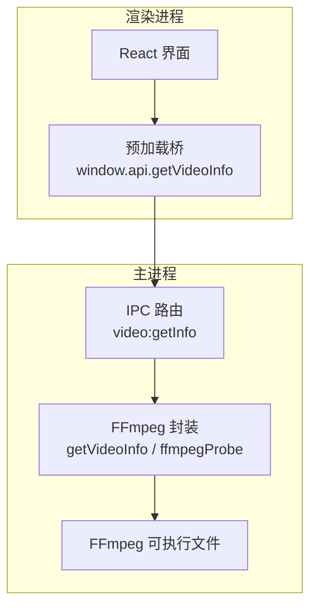
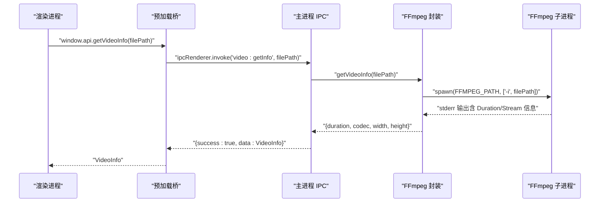
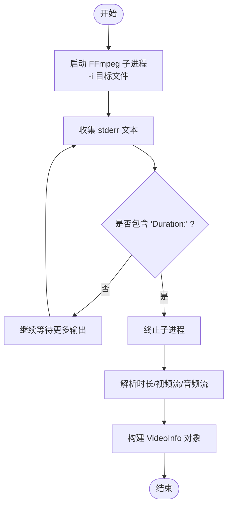
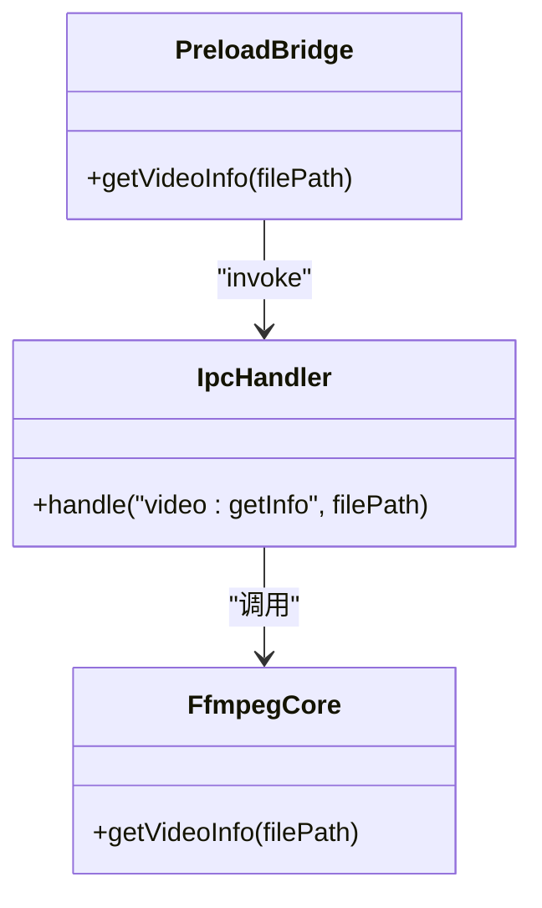
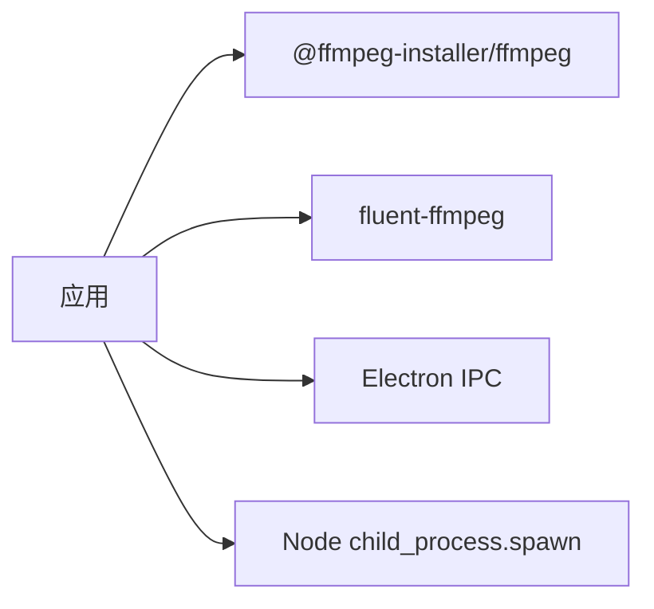

# 视频信息获取API

<cite>
**本文引用的文件**   
- [src/main/ffmpeg.ts](file://src/main/ffmpeg.ts)
- [src/main/index.ts](file://src/main/index.ts)
- [src/preload/index.ts](file://src/preload/index.ts)
- [src/renderer/src/env.d.ts](file://src/renderer/src/env.d.ts)
- [tests/ffmpegParsing.test.ts](file://tests/ffmpegParsing.test.ts)
- [package.json](file://package.json)
</cite>

## 目录
1. [简介](#简介)
2. [项目结构](#项目结构)
3. [核心组件](#核心组件)
4. [架构总览](#架构总览)
5. [详细组件分析](#详细组件分析)
6. [依赖关系分析](#依赖关系分析)
7. [性能考量](#性能考量)
8. [故障排查指南](#故障排查指南)
9. [结论](#结论)
10. [附录：接口定义与调用示例](#附录接口定义与调用示例)

## 简介
本文件面向需要获取视频基础信息的开发者，详细说明 getVideoInfo 接口的实现原理、参数与返回值格式、错误处理机制、异常与边界条件、以及与 FFmpeg 的集成方式和视频探测技术。该接口通过 Electron 主进程调用 FFmpeg，快速解析视频元数据（时长、编码、分辨率等），并以统一的 IPC 返回结构暴露给渲染进程使用。

## 项目结构
本项目为基于 Electron + React 的视频合并工具，getVideoInfo 相关代码主要分布在以下位置：
- 主进程逻辑与 IPC 路由：src/main/index.ts
- FFmpeg 封装与视频探测：src/main/ffmpeg.ts
- 预加载桥接与类型声明：src/preload/index.ts、src/renderer/src/env.d.ts
- 单元测试（FFmpeg 输出解析）：tests/ffmpegParsing.test.ts
- 依赖说明：package.json

图表来源
- [src/main/index.ts:380-388](file://src/main/index.ts#L380-L388)
- [src/main/ffmpeg.ts:60-77](file://src/main/ffmpeg.ts#L60-L77)
- [src/preload/index.ts:36](file://src/preload/index.ts#L36)
- [src/renderer/src/env.d.ts:19](file://src/renderer/src/env.d.ts#L19)

章节来源
- [src/main/index.ts:1-530](file://src/main/index.ts#L1-L530)
- [src/main/ffmpeg.ts:1-305](file://src/main/ffmpeg.ts#L1-L305)
- [src/preload/index.ts:1-64](file://src/preload/index.ts#L1-L64)
- [src/renderer/src/env.d.ts:1-73](file://src/renderer/src/env.d.ts#L1-L73)
- [tests/ffmpegParsing.test.ts:1-148](file://tests/ffmpegParsing.test.ts#L1-L148)
- [package.json:1-42](file://package.json#L1-L42)

## 核心组件
- FFmpeg 封装模块（主进程）
  - 负责启动 FFmpeg 子进程，仅读取文件头并尽快终止，以毫秒级完成探测。
  - 提供 getVideoInfo 对外方法，返回 duration、codec、width、height。
- IPC 路由（主进程）
  - 监听 video:getInfo 通道，调用 FFmpeg 封装并统一返回 { success, data } 结构。
- 预加载桥（preload）
  - 将 getVideoInfo 暴露到 window.api，供渲染进程安全调用。
- 类型声明（渲染端）
  - 定义 VideoInfo 接口，包含 duration、codec、width、height。

章节来源
- [src/main/ffmpeg.ts:60-77](file://src/main/ffmpeg.ts#L60-L77)
- [src/main/index.ts:380-388](file://src/main/index.ts#L380-L388)
- [src/preload/index.ts:36](file://src/preload/index.ts#L36)
- [src/renderer/src/env.d.ts:67-72](file://src/renderer/src/env.d.ts#L67-L72)

## 架构总览
getVideoInfo 的端到端调用流程如下：

图表来源
- [src/preload/index.ts:36](file://src/preload/index.ts#L36)
- [src/main/index.ts:380-388](file://src/main/index.ts#L380-L388)
- [src/main/ffmpeg.ts:12-58](file://src/main/ffmpeg.ts#L12-L58)
- [src/main/ffmpeg.ts:60-77](file://src/main/ffmpeg.ts#L60-L77)

## 详细组件分析

### FFmpeg 封装与视频探测
- 快速探测策略
  - 使用 spawn 直接启动 FFmpeg 子进程，传入 -i 参数进行输入探测。
  - 监听 stderr，一旦检测到包含 Duration 的行即立即 kill 子进程，避免扫描整个文件，达到毫秒级响应。
- 元数据解析
  - 从 stderr 中通过正则提取：
    - 时长：Duration HH:MM:SS.ss → 转换为秒数
    - 视频流：Stream ... Video: <codec>, <W>x<H>
    - 音频流：Stream ... Audio: ...
  - 若未匹配到视频或音频信息，则返回默认值（如 codec 为“未知”，宽高为 0）。
- 对外接口
  - getVideoInfo(filePath): Promise<{ duration, codec, width, height }>
  - 内部委托 ffmpegProbe 完成探测并过滤出所需字段。

图表来源
- [src/main/ffmpeg.ts:12-58](file://src/main/ffmpeg.ts#L12-L58)
- [src/main/ffmpeg.ts:60-77](file://src/main/ffmpeg.ts#L60-L77)

章节来源
- [src/main/ffmpeg.ts:12-58](file://src/main/ffmpeg.ts#L12-L58)
- [src/main/ffmpeg.ts:60-77](file://src/main/ffmpeg.ts#L60-L77)
- [tests/ffmpegParsing.test.ts:8-55](file://tests/ffmpegParsing.test.ts#L8-L55)
- [tests/ffmpegParsing.test.ts:99-147](file://tests/ffmpegParsing.test.ts#L99-L147)

### IPC 路由与统一返回结构
- 主进程注册 video:getInfo 处理器
  - 接收 filePath 参数，调用 getVideoInfo
  - 捕获异常并返回 { success: false, message }
  - 成功时返回 { success: true, data: VideoInfo }
- 预加载桥自动解包
  - 对 { success, data?, message? } 结构进行判断
  - 失败时抛出错误；成功时返回 data

图表来源
- [src/main/index.ts:380-388](file://src/main/index.ts#L380-L388)
- [src/preload/index.ts:9-18](file://src/preload/index.ts#L9-L18)
- [src/preload/index.ts:36](file://src/preload/index.ts#L36)

章节来源
- [src/main/index.ts:380-388](file://src/main/index.ts#L380-L388)
- [src/preload/index.ts:9-18](file://src/preload/index.ts#L9-L18)

### 类型定义与前端契约
- 渲染端类型声明
  - VideoInfo 接口包含 duration、codec、width、height
  - Window.api.getVideoInfo 签名明确入参与返回类型
- 一致性保障
  - 主进程返回结构与预加载桥解包逻辑一致，确保前端可直接消费 data

章节来源
- [src/renderer/src/env.d.ts:67-72](file://src/renderer/src/env.d.ts#L67-L72)
- [src/renderer/src/env.d.ts:19](file://src/renderer/src/env.d.ts#L19)

## 依赖关系分析
- 外部依赖
  - @ffmpeg-installer/ffmpeg：提供 FFmpeg 二进制路径
  - fluent-ffmpeg：用于转码/转换场景（当前 getVideoInfo 不使用）
- 运行时路径适配
  - 打包后需将 app.asar 路径重定向至 app.asar.unpacked，以便 spawn 能正确启动 FFmpeg

图表来源
- [package.json:17-20](file://package.json#L17-L20)
- [src/main/ffmpeg.ts:1-10](file://src/main/ffmpeg.ts#L1-L10)

章节来源
- [package.json:17-20](file://package.json#L17-L20)
- [src/main/ffmpeg.ts:1-10](file://src/main/ffmpeg.ts#L1-L10)

## 性能考量
- 只读头部、尽早终止
  - 通过检测 stderr 中的 Duration 行后立即 kill 子进程，避免全文件扫描，显著降低 I/O 与 CPU 开销。
- 正则解析轻量
  - 仅对必要字段进行正则匹配，减少字符串处理成本。
- 并发友好
  - 单次探测耗时短，适合批量场景下并行调用（注意系统资源限制）。
- 建议
  - 在大量文件探测时，可结合任务队列控制并发度，避免过多子进程同时运行。

[本节为通用性能建议，不直接分析具体文件]

## 故障排查指南
- 常见错误与定位
  - 文件不存在或无权限：主进程会捕获异常并返回 { success:false, message }，请检查路径与权限。
  - FFmpeg 不可用或路径错误：确认 @ffmpeg-installer/ffmpeg 安装成功且路径已重定向到 unpacked 目录。
  - 非视频文件或损坏：可能无法解析到 Duration/Stream，返回默认值（duration=0，codec="未知"，宽高=0）。
- 调试手段
  - 查看主进程日志：合并/转换逻辑中包含命令打印与错误片段输出，便于定位问题。
  - 参考测试用例：tests/ffmpegParsing.test.ts 覆盖了时长、进度、视频流解析的正则行为，可用于对照验证。

章节来源
- [src/main/index.ts:380-388](file://src/main/index.ts#L380-L388)
- [src/main/ffmpeg.ts:1-10](file://src/main/ffmpeg.ts#L1-L10)
- [tests/ffmpegParsing.test.ts:8-55](file://tests/ffmpegParsing.test.ts#L8-L55)
- [tests/ffmpegParsing.test.ts:99-147](file://tests/ffmpegParsing.test.ts#L99-L147)

## 结论
getVideoInfo 接口通过“快速探测 + 正则解析”的方式，以极低延迟获取视频基础信息，并通过 Electron IPC 向渲染进程提供稳定、统一的返回结构。其设计兼顾了性能与健壮性，适用于批量探测与实时展示等场景。

[本节为总结性内容，不直接分析具体文件]

## 附录：接口定义与调用示例

### 接口定义
- 通道名
  - video:getInfo
- 入参
  - filePath: string（视频文件的绝对路径）
- 返回值（主进程统一结构）
  - success: boolean
  - data?: VideoInfo（成功时存在）
  - message?: string（失败时存在）
- VideoInfo 字段
  - duration: number（单位：秒）
  - codec: string（视频编码名称，如 h264；无法识别时为“未知”）
  - width: number（像素）
  - height: number（像素）

章节来源
- [src/main/index.ts:380-388](file://src/main/index.ts#L380-L388)
- [src/renderer/src/env.d.ts:67-72](file://src/renderer/src/env.d.ts#L67-L72)

### 调用示例（渲染进程）
- 基本调用
  - const info = await window.api.getVideoInfo('/path/to/video.flv')
  - 成功后 info 即为 VideoInfo 对象
- 错误处理
  - try { const info = await window.api.getVideoInfo(path); /* 使用 info */ } catch (e) { console.error(e.message); }

章节来源
- [src/preload/index.ts:36](file://src/preload/index.ts#L36)
- [src/preload/index.ts:9-18](file://src/preload/index.ts#L9-L18)

### 结果解析方法
- 时长格式化
  - 将 duration（秒）转换为 hh:mm:ss 或 mm:ss 显示
- 编码与分辨率展示
  - codec 可直接展示；width/height 组合为 WxH 形式
- 边界情况
  - 当 duration=0 或 codec="未知"、宽高=0 时，提示用户文件可能无效或非视频

章节来源
- [tests/ffmpegParsing.test.ts:8-55](file://tests/ffmpegParsing.test.ts#L8-L55)
- [tests/ffmpegParsing.test.ts:99-147](file://tests/ffmpegParsing.test.ts#L99-L147)

### 与 FFmpeg 的集成方式与探测技术
- 集成方式
  - 通过 @ffmpeg-installer/ffmpeg 获取可执行路径，并在打包后将 app.asar 替换为 app.asar.unpacked，确保 spawn 可执行
  - 使用 Node child_process.spawn 启动 FFmpeg，传入 -i 参数进行探测
- 探测技术
  - 监听 stderr，匹配 Duration 行后立刻 kill 子进程
  - 使用正则从 stderr 中提取视频流信息与音频流标记
  - 将解析结果映射为 VideoInfo 返回

章节来源
- [src/main/ffmpeg.ts:1-10](file://src/main/ffmpeg.ts#L1-L10)
- [src/main/ffmpeg.ts:12-58](file://src/main/ffmpeg.ts#L12-L58)
- [src/main/ffmpeg.ts:60-77](file://src/main/ffmpeg.ts#L60-L77)