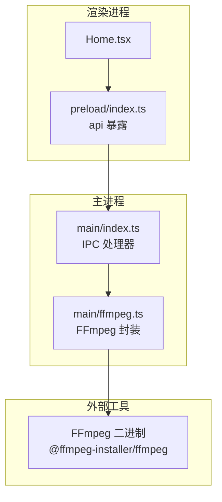
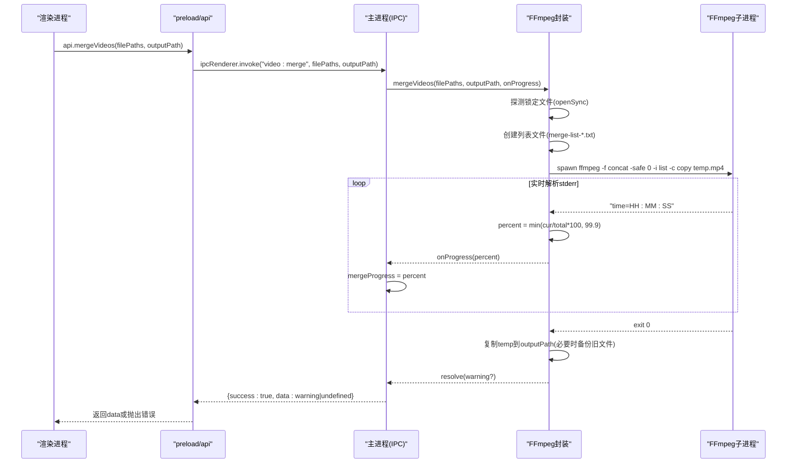
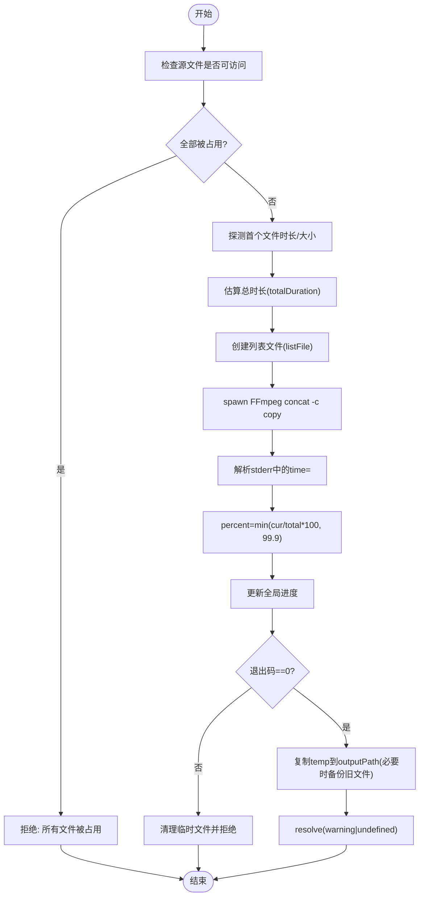
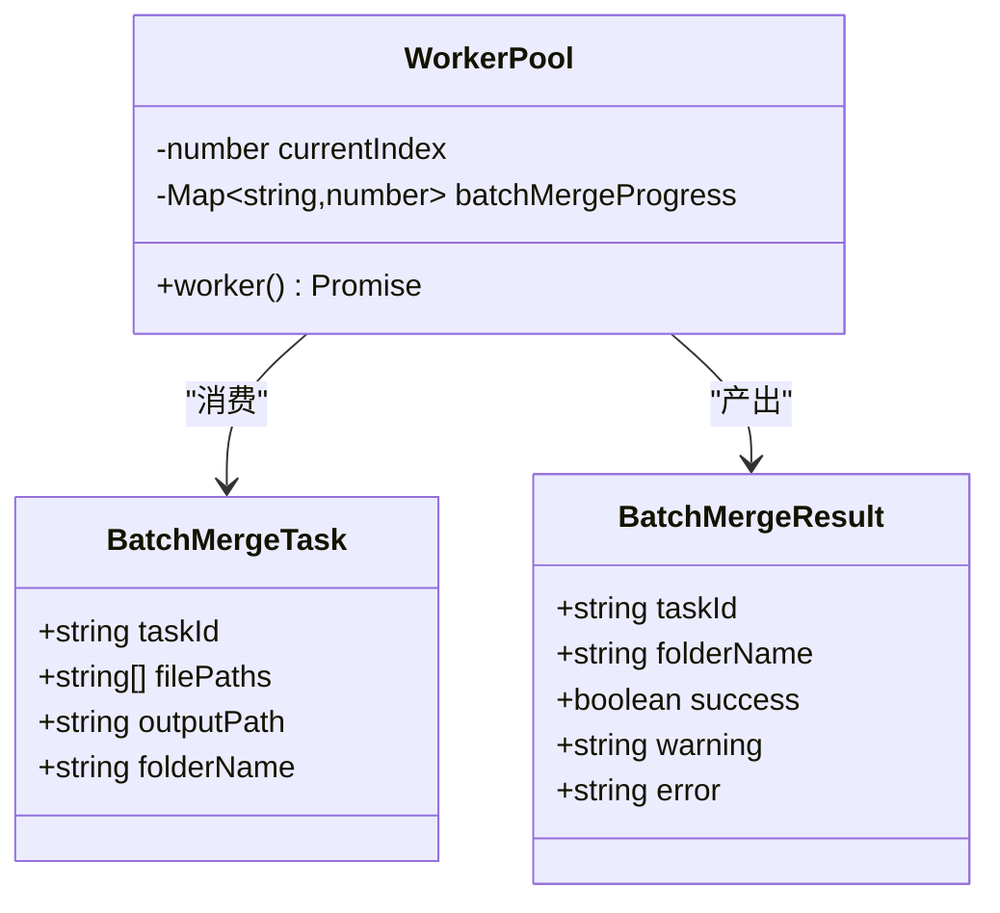
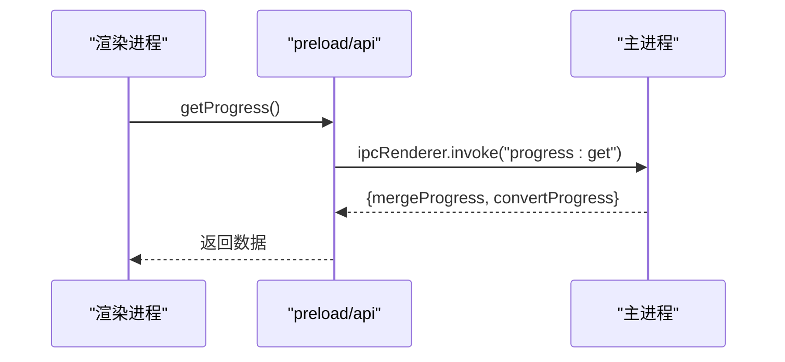
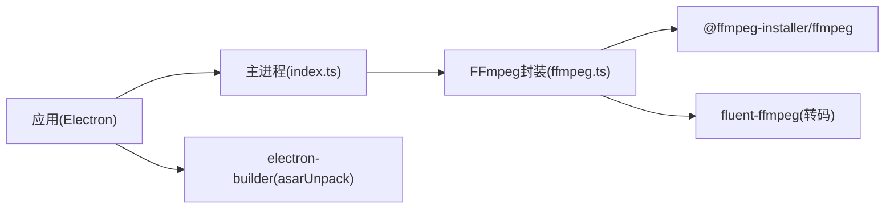

# 视频合并API

<cite>
**本文引用的文件**   
- [src/main/index.ts](file://src/main/index.ts)
- [src/main/ffmpeg.ts](file://src/main/ffmpeg.ts)
- [src/preload/index.ts](file://src/preload/index.ts)
- [package.json](file://package.json)
- [tests/invokeApi.test.ts](file://tests/invokeApi.test.ts)
- [tests/ffmpegParsing.test.ts](file://tests/ffmpegParsing.test.ts)
- [tests/fileGrouping.test.ts](file://tests/fileGrouping.test.ts)
- [tests/parseFileName.test.ts](file://tests/parseFileName.test.ts)
- [产品需求文档.md](file://产品需求文档.md)
</cite>

## 目录
1. [简介](#简介)
2. [项目结构](#项目结构)
3. [核心组件](#核心组件)
4. [架构总览](#架构总览)
5. [详细组件分析](#详细组件分析)
6. [依赖关系分析](#依赖关系分析)
7. [性能与并发](#性能与并发)
8. [错误处理与恢复](#错误处理与恢复)
9. [兼容性说明与编码参数](#兼容性说明与编码参数)
10. [接口定义与调用示例](#接口定义与调用示例)
11. [故障排查指南](#故障排查指南)
12. [结论](#结论)

## 简介
本文件面向需要进行视频拼接处理的开发者，提供“视频合并API”的完整技术说明。重点围绕 mergeVideos 接口的实现原理，包括：
- FFmpeg 流式合并（concat demuxer + stream copy）
- 临时文件管理（列表文件、临时输出、覆盖备份）
- 进度追踪机制（基于 time= 解析与估算策略）
- 并发控制与批量处理（任务队列与并行 worker）
- 资源管理与错误恢复（超时保护、失败清理、已存在输出备份）
- 不同视频格式兼容性与编码参数配置（FLV→MP4 转换）
并提供完整的接口定义、参数约定、返回格式、调用示例与结果验证方法。

## 项目结构
本项目采用 Electron 架构，主进程负责系统能力与 FFmpeg 子进程调度，渲染进程通过 preload 暴露精简 API，测试覆盖核心算法逻辑。

图表来源
- [src/preload/index.ts:21-49](file://src/preload/index.ts#L21-L49)
- [src/main/index.ts:99-498](file://src/main/index.ts#L99-L498)
- [src/main/ffmpeg.ts:1-305](file://src/main/ffmpeg.ts#L1-L305)

章节来源
- [src/main/index.ts:1-530](file://src/main/index.ts#L1-L530)
- [src/main/ffmpeg.ts:1-305](file://src/main/ffmpeg.ts#L1-L305)
- [src/preload/index.ts:1-64](file://src/preload/index.ts#L1-L64)
- [package.json:1-42](file://package.json#L1-L42)

## 核心组件
- 主进程 IPC 层：统一处理前端请求，转发到业务模块，维护全局进度状态，支持批量任务与并发控制。
- FFmpeg 封装层：封装探测、合并、转码等能力；使用 concat demuxer 进行流拷贝合并；使用 fluent-ffmpeg 或 spawn 执行命令；管理临时文件与进度回调。
- 预加载桥接层：将主进程能力以安全方式暴露给渲染进程，统一解包 {success, data?, message?} 响应。

章节来源
- [src/main/index.ts:99-498](file://src/main/index.ts#L99-L498)
- [src/main/ffmpeg.ts:1-305](file://src/main/ffmpeg.ts#L1-L305)
- [src/preload/index.ts:1-64](file://src/preload/index.ts#L1-L64)

## 架构总览
整体流程：渲染进程通过 api.mergeVideos 发起合并请求 → preload 调用 ipcRenderer.invoke('video:merge') → 主进程处理器调用 ffmpeg.mergeVideos → 生成列表文件并启动 FFmpeg 子进程 → 实时解析 stderr 计算进度 → 完成后移动临时输出到目标路径。

图表来源
- [src/preload/index.ts:37-44](file://src/preload/index.ts#L37-L44)
- [src/main/index.ts:391-403](file://src/main/index.ts#L391-L403)
- [src/main/ffmpeg.ts:87-245](file://src/main/ffmpeg.ts#L87-L245)

## 详细组件分析

### 合并流程与进度追踪
- 输入校验与锁定检测：对每个源文件尝试 openSync 读取，区分可访问与锁定文件；若全部锁定则直接拒绝。
- 时长估算：优先基于首个文件的 size/duration 推算总时长；若无有效信息则回退为 0，此时进度仅按时间戳显示占位。
- 列表文件：在系统临时目录生成 merge-list-*.txt，每行一个 file 'path'，用于 concat demuxer。
- 临时输出：在临时目录生成 merge-temp-*.mp4，成功后复制到目标路径；若目标已存在，先尝试删除，失败则重命名为 _backup.mp4。
- 进度解析：从 stderr 中匹配 time=HH:MM:SS.SS，换算为秒数后除以 totalDuration 得到百分比，上限 99.9%。
- 超时保护：30 分钟超时，清理临时文件并拒绝。

图表来源
- [src/main/ffmpeg.ts:92-245](file://src/main/ffmpeg.ts#L92-L245)

章节来源
- [src/main/ffmpeg.ts:87-245](file://src/main/ffmpeg.ts#L87-L245)
- [tests/ffmpegParsing.test.ts:57-97](file://tests/ffmpegParsing.test.ts#L57-L97)

### 批量合并与并发控制
- 任务模型：每个任务包含 taskId、filePaths、outputPath、folderName。
- 并发控制：根据 concurrency 参数启动多个 worker，共享 currentIndex 原子推进任务队列。
- 进度聚合：Map<taskId, progress> 记录各任务进度，渲染端轮询获取。
- 失败标记：单个任务失败时进度置为 -1，并在结果中携带 error 信息。
- 清理：任务结束后删除对应进度记录。

图表来源
- [src/main/index.ts:406-469](file://src/main/index.ts#L406-L469)

章节来源
- [src/main/index.ts:406-469](file://src/main/index.ts#L406-L469)

### 进度轮询与统一解包
- 进度轮询：渲染端定时调用 progress:get 获取当前合并/转换进度。
- 统一解包：preload 的 invokeApi 自动解包 {success, data?, message?}，成功返回 data，失败抛错。

图表来源
- [src/preload/index.ts:9-18](file://src/preload/index.ts#L9-L18)
- [src/main/index.ts:496-498](file://src/main/index.ts#L496-L498)

章节来源
- [tests/invokeApi.test.ts:1-70](file://tests/invokeApi.test.ts#L1-70)
- [src/preload/index.ts:1-64](file://src/preload/index.ts#L1-L64)
- [src/main/index.ts:496-498](file://src/main/index.ts#L496-L498)

## 依赖关系分析
- 运行时依赖：
  - @ffmpeg-installer/ffmpeg：内嵌 FFmpeg 二进制，避免用户单独安装。
  - fluent-ffmpeg：用于转码场景（convertToMp4）。
- 构建与打包：
  - electron-builder：打包应用，asarUnpack 解包 ffmpeg 二进制与 resources。
  - electron-vite：分离 main/preload/renderer 构建产物。
- 主进程与 FFmpeg 路径：
  - 由于 asar 虚拟文件系统限制，需将 app.asar 路径重定向到 app.asar.unpacked 才能 spawn 可执行文件。

图表来源
- [package.json:17-20](file://package.json#L17-L20)
- [src/main/ffmpeg.ts:1-11](file://src/main/ffmpeg.ts#L1-L11)

章节来源
- [package.json:1-42](file://package.json#L1-L42)
- [src/main/ffmpeg.ts:1-11](file://src/main/ffmpeg.ts#L1-L11)

## 性能与并发
- 合并性能：
  - 使用 concat demuxer + -c copy 流拷贝，不重新编码，速度接近瞬时。
  - 预估总时长基于首文件大小与时长推算，减少全文件探测开销。
- 并发策略：
  - 批量合并通过多 worker 并行执行，默认并发数可调。
  - 注意磁盘 I/O 竞争，合理设置并发以避免瓶颈。
- 进度优化：
  - 实时解析 time= 提升进度准确性；当无法估算总时长时，仍可通过时间戳展示近似进度。
- 资源管理：
  - 临时文件位于系统临时目录，失败或超时时自动清理。
  - 输出文件覆盖前自动备份，降低数据丢失风险。

[本节为通用性能讨论，无需特定文件引用]

## 错误处理与恢复
- 文件锁定：
  - 合并前探测每个源文件是否可打开，跳过正在录制的片段并给出警告。
- 超时保护：
  - 超过 30 分钟自动终止，清理临时文件并返回错误。
- 输出覆盖：
  - 若目标已存在，尝试删除；失败则重命名为 _backup.mp4，再写入新文件。
- 错误传播：
  - 主进程统一返回 {success, message?}，preload 自动抛错，便于上层捕获。
- 批量失败：
  - 单个任务失败不影响其他任务，结果数组中包含 error 字段。

章节来源
- [src/main/ffmpeg.ts:98-117](file://src/main/ffmpeg.ts#L98-L117)
- [src/main/ffmpeg.ts:154-160](file://src/main/ffmpeg.ts#L154-L160)
- [src/main/ffmpeg.ts:209-224](file://src/main/ffmpeg.ts#L209-L224)
- [src/main/index.ts:391-403](file://src/main/index.ts#L391-L403)
- [src/main/index.ts:447-455](file://src/main/index.ts#L447-L455)

## 兼容性说明与编码参数
- 输入格式：
  - 主要支持 FLV 分段文件（直播录制常用），同时兼容 .m4s/.ts/.blv 等扩展名识别。
- 输出格式：
  - 合并输出 MP4（stream copy，保持原编码）。
  - 转换功能（convertToMp4）使用 H.264(AVC) + AAC，启用 faststart 以便流式播放。
- 编码参数：
  - 合并：-f concat -safe 0 -c copy（不重新编码）。
  - 转换：libx264 + aac，-movflags +faststart。
- 文件名分组：
  - 支持标准命名模式（日期+时分秒毫秒+标题），非标准名称回退为“未命名”。

章节来源
- [src/main/index.ts:126-143](file://src/main/index.ts#L126-L143)
- [src/main/ffmpeg.ts:162-170](file://src/main/ffmpeg.ts#L162-L170)
- [src/main/ffmpeg.ts:270-274](file://src/main/ffmpeg.ts#L270-L274)
- [tests/parseFileName.test.ts:1-77](file://tests/parseFileName.test.ts#L1-L77)

## 接口定义与调用示例

### 接口清单（渲染进程通过 window.api 调用）
- 配置管理
  - loadConfig(): Promise<AppConfig>
  - saveConfig(config: AppConfig): Promise<void>
- 文件夹操作
  - selectFolder(): Promise<string>
  - selectOutputFolder(): Promise<string>
  - openDirectory(path: string): Promise<void>
  - openExternal(url: string): Promise<void>
- 文件扫描
  - scanFlvFiles(folderPath: string, maxIntervalHours?: number): Promise<{ rootPath: string; folders: FolderGroup[] }>
- 视频处理
  - getVideoInfo(filePath: string): Promise<{ duration: number; codec: string; width: number; height: number }>
  - mergeVideos(filePaths: string[], outputPath: string): Promise<string | undefined>
  - convertVideo(filePath: string, outputPath: string): Promise<void>
- 批量并行合并
  - batchMergeVideos(tasks: Array<{ taskId: string; filePaths: string[]; outputPath: string; folderName: string }>, concurrency?: number): Promise<Array<{ taskId: string; folderName: string; success: boolean; warning?: string; error?: string }>>
- 进度查询
  - getProgress(): Promise<{ mergeProgress: number; convertProgress: number }>
  - getBatchProgress(): Promise<Record<string, number>>

章节来源
- [src/preload/index.ts:21-49](file://src/preload/index.ts#L21-L49)
- [src/main/index.ts:102-110](file://src/main/index.ts#L102-L110)
- [src/main/index.ts:113-124](file://src/main/index.ts#L113-L124)
- [src/main/index.ts:146-345](file://src/main/index.ts#L146-L345)
- [src/main/index.ts:381-388](file://src/main/index.ts#L381-L388)
- [src/main/index.ts:391-403](file://src/main/index.ts#L391-L403)
- [src/main/index.ts:421-469](file://src/main/index.ts#L421-L469)
- [src/main/index.ts:481-493](file://src/main/index.ts#L481-L493)
- [src/main/index.ts:496-498](file://src/main/index.ts#L496-L498)
- [src/main/index.ts:472-478](file://src/main/index.ts#L472-L478)

### 调用示例（概念性步骤）
- 单文件合并
  - 选择输入文件夹与输出文件夹
  - 调用 scanFlvFiles 获取分组
  - 选择一组文件，调用 mergeVideos(filePaths, outputPath)
  - 轮询 getProgress 获取进度
  - 完成后检查输出文件是否存在且可播放
- 批量合并
  - 构造 tasks 数组（含 taskId、filePaths、outputPath、folderName）
  - 调用 batchMergeVideos(tasks, concurrency)
  - 轮询 getBatchProgress 跟踪每个任务进度
  - 遍历结果数组，检查 success/warning/error

[本节为概念性调用流程，不直接分析具体代码文件]

### 结果验证方法
- 文件存在性：确认 outputPath 对应的 MP4 文件存在。
- 播放验证：使用播放器打开输出文件，检查音视频是否正常。
- 元数据对比：调用 getVideoInfo 对比输出与预期分辨率、编码等信息。
- 进度一致性：对比轮询到的进度与实际播放时长比例。

[本节为通用验证方法，不直接分析具体代码文件]

## 故障排查指南
- 常见错误
  - 所有源文件被占用：提示“正在录制中”，等待录制完成或调整扫描间隔。
  - 合并失败(exit code非0)：查看最后若干行 stderr 日志定位问题。
  - 输出覆盖失败：检查目标路径权限或文件占用情况。
  - 超时：超过 30 分钟自动终止，检查是否有大量或超大文件。
- 调试建议
  - 开启控制台日志，观察 FFmpeg 命令与进度输出。
  - 检查临时目录是否可写，确保系统 tmpdir 可用。
  - 对于批量任务，适当降低 concurrency 避免磁盘 I/O 争用。

章节来源
- [src/main/ffmpeg.ts:110-117](file://src/main/ffmpeg.ts#L110-L117)
- [src/main/ffmpeg.ts:200-206](file://src/main/ffmpeg.ts#L200-L206)
- [src/main/ffmpeg.ts:209-224](file://src/main/ffmpeg.ts#L209-L224)
- [src/main/ffmpeg.ts:154-160](file://src/main/ffmpeg.ts#L154-L160)

## 结论
本 API 以 Electron + FFmpeg 为核心，提供高效稳定的视频合并能力。通过 concat demuxer 与 stream copy 实现快速拼接，结合完善的临时文件管理、进度追踪、并发控制与错误恢复策略，满足批量处理与生产环境稳定性要求。建议在大规模场景中关注磁盘 I/O 与并发度调优，并根据实际编码需求选择合适的转换参数。

[本节为总结性内容，不直接分析具体代码文件]