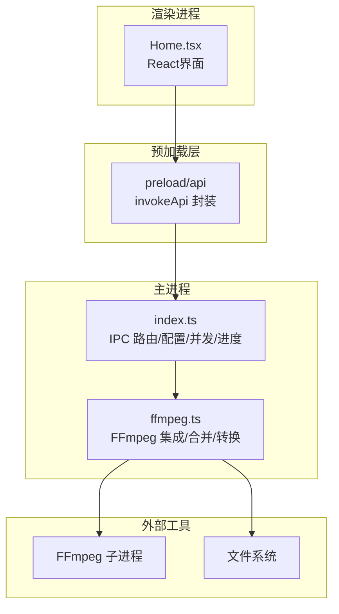
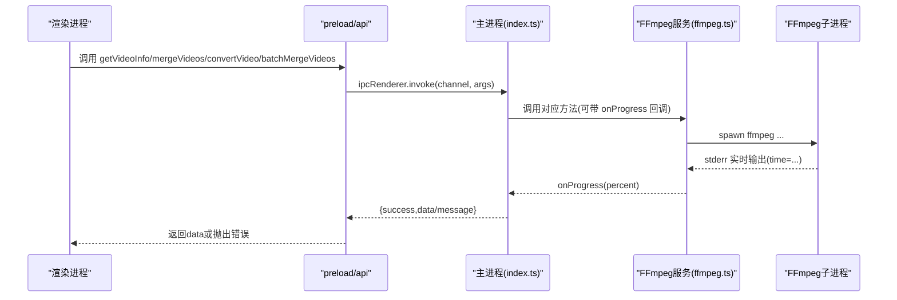
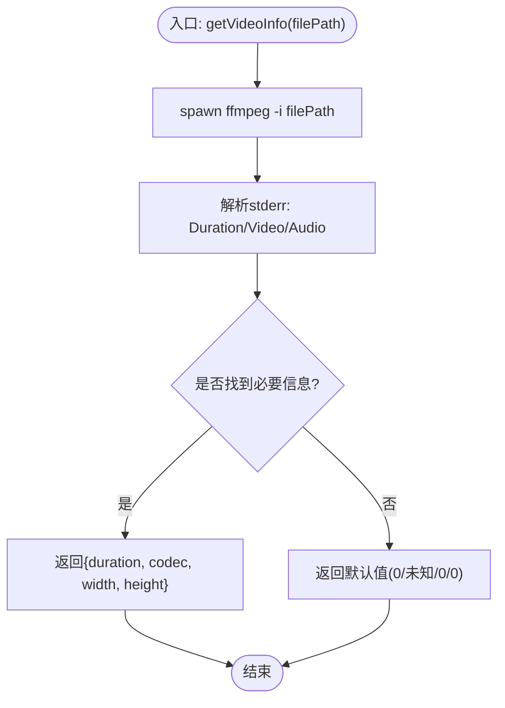
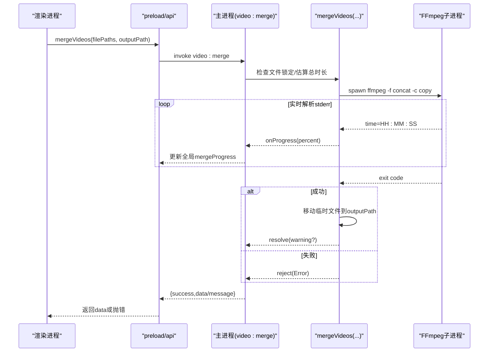
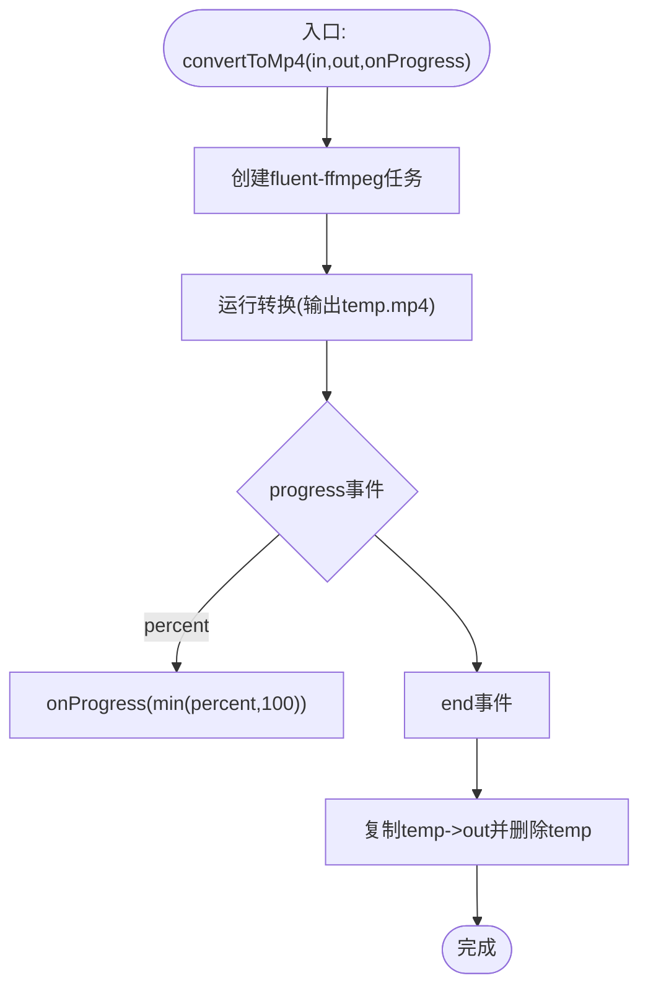
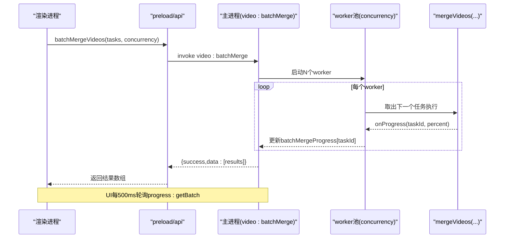
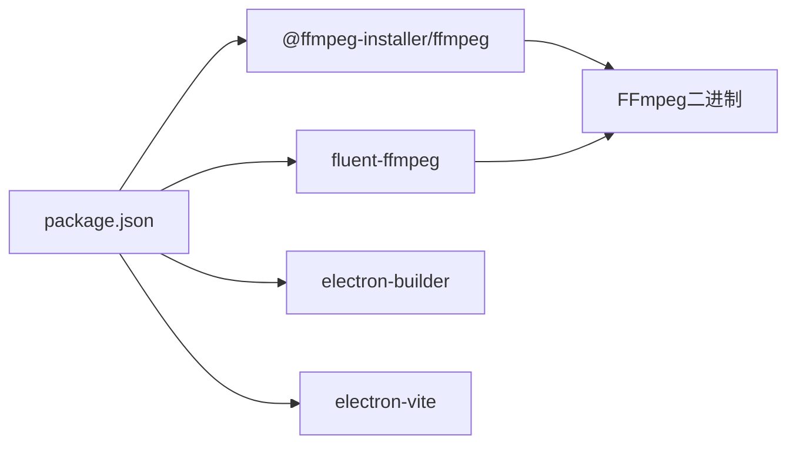

# 视频处理API

<cite>
**本文引用的文件**   
- [src/main/index.ts](file://src/main/index.ts)
- [src/main/ffmpeg.ts](file://src/main/ffmpeg.ts)
- [src/preload/index.ts](file://src/preload/index.ts)
- [tests/ffmpegParsing.test.ts](file://tests/ffmpegParsing.test.ts)
- [tests/invokeApi.test.ts](file://tests/invokeApi.test.ts)
- [package.json](file://package.json)
- [产品需求文档.md](file://产品需求文档.md)
</cite>

## 目录
1. [简介](#简介)
2. [项目结构](#项目结构)
3. [核心组件](#核心组件)
4. [架构总览](#架构总览)
5. [详细组件分析](#详细组件分析)
6. [依赖关系分析](#依赖关系分析)
7. [性能与并发](#性能与并发)
8. [故障排查指南](#故障排查指南)
9. [结论](#结论)
10. [附录：API定义与调用示例](#附录api定义与调用示例)

## 简介
本仓库实现了一个基于 Electron + FFmpeg 的视频处理桌面应用，提供以下核心能力：
- 获取视频信息（时长、编码、分辨率等）
- 单文件合并（将多个分段 FLV 拼接为 MP4）
- 格式转换（FLV 转 MP4，重新编码）
- 批量并行合并（多组任务并发执行，带进度追踪）

目标用户包括直播录屏用户与系统集成人员。后端通过 IPC 暴露 API，前端通过 preload 桥接调用。FFmpeg 以子进程方式集成，支持流拷贝合并与 H.264+AAC 转码。

## 项目结构
- 主进程（main）：负责系统交互、IPC 路由、配置管理、FFmpeg 调用、并发控制与进度状态维护
- 预加载（preload）：统一封装 IPC 调用，自动解包 {success, data?, message?} 返回格式
- 渲染进程（renderer）：React UI，发起 API 调用并展示进度与结果
- 测试（tests）：覆盖 FFmpeg 输出解析与 IPC 结果解包逻辑
- 配置与打包：electron-builder、fluent-ffmpeg、@ffmpeg-installer/ffmpeg

图表来源
- [src/main/index.ts:1-530](file://src/main/index.ts#L1-L530)
- [src/main/ffmpeg.ts:1-305](file://src/main/ffmpeg.ts#L1-L305)
- [src/preload/index.ts:1-64](file://src/preload/index.ts#L1-L64)

章节来源
- [src/main/index.ts:1-530](file://src/main/index.ts#L1-L530)
- [src/main/ffmpeg.ts:1-305](file://src/main/ffmpeg.ts#L1-L305)
- [src/preload/index.ts:1-64](file://src/preload/index.ts#L1-L64)
- [package.json:1-42](file://package.json#L1-L42)

## 核心组件
- getVideoInfo：快速探测视频信息（不读取整个文件），返回时长、编码、分辨率
- mergeVideos：使用 concat demuxer 直接拼接源文件并输出 MP4（stream copy，不重编码）
- convertVideo：使用 fluent-ffmpeg 进行 H.264+AAC 转码，输出 MP4
- batchMergeVideos：按并发度并行执行多个 mergeVideos 任务，独立进度追踪与错误隔离

章节来源
- [src/main/ffmpeg.ts:65-77](file://src/main/ffmpeg.ts#L65-L77)
- [src/main/ffmpeg.ts:87-245](file://src/main/ffmpeg.ts#L87-L245)
- [src/main/ffmpeg.ts:254-304](file://src/main/ffmpeg.ts#L254-L304)
- [src/main/index.ts:380-498](file://src/main/index.ts#L380-L498)
- [src/preload/index.ts:35-48](file://src/preload/index.ts#L35-L48)

## 架构总览
整体采用“渲染进程 -> preload 桥接 -> 主进程 IPC -> FFmpeg 子进程”的链路。主进程维护全局进度状态与批量任务队列，通过轮询机制向渲染进程反馈进度。

图表来源
- [src/preload/index.ts:9-18](file://src/preload/index.ts#L9-L18)
- [src/main/index.ts:380-498](file://src/main/index.ts#L380-L498)
- [src/main/ffmpeg.ts:174-191](file://src/main/ffmpeg.ts#L174-L191)

## 详细组件分析

### 接口：getVideoInfo
- 功能：快速探测视频信息（仅读头部），返回 duration、codec、width、height
- 实现要点：
  - 使用 spawn 启动 FFmpeg -i，捕获 stderr，匹配 Duration/Stream 信息后尽快终止子进程
  - 避免全量读取大文件，毫秒级完成
- 错误处理：无法解析时返回默认值；异常被上层捕获并包装为 {success:false,message}

图表来源
- [src/main/ffmpeg.ts:13-58](file://src/main/ffmpeg.ts#L13-L58)
- [src/main/ffmpeg.ts:65-77](file://src/main/ffmpeg.ts#L65-L77)

章节来源
- [src/main/ffmpeg.ts:13-58](file://src/main/ffmpeg.ts#L13-L58)
- [src/main/ffmpeg.ts:65-77](file://src/main/ffmpeg.ts#L65-L77)
- [src/main/index.ts:380-388](file://src/main/index.ts#L380-L388)
- [src/preload/index.ts:36](file://src/preload/index.ts#L36)

### 接口：mergeVideos
- 功能：将多个分段视频（如 FLV）合并为一个 MP4，优先使用 stream copy（不重编码）
- 关键流程：
  - 检测文件锁定情况，跳过正在录制中的片段并给出警告
  - 估算总时长：优先基于首个文件的真实时长与大小推算码率，再乘以总大小得到总时长
  - 生成临时列表文件与临时输出文件，使用 concat demuxer 拼接
  - 解析 FFmpeg stderr 中的 time= 字段计算进度百分比（上限 99.9%）
  - 成功后原子性移动临时文件到目标路径，失败清理临时文件
- 超时保护：30分钟超时，失败则清理临时文件并拒绝 Promise
- 返回值：成功时可能返回警告字符串（存在跳过的片段），否则 undefined

图表来源
- [src/main/ffmpeg.ts:87-245](file://src/main/ffmpeg.ts#L87-L245)
- [src/main/index.ts:390-403](file://src/main/index.ts#L390-L403)
- [src/preload/index.ts:37-38](file://src/preload/index.ts#L37-L38)

章节来源
- [src/main/ffmpeg.ts:87-245](file://src/main/ffmpeg.ts#L87-L245)
- [src/main/index.ts:390-403](file://src/main/index.ts#L390-L403)
- [src/preload/index.ts:37-38](file://src/preload/index.ts#L37-L38)

### 接口：convertVideo
- 功能：将单个视频转换为 MP4（H.264 + AAC），启用 faststart 优化
- 关键流程：
  - 使用 fluent-ffmpeg 创建转换任务，监听 progress.percent 更新进度
  - 写入临时文件，完成后移动到目标路径
  - 失败时清理临时文件并拒绝 Promise
- 适用场景：需要统一编码参数或源格式不被 concat 直接支持时

图表来源
- [src/main/ffmpeg.ts:254-304](file://src/main/ffmpeg.ts#L254-L304)

章节来源
- [src/main/ffmpeg.ts:254-304](file://src/main/ffmpeg.ts#L254-L304)
- [src/main/index.ts:480-493](file://src/main/index.ts#L480-L493)
- [src/preload/index.ts:39-40](file://src/preload/index.ts#L39-L40)

### 接口：batchMergeVideos
- 功能：并行执行多个合并任务，每个任务独立进度与错误
- 并发控制：
  - 通过 worker 池限制同时运行的任务数（concurrency）
  - 使用 Map<taskId, progress> 记录每个任务的进度，-1 表示失败
- 进度查询：
  - 渲染进程每 500ms 轮询 progress:getBatch，聚合计算总体进度
- 资源管理：
  - 任务结束后清理该 taskId 的进度记录
  - 每个任务内部仍遵循 mergeVideos 的超时与清理策略

图表来源
- [src/main/index.ts:421-469](file://src/main/index.ts#L421-L469)
- [src/main/index.ts:471-478](file://src/main/index.ts#L471-L478)
- [src/preload/index.ts:43-48](file://src/preload/index.ts#L43-L48)

章节来源
- [src/main/index.ts:421-469](file://src/main/index.ts#L421-L469)
- [src/main/index.ts:471-478](file://src/main/index.ts#L471-L478)
- [src/preload/index.ts:43-48](file://src/preload/index.ts#L43-L48)

## 依赖关系分析
- 运行时依赖：
  - @ffmpeg-installer/ffmpeg：内嵌 FFmpeg 二进制，解决打包后 asar 路径问题
  - fluent-ffmpeg：用于转码任务（convertToMp4）
- 构建与打包：
  - electron-builder：打包应用
  - electron-vite：开发/构建管线
- 类型与测试：
  - @types/fluent-ffmpeg：类型定义
  - vitest：单元测试

图表来源
- [package.json:17-20](file://package.json#L17-L20)
- [package.json:21-40](file://package.json#L21-L40)

章节来源
- [package.json:1-42](file://package.json#L1-L42)

## 性能与并发
- 扫描性能：当前 scan:flvFiles 使用同步递归遍历，适合中小规模目录；若目录极大，建议改为异步遍历以避免阻塞主进程事件循环
- 合并性能：concat demuxer + stream copy 模式速度极快，无需重编码
- 转码性能：H.264+AAC 转码受 CPU 影响较大，可通过调整并发度与硬件加速（如平台相关编码器）进一步优化
- 进度估算：
  - 合并：优先基于首个文件真实时长与大小推算码率，再乘以总大小估算总时长；若无时间信息则回退字节估算
  - 转码：直接使用 fluent-ffmpeg 提供的 percent
- 并发控制：
  - 批量合并通过 worker 池限制并发度，避免过多 FFmpeg 实例争抢资源
  - 建议根据 CPU 核数与磁盘 IO 能力动态调整 concurrency

章节来源
- [src/main/index.ts:145-345](file://src/main/index.ts#L145-L345)
- [src/main/ffmpeg.ts:127-144](file://src/main/ffmpeg.ts#L127-L144)
- [src/main/ffmpeg.ts:174-191](file://src/main/ffmpeg.ts#L174-L191)
- [src/main/ffmpeg.ts:278-282](file://src/main/ffmpeg.ts#L278-L282)
- [src/main/index.ts:421-469](file://src/main/index.ts#L421-L469)

## 故障排查指南
- 常见错误与恢复
  - 文件被占用：mergeVideos 会跳过被锁定的文件并返回警告；若全部被占用则报错提示
  - 输出目录不可写：mkdirSync 失败时返回错误；确保输出路径父目录存在且可写
  - 覆盖已有文件：若目标已存在，尝试备份为 _backup.mp4 后再覆盖；失败则返回错误
  - 合并超时：超过 30 分钟自动终止并清理临时文件，提示部分源文件可能仍在录制中
  - 转换失败：清理临时文件并返回错误消息
- 调试建议
  - 查看控制台日志：FFmpeg 命令与进度信息均会打印
  - 检查临时文件：tmpdir 下 merge-list-*.txt 与 merge-temp-*.mp4/convert-temp-*.mp4
  - 验证输入文件：确认文件名符合分组规则（日期+时间戳+标题）
- 测试用例参考
  - FFmpeg 输出解析：时长、进度、视频流信息正则匹配
  - IPC 结果解包：成功返回 data，失败抛出错误

章节来源
- [src/main/ffmpeg.ts:110-125](file://src/main/ffmpeg.ts#L110-L125)
- [src/main/ffmpeg.ts:154-160](file://src/main/ffmpeg.ts#L154-L160)
- [src/main/ffmpeg.ts:200-234](file://src/main/ffmpeg.ts#L200-L234)
- [src/main/ffmpeg.ts:283-301](file://src/main/ffmpeg.ts#L283-L301)
- [tests/ffmpegParsing.test.ts:1-148](file://tests/ffmpegParsing.test.ts#L1-L148)
- [tests/invokeApi.test.ts:1-70](file://tests/invokeApi.test.ts#L1-L70)

## 结论
本项目通过 Electron + FFmpeg 实现了稳定高效的视频处理 API，涵盖信息获取、合并、转换与批量并行处理。其优势在于：
- 合并采用 stream copy，速度快、质量无损
- 进度追踪基于真实时间解析，用户体验良好
- 批量任务具备并发控制与独立错误隔离
- 完善的错误处理与资源清理策略

后续优化方向包括：
- 扫描模块异步化以提升大规模目录性能
- 更健壮的进度估算（结合多文件探针与 VBR 适配）
- 安全加固（sandbox、CSP、IPC 白名单校验）

## 附录：API定义与调用示例

### 统一返回格式
- 所有 IPC 接口统一返回 { success, data?, message? }
- preload 层自动解包：成功返回 data，失败抛出 Error(message)

章节来源
- [src/preload/index.ts:9-18](file://src/preload/index.ts#L9-L18)
- [tests/invokeApi.test.ts:14-22](file://tests/invokeApi.test.ts#L14-L22)

### getVideoInfo
- 通道：video:getInfo
- 入参：filePath（string）
- 返回：{ duration, codec, width, height }
- 说明：快速探测，不读取完整文件

章节来源
- [src/main/index.ts:380-388](file://src/main/index.ts#L380-L388)
- [src/main/ffmpeg.ts:65-77](file://src/main/ffmpeg.ts#L65-L77)
- [src/preload/index.ts:36](file://src/preload/index.ts#L36)

### mergeVideos
- 通道：video:merge
- 入参：filePaths（string[]）、outputPath（string）
- 返回：warning?（string | undefined）
- 说明：
  - 跳过被占用的文件并返回警告
  - 使用 concat demuxer + stream copy
  - 进度通过 progress:get 轮询获取

章节来源
- [src/main/index.ts:390-403](file://src/main/index.ts#L390-L403)
- [src/main/ffmpeg.ts:87-245](file://src/main/ffmpeg.ts#L87-L245)
- [src/preload/index.ts:37-38](file://src/preload/index.ts#L37-L38)
- [src/main/index.ts:495-498](file://src/main/index.ts#L495-L498)

### convertVideo
- 通道：video:convert
- 入参：filePath（string）、outputPath（string）
- 返回：无 data（仅 success）
- 说明：H.264+AAC 转码，faststart 优化

章节来源
- [src/main/index.ts:480-493](file://src/main/index.ts#L480-L493)
- [src/main/ffmpeg.ts:254-304](file://src/main/ffmpeg.ts#L254-L304)
- [src/preload/index.ts:39-40](file://src/preload/index.ts#L39-L40)

### batchMergeVideos
- 通道：video:batchMerge
- 入参：tasks（Array<{ taskId, filePaths, outputPath, folderName }>）、concurrency（number，可选）
- 返回：results（Array<{ taskId, folderName, success, warning?, error? }>）
- 说明：
  - 并发控制由 concurrency 决定
  - 进度通过 progress:getBatch 轮询获取，-1 表示失败
  - 任务完成后清理进度记录

章节来源
- [src/main/index.ts:421-469](file://src/main/index.ts#L421-L469)
- [src/main/index.ts:471-478](file://src/main/index.ts#L471-L478)
- [src/preload/index.ts:43-48](file://src/preload/index.ts#L43-L48)

### 进度查询
- 单任务进度：progress:get
  - 返回：{ mergeProgress, convertProgress }
- 批量进度：progress:getBatch
  - 返回：Record<taskId, number>（-1 表示失败）

章节来源
- [src/main/index.ts:495-498](file://src/main/index.ts#L495-L498)
- [src/main/index.ts:471-478](file://src/main/index.ts#L471-L478)
- [src/preload/index.ts:47-48](file://src/preload/index.ts#L47-L48)

### 调用示例（概念性步骤）
- 获取视频信息
  - 渲染进程调用 api.getVideoInfo(filePath)
  - 主进程转发至 video:getInfo，返回 {success:true,data:{...}}
  - 渲染进程接收 data 并显示
- 合并视频
  - 渲染进程调用 api.mergeVideos(filePaths, outputPath)
  - 主进程执行 mergeVideos，期间通过 progress:get 轮询更新 UI
  - 完成后返回 warning 或 undefined
- 转换视频
  - 渲染进程调用 api.convertVideo(filePath, outputPath)
  - 主进程执行 convertToMp4，通过 progress:get 轮询更新 UI
  - 完成后返回 {success:true}
- 批量合并
  - 渲染进程准备 tasks 与 concurrency，调用 api.batchMergeVideos(tasks, concurrency)
  - 每 500ms 轮询 api.getBatchProgress() 更新各任务进度与总体进度
  - 完成后统计成功/失败数量并提示

章节来源
- [src/preload/index.ts:35-48](file://src/preload/index.ts#L35-L48)
- [src/main/index.ts:380-498](file://src/main/index.ts#L380-L498)
- [产品需求文档.md:1-277](file://产品需求文档.md#L1-L277)