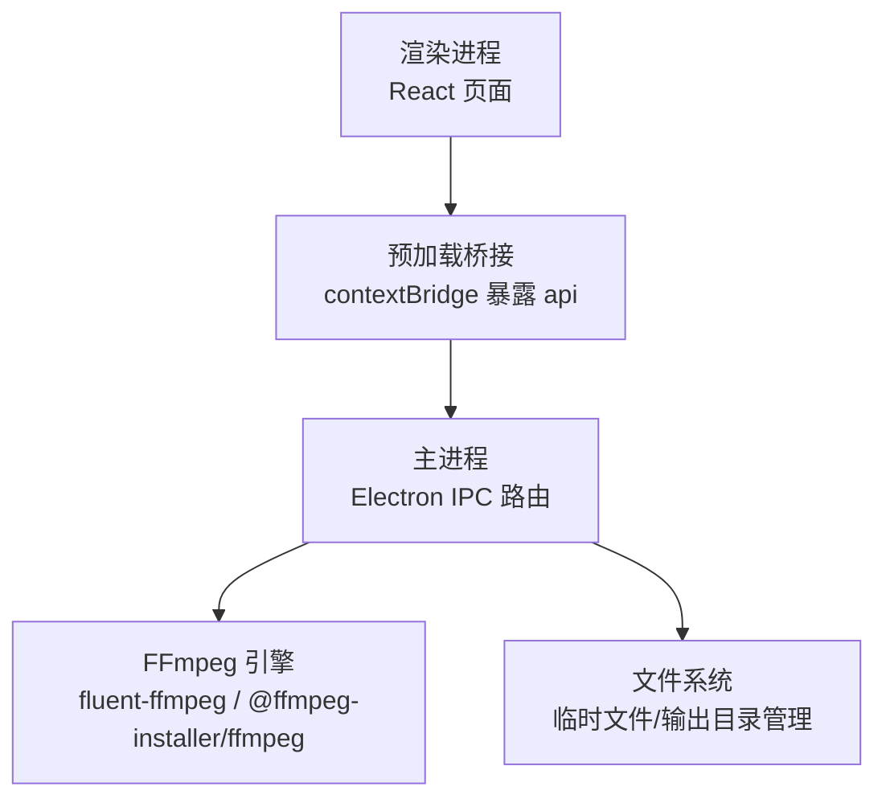
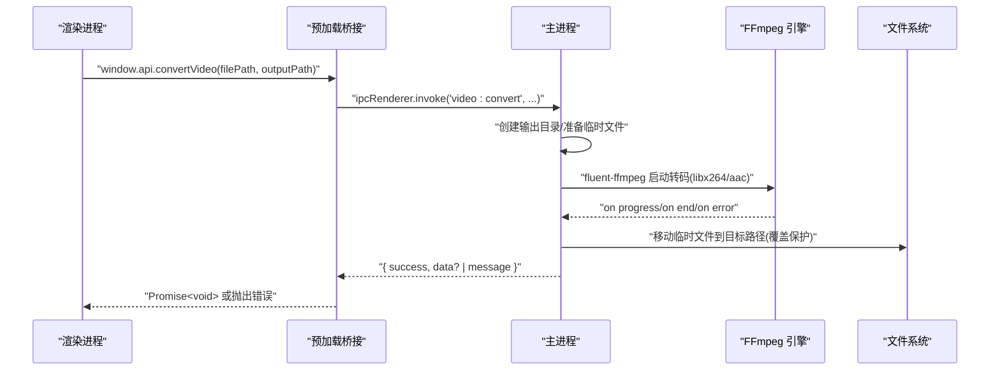
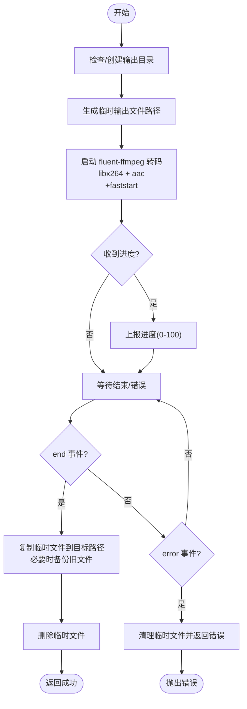
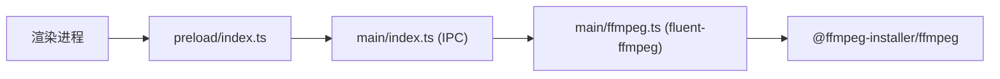

# 视频转换API

<cite>
**本文引用的文件**   
- [src/main/ffmpeg.ts](file://src/main/ffmpeg.ts)
- [src/main/index.ts](file://src/main/index.ts)
- [src/preload/index.ts](file://src/preload/index.ts)
- [src/renderer/src/env.d.ts](file://src/renderer/src/env.d.ts)
- [package.json](file://package.json)
- [tests/ffmpegParsing.test.ts](file://tests/ffmpegParsing.test.ts)
- [产品需求文档.md](file://产品需求文档.md)
</cite>

## 目录
1. [简介](#简介)
2. [项目结构](#项目结构)
3. [核心组件](#核心组件)
4. [架构总览](#架构总览)
5. [详细组件分析](#详细组件分析)
6. [依赖关系分析](#依赖关系分析)
7. [性能与调优](#性能与调优)
8. [故障排查指南](#故障排查指南)
9. [结论](#结论)
10. [附录：接口定义与使用示例](#附录接口定义与使用示例)

## 简介
本文件面向需要进行视频格式转换的开发者，围绕 convertVideo 接口及其底层实现进行系统化说明。该应用基于 Electron + React 构建，主进程通过 FFmpeg（fluent-ffmpeg）完成视频转码与合并，渲染进程通过 preload 暴露统一 API，供前端调用。convertVideo 的核心能力是将任意输入视频转换为 MP4（H.264 + AAC），并提供进度回调、错误处理与输出文件安全覆盖策略。

## 项目结构
- 主进程负责系统级操作（FFmpeg 子进程、文件系统、IPC 路由）。
- 预加载层封装 IPC 调用，统一返回结果解包。
- 渲染层提供用户界面与交互流程。
- 测试用例覆盖 FFmpeg 输出解析逻辑与 IPC 解包行为。

图表来源
- [src/main/index.ts:1-530](file://src/main/index.ts#L1-L530)
- [src/preload/index.ts:1-64](file://src/preload/index.ts#L1-L64)
- [src/main/ffmpeg.ts:1-305](file://src/main/ffmpeg.ts#L1-L305)

章节来源
- [src/main/index.ts:1-530](file://src/main/index.ts#L1-L530)
- [src/preload/index.ts:1-64](file://src/preload/index.ts#L1-L64)
- [src/main/ffmpeg.ts:1-305](file://src/main/ffmpeg.ts#L1-L305)

## 核心组件
- FFmpeg 转码模块：封装 getVideoInfo、mergeVideos、convertToMp4 等能力，负责启动 FFmpeg、解析进度、管理临时文件与输出路径。
- IPC 路由与业务编排：在 main/index.ts 中注册 video:convert、video:merge、progress:get 等通道，协调任务执行与进度上报。
- 预加载桥接：将后端能力以 window.api.convertVideo 等形式暴露给渲染进程，并统一处理 { success, data?, message? } 返回格式。
- 类型声明：env.d.ts 为渲染进程提供 TypeScript 类型约束，明确 convertVideo 的参数与返回值。

章节来源
- [src/main/ffmpeg.ts:247-305](file://src/main/ffmpeg.ts#L247-L305)
- [src/main/index.ts:480-493](file://src/main/index.ts#L480-L493)
- [src/preload/index.ts:35-49](file://src/preload/index.ts#L35-L49)
- [src/renderer/src/env.d.ts:17-27](file://src/renderer/src/env.d.ts#L17-L27)

## 架构总览
convertVideo 的端到端调用链如下：

图表来源
- [src/main/index.ts:480-493](file://src/main/index.ts#L480-L493)
- [src/main/ffmpeg.ts:254-304](file://src/main/ffmpeg.ts#L254-L304)
- [src/preload/index.ts:35-49](file://src/preload/index.ts#L35-L49)

## 详细组件分析

### convertVideo 接口与实现原理
- 入口通道：video:convert
- 参数：
  - filePath: 输入视频绝对路径
  - outputPath: 输出 MP4 绝对路径
- 返回值：成功时 Promise<void>；失败时抛出错误（包含错误信息）
- 内部流程：
  - 确保输出目录存在
  - 生成临时输出文件（位于系统临时目录）
  - 使用 fluent-ffmpeg 设置编码器为 H.264（libx264）与 AAC（音频）
  - 添加 movflags +faststart 优化流式播放
  - 监听 start/progress/end/error 事件，更新进度与最终状态
  - 成功后将临时文件复制到目标路径，必要时对已有文件做备份后覆盖
  - 清理临时文件，返回成功或错误

图表来源
- [src/main/ffmpeg.ts:254-304](file://src/main/ffmpeg.ts#L254-L304)

章节来源
- [src/main/ffmpeg.ts:247-305](file://src/main/ffmpeg.ts#L247-L305)
- [src/main/index.ts:480-493](file://src/main/index.ts#L480-L493)
- [src/preload/index.ts:35-49](file://src/preload/index.ts#L35-L49)
- [src/renderer/src/env.d.ts:17-27](file://src/renderer/src/env.d.ts#L17-L27)

### FFmpeg 转码引擎与编码参数
- 引擎集成：
  - 使用 @ffmpeg-installer/ffmpeg 获取平台适配的 FFmpeg 二进制路径，并在打包后自动重定向至 app.asar.unpacked 目录，避免 asar 虚拟文件系统无法直接执行的问题。
  - 通过 fluent-ffmpeg 发起转码命令，便于事件驱动与进度回调。
- 编码配置：
  - 视频编码：libx264（H.264）
  - 音频编码：aac（AAC）
  - 容器优化：movflags +faststart（利于网络流式播放）
- 进度机制：
  - fluent-ffmpeg 的 progress 事件携带 percent 字段，用于前端进度条展示。
- 输出策略：
  - 先写入临时文件，完成后原子性移动到目标路径；若目标已存在，则尝试备份后覆盖，降低数据丢失风险。

章节来源
- [src/main/ffmpeg.ts:1-11](file://src/main/ffmpeg.ts#L1-L11)
- [src/main/ffmpeg.ts:254-304](file://src/main/ffmpeg.ts#L254-L304)

### 质量控制与质量可调项
当前 convertToMp4 采用默认编码器预设与比特率策略（由 libx264/aac 默认值决定），未显式设置 CRF/CQP、b:v、maxrate、bufsize 等参数。如需精细化控制，可在 fluent-ffmpeg 链上追加以下选项（概念性建议，非当前实现）：
- 视频质量：-crf 23（平衡质量与体积）、-preset medium（速度与质量折中）
- 码率控制：-b:v 指定目标码率，配合 -maxrate/-bufsize 限制峰值与缓冲
- 音频质量：-b:a 128k/192k/256k 或 -q:a 控制 AAC 质量
- 分辨率与帧率：-s、-r（按需缩放与帧率调整）
- 多核并行：-threads 0 或指定线程数（视 CPU 核数与负载而定）

注意：上述为扩展建议，当前代码未启用这些参数。

章节来源
- [src/main/ffmpeg.ts:254-304](file://src/main/ffmpeg.ts#L254-L304)

### 支持的格式列表与转换选项
- 输入格式：取决于 FFmpeg 解码器支持。当前应用主要面向直播录制的 FLV 分段文件，同时兼容常见媒体容器与编码（如 MP4、TS、MKV 等，具体以宿主系统 FFmpeg 编译为准）。
- 输出格式：MP4（H.264 + AAC）
- 转换选项：
  - 固定编码器：libx264（视频）、aac（音频）
  - 容器优化：+faststart
  - 进度回调：percent 0-100
  - 输出覆盖策略：自动备份旧文件后覆盖

章节来源
- [src/main/ffmpeg.ts:254-304](file://src/main/ffmpeg.ts#L254-L304)
- [产品需求文档.md:1-277](file://产品需求文档.md#L1-L277)

### 批量转换的实现方案
- 单任务模式：convertVideo 一次处理一个文件，适合小批量或串行场景。
- 并发模式：可结合 Node.js 并发工具（如 Promise.all 或自定义工作池）在主进程侧并行调用 convertToMp4，并通过独立的任务 ID 跟踪每个任务的进度与结果。
- 资源控制：根据 CPU 核数与磁盘 I/O 能力设置合理并发度，避免过度竞争导致整体吞吐下降。
- 失败重试：对个别任务失败进行重试或隔离，保证整体任务集的最终一致性。

说明：当前仓库提供了批量合并（batchMerge）的实现思路与进度轮询机制，可作为批量转换的参考范式。

章节来源
- [src/main/index.ts:421-469](file://src/main/index.ts#L421-L469)
- [src/main/index.ts:471-478](file://src/main/index.ts#L471-L478)

### 跨平台兼容性与系统依赖
- 运行环境：Electron（含 Chromium 内核），适用于 Windows/macOS/Linux。
- FFmpeg 二进制：通过 @ffmpeg-installer/ffmpeg 自动下载对应平台的 ffmpeg 可执行文件，无需用户手动安装。
- 打包后路径：app.asar 内不可直接执行，需重定向到 app.asar.unpacked 目录，已在初始化阶段处理。
- 文件系统：需要读写权限以创建输出目录与临时文件。

章节来源
- [src/main/ffmpeg.ts:1-11](file://src/main/ffmpeg.ts#L1-L11)
- [package.json:17-20](file://package.json#L17-L20)

## 依赖关系分析
- 运行时依赖：
  - fluent-ffmpeg：FFmpeg 的高级封装，提供事件驱动的转码接口
  - @ffmpeg-installer/ffmpeg：按平台分发 FFmpeg 二进制
- 开发依赖：
  - electron、electron-builder、electron-vite：桌面应用开发与打包
  - react、antd：渲染层 UI
  - vitest：单元测试

图表来源
- [src/preload/index.ts:1-64](file://src/preload/index.ts#L1-L64)
- [src/main/index.ts:1-530](file://src/main/index.ts#L1-L530)
- [src/main/ffmpeg.ts:1-305](file://src/main/ffmpeg.ts#L1-L305)
- [package.json:17-20](file://package.json#L17-L20)

章节来源
- [package.json:17-20](file://package.json#L17-L20)

## 性能与调优
- 转码速度：
  - 优先使用硬件加速（如 NVENC/QuickSync）需在 FFmpeg 编译中包含相应编解码器，并在 fluent-ffmpeg 中切换编码器（当前为软件编码 libx264/aac）。
  - 合理设置 -threads 提升并行度，但需避免与系统其他任务争抢资源。
- 存储 I/O：
  - 使用 SSD 作为输入/输出盘，减少磁盘瓶颈。
  - 避免在同一磁盘同时进行大量随机读写。
- 内存占用：
  - Electron 本身占用较高，建议在后台队列中控制并发数量，避免过多任务同时转码。
- 进度反馈：
  - 利用 fluent-ffmpeg 的 progress 事件，前端每 500ms 轮询一次，兼顾实时性与性能。

[本节为通用指导，不直接分析具体文件]

## 故障排查指南
- 常见问题定位：
  - 输出目录不存在或无写权限：检查 mkdirSync 是否成功，确认路径权限。
  - 目标文件被占用：当目标已存在且无法覆盖时，会尝试备份后覆盖；若仍失败，提示错误信息。
  - FFmpeg 启动失败：检查 @ffmpeg-installer/ffmpeg 是否正确解压到 app.asar.unpacked，以及路径重定向逻辑。
  - 进度异常：确认 fluent-ffmpeg 的 progress 事件是否正常触发，totalDuration 估算是否合理。
- 日志与调试：
  - 查看控制台输出的 FFmpeg 命令与 stderr 片段，辅助定位问题。
  - 使用 tests/ffmpegParsing.test.ts 中的正则表达式验证 FFmpeg 输出解析是否符合预期。

章节来源
- [src/main/ffmpeg.ts:254-304](file://src/main/ffmpeg.ts#L254-L304)
- [tests/ffmpegParsing.test.ts:1-148](file://tests/ffmpegParsing.test.ts#L1-L148)

## 结论
convertVideo 接口以 FFmpeg 为核心，通过 fluent-ffmpeg 提供稳定可靠的转码能力，结合完善的进度回调与输出保护策略，满足从单个文件到批量处理的多种场景。当前实现聚焦于“快速可用”，后续可按需引入更精细的质量控制与硬件加速选项，进一步提升性能与灵活性。

[本节为总结性内容，不直接分析具体文件]

## 附录：接口定义与使用示例

### 接口定义（TypeScript）
- 函数签名
  - convertVideo(filePath: string, outputPath: string): Promise<void>
- 参数说明
  - filePath：输入视频文件的绝对路径
  - outputPath：输出 MP4 文件的绝对路径
- 返回值
  - 成功：Promise<void>
  - 失败：抛出错误对象，message 包含错误原因
- 错误处理约定
  - 预加载层统一解包 { success, data?, message? }，失败时抛出错误

章节来源
- [src/preload/index.ts:35-49](file://src/preload/index.ts#L35-L49)
- [src/renderer/src/env.d.ts:17-27](file://src/renderer/src/env.d.ts#L17-L27)

### 调用示例（概念性步骤）
- 选择输入文件与输出目录
- 调用 convertVideo 执行转换
- 监听进度（通过轮询 progress:get 或 convert 内部进度回调）
- 处理成功/失败结果，必要时打开输出目录查看结果

章节来源
- [src/main/index.ts:480-493](file://src/main/index.ts#L480-L493)
- [src/preload/index.ts:35-49](file://src/preload/index.ts#L35-L49)

### 转换结果验证
- 检查输出文件是否存在且大小大于 0
- 使用 getVideoInfo 读取时长、编码、分辨率等信息，验证是否为 MP4/H.264/AAC
- 对比输入与输出元数据，确保关键属性符合预期

章节来源
- [src/main/ffmpeg.ts:65-77](file://src/main/ffmpeg.ts#L65-L77)
- [src/main/index.ts:380-388](file://src/main/index.ts#L380-L388)