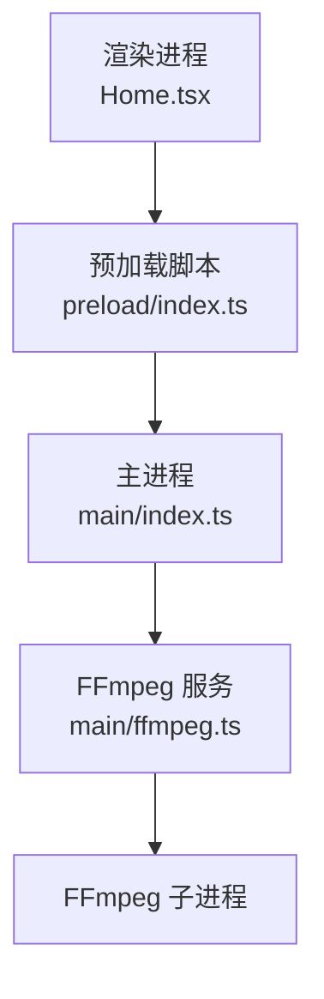
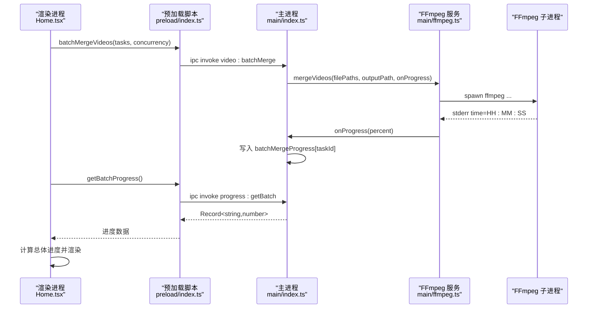
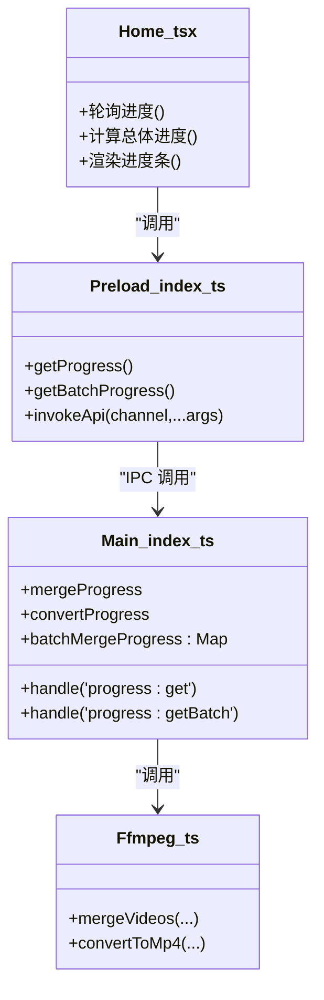

# 进度监控API

<cite>
**本文引用的文件**   
- [src/main/index.ts](file://src/main/index.ts)
- [src/main/ffmpeg.ts](file://src/main/ffmpeg.ts)
- [src/preload/index.ts](file://src/preload/index.ts)
- [src/renderer/src/pages/Home.tsx](file://src/renderer/src/pages/Home.tsx)
- [tests/invokeApi.test.ts](file://tests/invokeApi.test.ts)
</cite>

## 目录
1. [简介](#简介)
2. [项目结构](#项目结构)
3. [核心组件](#核心组件)
4. [架构总览](#架构总览)
5. [详细组件分析](#详细组件分析)
6. [依赖关系分析](#依赖关系分析)
7. [性能与轮询策略](#性能与轮询策略)
8. [错误处理与状态码](#错误处理与状态码)
9. [前端集成示例](#前端集成示例)
10. [常见问题排查](#常见问题排查)
11. [结论](#结论)

## 简介
本文件面向前端开发者与用户体验设计师，系统化说明“进度监控API”的设计与实现，覆盖以下要点：
- getProgress 与 getBatchProgress 两个接口的完整定义、数据结构与语义
- 实时进度获取机制（FFmpeg 子进程 stderr 解析 + 主进程内存快照 + 渲染进程轮询）
- 轮询策略与性能优化建议（频率控制、节流、去抖、任务级聚合）
- 进度数据模型、状态码约定与更新频率控制
- 进度展示最佳实践、交互设计与错误处理方案
- 与视频处理 API 的配合使用模式与状态同步机制
- 实际集成示例与常见问题解决方案

## 项目结构
本项目采用 Electron 多进程架构：
- 主进程（main）：负责系统能力调用、FFmpeg 子进程管理、进度存储与 IPC 暴露
- 预加载脚本（preload）：安全桥接，统一封装 IPC 返回格式并暴露 window.api
- 渲染进程（renderer）：React UI，通过 window.api 调用后端能力，轮询进度并渲染

图表来源
- [src/main/index.ts:1-120](file://src/main/index.ts#L1-L120)
- [src/preload/index.ts:1-64](file://src/preload/index.ts#L1-L64)
- [src/main/ffmpeg.ts:1-120](file://src/main/ffmpeg.ts#L1-L120)
- [src/renderer/src/pages/Home.tsx:1-120](file://src/renderer/src/pages/Home.tsx#L1-L120)

章节来源
- [src/main/index.ts:1-120](file://src/main/index.ts#L1-L120)
- [src/preload/index.ts:1-64](file://src/preload/index.ts#L1-L64)
- [src/main/ffmpeg.ts:1-120](file://src/main/ffmpeg.ts#L1-L120)
- [src/renderer/src/pages/Home.tsx:1-120](file://src/renderer/src/pages/Home.tsx#L1-L120)

## 核心组件
- 主进程进度存储
  - 单任务进度：mergeProgress、convertProgress（数值型，0~100）
  - 批量任务进度：Map<taskId, number>，支持并发 worker 更新
- 预加载脚本 API 暴露
  - getProgress(): 返回 { mergeProgress, convertProgress }
  - getBatchProgress(): 返回 Record<string, number>
- 渲染进程轮询
  - 每 500ms 调用 getBatchProgress()，计算总体进度并渲染
- FFmpeg 进度上报
  - 合并：基于 ffmpeg 输出 time=HH:MM:SS 与估算总时长换算百分比
  - 转换：基于 fluent-ffmpeg progress 事件 percent 字段

章节来源
- [src/main/index.ts:9-15](file://src/main/index.ts#L9-L15)
- [src/main/index.ts:495-498](file://src/main/index.ts#L495-L498)
- [src/main/index.ts:471-478](file://src/main/index.ts#L471-L478)
- [src/preload/index.ts:46-49](file://src/preload/index.ts#L46-L49)
- [src/main/ffmpeg.ts:177-191](file://src/main/ffmpeg.ts#L177-L191)
- [src/main/ffmpeg.ts:278-282](file://src/main/ffmpeg.ts#L278-L282)
- [src/renderer/src/pages/Home.tsx:221-236](file://src/renderer/src/pages/Home.tsx#L221-L236)

## 架构总览
下图展示了从 UI 触发到 FFmpeg 子进程，再到进度回传与轮询的端到端流程。

图表来源
- [src/renderer/src/pages/Home.tsx:204-242](file://src/renderer/src/pages/Home.tsx#L204-L242)
- [src/preload/index.ts:42-49](file://src/preload/index.ts#L42-L49)
- [src/main/index.ts:421-469](file://src/main/index.ts#L421-L469)
- [src/main/ffmpeg.ts:174-191](file://src/main/ffmpeg.ts#L174-L191)

## 详细组件分析

### 接口定义：getProgress
- 通道名：progress:get
- 入参：无
- 返回值：{ mergeProgress: number, convertProgress: number }
- 语义：
  - mergeProgress：当前单次合并任务的进度（0~100），由 mergeVideos 回调更新
  - convertProgress：当前转换任务的进度（0~100），由 convertToMp4 回调更新
- 适用场景：单任务进度显示（如单独执行一次合并或转换）

章节来源
- [src/main/index.ts:495-498](file://src/main/index.ts#L495-L498)
- [src/preload/index.ts:46-47](file://src/preload/index.ts#L46-L47)

### 接口定义：getBatchProgress
- 通道名：progress:getBatch
- 入参：无
- 返回值：Record<string, number>，键为 taskId，值为该任务进度
- 语义：
  - 值范围：0~100；失败时置为 -1；完成时置为 100
  - 生命周期：任务完成后清理对应 taskId 记录
- 适用场景：批量并行合并时的任务级与总体进度展示

章节来源
- [src/main/index.ts:471-478](file://src/main/index.ts#L471-L478)
- [src/preload/index.ts:48](file://src/preload/index.ts#L48-L48)

### 进度数据来源与计算
- 合并任务（mergeVideos）
  - 通过 FFmpeg 子进程 stderr 中的 time=HH:MM:SS 解析当前已处理时间
  - 结合首个文件的真实时长与文件大小估算总时长，计算百分比并限制在 99.9%
  - 成功完成后置为 100
- 转换任务（convertToMp4）
  - 基于 fluent-ffmpeg progress 事件的 percent 字段直接映射
- 批量任务（video:batchMerge）
  - 每个 worker 独立更新 Map 中对应 taskId 的进度
  - 渲染进程按所有活跃任务进度求平均得到总体进度

章节来源
- [src/main/ffmpeg.ts:177-191](file://src/main/ffmpeg.ts#L177-L191)
- [src/main/ffmpeg.ts:278-282](file://src/main/ffmpeg.ts#L278-L282)
- [src/main/index.ts:437-456](file://src/main/index.ts#L437-L456)
- [src/renderer/src/pages/Home.tsx:227-232](file://src/renderer/src/pages/Home.tsx#L227-L232)

### 进度数据结构与状态码
- 单任务进度对象（getProgress 返回）
  - mergeProgress: number（0~100）
  - convertProgress: number（0~100）
- 批量任务进度对象（getBatchProgress 返回）
  - Record<string, number>
  - 值含义：
    - 0~100：进行中（含 100 表示已完成）
    - -1：失败
- 渲染层总体进度
  - 对全部活跃任务进度取算术平均（忽略负数）

章节来源
- [src/main/index.ts:495-498](file://src/main/index.ts#L495-L498)
- [src/main/index.ts:471-478](file://src/main/index.ts#L471-L478)
- [src/main/index.ts:447-455](file://src/main/index.ts#L447-L455)
- [src/renderer/src/pages/Home.tsx:227-232](file://src/renderer/src/pages/Home.tsx#L227-L232)

### 进度显示与交互设计
- 总体进度条
  - 使用 antd Progress 展示总体百分比
  - 当存在多个任务时，同时展示各任务进度条，便于定位失败任务
- 状态文本
  - 显示“正在并行合并 N 个分组（并发数: C）”等提示
  - 配合计时器显示“已用时 mm:ss/hh:mm:ss”，提升用户感知
- 结果反馈
  - 成功：提示成功数量，必要时打开输出文件夹与投稿页面
  - 失败：逐条提示失败原因，保留失败任务以便重试

章节来源
- [src/renderer/src/pages/Home.tsx:238-298](file://src/renderer/src/pages/Home.tsx#L238-L298)
- [src/renderer/src/pages/Home.tsx:619-651](file://src/renderer/src/pages/Home.tsx#L619-L651)

## 依赖关系分析
- 渲染进程依赖 preload 暴露的 window.api
- preload 通过 contextBridge 暴露方法，内部统一解包 IPC 返回格式
- main 通过 ipcMain.handle 注册通道，维护内存进度
- ffmpeg.ts 提供底层合并/转换能力，并通过回调上报进度

图表来源
- [src/renderer/src/pages/Home.tsx:221-236](file://src/renderer/src/pages/Home.tsx#L221-L236)
- [src/preload/index.ts:9-18](file://src/preload/index.ts#L9-L18)
- [src/preload/index.ts:46-49](file://src/preload/index.ts#L46-L49)
- [src/main/index.ts:495-498](file://src/main/index.ts#L495-L498)
- [src/main/index.ts:471-478](file://src/main/index.ts#L471-L478)
- [src/main/ffmpeg.ts:87-91](file://src/main/ffmpeg.ts#L87-L91)
- [src/main/ffmpeg.ts:254-258](file://src/main/ffmpeg.ts#L254-L258)

章节来源
- [src/preload/index.ts:9-18](file://src/preload/index.ts#L9-L18)
- [src/preload/index.ts:46-49](file://src/preload/index.ts#L46-L49)
- [src/main/index.ts:495-498](file://src/main/index.ts#L495-L498)
- [src/main/index.ts:471-478](file://src/main/index.ts#L471-L478)
- [src/main/ffmpeg.ts:87-91](file://src/main/ffmpeg.ts#L87-L91)
- [src/main/ffmpeg.ts:254-258](file://src/main/ffmpeg.ts#L254-L258)

## 性能与轮询策略
- 轮询频率
  - 默认每 500ms 调用一次 getBatchProgress()，兼顾流畅性与资源占用
  - 可根据设备性能与任务规模调整至 300~1000ms
- 计算开销
  - 渲染层仅做简单算术平均，避免复杂运算
- 网络/IPC 压力
  - 批量任务较多时，可考虑在渲染层对 getBatchProgress 的结果进行去抖（例如 100ms 内只处理一次最新结果）
- 主进程内存
  - 任务完成后及时清理 batchMergeProgress 中对应条目，避免长期增长
- 进度精度
  - 合并任务上限 99.9%，避免过早显示 100% 导致 UI 闪烁
  - 转换任务直接使用 fluent-ffmpeg 提供的 percent，较为稳定

章节来源
- [src/renderer/src/pages/Home.tsx:221-236](file://src/renderer/src/pages/Home.tsx#L221-L236)
- [src/main/index.ts:464-468](file://src/main/index.ts#L464-L468)
- [src/main/ffmpeg.ts:187-190](file://src/main/ffmpeg.ts#L187-L190)
- [src/main/ffmpeg.ts:278-282](file://src/main/ffmpeg.ts#L278-L282)

## 错误处理与状态码
- 统一返回格式
  - 所有 IPC 调用返回 { success, data?, message? }
  - 预加载脚本自动解包：success=false 时抛出 Error(message)
- 进度相关异常
  - 合并失败：将对应 taskId 置为 -1，渲染层以“失败”状态展示
  - 转换失败：convertProgress 重置为 0，上层捕获错误并提示
- 常见错误来源
  - 源文件被占用（录制中）：跳过并给出警告
  - 输出路径不可写：创建目录失败或覆盖失败
  - FFmpeg 启动失败或超时：返回错误信息供 UI 提示

章节来源
- [tests/invokeApi.test.ts:14-22](file://tests/invokeApi.test.ts#L14-L22)
- [src/preload/index.ts:9-18](file://src/preload/index.ts#L9-L18)
- [src/main/index.ts:447-455](file://src/main/index.ts#L447-L455)
- [src/main/ffmpeg.ts:110-117](file://src/main/ffmpeg.ts#L110-L117)
- [src/main/ffmpeg.ts:200-205](file://src/main/ffmpeg.ts#L200-L205)
- [src/main/ffmpeg.ts:298-301](file://src/main/ffmpeg.ts#L298-L301)

## 前端集成示例
以下为典型集成步骤（不含代码内容，仅提供关键位置参考）：
- 初始化与配置加载
  - 应用启动时加载配置，若存在输入目录则自动扫描
  - 参考：[src/renderer/src/pages/Home.tsx:44-102](file://src/renderer/src/pages/Home.tsx#L44-L102)
- 选择输入/输出目录
  - 调用 selectFolder/selectOutputFolder，保存配置
  - 参考：[src/renderer/src/pages/Home.tsx:112-139](file://src/renderer/src/pages/Home.tsx#L112-L139)
- 扫描视频分组
  - 调用 scanFlvFiles，根据 maxIntervalHours 分组
  - 参考：[src/renderer/src/pages/Home.tsx:141-165](file://src/renderer/src/pages/Home.tsx#L141-L165)
- 构建批量任务
  - 为每个选中分组生成 taskId、filePaths、outputPath、folderName
  - 参考：[src/renderer/src/pages/Home.tsx:204-219](file://src/renderer/src/pages/Home.tsx#L204-L219)
- 启动轮询与执行
  - 每 500ms 调用 getBatchProgress()，计算总体进度
  - 调用 batchMergeVideos(tasks, concurrency)
  - 参考：[src/renderer/src/pages/Home.tsx:221-242](file://src/renderer/src/pages/Home.tsx#L221-L242)
- 结果处理与自动打开
  - 统计成功/失败数量，移除成功分组，按需打开输出目录与网站
  - 参考：[src/renderer/src/pages/Home.tsx:244-298](file://src/renderer/src/pages/Home.tsx#L244-L298)

章节来源
- [src/renderer/src/pages/Home.tsx:44-102](file://src/renderer/src/pages/Home.tsx#L44-L102)
- [src/renderer/src/pages/Home.tsx:112-139](file://src/renderer/src/pages/Home.tsx#L112-L139)
- [src/renderer/src/pages/Home.tsx:141-165](file://src/renderer/src/pages/Home.tsx#L141-L165)
- [src/renderer/src/pages/Home.tsx:204-242](file://src/renderer/src/pages/Home.tsx#L204-L242)
- [src/renderer/src/pages/Home.tsx:244-298](file://src/renderer/src/pages/Home.tsx#L244-L298)

## 常见问题排查
- 进度不更新
  - 检查是否启动了轮询定时器，且未重复创建
  - 确认 getBatchProgress 返回的数据是否为空
  - 参考：[src/renderer/src/pages/Home.tsx:221-236](file://src/renderer/src/pages/Home.tsx#L221-L236)
- 进度一直停在 99.9%
  - 合并任务上限为 99.9%，需等待子进程退出后才会置为 100
  - 参考：[src/main/ffmpeg.ts:187-190](file://src/main/ffmpeg.ts#L187-L190)
- 部分任务失败
  - 查看失败任务的 error 消息，常见为文件被占用或输出路径不可写
  - 参考：[src/main/index.ts:447-455](file://src/main/index.ts#L447-L455)
  - 参考：[src/main/ffmpeg.ts:110-117](file://src/main/ffmpeg.ts#L110-L117)
- 批量任务过多导致卡顿
  - 降低并发数（concurrency），或提高轮询间隔（如 800ms）
  - 参考：[src/renderer/src/pages/Home.tsx:221-236](file://src/renderer/src/pages/Home.tsx#L221-L236)

章节来源
- [src/renderer/src/pages/Home.tsx:221-236](file://src/renderer/src/pages/Home.tsx#L221-L236)
- [src/main/ffmpeg.ts:187-190](file://src/main/ffmpeg.ts#L187-L190)
- [src/main/index.ts:447-455](file://src/main/index.ts#L447-L455)
- [src/main/ffmpeg.ts:110-117](file://src/main/ffmpeg.ts#L110-L117)

## 结论
- getProgress 与 getBatchProgress 提供了清晰、稳定的进度查询能力
- 通过 FFmpeg 子进程 stderr 解析与 fluent-ffmpeg 事件，实现了高保真进度上报
- 渲染层采用轻量轮询与简单聚合算法，保证良好体验与较低资源消耗
- 统一的 IPC 返回格式与错误处理机制，提升了健壮性与可维护性
- 建议在实际项目中根据设备与任务规模微调轮询频率与并发度，以获得更优的用户体验