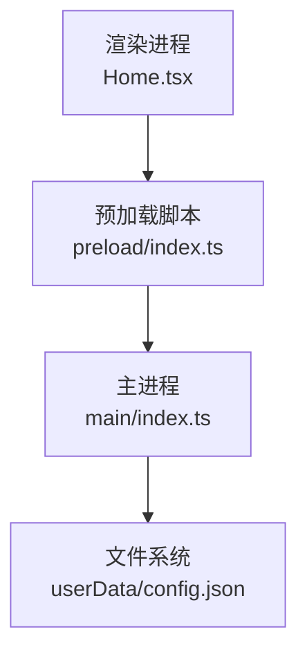
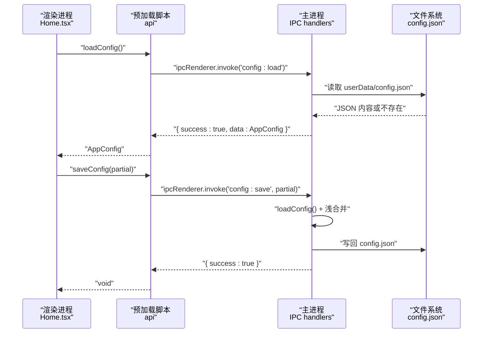
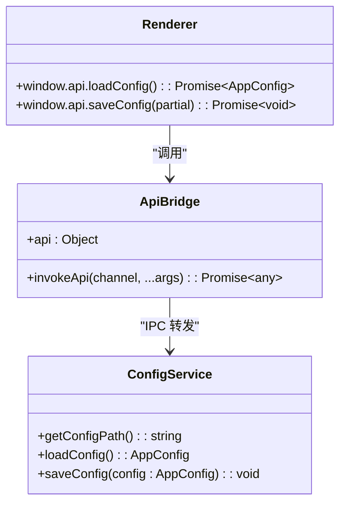

# 配置管理API

<cite>
**本文引用的文件**
- [src/main/index.ts](file://src/main/index.ts)
- [src/preload/index.ts](file://src/preload/index.ts)
- [src/renderer/src/env.d.ts](file://src/renderer/src/env.d.ts)
- [src/renderer/src/pages/Home.tsx](file://src/renderer/src/pages/Home.tsx)
- [tests/configAndUtils.test.ts](file://tests/configAndUtils.test.ts)
</cite>

## 更新摘要
**变更内容**
- 新增 autoCloseBrowser 和 autoCloseApp 配置项的完整支持
- 更新 TypeScript 类型定义与实际实现保持一致
- 完善配置项清单和使用示例
- 增强配置验证规则和错误处理说明

## 目录
1. [简介](#简介)
2. [项目结构](#项目结构)
3. [核心组件](#核心组件)
4. [架构总览](#架构总览)
5. [详细组件分析](#详细组件分析)
6. [依赖关系分析](#依赖关系分析)
7. [性能与可靠性](#性能与可靠性)
8. [故障排查指南](#故障排查指南)
9. [结论](#结论)
10. [附录：配置项清单与示例](#附录配置项清单与示例)

## 简介
本文件面向应用开发者与系统集成人员，系统化说明"视频合并App"的配置管理API。重点覆盖以下方面：
- 两个核心接口：loadConfig、saveConfig 的完整定义与调用时序
- 配置文件结构与字段语义、默认值策略、类型约束
- 配置的持久化机制、版本兼容性与迁移策略
- 配置验证规则、错误处理与调试方法
- 实际使用示例与常见配置场景

## 项目结构
配置管理相关代码分布在主进程、预加载脚本与渲染层三类文件中：
- 主进程负责读取/写入用户数据目录下的 JSON 配置文件，并通过 IPC 暴露能力
- 预加载脚本将能力安全地暴露给渲染进程
- 渲染进程通过 window.api 调用配置接口，并在界面中展示和编辑设置

**图表来源**
- [src/main/index.ts:217-225](file://src/main/index.ts#L217-L225)
- [src/preload/index.ts:21-24](file://src/preload/index.ts#L21-L24)
- [src/renderer/src/pages/Home.tsx:760-770](file://src/renderer/src/pages/Home.tsx#L760-L770)

**章节来源**
- [src/main/index.ts:129-180](file://src/main/index.ts#L129-L180)
- [src/preload/index.ts:1-72](file://src/preload/index.ts#L1-L72)
- [src/renderer/src/pages/Home.tsx:70-95](file://src/renderer/src/pages/Home.tsx#L70-L95)

## 核心组件
- 配置数据结构 AppConfig：定义所有可持久化的配置项及其可选性
- 配置路径解析 getConfigPath：定位用户数据目录并返回 config.json 路径
- 配置加载 loadConfig：从磁盘读取并解析 JSON，失败时返回空对象
- 配置保存 saveConfig：以浅合并方式更新现有配置并落盘
- IPC 通道 config:load / config:save：对外暴露异步 API
- 预加载桥接 api.loadConfig / api.saveConfig：在渲染进程侧统一封装调用

**章节来源**
- [src/main/index.ts:131-180](file://src/main/index.ts#L131-L180)
- [src/main/index.ts:217-225](file://src/main/index.ts#L217-L225)
- [src/preload/index.ts:21-24](file://src/preload/index.ts#L21-L24)
- [src/renderer/src/env.d.ts:7-10](file://src/renderer/src/env.d.ts#L7-L10)

## 架构总览
配置管理的端到端调用流程如下：

**图表来源**
- [src/main/index.ts:217-225](file://src/main/index.ts#L217-L225)
- [src/main/index.ts:153-180](file://src/main/index.ts#L153-L180)
- [src/preload/index.ts:21-24](file://src/preload/index.ts#L21-L24)
- [src/renderer/src/pages/Home.tsx:760-770](file://src/renderer/src/pages/Home.tsx#L760-L770)

## 详细组件分析

### 接口定义：loadConfig 与 saveConfig
- 入口位置
  - 主进程 IPC 处理器：config:load、config:save
  - 预加载脚本暴露：api.loadConfig、api.saveConfig
  - 渲染进程类型声明：Window.api.loadConfig/saveConfig

- 行为约定
  - 返回值格式：成功返回 { success: true, data?: any }；失败返回 { success: false, message?: string }
  - 预加载层自动解包：成功时直接返回 data，失败时抛出 Error(message)
  - 渲染进程可直接 await 调用，无需手动判断 success

- 关键实现要点
  - loadConfig：若配置文件不存在或解析异常，返回空对象 {}
  - saveConfig：先读取当前配置，再与传入的部分配置进行浅合并后写回

**章节来源**
- [src/main/index.ts:217-225](file://src/main/index.ts#L217-L225)
- [src/preload/index.ts:9-18](file://src/preload/index.ts#L9-L18)
- [src/preload/index.ts:21-24](file://src/preload/index.ts#L21-L24)
- [src/renderer/src/env.d.ts:7-10](file://src/renderer/src/env.d.ts#L7-L10)

### 配置文件结构：AppConfig
- 存储位置
  - 用户数据目录下的 config.json（由 app.getPath('userData') 决定）
- 字段列表与类型
  - inputFolder?: string — 输入文件夹路径
  - outputFolder?: string — 输出文件夹路径
  - outputFileName?: string — 输出文件名模板（未在当前界面使用）
  - darkMode?: boolean — 深色模式开关（未在当前界面使用）
  - concurrency?: number — 并行合并数
  - maxIntervalHours?: number — 同场直播判定间隔（小时）
  - autoOpenWebsite?: boolean — 完成后自动打开网站
  - autoOpenFolder?: boolean — 完成后自动打开输出文件夹
  - pluginLinkage?: boolean — B站插件联动开关
  - autoCloseBrowser?: boolean — 打开B站页面后最小化浏览器
  - autoCloseApp?: boolean — 投稿完成后关闭 App
  - hiddenFolderKeys?: string[] — 已排除分组键集合

- 默认值策略
  - 首次运行无配置文件时，loadConfig 返回空对象 {}
  - 各字段均为可选，未设置的字段视为 undefined
  - 界面逻辑对部分字段提供运行时默认值（例如并发数、间隔等），但这些默认值不写入配置文件

**更新** 新增了 autoCloseBrowser 和 autoCloseApp 两个配置项，用于控制B站插件联动时的自动化行为

**章节来源**
- [src/main/index.ts:131-143](file://src/main/index.ts#L131-L143)
- [src/main/index.ts:145-180](file://src/main/index.ts#L145-L180)
- [src/renderer/src/env.d.ts:36-49](file://src/renderer/src/env.d.ts#L36-L49)

### 持久化机制与合并策略
- 路径解析
  - 使用 app.getPath('userData') 获取系统默认用户数据目录
  - 开发模式下可通过环境变量覆盖 userData 根目录（设计文档建议）
- 读写策略
  - 读：存在则 JSON.parse，否则返回 {}
  - 写：先 loadConfig 得到 current，再以浅合并 { ...current, ...incoming } 生成 merged，最后 writeFileSync 持久化
- 合并语义
  - 新值覆盖旧值
  - 未提供的字段保持不变
  - 可将字段显式设为 undefined 以"清除"该字段（测试用例覆盖）

**章节来源**
- [src/main/index.ts:145-151](file://src/main/index.ts#L145-L151)
- [src/main/index.ts:169-180](file://src/main/index.ts#L169-L180)
- [tests/configAndUtils.test.ts:8-46](file://tests/configAndUtils.test.ts#L8-L46)

### 版本兼容性与迁移策略
- 兼容性原则
  - 新增字段采用可选类型，旧配置不包含新字段不影响运行
  - 删除字段需配合迁移逻辑，避免残留脏数据
- 迁移方案（设计文档建议）
  - 应用启动时检测旧路径是否存在，复制到新的 userData 默认路径后清理旧文件
  - 开发期支持通过环境变量覆盖 userData 根目录以便调试

**章节来源**
- [deliverables/software-company/视频合并app-增量设计-2026-07-06.md:356-362](file://deliverables/software-company/视频合并app-增量设计-2026-07-06.md#L356-L362)

### 配置验证规则与错误处理
- 验证规则
  - 当前实现未对字段值做严格校验（如路径合法性、数值范围等）
  - 建议在 IPC 入口处增加参数校验（设计文档建议 A4）
- 错误处理
  - 读取失败：捕获异常并记录日志，返回空对象
  - 写入失败：捕获异常并记录日志，保持原配置不变
  - 预加载层：当后端返回 success:false 时抛出 Error(message)，便于上层 try/catch 捕获
- 调试方法
  - 主进程控制台打印配置路径与读写结果
  - 渲染进程捕获并提示加载失败原因

**章节来源**
- [src/main/index.ts:153-180](file://src/main/index.ts#L153-L180)
- [src/preload/index.ts:9-18](file://src/preload/index.ts#L9-L18)
- [src/renderer/src/pages/Home.tsx:90-92](file://src/renderer/src/pages/Home.tsx#L90-L92)
- [deliverables/software-company/视频合并app-增量设计-2026-07-06.md:315-339](file://deliverables/software-company/视频合并app-增量设计-2026-07-06.md#L315-L339)

### 使用示例与常见场景
- 应用启动时加载配置并初始化界面状态
- 用户选择输入/输出文件夹后自动保存对应路径
- 用户在设置面板调整并发数、间隔、自动打开选项后保存
- 批量合并完成后根据开关自动打开输出目录或网站
- **新增**：B站插件联动时根据配置自动最小化浏览器和关闭应用

**更新** 增加了 autoCloseBrowser 和 autoCloseApp 配置项的使用场景说明

**章节来源**
- [src/renderer/src/pages/Home.tsx:70-95](file://src/renderer/src/pages/Home.tsx#L70-L95)
- [src/renderer/src/pages/Home.tsx:310-353](file://src/renderer/src/pages/Home.tsx#L310-L353)
- [src/renderer/src/pages/Home.tsx:760-770](file://src/renderer/src/pages/Home.tsx#L760-L770)

## 依赖关系分析
- 模块耦合
  - preload 仅依赖 ipcRenderer 与 contextBridge，职责单一
  - main 通过 fs 与 path 操作本地文件，IPC 作为对外契约
  - renderer 通过 Window.api 类型声明获得强类型提示
- 外部依赖
  - Electron 内置模块：app、ipcMain、ipcRenderer、dialog、shell、fs、path
  - 第三方工具库：@electron-toolkit/utils（用于应用标识与优化）

**图表来源**
- [src/main/index.ts:145-180](file://src/main/index.ts#L145-L180)
- [src/preload/index.ts:9-24](file://src/preload/index.ts#L9-L24)
- [src/renderer/src/env.d.ts:7-10](file://src/renderer/src/env.d.ts#L7-L10)

**章节来源**
- [src/main/index.ts:1-6](file://src/main/index.ts#L1-L6)
- [src/preload/index.ts:1-3](file://src/preload/index.ts#L1-L3)
- [src/renderer/src/env.d.ts:1-10](file://src/renderer/src/env.d.ts#L1-L10)

## 性能与可靠性
- 性能
  - 配置读写为轻量 I/O，影响极小
  - 合并策略为浅合并，时间复杂度 O(n)（n 为配置字段数）
- 可靠性
  - 读写均包裹 try/catch，避免崩溃
  - 写入前合并确保不会丢失其他字段
  - 建议后续引入原子写入（临时文件+rename）提升健壮性

## 故障排查指南
- 常见问题
  - 首次运行无配置：loadConfig 返回空对象，属正常现象
  - 写入失败：检查目标目录权限与磁盘空间
  - 配置未生效：确认是否调用 saveConfig 且返回 success:true
  - **新增**：autoCloseBrowser/autoCloseApp 配置无效：检查是否在设置面板中正确保存
- 定位步骤
  - 查看主进程控制台日志中的配置路径与读写信息
  - 在渲染进程捕获并打印错误消息
  - 检查 userData 目录下 config.json 的实际内容
  - **新增**：验证配置项是否正确保存到 JSON 文件中

**更新** 增加了新配置项相关的故障排查指导

**章节来源**
- [src/main/index.ts:153-180](file://src/main/index.ts#L153-L180)
- [src/preload/index.ts:9-18](file://src/preload/index.ts#L9-L18)
- [src/renderer/src/pages/Home.tsx:90-92](file://src/renderer/src/pages/Home.tsx#L90-L92)

## 结论
配置管理API以简洁可靠的 JSON 文件为核心，通过 IPC 在渲染进程与主进程之间传递。其浅合并策略保证了向后兼容与最小侵入式更新。新增的 autoCloseBrowser 和 autoCloseApp 配置项进一步完善了B站插件联动的自动化体验。建议在未来增强参数校验、原子写入与更完善的错误诊断，以提升整体健壮性与可维护性。

## 附录：配置项清单与示例

### 配置项清单
- inputFolder?: string — 输入文件夹路径
- outputFolder?: string — 输出文件夹路径
- outputFileName?: string — 输出文件名模板（未在当前界面使用）
- darkMode?: boolean — 深色模式开关（未在当前界面使用）
- concurrency?: number — 并行合并数
- maxIntervalHours?: number — 同场直播判定间隔（小时）
- autoOpenWebsite?: boolean — 完成后自动打开网站
- autoOpenFolder?: boolean — 完成后自动打开输出文件夹
- pluginLinkage?: boolean — B站插件联动开关
- **autoCloseBrowser?: boolean — 打开B站页面后最小化浏览器**
- **autoCloseApp?: boolean — 投稿完成后关闭 App**
- hiddenFolderKeys?: string[] — 已排除分组键集合

**更新** 新增了 autoCloseBrowser 和 autoCloseApp 配置项的详细说明

### 典型使用示例（路径引用）
- 应用启动加载配置并初始化界面
  - [src/renderer/src/pages/Home.tsx:70-95](file://src/renderer/src/pages/Home.tsx#L70-L95)
- 选择输入/输出文件夹后自动保存
  - [src/renderer/src/pages/Home.tsx:236-239](file://src/renderer/src/pages/Home.tsx#L236-L239)
- 设置面板保存并发数、间隔与自动打开选项
  - [src/renderer/src/pages/Home.tsx:760-770](file://src/renderer/src/pages/Home.tsx#L760-L770)
- **新增**：B站插件联动时根据配置自动最小化浏览器
  - [src/renderer/src/pages/Home.tsx:313-324](file://src/renderer/src/pages/Home.tsx#L313-L324)
- **新增**：投稿完成后根据配置自动关闭应用
  - [src/renderer/src/pages/Home.tsx:337-343](file://src/renderer/src/pages/Home.tsx#L337-L343)
- 预加载层统一封装调用与错误解包
  - [src/preload/index.ts:9-24](file://src/preload/index.ts#L9-L24)
- 主进程 IPC 处理器与配置读写
  - [src/main/index.ts:217-225](file://src/main/index.ts#L217-L225)
  - [src/main/index.ts:153-180](file://src/main/index.ts#L153-L180)