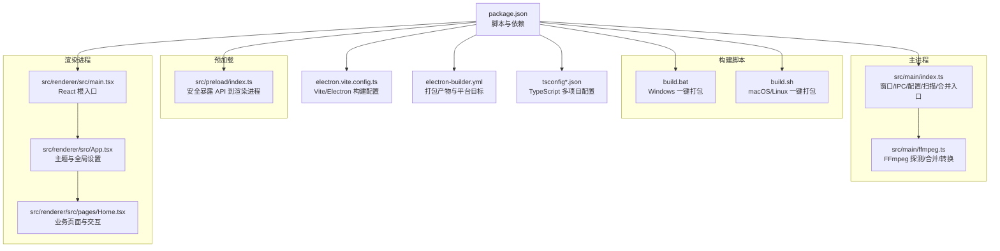
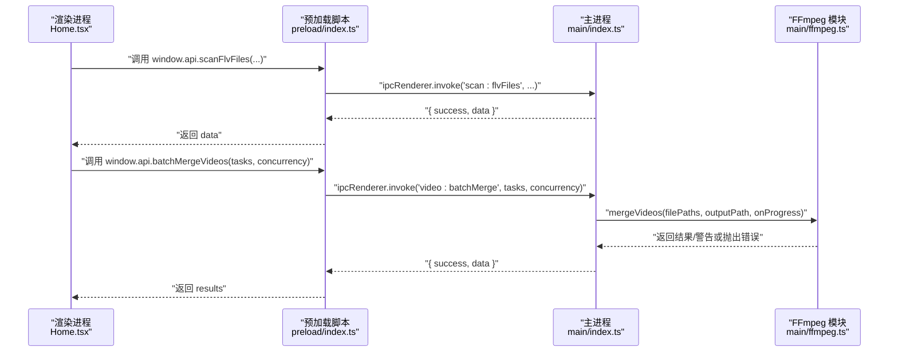
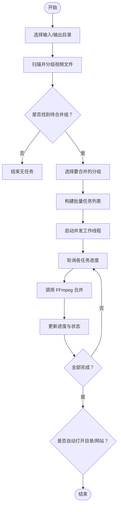
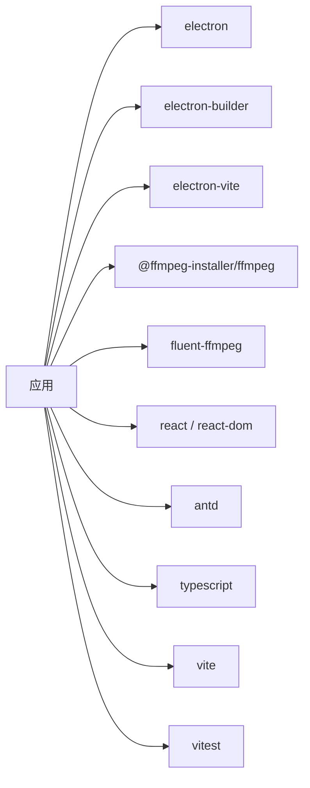

# 快速开始

<cite>
**本文引用的文件**
- [package.json](file://package.json)
- [electron.vite.config.ts](file://electron.vite.config.ts)
- [tsconfig.json](file://tsconfig.json)
- [tsconfig.node.json](file://tsconfig.node.json)
- [tsconfig.web.json](file://tsconfig.web.json)
- [src/main/index.ts](file://src/main/index.ts)
- [src/preload/index.ts](file://src/preload/index.ts)
- [src/renderer/src/main.tsx](file://src/renderer/src/main.tsx)
- [src/renderer/src/App.tsx](file://src/renderer/src/App.tsx)
- [src/renderer/src/pages/Home.tsx](file://src/renderer/src/pages/Home.tsx)
- [src/main/ffmpeg.ts](file://src/main/ffmpeg.ts)
- [electron-builder.yml](file://electron-builder.yml)
- [build.bat](file://build.bat)
- [build.sh](file://build.sh)
- [README.md](file://README.md)
</cite>

## 更新摘要
**所做更改**
- 更新了构建与打包章节，详细介绍新的跨平台一键打包脚本
- 增强了快速开始指南，提供更清晰的环境搭建步骤
- 添加了构建脚本的功能特性说明
- 完善了系统要求和依赖安装说明

## 目录
1. [简介](#简介)
2. [项目结构](#项目结构)
3. [核心组件](#核心组件)
4. [架构总览](#架构总览)
5. [详细组件分析](#详细组件分析)
6. [依赖分析](#依赖分析)
7. [性能考虑](#性能考虑)
8. [故障排除指南](#故障排除指南)
9. [结论](#结论)
10. [附录](#附录)

## 简介
本指南面向初次接触该项目的开发者，帮助你在最短时间内完成环境搭建、安装依赖、运行开发模式、构建与打包应用。项目基于 Electron + Vite + React 技术栈，使用 FFmpeg 进行视频合并与转码，提供图形化界面用于批量扫描、分组与一键合并直播分段视频为 MP4。

## 项目结构
仓库采用分层组织：主进程、预加载脚本、渲染进程（React）、构建配置与测试用例等。



图表来源
- [package.json:1-42](file://package.json#L1-L42)
- [electron.vite.config.ts:1-21](file://electron.vite.config.ts#L1-L21)
- [electron-builder.yml:1-26](file://electron-builder.yml#L1-L26)
- [tsconfig.json:1-8](file://tsconfig.json#L1-L8)
- [tsconfig.node.json:1-19](file://tsconfig.node.json#L1-L19)
- [tsconfig.web.json:1-18](file://tsconfig.web.json#L1-L18)
- [build.bat:1-30](file://build.bat#L1-L30)
- [build.sh:1-27](file://build.sh#L1-L27)
- [src/main/index.ts:1-530](file://src/main/index.ts#L1-L530)
- [src/main/ffmpeg.ts:1-305](file://src/main/ffmpeg.ts#L1-L305)
- [src/preload/index.ts:1-64](file://src/preload/index.ts#L1-L64)
- [src/renderer/src/main.tsx:1-11](file://src/renderer/src/main.tsx#L1-L11)
- [src/renderer/src/App.tsx:1-49](file://src/renderer/src/App.tsx#L1-L49)
- [src/renderer/src/pages/Home.tsx:1-760](file://src/renderer/src/pages/Home.tsx#L1-L760)

章节来源
- [package.json:1-42](file://package.json#L1-L42)
- [electron.vite.config.ts:1-21](file://electron.vite.config.ts#L1-L21)
- [electron-builder.yml:1-26](file://electron-builder.yml#L1-L26)
- [tsconfig.json:1-8](file://tsconfig.json#L1-L8)
- [tsconfig.node.json:1-19](file://tsconfig.node.json#L1-L19)
- [tsconfig.web.json:1-18](file://tsconfig.web.json#L1-L18)

## 核心组件
- 主进程（Electron）
  - 负责创建窗口、管理用户配置、处理 IPC 请求、调用 FFmpeg 执行合并/转换、维护进度状态。
- 预加载脚本
  - 通过 contextBridge 将受控的 API 暴露给渲染进程，统一封装成功/失败返回格式。
- 渲染进程（React + Ant Design）
  - 提供选择输入/输出目录、扫描视频、分组展示、批量并行合并、进度显示与设置面板等交互。
- FFmpeg 集成
  - 使用 @ffmpeg-installer/ffmpeg 与 fluent-ffmpeg，支持快速探测、流拷贝合并与重新编码转换。
- 构建与打包
  - electron-vite 负责开发与构建；electron-builder 负责生成安装包与分发产物；提供跨平台一键打包脚本。

章节来源
- [src/main/index.ts:1-530](file://src/main/index.ts#L1-L530)
- [src/preload/index.ts:1-64](file://src/preload/index.ts#L1-L64)
- [src/renderer/src/pages/Home.tsx:1-760](file://src/renderer/src/pages/Home.tsx#L1-L760)
- [src/main/ffmpeg.ts:1-305](file://src/main/ffmpeg.ts#L1-L305)
- [electron.vite.config.ts:1-21](file://electron.vite.config.ts#L1-L21)
- [electron-builder.yml:1-26](file://electron-builder.yml#L1-L26)

## 架构总览
下图展示了从渲染进程发起操作到主进程执行 FFmpeg 的核心流程。



图表来源
- [src/renderer/src/pages/Home.tsx:183-298](file://src/renderer/src/pages/Home.tsx#L183-L298)
- [src/preload/index.ts:21-49](file://src/preload/index.ts#L21-L49)
- [src/main/index.ts:421-469](file://src/main/index.ts#L421-L469)
- [src/main/ffmpeg.ts:87-245](file://src/main/ffmpeg.ts#L87-L245)

## 详细组件分析

### 环境与系统要求
- Node.js
  - 建议使用较新的 LTS 版本（例如 v18+），以确保与 Electron 33 及 Vite 生态兼容。
- 操作系统
  - Windows 10 / 11（推荐，默认打包目标 NSIS）。
  - macOS / Linux（可参考 electron-builder 配置扩展目标）。
- 磁盘空间
  - 建议预留至少 500MB 空间用于临时文件与输出 MP4（含内置 Chromium 和 FFmpeg）。
- 内存
  - 建议 4GB 以上以获得更好的性能体验。

章节来源
- [package.json:21-40](file://package.json#L21-L40)
- [electron-builder.yml:14-26](file://electron-builder.yml#L14-L26)
- [README.md:108-115](file://README.md#L108-L115)

### 依赖安装
- 首次克隆后，在项目根目录执行：
  ```bash
  npm install
  ```
- 说明
  - package.json 定义了 postinstall 钩子，自动安装 electron-builder 的平台相关依赖。
  - 若网络受限，可配置国内镜像或使用代理。
  - 安装过程会自动下载 FFmpeg 二进制文件。

章节来源
- [package.json:8-16](file://package.json#L8-L16)
- [package.json:17-40](file://package.json#L17-L40)

### 开发环境配置
- 启动开发服务器（热重载）
  ```bash
  npm run dev
  ```
- 预览构建产物
  ```bash
  npm run preview
  ```
- TypeScript 多项目配置
  - tsconfig.json 引用 node/web 两个子配置，分别对应主进程与渲染进程。
- Vite 别名
  - 在渲染端启用 @ 指向 src/renderer/src，便于导入。

章节来源
- [package.json:8-16](file://package.json#L8-L16)
- [tsconfig.json:1-8](file://tsconfig.json#L1-L8)
- [tsconfig.node.json:1-19](file://tsconfig.node.json#L1-L19)
- [tsconfig.web.json:1-18](file://tsconfig.web.json#L1-L18)
- [electron.vite.config.ts:12-19](file://electron.vite.config.ts#L12-L19)

### 构建与打包
- 构建（仅编译）
  ```bash
  npm run build
  ```
- 本地打包（不签名，生成目录）
  ```bash
  npm run pack
  ```
- 正式打包（生成安装包）
  ```bash
  npm run dist
  ```
- **一键打包脚本**（新增功能）
  - Windows: `build.bat`
    - 自动设置中文编码
    - 显示打包进度和时间统计
    - 错误处理和友好提示
    - 完成后自动打开输出目录
  - macOS/Linux: `build.sh`
    - 跨平台兼容性支持
    - 自动权限检查和错误处理
    - 智能打开输出目录（支持 explorer.exe 和 xdg-open）
- 产物位置
  - 默认位于 dist 目录，Windows 下生成 NSIS 安装包。

**更新** 新增了跨平台一键打包脚本，提供更友好的打包体验和错误处理机制。

章节来源
- [package.json:8-16](file://package.json#L8-L16)
- [electron-builder.yml:1-26](file://electron-builder.yml#L1-L26)
- [build.bat:1-30](file://build.bat#L1-L30)
- [build.sh:1-27](file://build.sh#L1-L27)

### 运行与基本使用
- 启动应用
  ```bash
  npm run dev
  ```
- 典型操作流程
  - 选择输入文件夹（包含 FLV/M4S/TS/BLV 片段）
  - 选择输出文件夹（保存合并后的 MP4）
  - 点击"扫描视频"，按日期与标题分组并过滤已合并项
  - 勾选需要合并的分组，点击"一键合并选中视频"
  - 查看进度与结果，可选择自动打开输出目录与投稿页面

章节来源
- [src/renderer/src/pages/Home.tsx:112-165](file://src/renderer/src/pages/Home.tsx#L112-L165)
- [src/renderer/src/pages/Home.tsx:183-298](file://src/renderer/src/pages/Home.tsx#L183-L298)

### 关键数据流与处理逻辑
- 扫描与分组
  - 递归扫描输入目录，识别视频后缀，解析文件名中的日期/时间/标题，按阈值间隔合并为同一场直播分组，并过滤已存在合并结果的组。
- 批量并行合并
  - 根据并发数创建工作线程池，逐个任务调用 FFmpeg 合并，实时轮询每个任务的进度，计算总体进度。
- 进度获取
  - 渲染进程每 500ms 轮询主进程的批量进度映射，更新 UI。



图表来源
- [src/main/index.ts:146-345](file://src/main/index.ts#L146-L345)
- [src/main/index.ts:421-469](file://src/main/index.ts#L421-L469)
- [src/renderer/src/pages/Home.tsx:221-236](file://src/renderer/src/pages/Home.tsx#L221-L236)
- [src/main/ffmpeg.ts:87-245](file://src/main/ffmpeg.ts#L87-L245)

## 依赖分析
- 运行时依赖
  - @ffmpeg-installer/ffmpeg：提供 FFmpeg 二进制
  - fluent-ffmpeg：Node 封装，简化命令构建与事件监听
- 开发依赖
  - electron、electron-vite、electron-builder：构建与打包
  - react、antd、zustand、dayjs：前端 UI 与工具库
  - typescript、vite、vitest：类型检查、构建与测试



图表来源
- [package.json:17-40](file://package.json#L17-L40)

章节来源
- [package.json:17-40](file://package.json#L17-L40)

## 性能考虑
- 合并策略
  - 优先使用 stream copy（-c copy）直接拼接，避免重编码，速度更快。
- 进度估算
  - 基于首个文件的时长与大小估算总时长，提高进度条准确性。
- 并发控制
  - 通过并发数限制同时执行的合并任务数量，平衡 I/O 与 CPU 占用。
- 超时保护
  - 对长时间运行的合并任务设置超时，避免卡死。

章节来源
- [src/main/ffmpeg.ts:162-174](file://src/main/ffmpeg.ts#L162-L174)
- [src/main/ffmpeg.ts:127-144](file://src/main/ffmpeg.ts#L127-L144)
- [src/main/index.ts:421-469](file://src/main/index.ts#L421-L469)
- [src/main/ffmpeg.ts:154-160](file://src/main/ffmpeg.ts#L154-L160)

## 故障排除指南
- 无法启动或端口冲突
  - 确保没有其他 Electron/Vite 实例占用端口；清理残留进程后重试。
- 找不到 FFmpeg
  - 确认 @ffmpeg-installer/ffmpeg 已正确安装；打包后路径需指向 app.asar.unpacked。
- 文件被占用导致合并失败
  - 部分片段可能仍在录制中，程序会自动跳过并提示；请等待录制结束后再试。
- 输出目录权限不足
  - 确保输出目录可写；必要时以管理员权限运行。
- 打包失败
  - 检查网络与镜像配置；确认系统具备必要的打包工具链（如 nsis）。
  - 使用一键打包脚本可获得更详细的错误信息和友好的提示。
- 配置未持久化
  - 开发模式下 userData 指向项目内 user-data 目录；打包后使用系统默认目录。
- 构建脚本问题
  - Windows: 确保以管理员权限运行 build.bat
  - macOS/Linux: 先执行 `chmod +x build.sh` 赋予执行权限

**更新** 新增了构建脚本相关的故障排除指导。

章节来源
- [src/main/ffmpeg.ts:8-10](file://src/main/ffmpeg.ts#L8-L10)
- [src/main/ffmpeg.ts:115-117](file://src/main/ffmpeg.ts#L115-L117)
- [src/main/index.ts:500-503](file://src/main/index.ts#L500-L503)
- [electron-builder.yml:14-26](file://electron-builder.yml#L14-L26)
- [build.bat:13-18](file://build.bat#L13-L18)
- [build.sh:12-16](file://build.sh#L12-L16)

## 结论
通过以上步骤，你可以在几分钟内完成环境搭建并运行应用。项目采用清晰的模块化设计与安全的 IPC 通信机制，结合 FFmpeg 的高效处理能力，适合批量处理直播分段视频。新增的一键打包脚本大大简化了构建流程，提供了更好的用户体验。建议在大规模合并时合理设置并发数，并根据磁盘与 CPU 资源调整参数以获得最佳体验。

## 附录

### 常用命令速查
- 安装依赖
  ```bash
  npm install
  ```
- 开发模式
  ```bash
  npm run dev
  ```
- 预览构建
  ```bash
  npm run preview
  ```
- 构建
  ```bash
  npm run build
  ```
- 本地打包
  ```bash
  npm run pack
  ```
- 正式打包
  ```bash
  npm run dist
  ```
- **一键打包（推荐）**
  - Windows: `build.bat`
  - macOS/Linux: `./build.sh`
- 运行测试
  ```bash
  npm test
  ```

**更新** 新增了一键打包命令选项。

章节来源
- [package.json:8-16](file://package.json#L8-L16)
- [build.bat:1-30](file://build.bat#L1-30)
- [build.sh:1-27](file://build.sh#L1-27)

### 关键文件定位
- 入口与脚本
  - package.json：定义脚本与依赖
- 构建配置
  - electron.vite.config.ts：Vite 与插件配置
  - tsconfig.*.json：TypeScript 多项目配置
- **构建脚本（新增）**
  - build.bat：Windows 一键打包脚本
  - build.sh：macOS/Linux 一键打包脚本
- 主进程
  - src/main/index.ts：窗口、IPC、配置、扫描、合并
  - src/main/ffmpeg.ts：FFmpeg 探测/合并/转换
- 预加载
  - src/preload/index.ts：安全暴露 API
- 渲染进程
  - src/renderer/src/main.tsx：React 根入口
  - src/renderer/src/App.tsx：主题与全局设置
  - src/renderer/src/pages/Home.tsx：业务页面与交互
- 打包
  - electron-builder.yml：打包目标与产物命名

**更新** 新增了构建脚本的文件定位信息。

章节来源
- [package.json:1-42](file://package.json#L1-L42)
- [electron.vite.config.ts:1-21](file://electron.vite.config.ts#L1-L21)
- [tsconfig.json:1-8](file://tsconfig.json#L1-L8)
- [tsconfig.node.json:1-19](file://tsconfig.node.json#L1-L19)
- [tsconfig.web.json:1-18](file://tsconfig.web.json#L1-L18)
- [build.bat:1-30](file://build.bat#L1-30)
- [build.sh:1-27](file://build.sh#L1-27)
- [src/main/index.ts:1-530](file://src/main/index.ts#L1-L530)
- [src/main/ffmpeg.ts:1-305](file://src/main/ffmpeg.ts#L1-L305)
- [src/preload/index.ts:1-64](file://src/preload/index.ts#L1-L64)
- [src/renderer/src/main.tsx:1-11](file://src/renderer/src/main.tsx#L1-L11)
- [src/renderer/src/App.tsx:1-49](file://src/renderer/src/App.tsx#L1-L49)
- [src/renderer/src/pages/Home.tsx:1-760](file://src/renderer/src/pages/Home.tsx#L1-L760)
- [electron-builder.yml:1-26](file://electron-builder.yml#L1-L26)

### 构建脚本特性详解

#### Windows 构建脚本 (build.bat)
- **编码支持**：自动设置中文编码 (chcp 936)
- **进度显示**：显示开始时间和打包进度
- **错误处理**：检测打包错误并提供友好提示
- **自动打开**：打包完成后自动打开 dist 目录
- **时间统计**：显示打包开始和结束时间

#### macOS/Linux 构建脚本 (build.sh)
- **跨平台兼容**：支持多种 Unix-like 系统
- **权限检查**：自动处理执行权限
- **智能打开**：根据系统自动选择 explorer.exe 或 xdg-open
- **错误处理**：完善的错误检测和退出码处理
- **时间统计**：显示打包耗时信息

**新增** 构建脚本的详细特性说明。

章节来源
- [build.bat:1-30](file://build.bat#L1-30)
- [build.sh:1-27](file://build.sh#L1-27)