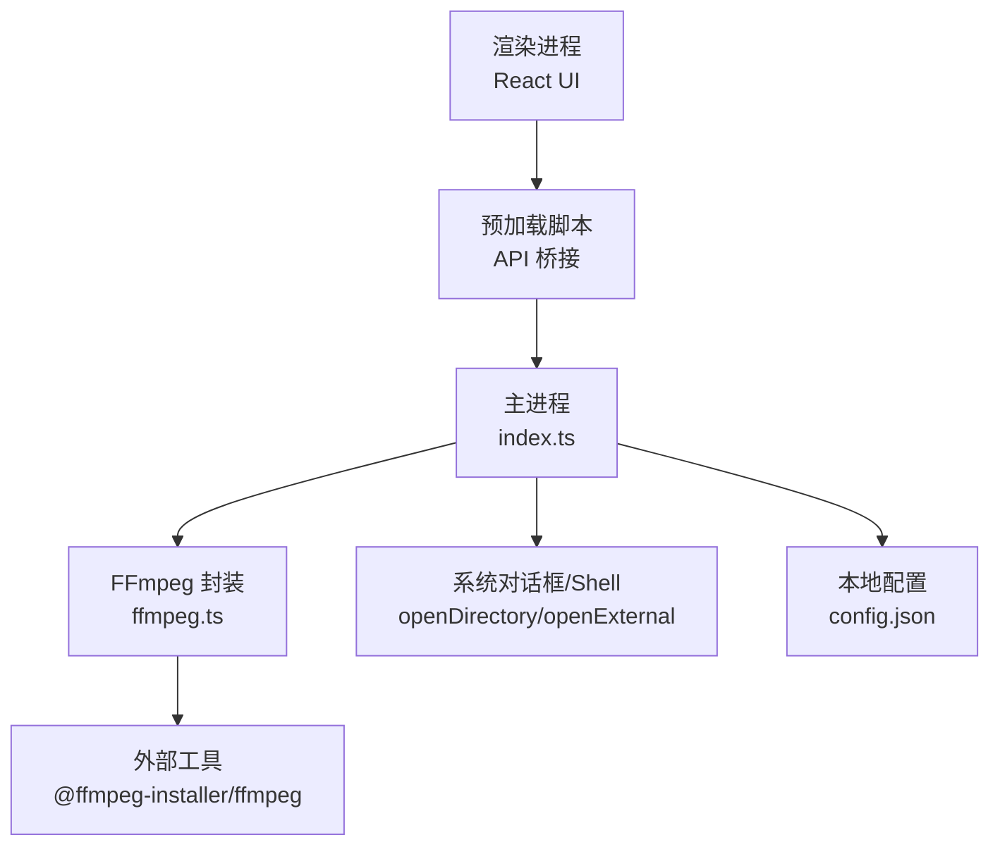
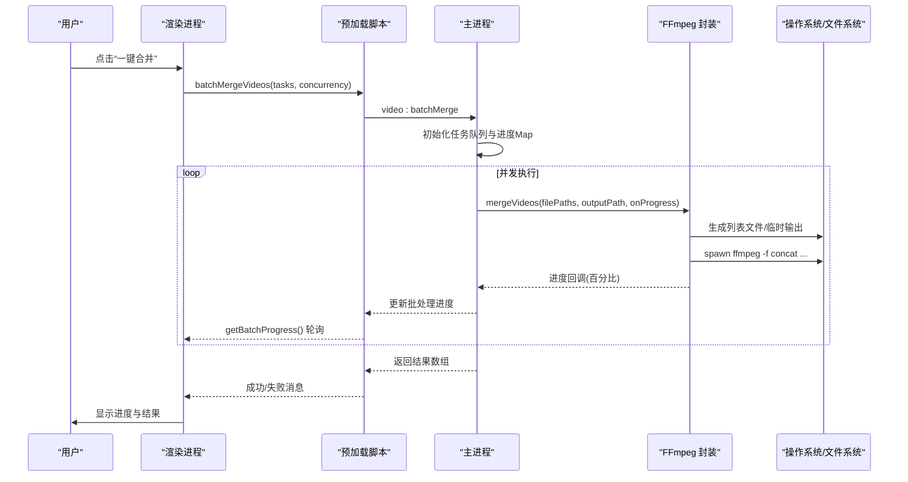
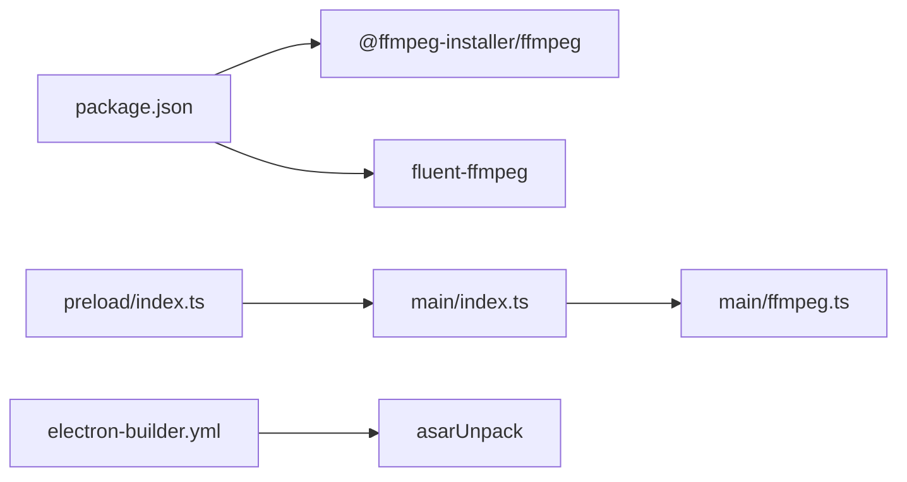

# 故障排除

<cite>
**本文引用的文件**   
- [package.json](file://package.json)
- [src/main/index.ts](file://src/main/index.ts)
- [src/main/ffmpeg.ts](file://src/main/ffmpeg.ts)
- [src/preload/index.ts](file://src/preload/index.ts)
- [electron-builder.yml](file://electron-builder.yml)
- [electron.vite.config.ts](file://electron.vite.config.ts)
- [tests/ffmpegParsing.test.ts](file://tests/ffmpegParsing.test.ts)
</cite>

## 目录
1. [简介](#简介)
2. [项目结构](#项目结构)
3. [核心组件](#核心组件)
4. [架构总览](#架构总览)
5. [详细组件分析](#详细组件分析)
6. [依赖关系分析](#依赖关系分析)
7. [性能与资源考量](#性能与资源考量)
8. [故障排除指南](#故障排除指南)
9. [结论](#结论)
10. [附录：日志与调试技巧](#附录日志与调试技巧)

## 简介
本指南聚焦于视频合并 Electron 应用在运行、打包与部署过程中可能出现的常见问题，重点覆盖 FFmpeg 路径与权限、Electron 启动异常、内存与并发瓶颈、跨平台差异、日志分析与定位方法，并提供社区支持与反馈渠道建议。读者可据此快速定位问题并实施修复。

## 项目结构
应用采用 Electron + Vite 构建，主进程负责文件系统扫描、FFmpeg 调用与 IPC 处理；预加载脚本暴露受限 API；渲染层为 React 界面。关键入口与职责如下：
- 主进程入口：窗口创建、IPC 路由、配置读写、批量任务调度
- FFmpeg 封装：探测、合并、转码、进度解析、超时保护
- 预加载桥接：统一返回格式包装、错误抛出
- 构建配置：asar 解包策略、NSIS 安装器选项

图示来源
- [src/main/index.ts:1-120](file://src/main/index.ts#L1-L120)
- [src/main/ffmpeg.ts:1-30](file://src/main/ffmpeg.ts#L1-L30)
- [src/preload/index.ts:1-30](file://src/preload/index.ts#L1-L30)
- [electron-builder.yml:11-14](file://electron-builder.yml#L11-L14)

章节来源
- [src/main/index.ts:1-120](file://src/main/index.ts#L1-L120)
- [src/main/ffmpeg.ts:1-30](file://src/main/ffmpeg.ts#L1-L30)
- [src/preload/index.ts:1-30](file://src/preload/index.ts#L1-L30)
- [electron-builder.yml:11-14](file://electron-builder.yml#L11-L14)

## 核心组件
- 配置管理：读取/写入用户数据目录下的 config.json，支持输入输出目录、并发数、自动打开开关等
- 文件扫描：递归扫描指定目录，按文件名日期+标题分组，过滤已合并结果
- FFmpeg 集成：使用 @ffmpeg-installer/ffmpeg 提供二进制，fluent-ffmpeg 或 spawn 直接调用
- 批量并行：基于 Promise.all 的并发控制，维护每个任务的独立进度
- 进度轮询：渲染端定时拉取主进程状态，避免事件监听在沙箱环境的不稳定性

章节来源
- [src/main/index.ts:16-65](file://src/main/index.ts#L16-L65)
- [src/main/index.ts:145-345](file://src/main/index.ts#L145-L345)
- [src/main/index.ts:405-478](file://src/main/index.ts#L405-L478)
- [src/main/ffmpeg.ts:8-11](file://src/main/ffmpeg.ts#L8-L11)
- [src/main/ffmpeg.ts:87-245](file://src/main/ffmpeg.ts#L87-L245)
- [src/preload/index.ts:9-18](file://src/preload/index.ts#L9-L18)

## 架构总览
下图展示从用户操作到 FFmpeg 执行的端到端流程，包括错误与进度传播路径。

图示来源
- [src/main/index.ts:421-469](file://src/main/index.ts#L421-L469)
- [src/main/ffmpeg.ts:146-245](file://src/main/ffmpeg.ts#L146-L245)
- [src/preload/index.ts:42-48](file://src/preload/index.ts#L42-L48)

## 详细组件分析

### FFmpeg 路径与权限
- 路径重定向：打包后二进制位于 app.asar.unpacked，需替换路径前缀以避免 asar 虚拟文件系统无法启动 exe
- 权限检查：合并前尝试以只读方式打开源文件，识别被占用（录制中）的文件并跳过
- 输出目录：确保存在，不存在则创建；若目标文件存在，先备份再覆盖
- 超时保护：合并过程设置 30 分钟超时，清理临时文件并拒绝 Promise

章节来源
- [src/main/ffmpeg.ts:8-11](file://src/main/ffmpeg.ts#L8-L11)
- [src/main/ffmpeg.ts:98-117](file://src/main/ffmpeg.ts#L98-L117)
- [src/main/ffmpeg.ts:119-125](file://src/main/ffmpeg.ts#L119-L125)
- [src/main/ffmpeg.ts:154-160](file://src/main/ffmpeg.ts#L154-L160)
- [src/main/ffmpeg.ts:208-234](file://src/main/ffmpeg.ts#L208-L234)

### 进度估算与解析
- 时长估算：优先通过第一个文件的 duration 和 size 计算比特率，再根据总大小估算总时长；回退为 0 时不计算进度
- 进度解析：正则匹配 time=HH:MM:SS.mmm，限制最大进度为 99.9%
- 测试覆盖：包含时长解析、进度解析、视频流信息解析用例

章节来源
- [src/main/ffmpeg.ts:127-144](file://src/main/ffmpeg.ts#L127-L144)
- [src/main/ffmpeg.ts:177-191](file://src/main/ffmpeg.ts#L177-L191)
- [tests/ffmpegParsing.test.ts:8-97](file://tests/ffmpegParsing.test.ts#L8-L97)

### 批量并行合并
- 并发控制：Promise.all 启动多个 worker，数量由 concurrency 参数决定
- 进度隔离：Map<taskId, progress> 记录每个任务进度，渲染端每 500ms 轮询
- 失败标记：任务失败将进度置为 -1，UI 显示异常状态

章节来源
- [src/main/index.ts:421-469](file://src/main/index.ts#L421-L469)
- [src/main/index.ts:471-478](file://src/main/index.ts#L471-L478)
- [src/renderer/src/pages/Home.tsx:221-236](file://src/renderer/src/pages/Home.tsx#L221-L236)

### 配置与持久化
- 存储位置：开发模式指向项目内 user-data，生产模式使用系统默认 userData
- 字段：输入输出目录、并发数、间隔阈值、自动打开开关、隐藏分组键
- 容错：读取/写入均 try/catch，失败不影响应用启动

章节来源
- [src/main/index.ts:30-65](file://src/main/index.ts#L30-L65)
- [src/main/index.ts:500-503](file://src/main/index.ts#L500-L503)

### 构建与打包
- asarUnpack：node_modules/@ffmpeg-installer/** 不被压缩，确保运行时可执行
- NSIS：允许选择安装目录，创建桌面快捷方式
- 产物命名：包含版本与扩展名

章节来源
- [electron-builder.yml:11-14](file://electron-builder.yml#L11-L14)
- [electron-builder.yml:19-26](file://electron-builder.yml#L19-L26)

## 依赖关系分析
- 运行时依赖：@ffmpeg-installer/ffmpeg（提供 ffmpeg 二进制）、fluent-ffmpeg（封装接口）
- 构建依赖：electron-vite、react、antd、vitest 等
- 预加载桥接：contextBridge 暴露 api，统一错误抛出

图示来源
- [package.json:17-20](file://package.json#L17-L20)
- [src/main/index.ts:1-6](file://src/main/index.ts#L1-L6)
- [src/main/ffmpeg.ts:1-6](file://src/main/ffmpeg.ts#L1-L6)
- [src/preload/index.ts:1-3](file://src/preload/index.ts#L1-L3)
- [electron-builder.yml:11-14](file://electron-builder.yml#L11-L14)

章节来源
- [package.json:17-20](file://package.json#L17-L20)
- [src/main/index.ts:1-6](file://src/main/index.ts#L1-L6)
- [src/main/ffmpeg.ts:1-6](file://src/main/ffmpeg.ts#L1-L6)
- [src/preload/index.ts:1-3](file://src/preload/index.ts#L1-L3)
- [electron-builder.yml:11-14](file://electron-builder.yml#L11-L14)

## 性能与资源考量
- 并发度：concurrency 过高会导致磁盘 I/O 争用与 CPU 抖动，建议 2–4
- 进度轮询：500ms 频率平衡了实时性与开销
- 估算精度：当首个文件 duration 不可用时，仅能基于字节估算，可能导致进度不准确
- 超时保护：30 分钟上限防止长时间挂起，适用于长直播片段合并

[本节为通用指导，无需具体文件引用]

## 故障排除指南

### FFmpeg 相关问题

#### 1. 找不到 ffmpeg 或启动失败
症状
- 提示“启动 FFmpeg 失败”或合并无响应
- 打包后运行报错，开发模式正常

排查步骤
- 确认 asarUnpack 包含 @ffmpeg-installer，否则运行时无法找到二进制
- 检查 FFMPEG_PATH 是否替换为 app.asar.unpacked
- 验证 node_modules 中 @ffmpeg-installer/ffmpeg 是否存在且未被压缩

修复建议
- 在 electron-builder.yml 中添加 asarUnpack 条目
- 确保主进程初始化时设置正确的 ffmpeg 路径

章节来源
- [electron-builder.yml:11-14](file://electron-builder.yml#L11-L14)
- [src/main/ffmpeg.ts:8-11](file://src/main/ffmpeg.ts#L8-L11)

#### 2. 源文件被占用导致合并失败
症状
- 提示“所有源文件都被占用”，或部分文件被跳过
- 正在录制的 FLV 片段无法读取

排查步骤
- 确认是否有其他进程（如录制软件）持有文件句柄
- 查看控制台警告，了解跳过的文件数量

修复建议
- 等待录制完成后再合并
- 调整扫描逻辑，仅选择非锁定文件进行合并

章节来源
- [src/main/ffmpeg.ts:98-117](file://src/main/ffmpeg.ts#L98-L117)

#### 3. 输出目录权限不足
症状
- 提示“无法创建输出目录”或“移动输出文件失败”
- 合并成功但无法写入最终文件

排查步骤
- 检查目标路径是否存在写权限
- 确认磁盘空间充足

修复建议
- 选择有写权限的目录（如用户文档目录）
- 避免写入受保护的根目录或网络驱动器

章节来源
- [src/main/ffmpeg.ts:119-125](file://src/main/ffmpeg.ts#L119-L125)
- [src/main/ffmpeg.ts:208-234](file://src/main/ffmpeg.ts#L208-L234)

#### 4. 合并超时
症状
- 提示“合并超时（30分钟），部分源文件可能正在录制中”

排查步骤
- 检查源文件大小与数量，评估是否需要更长时间
- 确认是否有大量文件被跳过导致实际处理时间过长

修复建议
- 分批合并，减少单次任务量
- 提升硬件性能或关闭其他高负载程序

章节来源
- [src/main/ffmpeg.ts:154-160](file://src/main/ffmpeg.ts#L154-L160)

#### 5. 进度不准确或不更新
症状
- 进度条停滞或超过 100%
- 长时间无进度变化

排查步骤
- 检查首个文件是否能正确解析 duration
- 确认 stderr 中是否包含 time= 信息

修复建议
- 若 duration 为 0，进度将无法计算，属于预期行为
- 升级 FFmpeg 版本以获得更稳定的输出格式

章节来源
- [src/main/ffmpeg.ts:127-144](file://src/main/ffmpeg.ts#L127-L144)
- [src/main/ffmpeg.ts:177-191](file://src/main/ffmpeg.ts#L177-L191)
- [tests/ffmpegParsing.test.ts:57-97](file://tests/ffmpegParsing.test.ts#L57-L97)

### Electron 应用启动问题

#### 1. 主进程模块未初始化（沙箱环境）
症状
- 启动时报错，app/ipcMain/BrowserWindow 为 undefined
- 在受限环境中无法运行 GUI

排查步骤
- 确认是否在桌面环境运行
- 检查模块顶层是否访问了未就绪的 Electron 成员

修复建议
- 将依赖 app.isPackaged 等判断移至 whenReady 之后
- 避免在模块加载阶段访问主进程全局对象

章节来源
- [src/main/index.ts:505-523](file://src/main/index.ts#L505-L523)

#### 2. 窗口无法显示或白屏
症状
- 应用启动但无界面
- 渲染页面加载失败

排查步骤
- 检查 preload 路径是否正确
- 确认 dev 模式下环境变量 ELECTRON_RENDERER_URL 是否设置

修复建议
- 校验 BrowserWindow.webPreferences.preload 指向编译后的 JS
- 开发时使用 electron-vite dev 启动

章节来源
- [src/main/index.ts:77-96](file://src/main/index.ts#L77-L96)
- [electron.vite.config.ts:1-21](file://electron.vite.config.ts#L1-21)

#### 3. 配置读取失败
症状
- 首次启动无上次选择的目录
- 设置面板无效

排查步骤
- 检查用户数据目录是否存在写权限
- 查看 loadConfig/saveConfig 的日志输出

修复建议
- 确保 userData 路径有效
- 清理损坏的 config.json 后重试

章节来源
- [src/main/index.ts:30-65](file://src/main/index.ts#L30-L65)
- [src/main/index.ts:500-503](file://src/main/index.ts#L500-L503)

### 内存泄漏与性能瓶颈

#### 1. 批量任务未清理进度 Map
症状
- 多次合并后内存持续增长
- 任务完成后仍有残留进度项

排查步骤
- 检查 batchMergeProgress 是否在完成后删除 key

修复建议
- 确保 Promise.all 完成后遍历 tasks 删除对应进度

章节来源
- [src/main/index.ts:463-468](file://src/main/index.ts#L463-L468)

#### 2. 轮询定时器未清理
症状
- 页面切换后仍在后台轮询
- 内存占用缓慢上升

排查步骤
- 检查 useEffect 或生命周期中是否 clearInterval

修复建议
- 在组件卸载或任务结束时清除定时器

章节来源
- [src/renderer/src/pages/Home.tsx:221-236](file://src/renderer/src/pages/Home.tsx#L221-L236)

#### 3. 并发度过高导致卡顿
症状
- 合并多组时系统明显卡顿
- 磁盘 I/O 飙升

排查建议
- 降低 concurrency 至 2–4
- 避免同时运行其他重型任务

[本节为通用指导，无需具体文件引用]

### 日志分析与调试技巧

#### 1. 启用详细日志
- 主进程 console.log 会输出 FFmpeg 命令、进度估算、错误堆栈
- 预加载层统一错误抛出，便于上层捕获

章节来源
- [src/main/ffmpeg.ts:172-191](file://src/main/ffmpeg.ts#L172-L191)
- [src/preload/index.ts:9-18](file://src/preload/index.ts#L9-L18)

#### 2. 定位 FFmpeg 输出问题
- 复制控制台中的完整 stderr 片段
- 使用 tests/ffmpegParsing.test.ts 中的正则表达式验证解析逻辑

章节来源
- [tests/ffmpegParsing.test.ts:8-97](file://tests/ffmpegParsing.test.ts#L8-L97)

#### 3. 调试打包后行为
- 使用 electron-builder --dir 生成未安装包，便于直接运行
- 检查 asarUnpack 是否正确解压 ffmpeg 二进制

章节来源
- [electron-builder.yml:11-14](file://electron-builder.yml#L11-L14)

### 不同操作系统下的特殊问题

#### Windows
- 路径分隔符：确保使用正斜杠或双反斜杠
- 权限：避免写入 Program Files 等受保护目录
- 杀毒软件：可能拦截子进程启动，加入白名单

章节来源
- [electron-builder.yml:14-18](file://electron-builder.yml#L14-L18)

#### macOS
- 沙盒：如需启用 sandbox，需评估 spawn 行为变化
- 权限：首次运行可能需要授予“完全磁盘访问权限”

章节来源
- [deliverables/software-company/视频合并app-增量PRD-2026-07-06.md:91-100](file://deliverables/software-company/视频合并app-增量PRD-2026-07-06.md#L91-L100)

#### Linux
- 依赖库：确保系统安装了必要的多媒体库
- 路径：注意大小写敏感与符号链接

[本节为通用指导，无需具体文件引用]

### 社区支持与反馈渠道
- 提交 Issue：描述复现步骤、操作系统、FFmpeg 版本、控制台日志
- 贡献代码：遵循现有测试与类型规范，新增用例覆盖边界情况
- 讨论区：分享最佳实践与优化经验

[本节为通用指导，无需具体文件引用]

## 结论
通过系统化梳理 FFmpeg 路径与权限、Electron 启动与配置、并发与内存管理、日志与调试方法，以及跨平台差异，用户与开发者可以快速定位并解决大多数问题。建议在发布前进行充分测试，特别是打包后的行为验证与压力测试。

[本节为总结性内容，无需具体文件引用]

## 附录：日志与调试技巧

### 常用诊断命令
- 开发模式：npm run dev
- 构建预览：npm run preview
- 打包目录：npm run pack
- 正式打包：npm run dist

章节来源
- [package.json:8-15](file://package.json#L8-L15)

### 关键日志位置
- 主进程控制台：FFmpeg 命令、进度、错误堆栈
- 预加载层：统一错误信息
- 配置文件：user-data/config.json

章节来源
- [src/main/ffmpeg.ts:172-191](file://src/main/ffmpeg.ts#L172-L191)
- [src/preload/index.ts:9-18](file://src/preload/index.ts#L9-L18)
- [src/main/index.ts:30-65](file://src/main/index.ts#L30-L65)