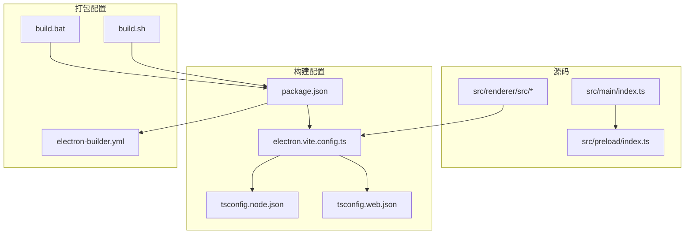
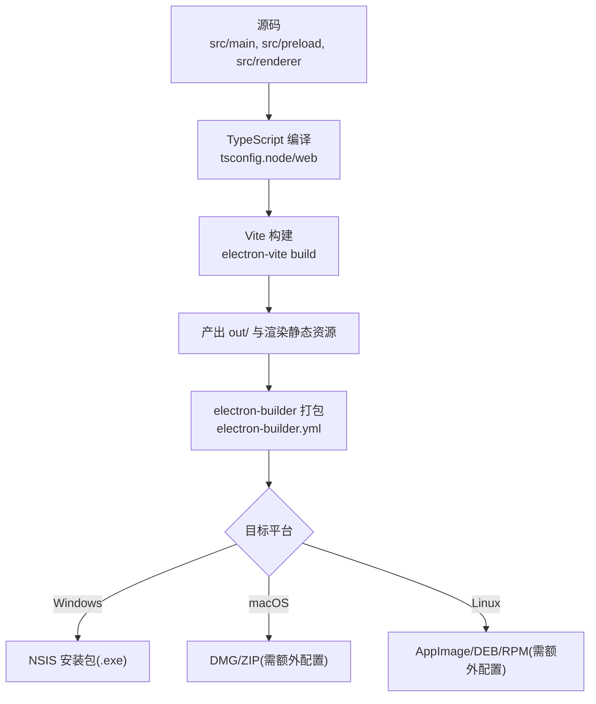
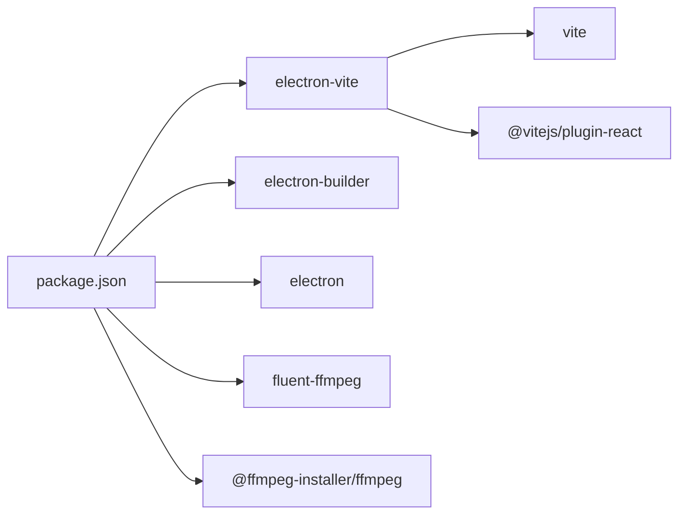

# 构建与部署

<cite>
**本文引用的文件**
- [package.json](file://package.json)
- [electron.vite.config.ts](file://electron.vite.config.ts)
- [electron-builder.yml](file://electron-builder.yml)
- [build.bat](file://build.bat)
- [build.sh](file://build.sh)
- [src/main/index.ts](file://src/main/index.ts)
- [src/preload/index.ts](file://src/preload/index.ts)
- [tsconfig.node.json](file://tsconfig.node.json)
- [tsconfig.web.json](file://tsconfig.web.json)
</cite>

## 目录
1. [简介](#简介)
2. [项目结构](#项目结构)
3. [核心组件](#核心组件)
4. [架构总览](#架构总览)
5. [详细组件分析](#详细组件分析)
6. [依赖关系分析](#依赖关系分析)
7. [性能考虑](#性能考虑)
8. [故障排查指南](#故障排查指南)
9. [结论](#结论)
10. [附录](#附录)

## 简介
本文件面向DevOps工程师与发布管理人员，提供“视频合并工具”Electron应用的完整构建、打包与分发指南。内容覆盖：
- Electron + Vite 的构建流程与配置要点
- electron-builder 打包选项与平台差异（Windows/macOS/Linux）
- CI/CD流水线设计与自动化部署方案
- 包体积优化、签名与更新机制建议
- 安全注意事项与常见问题排查

## 项目结构
本项目采用 Electron-Vite 多入口工程组织方式：
- main 进程：Node.js 环境，负责系统能力调用、FFmpeg 处理、IPC 路由
- preload 预加载：桥接渲染进程与主进程的安全 API
- renderer 渲染：React + Vite 构建产物
- 构建脚本：npm scripts + 跨平台一键打包脚本
- 打包配置：electron-builder 配置文件

图表来源
- [electron.vite.config.ts:1-21](file://electron.vite.config.ts#L1-L21)
- [tsconfig.node.json:1-19](file://tsconfig.node.json#L1-L19)
- [tsconfig.web.json:1-18](file://tsconfig.web.json#L1-L18)
- [package.json:1-42](file://package.json#L1-L42)
- [electron-builder.yml:1-26](file://electron-builder.yml#L1-L26)
- [build.bat:1-30](file://build.bat#L1-L30)
- [build.sh:1-27](file://build.sh#L1-L27)

章节来源
- [package.json:1-42](file://package.json#L1-L42)
- [electron.vite.config.ts:1-21](file://electron.vite.config.ts#L1-L21)
- [electron-builder.yml:1-26](file://electron-builder.yml#L1-L26)
- [build.bat:1-30](file://build.bat#L1-L30)
- [build.sh:1-27](file://build.sh#L1-L27)
- [tsconfig.node.json:1-19](file://tsconfig.node.json#L1-L19)
- [tsconfig.web.json:1-18](file://tsconfig.web.json#L1-L18)

## 核心组件
- 构建入口与脚本
  - npm scripts 定义了开发、预览、构建、打包等命令，统一通过 electron-vite 与 electron-builder 协作完成。
- 构建配置（electron-vite）
  - 为 main、preload 启用 externalizeDepsPlugin，避免将原生模块打入 asar；为 renderer 启用 React 插件与路径别名。
- 打包配置（electron-builder）
  - 定义应用标识、产物名、资源过滤、asarUnpack、NSIS 安装器参数等。
- 跨平台脚本
  - Windows 使用 build.bat，macOS/Linux 使用 build.sh，封装 dist 流程并打开输出目录。

章节来源
- [package.json:8-15](file://package.json#L8-L15)
- [electron.vite.config.ts:5-20](file://electron.vite.config.ts#L5-L20)
- [electron-builder.yml:1-26](file://electron-builder.yml#L1-L26)
- [build.bat:1-30](file://build.bat#L1-L30)
- [build.sh:1-27](file://build.sh#L1-L27)

## 架构总览
下图展示从源码到可分发包的关键构建与打包阶段，以及各阶段的输入输出。

图表来源
- [electron.vite.config.ts:5-20](file://electron.vite.config.ts#L5-L20)
- [tsconfig.node.json:1-19](file://tsconfig.node.json#L1-L19)
- [tsconfig.web.json:1-18](file://tsconfig.web.json#L1-L18)
- [electron-builder.yml:1-26](file://electron-builder.yml#L1-L26)

## 详细组件分析

### Electron-Vite 构建配置
- main/preload 外部化依赖
  - 使用 externalizeDepsPlugin 将 node_modules 中的依赖在运行时解析，避免将原生模块打包进 asar，减少包体并提升兼容性。
- renderer 构建
  - 启用 @vitejs/plugin-react 支持 JSX；配置路径别名 @ 指向渲染源码目录，便于引用。
- 输出目录
  - TypeScript 编译输出至 out 目录，main 入口由 package.json 指定。

章节来源
- [electron.vite.config.ts:5-20](file://electron.vite.config.ts#L5-L20)
- [tsconfig.node.json:8-17](file://tsconfig.node.json#L8-L17)
- [tsconfig.web.json:11-16](file://tsconfig.web.json#L11-L16)
- [package.json:5](file://package.json#L5)

### electron-builder 打包配置
- 应用元信息
  - appId 与 productName 用于生成应用标识与安装包名称。
- 资源过滤
  - files 排除开发相关与源码目录，仅打包必要文件，减小产物体积。
- asar 解包
  - asarUnpack 指定 resources 与 FFmpeg 安装器所在目录不被压缩，确保二进制可被正确执行。
- Windows 平台
  - executableName 设置可执行文件名；target 使用 nsis；NSIS 安装器允许自定义安装目录、创建桌面快捷方式等。
- macOS/Linux
  - 当前未显式配置，默认行为可能不满足生产需求，建议按需补充 target 与签名配置。

章节来源
- [electron-builder.yml:1-26](file://electron-builder.yml#L1-L26)

### 构建与打包脚本
- Windows 脚本（build.bat）
  - 调用 npm run dist，完成后提示产物路径并打开 dist 目录。
- macOS/Linux 脚本（build.sh）
  - 调用 npm run dist，完成后尝试打开 dist 目录（优先 explorer.exe，回退 xdg-open）。

章节来源
- [build.bat:1-30](file://build.bat#L1-L30)
- [build.sh:1-27](file://build.sh#L1-L27)
- [package.json:13-14](file://package.json#L13-L14)

### 主进程与预加载（与构建相关）
- 主进程
  - 窗口创建时根据开发/生产模式加载不同资源；设置 userData 路径；注册 IPC 通道。
- 预加载
  - 暴露统一 API 给渲染进程，封装错误返回格式，简化调用方处理。

章节来源
- [src/main/index.ts:69-97](file://src/main/index.ts#L69-L97)
- [src/main/index.ts:500-503](file://src/main/index.ts#L500-L503)
- [src/preload/index.ts:1-64](file://src/preload/index.ts#L1-L64)

## 依赖关系分析
- 构建期依赖
  - electron-vite、vite、@vitejs/plugin-react、typescript、vitest
- 运行期依赖
  - electron、fluent-ffmpeg、@ffmpeg-installer/ffmpeg
- 打包期依赖
  - electron-builder（含 NSIS 模板）

图表来源
- [package.json:17-40](file://package.json#L17-L40)

章节来源
- [package.json:17-40](file://package.json#L17-L40)

## 性能考虑
- 构建性能
  - 使用 externalizeDepsPlugin 避免打包原生模块，显著缩短构建时间并降低失败率。
  - 合理配置 tsconfig 的 include/exclude，减少不必要的编译范围。
- 运行时性能
  - 对大文件操作（如扫描、合并）在主进程进行，避免阻塞渲染线程。
  - 批量任务采用并发控制，避免过多并行导致系统抖动。
- 包体积优化
  - 利用 files 白名单与 asarUnpack 精准控制打包内容。
  - 移除未使用的 devDependencies 与大型文档/示例资源。
  - 针对 FFmpeg 二进制，保持 asarUnpack 最小集，避免重复拷贝。

[本节为通用指导，无需代码来源]

## 故障排查指南
- 构建失败
  - 检查 Node 版本与 npm 缓存；确认 native 依赖是否能在当前平台编译。
  - 若出现 asar 内无法启动二进制的问题，确认 asarUnpack 已包含对应目录。
- 打包失败（Windows）
  - 确认 NSIS 安装器可用；检查 executableName 与目标路径权限。
- 运行时问题
  - 主进程加载资源路径是否正确（开发/生产分支）。
  - FFmpeg 路径重定向是否正确（app.asar -> app.asar.unpacked）。
- 日志定位
  - 查看控制台输出的 FFmpeg 命令与错误片段，结合退出码定位问题。

章节来源
- [src/main/index.ts:92-96](file://src/main/index.ts#L92-L96)
- [src/main/index.ts:500-503](file://src/main/index.ts#L500-L503)

## 结论
本项目基于 Electron-Vite 与 electron-builder 实现了清晰的构建与打包流程。当前 Windows 平台具备完整的 NSIS 打包能力，macOS/Linux 需要补充平台特定配置以满足生产要求。建议在 CI 中引入多平台矩阵构建、产物签名与自动上传，同时持续优化包体与构建速度。

[本节为总结性内容，无需代码来源]

## 附录

### 本地构建与打包步骤
- 安装依赖
  - 执行 npm install（postinstall 会安装 electron-builder 所需依赖）
- 开发调试
  - 执行 npm run dev
- 预览构建产物
  - 执行 npm run preview
- 构建并打包
  - 执行 npm run dist
  - 或直接运行 build.bat / build.sh

章节来源
- [package.json:8-15](file://package.json#L8-L15)
- [build.bat:1-30](file://build.bat#L1-L30)
- [build.sh:1-27](file://build.sh#L1-L27)

### 平台差异与注意事项
- Windows
  - 使用 NSIS 安装器，支持自定义安装目录与桌面快捷方式。
  - 可执行文件名通过 executableName 指定。
- macOS
  - 建议配置 target 为 dmg 或 zip，并开启代码签名与公证流程。
- Linux
  - 建议配置 AppImage/DEB/RPM 目标，并根据发行版策略选择分发渠道。

章节来源
- [electron-builder.yml:14-26](file://electron-builder.yml#L14-L26)

### CI/CD 流水线建议（概念性）
- 触发条件
  - 推送至 main 分支或创建标签时触发。
- 构建矩阵
  - 按平台矩阵并行构建（Windows/macOS/Linux）。
- 缓存
  - 缓存 node_modules 与 electron 下载，加速后续构建。
- 产物
  - 上传安装包与校验文件（如 SHA256），保留构建日志。
- 发布
  - 可选：自动创建 GitHub Release 并上传产物。
- 安全
  - 使用密钥管理存储签名证书与私钥；仅在受控环境中执行签名。

[本节为概念性说明，无需代码来源]

### 签名与更新机制建议
- 代码签名
  - Windows：使用可信证书对安装包与可执行文件签名。
  - macOS：配置签名与公证，确保 Gatekeeper 放行。
  - Linux：可为 AppImage 添加签名，增强用户信任。
- 自动更新
  - 可在主进程中集成更新检查逻辑，对比远程版本后下载并静默安装。
  - 注意更新通道的隔离（稳定/测试）与回滚策略。

[本节为概念性说明，无需代码来源]

### 安全考虑
- 最小权限原则
  - 仅暴露必要的 IPC 接口，避免直接暴露文件系统与网络访问。
- 输入校验
  - 对用户提供的路径与参数进行严格校验，防止路径穿越与注入。
- 资源完整性
  - 对关键二进制（如 FFmpeg）进行完整性校验，避免被篡改。
- 日志脱敏
  - 避免在日志中输出敏感路径或用户数据。

[本节为概念性说明，无需代码来源]