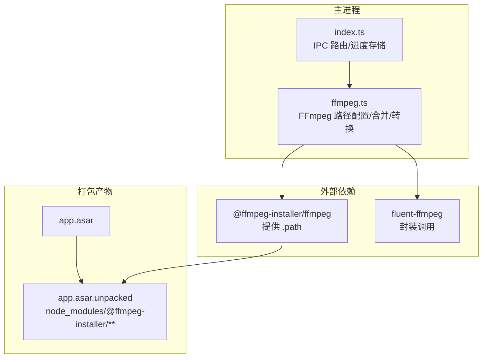
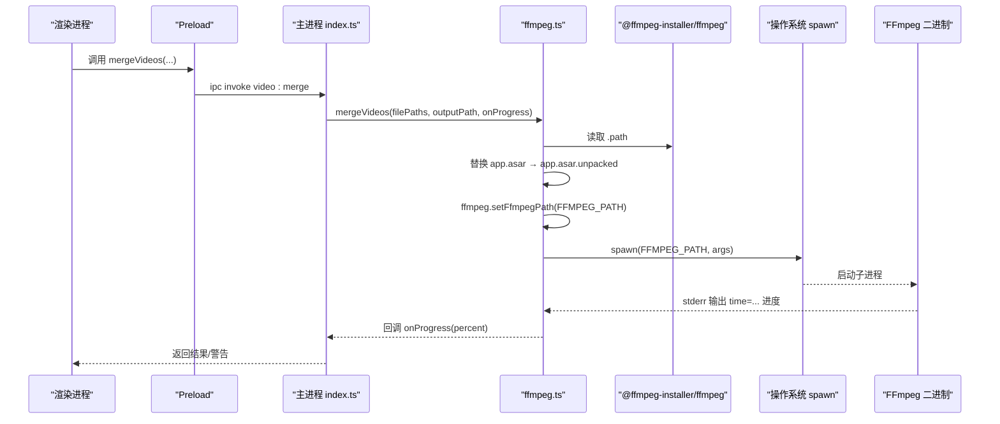
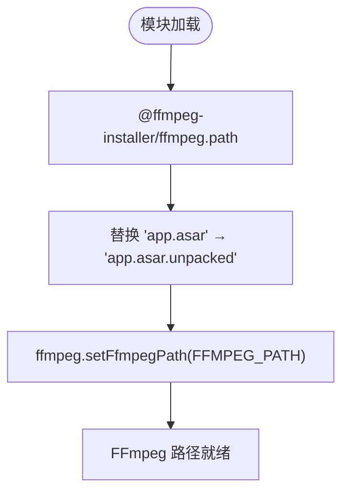
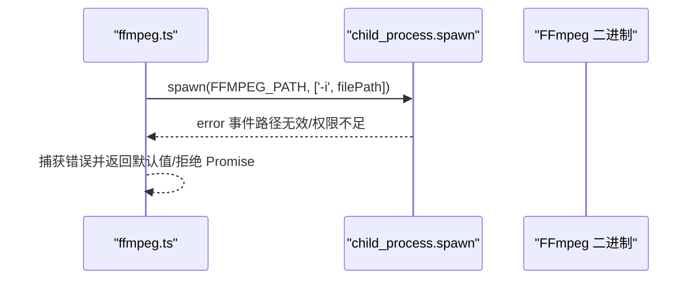
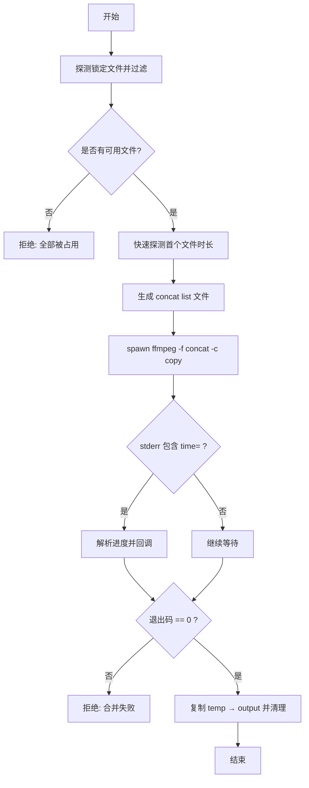
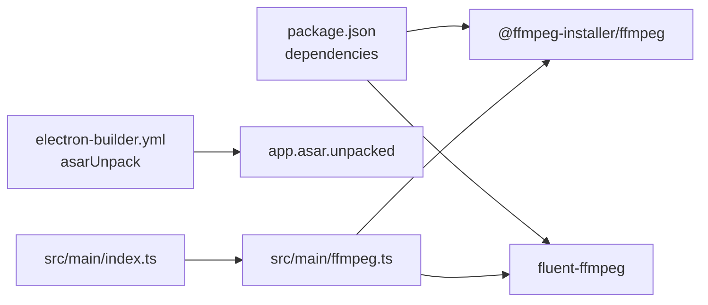

# FFmpeg二进制文件管理

<cite>
**本文引用的文件列表**
- [src/main/ffmpeg.ts](file://src/main/ffmpeg.ts)
- [package.json](file://package.json)
- [electron-builder.yml](file://electron-builder.yml)
- [src/main/index.ts](file://src/main/index.ts)
- [tests/configAndUtils.test.ts](file://tests/configAndUtils.test.ts)
</cite>

## 目录
1. [简介](#简介)
2. [项目结构](#项目结构)
3. [核心组件](#核心组件)
4. [架构总览](#架构总览)
5. [详细组件分析](#详细组件分析)
6. [依赖关系分析](#依赖关系分析)
7. [性能考量](#性能考量)
8. [故障排查指南](#故障排查指南)
9. [结论](#结论)
10. [附录](#附录)

## 简介
本文件聚焦于 Electron 应用中 FFmpeg 二进制文件的安装、路径解析与 asar 打包兼容性处理，深入解释 FFMPEG_PATH 的动态重定向逻辑（app.asar → app.asar.unpacked）、ffmpeg.setFfmpegPath() 的配置方式以及进程启动时的路径验证。同时提供跨平台兼容性、版本管理与依赖更新策略建议，并给出二进制损坏检测、自动修复与降级回退的工程化方案，帮助集成外部工具的开发人员构建稳健的复杂依赖管理体系。

## 项目结构
本项目采用标准 Electron 三段式：主进程负责 IPC 与业务编排，渲染进程为 React UI，preload 桥接安全 API。FFmpeg 相关能力集中在主进程的 ffmpeg.ts 中，通过 @ffmpeg-installer/ffmpeg 获取二进制路径，并通过 electron-builder 的 asarUnpack 将二进制解包到 app.asar.unpacked，以解决 spawn 无法在 asar 虚拟文件系统内执行可执行文件的问题。

图表来源
- [src/main/ffmpeg.ts:1-11](file://src/main/ffmpeg.ts#L1-L11)
- [electron-builder.yml:11-13](file://electron-builder.yml#L11-L13)
- [package.json:17-20](file://package.json#L17-L20)

章节来源
- [src/main/ffmpeg.ts:1-11](file://src/main/ffmpeg.ts#L1-L11)
- [electron-builder.yml:11-13](file://electron-builder.yml#L11-L13)
- [package.json:17-20](file://package.json#L17-L20)

## 核心组件
- 路径解析与重定向：从 @ffmpeg-installer/ffmpeg 提供的 path 出发，将 app.asar 替换为 app.asar.unpacked，得到可在系统 spawn 执行的真实路径。
- fluent-ffmpeg 配置：通过 ffmpeg.setFfmpegPath(FFMPEG_PATH) 设置全局可执行路径，使 fluent-ffmpeg 内部子进程使用指定二进制。
- 快速探测：基于 spawn 直接调用 ffmpeg -i 读取文件头，命中 Duration 后终止，毫秒级完成信息提取。
- 合并与转换：mergeVideos 使用 concat demuxer + stream copy 实现极速拼接；convertToMp4 使用 libx264/aac 进行转码。

章节来源
- [src/main/ffmpeg.ts:8-11](file://src/main/ffmpeg.ts#L8-L11)
- [src/main/ffmpeg.ts:13-58](file://src/main/ffmpeg.ts#L13-L58)
- [src/main/ffmpeg.ts:87-245](file://src/main/ffmpeg.ts#L87-L245)
- [src/main/ffmpeg.ts:254-304](file://src/main/ffmpeg.ts#L254-L304)

## 架构总览
下图展示了从用户操作到 FFmpeg 子进程调用的完整链路，包括路径重定向与 asar 解包的关键点。

图表来源
- [src/main/index.ts:391-403](file://src/main/index.ts#L391-L403)
- [src/main/ffmpeg.ts:8-11](file://src/main/ffmpeg.ts#L8-L11)
- [src/main/ffmpeg.ts:162-174](file://src/main/ffmpeg.ts#L162-L174)

## 详细组件分析

### 路径解析与 asar 兼容
- 安装机制：@ffmpeg-installer/ffmpeg 在安装时根据平台下载对应架构的 FFmpeg 二进制，并在运行时暴露 .path。
- 路径重定向：由于 Electron 打包后代码位于 app.asar，而 Node.js 的 child_process.spawn 无法在 asar 虚拟文件系统内执行 exe，因此需要将路径中的 app.asar 替换为 app.asar.unpacked，指向实际解包位置。
- 打包配置：electron-builder.yml 中通过 asarUnpack 将 node_modules/@ffmpeg-installer/** 解包，确保二进制不在 asar 内。

图表来源
- [src/main/ffmpeg.ts:8-11](file://src/main/ffmpeg.ts#L8-L11)
- [electron-builder.yml:11-13](file://electron-builder.yml#L11-L13)

章节来源
- [src/main/ffmpeg.ts:8-11](file://src/main/ffmpeg.ts#L8-L11)
- [electron-builder.yml:11-13](file://electron-builder.yml#L11-L13)

### ffmpeg.setFfmpegPath() 配置与进程启动验证
- 配置方法：在模块初始化阶段调用 ffmpeg.setFfmpegPath(FFMPEG_PATH)，使 fluent-ffmpeg 后续所有调用均使用该路径。
- 进程启动验证：
  - 直接 spawn 调用 FFMPEG_PATH 进行 -i 探测，若失败则捕获 error 事件并返回默认空信息。
  - 合并流程中，spawn 失败会触发 error 事件，统一 reject 并提示“启动 FFmpeg 失败”。
  - 转换流程中，fluent-ffmpeg 的错误回调也会统一 reject。

图表来源
- [src/main/ffmpeg.ts:21-58](file://src/main/ffmpeg.ts#L21-L58)
- [src/main/ffmpeg.ts:237-243](file://src/main/ffmpeg.ts#L237-L243)
- [src/main/ffmpeg.ts:298-301](file://src/main/ffmpeg.ts#L298-L301)

章节来源
- [src/main/ffmpeg.ts:8-11](file://src/main/ffmpeg.ts#L8-L11)
- [src/main/ffmpeg.ts:21-58](file://src/main/ffmpeg.ts#L21-L58)
- [src/main/ffmpeg.ts:237-243](file://src/main/ffmpeg.ts#L237-L243)
- [src/main/ffmpeg.ts:298-301](file://src/main/ffmpeg.ts#L298-L301)

### 合并流程（concat demuxer + stream copy）
- 前置检查：遍历输入文件，尝试 openSync 打开以探测是否被占用，记录锁定文件并跳过。
- 估算时长：对首个可用文件进行快速探测，结合文件大小估算总时长，用于进度计算。
- 生成列表：写入临时 list 文件，使用 -f concat -safe 0 -i list -c copy 进行流拷贝拼接。
- 超时保护：30 分钟超时清理临时文件并 reject。
- 输出原子性：先写 tempOutput，成功后再覆盖目标路径，必要时备份已有文件。

图表来源
- [src/main/ffmpeg.ts:98-117](file://src/main/ffmpeg.ts#L98-L117)
- [src/main/ffmpeg.ts:127-144](file://src/main/ffmpeg.ts#L127-L144)
- [src/main/ffmpeg.ts:146-174](file://src/main/ffmpeg.ts#L146-L174)
- [src/main/ffmpeg.ts:178-191](file://src/main/ffmpeg.ts#L178-L191)
- [src/main/ffmpeg.ts:200-234](file://src/main/ffmpeg.ts#L200-L234)

章节来源
- [src/main/ffmpeg.ts:87-245](file://src/main/ffmpeg.ts#L87-L245)

### 转换流程（libx264 + aac）
- 使用 fluent-ffmpeg 链式 API 设置视频/音频编码与输出选项。
- 监听 start/progress/end/error 事件，统一处理临时文件与覆盖策略。

章节来源
- [src/main/ffmpeg.ts:254-304](file://src/main/ffmpeg.ts#L254-L304)

### 测试与路径转义
- 针对 concat list 文件的路径转义逻辑，测试覆盖了单引号、中文、空格等场景，确保命令参数安全。

章节来源
- [tests/configAndUtils.test.ts:85-109](file://tests/configAndUtils.test.ts#L85-L109)

## 依赖关系分析
- 运行时依赖：
  - @ffmpeg-installer/ffmpeg：提供平台特定的 FFmpeg 二进制路径。
  - fluent-ffmpeg：封装 FFmpeg 命令行调用，支持进度回调与事件。
- 构建期依赖：
  - electron-builder：通过 asarUnpack 将 @ffmpeg-installer/** 解包，避免 asar 限制。
- 主进程入口：
  - src/main/index.ts：注册 IPC 处理器，调用 ffmpeg.ts 的导出函数。

图表来源
- [package.json:17-20](file://package.json#L17-L20)
- [electron-builder.yml:11-13](file://electron-builder.yml#L11-L13)
- [src/main/index.ts:391-403](file://src/main/index.ts#L391-L403)
- [src/main/ffmpeg.ts:8-11](file://src/main/ffmpeg.ts#L8-L11)

章节来源
- [package.json:17-20](file://package.json#L17-L20)
- [electron-builder.yml:11-13](file://electron-builder.yml#L11-L13)
- [src/main/index.ts:391-403](file://src/main/index.ts#L391-L403)
- [src/main/ffmpeg.ts:8-11](file://src/main/ffmpeg.ts#L8-L11)

## 性能考量
- 快速探测：仅读取文件头，命中 Duration 即终止，避免全文件解析开销。
- 流拷贝合并：使用 -c copy 不重新编码，极大提升拼接速度。
- 并发控制：批量合并通过 worker 队列并行执行，避免阻塞主线程。
- 进度估算：基于首个文件比特率估算总时长，减少额外 IO。

[本节为通用指导，无需具体文件引用]

## 故障排查指南
- 常见错误与定位
  - 启动失败：spawn error 或 fluent-ffmpeg error 事件，通常由路径无效、权限不足或二进制损坏导致。
  - 合并失败：exit code 非 0，查看最后若干行 stderr 日志定位原因（如输入格式不支持、文件被占用）。
  - 进度异常：time= 正则未匹配，可能是 FFmpeg 输出语言环境差异或参数问题。
- 建议的诊断步骤
  - 确认 FFMPEG_PATH 指向 app.asar.unpacked 下的正确二进制。
  - 检查 electron-builder.yml 的 asarUnpack 是否包含 @ffmpeg-installer/**。
  - 在控制台打印最终 spawn 命令，手动在终端执行以复现问题。
  - 检查输出目录权限与磁盘空间。

章节来源
- [src/main/ffmpeg.ts:200-206](file://src/main/ffmpeg.ts#L200-L206)
- [src/main/ffmpeg.ts:237-243](file://src/main/ffmpeg.ts#L237-L243)
- [src/main/ffmpeg.ts:298-301](file://src/main/ffmpeg.ts#L298-L301)

## 结论
本项目通过 @ffmpeg-installer/ffmpeg 提供跨平台二进制路径，结合 electron-builder 的 asarUnpack 与 app.asar → app.asar.unpacked 的重定向策略，解决了 Electron 打包环境下 spawn 执行可执行文件的核心难题。配合 fluent-ffmpeg 的事件驱动与快速探测、流拷贝合并等优化，实现了高性能且稳定的视频处理能力。建议在工程实践中补充二进制完整性校验、自动修复与降级回退机制，进一步提升鲁棒性与可维护性。

[本节为总结性内容，无需具体文件引用]

## 附录

### 跨平台兼容性考虑
- 平台特定二进制：@ffmpeg-installer/ffmpeg 会根据当前平台下载对应架构的可执行文件，确保在不同 OS 上均可运行。
- 路径分隔符与转义：Windows 下路径含空格与特殊字符需正确转义，测试已覆盖单引号转义逻辑。
- 环境变量优先级：fluent-ffmpeg 支持通过 FFMPEG_PATH 环境变量覆盖路径，便于调试与自定义部署。

章节来源
- [package.json:17-20](file://package.json#L17-L20)
- [tests/configAndUtils.test.ts:85-109](file://tests/configAndUtils.test.ts#L85-L109)

### 版本管理与依赖更新策略
- 固定主版本：在 package.json 中使用 ^ 前缀允许小版本升级，降低破坏性变更风险。
- 构建脚本：postinstall 执行 electron-builder install-app-deps，确保原生依赖在打包前正确链接。
- 发布流程：dist 脚本组合 build 与 electron-builder，保证产物一致性与可重复性。

章节来源
- [package.json:12-15](file://package.json#L12-L15)
- [package.json:17-20](file://package.json#L17-L20)

### 二进制损坏检测、自动修复与降级回退（工程实践建议）
- 完整性校验
  - 在应用启动时对 FFMPEG_PATH 指向的二进制执行一次轻量探测（如 -version），失败则标记为损坏。
  - 可选：对比已知哈希值，增强安全性。
- 自动修复
  - 检测到损坏后，删除当前二进制并重新安装 @ffmpeg-installer/ffmpeg，或从内置资源恢复。
  - 重试策略：指数退避 + 最大重试次数，避免频繁网络请求。
- 降级回退
  - 若自动修复失败，回退到系统 PATH 中的 ffmpeg（要求用户预装），或提示用户手动安装。
  - 在 UI 中明确展示状态（如 “FFmpeg 就绪/修复中/不可用”），并提供一键修复按钮。
- 幂等与一致性
  - 修复过程应幂等，多次执行不会产生副作用。
  - 使用临时目录与原子写入，避免半修复状态影响运行。

[本节为概念性建议，无需具体文件引用]