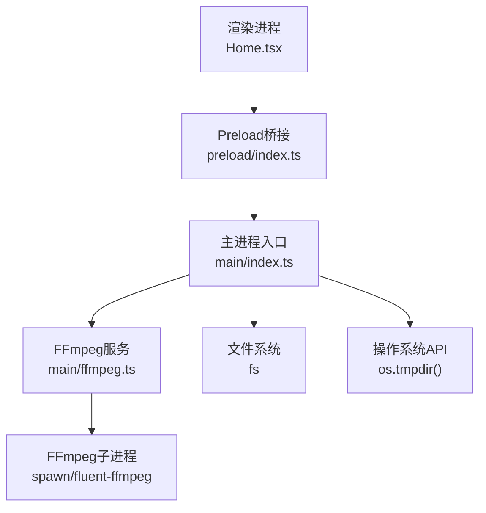
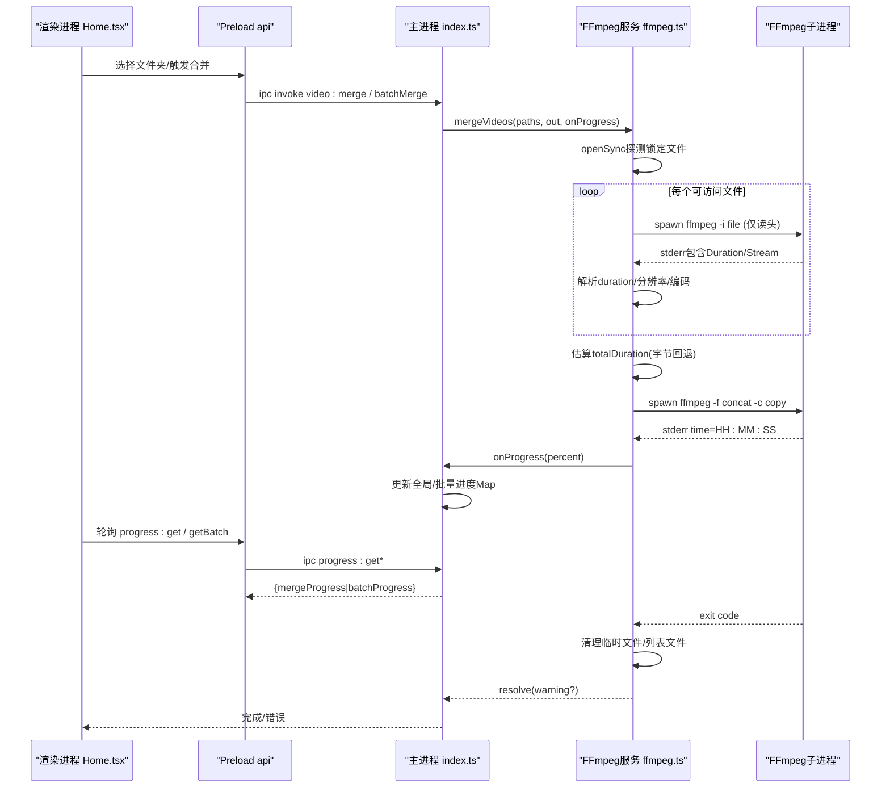
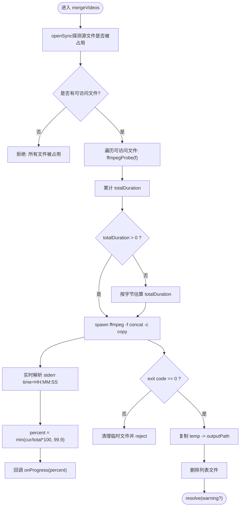
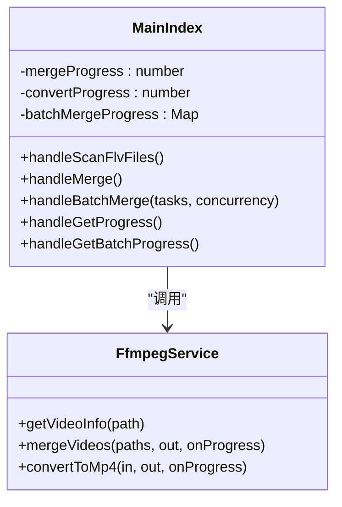
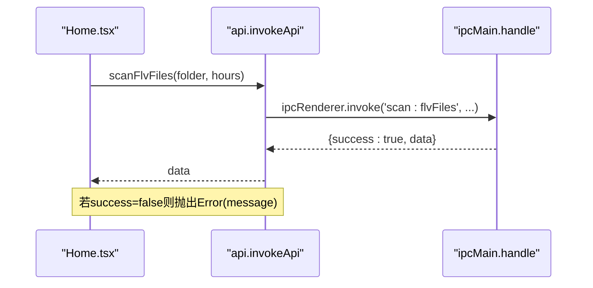
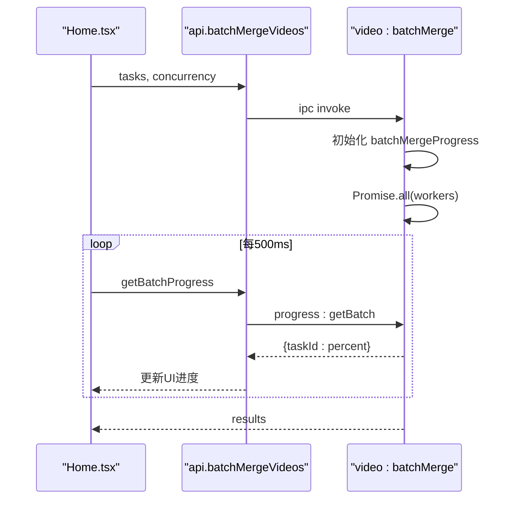
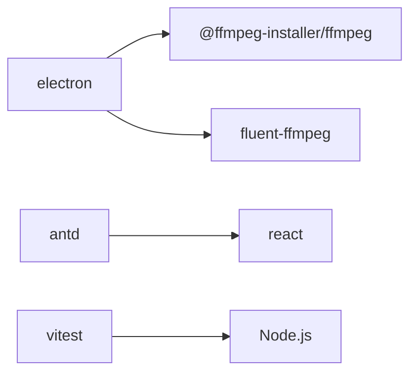

# FFmpeg集成架构

<cite>
**本文引用的文件**   
- [src/main/ffmpeg.ts](file://src/main/ffmpeg.ts)
- [src/main/index.ts](file://src/main/index.ts)
- [src/preload/index.ts](file://src/preload/index.ts)
- [src/renderer/src/pages/Home.tsx](file://src/renderer/src/pages/Home.tsx)
- [package.json](file://package.json)
- [tests/ffmpegParsing.test.ts](file://tests/ffmpegParsing.test.ts)
</cite>

## 目录
1. [引言](#引言)
2. [项目结构](#项目结构)
3. [核心组件](#核心组件)
4. [架构总览](#架构总览)
5. [详细组件分析](#详细组件分析)
6. [依赖关系分析](#依赖关系分析)
7. [性能与内存优化](#性能与内存优化)
8. [故障排查指南](#故障排查指南)
9. [结论](#结论)

## 引言
本文件面向多媒体处理开发者，系统化梳理本项目中FFmpeg集成的工程实践。内容覆盖：
- FFmpeg二进制管理、进程生命周期与资源清理策略
- 视频信息探测、流式合并处理与格式转换管道设计
- 进度追踪机制、错误处理与异常恢复策略
- 并行处理架构、任务队列管理与资源竞争避免
- FFmpeg参数优化、性能调优与内存管理最佳实践

## 项目结构
本项目采用Electron多进程架构：
- 主进程（main）负责系统能力调用、外部工具（FFmpeg）子进程管理、并发控制与持久化配置
- Preload桥接层统一封装IPC调用并做结果解包
- 渲染进程（renderer）提供交互界面与轮询获取进度

图表来源
- [src/main/index.ts:1-530](file://src/main/index.ts#L1-L530)
- [src/preload/index.ts:1-64](file://src/preload/index.ts#L1-L64)
- [src/main/ffmpeg.ts:1-305](file://src/main/ffmpeg.ts#L1-L305)

章节来源
- [src/main/index.ts:1-530](file://src/main/index.ts#L1-L530)
- [src/preload/index.ts:1-64](file://src/preload/index.ts#L1-L64)
- [src/main/ffmpeg.ts:1-305](file://src/main/ffmpeg.ts#L1-L305)

## 核心组件
- FFmpeg服务（main/ffmpeg.ts）
  - 二进制定位与路径重定向（asar.unpack）
  - 快速探测（仅读头部）
  - 流式合并（concat demuxer + stream copy）
  - 转码（H.264+AAC，faststart）
  - 进度解析与超时保护
- 主进程编排（main/index.ts）
  - IPC路由与状态存储（单任务/批量任务进度）
  - 扫描分组与过滤已合并项
  - 并发工作池（Promise.all + 索引推进）
- Preload桥接（preload/index.ts）
  - 统一invokeApi包装，成功返回data，失败抛错
- 渲染UI（renderer/Home.tsx）
  - 轮询获取进度（单任务/批量）
  - 用户设置（并发数、间隔阈值、自动打开等）

章节来源
- [src/main/ffmpeg.ts:1-305](file://src/main/ffmpeg.ts#L1-L305)
- [src/main/index.ts:1-530](file://src/main/index.ts#L1-L530)
- [src/preload/index.ts:1-64](file://src/preload/index.ts#L1-L64)
- [src/renderer/src/pages/Home.tsx:1-760](file://src/renderer/src/pages/Home.tsx#L1-L760)

## 架构总览
下图展示从UI到FFmpeg子进程的端到端流程，包括真实时长驱动的进度计算与资源清理。

图表来源
- [src/main/ffmpeg.ts:12-58](file://src/main/ffmpeg.ts#L12-L58)
- [src/main/ffmpeg.ts:87-245](file://src/main/ffmpeg.ts#L87-L245)
- [src/main/index.ts:390-469](file://src/main/index.ts#L390-L469)
- [src/preload/index.ts:21-49](file://src/preload/index.ts#L21-L49)
- [src/renderer/src/pages/Home.tsx:221-298](file://src/renderer/src/pages/Home.tsx#L221-L298)

## 详细组件分析

### FFmpeg服务（main/ffmpeg.ts）
职责
- 二进制管理：通过安装器获取路径，并将asar虚拟路径映射为unpacked实际路径
- 快速探测：使用spawn启动ffmpeg -i，读取stderr中的Duration/Stream信息后尽快终止，毫秒级完成
- 流式合并：生成concat列表文件，使用-f concat -safe 0 -i list -c copy直接拼接，输出MP4
- 转码：使用fluent-ffmpeg封装，libx264+aac，-movflags +faststart
- 进度追踪：实时解析time=HH:MM:SS，基于真实时长计算百分比，上限99.9%
- 超时保护：30分钟超时，清理临时文件并拒绝Promise
- 资源清理：合并完成后删除列表文件；失败时清理临时输出；已有输出文件备份再覆盖

关键实现要点
- 探测阶段对每个可访问文件执行一次轻量probe，汇总真实duration用于精确进度
- 当无法获取duration时，回退按文件大小与首个文件比特率估算总时长
- 使用临时文件写入，成功后原子复制/移动至目标路径，失败则清理
- 捕获子进程error/close事件，确保在异常路径下也能释放资源

图表来源
- [src/main/ffmpeg.ts:87-245](file://src/main/ffmpeg.ts#L87-L245)
- [src/main/ffmpeg.ts:12-58](file://src/main/ffmpeg.ts#L12-L58)

章节来源
- [src/main/ffmpeg.ts:1-305](file://src/main/ffmpeg.ts#L1-L305)

### 主进程编排（main/index.ts）
职责
- IPC路由：暴露scanFlvFiles、video:getInfo、video:merge、video:convert、video:batchMerge、progress:get/getBatch等
- 扫描分组：递归扫描支持的视频扩展名，按文件名时间戳+标题分组，过滤已合并的组
- 并发合并：维护批处理进度Map，使用Promise.all创建固定数量worker，按顺序取任务执行
- 进度聚合：单任务使用全局变量，批量任务使用Map<taskId, percent>，渲染端轮询获取
- 配置持久化：userData目录下config.json，支持输入/输出目录、并发数、间隔阈值、自动打开开关等

并发模型
- 使用currentIndex自增作为无锁任务指针，多个worker循环取出下一个任务
- 每个worker内部await单个mergeVideos，完成后记录结果并继续取任务
- 全部worker结束后清理进度Map并返回结果数组

图表来源
- [src/main/index.ts:145-469](file://src/main/index.ts#L145-L469)
- [src/main/ffmpeg.ts:65-305](file://src/main/ffmpeg.ts#L65-L305)

章节来源
- [src/main/index.ts:1-530](file://src/main/index.ts#L1-L530)

### Preload桥接（preload/index.ts）
职责
- 统一invokeApi包装：将主进程返回的{success,data,message}规范化，成功返回data，失败抛出Error
- 暴露安全API：配置、对话框、扫描、视频处理、进度查询等

图表来源
- [src/preload/index.ts:9-49](file://src/preload/index.ts#L9-L49)

章节来源
- [src/preload/index.ts:1-64](file://src/preload/index.ts#L1-L64)

### 渲染进程（renderer/Home.tsx）
职责
- 加载配置并自动扫描
- 构建批量任务（每个分组一个任务），发起batchMerge
- 每500ms轮询批量进度，计算总体进度
- 合并完成后根据设置自动打开输出目录和B站投稿页面（仅首次）

图表来源
- [src/renderer/src/pages/Home.tsx:204-298](file://src/renderer/src/pages/Home.tsx#L204-L298)
- [src/main/index.ts:421-469](file://src/main/index.ts#L421-L469)

章节来源
- [src/renderer/src/pages/Home.tsx:1-760](file://src/renderer/src/pages/Home.tsx#L1-L760)

## 依赖关系分析
- 运行时依赖
  - @ffmpeg-installer/ffmpeg：内嵌FFmpeg二进制，解决asar打包后无法直接exec的问题
  - fluent-ffmpeg：封装FFmpeg命令与事件（用于转码场景）
- 构建与开发依赖
  - electron/electron-builder/electron-vite：桌面应用打包与开发体验
  - antd/react：前端UI
  - vitest：测试框架

图表来源
- [package.json:17-41](file://package.json#L17-L41)

章节来源
- [package.json:1-42](file://package.json#L1-L42)

## 性能与内存优化

### FFmpeg参数与管道设计
- 合并管道
  - 使用-f concat -safe 0 -i list -c copy进行无损拼接，避免重新编码，速度极快
  - 先写临时文件，成功后复制到目标路径，失败不污染输出
- 转码管道
  - libx264 + aac，-movflags +faststart提升网络播放体验
- 探测优化
  - 仅读取文件头即终止，避免全文件扫描，降低I/O压力

### 进度追踪
- 基于真实时长：合并前对各文件执行ffmpegProbe，汇总totalDuration
- 实时解析stderr中的time字段，计算百分比并限制上限99.9%，避免溢出
- 轮询策略：渲染端每500ms轮询批量进度，平滑显示

### 并发与资源竞争
- 主进程使用固定数量worker并行执行任务，共享currentIndex无锁推进
- 每个任务独立临时目录与输出文件，避免命名冲突
- 超时保护：30分钟超时，清理临时文件并拒绝，防止僵尸进程

### 内存管理建议
- 避免长时间持有大Buffer：合并过程中仅累积少量stderr片段用于错误日志
- 及时关闭子进程：探测阶段一旦获取Duration立即kill
- 合理设置并发数：默认3，可根据CPU核数与磁盘IO调整（建议2-4）

章节来源
- [src/main/ffmpeg.ts:12-58](file://src/main/ffmpeg.ts#L12-L58)
- [src/main/ffmpeg.ts:87-245](file://src/main/ffmpeg.ts#L87-L245)
- [src/main/index.ts:421-469](file://src/main/index.ts#L421-L469)
- [src/renderer/src/pages/Home.tsx:221-298](file://src/renderer/src/pages/Home.tsx#L221-L298)
- [tests/ffmpegParsing.test.ts:57-97](file://tests/ffmpegParsing.test.ts#L57-L97)

## 故障排查指南

常见问题与定位
- 源文件被占用
  - 现象：提示“所有源文件都被占用”
  - 原因：openSync探测失败，文件正被录制软件写入
  - 处理：等待录制结束或跳过该文件
- 合并超时
  - 现象：30分钟后报错“合并超时”，可能部分文件仍在录制
  - 处理：检查源文件是否仍在写入，必要时延长超时或分批处理
- 输出覆盖失败
  - 现象：提示“无法覆盖已有文件”
  - 处理：手动删除或重命名已有输出，或启用备份逻辑后重试
- 转码失败
  - 现象：转换失败，携带具体错误消息
  - 处理：检查输入编码是否受支持，确认输出目录可写

调试技巧
- 查看控制台日志：合并/转换命令、进度、错误最后若干行
- 检查临时目录：合并/转换临时文件位于系统临时目录，可按时间戳识别
- 验证FFmpeg路径：asar.unpack路径是否正确映射

章节来源
- [src/main/ffmpeg.ts:154-160](file://src/main/ffmpeg.ts#L154-L160)
- [src/main/ffmpeg.ts:200-244](file://src/main/ffmpeg.ts#L200-L244)
- [src/main/ffmpeg.ts:298-303](file://src/main/ffmpeg.ts#L298-L303)

## 结论
本项目以Electron为主进程载体，结合FFmpeg实现了高效可靠的FLV分段合并与MP4转码能力。通过快速探测、真实时长驱动进度、并发工作池与完善的资源清理策略，系统在易用性与稳定性之间取得良好平衡。建议在后续迭代中：
- 引入更细粒度的错误分类与重试机制
- 增加任务队列与优先级调度，避免高负载下的资源争用
- 持续优化FFmpeg参数与并发度，适配不同硬件环境