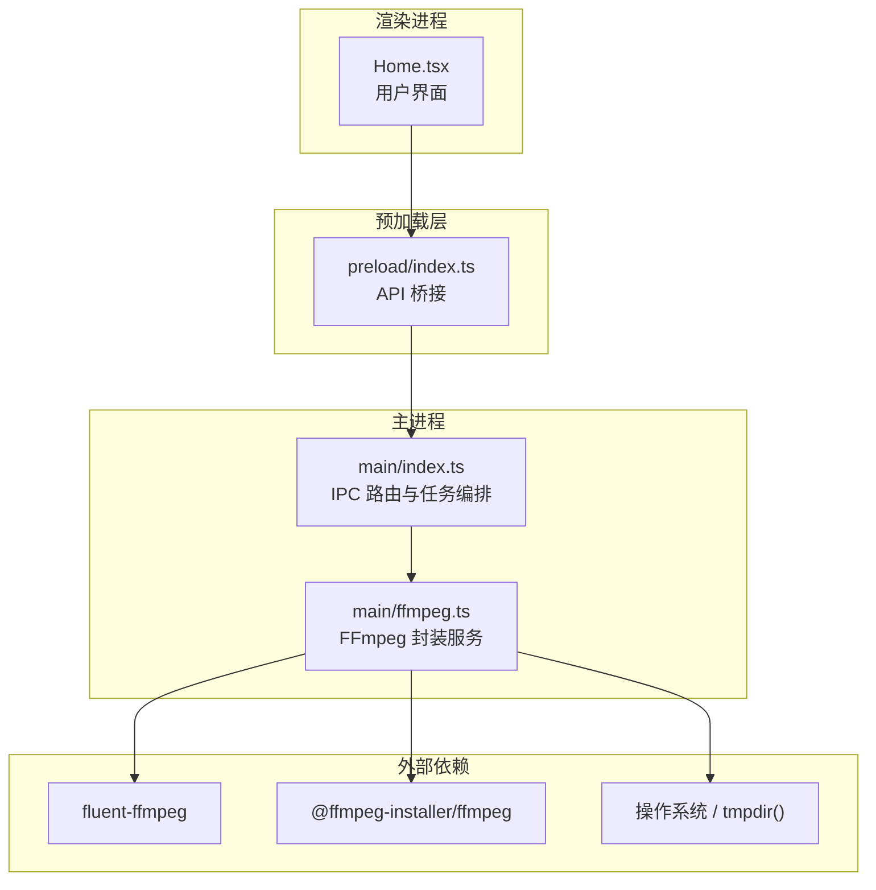
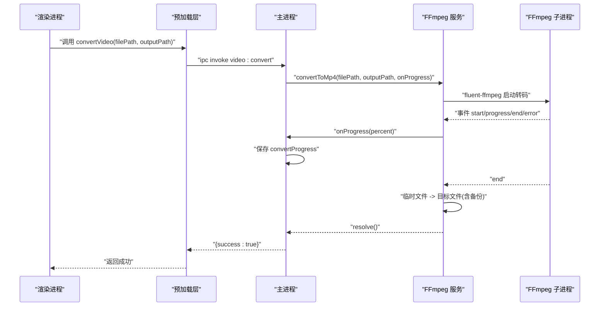
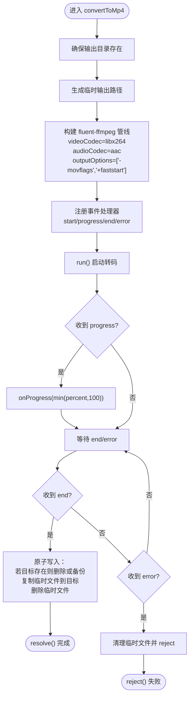
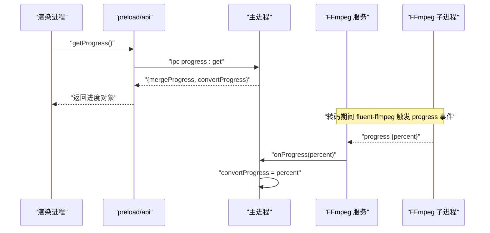
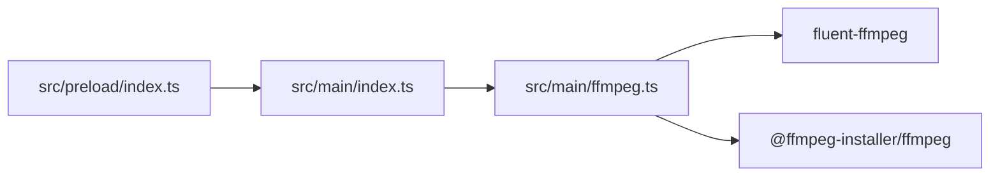

# 格式转换引擎

<cite>
**本文引用的文件列表**
- [src/main/ffmpeg.ts](file://src/main/ffmpeg.ts)
- [src/main/index.ts](file://src/main/index.ts)
- [src/preload/index.ts](file://src/preload/index.ts)
- [package.json](file://package.json)
- [tests/ffmpegParsing.test.ts](file://tests/ffmpegParsing.test.ts)
</cite>

## 目录
1. [简介](#简介)
2. [项目结构](#项目结构)
3. [核心组件](#核心组件)
4. [架构总览](#架构总览)
5. [详细组件分析](#详细组件分析)
6. [依赖关系分析](#依赖关系分析)
7. [性能与内存优化](#性能与内存优化)
8. [故障排查指南](#故障排查指南)
9. [结论](#结论)

## 简介
本文件聚焦于“格式转换引擎”的实现，围绕 convertToMp4 函数展开，深入解释其基于 fluent-ffmpeg 的调用方式、H.264 视频编码与 AAC 音频编码的配置、movflags 优化选项的作用机制，以及事件驱动的进度回调模型。同时覆盖输出文件的原子性写入策略（临时文件 + 备份）、错误处理、并发与资源管理要点，为多媒体编解码开发者提供专业级视频转换的架构设计与实践参考。

## 项目结构
该工程采用 Electron 多进程架构：渲染进程通过 preload 暴露受限 API，主进程负责文件系统与 FFmpeg 子进程调度；格式转换逻辑集中在 src/main/ffmpeg.ts。

图表来源
- [src/main/index.ts:1-20](file://src/main/index.ts#L1-L20)
- [src/preload/index.ts:1-20](file://src/preload/index.ts#L1-L20)
- [src/main/ffmpeg.ts:1-12](file://src/main/ffmpeg.ts#L1-L12)

章节来源
- [src/main/index.ts:1-50](file://src/main/index.ts#L1-L50)
- [src/preload/index.ts:1-20](file://src/preload/index.ts#L1-L20)
- [src/main/ffmpeg.ts:1-12](file://src/main/ffmpeg.ts#L1-L12)
- [package.json:17-20](file://package.json#L17-L20)

## 核心组件
- FFmpeg 路径与初始化：在应用启动时定位并设置可执行路径，解决打包后 asar 虚拟文件系统无法直接 spawn 的问题。
- 轻量探测：仅读取文件头信息以毫秒级获取时长、分辨率、编码等元数据，避免全文件解析。
- 合并流程：使用 concat demuxer 与流拷贝模式快速拼接多个片段，附带超时保护与进度估算。
- 转码流程：convertToMp4 使用 H.264 + AAC 重新编码，启用 faststart 优化 MP4 头部位置，支持进度回调与原子输出。

章节来源
- [src/main/ffmpeg.ts:8-11](file://src/main/ffmpeg.ts#L8-L11)
- [src/main/ffmpeg.ts:13-58](file://src/main/ffmpeg.ts#L13-L58)
- [src/main/ffmpeg.ts:87-245](file://src/main/ffmpeg.ts#L87-L245)
- [src/main/ffmpeg.ts:254-304](file://src/main/ffmpeg.ts#L254-L304)

## 架构总览
下图展示了从渲染进程发起转换到主进程调用 FFmpeg 的事件驱动流程，包括进度回调与输出文件原子替换。

图表来源
- [src/main/index.ts:480-493](file://src/main/index.ts#L480-L493)
- [src/preload/index.ts:39-40](file://src/preload/index.ts#L39-L40)
- [src/main/ffmpeg.ts:254-304](file://src/main/ffmpeg.ts#L254-L304)

## 详细组件分析

### convertToMp4 实现原理
- 输入校验与目录准备：确保输出目录存在，不存在则递归创建。
- 临时输出：在系统临时目录生成唯一临时文件，避免写入过程中产生不完整的目标文件。
- 编码器选择：
  - 视频编码器：libx264（H.264）
  - 音频编码器：aac（AAC）
- 容器优化：outputOptions 中设置 movflags +faststart，将 MP4 的 moov 原子移动到文件开头，提升网络播放的“边下边播”体验。
- 事件驱动进度：
  - start：记录实际执行的命令行，便于调试。
  - progress：接收 fluent-ffmpeg 提供的百分比，限制上限为 100，并通过回调上报。
  - end：完成后的原子输出步骤。
  - error：失败时清理临时文件并拒绝 Promise。
- 输出文件管理与备份策略：
  - 若目标文件已存在，优先尝试删除；若被占用，则重命名为 _backup.mp4 作为备份。
  - 将临时文件复制到目标路径后删除临时文件，保证最终输出的完整性与一致性。

图表来源
- [src/main/ffmpeg.ts:254-304](file://src/main/ffmpeg.ts#L254-L304)

章节来源
- [src/main/ffmpeg.ts:254-304](file://src/main/ffmpeg.ts#L254-L304)

### H.264 与 AAC 编码配置说明
- 视频编码 libx264：通用性强、兼容性好，适合大多数平台与播放器。
- 音频编码 aac：MP4 容器标准音频编码，广泛支持。
- movflags +faststart：将 MP4 的元数据块移至文件起始位置，改善在线播放首帧加载速度。

注意：当前实现未显式设置 CRF/preset/bitrates 等质量与性能参数，默认由 FFmpeg 内部决策。如需精细化控制，可在 outputOptions 中追加相应参数（例如预设、CRF、线程数等），但需结合目标设备与业务需求权衡。

章节来源
- [src/main/ffmpeg.ts:270-274](file://src/main/ffmpeg.ts#L270-L274)

### 进度回调机制与事件驱动模型
- fluent-ffmpeg 的 progress 事件包含 percent 字段，用于表示整体进度百分比。
- 主进程维护 convertProgress 变量，渲染进程通过轮询接口获取最新进度。
- 对于合并场景，还实现了基于 stderr 时间戳的进度估算，并在超过总时长时限制为 99.9%。

图表来源
- [src/main/index.ts:495-498](file://src/main/index.ts#L495-L498)
- [src/main/ffmpeg.ts:278-282](file://src/main/ffmpeg.ts#L278-L282)

章节来源
- [src/main/index.ts:495-498](file://src/main/index.ts#L495-L498)
- [src/main/ffmpeg.ts:278-282](file://src/main/ffmpeg.ts#L278-L282)
- [tests/ffmpegParsing.test.ts:57-97](file://tests/ffmpegParsing.test.ts#L57-L97)

### 输出文件管理、备份策略与原子操作保证
- 临时文件：所有写入先落盘至系统临时目录，避免部分写入导致的目标文件损坏。
- 备份策略：当目标文件已存在且不可直接删除时，自动重命名为 _backup.mp4，保留历史版本以便回滚。
- 原子替换：复制完成后立即删除临时文件，确保目标文件要么完整，要么保持原样（或备份）。

章节来源
- [src/main/ffmpeg.ts:283-296](file://src/main/ffmpeg.ts#L283-L296)

### 错误处理与健壮性
- 目录创建失败：明确拒绝并返回错误消息。
- 转码异常：捕获 error 事件，清理临时文件并拒绝 Promise。
- 移动输出失败：在 end 事件中处理 copy/rename/unlink 异常，确保临时文件被清理。

章节来源
- [src/main/ffmpeg.ts:259-266](file://src/main/ffmpeg.ts#L259-L266)
- [src/main/ffmpeg.ts:298-301](file://src/main/ffmpeg.ts#L298-L301)
- [src/main/ffmpeg.ts:293-296](file://src/main/ffmpeg.ts#L293-L296)

## 依赖关系分析
- fluent-ffmpeg：高层 Node.js 封装，简化 FFmpeg 命令构建与事件监听。
- @ffmpeg-installer/ffmpeg：提供跨平台 FFmpeg 二进制，解决打包后路径问题。
- Electron IPC：主进程与渲染进程通信，传递任务与进度。

图表来源
- [src/main/ffmpeg.ts:1-10](file://src/main/ffmpeg.ts#L1-L10)
- [src/main/index.ts:1-6](file://src/main/index.ts#L1-L6)
- [src/preload/index.ts:1-10](file://src/preload/index.ts#L1-L10)
- [package.json:17-20](file://package.json#L17-L20)

章节来源
- [package.json:17-20](file://package.json#L17-L20)
- [src/main/ffmpeg.ts:1-10](file://src/main/ffmpeg.ts#L1-L10)
- [src/main/index.ts:1-6](file://src/main/index.ts#L1-L6)
- [src/preload/index.ts:1-10](file://src/preload/index.ts#L1-L10)

## 性能与内存优化
- 转码路径选择：convertToMp4 进行重新编码，CPU 密集；建议在高负载场景下限制并发数量，避免系统资源耗尽。
- 进度上报频率：渲染端轮询间隔不宜过短，以免频繁 IPC 造成额外开销。
- 磁盘 I/O：临时文件位于系统临时目录，确保磁盘空间充足；大文件转换时关注可用空间与碎片化。
- 内存管理：避免在主进程持有大对象引用；尽量让 FFmpeg 子进程承担计算压力，主进程仅做状态聚合。
- 可选优化方向（按需引入）：
  - 调整 libx264 预设与 CRF 以平衡质量与速度。
  - 根据 CPU 核数设置线程参数。
  - 对超大文件考虑分片处理与断点续转（需扩展现有流程）。

[本节为通用指导，不直接分析具体文件]

## 故障排查指南
- 无法创建输出目录：检查目标路径权限与磁盘空间。
- 转换失败：查看 start 事件打印的命令与 error 事件中的错误信息；确认输入文件可读且未被占用。
- 进度不更新：确认 fluent-ffmpeg 是否返回 percent；渲染端轮询是否正常。
- 输出文件未生成：检查临时文件是否存在；确认 end 事件是否触发并完成原子写入。

章节来源
- [src/main/ffmpeg.ts:275-277](file://src/main/ffmpeg.ts#L275-L277)
- [src/main/ffmpeg.ts:298-301](file://src/main/ffmpeg.ts#L298-L301)
- [src/main/index.ts:495-498](file://src/main/index.ts#L495-L498)

## 结论
convertToMp4 基于 fluent-ffmpeg 构建了稳定可靠的转码流程，采用 H.264 + AAC 编码与 faststart 优化，配合事件驱动的进度回调与原子输出策略，兼顾了用户体验与数据安全性。面向多媒体编解码开发者，建议在后续迭代中引入更精细的质量与性能调优参数，并结合并发控制与监控指标进一步提升吞吐与稳定性。