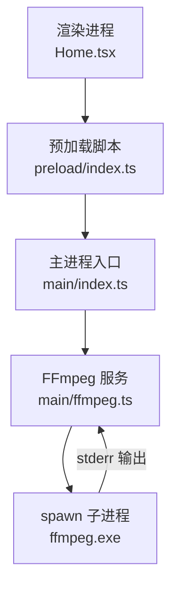
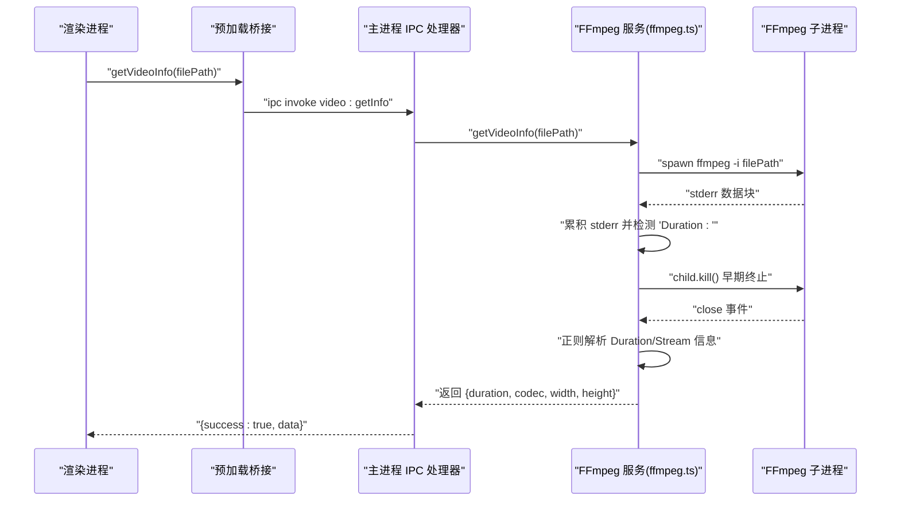
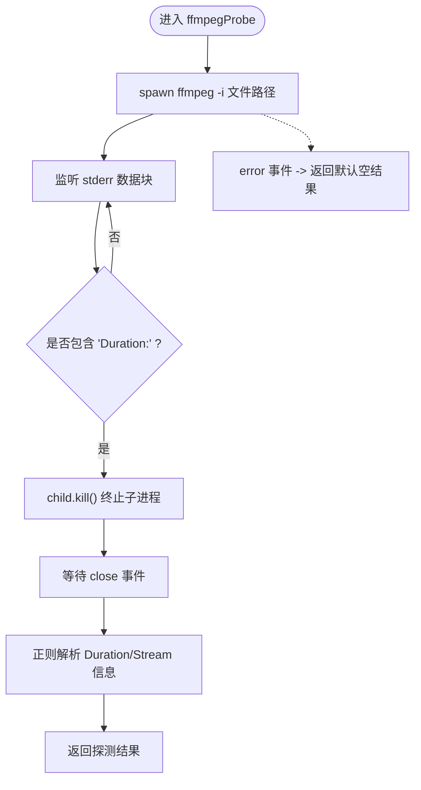
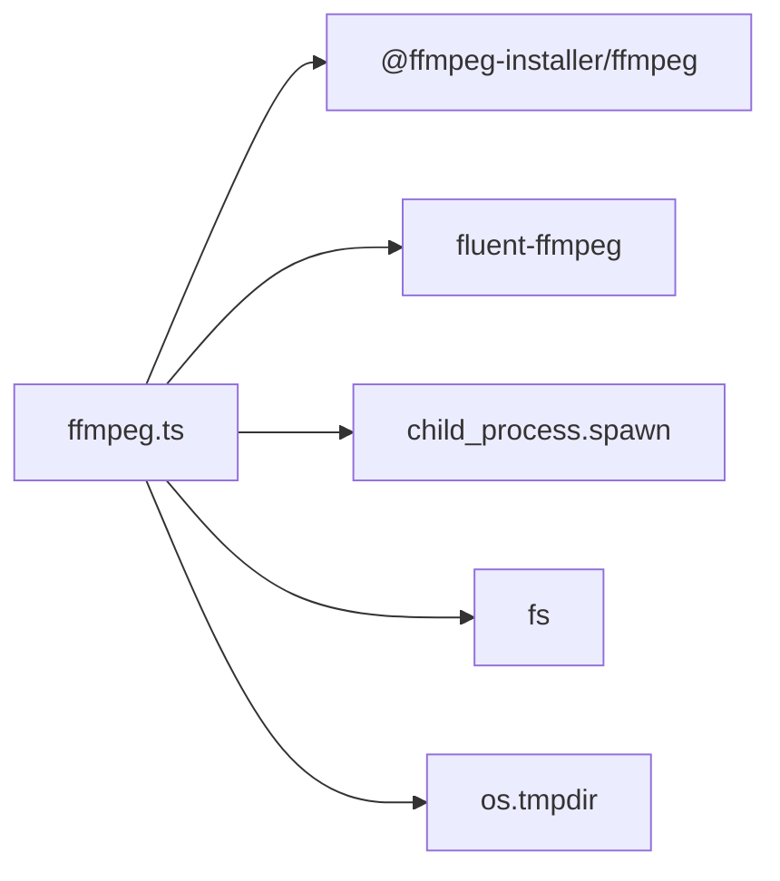

# 视频信息探测机制

<cite>
**本文引用的文件列表**
- [src/main/ffmpeg.ts](file://src/main/ffmpeg.ts)
- [src/main/index.ts](file://src/main/index.ts)
- [tests/ffmpegParsing.test.ts](file://tests/ffmpegParsing.test.ts)
- [package.json](file://package.json)
</cite>

## 目录
1. [简介](#简介)
2. [项目结构](#项目结构)
3. [核心组件](#核心组件)
4. [架构总览](#架构总览)
5. [详细组件分析](#详细组件分析)
6. [依赖关系分析](#依赖关系分析)
7. [性能考量](#性能考量)
8. [故障排查指南](#故障排查指南)
9. [结论](#结论)

## 简介
本文件聚焦于“视频信息探测机制”的实现与优化，围绕 ffmpegProbe 函数展开，系统阐述其通过 spawn 启动外部进程、监听 stderr 流、正则解析时长/视频流/音频流信息的完整流程；并说明快速探测的早期终止策略、内存控制、错误处理、超时控制与异常恢复。同时给出并发限制与资源清理等性能优化建议，帮助多媒体处理开发者构建高效的外部工具调用架构。

## 项目结构
本项目为 Electron 应用，主进程负责调用 FFmpeg 子进程进行媒体处理，渲染进程通过 IPC 发起请求并轮询进度。与探测机制直接相关的代码位于主进程的 ffmpeg 模块中，并通过 IPC 暴露给前端使用。

图表来源
- [src/main/index.ts:1-530](file://src/main/index.ts#L1-L530)
- [src/main/ffmpeg.ts:1-305](file://src/main/ffmpeg.ts#L1-L305)

章节来源
- [src/main/index.ts:1-530](file://src/main/index.ts#L1-L530)
- [src/main/ffmpeg.ts:1-305](file://src/main/ffmpeg.ts#L1-L305)

## 核心组件
- ffmpegProbe：基于 child_process.spawn 启动 ffmpeg -i 读取文件头，监听 stderr，在出现 Duration 后尽早终止子进程，随后用正则提取时长、视频流（编码、分辨率）和音频流存在性。
- getVideoInfo：对 ffmpegProbe 的结果做轻量封装，仅返回所需字段。
- mergeVideos：合并多个 FLV 片段为 MP4，内部同样使用 spawn 执行 concat demuxer，实时解析 time= 进度，支持超时保护与临时文件清理。
- convertToMp4：使用 fluent-ffmpeg 包装器进行转码（非本次重点）。

章节来源
- [src/main/ffmpeg.ts:12-77](file://src/main/ffmpeg.ts#L12-L77)
- [src/main/ffmpeg.ts:87-245](file://src/main/ffmpeg.ts#L87-L245)
- [src/main/ffmpeg.ts:254-304](file://src/main/ffmpeg.ts#L254-L304)

## 架构总览
下图展示了从渲染进程到 FFmpeg 子进程的端到端调用链，以及关键的数据流与事件回调。

图表来源
- [src/main/index.ts:380-388](file://src/main/index.ts#L380-L388)
- [src/main/ffmpeg.ts:12-77](file://src/main/ffmpeg.ts#L12-L77)

## 详细组件分析

### ffmpegProbe 实现原理
- 子进程启动
  - 使用 child_process.spawn 启动 ffmpeg.exe，参数为 -i 输入路径，不附加其他处理选项，以最小化 I/O。
  - 针对打包环境，将 @ffmpeg-installer/ffmpeg 的路径从 app.asar 重定向至 app.asar.unpacked，确保 spawn 能正确定位可执行文件。
- stderr 流监听与早期终止
  - 持续累加 stderr 文本，一旦检测到包含 “Duration:” 的行，立即调用 child.kill() 终止子进程，避免扫描整个文件。
  - 该策略使探测时间降至毫秒级，显著降低 CPU 与磁盘占用。
- 正则解析与信息提取
  - 时长解析：匹配 “HH:MM:SS.sss” 格式，转换为秒数。
  - 视频流解析：匹配 “Stream #... Video: <codec>, ... WxH”，提取编码名称、宽度和高度。
  - 音频流判断：通过是否存在 “Stream #... Audio:” 行判定。
- 错误处理与默认值
  - 子进程 error 事件触发时，返回默认空结果（duration=0，无音视频，宽高=0，编码=未知），保证上层稳定消费。

图表来源
- [src/main/ffmpeg.ts:12-58](file://src/main/ffmpeg.ts#L12-L58)

章节来源
- [src/main/ffmpeg.ts:12-58](file://src/main/ffmpeg.ts#L12-L58)
- [tests/ffmpegParsing.test.ts:8-55](file://tests/ffmpegParsing.test.ts#L8-L55)
- [tests/ffmpegParsing.test.ts:99-147](file://tests/ffmpegParsing.test.ts#L99-L147)

### 时间格式转换算法
- 输入格式：HH:MM:SS.sss（例如 01:23:45.67）
- 转换逻辑：
  - 小时部分乘以 3600
  - 分钟部分乘以 60
  - 秒部分保留小数
  - 三者相加得到总秒数
- 边界情况：
  - 未匹配到 Duration 或为空字符串时，返回 0
  - 零时长（00:00:00.00）返回 0

章节来源
- [src/main/ffmpeg.ts:35-41](file://src/main/ffmpeg.ts#L35-L41)
- [tests/ffmpegParsing.test.ts:8-55](file://tests/ffmpegParsing.test.ts#L8-L55)

### 视频流与音频流信息提取算法
- 视频流
  - 正则匹配 Stream 行中的 Video: 段，捕获编码名与分辨率 WxH
  - 若未匹配，hasVideo=false，codec 设为“未知”，宽高为 0
- 音频流
  - 通过是否存在 Stream 行中的 Audio: 段判定 hasAudio

章节来源
- [src/main/ffmpeg.ts:43-50](file://src/main/ffmpeg.ts#L43-L50)
- [tests/ffmpegParsing.test.ts:99-147](file://tests/ffmpegParsing.test.ts#L99-L147)

### 快速探测优化策略
- 早期终止
  - 在首次出现 “Duration:” 后立即 kill 子进程，避免全量读取
- 内存使用控制
  - 仅维护一个不断拼接的 stderr 字符串，直到 close 事件发生；由于只读文件头，字符串体量较小
  - 建议在极端情况下增加长度上限截断，防止异常大输出导致内存膨胀（当前实现未显式限制）
- I/O 开销最小化
  - 不附加任何编解码参数，仅打开输入流，减少解码器初始化成本

章节来源
- [src/main/ffmpeg.ts:22-32](file://src/main/ffmpeg.ts#L22-L32)

### 错误处理、超时控制与异常恢复
- 探测阶段
  - error 事件返回默认空结果，避免上层崩溃
- 合并阶段（mergeVideos）
  - 超时保护：设置 30 分钟定时器，超时则清理临时文件并拒绝 Promise
  - 退出码检查：非 0 时记录最近若干行 stderr，删除临时输出并拒绝
  - 覆盖保护：目标文件已存在时尝试备份并重命名，失败则拒绝
  - 资源清理：无论成功或失败，均尝试删除临时列表文件和临时输出文件
- 异常恢复
  - 锁定文件检测：openSync 尝试打开源文件，无法访问的文件被跳过并提示警告
  - 估算总时长：当首个文件探测失败时，回退按字节大小与比特率估算总时长，用于进度显示

章节来源
- [src/main/ffmpeg.ts:54-57](file://src/main/ffmpeg.ts#L54-L57)
- [src/main/ffmpeg.ts:154-160](file://src/main/ffmpeg.ts#L154-L160)
- [src/main/ffmpeg.ts:193-244](file://src/main/ffmpeg.ts#L193-L244)
- [src/main/ffmpeg.ts:98-117](file://src/main/ffmpeg.ts#L98-L117)
- [src/main/ffmpeg.ts:127-144](file://src/main/ffmpeg.ts#L127-L144)

### 进度计算与实时反馈
- 实时解析
  - 监听 stderr 中的 time=HH:MM:SS 字段，换算为秒数
  - 结合估算或真实总时长计算百分比，上限限制为 99.9%
- 进度上报
  - 通过 onProgress 回调向主进程更新全局进度变量，渲染进程轮询获取

章节来源
- [src/main/ffmpeg.ts:174-191](file://src/main/ffmpeg.ts#L174-L191)
- [src/main/index.ts:390-403](file://src/main/index.ts#L390-L403)

## 依赖关系分析
- 外部依赖
  - @ffmpeg-installer/ffmpeg：提供平台适配的 ffmpeg.exe 路径
  - fluent-ffmpeg：用于 convertToMp4 的高层封装（探测不使用）
- 内置模块
  - child_process.spawn：启动外部进程
  - fs：读写临时文件、统计文件大小、创建目录、复制/移动输出
  - os.tmpdir：生成临时文件路径
- 进程路径修复
  - 打包后需将 app.asar 替换为 app.asar.unpacked，否则 spawn 无法找到可执行文件

图表来源
- [src/main/ffmpeg.ts:1-10](file://src/main/ffmpeg.ts#L1-L10)
- [package.json:17-20](file://package.json#L17-L20)

章节来源
- [src/main/ffmpeg.ts:1-10](file://src/main/ffmpeg.ts#L1-L10)
- [package.json:17-20](file://package.json#L17-L20)

## 性能考量
- 并发探测限制
  - 批量合并场景下，每个分组会先对首个文件进行探测以估算总时长。为避免过多 ffmpeg 子进程竞争，建议限制并发探测数量（如与合并并发一致或更低）
- 资源清理
  - 所有临时文件（合并列表、临时输出）必须在 close/error/timeout 分支中清理，避免磁盘泄漏
- 正则与字符串拼接
  - 探测阶段仅拼接少量 stderr，但建议在超长输出场景下引入长度阈值截断，防止极端异常导致内存增长
- 估算精度
  - 当首个文件探测失败时，采用字节/比特率估算总时长，可能带来偏差；可在后续批次中动态修正

[本节为通用指导，无需源码引用]

## 故障排查指南
- 常见错误与定位
  - 子进程启动失败：检查 ffmpeg.exe 路径是否正确（app.asar.unpacked），确认环境变量与权限
  - 合并超时：检查是否有文件仍在录制中被锁定，或网络盘延迟导致 I/O 阻塞
  - 输出覆盖失败：目标文件被占用或权限不足，查看备份与重命名日志
- 调试手段
  - 打印完整命令行与最后若干行 stderr，便于定位 FFmpeg 报错原因
  - 在开发模式启用更详细的日志输出，观察 time= 进度是否稳定递增
- 恢复策略
  - 自动跳过不可访问文件并继续处理其余片段
  - 失败时清理临时文件，避免脏状态影响下一次运行

章节来源
- [src/main/ffmpeg.ts:154-160](file://src/main/ffmpeg.ts#L154-L160)
- [src/main/ffmpeg.ts:193-244](file://src/main/ffmpeg.ts#L193-L244)
- [src/main/ffmpeg.ts:98-117](file://src/main/ffmpeg.ts#L98-L117)

## 结论
ffmpegProbe 通过“最小化 I/O + 早期终止 + 正则解析”的组合策略，实现了毫秒级的视频信息探测，有效降低了外部工具调用的资源消耗。配合完善的错误处理、超时保护与资源清理，整体架构具备高可用性与可扩展性。面向多媒体处理开发者，建议在生产环境中进一步引入并发限制、内存上限与健壮的错误上报机制，以获得更稳定的大规模处理能力。