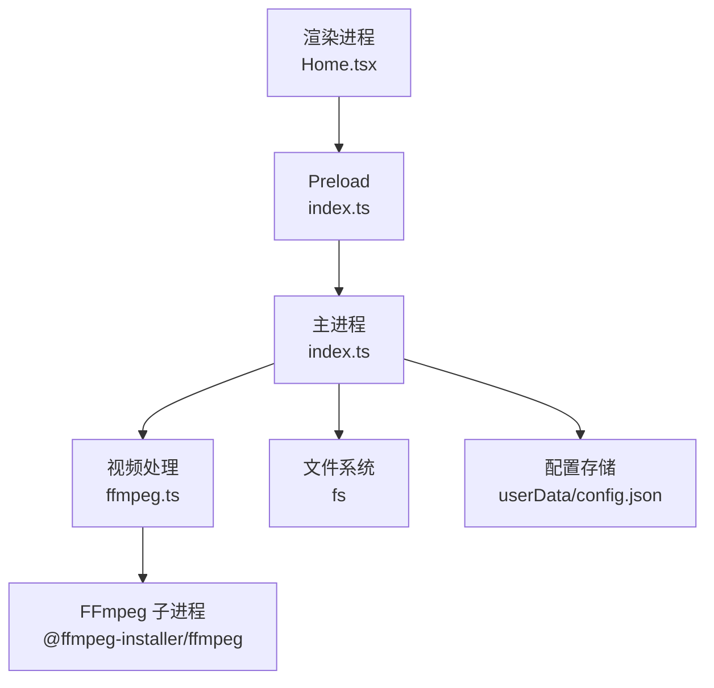
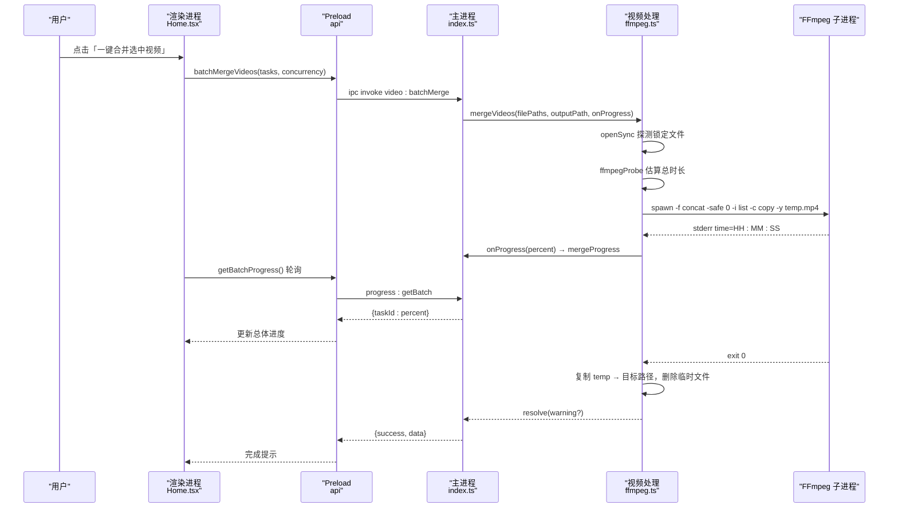
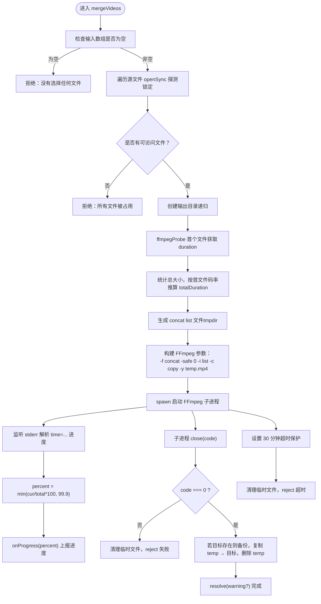
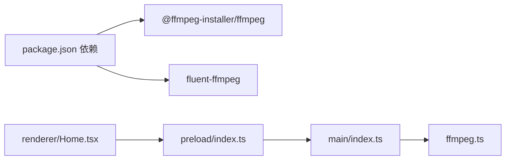
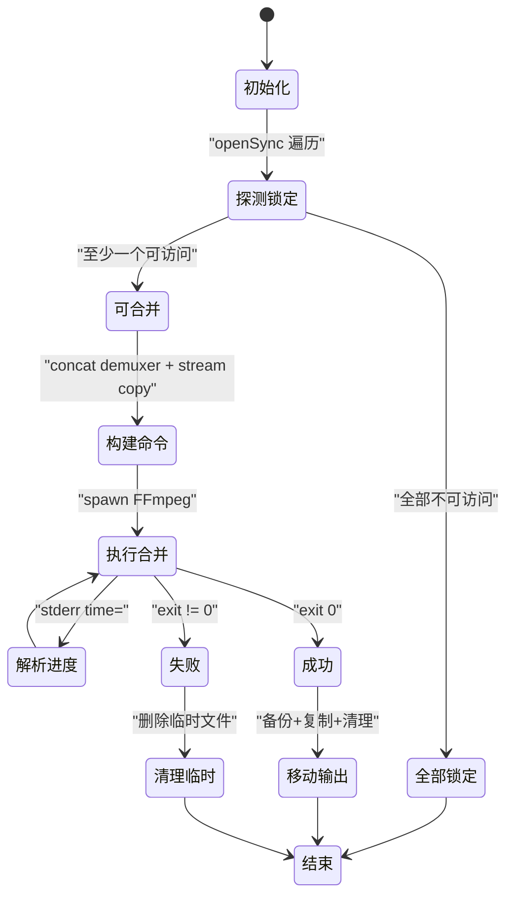

# 视频合并处理管道

<cite>
**本文引用的文件列表**
- [src/main/ffmpeg.ts](file://src/main/ffmpeg.ts)
- [src/main/index.ts](file://src/main/index.ts)
- [src/preload/index.ts](file://src/preload/index.ts)
- [src/renderer/src/pages/Home.tsx](file://src/renderer/src/pages/Home.tsx)
- [tests/ffmpegParsing.test.ts](file://tests/ffmpegParsing.test.ts)
- [package.json](file://package.json)
</cite>

## 目录
1. [简介](#简介)
2. [项目结构](#项目结构)
3. [核心组件](#核心组件)
4. [架构总览](#架构总览)
5. [详细组件分析](#详细组件分析)
6. [依赖关系分析](#依赖关系分析)
7. [性能考量与优化](#性能考量与优化)
8. [故障排查指南](#故障排查指南)
9. [结论](#结论)
10. [附录](#附录)

## 简介
本文件面向视频处理开发者，系统化梳理“视频合并处理管道”的工程实现，重点围绕 mergeVideos 函数的完整流程：包括文件访问权限检查、临时文件管理、concat demuxer 的使用、FLV 拼接的 stream copy 模式与参数调优、基于 time 参数的实时进度解析与百分比计算、文件锁定检测与跳过策略、错误处理、超时控制与资源清理。文档同时给出大规模文件处理的工程化建议与可视化图示，帮助读者快速理解并落地实践。

## 项目结构
本项目采用 Electron 三段式进程模型（主进程 / preload / 渲染进程），核心视频处理逻辑位于主进程的 ffmpeg.ts，通过 IPC 暴露给渲染进程调用。关键入口与职责如下：
- 主进程 index.ts：窗口创建、IPC 路由、批量任务调度、配置持久化
- 视频处理 ffmpeg.ts：FFmpeg 探测、mergeVideos 合并、convertToMp4 转码
- Preload 层 index.ts：统一封装 invokeApi，向渲染进程暴露安全 API
- 渲染进程 Home.tsx：用户交互、扫描分组、批量并行合并 UI 与轮询

图表来源
- [src/main/index.ts:1-120](file://src/main/index.ts#L1-L120)
- [src/main/ffmpeg.ts:1-20](file://src/main/ffmpeg.ts#L1-L20)
- [src/preload/index.ts:1-20](file://src/preload/index.ts#L1-L20)

章节来源
- [src/main/index.ts:1-120](file://src/main/index.ts#L1-L120)
- [src/main/ffmpeg.ts:1-20](file://src/main/ffmpeg.ts#L1-L20)
- [src/preload/index.ts:1-20](file://src/preload/index.ts#L1-L20)
- [package.json:17-20](file://package.json#L17-L20)

## 核心组件
- 视频信息探测 getVideoInfo：轻量级读取文件头，毫秒级返回时长、编码、分辨率等元数据
- 合并 mergeVideos：基于 concat demuxer + stream copy 直接拼接 FLV 为 MP4，支持进度回调、超时保护、临时文件管理与输出覆盖备份
- 转换 convertToMp4：使用 fluent-ffmpeg 进行重新编码（H.264 + AAC），适用于需要格式统一或兼容性处理的场景

章节来源
- [src/main/ffmpeg.ts:65-77](file://src/main/ffmpeg.ts#L65-L77)
- [src/main/ffmpeg.ts:87-245](file://src/main/ffmpeg.ts#L87-L245)
- [src/main/ffmpeg.ts:254-304](file://src/main/ffmpeg.ts#L254-L304)

## 架构总览
下图展示从用户点击到最终输出的端到端时序，涵盖 IPC 调用、文件锁定检测、进度解析、临时文件移动与清理。

图表来源
- [src/main/index.ts:391-469](file://src/main/index.ts#L391-L469)
- [src/main/ffmpeg.ts:87-245](file://src/main/ffmpeg.ts#L87-L245)
- [src/preload/index.ts:35-49](file://src/preload/index.ts#L35-L49)
- [src/renderer/src/pages/Home.tsx:183-298](file://src/renderer/src/pages/Home.tsx#L183-L298)

## 详细组件分析

### mergeVideos 函数完整流程
mergeVideos 是视频合并管道的核心，负责输入校验、锁定检测、时长估算、concat demuxer 命令构建、子进程执行、进度解析、超时保护与资源清理。

图表来源
- [src/main/ffmpeg.ts:87-245](file://src/main/ffmpeg.ts#L87-L245)

章节来源
- [src/main/ffmpeg.ts:87-245](file://src/main/ffmpeg.ts#L87-L245)

#### 文件访问权限检查与锁定检测
- 使用 openSync(p, 'r') 尝试打开每个源文件，成功加入 accessibleFiles，失败记录 lockedFiles
- 若全部不可访问，直接拒绝；若有部分锁定，记录警告并继续处理可访问文件
- 该策略允许在录制过程中跳过正在写入的片段，避免阻塞合并

章节来源
- [src/main/ffmpeg.ts:98-117](file://src/main/ffmpeg.ts#L98-L117)

#### 临时文件管理与输出覆盖策略
- 列表文件与临时输出均位于系统 tmpdir，命名带时间戳，避免冲突
- 合并成功后，若目标已存在，先尝试删除；失败则重命名为 _backup.mp4，再复制 temp 到目标
- 失败或超时时，确保清理临时文件与列表文件，防止磁盘残留

章节来源
- [src/main/ffmpeg.ts:146-152](file://src/main/ffmpeg.ts#L146-L152)
- [src/main/ffmpeg.ts:209-234](file://src/main/ffmpeg.ts#L209-L234)

#### concat demuxer 与 stream copy 模式
- 使用 -f concat 与 -safe 0 读取 list 文件，-c copy 表示流拷贝（不重新编码）
- 对 FLV 分段拼接极快，适合大规模文件处理
- 参数说明：
  - -f concat：指定使用 concat demuxer
  - -safe 0：允许 list 中包含任意路径（注意安全性）
  - -i listFile：输入列表文件
  - -c copy：流拷贝，保持原编码
  - -y：覆盖输出（由代码逻辑控制是否覆盖）

章节来源
- [src/main/ffmpeg.ts:162-170](file://src/main/ffmpeg.ts#L162-L170)

#### 进度追踪机制（基于 time 参数）
- 实时解析 FFmpeg stderr 中的 time=HH:MM:SS.SS 字段
- 根据 totalDuration 计算当前百分比，上限 99.9%
- 当 totalDuration 无法估算时（如探针失败），进度不会推进直到有真实 time 信息

章节来源
- [src/main/ffmpeg.ts:177-191](file://src/main/ffmpeg.ts#L177-L191)
- [tests/ffmpegParsing.test.ts:57-97](file://tests/ffmpegParsing.test.ts#L57-L97)

#### 超时控制与资源清理
- 设置 30 分钟超时，触发后清理临时文件并 reject
- 子进程 error/close 事件均做清理，避免资源泄漏
- 失败时保留最后若干行日志便于定位问题

章节来源
- [src/main/ffmpeg.ts:154-160](file://src/main/ffmpeg.ts#L154-L160)
- [src/main/ffmpeg.ts:193-244](file://src/main/ffmpeg.ts#L193-L244)

### 批量并行合并与进度轮询
- 渲染进程准备任务队列，主进程以并发 worker 并行执行 mergeVideos
- 每个任务维护独立 taskId 与进度，渲染进程每 500ms 轮询获取整体进度
- 成功任务自动移除分组，失败任务显示错误消息

章节来源
- [src/main/index.ts:421-469](file://src/main/index.ts#L421-L469)
- [src/renderer/src/pages/Home.tsx:204-298](file://src/renderer/src/pages/Home.tsx#L204-L298)
- [src/preload/index.ts:42-48](file://src/preload/index.ts#L42-L48)

### 视频信息探测与估算总时长
- ffmpegProbe 仅读取文件头，命中 Duration 后立即终止，毫秒级完成
- 基于首个文件的 size/duration 估算码率，乘以总大小得到 totalDuration
- 该估算在 VBR 场景下可能失准，但作为 UI 进度参考足够

章节来源
- [src/main/ffmpeg.ts:13-58](file://src/main/ffmpeg.ts#L13-L58)
- [src/main/ffmpeg.ts:127-144](file://src/main/ffmpeg.ts#L127-L144)
- [tests/ffmpegParsing.test.ts:8-55](file://tests/ffmpegParsing.test.ts#L8-L55)

## 依赖关系分析
- 外部依赖
  - @ffmpeg-installer/ffmpeg：提供 FFmpeg 二进制，解决打包后 asar 虚拟文件系统无法 spawn exe 的问题
  - fluent-ffmpeg：用于 convertToMp4 的便捷封装（mergeVideos 直接使用 spawn）
- 内部模块耦合
  - main/index.ts 通过 IPC 暴露视频处理能力，调用 ffmpeg.ts
  - preload/index.ts 统一封装 invokeApi，屏蔽底层 IPC 细节
  - renderer/Home.tsx 负责 UI 与任务编排

图表来源
- [package.json:17-20](file://package.json#L17-L20)
- [src/main/index.ts:1-10](file://src/main/index.ts#L1-L10)
- [src/preload/index.ts:1-18](file://src/preload/index.ts#L1-L18)
- [src/renderer/src/pages/Home.tsx:1-10](file://src/renderer/src/pages/Home.tsx#L1-L10)

章节来源
- [package.json:17-20](file://package.json#L17-L20)
- [src/main/index.ts:1-10](file://src/main/index.ts#L1-L10)
- [src/preload/index.ts:1-18](file://src/preload/index.ts#L1-L18)
- [src/renderer/src/pages/Home.tsx:1-10](file://src/renderer/src/pages/Home.tsx#L1-L10)

## 性能考量与优化
- 合并速度
  - concat demuxer + stream copy 免转码，拼接速度接近 I/O 极限，适合大规模文件
- 进度估算
  - 基于首文件码率的估算在 VBR 场景可能失真，建议在 UI 标注“估算值”，并在无 time 信息时显示占位
- 扫描性能
  - 当前 scanFlvFiles 使用同步递归，大目录会阻塞主进程事件循环，建议改为异步迭代或分片扫描
- 并发控制
  - 批量合并默认并发数可调，需结合磁盘 I/O 与 CPU 负载评估，避免过多 ffmpeg 子进程争用资源
- 输出覆盖
  - 已有文件自动备份策略降低误覆盖风险，但在高并发场景仍需考虑文件名唯一性

[本节为通用性能讨论，不直接分析具体文件]

## 故障排查指南
- 常见错误
  - 所有文件被占用：检查录制进程是否释放句柄，或调整跳过策略
  - 合并失败（exit code 非零）：查看最后若干行 stderr 日志，确认输入列表与编码一致性
  - 无法覆盖已有文件：检查目标路径权限或手动清理 _backup.mp4
  - 启动 FFmpeg 失败：确认 asarUnpack 配置与 FFMPEG_PATH 重定向正确
- 调试建议
  - 启用控制台日志，关注「估算总时长」「合并命令」「进度」等关键输出
  - 使用 tests/ffmpegParsing.test.ts 验证正则解析在不同 FFmpeg 版本下的稳定性
- 超时与清理
  - 30 分钟超时保护避免长时间挂起，失败路径确保临时文件清理

章节来源
- [src/main/ffmpeg.ts:193-244](file://src/main/ffmpeg.ts#L193-L244)
- [tests/ffmpegParsing.test.ts:57-97](file://tests/ffmpegParsing.test.ts#L57-L97)

## 结论
mergeVideos 函数以简洁而稳健的方式实现了 FLV 分段的高效合并：通过文件锁定检测与跳过策略提升鲁棒性，利用 concat demuxer 与 stream copy 获得极致性能，配合 time 参数实时进度与 30 分钟超时保护保障用户体验与系统稳定。结合批量并行与轮询进度，该管道具备大规模文件处理的工程化能力。后续可在扫描异步化、进度估算增强与 IPC 安全加固方面持续优化。

[本节为总结性内容，不直接分析具体文件]

## 附录

### 关键流程图与类图（概念示意）
以下图示为概念性流程，不直接映射到具体源码结构，用于帮助理解整体工作流。

[此图为概念性状态流转，无需图表来源]