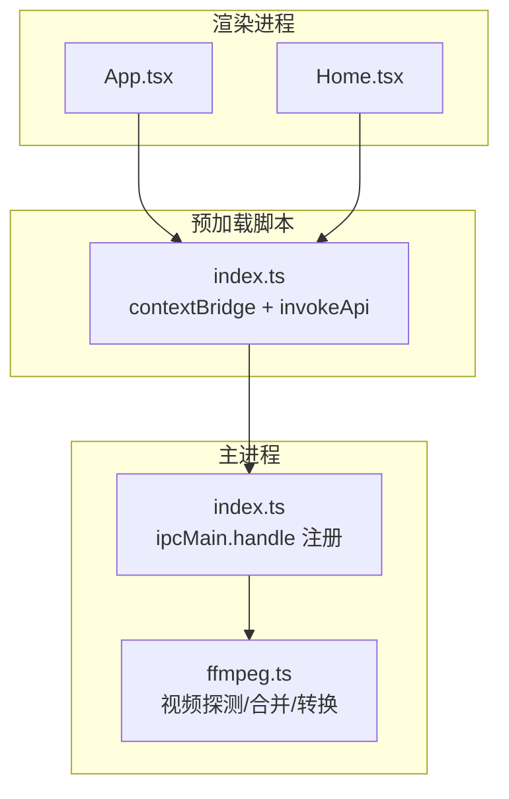
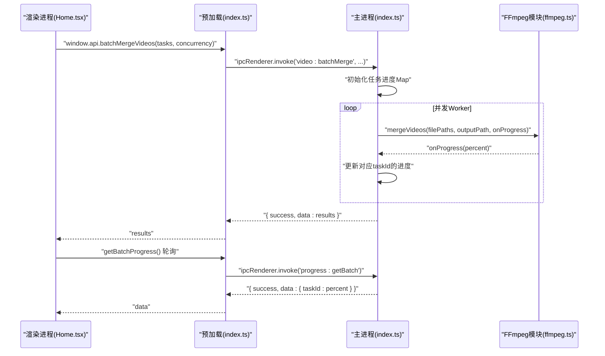
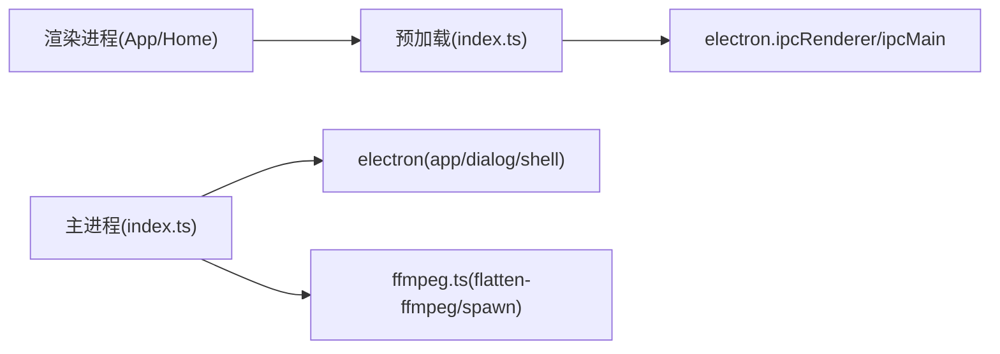

# IPC通信模式

<cite>
**本文引用的文件**   
- [src/main/index.ts](file://src/main/index.ts)
- [src/preload/index.ts](file://src/preload/index.ts)
- [src/renderer/src/App.tsx](file://src/renderer/src/App.tsx)
- [src/renderer/src/pages/Home.tsx](file://src/renderer/src/pages/Home.tsx)
- [src/main/ffmpeg.ts](file://src/main/ffmpeg.ts)
- [tests/invokeApi.test.ts](file://tests/invokeApi.test.ts)
</cite>

## 目录
1. [简介](#简介)
2. [项目结构](#项目结构)
3. [核心组件](#核心组件)
4. [架构总览](#架构总览)
5. [详细组件分析](#详细组件分析)
6. [依赖关系分析](#依赖关系分析)
7. [性能与并发优化](#性能与并发优化)
8. [故障恢复与错误传播](#故障恢复与错误传播)
9. [IPC接口设计规范与版本兼容](#ipc接口设计规范与版本兼容)
10. [结论](#结论)
11. [附录：常用IPC通道清单](#附录常用ipc通道清单)

## 简介
本文件面向系统集成开发者，系统化阐述该Electron应用的跨进程通信（IPC）模式。重点覆盖主进程与渲染进程之间的请求-响应机制、消息协议与数据序列化格式、handle命令注册模式、异步调用与错误传播、进度轮询策略、批量并行处理、以及可扩展的事件驱动与实时同步方案。文档同时给出性能优化建议、连接池管理思路与故障恢复机制，并提供接口设计规范和版本兼容性指南。

## 项目结构
本项目采用标准的Electron三层结构：
- 主进程（main）：负责系统能力访问、文件系统操作、FFmpeg子进程调度、全局状态与配置持久化。
- 预加载脚本（preload）：通过contextBridge暴露安全API给渲染进程，统一封装invoke调用与结果解包。
- 渲染进程（renderer）：React UI层，通过window.api调用IPC服务，实现用户交互与状态展示。

图表来源
- [src/renderer/src/App.tsx:1-49](file://src/renderer/src/App.tsx#L1-L49)
- [src/renderer/src/pages/Home.tsx:1-760](file://src/renderer/src/pages/Home.tsx#L1-L760)
- [src/preload/index.ts:1-64](file://src/preload/index.ts#L1-L64)
- [src/main/index.ts:1-530](file://src/main/index.ts#L1-L530)
- [src/main/ffmpeg.ts:1-305](file://src/main/ffmpeg.ts#L1-L305)

章节来源
- [src/main/index.ts:1-530](file://src/main/index.ts#L1-L530)
- [src/preload/index.ts:1-64](file://src/preload/index.ts#L1-L64)
- [src/renderer/src/App.tsx:1-49](file://src/renderer/src/App.tsx#L1-L49)
- [src/renderer/src/pages/Home.tsx:1-760](file://src/renderer/src/pages/Home.tsx#L1-L760)
- [src/main/ffmpeg.ts:1-305](file://src/main/ffmpeg.ts#L1-L305)

## 核心组件
- 主进程IPC处理器：集中注册所有handle命令，统一返回结构化结果对象，包含成功标志、数据与错误信息。
- 预加载桥接器：提供统一的invokeApi函数，自动解包标准返回体，失败时抛出异常，简化渲染端调用。
- 渲染端API封装：在window.api上暴露业务方法，如配置读写、文件夹选择、扫描、视频处理、批量合并与进度查询。
- FFmpeg集成模块：封装视频探测、合并与转换逻辑，支持流式进度回调与超时保护。

章节来源
- [src/main/index.ts:99-530](file://src/main/index.ts#L99-L530)
- [src/preload/index.ts:1-64](file://src/preload/index.ts#L1-L64)
- [src/renderer/src/pages/Home.tsx:1-760](file://src/renderer/src/pages/Home.tsx#L1-L760)
- [src/main/ffmpeg.ts:1-305](file://src/main/ffmpeg.ts#L1-L305)

## 架构总览
下图展示了从渲染进程发起请求到主进程执行并返回结果的完整流程，包括错误传播与进度轮询路径。

图表来源
- [src/renderer/src/pages/Home.tsx:183-298](file://src/renderer/src/pages/Home.tsx#L183-L298)
- [src/preload/index.ts:21-49](file://src/preload/index.ts#L21-L49)
- [src/main/index.ts:421-478](file://src/main/index.ts#L421-L478)
- [src/main/ffmpeg.ts:87-245](file://src/main/ffmpeg.ts#L87-L245)

## 详细组件分析

### 主进程IPC处理器（index.ts）
- 命令注册模式：使用ipcMain.handle(channel, handler)注册异步处理器，统一返回{ success, data?, message? }结构。
- 典型命令：
  - 配置管理：config:load、config:save
  - 对话框：dialog:selectFolder、dialog:selectOutputFolder、dialog:openDirectory、dialog:openExternal
  - 文件扫描：scan:flvFiles（按日期+标题分组，过滤已合并结果）
  - 视频处理：video:getInfo、video:merge、video:convert
  - 批量合并：video:batchMerge（并发控制、任务进度Map）
  - 进度查询：progress:get、progress:getBatch
- 错误处理：每个handle内部try/catch捕获异常，返回success:false与message；对长时间任务设置超时保护（例如合并超时）。
- 状态管理：使用全局变量与Map维护单任务与批量任务的进度，供渲染端轮询获取。

章节来源
- [src/main/index.ts:102-110](file://src/main/index.ts#L102-L110)
- [src/main/index.ts:113-124](file://src/main/index.ts#L113-L124)
- [src/main/index.ts:146-345](file://src/main/index.ts#L146-L345)
- [src/main/index.ts:348-365](file://src/main/index.ts#L348-L365)
- [src/main/index.ts:368-378](file://src/main/index.ts#L368-L378)
- [src/main/index.ts:381-388](file://src/main/index.ts#L381-L388)
- [src/main/index.ts:391-403](file://src/main/index.ts#L391-L403)
- [src/main/index.ts:421-478](file://src/main/index.ts#L421-L478)
- [src/main/index.ts:496-498](file://src/main/index.ts#L496-L498)

### 预加载桥接器（preload/index.ts）
- 统一invokeApi：基于ipcRenderer.invoke发送请求，自动解包标准返回体；当success为false时抛出Error，携带message。
- API暴露：将业务方法挂载到window.api，供渲染进程直接调用，屏蔽底层IPC细节。
- 类型安全：参数与返回值保持TS类型提示，便于IDE与静态检查。

章节来源
- [src/preload/index.ts:9-18](file://src/preload/index.ts#L9-L18)
- [src/preload/index.ts:21-49](file://src/preload/index.ts#L21-L49)
- [src/preload/index.ts:51-63](file://src/preload/index.ts#L51-L63)

### 渲染端调用（App.tsx与Home.tsx）
- App.tsx：应用启动时读取主题配置，切换时保存设置，体现配置类IPC的简单请求-响应模式。
- Home.tsx：
  - 启动阶段：加载配置后自动扫描输入目录，显示待合并分组。
  - 批量合并：构造任务数组，调用video:batchMerge，并通过progress:getBatch每500ms轮询进度，计算总体进度。
  - 错误处理：catch捕获异常并提示用户；对部分失败的任务进行统计与反馈。
  - 用户体验：完成后自动打开输出目录或外部网站（可配置），提升工作流效率。

章节来源
- [src/renderer/src/App.tsx:10-30](file://src/renderer/src/App.tsx#L10-L30)
- [src/renderer/src/pages/Home.tsx:44-102](file://src/renderer/src/pages/Home.tsx#L44-L102)
- [src/renderer/src/pages/Home.tsx:183-298](file://src/renderer/src/pages/Home.tsx#L183-L298)

### FFmpeg集成模块（ffmpeg.ts）
- 快速探测：spawn ffmpeg -i仅读取头部信息，解析Duration、分辨率、编码等元数据，毫秒级完成。
- 合并流程：
  - 前置校验：检测文件可访问性，跳过被占用的片段，记录警告。
  - 估算时长：基于首个文件的比特率推算总时长，用于进度计算。
  - 临时文件：生成列表文件与临时输出，避免覆盖风险；成功后移动至目标路径。
  - 进度解析：实时解析stderr中的time字段，计算百分比并回调。
  - 超时保护：30分钟超时清理临时文件并拒绝Promise。
- 转换流程：使用fluent-ffmpeg进行H.264+AAC转码，支持进度回调与错误处理。

章节来源
- [src/main/ffmpeg.ts:13-77](file://src/main/ffmpeg.ts#L13-L77)
- [src/main/ffmpeg.ts:87-245](file://src/main/ffmpeg.ts#L87-L245)
- [src/main/ffmpeg.ts:254-304](file://src/main/ffmpeg.ts#L254-L304)

## 依赖关系分析
- 渲染进程依赖预加载桥接器提供的window.api。
- 预加载桥接器依赖electron的contextBridge与ipcRenderer。
- 主进程依赖electron的ipcMain、dialog、shell等能力，并调用FFmpeg模块进行媒体处理。
- FFmpeg模块依赖fluent-ffmpeg与@ffmpeg-installer/ffmpeg，通过child_process.spawn执行底层命令。

图表来源
- [src/renderer/src/App.tsx:1-49](file://src/renderer/src/App.tsx#L1-L49)
- [src/renderer/src/pages/Home.tsx:1-760](file://src/renderer/src/pages/Home.tsx#L1-L760)
- [src/preload/index.ts:1-64](file://src/preload/index.ts#L1-L64)
- [src/main/index.ts:1-530](file://src/main/index.ts#L1-L530)
- [src/main/ffmpeg.ts:1-305](file://src/main/ffmpeg.ts#L1-L305)

章节来源
- [src/main/index.ts:1-530](file://src/main/index.ts#L1-L530)
- [src/preload/index.ts:1-64](file://src/preload/index.ts#L1-L64)
- [src/main/ffmpeg.ts:1-305](file://src/main/ffmpeg.ts#L1-L305)

## 性能与并发优化
- 批量并行合并：
  - 使用worker队列与Promise.all控制并发度，避免过多FFmpeg实例导致资源争用。
  - 每个任务独立进度键（taskId），通过Map维护，减少锁竞争。
- 进度轮询：
  - 渲染端每500ms轮询一次，平衡刷新频率与IPC开销；可根据任务规模动态调整间隔。
- 文件I/O优化：
  - 合并前快速探测与文件大小统计，估算总时长，提高进度准确性。
  - 使用临时文件与原子替换策略，降低写入冲突与损坏风险。
- 超时与清理：
  - 长任务设置超时，及时释放临时文件与进程资源，防止内存泄漏。

章节来源
- [src/main/index.ts:421-478](file://src/main/index.ts#L421-L478)
- [src/main/ffmpeg.ts:127-144](file://src/main/ffmpeg.ts#L127-L144)
- [src/main/ffmpeg.ts:154-160](file://src/main/ffmpeg.ts#L154-L160)
- [src/renderer/src/pages/Home.tsx:222-236](file://src/renderer/src/pages/Home.tsx#L222-L236)

## 故障恢复与错误传播
- 统一错误模型：
  - 主进程返回{ success: false, message }，预加载自动抛错，渲染端catch处理。
- 具体场景：
  - 文件不可访问：合并前检测并跳过占用文件，返回警告；全部不可访问则拒绝。
  - 输出覆盖：若目标存在，先备份再覆盖；失败则返回明确错误信息。
  - 超时：超过阈值清理临时文件并拒绝Promise，避免挂起。
- 测试保障：
  - 针对invokeApi的解包逻辑编写单元测试，确保成功/失败分支行为一致。

章节来源
- [src/main/index.ts:391-403](file://src/main/index.ts#L391-L403)
- [src/main/ffmpeg.ts:98-117](file://src/main/ffmpeg.ts#L98-L117)
- [src/main/ffmpeg.ts:209-234](file://src/main/ffmpeg.ts#L209-L234)
- [src/main/ffmpeg.ts:154-160](file://src/main/ffmpeg.ts#L154-L160)
- [tests/invokeApi.test.ts:24-69](file://tests/invokeApi.test.ts#L24-L69)

## IPC接口设计规范与版本兼容
- 命名规范：
  - 使用“模块:动作”形式，如config:load、dialog:selectFolder、video:merge、progress:getBatch，保证可读性与扩展性。
- 返回体约定：
  - 统一返回{ success, data?, message? }；成功返回data，失败返回message；非标准返回原样透传。
- 参数校验：
  - 在主进程侧进行必要校验（如空数组、非法路径），尽早返回错误，避免无效处理。
- 版本兼容：
  - 新增可选参数时保持向后兼容（如maxIntervalHours、concurrency默认值）。
  - 对历史数据结构增加字段而非删除，避免破坏旧客户端。
- 事件驱动与实时同步：
  - 当前采用轮询获取进度，适合低频更新；如需高频推送，可在主进程使用ipcMain.emit向指定窗口广播事件，渲染端监听对应channel。
- 连接池管理：
  - 对于频繁短请求，可考虑在预加载层缓存结果或合并请求；对于长任务，使用任务队列与并发限制，避免阻塞主线程。

章节来源
- [src/preload/index.ts:9-18](file://src/preload/index.ts#L9-L18)
- [src/main/index.ts:102-110](file://src/main/index.ts#L102-L110)
- [src/main/index.ts:146-150](file://src/main/index.ts#L146-L150)
- [src/main/index.ts:421-425](file://src/main/index.ts#L421-L425)

## 结论
本项目通过清晰的IPC分层与统一的返回体约定，实现了稳定可靠的跨进程通信。主进程集中管理系统能力与重任务，预加载层屏蔽底层细节，渲染端专注交互与状态展示。批量并行与进度轮询策略兼顾性能与体验，错误传播与超时保护提升了健壮性。建议在后续演进中引入事件驱动的实时推送、更细粒度的权限控制与接口版本化管理，以支撑更大规模的系统集成需求。

## 附录：常用IPC通道清单
- 配置管理
  - config:load → 返回配置对象
  - config:save → 保存配置
- 对话框
  - dialog:selectFolder → 选择输入目录
  - dialog:selectOutputFolder → 选择输出目录
  - dialog:openDirectory(path) → 打开系统目录
  - dialog:openExternal(url) → 打开外部链接
- 文件扫描
  - scan:flvFiles(folderPath, maxIntervalHours?) → 返回分组后的视频列表
- 视频处理
  - video:getInfo(filePath) → 返回视频元信息
  - video:merge(filePaths[], outputPath) → 合并视频，返回警告或错误
  - video:convert(filePath, outputPath) → 转换视频
- 批量合并
  - video:batchMerge(tasks[], concurrency?) → 返回各任务结果
  - progress:getBatch → 返回{ taskId: percent }映射
  - progress:get → 返回单任务进度（合并/转换）

章节来源
- [src/preload/index.ts:21-49](file://src/preload/index.ts#L21-L49)
- [src/main/index.ts:102-110](file://src/main/index.ts#L102-L110)
- [src/main/index.ts:113-124](file://src/main/index.ts#L113-L124)
- [src/main/index.ts:146-345](file://src/main/index.ts#L146-L345)
- [src/main/index.ts:348-365](file://src/main/index.ts#L348-L365)
- [src/main/index.ts:368-378](file://src/main/index.ts#L368-L378)
- [src/main/index.ts:381-388](file://src/main/index.ts#L381-L388)
- [src/main/index.ts:391-403](file://src/main/index.ts#L391-L403)
- [src/main/index.ts:421-478](file://src/main/index.ts#L421-L478)
- [src/main/index.ts:496-498](file://src/main/index.ts#L496-L498)