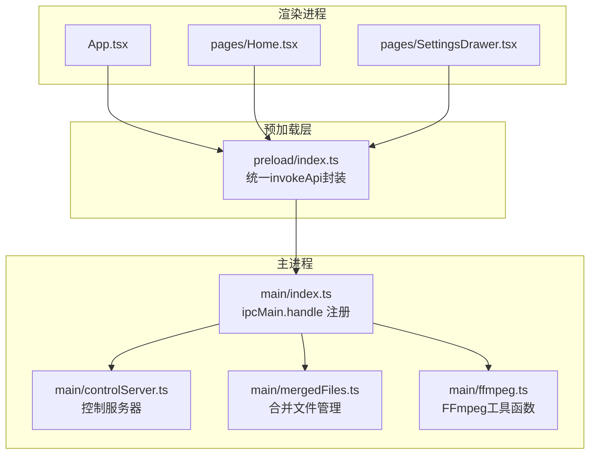
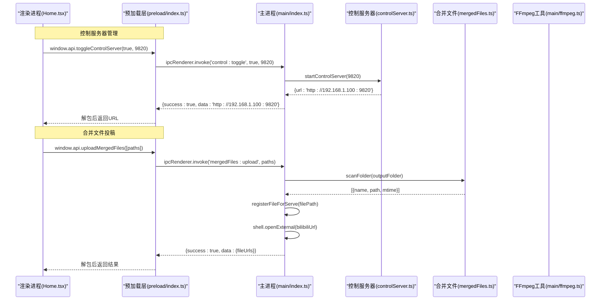
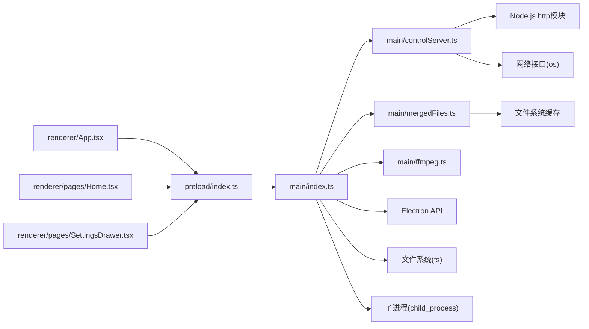

# IPC通信管理

<cite>
**本文引用的文件**   
- [src/main/index.ts](file://src/main/index.ts)
- [src/preload/index.ts](file://src/preload/index.ts)
- [src/renderer/src/App.tsx](file://src/renderer/src/App.tsx)
- [src/renderer/src/pages/Home.tsx](file://src/renderer/src/pages/Home.tsx)
- [src/renderer/src/pages/SettingsDrawer.tsx](file://src/renderer/src/pages/SettingsDrawer.tsx)
- [src/main/controlServer.ts](file://src/main/controlServer.ts)
- [src/main/mergedFiles.ts](file://src/main/mergedFiles.ts)
- [src/main/ffmpeg.ts](file://src/main/ffmpeg.ts)
- [tests/invokeApi.test.ts](file://tests/invokeApi.test.ts)
- [package.json](file://package.json)
</cite>

## 更新摘要
**变更内容**   
- 新增控制服务器管理IPC接口（control:getUrl、control:getIP、control:toggle、network:getInfo）
- 新增合并文件操作IPC接口（mergedFiles:get、mergedFiles:upload）
- 新增后台进程管理IPC接口（window:minimizeToTray、window:restoreFromTray、app:forceQuit）
- 增强预加载层API封装，支持新的IPC接口调用
- 完善渲染进程UI集成，支持手机控制面板管理和投稿功能

## 目录
1. [简介](#简介)
2. [项目结构](#项目结构)
3. [核心组件](#核心组件)
4. [架构总览](#架构总览)
5. [详细组件分析](#详细组件分析)
6. [依赖关系分析](#依赖关系分析)
7. [性能考量](#性能考量)
8. [故障排查指南](#故障排查指南)
9. [结论](#结论)
10. [附录：IPC接口清单与契约](#附录ipc接口清单与契约)

## 简介
本文件系统性梳理该Electron应用的IPC通信管理机制，覆盖主进程与渲染进程之间的消息传递、统一返回格式、参数校验、错误处理与返回值约定。重点说明以下能力：
- 配置管理接口（config:load, config:save）
- 文件操作接口（dialog:selectFolder, dialog:openDirectory）
- 视频处理接口（video:getInfo, video:merge, video:convert）
- 进度查询接口（progress:get, progress:getBatch）的设计模式与轮询机制
- 批量并行合并（video:batchMerge）的实现细节
- **控制服务器管理接口**（control:getUrl, control:getIP, control:toggle, network:getInfo）
- **合并文件操作接口**（mergedFiles:get, mergedFiles:upload）
- **后台进程管理接口**（window:minimizeToTray, window:restoreFromTray, app:forceQuit）
- IPC安全最佳实践与性能优化建议

## 项目结构
应用采用标准Electron分层结构：
- 主进程（main）：注册所有IPC处理器，执行业务逻辑与系统调用
- 预加载脚本（preload）：通过contextBridge暴露安全的API给渲染进程，并统一解包IPC结果
- 渲染进程（renderer）：React UI，通过window.api调用IPC接口

**图表来源**
- [src/main/index.ts:1-120](file://src/main/index.ts#L1-L120)
- [src/preload/index.ts:1-93](file://src/preload/index.ts#L1-L93)
- [src/renderer/src/App.tsx:1-49](file://src/renderer/src/App.tsx#L1-L49)
- [src/renderer/src/pages/Home.tsx:1-200](file://src/renderer/src/pages/Home.tsx#L1-L200)
- [src/renderer/src/pages/SettingsDrawer.tsx:1-100](file://src/renderer/src/pages/SettingsDrawer.tsx#L1-L100)
- [src/main/controlServer.ts:1-100](file://src/main/controlServer.ts#L1-L100)
- [src/main/mergedFiles.ts:1-50](file://src/main/mergedFiles.ts#L1-L50)
- [src/main/ffmpeg.ts:1-120](file://src/main/ffmpeg.ts#L1-L120)

**章节来源**
- [src/main/index.ts:1-120](file://src/main/index.ts#L1-L120)
- [src/preload/index.ts:1-93](file://src/preload/index.ts#L1-L93)
- [src/renderer/src/App.tsx:1-49](file://src/renderer/src/App.tsx#L1-L49)
- [src/renderer/src/pages/Home.tsx:1-200](file://src/renderer/src/pages/Home.tsx#L1-L200)
- [src/renderer/src/pages/SettingsDrawer.tsx:1-100](file://src/renderer/src/pages/SettingsDrawer.tsx#L1-L100)
- [src/main/controlServer.ts:1-100](file://src/main/controlServer.ts#L1-L100)
- [src/main/mergedFiles.ts:1-50](file://src/main/mergedFiles.ts#L1-L50)
- [src/main/ffmpeg.ts:1-120](file://src/main/ffmpeg.ts#L1-L120)

## 核心组件
- 主进程IPC注册中心：集中定义所有channel与处理器，负责参数校验、业务编排、错误包装与统一返回格式
- 预加载API桥接：将底层ipcRenderer.invoke封装为Promise风格，并统一解包{success,data,message}格式
- 渲染进程调用方：通过window.api进行调用，结合UI状态展示进度与结果
- **控制服务器管理器**：提供局域网访问的手机控制面板功能
- **合并文件管理器**：扫描和管理输出文件夹中的MP4文件
- **后台进程管理器**：支持托盘图标和后台运行模式

**章节来源**
- [src/main/index.ts:99-1152](file://src/main/index.ts#L99-L1152)
- [src/preload/index.ts:1-93](file://src/preload/index.ts#L1-L93)
- [src/renderer/src/pages/Home.tsx:120-968](file://src/renderer/src/pages/Home.tsx#L120-L968)
- [src/renderer/src/pages/SettingsDrawer.tsx:1-200](file://src/renderer/src/pages/SettingsDrawer.tsx#L1-L200)

## 架构总览
整体通信流程遵循"渲染进程 -> 预加载层 -> 主进程 -> 系统/外部库"的单向通道，所有IPC返回统一为{success,data?,message?}，失败时抛出JavaScript错误，便于上层try/catch捕获。

**图表来源**
- [src/main/index.ts:971-983](file://src/main/index.ts#L971-L983)
- [src/main/index.ts:1032-1049](file://src/main/index.ts#L1032-L1049)
- [src/main/controlServer.ts:163-172](file://src/main/controlServer.ts#L163-L172)
- [src/main/mergedFiles.ts:50-95](file://src/main/mergedFiles.ts#L50-L95)
- [src/preload/index.ts:59-66](file://src/preload/index.ts#L59-L66)
- [src/renderer/src/pages/Home.tsx:889-908](file://src/renderer/src/pages/Home.tsx#L889-L908)

## 详细组件分析

### 统一返回格式与错误处理
- 主进程所有handle均返回统一结构：成功时为{success:true, data?:any}；失败时为{success:false, message:string}
- 预加载层invokeApi对返回体进行解包：
  - 若存在success字段且为true，则直接返回data
  - 若success为false，则抛出Error(message或默认信息)
  - 若无success字段，原样返回（兼容非标准返回）
- 测试用例验证了解包逻辑的正确性与边界情况

**章节来源**
- [src/preload/index.ts:9-18](file://src/preload/index.ts#L9-L18)
- [tests/invokeApi.test.ts:1-70](file://tests/invokeApi.test.ts#L1-L70)

### 配置管理接口
- config:load
  - 作用：读取用户数据目录下的config.json，不存在则返回空对象
  - 返回：{success:true, data: AppConfig}
- config:save
  - 作用：合并当前配置与新配置并持久化到config.json
  - 参数：config: AppConfig
  - 返回：{success:true}

实现要点
- 路径解析基于app.getPath('userData')，开发模式下可重定向到项目内目录
- 写入前执行浅合并，保留未变更字段
- 读写异常被捕获并记录日志，不向上抛错

**章节来源**
- [src/main/index.ts:434-442](file://src/main/index.ts#L434-L442)
- [src/main/index.ts:221-256](file://src/main/index.ts#L221-L256)

### 文件操作接口
- dialog:selectFolder
  - 作用：选择输入文件夹，成功后自动保存inputFolder到配置
  - 返回：{success:true, data: folderPath} 或 {success:false, message:'未选择文件夹'}
- dialog:openDirectory
  - 作用：打开指定目录
  - 参数：path: string
  - 返回：{success:true} 或 {success:false, message:'打开目录失败'}

**章节来源**
- [src/main/index.ts:445-456](file://src/main/index.ts#L445-L456)
- [src/main/index.ts:736-743](file://src/main/index.ts#L736-L743)

### 视频处理接口
- video:getInfo
  - 作用：快速探测视频时长、编码、分辨率等元信息
  - 参数：filePath: string
  - 返回：{success:true, data: {duration, codec, width, height}} 或 {success:false, message}
- video:merge
  - 作用：使用concat demuxer将多个FLV片段拼接为MP4（stream copy，不重新编码）
  - 参数：filePaths: string[], outputPath: string
  - 返回：{success:true, data: warning|undefined} 或 {success:false, message}
  - 进度：通过全局变量mergeProgress记录，供progress:get轮询
- video:convert
  - 作用：将任意视频转换为H.264+AAC的MP4（重新编码）
  - 参数：filePath: string, outputPath: string
  - 返回：{success:true} 或 {success:false, message}
  - 进度：通过全局变量convertProgress记录，供progress:get轮询

实现要点
- 合并前检查源文件是否可访问，跳过被占用的文件并给出警告
- 估算总时长用于计算进度百分比，限制最大进度不超过99.9%
- 输出文件先写临时文件再拷贝，避免中断导致损坏
- 转换过程使用fluent-ffmpeg事件驱动，实时上报进度

**章节来源**
- [src/main/index.ts:769-776](file://src/main/index.ts#L769-L776)
- [src/main/index.ts:779-799](file://src/main/index.ts#L779-L799)
- [src/main/index.ts:914-926](file://src/main/index.ts#L914-L926)
- [src/main/ffmpeg.ts:65-77](file://src/main/ffmpeg.ts#L65-L77)
- [src/main/ffmpeg.ts:87-245](file://src/main/ffmpeg.ts#L87-L245)
- [src/main/ffmpeg.ts:254-304](file://src/main/ffmpeg.ts#L254-L304)

### 批量并行合并接口
- video:batchMerge
  - 作用：并行合并多个分组，支持并发度控制
  - 参数：tasks: Array<{taskId, filePaths, outputPath, folderName}>, concurrency?: number
  - 返回：{success:true, data: BatchMergeResult[]}
  - 进度：每个taskId维护独立进度值，-1表示失败，100表示完成
- progress:getBatch
  - 作用：获取所有任务的进度映射
  - 返回：{success:true, data: Record<string, number>}

设计模式
- 使用Map存储任务进度，worker池按concurrency并发拉取任务
- 每个任务完成后清理其进度记录，避免内存泄漏
- 渲染端通过定时器轮询getBatchProgress，聚合总体进度

**章节来源**
- [src/main/index.ts:817-902](file://src/main/index.ts#L817-L902)
- [src/main/index.ts:905-911](file://src/main/index.ts#L905-L911)

### 进度查询接口
- progress:get
  - 作用：获取当前单任务（合并/转换）进度
  - 返回：{mergeProgress, convertProgress}
- progress:getBatch
  - 作用：获取批量任务进度映射
  - 返回：{success:true, data: Record<string, number>}

轮询机制
- 渲染端在开始批量合并时启动定时器，每500ms调用一次getBatchProgress
- 根据各任务进度计算平均总体进度，并在UI中展示
- 合并结束后清除定时器，避免资源泄露

**章节来源**
- [src/main/index.ts:929-931](file://src/main/index.ts#L929-L931)
- [src/main/index.ts:905-911](file://src/main/index.ts#L905-L911)
- [src/renderer/src/pages/Home.tsx:220-236](file://src/renderer/src/pages/Home.tsx#L220-L236)

### 控制服务器管理接口
- control:getUrl
  - 作用：获取控制服务器的完整URL地址
  - 返回：{success:true, data: string}
- control:getIP
  - 作用：获取本机局域网IPv4地址
  - 返回：{success:true, data: string}
- control:toggle
  - 作用：启动或停止控制服务器
  - 参数：enabled: boolean, port?: number
  - 返回：{success:true, data: url|string} 或 {success:false, message:string}
- network:getInfo
  - 作用：获取网络信息（IP地址和控制端口）
  - 返回：{success:true, data: {ip: string, port: number}}

实现要点
- 控制服务器基于Node.js http模块创建HTTP服务
- 支持CORS跨域请求，允许移动端浏览器访问
- 提供RESTful API接口，包括登录认证、状态查询、文件管理等
- 支持密码保护，防止未授权访问

**章节来源**
- [src/main/index.ts:960-988](file://src/main/index.ts#L960-L988)
- [src/main/controlServer.ts:163-172](file://src/main/controlServer.ts#L163-L172)
- [src/main/controlServer.ts:82-92](file://src/main/controlServer.ts#L82-L92)

### 合并文件操作接口
- mergedFiles:get
  - 作用：扫描输出文件夹，获取所有已合并的MP4文件列表
  - 返回：{success:true, data: MergedFile[]}
- mergedFiles:upload
  - 作用：将选中的合并文件注册到本地服务器并打开B站投稿页面
  - 参数：filePaths: string[]
  - 返回：{success:true, data: {fileUrls: string[]}} 或 {success:false, message:string}

实现要点
- 使用缓存机制避免频繁扫描文件系统
- 支持文件名解析，提取直播时间和标题信息
- 自动生成唯一fileId，提供HTTP访问接口
- 集成B站投稿页面，支持多文件批量上传

**章节来源**
- [src/main/index.ts:1017-1024](file://src/main/index.ts#L1017-L1024)
- [src/main/index.ts:1032-1049](file://src/main/index.ts#L1032-L1049)
- [src/main/mergedFiles.ts:50-95](file://src/main/mergedFiles.ts#L50-L95)

### 后台进程管理接口
- window:minimizeToTray
  - 作用：最小化窗口到系统托盘
  - 返回：{success:true}
- window:restoreFromTray
  - 作用：从系统托盘恢复窗口显示
  - 返回：{success:true}
- app:forceQuit
  - 作用：强制退出应用程序
  - 返回：{success:true}

实现要点
- 支持后台运行模式，关闭窗口时隐藏到托盘而非退出
- 双击托盘图标可恢复窗口显示
- 提供真正的退出机制，忽略后台运行设置

**章节来源**
- [src/main/index.ts:991-1014](file://src/main/index.ts#L991-L1014)

### 扫描与分组逻辑（补充）
- scan:flvFiles
  - 作用：递归扫描输入目录，识别支持的视频扩展名并按日期+标题+时间间隔分组
  - 参数：folderPath: string, maxIntervalHours?: number
  - 返回：{success:true, data: {rootPath, folders: Group[]}} 或 {success:false, message}
  - 过滤：已存在同名合并结果的分组将被排除

**章节来源**
- [src/main/index.ts:721-733](file://src/main/index.ts#L721-L733)

## 依赖关系分析
- 主进程依赖Electron API（BrowserWindow、ipcMain、dialog、shell）、文件系统与FFmpeg工具
- 预加载层依赖electron的contextBridge与ipcRenderer
- 渲染进程依赖React与Ant Design，并通过window.api与主进程交互
- **控制服务器依赖Node.js http模块和网络接口**
- **合并文件管理依赖文件系统扫描和缓存机制**

**图表来源**
- [src/main/index.ts:1-10](file://src/main/index.ts#L1-L10)
- [src/main/controlServer.ts:1-10](file://src/main/controlServer.ts#L1-L10)
- [src/main/mergedFiles.ts:1-10](file://src/main/mergedFiles.ts#L1-L10)
- [src/main/ffmpeg.ts:1-10](file://src/main/ffmpeg.ts#L1-L10)
- [src/preload/index.ts:1-3](file://src/preload/index.ts#L1-L3)
- [src/renderer/src/App.tsx:1-10](file://src/renderer/src/App.tsx#L1-L10)
- [src/renderer/src/pages/Home.tsx:1-10](file://src/renderer/src/pages/Home.tsx#L1-L10)
- [src/renderer/src/pages/SettingsDrawer.tsx:1-10](file://src/renderer/src/pages/SettingsDrawer.tsx#L1-L10)

**章节来源**
- [package.json:17-20](file://package.json#L17-L20)
- [src/main/index.ts:1-10](file://src/main/index.ts#L1-L10)
- [src/main/controlServer.ts:1-10](file://src/main/controlServer.ts#L1-L10)
- [src/main/mergedFiles.ts:1-10](file://src/main/mergedFiles.ts#L1-L10)
- [src/main/ffmpeg.ts:1-10](file://src/main/ffmpeg.ts#L1-L10)
- [src/preload/index.ts:1-3](file://src/preload/index.ts#L1-L3)

## 性能考量
- 合并采用concat demuxer + stream copy，避免重新编码，速度极快
- 进度估算基于首个文件的比特率推算总时长，减少IO开销
- 批量合并使用并发工作池，默认并发数可配置，避免过多并发导致磁盘瓶颈
- 进度轮询间隔设置为500ms，平衡刷新频率与IPC开销
- FFprobe仅读取文件头即终止，毫秒级完成元信息探测
- **控制服务器使用内存缓存避免重复扫描文件系统**
- **合并文件列表采用TTL缓存机制，5秒内复用扫描结果**
- **本地文件服务器支持断点续传，提升大文件传输效率**

## 故障排查指南
- 配置读写失败
  - 现象：无法加载或保存配置
  - 排查：确认userData目录是否存在与可写权限；查看控制台日志中的路径与错误信息
- 文件被占用
  - 现象：合并提示部分文件正在录制中被跳过
  - 排查：关闭占用文件的进程或等待录制结束；查看警告信息中的文件数量
- 合并超时
  - 现象：超过30分钟未完成
  - 排查：检查是否有大量文件仍在录制；确认磁盘空间与I/O性能
- 输出文件覆盖冲突
  - 现象：目标文件已存在导致失败
  - 排查：删除或重命名已有文件；程序会尝试备份旧文件，但仍可能失败
- 进度不更新
  - 现象：批量合并期间进度条无变化
  - 排查：确认轮询定时器是否启动；检查getBatchProgress返回的进度映射是否为空
- **控制服务器启动失败**
  - 现象：无法获取控制服务器URL或手机端无法访问
  - 排查：检查端口是否被占用；确认防火墙设置；查看控制台错误日志
- **合并文件列表为空**
  - 现象：投稿弹窗显示暂无文件
  - 排查：确认输出文件夹路径是否正确；检查文件权限；查看scanFolder日志输出
- **投稿功能异常**
  - 现象：点击投稿按钮无响应或打开页面失败
  - 排查：检查文件路径有效性；确认B站网站可达性；查看shell.openExternal错误信息

**章节来源**
- [src/main/index.ts:434-442](file://src/main/index.ts#L434-L442)
- [src/main/index.ts:779-799](file://src/main/index.ts#L779-L799)
- [src/main/index.ts:905-911](file://src/main/index.ts#L905-L911)
- [src/main/index.ts:960-988](file://src/main/index.ts#L960-L988)
- [src/main/index.ts:1017-1024](file://src/main/index.ts#L1017-L1024)
- [src/main/index.ts:1032-1049](file://src/main/index.ts#L1032-L1049)
- [src/main/mergedFiles.ts:50-95](file://src/main/mergedFiles.ts#L50-L95)

## 结论
本项目通过统一的IPC返回格式与预加载层的解包封装，实现了清晰、健壮的主渲染通信模型。配置管理、文件操作、视频处理与进度查询接口职责明确，错误处理完善。批量并行合并与轮询进度机制兼顾了用户体验与系统稳定性。**新增的控制服务器管理、合并文件操作和后台进程管理接口进一步增强了应用的远程控制和自动化能力**。建议在后续迭代中继续强化参数校验、日志分级与异常上报，以进一步提升可靠性与可观测性。

## 附录：IPC接口清单与契约

### 配置管理
- channel: config:load
  - 入参：无
  - 返回：{success:true, data: AppConfig}
- channel: config:save
  - 入参：config: AppConfig
  - 返回：{success:true}

### 文件操作
- channel: dialog:selectFolder
  - 入参：无
  - 返回：{success:true, data: string} 或 {success:false, message: string}
- channel: dialog:openDirectory
  - 入参：path: string
  - 返回：{success:true} 或 {success:false, message: string}

### 视频处理
- channel: video:getInfo
  - 入参：filePath: string
  - 返回：{success:true, data: {duration, codec, width, height}} 或 {success:false, message: string}
- channel: video:merge
  - 入参：filePaths: string[], outputPath: string
  - 返回：{success:true, data: string|undefined} 或 {success:false, message: string}
- channel: video:convert
  - 入参：filePath: string, outputPath: string
  - 返回：{success:true} 或 {success:false, message: string}

### 批量合并与进度
- channel: video:batchMerge
  - 入参：tasks: Array<{taskId, filePaths, outputPath, folderName}>, concurrency?: number
  - 返回：{success:true, data: BatchMergeResult[]}
- channel: progress:get
  - 入参：无
  - 返回：{mergeProgress: number, convertProgress: number}
- channel: progress:getBatch
  - 入参：无
  - 返回：{success:true, data: Record<string, number>}

### 控制服务器管理
- channel: control:getUrl
  - 入参：无
  - 返回：{success:true, data: string}
- channel: control:getIP
  - 入参：无
  - 返回：{success:true, data: string}
- channel: control:toggle
  - 入参：enabled: boolean, port?: number
  - 返回：{success:true, data: string} 或 {success:false, message: string}
- channel: network:getInfo
  - 入参：无
  - 返回：{success:true, data: {ip: string, port: number}}

### 合并文件操作
- channel: mergedFiles:get
  - 入参：无
  - 返回：{success:true, data: MergedFile[]}
- channel: mergedFiles:upload
  - 入参：filePaths: string[]
  - 返回：{success:true, data: {fileUrls: string[]}} 或 {success:false, message: string}

### 后台进程管理
- channel: window:minimizeToTray
  - 入参：无
  - 返回：{success:true}
- channel: window:restoreFromTray
  - 入参：无
  - 返回：{success:true}
- channel: app:forceQuit
  - 入参：无
  - 返回：{success:true}

**章节来源**
- [src/main/index.ts:434-442](file://src/main/index.ts#L434-L442)
- [src/main/index.ts:445-456](file://src/main/index.ts#L445-L456)
- [src/main/index.ts:736-743](file://src/main/index.ts#L736-L743)
- [src/main/index.ts:769-776](file://src/main/index.ts#L769-L776)
- [src/main/index.ts:779-799](file://src/main/index.ts#L779-L799)
- [src/main/index.ts:914-926](file://src/main/index.ts#L914-L926)
- [src/main/index.ts:817-902](file://src/main/index.ts#L817-L902)
- [src/main/index.ts:929-931](file://src/main/index.ts#L929-L931)
- [src/main/index.ts:905-911](file://src/main/index.ts#L905-L911)
- [src/main/index.ts:960-988](file://src/main/index.ts#L960-L988)
- [src/main/index.ts:1017-1024](file://src/main/index.ts#L1017-L1024)
- [src/main/index.ts:1032-1049](file://src/main/index.ts#L1032-L1049)
- [src/main/index.ts:991-1014](file://src/main/index.ts#L991-L1014)

## IPC安全最佳实践与性能优化建议

### 安全最佳实践
- 最小权限原则
  - 仅通过contextBridge暴露必要API，避免直接暴露ipcRenderer或Node.js模块
- 白名单通道
  - 主进程只注册必要的channel，拒绝未知请求
- 参数校验
  - 对所有字符串路径进行存在性与类型校验；对数组长度与元素类型进行检查
- 错误包装
  - 统一返回{success,message}格式，避免泄露内部堆栈
- 资源清理
  - 批量任务完成后及时清理进度Map；确保临时文件与列表文件被删除
- 并发控制
  - 合理设置concurrency，避免磁盘与CPU过载
- 进度轮询
  - 轮询间隔不宜过短，避免频繁IPC造成阻塞；在任务结束时立即停止轮询
- 超时保护
  - 长时间任务设置超时与取消机制，防止僵尸进程
- 日志与监控
  - 关键路径增加结构化日志，便于定位问题
- **控制服务器安全**
  - 实施密码认证机制，防止未授权访问
  - 限制请求大小，防止内存溢出攻击
  - 实现登录限频，防止暴力破解
- **文件访问安全**
  - 验证文件路径合法性，防止路径遍历攻击
  - 限制可访问的文件类型，避免执行恶意文件
  - 实现文件访问审计，记录敏感操作

### 性能优化建议
- 合并采用concat demuxer + stream copy，避免重新编码，速度极快
- 进度估算基于首个文件的比特率推算总时长，减少IO开销
- 批量合并使用并发工作池，默认并发数可配置，避免过多并发导致磁盘瓶颈
- 进度轮询间隔设置为500ms，平衡刷新频率与IPC开销
- FFprobe仅读取文件头即终止，毫秒级完成元信息探测
- **控制服务器使用内存缓存避免重复扫描文件系统**
- **合并文件列表采用TTL缓存机制，5秒内复用扫描结果**
- **本地文件服务器支持断点续传，提升大文件传输效率**
- **配置文件监听使用防抖机制，避免频繁触发配置重载**
- **托盘图标和后台运行模式减少应用切换开销**