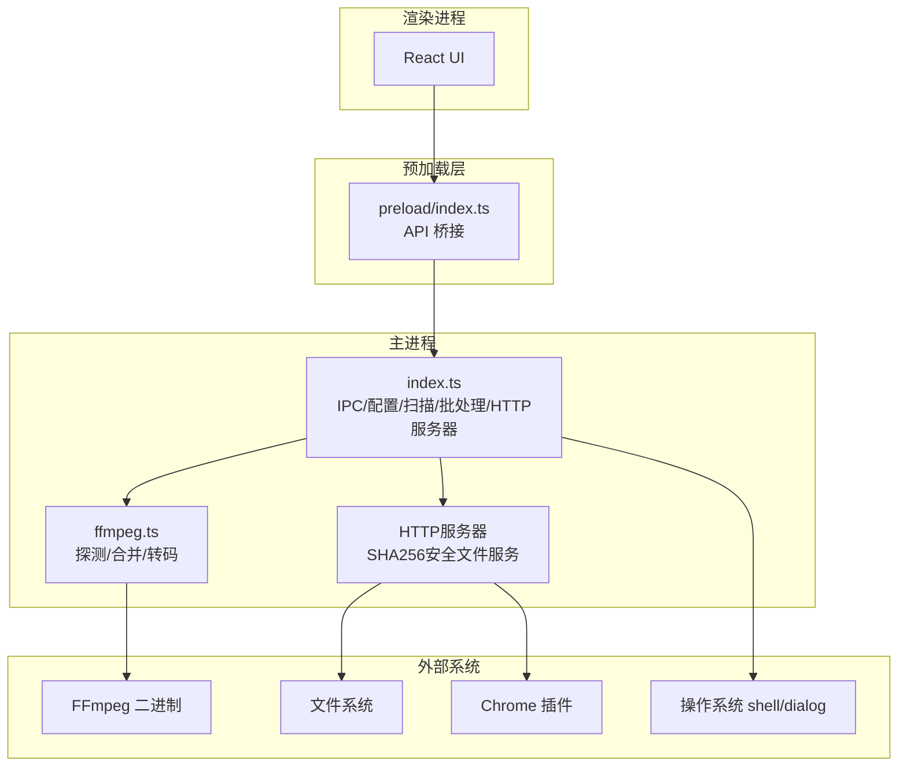
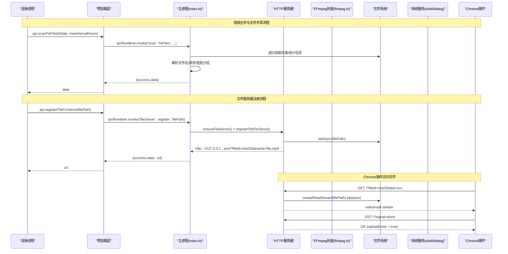
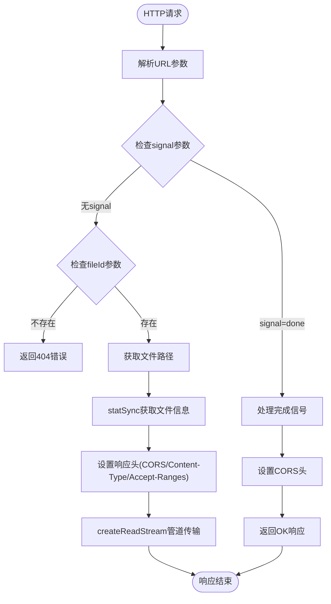
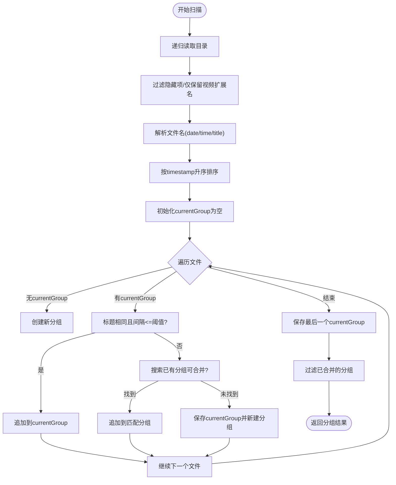
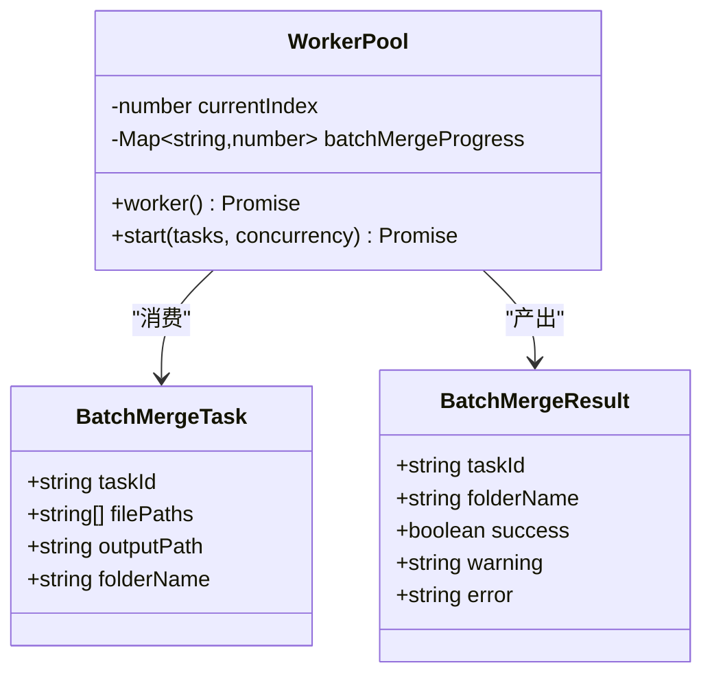
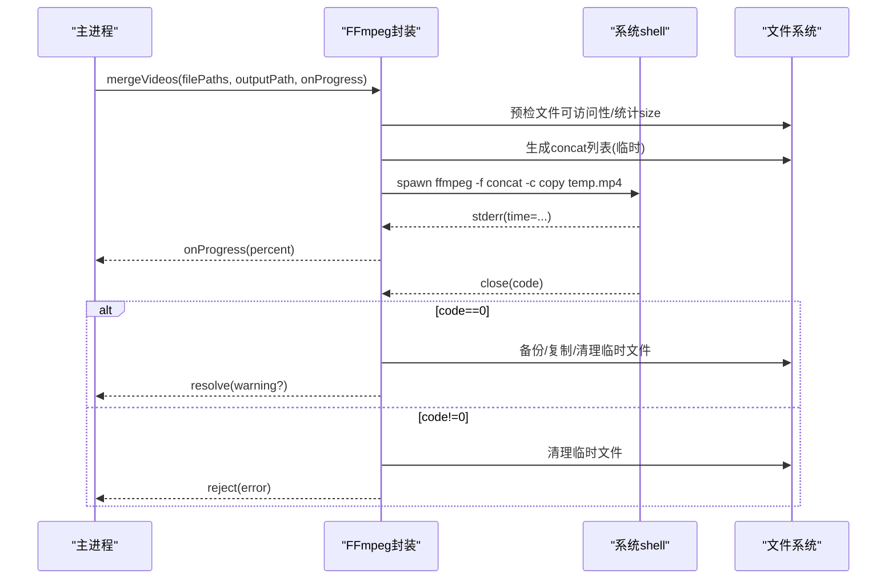
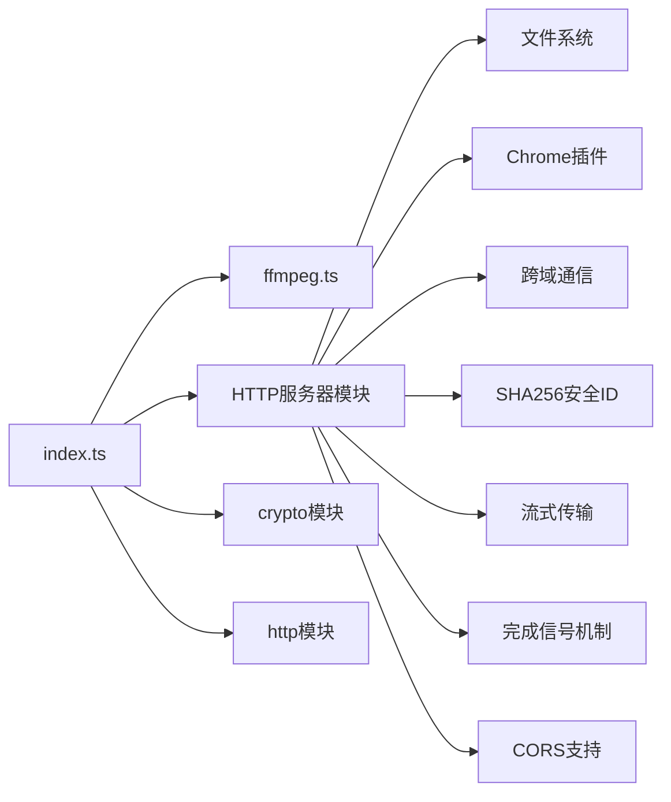

# 主进程架构

<cite>
**本文引用的文件列表**
- [src/main/index.ts](file://src/main/index.ts)
- [src/main/ffmpeg.ts](file://src/main/ffmpeg.ts)
- [src/preload/index.ts](file://src/preload/index.ts)
- [package.json](file://package.json)
- [electron.vite.config.ts](file://electron.vite.config.ts)
- [electron-builder.yml](file://electron-builder.yml)
- [tests/fileGrouping.test.ts](file://tests/fileGrouping.test.ts)
- [tests/ffmpegParsing.test.ts](file://tests/ffmpegParsing.test.ts)
- [tests/configAndUtils.test.ts](file://tests/configAndUtils.test.ts)
- [tests/parseFileName.test.ts](file://tests/parseFileName.test.ts)
</cite>

## 更新摘要
**变更内容**
- 新增HTTP文件服务器模块，支持本地视频文件安全共享
- 实现SHA256安全文件ID生成机制
- 添加跨域通信（CORS）支持
- 扩展IPC处理器以支持文件服务器管理
- 增强预加载层API以暴露文件服务器功能

## 目录
1. [简介](#简介)
2. [项目结构](#项目结构)
3. [核心组件](#核心组件)
4. [架构总览](#架构总览)
5. [详细组件分析](#详细组件分析)
6. [依赖关系分析](#依赖关系分析)
7. [性能考量](#性能考量)
8. [故障排查指南](#故障排查指南)
9. [结论](#结论)
10. [附录](#附录)

## 简介
本文件面向高级开发者，系统化梳理 Electron 视频合并应用的主进程架构与实现细节。重点覆盖：
- 主进程职责分离、生命周期管理与资源管理策略
- IPC 处理器注册机制与渲染进程桥接
- 配置管理系统（持久化与合并策略）
- 文件系统操作封装与视频扫描算法
- 智能分组逻辑（按日期+标题+时间间隔）
- 批量处理架构（并发控制、进度追踪、错误隔离）
- FFmpeg 集成（探测、合并、转码）、超时保护与临时文件清理
- **HTTP文件服务器（本地安全文件共享、SHA256安全ID、跨域通信）**
- 窗口管理、事件监听与启动流程

## 项目结构
主进程入口位于 src/main/index.ts，FFmpeg 能力封装在 src/main/ffmpeg.ts；渲染进程通过 preload 暴露统一 API。构建与打包由 electron-vite 和 electron-builder 协同完成。**新增的HTTP文件服务器模块提供了本地视频文件的跨进程安全共享能力。**

**图表来源**
- [src/main/index.ts:18-84](file://src/main/index.ts#L18-L84)
- [src/main/index.ts:570-583](file://src/main/index.ts#L570-L583)
- [src/main/ffmpeg.ts:1-305](file://src/main/ffmpeg.ts#L1-L305)
- [src/preload/index.ts:50-52](file://src/preload/index.ts#L50-L52)

章节来源
- [src/main/index.ts:1-615](file://src/main/index.ts#L1-L615)
- [src/main/ffmpeg.ts:1-305](file://src/main/ffmpeg.ts#L1-L305)
- [src/preload/index.ts:1-68](file://src/preload/index.ts#L1-L68)
- [package.json:1-42](file://package.json#L1-L42)
- [electron.vite.config.ts:1-21](file://electron.vite.config.ts#L1-L21)
- [electron-builder.yml:1-26](file://electron-builder.yml#L1-L26)

## 核心组件
- 主进程入口与 IPC 总线：集中注册所有 IPC 通道，承载配置、对话框、扫描、视频处理、批量合并、进度查询及**文件服务器管理**等能力。
- **HTTP文件服务器**：提供本地安全文件共享服务，支持SHA256安全ID、跨域通信、流式传输和完成信号机制。
- FFmpeg 封装：提供快速探测、流拷贝合并、重新编码转换，包含进度解析、超时保护与临时文件清理。
- 预加载桥接：将主进程能力以安全方式暴露给渲染进程，统一返回格式并自动解包成功数据或抛出错误。
- 配置管理：基于用户数据目录的 JSON 配置文件，支持增量合并与读写异常兜底。
- 文件扫描与智能分组：递归扫描指定目录，解析文件名提取日期/时间/标题，按标题一致且时间间隔阈值内合并为同一组直播片段。
- 批量并行合并：基于工作线程模型（Promise.all + 索引推进）实现可控并发，独立任务进度与结果聚合。

章节来源
- [src/main/index.ts:18-84](file://src/main/index.ts#L18-L84)
- [src/main/index.ts:570-583](file://src/main/index.ts#L570-L583)
- [src/main/index.ts:16-65](file://src/main/index.ts#L16-L65)
- [src/main/index.ts:145-345](file://src/main/index.ts#L145-L345)
- [src/main/index.ts:405-478](file://src/main/index.ts#L405-L478)
- [src/main/ffmpeg.ts:12-77](file://src/main/ffmpeg.ts#L12-L77)
- [src/main/ffmpeg.ts:87-245](file://src/main/ffmpeg.ts#L87-L245)
- [src/main/ffmpeg.ts:254-305](file://src/main/ffmpeg.ts#L254-L305)
- [src/preload/index.ts:9-49](file://src/preload/index.ts#L9-L49)

## 架构总览
主进程作为唯一可信执行环境，负责：
- 应用生命周期与窗口管理
- 与系统交互（对话框、Shell、菜单）
- 本地文件系统访问与视频处理
- **本地HTTP文件服务器（安全文件共享、跨域通信）**
- 对外暴露稳定 IPC 接口，供渲染进程调用

**图表来源**
- [src/main/index.ts:145-345](file://src/main/index.ts#L145-L345)
- [src/main/index.ts:570-583](file://src/main/index.ts#L570-L583)
- [src/main/index.ts:26-84](file://src/main/index.ts#L26-L84)
- [src/main/ffmpeg.ts:162-245](file://src/main/ffmpeg.ts#L162-L245)
- [src/preload/index.ts:33-48](file://src/preload/index.ts#L33-L48)

## 详细组件分析

### HTTP文件服务器模块
**新增** 实现了完整的HTTP文件服务器功能，专为Chrome插件提供安全的本地视频文件共享服务。

#### 核心特性
- **安全文件ID生成**：使用SHA256哈希算法生成16位安全文件ID，防止路径遍历攻击
- **跨域通信支持**：通过CORS头 `Access-Control-Allow-Origin: *` 允许跨域访问
- **流式文件传输**：使用Node.js流式传输，支持大文件高效传输
- **完成信号机制**：支持插件上传完成后发送信号通知主进程
- **动态端口分配**：自动选择可用端口，避免端口冲突

#### 服务器实现

**图表来源**
- [src/main/index.ts:26-84](file://src/main/index.ts#L26-L84)

章节来源
- [src/main/index.ts:18-84](file://src/main/index.ts#L18-L84)
- [src/main/index.ts:570-583](file://src/main/index.ts#L570-L583)

### 主进程入口与生命周期
- 应用初始化：设置 userData 路径（开发模式使用项目内目录），移除默认菜单栏，设置应用标识，监听窗口快捷键。
- 窗口创建：隐藏初始显示，ready-to-show 后展示；拦截新窗口打开，统一交由系统浏览器打开；根据运行环境加载开发 URL 或打包后的 HTML。
- 激活与关闭：macOS 下无窗口时重建窗口；非 macOS 平台关闭所有窗口退出。

章节来源
- [src/main/index.ts:585-615](file://src/main/index.ts#L585-L615)
- [src/main/index.ts:137-167](file://src/main/index.ts#L137-L167)

### IPC 处理器注册机制
- 统一返回格式：{ success, data?, message? }，失败时携带 message，成功时携带 data。
- 主要通道：
  - 配置：config:load、config:save
  - 对话框：dialog:selectFolder、dialog:selectOutputFolder、dialog:openDirectory、dialog:openExternal
  - 扫描：scan:flvFiles
  - 视频：video:getInfo、video:merge、video:convert
  - 批量：video:batchMerge、progress:getBatch
  - 进度：progress:get
  - **文件服务器：fileServer:register、fileServer:checkDone**

章节来源
- [src/main/index.ts:169-180](file://src/main/index.ts#L169-L180)
- [src/main/index.ts:182-194](file://src/main/index.ts#L182-L194)
- [src/main/index.ts:417-435](file://src/main/index.ts#L417-L435)
- [src/main/index.ts:437-448](file://src/main/index.ts#L437-L448)
- [src/main/index.ts:450-458](file://src/main/index.ts#L450-L458)
- [src/main/index.ts:460-473](file://src/main/index.ts#L460-L473)
- [src/main/index.ts:475-539](file://src/main/index.ts#L475-L539)
- [src/main/index.ts:541-548](file://src/main/index.ts#L541-L548)
- [src/main/index.ts:550-563](file://src/main/index.ts#L550-L563)
- [src/main/index.ts:565-568](file://src/main/index.ts#L565-L568)
- [src/main/index.ts:570-583](file://src/main/index.ts#L570-L583)

### 配置管理系统
- 存储位置：app.getPath('userData') 下的 config.json，开发模式下重定向到项目 user-data 目录。
- 读写策略：
  - loadConfig：存在则解析返回，不存在或异常返回空对象。
  - saveConfig：先加载当前配置，再浅合并传入配置，最后写入文件。
- 类型定义：AppConfig 包含输入输出目录、输出文件名、主题、并发数、时间间隔阈值、自动行为开关及隐藏文件夹键等。

章节来源
- [src/main/index.ts:86-135](file://src/main/index.ts#L86-L135)
- [src/main/index.ts:585-588](file://src/main/index.ts#L585-L588)

### 文件系统操作封装
- 目录选择：调用系统对话框选择目录，成功后自动保存 input/output 路径到配置。
- 打开目录/链接：封装 shell.openPath 与 shell.openExternal，统一错误返回。
- 递归扫描：readdirSync + statSync 遍历目录，过滤隐藏项，识别视频扩展名，收集元信息。

章节来源
- [src/main/index.ts:182-194](file://src/main/index.ts#L182-L194)
- [src/main/index.ts:417-435](file://src/main/index.ts#L417-L435)
- [src/main/index.ts:251-282](file://src/main/index.ts#L251-L282)

### 视频文件扫描与智能分组算法
- 支持扩展名：.flv、.m4s、.ts、.blv。
- 文件名解析：正则匹配"YYYY-MM-DD HH-mm-ss-sss 标题"，缺失则回退为未知日期/时间与原始名称。
- 时间戳计算：优先从文件名时间部分构造 Date，否则回退到 mtime。
- 分组策略：
  - 按 timestamp 升序排列。
  - 维护当前分组，若标题相同且与上一份时间间隔不超过阈值（小时×60×60×1000ms），加入当前组；否则尝试回溯已有分组进行合并；若无匹配则结束当前组并新建。
  - 最终按文件数量降序、日期降序排序。
- 去重检测：递归检查目标目录下是否已存在包含日期与标题的 .mp4 文件，避免重复合并。

**图表来源**
- [src/main/index.ts:251-415](file://src/main/index.ts#L251-L415)

章节来源
- [src/main/index.ts:196-213](file://src/main/index.ts#L196-L213)
- [src/main/index.ts:215-415](file://src/main/index.ts#L215-L415)
- [tests/fileGrouping.test.ts:28-68](file://tests/fileGrouping.test.ts#L28-L68)
- [tests/parseFileName.test.ts:8-23](file://tests/parseFileName.test.ts#L8-L23)

### 批量处理架构与并发控制
- 任务模型：每个任务包含 taskId、filePaths、outputPath、folderName。
- 并发控制：
  - 使用 currentIndex 原子推进分配任务，避免竞争条件。
  - 启动 min(concurrency, tasks.length) 个 worker，Promise.all 等待全部完成。
- 进度追踪：
  - 内存 Map<taskId, number> 记录每个任务的实时进度。
  - 渲染进程通过 progress:getBatch 轮询获取。
- 结果聚合：
  - 成功：记录 warning（如跳过正在录制的片段）。
  - 失败：记录 error 消息，并将该任务进度置为 -1。
- 清理：完成后删除对应任务的进度记录。

**图表来源**
- [src/main/index.ts:475-539](file://src/main/index.ts#L475-L539)

章节来源
- [src/main/index.ts:475-539](file://src/main/index.ts#L475-L539)
- [src/main/index.ts:541-548](file://src/main/index.ts#L541-L548)

### FFmpeg 集成与资源管理
- 路径适配：打包后需将 app.asar 路径替换为 app.asar.unpacked，确保 spawn 能正确定位二进制。
- 快速探测：spawn ffmpeg -i 读取 stderr，遇到 Duration 即终止，毫秒级获取时长、音视频流、分辨率与编码。
- 合并流程（stream copy）：
  - 预检源文件可访问性，跳过被占用的文件并给出警告。
  - 估算总时长：基于首个文件的 size/duration 推算 bitrate，累加 size 得到 totalDuration。
  - 生成 concat 列表文件（临时目录），使用 -f concat -c copy 直接拼接。
  - 实时解析 time= 输出计算进度百分比，限制上限 99.9%。
  - 超时保护：30 分钟超时，清理临时文件并拒绝。
  - 输出落盘：若目标文件存在，备份为 _backup.mp4 后再复制临时文件，最后删除临时文件。
- 转码流程（重新编码）：
  - 使用 fluent-ffmpeg，H.264 + AAC，-movflags +faststart。
  - 同样采用临时文件 + 安全覆盖策略，错误时清理临时文件。

**图表来源**
- [src/main/ffmpeg.ts:87-245](file://src/main/ffmpeg.ts#L87-L245)

章节来源
- [src/main/ffmpeg.ts:1-11](file://src/main/ffmpeg.ts#L1-L11)
- [src/main/ffmpeg.ts:12-77](file://src/main/ffmpeg.ts#L12-L77)
- [src/main/ffmpeg.ts:87-245](file://src/main/ffmpeg.ts#L87-L245)
- [src/main/ffmpeg.ts:254-305](file://src/main/ffmpeg.ts#L254-L305)

### 预加载桥接与渲染进程调用约定
- 统一 invokeApi：包装 ipcRenderer.invoke，自动解包 {success,data,message}，失败抛错，成功返回 data。
- 暴露 API：配置、对话框、扫描、视频处理、批量合并、进度查询、**文件服务器管理**等。
- 上下文隔离：contextIsolated 环境下通过 contextBridge.exposeInMainWorld 暴露 window.api。

**新增API**：
- `registerFileForServe(filePath)`：注册文件到本地服务器，返回可访问的HTTP URL
- `checkUploadDone()`：检查Chrome插件是否已完成文件上传

章节来源
- [src/preload/index.ts:9-18](file://src/preload/index.ts#L9-L18)
- [src/preload/index.ts:20-53](file://src/preload/index.ts#L20-L53)
- [src/preload/index.ts:55-67](file://src/preload/index.ts#L55-L67)

## 依赖关系分析
- 运行时依赖：
  - @ffmpeg-installer/ffmpeg：提供 FFmpeg 二进制安装与路径。
  - fluent-ffmpeg：Node.js 对 FFmpeg 的高层封装。
  - **crypto：内置模块，用于SHA256安全文件ID生成**。
  - **http：内置模块，用于HTTP文件服务器**。
- 构建与打包：
  - electron-vite：主/预加载/渲染三端构建，externalizeDepsPlugin 将原生模块外置。
  - electron-builder：asarUnpack 排除 node_modules/@ffmpeg-installer/**，确保二进制可被 spawn 访问。
- 测试：
  - vitest：单元测试覆盖分组、解析、配置合并等核心逻辑。

**图表来源**
- [src/main/index.ts:1-7](file://src/main/index.ts#L1-L7)
- [src/main/index.ts:18-84](file://src/main/index.ts#L18-L84)

章节来源
- [package.json:17-20](file://package.json#L17-L20)
- [electron.vite.config.ts:5-11](file://electron.vite.config.ts#L5-L11)
- [electron-builder.yml:11-13](file://electron-builder.yml#L11-L13)

## 性能考量
- 扫描阶段：
  - 使用同步 I/O（readdirSync/statSync）适合小中规模目录；超大目录建议引入异步迭代与分页。
  - 文件名解析与排序为 O(n log n)，分组为 O(n + g)（g 为已有分组数），整体线性近似。
- 合并阶段：
  - stream copy 不重新编码，速度极快；预估总时长基于首文件 bitrate，误差取决于多文件码率一致性。
  - 超时保护避免长时间阻塞；临时文件最小化占用。
- 并发控制：
  - 通过 worker 池限制同时运行的 FFmpeg 实例数量，平衡 CPU/IO 压力与吞吐。
- 进度更新：
  - 渲染进程轮询进度，避免长连接与复杂事件分发；可通过节流降低频率。
- **HTTP文件服务器**：
  - **流式传输避免大文件内存占用**
  - **SHA256安全ID防止路径遍历攻击**
  - **CORS支持确保跨域访问安全性**
  - **动态端口分配避免端口冲突**

[本节为通用指导，无需源码引用]

## 故障排查指南
- 无法打开目录/链接：
  - 检查返回值中的 message，确认系统 shell 可用。
- 扫描失败：
  - 确认路径有效、权限充足；查看控制台日志与异常堆栈。
- 合并失败：
  - exit code 非零：查看 stderr 最后若干行定位原因（如输入损坏、参数错误）。
  - 超时：可能源文件仍在录制中被占用，稍后重试或调整并发。
  - 覆盖失败：目标文件被占用或权限不足，检查 _backup.mp4 是否存在。
- 进度不更新：
  - 确认渲染进程轮询正常；检查 batchMergeProgress 映射是否被清理。
- 配置未持久化：
  - 检查 userData 目录是否可写；开发模式下确认路径重定向生效。
- **HTTP文件服务器问题**：
  - **端口冲突：检查是否有其他进程占用相同端口**
  - **跨域访问失败：确认CORS头是否正确设置**
  - **文件无法访问：检查文件路径权限和文件是否存在**
  - **Chrome插件无法接收文件：确认网络地址可达且文件格式正确**

章节来源
- [src/main/ffmpeg.ts:200-244](file://src/main/ffmpeg.ts#L200-L244)
- [src/main/index.ts:417-435](file://src/main/index.ts#L417-L435)
- [src/main/index.ts:541-548](file://src/main/index.ts#L541-L548)
- [src/main/index.ts:26-84](file://src/main/index.ts#L26-L84)

## 结论
本主进程架构以清晰的职责边界与稳定的 IPC 契约为核心，结合高效的 FFmpeg 集成与健壮的并发控制，实现了可靠的视频扫描、智能分组与批量合并能力。**新增的HTTP文件服务器模块进一步增强了应用的跨进程文件共享能力，通过SHA256安全ID和CORS支持确保了安全性和兼容性。**配置管理与资源清理策略保障了应用的稳定性与可维护性。对于大规模场景，可进一步引入异步 I/O、分片处理与更细粒度的进度事件以提升可扩展性与用户体验。

[本节为总结，无需源码引用]

## 附录

### 关键流程图与类图汇总
- 扫描与分组流程：见"视频文件扫描与智能分组算法"小节
- 批量合并序列图：见"架构总览"小节
- 合并时序图：见"FFmpeg 集成与资源管理"小节
- 批量任务类图：见"批量处理架构与并发控制"小节
- **HTTP文件服务器流程：见"HTTP文件服务器模块"小节**

### 测试覆盖要点
- 文件分组逻辑：验证阈值、标题差异、大小写与中文标题等场景。
- FFmpeg 输出解析：时长、进度、视频流信息的正则匹配与边界情况。
- 配置合并与已合并检测：浅合并语义与文件名匹配规则。
- 文件名解析：标准与非标准格式、空格与特殊字符处理。
- **HTTP文件服务器：安全ID生成、跨域访问、流式传输、完成信号机制**

章节来源
- [tests/fileGrouping.test.ts:83-169](file://tests/fileGrouping.test.ts#L83-L169)
- [tests/ffmpegParsing.test.ts:8-97](file://tests/ffmpegParsing.test.ts#L8-97)
- [tests/configAndUtils.test.ts:8-46](file://tests/configAndUtils.test.ts#L8-46)
- [tests/parseFileName.test.ts:25-76](file://tests/parseFileName.test.ts#L25-76)
- [src/main/index.ts:18-84](file://src/main/index.ts#L18-L84)
- [src/main/index.ts:570-583](file://src/main/index.ts#L570-L583)
- [src/preload/index.ts:50-52](file://src/preload/index.ts#L50-L52)