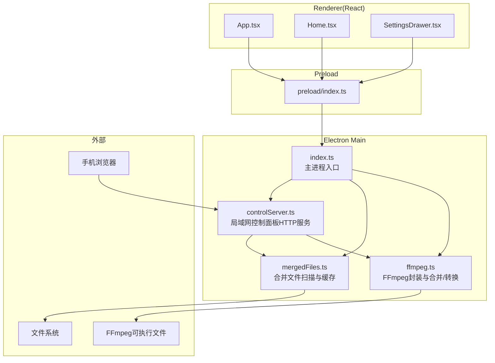
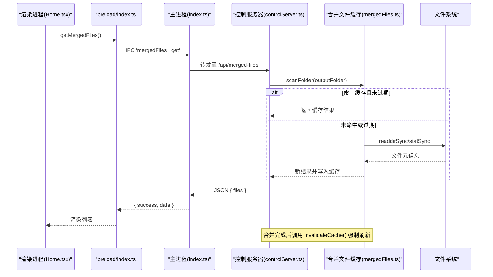
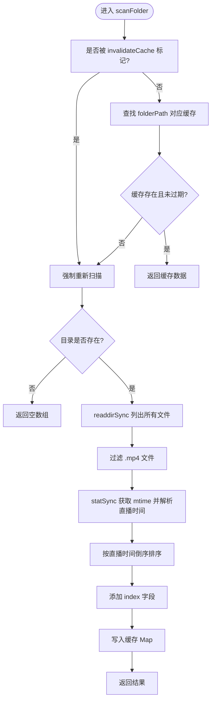
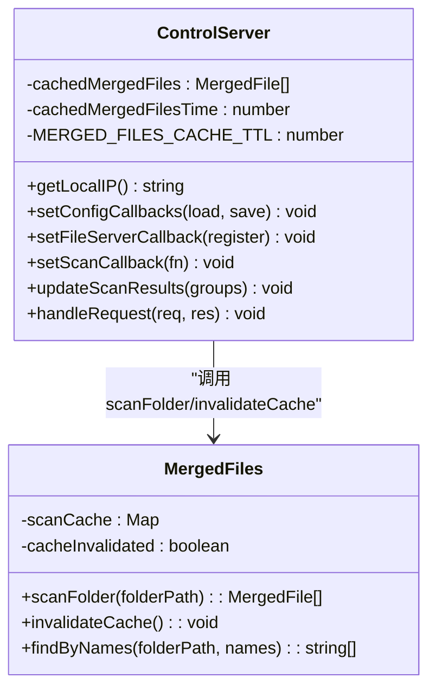
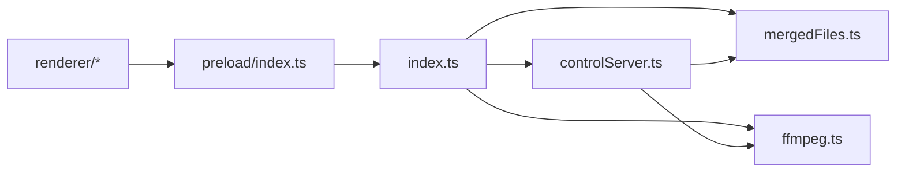

# 合并文件缓存系统

<cite>
**本文引用的文件**
- [package.json](file://package.json)
- [src/main/index.ts](file://src/main/index.ts)
- [src/main/mergedFiles.ts](file://src/main/mergedFiles.ts)
- [src/main/controlServer.ts](file://src/main/controlServer.ts)
- [src/main/ffmpeg.ts](file://src/main/ffmpeg.ts)
- [src/preload/index.ts](file://src/preload/index.ts)
- [src/renderer/src/App.tsx](file://src/renderer/src/App.tsx)
- [src/renderer/src/pages/Home.tsx](file://src/renderer/src/pages/Home.tsx)
- [src/renderer/src/pages/SettingsDrawer.tsx](file://src/renderer/src/pages/SettingsDrawer.tsx)
- [tests/mergedFilesCache.test.ts](file://tests/mergedFilesCache.test.ts)
- [tests/fileGrouping.test.ts](file://tests/fileGrouping.test.ts)
- [产品需求文档.md](file://产品需求文档.md)
</cite>

## 目录
1. [简介](#简介)
2. [项目结构](#项目结构)
3. [核心组件](#核心组件)
4. [架构总览](#架构总览)
5. [详细组件分析](#详细组件分析)
6. [依赖关系分析](#依赖关系分析)
7. [性能考量](#性能考量)
8. [故障排查指南](#故障排查指南)
9. [结论](#结论)
10. [附录](#附录)

## 简介
本仓库是一个基于 Electron + React 的桌面应用，用于将直播录制的分段视频（主要为 FLV）自动扫描、分组并合并为 MP4。其“合并文件缓存系统”围绕输出目录中的已合并 MP4 文件进行高效扫描与缓存，服务于：
- 桌面端 UI 的“待投稿文件”列表展示
- 手机端控制面板的“合并文件列表”接口
- 避免频繁磁盘 I/O 带来的性能损耗

该系统的核心是 mergedFiles 模块提供的 scanFolder 与 invalidateCache，配合控制服务器与主进程 IPC 共同完成状态同步与缓存失效。

## 项目结构
本项目采用 Electron 多进程架构：
- main 进程负责文件系统操作、FFmpeg 调用、HTTP 控制服务、配置管理、IPC 桥接
- preload 暴露安全 API 给渲染进程
- renderer 使用 React + Ant Design 构建界面
- tests 提供单元测试覆盖关键逻辑（如分组算法、缓存 TTL）

图表来源
- [src/main/index.ts:1-120](file://src/main/index.ts#L1-L120)
- [src/main/controlServer.ts:1-120](file://src/main/controlServer.ts#L1-L120)
- [src/main/mergedFiles.ts:1-104](file://src/main/mergedFiles.ts#L1-L104)
- [src/main/ffmpeg.ts:1-120](file://src/main/ffmpeg.ts#L1-L120)
- [src/preload/index.ts:1-93](file://src/preload/index.ts#L1-L93)
- [src/renderer/src/App.tsx:1-49](file://src/renderer/src/App.tsx#L1-L49)
- [src/renderer/src/pages/Home.tsx:1-120](file://src/renderer/src/pages/Home.tsx#L1-L120)
- [src/renderer/src/pages/SettingsDrawer.tsx:1-120](file://src/renderer/src/pages/SettingsDrawer.tsx#L1-L120)

章节来源
- [package.json:1-42](file://package.json#L1-L42)
- [产品需求文档.md:1-120](file://产品需求文档.md#L1-L120)

## 核心组件
- mergedFiles 模块
  - 提供 scanFolder(folderPath) 返回按直播时间倒序的 MP4 列表
  - 提供 invalidateCache() 主动使缓存失效
  - 提供 findByNames(folderPath, names) 根据文件名映射到完整路径
- 控制服务器 controlServer
  - 提供 /api/status、/api/merged-files 等接口
  - 维护本地缓存 cachedMergedFiles 与 TTL
  - 在合并完成后调用 invalidateCache() 刷新
- 主进程 index.ts
  - 提供 IPC 接口，供渲染进程获取已合并文件列表
  - 启动本地文件服务器，支持插件联动上传流程
- 前端 Home.tsx
  - 通过 window.api.getMergedFiles() 拉取已合并文件列表，用于“投稿”弹窗
- 测试用例
  - mergedFilesCache.test.ts 验证缓存 TTL、失效策略、路径独立缓存
  - fileGrouping.test.ts 验证分组算法（与扫描相关）

章节来源
- [src/main/mergedFiles.ts:1-104](file://src/main/mergedFiles.ts#L1-L104)
- [src/main/controlServer.ts:280-330](file://src/main/controlServer.ts#L280-L330)
- [src/main/index.ts:430-520](file://src/main/index.ts#L430-L520)
- [src/renderer/src/pages/Home.tsx:140-180](file://src/renderer/src/pages/Home.tsx#L140-L180)
- [tests/mergedFilesCache.test.ts:1-108](file://tests/mergedFilesCache.test.ts#L1-L108)
- [tests/fileGrouping.test.ts:1-170](file://tests/fileGrouping.test.ts#L1-L170)

## 架构总览
下图展示了“合并文件缓存系统”的关键交互：控制服务器周期性读取已合并文件列表，受 TTL 保护；当合并任务完成或新增上传时，触发缓存失效，确保下一次请求获得最新数据。

图表来源
- [src/renderer/src/pages/Home.tsx:140-180](file://src/renderer/src/pages/Home.tsx#L140-L180)
- [src/preload/index.ts:60-70](file://src/preload/index.ts#L60-L70)
- [src/main/index.ts:430-520](file://src/main/index.ts#L430-L520)
- [src/main/controlServer.ts:310-320](file://src/main/controlServer.ts#L310-L320)
- [src/main/mergedFiles.ts:49-95](file://src/main/mergedFiles.ts#L49-L95)

## 详细组件分析

### 合并文件缓存模块（mergedFiles.ts）
职责
- 扫描输出目录下的所有 .mp4 文件
- 从文件名解析直播时间戳，按最近直播优先排序
- 提供内存级缓存（Map<folderPath, {data, timestamp}>），TTL 默认 12 秒
- 提供 invalidateCache() 全局失效标记，下次扫描强制重扫
- 提供 findByNames 将文件名映射为完整路径

数据结构与复杂度
- 输入：folderPath（字符串）
- 输出：MergedFile[]（包含 index、name、path、mtime）
- 时间复杂度：O(N log N)，N 为目录下 mp4 数量（排序开销）
- 空间复杂度：O(N)，存储文件元信息与缓存条目

关键实现要点
- 仅过滤以 .mp4 结尾的文件（不区分大小写）
- 使用 extractLiveTimestamp 解析文件名中的直播时间，若无法解析则回退到 mtime
- 缓存键为 folderPath，不同路径独立缓存
- invalidateCache 后，scanFolder 会忽略 TTL 直接重扫

图表来源
- [src/main/mergedFiles.ts:49-95](file://src/main/mergedFiles.ts#L49-L95)

章节来源
- [src/main/mergedFiles.ts:1-104](file://src/main/mergedFiles.ts#L1-L104)
- [tests/mergedFilesCache.test.ts:1-108](file://tests/mergedFilesCache.test.ts#L1-L108)

### 控制服务器（controlServer.ts）
职责
- 提供 HTTP API 供手机浏览器访问
- 维护本地缓存 cachedMergedFiles 与 TTL（5 秒）
- 在合并完成后调用 invalidateCache() 刷新 mergedFiles 缓存
- 提供 /api/status、/api/merged-files、/api/merge、/api/upload 等接口

与 mergedFiles 的协作
- GET /api/merged-files：显式请求时刷新缓存
- GET /api/status：每 5 秒内复用缓存，减少目录扫描
- POST /api/merge 与 /api/merge/batch：合并完成后调用 invalidateCache()

图表来源
- [src/main/controlServer.ts:1-120](file://src/main/controlServer.ts#L1-L120)
- [src/main/mergedFiles.ts:1-104](file://src/main/mergedFiles.ts#L1-L104)

章节来源
- [src/main/controlServer.ts:280-430](file://src/main/controlServer.ts#L280-L430)
- [src/main/controlServer.ts:590-673](file://src/main/controlServer.ts#L590-L673)

### 主进程（index.ts）
职责
- 提供 IPC 接口，包括配置管理、文件夹选择、扫描、合并、进度查询
- 启动本地文件服务器，为 Chrome 插件提供合并后的视频文件下载
- 监听配置文件变更，通知渲染进程更新
- 与 controlServer 集成，统一合并互斥锁与扫描结果同步

与缓存的关系
- 提供 mergedFiles:get IPC，供渲染进程获取已合并文件列表
- 在合并完成后，通过 controlServer 的 invalidateCache 触发缓存刷新

章节来源
- [src/main/index.ts:430-520](file://src/main/index.ts#L430-L520)
- [src/main/index.ts:720-733](file://src/main/index.ts#L720-L733)

### 前端渲染层（Home.tsx、App.tsx、SettingsDrawer.tsx）
职责
- App.tsx：主题设置加载与切换
- Home.tsx：主界面，包含扫描、合并、投稿弹窗、批量进度显示
- SettingsDrawer.tsx：设置面板，含网络信息、并发数、端口、密码等

与缓存的关系
- Home.tsx 通过 window.api.getMergedFiles() 拉取已合并文件列表，用于“投稿”弹窗
- 合并完成后刷新已合并文件列表，角标提示数量变化

章节来源
- [src/renderer/src/App.tsx:1-49](file://src/renderer/src/App.tsx#L1-L49)
- [src/renderer/src/pages/Home.tsx:140-180](file://src/renderer/src/pages/Home.tsx#L140-L180)
- [src/renderer/src/pages/SettingsDrawer.tsx:1-120](file://src/renderer/src/pages/SettingsDrawer.tsx#L1-L120)

### 预加载桥（preload/index.ts）
职责
- 封装 IPC 调用，统一成功/失败处理
- 暴露 api 对象给渲染进程，包括 getMergedFiles、batchMergeVideos、registerFileForServe 等

章节来源
- [src/preload/index.ts:1-93](file://src/preload/index.ts#L1-L93)

### FFmpeg 封装（ffmpeg.ts）
职责
- 封装 mergeVideos、convertToMp4、getVideoInfo
- 提供错误友好化、超时控制、活跃任务管理
- 合并成功后移动临时文件到目标路径，保证原子性

与缓存的关系
- 合并完成后，由上层（controlServer 或主进程）触发缓存失效，确保后续扫描得到新文件

章节来源
- [src/main/ffmpeg.ts:160-390](file://src/main/ffmpeg.ts#L160-L390)

## 依赖关系分析
- 模块耦合
  - controlServer 强依赖 mergedFiles（扫描与缓存失效）
  - index.ts 依赖 controlServer、mergedFiles、ffmpeg
  - 渲染层通过 preload 间接依赖主进程能力
- 外部依赖
  - FFmpeg 可执行文件（@ffmpeg-installer/ffmpeg）
  - Node.js fs/promises、http、os、crypto 等标准库
- 潜在循环依赖
  - 当前未见循环引用；controlServer 与 mergedFiles 单向依赖

图表来源
- [src/main/index.ts:1-30](file://src/main/index.ts#L1-L30)
- [src/main/controlServer.ts:1-20](file://src/main/controlServer.ts#L1-L20)
- [src/main/mergedFiles.ts:1-10](file://src/main/mergedFiles.ts#L1-L10)
- [src/main/ffmpeg.ts:1-10](file://src/main/ffmpeg.ts#L1-L10)
- [src/preload/index.ts:1-20](file://src/preload/index.ts#L1-L20)

章节来源
- [package.json:17-20](file://package.json#L17-L20)

## 性能考量
- 缓存策略
  - mergedFiles.scanFolder 使用 Map 缓存，TTL 12 秒，避免高频目录扫描
  - controlServer 内部维护 cachedMergedFiles，TTL 5 秒，进一步降低 I/O
- 失效时机
  - 合并完成后调用 invalidateCache()，确保下一次请求获得最新列表
  - 显式请求 /api/merged-files 时主动刷新缓存
- 排序成本
  - 对 mp4 列表按直播时间倒序排序，时间复杂度 O(N log N)
- 建议优化
  - 大目录场景下可考虑增量扫描（记录上次扫描指纹）
  - 对超大目录可引入分页或懒加载
  - 合理调整 TTL，平衡实时性与性能

[本节为通用指导，无需具体文件分析]

## 故障排查指南
常见问题与定位
- 列表不更新
  - 检查合并完成后是否调用了 invalidateCache()
  - 确认 controlServer 的缓存 TTL 是否过长导致延迟
- 权限或路径问题
  - 输出目录不存在或无写入权限会导致扫描为空或报错
- 文件名解析异常
  - 非预期命名格式可能导致直播时间戳解析失败，回退到 mtime
- 并发冲突
  - 桌面端与手机端同时合并会被互斥锁阻止，需等待空闲

章节来源
- [src/main/mergedFiles.ts:49-95](file://src/main/mergedFiles.ts#L49-L95)
- [src/main/controlServer.ts:280-330](file://src/main/controlServer.ts#L280-L330)
- [src/main/ffmpeg.ts:18-37](file://src/main/ffmpeg.ts#L18-L37)

## 结论
合并文件缓存系统通过 mergedFiles 模块的内存缓存与 TTL 机制，结合控制服务器的本地缓存与失效策略，有效降低了输出目录扫描的 I/O 压力，提升了 UI 与控制面板的响应速度。配合主进程的 IPC 与本地文件服务器，实现了桌面端与手机端的协同工作流，满足直播录制后快速合并与一键投稿的需求。

[本节为总结，无需具体文件分析]

## 附录
- 技术栈与依赖
  - Electron、React、Ant Design、FFmpeg、electron-builder
- 参考文档
  - 产品需求文档明确了 FLV 分段合并转 MP4 的核心目标与用户群体

章节来源
- [package.json:1-42](file://package.json#L1-L42)
- [产品需求文档.md:1-120](file://产品需求文档.md#L1-L120)