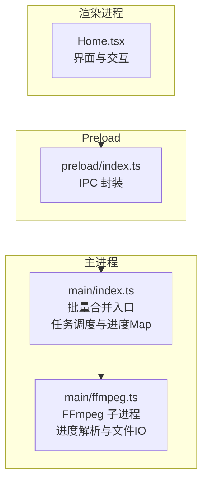
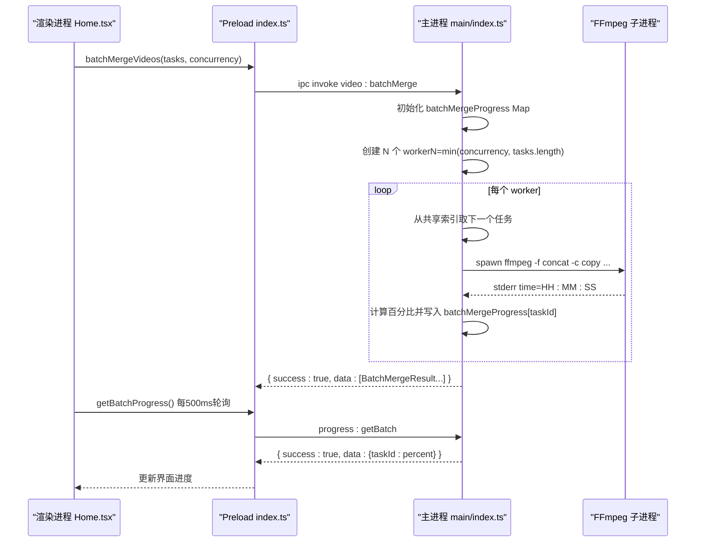
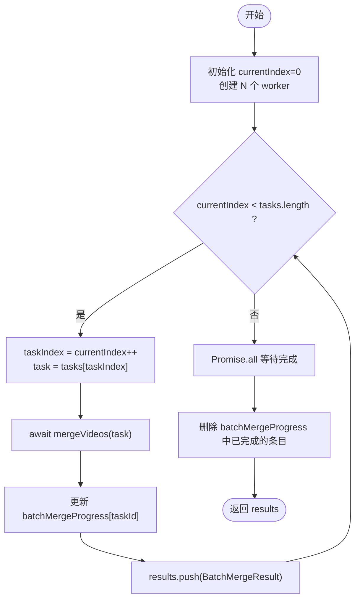
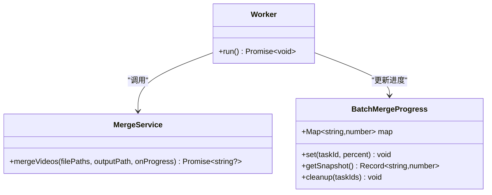
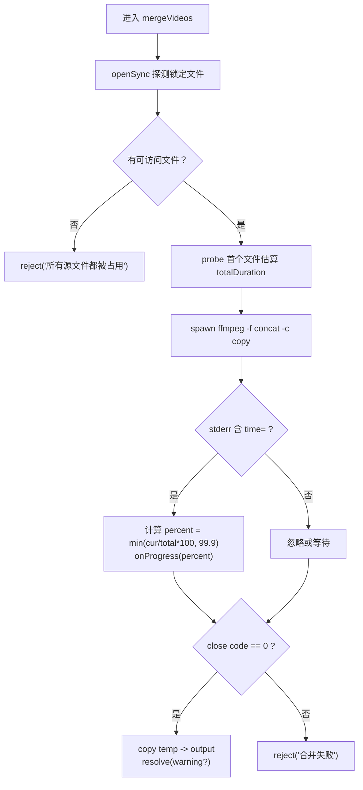
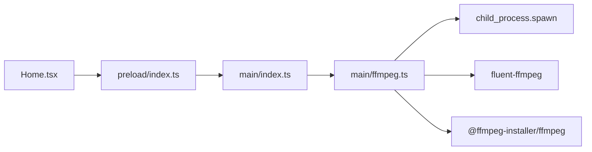

# 批量处理与并发控制

<cite>
**本文引用的文件**
- [src/main/index.ts](file://src/main/index.ts)
- [src/main/ffmpeg.ts](file://src/main/ffmpeg.ts)
- [src/preload/index.ts](file://src/preload/index.ts)
- [src/renderer/src/pages/Home.tsx](file://src/renderer/src/pages/Home.tsx)
- [tests/ffmpegParsing.test.ts](file://tests/ffmpegParsing.test.ts)
</cite>

## 目录
1. [简介](#简介)
2. [项目结构](#项目结构)
3. [核心组件](#核心组件)
4. [架构总览](#架构总览)
5. [详细组件分析](#详细组件分析)
6. [依赖关系分析](#依赖关系分析)
7. [性能考量](#性能考量)
8. [故障排查指南](#故障排查指南)
9. [结论](#结论)
10. [附录](#附录)

## 简介
本文件聚焦于“批量处理与并发控制”的实现，围绕以下关键点展开：
- BatchMergeTask 与 BatchMergeResult 数据结构设计
- 任务队列管理与工作线程池实现（基于主进程内异步 worker）
- 并发控制算法：worker 函数、任务分配策略、进度同步机制
- batchMergeProgress Map 的使用模式、状态管理、实时更新
- 任务执行生命周期、错误隔离与结果聚合
- 并发数调优建议、资源监控方法与性能瓶颈分析
- Node.js 异步编程最佳实践与内存优化技巧

## 项目结构
本项目为 Electron 应用，采用主进程 + 渲染进程 + preload 桥接的架构。批量合并的核心逻辑位于主进程，通过 IPC 暴露给渲染进程调用；FFmpeg 子进程由主进程启动并解析其 stderr 输出以计算进度。

图表来源
- [src/renderer/src/pages/Home.tsx:183-298](file://src/renderer/src/pages/Home.tsx#L183-L298)
- [src/preload/index.ts:21-49](file://src/preload/index.ts#L21-L49)
- [src/main/index.ts:405-478](file://src/main/index.ts#L405-L478)
- [src/main/ffmpeg.ts:87-245](file://src/main/ffmpeg.ts#L87-L245)

章节来源
- [src/main/index.ts:1-530](file://src/main/index.ts#L1-L530)
- [src/main/ffmpeg.ts:1-305](file://src/main/ffmpeg.ts#L1-L305)
- [src/preload/index.ts:1-64](file://src/preload/index.ts#L1-L64)
- [src/renderer/src/pages/Home.tsx:1-760](file://src/renderer/src/pages/Home.tsx#L1-L760)

## 核心组件
- 批量任务接口定义
  - BatchMergeTask：包含 taskId、filePaths、outputPath、folderName
  - BatchMergeResult：包含 taskId、folderName、success、warning/error
- 进度存储
  - batchMergeProgress：Map<string, number>，键为 taskId，值为当前进度百分比（成功完成为 100，失败为 -1）
- 并发控制
  - 使用固定数量的 worker 异步函数从共享索引 currentIndex 中自增取任务，实现无锁的任务分配
  - 使用 Promise.all 等待所有 worker 结束
- FFmpeg 集成
  - mergeVideos：使用 concat demuxer 直接拼接 FLV 到 MP4（stream copy），通过解析 stderr 中的 time= 字段估算进度
  - convertToMp4：用于格式转换（非本次重点）

章节来源
- [src/main/index.ts:405-478](file://src/main/index.ts#L405-L478)
- [src/main/ffmpeg.ts:87-245](file://src/main/ffmpeg.ts#L87-L245)

## 架构总览
批量合并的整体流程如下：
- 渲染进程准备任务列表，调用批量合并 API
- Preload 将请求转发至主进程
- 主进程初始化进度 Map，创建若干 worker，按并发度并行执行
- 每个 worker 循环取出下一个任务，调用 FFmpeg 合并，实时回调更新进度 Map
- 渲染进程定时轮询获取进度 Map，计算总体进度并展示
- 全部完成后清理进度记录并返回结果数组

图表来源
- [src/renderer/src/pages/Home.tsx:221-242](file://src/renderer/src/pages/Home.tsx#L221-L242)
- [src/preload/index.ts:42-48](file://src/preload/index.ts#L42-L48)
- [src/main/index.ts:421-478](file://src/main/index.ts#L421-L478)
- [src/main/ffmpeg.ts:162-191](file://src/main/ffmpeg.ts#L162-L191)

## 详细组件分析

### 数据结构设计：BatchMergeTask 与 BatchMergeResult
- BatchMergeTask
  - taskId：唯一标识一个分组任务，用作进度 Map 的键
  - filePaths：该组待合并的视频源文件路径数组
  - outputPath：输出 MP4 的目标路径
  - folderName：用于结果展示与错误提示的友好名称
- BatchMergeResult
  - taskId/folderName：对应任务的标识与名称
  - success：布尔值，表示是否成功
  - warning：可选警告信息（如部分文件被跳过）
  - error：可选错误信息（异常时填充）

这些结构在主进程中定义并通过 IPC 传递，确保前后端契约一致。

章节来源
- [src/main/index.ts:405-419](file://src/main/index.ts#L405-L419)
- [src/preload/index.ts:42-44](file://src/preload/index.ts#L42-L44)

### 任务队列与工作线程池
- 任务队列
  - 使用共享变量 currentIndex 指向下一个待处理任务的索引
  - 每个 worker 在 while 循环中自增读取任务，直到越界退出
- 工作线程池
  - 使用 Array.from 创建 N 个 worker 函数实例，N = min(concurrency, tasks.length)
  - 使用 Promise.all 等待所有 worker 完成
- 并发控制要点
  - 无锁自增：currentIndex++ 是原子操作（单线程事件循环下），避免竞态
  - 上限保护：并发数不超过任务数量，防止空转
  - 顺序性：任务按输入顺序依次分配，便于调试与可观测性

图表来源
- [src/main/index.ts:421-469](file://src/main/index.ts#L421-L469)

章节来源
- [src/main/index.ts:421-469](file://src/main/index.ts#L421-L469)

### 进度同步机制与 batchMergeProgress Map
- 初始化阶段：对所有任务设置初始进度 0
- 运行期：mergeVideos 的 onProgress 回调将当前百分比写入 Map
- 完成/失败：成功写 100，失败写 -1
- 查询阶段：渲染进程每 500ms 轮询一次，主进程将 Map 转为对象返回
- 清理阶段：全部完成后删除各 taskId 对应的条目，避免内存泄漏

图表来源
- [src/main/index.ts:421-478](file://src/main/index.ts#L421-L478)

章节来源
- [src/main/index.ts:421-478](file://src/main/index.ts#L421-L478)

### FFmpeg 进度解析与错误隔离
- 快速探测：先对首个可访问文件进行 probe，估算总时长，用于将 time= 转换为百分比
- 进度回调：解析 stderr 中的 time= 字段，限制最大 99.9%，避免超过 100%
- 超时保护：30 分钟超时，自动清理临时文件并拒绝 Promise
- 错误隔离：单个任务异常不会影响其他任务，结果数组独立记录
- 文件覆盖保护：若目标文件存在，尝试备份后覆盖，失败则返回错误

图表来源
- [src/main/ffmpeg.ts:87-245](file://src/main/ffmpeg.ts#L87-L245)

章节来源
- [src/main/ffmpeg.ts:87-245](file://src/main/ffmpeg.ts#L87-L245)
- [tests/ffmpegParsing.test.ts:57-97](file://tests/ffmpegParsing.test.ts#L57-L97)

### 渲染侧进度轮询与总体进度计算
- 每 500ms 调用 getBatchProgress，得到 {taskId: percent} 快照
- 总体进度 = 所有任务进度之和 / 任务数（负值视为 0）
- 当任务完成或失败时，渲染侧移除对应行或标记状态

章节来源
- [src/renderer/src/pages/Home.tsx:221-236](file://src/renderer/src/pages/Home.tsx#L221-L236)
- [src/renderer/src/pages/Home.tsx:242-298](file://src/renderer/src/pages/Home.tsx#L242-L298)

## 依赖关系分析
- 模块耦合
  - 主进程负责任务调度与进度 Map，低耦合地调用 FFmpeg 服务
  - 渲染进程仅关心任务构建与进度轮询，不感知并发细节
- 外部依赖
  - fluent-ffmpeg 与 @ffmpeg-installer/ffmpeg：提供 FFmpeg 二进制与封装
  - child_process.spawn：直接启动 FFmpeg 子进程以解析 stderr
- 潜在风险
  - 多子进程并发可能引发磁盘 IO 竞争与 CPU 抖动
  - 大文件复制与临时文件管理需关注磁盘空间与权限

图表来源
- [src/preload/index.ts:21-49](file://src/preload/index.ts#L21-L49)
- [src/main/index.ts:405-478](file://src/main/index.ts#L405-L478)
- [src/main/ffmpeg.ts:1-10](file://src/main/ffmpeg.ts#L1-L10)

章节来源
- [src/main/ffmpeg.ts:1-10](file://src/main/ffmpeg.ts#L1-L10)
- [src/main/index.ts:405-478](file://src/main/index.ts#L405-L478)
- [src/preload/index.ts:21-49](file://src/preload/index.ts#L21-L49)

## 性能考量
- 并发数调优建议
  - 默认 3 适合多数桌面环境；CPU 密集场景建议 2-4，I/O 密集可适当提高但不宜超过 8
  - 根据磁盘类型（HDD/SSD）与网络盘延迟调整，避免过多并发导致吞吐下降
- 资源监控方法
  - 观察系统任务管理器中 FFmpeg 子进程数量与 CPU/磁盘占用
  - 统计平均任务耗时与总体吞吐（任务数/总耗时）
- 性能瓶颈分析
  - 主要瓶颈通常在磁盘 IO（大量小片段合并）与 FFmpeg 子进程间竞争
  - 进度解析正则匹配开销较小，但高频回调仍应节流（当前 500ms 轮询已较合理）
- 内存优化技巧
  - 及时清理 batchMergeProgress 中已完成条目，避免长期增长
  - 避免在回调中创建大对象，尽量只传数值
  - 临时文件统一放在系统 tmpdir，并在异常路径也做清理

章节来源
- [src/main/index.ts:463-468](file://src/main/index.ts#L463-L468)
- [src/main/ffmpeg.ts:154-160](file://src/main/ffmpeg.ts#L154-L160)

## 故障排查指南
- 常见问题
  - 源文件被占用：提示“所有源文件都被占用”，需等待录制停止或重试
  - 合并超时：超过 30 分钟自动终止，检查是否有正在录制的片段
  - 输出覆盖失败：目标文件被占用或权限不足，尝试关闭占用程序或以管理员权限运行
- 定位步骤
  - 查看主进程日志中的 FFmpeg 命令与 stderr 最后几行
  - 确认临时文件是否被正确清理
  - 降低并发数验证是否为资源竞争导致
- 恢复策略
  - 失败任务不影响其他任务，可在 UI 中单独重试
  - 支持备份已有输出文件，避免数据丢失

章节来源
- [src/main/ffmpeg.ts:110-117](file://src/main/ffmpeg.ts#L110-L117)
- [src/main/ffmpeg.ts:154-160](file://src/main/ffmpeg.ts#L154-L160)
- [src/main/ffmpeg.ts:200-244](file://src/main/ffmpeg.ts#L200-L244)

## 结论
本实现通过简洁的主进程内 worker 模型与共享索引实现了稳定的并发控制，结合 Map 驱动的进度同步与严格的错误隔离，满足了批量视频合并的高吞吐与高可用需求。配合合理的并发数配置与资源监控，可在不同硬件环境下取得良好表现。未来可考虑引入更细粒度的任务队列与动态并发调节，进一步提升稳定性与可扩展性。

## 附录
- Node.js 异步编程最佳实践
  - 使用 async/await 简化异步流程，避免回调地狱
  - 使用 Promise.all 并行执行无依赖任务，注意错误传播
  - 对高频回调进行节流，减少渲染层压力
- 内存优化技巧
  - 及时释放不再使用的引用（如 Map 条目）
  - 避免在事件循环中持有大对象引用
  - 合理使用临时目录与文件清理策略