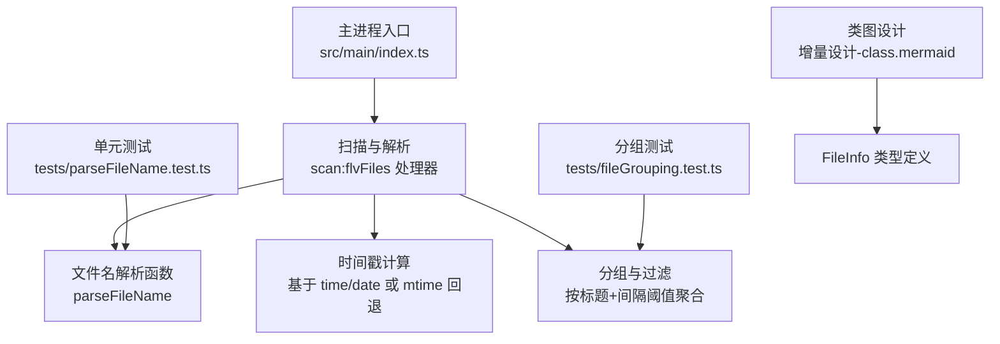
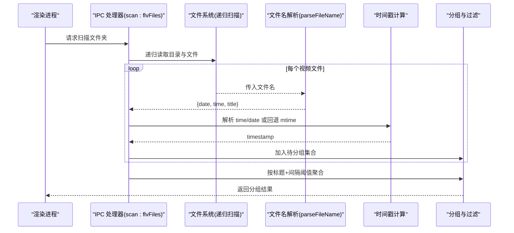
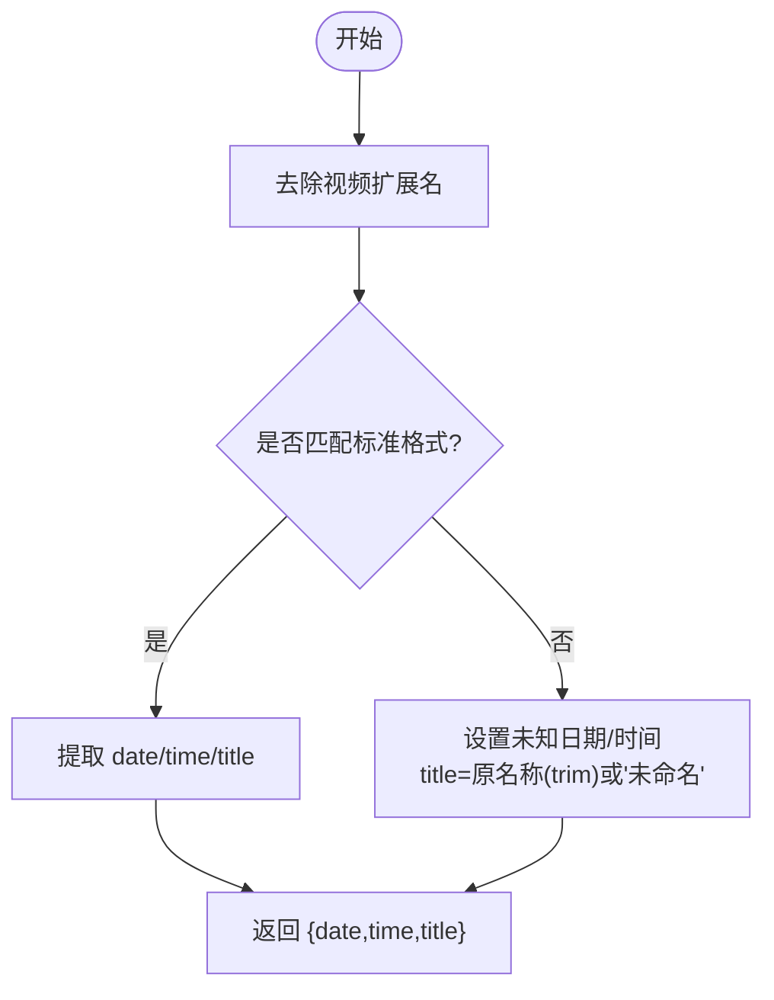
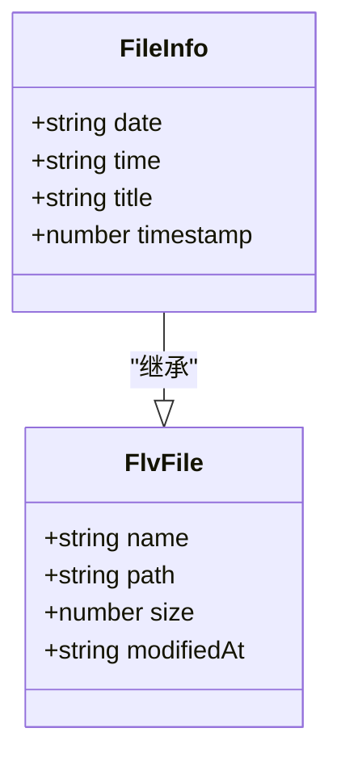
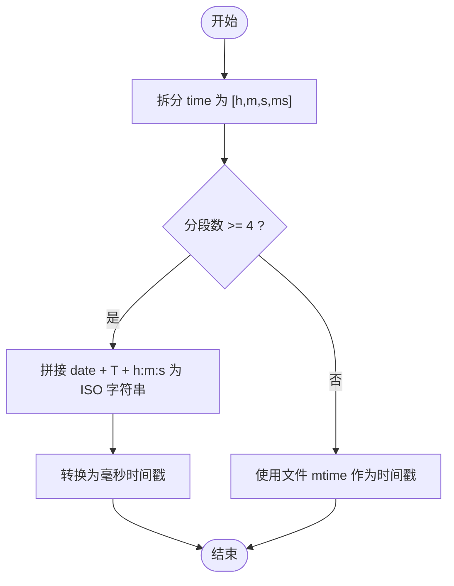
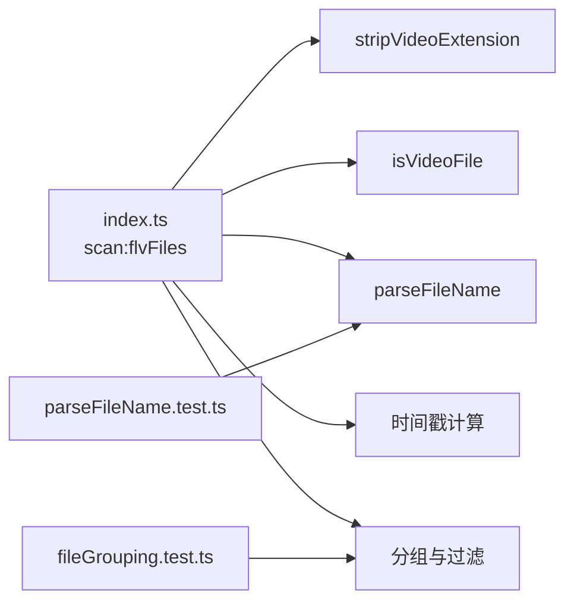

# 文件名解析与元数据提取

<cite>
**本文引用的文件列表**
- [src/main/index.ts](file://src/main/index.ts)
- [tests/parseFileName.test.ts](file://tests/parseFileName.test.ts)
- [tests/fileGrouping.test.ts](file://tests/fileGrouping.test.ts)
- [deliverables/software-company/视频合并app-增量设计-class.mermaid](file://deliverables/software-company/视频合并app-增量设计-class.mermaid)
</cite>

## 目录
1. [简介](#简介)
2. [项目结构](#项目结构)
3. [核心组件](#核心组件)
4. [架构总览](#架构总览)
5. [详细组件分析](#详细组件分析)
6. [依赖关系分析](#依赖关系分析)
7. [性能考量](#性能考量)
8. [故障排查指南](#故障排查指南)
9. [结论](#结论)
10. [附录](#附录)

## 简介
本文件聚焦于“文件名解析与元数据提取”的实现细节，围绕以下目标展开：
- 深入解释 parseFileName 的正则匹配逻辑、日期时间格式（YYYY-MM-DD HH-mm-sss）的解析规则以及标题提取机制。
- 说明 FileInfo 数据模型字段含义与计算逻辑，包括 date、time、title、timestamp 等。
- 阐述时间戳生成算法：优先从文件名提取，失败时回退到文件修改时间。
- 总结文件名格式验证、异常处理与默认值设置策略。
- 提供多种文件名格式的解析示例与错误处理场景。

## 项目结构
与文件名解析和元数据提取直接相关的代码位于主进程入口中，测试用例覆盖了解析与分组逻辑。类图文档提供了类型层面的参考。

图表来源
- [src/main/index.ts:145-216](file://src/main/index.ts#L145-L216)
- [tests/parseFileName.test.ts:8-23](file://tests/parseFileName.test.ts#L8-L23)
- [tests/fileGrouping.test.ts:28-68](file://tests/fileGrouping.test.ts#L28-L68)
- [deliverables/software-company/视频合并app-增量设计-class.mermaid:17-22](file://deliverables/software-company/视频合并app-增量设计-class.mermaid#L17-L22)

章节来源
- [src/main/index.ts:145-216](file://src/main/index.ts#L145-L216)
- [tests/parseFileName.test.ts:8-23](file://tests/parseFileName.test.ts#L8-L23)
- [tests/fileGrouping.test.ts:28-68](file://tests/fileGrouping.test.ts#L28-L68)
- [deliverables/software-company/视频合并app-增量设计-class.mermaid:17-22](file://deliverables/software-company/视频合并app-增量设计-class.mermaid#L17-L22)

## 核心组件
- 文件名解析器：负责从文件名中提取日期、时间与标题，并返回标准化结果。
- 时间戳生成器：根据解析出的日期时间构造时间戳；若无法解析，则回退使用文件修改时间。
- 文件信息模型：封装原始文件信息与解析后的元数据，用于后续分组与展示。
- 分组与过滤：基于标题和时间间隔阈值将片段归并为同一场直播，并过滤已合并产物。

章节来源
- [src/main/index.ts:164-216](file://src/main/index.ts#L164-L216)
- [tests/parseFileName.test.ts:8-23](file://tests/parseFileName.test.ts#L8-L23)
- [tests/fileGrouping.test.ts:28-68](file://tests/fileGrouping.test.ts#L28-L68)
- [deliverables/software-company/视频合并app-增量设计-class.mermaid:17-22](file://deliverables/software-company/视频合并app-增量设计-class.mermaid#L17-L22)

## 架构总览
下图展示了从 IPC 调用到文件名解析、时间戳计算、分组与过滤的整体流程。

图表来源
- [src/main/index.ts:145-216](file://src/main/index.ts#L145-L216)
- [src/main/index.ts:216-345](file://src/main/index.ts#L216-L345)

## 详细组件分析

### 文件名解析函数 parseFileName
- 输入：文件名（可能包含扩展名）。
- 输出：{ date, time, title }。
- 正则表达式匹配要点：
  - 日期部分：四位年-两位月-两位日，严格数字。
  - 时间部分：两位时-两位分-两位秒-三位毫秒，以连字符分隔。
  - 标题部分：在时间之后至少一个非空白字符，允许包含空格与其他符号。
- 扩展名处理：
  - 主实现通过 stripVideoExtension 去除所有受支持的视频扩展名（如 .flv/.m4s/.ts/.blv），再进入解析。
  - 测试用例中为简化演示，仅去除了 .flv 扩展名，但行为一致：先剥离扩展名，再进行正则匹配。
- 默认值策略：
  - 当正则不匹配时，date 与 time 分别设为“未知日期”“未知时间”，title 取原文件名（去除扩展名后）的 trim 结果；若为空则置为“未命名”。

图表来源
- [src/main/index.ts:164-179](file://src/main/index.ts#L164-L179)
- [tests/parseFileName.test.ts:8-23](file://tests/parseFileName.test.ts#L8-L23)

章节来源
- [src/main/index.ts:164-179](file://src/main/index.ts#L164-L179)
- [tests/parseFileName.test.ts:8-23](file://tests/parseFileName.test.ts#L8-L23)

### 日期时间格式与标题提取机制
- 日期格式：YYYY-MM-DD（例如 2024-06-15）。
- 时间格式：HH-mm-sss（例如 14-30-00-123），其中 sss 表示毫秒。
- 标题提取：
  - 正则捕获时间之后的任意内容作为标题，保留内部空格与特殊字符。
  - 对标题进行 trim 处理，去除首尾空白；若结果为空字符串，则使用“未命名”。
- 边界情况：
  - 无标题（仅有日期和时间）：由于正则要求标题至少一个字符，不会匹配成功，走 fallback 分支，此时 date/time 为“未知日期/时间”，title 为原名称（trim 后）。

章节来源
- [src/main/index.ts:164-179](file://src/main/index.ts#L164-L179)
- [tests/parseFileName.test.ts:25-76](file://tests/parseFileName.test.ts#L25-L76)

### FileInfo 数据模型设计
- 字段说明：
  - name：原始文件名。
  - path：完整路径。
  - size：文件大小（字节）。
  - modifiedAt：文件修改时间的 ISO 字符串。
  - date：从文件名解析得到的日期字符串（YYYY-MM-DD），若不匹配则为“未知日期”。
  - time：从文件名解析得到的时间字符串（HH-mm-sss），若不匹配则为“未知时间”。
  - title：从文件名解析得到的标题，若无则回退为原名称（trim 后）或“未命名”。
  - timestamp：数值型时间戳（毫秒），用于排序与分组。
- 计算逻辑：
  - 当 time 可拆分为至少四段（时、分、秒、毫秒）时，使用 date 与时间前三个分段（时、分、秒）组合成 ISO 时间字符串，并转换为时间戳。
  - 否则，回退使用文件的 mtime 时间戳。

图表来源
- [src/main/index.ts:155-160](file://src/main/index.ts#L155-L160)
- [deliverables/software-company/视频合并app-增量设计-class.mermaid:17-22](file://deliverables/software-company/视频合并app-增量设计-class.mermaid#L17-L22)

章节来源
- [src/main/index.ts:155-160](file://src/main/index.ts#L155-L160)
- [src/main/index.ts:191-206](file://src/main/index.ts#L191-L206)
- [deliverables/software-company/视频合并app-增量设计-class.mermaid:17-22](file://deliverables/software-company/视频合并app-增量设计-class.mermaid#L17-L22)

### 时间戳生成算法与回退机制
- 优先策略：从文件名解析出的 date 与 time 构建时间戳。
  - 将 time 按连字符分割，若存在至少四个分段，则用 date 与前三段（时、分、秒）拼接为 ISO 时间字符串，并转为毫秒时间戳。
- 回退策略：当 time 分段不足或解析失败时，使用文件系统的 mtime 作为时间戳。
- 用途：
  - 用于全局排序（按时间戳升序）。
  - 用于分组判断（相邻文件的时间间隔是否超过阈值）。

图表来源
- [src/main/index.ts:191-195](file://src/main/index.ts#L191-L195)

章节来源
- [src/main/index.ts:191-195](file://src/main/index.ts#L191-L195)

### 文件名格式验证、异常处理与默认值策略
- 格式验证：
  - 通过正则严格校验日期与时间格式，确保只有符合 YYYY-MM-DD HH-mm-sss 结构的文件名才会被识别为标准格式。
- 异常处理：
  - 文件访问异常（如权限问题）会被 try/catch 捕获并跳过，不影响整体扫描流程。
  - 分组与过滤过程中对目录不存在或不可访问的情况也做了容错处理。
- 默认值设置：
  - 非标准文件名：date/time 设为“未知日期/时间”，title 使用原名称（trim 后）或“未命名”。
  - 空标题：正则不匹配时走 fallback，title 同样遵循上述默认值策略。

章节来源
- [src/main/index.ts:164-179](file://src/main/index.ts#L164-L179)
- [src/main/index.ts:181-212](file://src/main/index.ts#L181-L212)
- [src/main/index.ts:309-345](file://src/main/index.ts#L309-L345)

### 解析示例与错误处理场景
以下为典型场景的预期行为（描述性说明，不含具体代码）：
- 标准格式：能正确提取 date、time 与 title。
- 标题含多个空格：保留内部空格，trim 仅去除首尾空白。
- 大写扩展名：大小写不敏感地去除扩展名后再解析。
- 非标准文件名：date/time 为“未知日期/时间”，title 为原名称（trim 后）。
- 无扩展名：仍可进行解析；若不符合标准格式，走 fallback。
- 空标题（仅有日期和时间）：因正则要求标题至少一个字符，不匹配，走 fallback，date/time 为“未知日期/时间”，title 为原名称（trim 后）。
- 中文与特殊字符：标题部分可包含中文与常见符号，均能正确保留。

章节来源
- [tests/parseFileName.test.ts:25-76](file://tests/parseFileName.test.ts#L25-L76)

## 依赖关系分析
- 主进程入口中的 scan:flvFiles 处理器：
  - 依赖文件系统 API 递归扫描目录。
  - 依赖 isVideoFile 与 stripVideoExtension 筛选并清理扩展名。
  - 依赖 parseFileName 进行元数据提取。
  - 依赖时间戳计算与分组逻辑完成最终结果组织。
- 测试文件：
  - parseFileName.test.ts 覆盖了解析器的各种边界条件。
  - fileGrouping.test.ts 覆盖了分组算法的关键场景。

图表来源
- [src/main/index.ts:126-143](file://src/main/index.ts#L126-L143)
- [src/main/index.ts:164-216](file://src/main/index.ts#L164-L216)
- [tests/parseFileName.test.ts:8-23](file://tests/parseFileName.test.ts#L8-L23)
- [tests/fileGrouping.test.ts:28-68](file://tests/fileGrouping.test.ts#L28-L68)

章节来源
- [src/main/index.ts:126-143](file://src/main/index.ts#L126-L143)
- [src/main/index.ts:164-216](file://src/main/index.ts#L164-L216)
- [tests/parseFileName.test.ts:8-23](file://tests/parseFileName.test.ts#L8-L23)
- [tests/fileGrouping.test.ts:28-68](file://tests/fileGrouping.test.ts#L28-L68)

## 性能考量
- 解析开销：正则匹配与字符串操作均为轻量级，对大量文件扫描影响有限。
- 时间戳计算：仅在必要时进行 Date 构造与转换；回退路径直接使用 mtime，避免额外开销。
- 分组复杂度：当前实现采用线性遍历与局部查找，适合中等规模数据集；若需扩展到大规模，可考虑哈希索引优化分组查找。

[本节为通用指导，不涉及具体文件分析]

## 故障排查指南
- 常见问题：
  - 文件名不符合预期格式：检查是否符合 YYYY-MM-DD HH-mm-sss 结构，并确保扩展名已被正确去除。
  - 时间戳异常：确认 time 分段是否齐全；若不足，系统会回退到 mtime，可能导致排序与分组偏差。
  - 分组不正确：调整 maxIntervalHours 阈值，确保同一场直播的片段间隔在阈值内。
- 定位建议：
  - 打印 parseFileName 的中间结果（date/time/title）以确认正则匹配是否正确。
  - 对比 timestamp 与 mtime，确认回退路径是否被触发。
  - 检查分组时的 lastTimestamp 更新逻辑，确保按时间顺序推进。

章节来源
- [src/main/index.ts:164-179](file://src/main/index.ts#L164-L179)
- [src/main/index.ts:191-195](file://src/main/index.ts#L191-L195)
- [src/main/index.ts:216-345](file://src/main/index.ts#L216-L345)

## 结论
本实现通过严格的正则匹配与清晰的默认值策略，确保了文件名解析的鲁棒性与一致性。时间戳生成算法兼顾了准确性与可用性，回退机制保证了在缺失元数据时仍可正常排序与分组。配合完善的测试用例，该模块具备良好的可维护性与可扩展性。

[本节为总结性内容，不涉及具体文件分析]

## 附录
- 相关类型参考：
  - FileInfo 与 FlvFile 的继承关系与字段定义，参见类图文档。
- 关键实现位置：
  - 文件名解析与时间戳计算：主进程入口的扫描处理器。
  - 分组与过滤：主进程入口的分组逻辑与已合并检测。

章节来源
- [deliverables/software-company/视频合并app-增量设计-class.mermaid:17-22](file://deliverables/software-company/视频合并app-增量设计-class.mermaid#L17-L22)
- [src/main/index.ts:164-216](file://src/main/index.ts#L164-L216)
- [src/main/index.ts:216-345](file://src/main/index.ts#L216-L345)