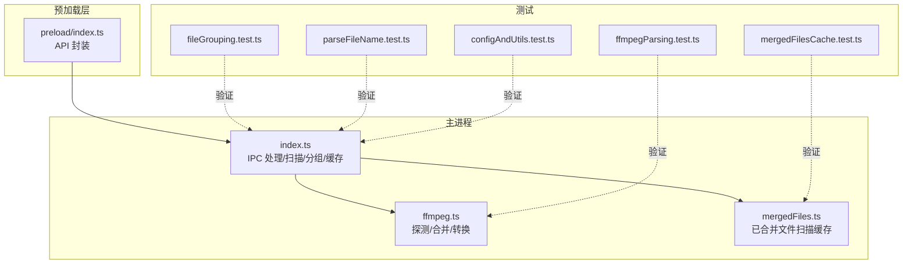
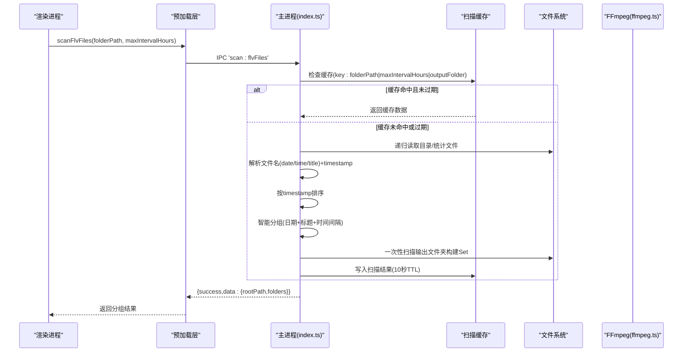
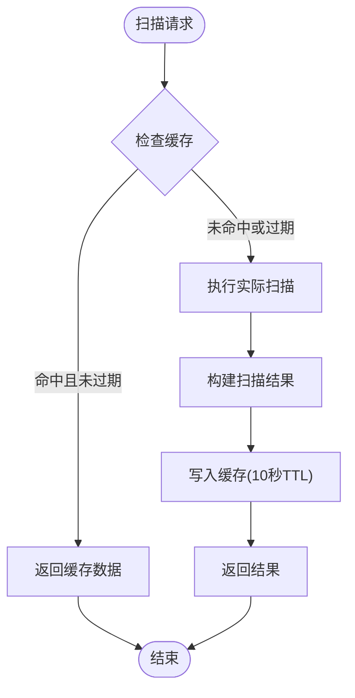
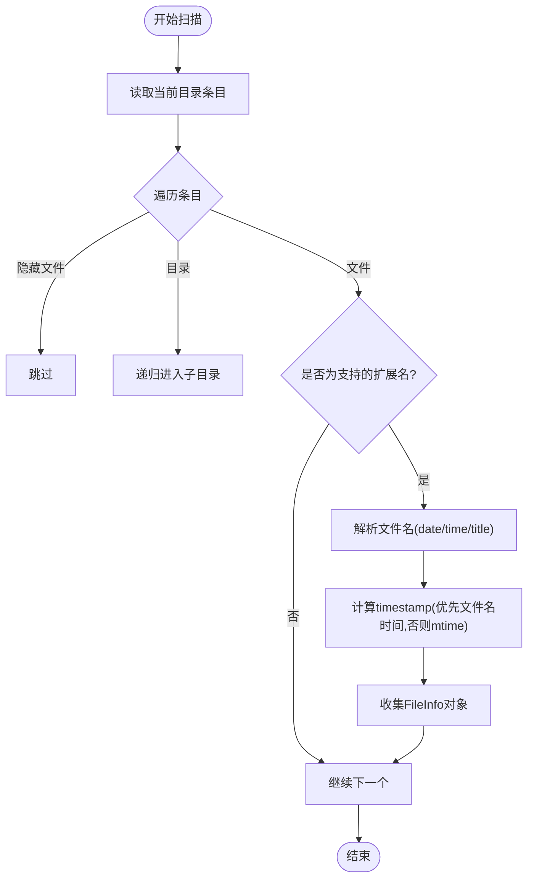
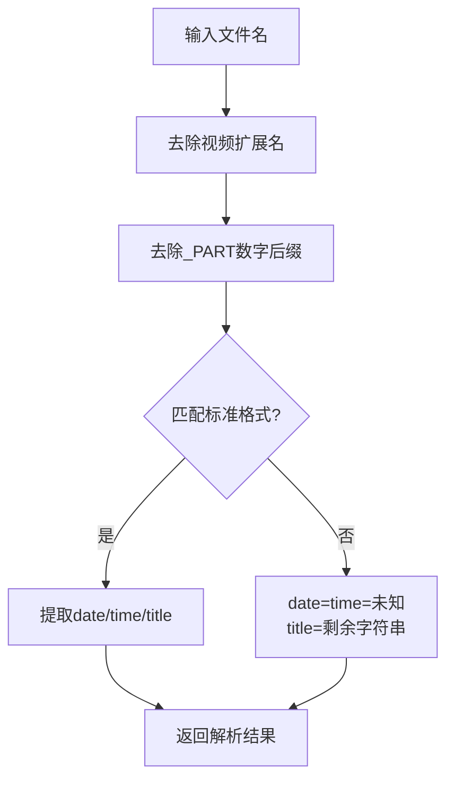
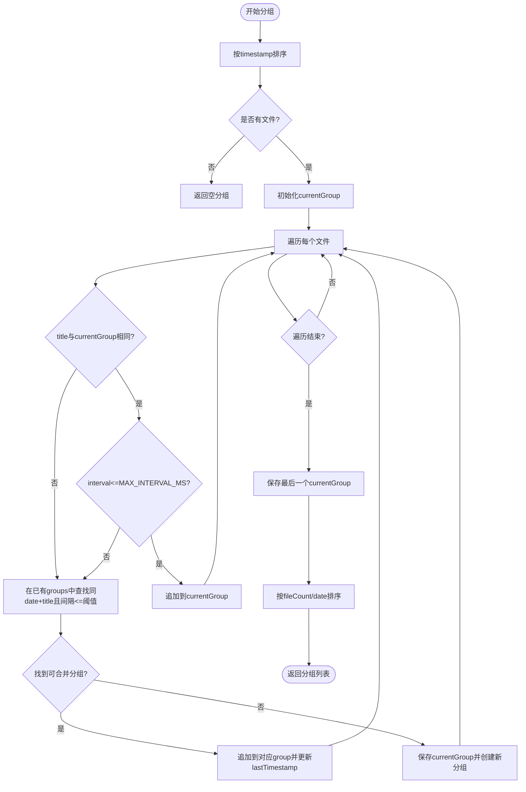
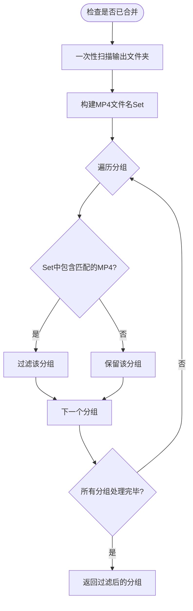
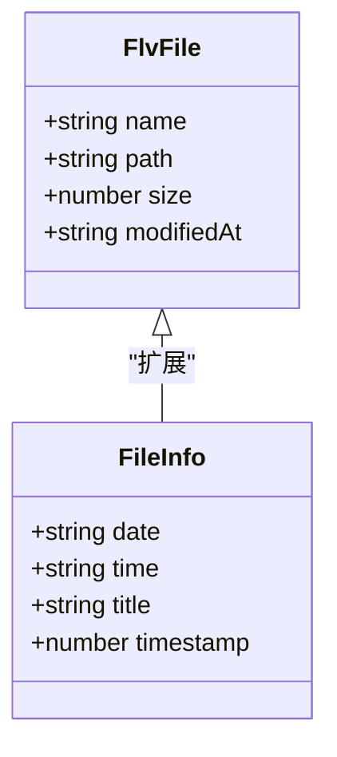
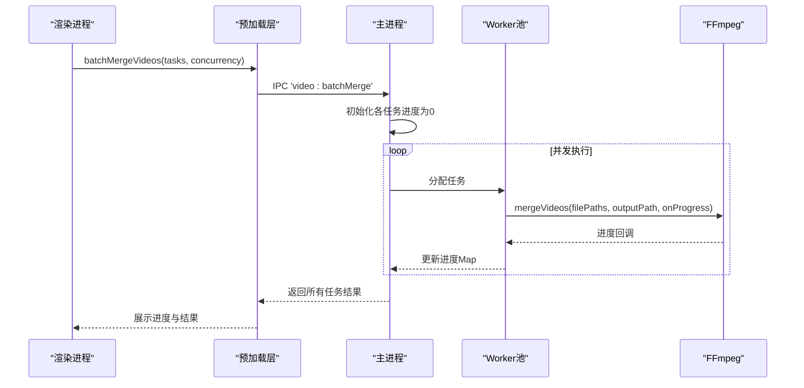
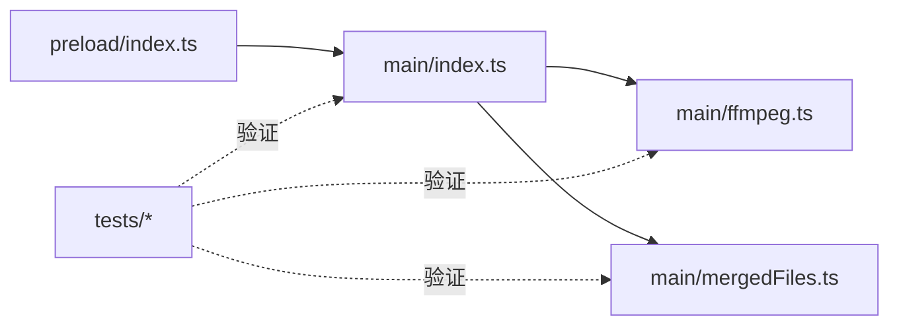

# 文件扫描与分组算法

<cite>
**本文引用的文件**   
- [src/main/index.ts](file://src/main/index.ts)
- [src/main/ffmpeg.ts](file://src/main/ffmpeg.ts)
- [src/preload/index.ts](file://src/preload/index.ts)
- [src/main/mergedFiles.ts](file://src/main/mergedFiles.ts)
- [tests/fileGrouping.test.ts](file://tests/fileGrouping.test.ts)
- [tests/parseFileName.test.ts](file://tests/parseFileName.test.ts)
- [tests/configAndUtils.test.ts](file://tests/configAndUtils.test.ts)
- [tests/ffmpegParsing.test.ts](file://tests/ffmpegParsing.test.ts)
- [tests/mergedFilesCache.test.ts](file://tests/mergedFilesCache.test.ts)
</cite>

## 更新摘要
**变更内容**   
- 新增扫描结果缓存机制，包含10秒TTL缓存，按文件夹路径、最大间隔小时数和输出文件夹组合键进行索引
- 优化已合并视频检测逻辑，使用一次性扫描构建Set集合避免重复递归
- 改进performScan函数支持bypassCache参数控制缓存绕过
- 增强性能优化，防止冗余文件夹遍历操作

## 目录
1. [简介](#简介)
2. [项目结构](#项目结构)
3. [核心组件](#核心组件)
4. [架构总览](#架构总览)
5. [详细组件分析](#详细组件分析)
6. [依赖关系分析](#依赖关系分析)
7. [性能考虑](#性能考虑)
8. [故障排查指南](#故障排查指南)
9. [结论](#结论)
10. [附录](#附录)

## 简介
本文件聚焦于"视频合并应用"中的文件扫描与分组算法，系统性阐述以下要点：
- 递归目录扫描实现
- 视频文件识别逻辑
- 文件名解析算法（日期+时间+标题）
- 智能分组核心逻辑：基于"日期+标题"的匹配规则、时间间隔判断算法、重复检测机制
- FlvFile 与 FileInfo 数据模型设计、元数据提取与排序策略
- MAX_INTERVAL_MS 阈值计算、分组键生成规则与过滤条件
- 批量处理时的去重逻辑与已合并视频的检测算法
- **新增：扫描结果缓存机制，提升重复扫描性能**
- 面向开发者的性能优化技巧与内存管理策略

## 项目结构
本项目采用 Electron 多进程架构：主进程负责文件系统操作、FFmpeg 调用与任务调度；预加载脚本桥接 IPC；渲染进程提供 UI。与文件扫描和分组相关的核心代码位于主进程入口与 FFmpeg 工具模块中，并通过测试用例验证关键逻辑。

**图表来源**
- [src/main/index.ts:47-49](file://src/main/index.ts#L47-L49)
- [src/main/index.ts:539-793](file://src/main/index.ts#L539-L793)
- [src/main/mergedFiles.ts:14-23](file://src/main/mergedFiles.ts#L14-L23)
- [src/main/ffmpeg.ts:1-305](file://src/main/ffmpeg.ts#L1-L305)
- [src/preload/index.ts:20-49](file://src/preload/index.ts#L20-L49)
- [tests/fileGrouping.test.ts:28-68](file://tests/fileGrouping.test.ts#L28-L68)
- [tests/parseFileName.test.ts:8-23](file://tests/parseFileName.test.ts#L8-L23)
- [tests/configAndUtils.test.ts:48-83](file://tests/configAndUtils.test.ts#L48-L83)
- [tests/ffmpegParsing.test.ts:8-55](file://tests/ffmpegParsing.test.ts#L8-L55)
- [tests/mergedFilesCache.test.ts:22-85](file://tests/mergedFilesCache.test.ts#L22-L85)

章节来源
- [src/main/index.ts:1-1241](file://src/main/index.ts#L1-L1241)
- [src/main/ffmpeg.ts:1-305](file://src/main/ffmpeg.ts#L1-L305)
- [src/main/mergedFiles.ts:1-104](file://src/main/mergedFiles.ts#L1-L104)
- [src/preload/index.ts:1-64](file://src/preload/index.ts#L1-L64)

## 核心组件
- 文件扫描与分组（scan:flvFiles）
  - **新增：带缓存的智能扫描，避免重复文件夹遍历**
  - 递归遍历输入目录，识别支持的视频扩展名
  - 解析文件名得到 date/time/title，并计算 timestamp
  - 按 timestamp 升序排序后执行智能分组
  - 过滤掉已存在合并结果（mp4）的分组
- FFmpeg 工具（ffmpeg.ts）
  - 快速探测视频信息（时长、编码、分辨率）
  - 使用 concat demuxer 进行流复制式合并
  - 进度估算与超时保护
  - 格式转换（H.264 + AAC）
- 已合并文件扫描缓存（mergedFiles.ts）
  - **新增：独立的12秒TTL缓存机制**
  - 扫描输出文件夹中的MP4文件，用于已合并检测
  - 支持手动失效缓存和自动过期清理
- IPC 与 API 封装（preload/index.ts）
  - 统一返回 { success, data?, message? } 格式
  - 暴露 scanFlvFiles、mergeVideos、convertVideo、batchMergeVideos 等接口

**章节来源**
- [src/main/index.ts:47-49](file://src/main/index.ts#L47-L49)
- [src/main/index.ts:539-793](file://src/main/index.ts#L539-L793)
- [src/main/ffmpeg.ts:12-77](file://src/main/ffmpeg.ts#L12-L77)
- [src/main/ffmpeg.ts:87-245](file://src/main/ffmpeg.ts#L87-L245)
- [src/main/mergedFiles.ts:14-23](file://src/main/mergedFiles.ts#L14-L23)
- [src/main/mergedFiles.ts:50-95](file://src/main/mergedFiles.ts#L50-L95)
- [src/preload/index.ts:20-49](file://src/preload/index.ts#L20-L49)

## 架构总览
下图展示了从渲染进程发起扫描到主进程完成分组并返回结果的完整流程，包括新的缓存机制。

**图表来源**
- [src/preload/index.ts:33](file://src/preload/index.ts#L33)
- [src/main/index.ts:47-49](file://src/main/index.ts#L47-L49)
- [src/main/index.ts:558-566](file://src/main/index.ts#L558-L566)
- [src/main/index.ts:787-792](file://src/main/index.ts#L787-L792)
- [src/main/index.ts:741-785](file://src/main/index.ts#L741-L785)

## 详细组件分析

### 扫描缓存机制（新增功能）
**更新** 新增了智能扫描缓存机制，显著提升重复扫描性能

- 缓存键生成
  - key = `${folderPath}|${maxIntervalHours}|${outputFolder}`
  - 确保不同配置组合有独立缓存
- TTL 管理
  - SCAN_CACHE_TTL = 10_000ms (10秒)
  - 超过TTL的缓存自动失效
- 缓存绕过
  - bypassCache 参数允许强制重新扫描
  - IPC 调用时默认绕过缓存获取最新数据
- 内存管理
  - Map 结构存储缓存条目
  - 每个条目包含数据和时间戳

**图表来源**
- [src/main/index.ts:47-49](file://src/main/index.ts#L47-L49)
- [src/main/index.ts:558-566](file://src/main/index.ts#L558-L566)
- [src/main/index.ts:787-792](file://src/main/index.ts#L787-L792)

**章节来源**
- [src/main/index.ts:47-49](file://src/main/index.ts#L47-L49)
- [src/main/index.ts:539-566](file://src/main/index.ts#L539-L566)
- [src/main/index.ts:787-792](file://src/main/index.ts#L787-L792)

### 递归目录扫描与视频识别
- 递归策略
  - 使用异步方式逐条读取目录项，遇到子目录则递归进入
  - 跳过以点开头的隐藏条目
  - 对每个文件尝试 stat，失败则跳过（避免权限问题导致中断）
- 视频识别
  - 仅识别特定扩展名集合（例如 flv、m4s、ts、blv），大小写不敏感
  - 非视频文件直接忽略
- 元数据收集
  - 记录 name、path、size、modifiedAt
  - 通过文件名解析出 date、time、title，并计算 timestamp
  - 若时间部分不足或无法解析，回退到文件修改时间作为排序依据

**图表来源**
- [src/main/index.ts:602-634](file://src/main/index.ts#L602-L634)
- [src/main/index.ts:521-535](file://src/main/index.ts#L521-L535)
- [src/main/index.ts:584-600](file://src/main/index.ts#L584-L600)
- [src/main/index.ts:614-628](file://src/main/index.ts#L614-L628)

**章节来源**
- [src/main/index.ts:602-634](file://src/main/index.ts#L602-L634)
- [src/main/index.ts:521-535](file://src/main/index.ts#L521-L535)
- [src/main/index.ts:584-600](file://src/main/index.ts#L584-L600)
- [src/main/index.ts:614-628](file://src/main/index.ts#L614-L628)

### 文件名解析算法
- 标准格式要求
  - 形如：YYYY-MM-DD HH-mm-ss-sss <可选空格>标题
  - 正则捕获三部分：date、time、title
- 非标准格式回退
  - 未匹配时，date=time=未知，title=原始文件名（去除扩展名）
- 扩展名剥离
  - 支持多种视频扩展名，大小写不敏感，只移除末尾匹配到的扩展名
- PART 文件处理
  - 自动去除 _PART00X 后缀，让同一场直播的 PART 文件和非 PART 文件归到同一组

**图表来源**
- [src/main/index.ts:584-600](file://src/main/index.ts#L584-L600)
- [src/main/index.ts:526-535](file://src/main/index.ts#L526-L535)
- [tests/parseFileName.test.ts:8-23](file://tests/parseFileName.test.ts#L8-L23)

**章节来源**
- [src/main/index.ts:584-600](file://src/main/index.ts#L584-L600)
- [src/main/index.ts:526-535](file://src/main/index.ts#L526-L535)
- [tests/parseFileName.test.ts:25-76](file://tests/parseFileName.test.ts#L25-L76)

### 智能分组核心逻辑
- 分组键生成
  - key = date + "_" + title
  - folderName = date + " " + title
- 排序策略
  - 先按 timestamp 升序排列，保证同一场直播片段顺序正确
- 时间间隔判断
  - MAX_INTERVAL_MS = maxIntervalHours * 60 * 60 * 1000
  - 若当前文件与当前分组的 lastTimestamp 差值不超过阈值，且 title 相同，则加入当前分组
- 跨组合并搜索
  - 当不符合当前分组条件时，遍历已有分组，寻找同 date+title 且间隔满足阈值的分组进行追加
  - 若仍无匹配，则保存当前分组并创建新分组
- 分组输出
  - 包含 fileCount、totalSize、files、lastTimestamp 等聚合信息
  - 最终按 fileCount 降序、date 降序排序

**图表来源**
- [src/main/index.ts:638-729](file://src/main/index.ts#L638-L729)
- [tests/fileGrouping.test.ts:28-68](file://tests/fileGrouping.test.ts#L28-L68)

**章节来源**
- [src/main/index.ts:638-729](file://src/main/index.ts#L638-L729)
- [tests/fileGrouping.test.ts:83-169](file://tests/fileGrouping.test.ts#L83-L169)

### 重复检测与已合并视频过滤（优化版）
**更新** 优化了已合并视频检测逻辑，使用一次性扫描构建Set集合

- 已合并检测优化
  - 一次性扫描输出文件夹，构建已合并文件的 Set 集合
  - 避免每个分组都递归扫描，大幅提升性能
  - 文件名需同时包含 date 与 title（大小写不敏感）
- 过滤条件
  - 若检测到已合并视频，则该分组被过滤掉，不再参与后续合并
- PART 文件过滤
  - 整场直播只要有任何 PART 文件，整组都不显示（正在录制中）

**图表来源**
- [src/main/index.ts:741-785](file://src/main/index.ts#L741-L785)
- [src/main/index.ts:736-739](file://src/main/index.ts#L736-L739)

**章节来源**
- [src/main/index.ts:741-785](file://src/main/index.ts#L741-L785)
- [src/main/index.ts:736-739](file://src/main/index.ts#L736-L739)

### 数据模型设计（FlvFile 与 FileInfo）
- FlvFile
  - 字段：name、path、size、modifiedAt
  - 用途：表示一个视频文件的物理信息与基本属性
- FileInfo（继承自 FlvFile）
  - 额外字段：date、time、title、timestamp
  - 用途：用于解析后的结构化元数据与排序/分组
- 设计考量
  - 将基础文件信息与解析后的语义信息分层，便于复用与扩展
  - timestamp 优先来自文件名时间，确保同一场直播片段顺序稳定

**图表来源**
- [src/main/index.ts:568-580](file://src/main/index.ts#L568-L580)
- [src/main/index.ts:619-628](file://src/main/index.ts#L619-L628)

**章节来源**
- [src/main/index.ts:568-580](file://src/main/index.ts#L568-L580)
- [src/main/index.ts:619-628](file://src/main/index.ts#L619-L628)

### 批量处理去重与并发合并
- 去重逻辑
  - 通过分组键（date_title）唯一标识一场直播
  - 在分组阶段已按时间间隔与标题匹配，避免重复分组
- 并发合并
  - 使用 worker 池并行执行多个合并任务
  - 每个任务维护独立进度（Map<taskId, progress>）
  - 任务完成后清理进度记录
- 错误与超时
  - 单个任务失败不影响其他任务
  - 合并过程设置超时保护，防止长时间阻塞

**图表来源**
- [src/main/index.ts:892-987](file://src/main/index.ts#L892-L987)
- [src/main/ffmpeg.ts:87-245](file://src/main/ffmpeg.ts#L87-L245)

**章节来源**
- [src/main/index.ts:892-987](file://src/main/index.ts#L892-L987)
- [src/main/ffmpeg.ts:87-245](file://src/main/ffmpeg.ts#L87-L245)

## 依赖关系分析
- 主进程与预加载层
  - 预加载层统一封装 IPC 调用，屏蔽后端返回格式差异
- 主进程与 FFmpeg
  - 通过 spawn 启动 ffmpeg 二进制，解析 stderr 获取进度与元信息
  - 使用 concat demuxer 进行高效拼接（stream copy）
- 主进程与 mergedFiles 模块
  - **新增：独立的已合并文件扫描缓存机制**
  - 共享已合并文件检测结果，避免重复扫描
- 测试与实现
  - 针对文件名解析、分组逻辑、配置合并、FFmpeg 输出解析均有单元测试覆盖
  - **新增：mergedFiles 缓存机制的专门测试**

**图表来源**
- [src/preload/index.ts:20-49](file://src/preload/index.ts#L20-L49)
- [src/main/index.ts:539-793](file://src/main/index.ts#L539-L793)
- [src/main/ffmpeg.ts:12-77](file://src/main/ffmpeg.ts#L12-L77)
- [src/main/mergedFiles.ts:50-95](file://src/main/mergedFiles.ts#L50-L95)
- [tests/parseFileName.test.ts:25-76](file://tests/parseFileName.test.ts#L25-L76)
- [tests/fileGrouping.test.ts:83-169](file://tests/fileGrouping.test.ts#L83-L169)
- [tests/ffmpegParsing.test.ts:8-55](file://tests/ffmpegParsing.test.ts#L8-L55)
- [tests/mergedFilesCache.test.ts:22-85](file://tests/mergedFilesCache.test.ts#L22-L85)

**章节来源**
- [src/preload/index.ts:1-64](file://src/preload/index.ts#L1-L64)
- [src/main/index.ts:539-793](file://src/main/index.ts#L539-L793)
- [src/main/ffmpeg.ts:12-77](file://src/main/ffmpeg.ts#L12-L77)
- [src/main/mergedFiles.ts:50-95](file://src/main/mergedFiles.ts#L50-L95)
- [tests/parseFileName.test.ts:25-76](file://tests/parseFileName.test.ts#L25-L76)
- [tests/fileGrouping.test.ts:83-169](file://tests/fileGrouping.test.ts#L83-L169)
- [tests/ffmpegParsing.test.ts:8-55](file://tests/ffmpegParsing.test.ts#L8-L55)
- [tests/mergedFilesCache.test.ts:22-85](file://tests/mergedFilesCache.test.ts#L22-L85)

## 性能考虑
**更新** 新增多项性能优化措施

- 扫描阶段
  - **新增：10秒TTL缓存机制，避免重复文件夹遍历**
  - 使用异步 I/O 提高扫描效率
  - 提前过滤隐藏文件与非视频文件，减少后续解析开销
- 分组阶段
  - 单次线性扫描 + 局部搜索已有分组，整体复杂度近似 O(n·g)，其中 g 为分组数量；可通过哈希索引（key→group）优化为 O(n)
- 已合并检测优化
  - **新增：一次性扫描输出文件夹构建Set集合，避免每个分组重复递归**
  - 大幅减少文件系统访问次数
- 合并阶段
  - 使用 concat demuxer 与 stream copy，避免重新编码，极大提升速度
  - 通过首个文件估算总时长，结合实时 time 输出计算进度百分比
  - 超时保护避免长时间阻塞；临时文件写入系统临时目录，完成后原子移动
- 并发控制
  - 通过 worker 池限制并发数，平衡 CPU/IO 压力
  - 任务级进度隔离，避免相互干扰
- 内存管理
  - 避免一次性加载全部文件内容，仅保留必要元数据
  - 合并完成后及时删除临时文件与列表文件，释放磁盘空间
  - **新增：缓存机制合理控制内存占用，TTL自动清理过期数据**

## 故障排查指南
- 扫描失败
  - 可能原因：路径不存在、权限不足、大量不可访问文件
  - 定位方法：查看异常消息；确认目录可读
- 缓存相关问题
  - **新增：缓存未生效** - 检查缓存键是否正确生成，确认TTL设置
  - **新增：缓存数据不一致** - 使用bypassCache参数强制刷新，检查缓存失效逻辑
- 分组异常
  - 可能原因：文件名不符合预期格式、时间戳解析失败
  - 定位方法：检查 parseFileName 的 fallback 分支；调整 maxIntervalHours
- 合并失败
  - 可能原因：源文件被占用（录制中）、输出目录不可写、FFmpeg 启动失败
  - 定位方法：查看 lockedFiles 警告；检查输出目录权限；确认 FFmpeg 路径与版本
- 进度不更新
  - 可能原因：totalDuration 为 0 或 time 输出缺失
  - 定位方法：检查 ffmpegProbe 解析逻辑与 stderr 输出

**章节来源**
- [src/main/index.ts:796-808](file://src/main/index.ts#L796-L808)
- [src/main/ffmpeg.ts:193-244](file://src/main/ffmpeg.ts#L193-L244)
- [tests/ffmpegParsing.test.ts:57-97](file://tests/ffmpegParsing.test.ts#L57-97)

## 结论
该方案通过"日期+标题"的强语义分组与时间间隔阈值控制，有效将分散的 FLV 片段聚合成单场直播；配合已合并视频检测，避免重复工作。**新增的扫描缓存机制显著提升了重复扫描的性能表现**。在合并阶段采用流复制与并发控制，兼顾速度与稳定性。测试覆盖关键路径，有助于持续演进与维护。

## 附录

### 关键参数与行为对照表
- 支持的视频扩展名
  - 示例：.flv、.m4s、.ts、.blv（大小写不敏感）
- 文件名标准格式
  - YYYY-MM-DD HH-mm-ss-sss <可选空格>标题
- 分组键
  - key = date + "_" + title
- 时间间隔阈值
  - MAX_INTERVAL_MS = maxIntervalHours * 60 * 60 * 1000
- 已合并检测
  - 目标目录递归查找 .mp4，文件名需同时包含 date 与 title（大小写不敏感）
- **新增：扫描缓存配置**
  - SCAN_CACHE_TTL = 10_000ms (10秒)
  - 缓存键格式：`${folderPath}|${maxIntervalHours}|${outputFolder}`
  - bypassCache 参数控制缓存绕过
- **新增：已合并文件缓存**
  - MERGED_FILES_CACHE_TTL = 12_000ms (12秒)
  - 支持 invalidateCache() 手动失效

**章节来源**
- [src/main/index.ts:519-524](file://src/main/index.ts#L519-L524)
- [src/main/index.ts:584-600](file://src/main/index.ts#L584-L600)
- [src/main/index.ts:665](file://src/main/index.ts#L665)
- [src/main/index.ts:741-785](file://src/main/index.ts#L741-L785)
- [src/main/index.ts:47-49](file://src/main/index.ts#L47-L49)
- [src/main/mergedFiles.ts:14-23](file://src/main/mergedFiles.ts#L14-L23)
- [src/main/mergedFiles.ts:28-31](file://src/main/mergedFiles.ts#L28-31)