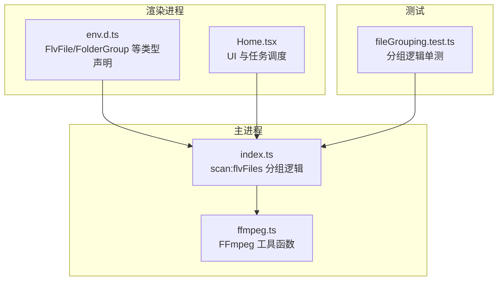
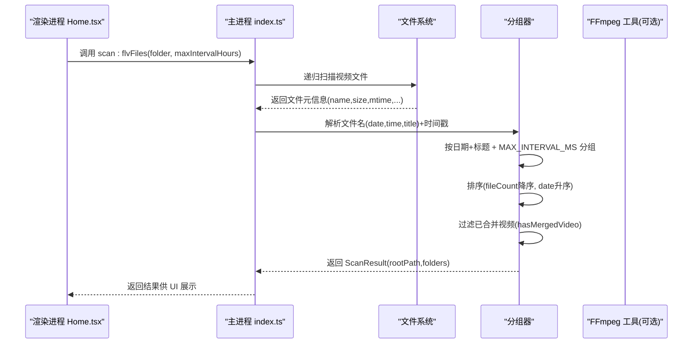
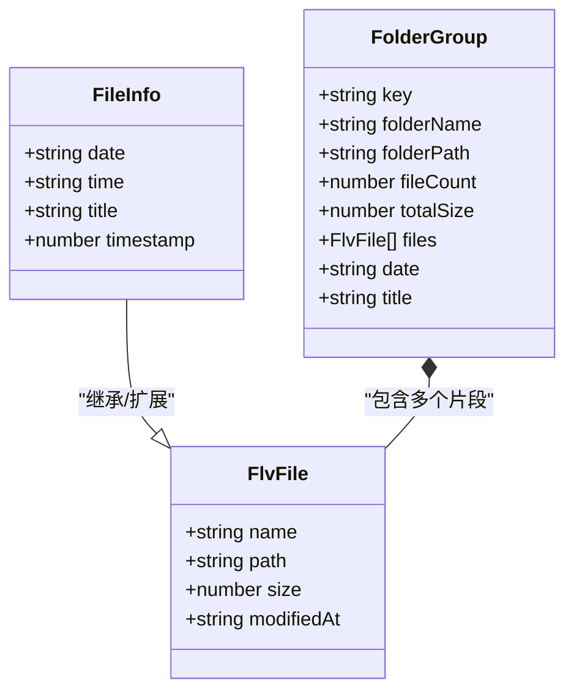
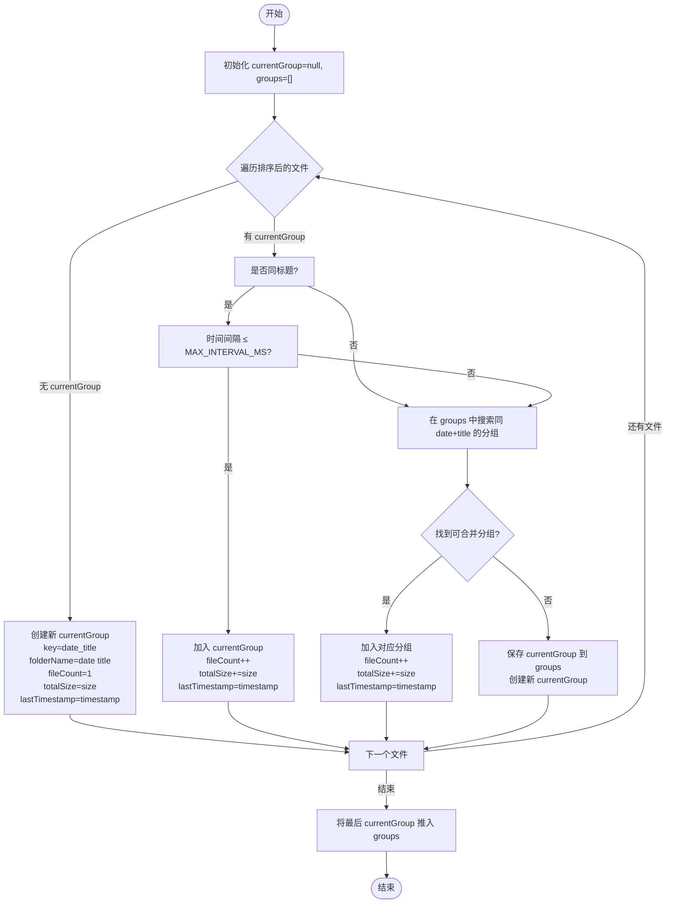
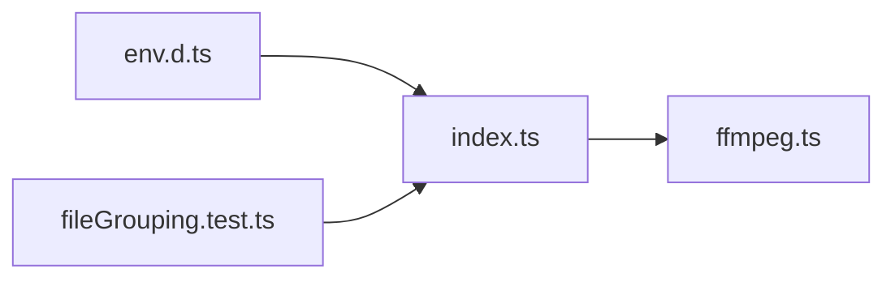

# 智能分组核心算法

<cite>
**本文引用的文件列表**
- [src/main/index.ts](file://src/main/index.ts)
- [src/main/ffmpeg.ts](file://src/main/ffmpeg.ts)
- [src/renderer/src/env.d.ts](file://src/renderer/src/env.d.ts)
- [tests/fileGrouping.test.ts](file://tests/fileGrouping.test.ts)
- [deliverables/software-company/视频合并app-增量设计-class.mermaid](file://deliverables/software-company/视频合并app-增量设计-class.mermaid)
</cite>

## 目录
1. [引言](#引言)
2. [项目结构](#项目结构)
3. [核心组件](#核心组件)
4. [架构总览](#架构总览)
5. [详细组件分析](#详细组件分析)
6. [依赖关系分析](#依赖关系分析)
7. [性能考量](#性能考量)
8. [故障排查指南](#故障排查指南)
9. [结论](#结论)
10. [附录](#附录)

## 引言
本文件聚焦“智能分组核心算法”，围绕基于“日期+标题”的匹配规则、时间间隔阈值判断与计算，深入解析 FlvFile 与 Group 数据结构的设计与使用，包括 key 生成策略、folderName 格式化、fileCount 统计与 totalSize 累加逻辑。同时说明分组合并算法（当前分组检查、已有分组搜索、新建分组决策）、排序策略（按文件大小降序、按日期排序）的实现细节，以及批量处理时的去重逻辑、已合并视频检测算法和性能优化技巧。文末提供完整的分组流程图与边界情况处理示例，帮助读者快速理解并正确扩展该算法。

## 项目结构
本项目为 Electron 桌面应用，主进程负责文件系统扫描、分组与 FFmpeg 调用；渲染进程负责 UI 交互与进度展示。智能分组的核心实现位于主进程的扫描 IPC 处理器中，配合类型定义与测试用例共同构成完整闭环。

图表来源
- [src/main/index.ts:145-345](file://src/main/index.ts#L145-L345)
- [src/main/ffmpeg.ts:1-305](file://src/main/ffmpeg.ts#L1-L305)
- [src/renderer/src/env.d.ts:42-65](file://src/renderer/src/env.d.ts#L42-L65)
- [tests/fileGrouping.test.ts:1-170](file://tests/fileGrouping.test.ts#L1-L170)

章节来源
- [src/main/index.ts:145-345](file://src/main/index.ts#L145-L345)
- [src/renderer/src/env.d.ts:42-65](file://src/renderer/src/env.d.ts#L42-L65)

## 核心组件
本节从数据模型与关键流程两个维度展开：
- 数据模型：FlvFile、FileInfo、FolderGroup（Group）
- 关键流程：文件名解析、时间戳计算、分组判定、排序与过滤

章节来源
- [src/main/index.ts:145-345](file://src/main/index.ts#L145-L345)
- [src/renderer/src/env.d.ts:42-65](file://src/renderer/src/env.d.ts#L42-L65)

## 架构总览
下图展示了从扫描到分组再到输出结果的端到端流程，包含关键的数据结构与决策点。

图表来源
- [src/main/index.ts:145-345](file://src/main/index.ts#L145-L345)
- [src/main/ffmpeg.ts:1-305](file://src/main/ffmpeg.ts#L1-L305)

## 详细组件分析

### 数据模型设计
- FlvFile：基础文件信息，包含 name、path、size、modifiedAt。用于在分组内记录每个片段的基本属性。
- FileInfo：在 FlvFile 基础上增加 date、time、title、timestamp，便于按日期与标题进行分组与时间间隔判断。
- FolderGroup（Group）：一个直播分组的聚合体，包含 key、folderName、folderPath、fileCount、totalSize、files、date、title 等字段，用于最终输出给 UI 或后续合并流程。

图表来源
- [src/renderer/src/env.d.ts:42-65](file://src/renderer/src/env.d.ts#L42-L65)
- [deliverables/software-company/视频合并app-增量设计-class.mermaid:11-32](file://deliverables/software-company/视频合并app-增量设计-class.mermaid#L11-L32)

章节来源
- [src/renderer/src/env.d.ts:42-65](file://src/renderer/src/env.d.ts#L42-L65)
- [src/main/index.ts:145-228](file://src/main/index.ts#L145-L228)

### 文件名解析与时间戳计算
- 文件名格式约定：YYYY-MM-DD HH:mm:ss-SSS 标题（例如 “2024-01-01 12-00-00-000 英雄联盟直播”）。
- 解析步骤：
  - 去除视频扩展名（支持 .flv/.m4s/.ts/.blv）。
  - 正则匹配日期、时间、标题三部分。
  - 若无法匹配，则回退为“未知日期/未知时间/未命名”。
- 时间戳计算：
  - 优先使用文件名中的时间部分构造 Date 对象并取毫秒时间戳。
  - 若时间部分不足，则回退到文件的 mtime。

章节来源
- [src/main/index.ts:164-179](file://src/main/index.ts#L164-L179)
- [src/main/index.ts:191-206](file://src/main/index.ts#L191-L206)

### 分组核心算法
- 阈值常量：MAX_INTERVAL_MS = maxIntervalHours × 60 × 60 × 1000。
- 遍历顺序：所有文件先按 timestamp 升序排序，保证时间有序。
- 决策流程：
  1) 当前分组检查：如果当前文件与 currentGroup 的 title 相同且时间间隔 ≤ MAX_INTERVAL_MS，则直接加入 currentGroup，更新 fileCount、totalSize、lastTimestamp。
  2) 已有分组搜索：若不满足当前分组条件，则在 groups 中查找是否存在同 date+title 的分组，且与 group.lastTimestamp 的时间间隔 ≤ MAX_INTERVAL_MS，若找到则并入该分组。
  3) 新建分组：若均未匹配，则将 currentGroup 保存到 groups，再创建新的 currentGroup。
  4) 收尾：遍历结束后，将最后一个 currentGroup 推入 groups。
- 关键指标维护：
  - key：由 date 与 title 拼接生成，作为唯一标识。
  - folderName：由 date 与 title 拼接，用于输出目录命名。
  - fileCount：每加入一个文件自增。
  - totalSize：每加入一个文件累加其 size。
  - lastTimestamp：每次加入后更新为当前文件的 timestamp。

图表来源
- [src/main/index.ts:245-305](file://src/main/index.ts#L245-L305)

章节来源
- [src/main/index.ts:243-305](file://src/main/index.ts#L243-L305)

### 排序策略
- 分组完成后，对 groups 进行排序：
  - 第一优先级：按 fileCount 降序（片段数量多的组排在前面）。
  - 第二优先级：按 date 升序（较早日期的组排在前面）。
- 目的：优先展示规模更大、更早的直播分组，提升用户操作效率。

章节来源
- [src/main/index.ts:307-307](file://src/main/index.ts#L307-L307)

### 已合并视频检测与过滤
- 检测逻辑 hasMergedVideo(dir, date, title)：
  - 递归扫描根目录及其子目录。
  - 仅考虑以 .mp4 结尾的文件。
  - 文件名需同时包含 date 与 title（不区分大小写），若存在则认为已合并。
- 过滤逻辑：
  - 对 groups 执行 filter，剔除已被标记为“已合并”的分组。
- 作用：避免重复合并同一场直播，减少冗余工作。

章节来源
- [src/main/index.ts:309-339](file://src/main/index.ts#L309-L339)

### 批量处理去重与并发控制
- 去重逻辑：
  - 通过 hasMergedVideo 在扫描阶段即完成“已合并”过滤，从而在批量任务构建前就消除重复项。
- 并发控制：
  - 批量合并接口支持 concurrency 参数，内部通过 Promise.all 启动多个 worker，每个 worker 从任务队列中取出任务执行，避免过多并发导致系统资源耗尽。
- 进度跟踪：
  - 使用 Map<taskId, progress> 存储各任务的实时进度，渲染进程轮询获取。

章节来源
- [src/main/index.ts:421-478](file://src/main/index.ts#L421-L478)

### 与 FFmpeg 的集成要点
- 合并策略：采用 concat demuxer + stream copy（-c copy），不重新编码，速度极快。
- 进度估算：
  - 优先尝试探测首个文件的时长与大小，推算总时长，结合 ffmpeg 输出的 time=HH:MM:SS 计算百分比。
  - 若无法探测，则回退为字节估算或固定上限（如 99.9%）。
- 超时保护：设置 30 分钟超时，防止长时间阻塞。
- 锁定文件处理：合并前用 openSync 探测源文件是否被占用，自动跳过正在录制的片段并给出警告。

章节来源
- [src/main/ffmpeg.ts:87-245](file://src/main/ffmpeg.ts#L87-L245)

## 依赖关系分析
- 模块耦合：
  - index.ts 依赖 fs、path 进行文件扫描与路径处理，依赖 ffmpeg.ts 提供的合并与转换能力。
  - env.d.ts 为渲染进程提供类型契约，确保前后端数据结构一致。
- 外部依赖：
  - fluent-ffmpeg 与 @ffmpeg-installer/ffmpeg 用于调用 FFmpeg 子进程。
- 潜在循环依赖：
  - 当前代码未发现循环依赖，main 与 renderer 通过 IPC 解耦。

图表来源
- [src/main/index.ts:1-10](file://src/main/index.ts#L1-L10)
- [src/main/ffmpeg.ts:1-10](file://src/main/ffmpeg.ts#L1-L10)
- [src/renderer/src/env.d.ts:1-28](file://src/renderer/src/env.d.ts#L1-L28)
- [tests/fileGrouping.test.ts:1-10](file://tests/fileGrouping.test.ts#L1-L10)

章节来源
- [src/main/index.ts:1-10](file://src/main/index.ts#L1-L10)
- [src/main/ffmpeg.ts:1-10](file://src/main/ffmpeg.ts#L1-L10)
- [src/renderer/src/env.d.ts:1-28](file://src/renderer/src/env.d.ts#L1-L28)
- [tests/fileGrouping.test.ts:1-10](file://tests/fileGrouping.test.ts#L1-L10)

## 性能考量
- 扫描阶段：
  - 当前实现使用同步递归 readdirSync，在大目录场景可能阻塞主进程事件循环。建议异步化以提升响应性。
- 分组阶段：
  - 单次遍历 O(n)，并在需要时线性搜索 groups（O(g)），总体复杂度 O(n·g)。当 g 较小时影响有限；可通过哈希索引优化（见下节建议）。
- 合并阶段：
  - 使用 concat demuxer + stream copy，避免重编码，性能优异。
  - 进度估算在 VBR 场景可能失准，建议改为真实分段时长求和。
- 并发控制：
  - 合理设置 concurrency，避免过多并行导致 I/O 争用。

[本节为通用性能讨论，不直接分析具体文件]

## 故障排查指南
- 常见错误与定位：
  - 扫描失败：检查文件夹路径合法性与权限，确认递归扫描是否抛出异常。
  - 合并失败：查看 FFmpeg 子进程 stderr 日志，关注 exit code 与最近若干行输出。
  - 进度停滞：确认 totalDuration 是否为 0（探针失败），必要时回退字节估算或提示用户。
  - 已合并重复：确认 hasMergedVideo 是否正确识别 .mp4 文件名中包含 date 与 title。
- 调试建议：
  - 打印 MAX_INTERVAL_MS 与 lastTimestamp 差值，验证阈值判断是否符合预期。
  - 在分组前后输出 fileCount 与 totalSize，校验统计是否正确。
  - 对于批量任务，检查 batchMergeProgress 映射中 taskId 对应的进度状态。

章节来源
- [src/main/ffmpeg.ts:193-245](file://src/main/ffmpeg.ts#L193-L245)
- [src/main/index.ts:309-339](file://src/main/index.ts#L309-L339)

## 结论
智能分组算法以“日期+标题”为核心匹配键，辅以时间间隔阈值判断，实现了多片段直播的自动归并与去重。数据结构清晰、流程明确，具备较好的可扩展性与可维护性。建议在以下方面持续优化：
- 扫描异步化，避免大目录卡顿。
- 分组阶段引入哈希索引，降低线性搜索成本。
- 合并进度改用真实分段时长求和，提高准确性。
- 安全加固与类型严格化，提升整体工程质量。

[本节为总结性内容，不直接分析具体文件]

## 附录

### 边界情况处理示例
- 空文件列表：返回空分组数组。
- 单个文件：创建一个分组，fileCount=1，totalSize=该文件大小。
- 不同标题：即使时间相近也分为不同组。
- 时间间隔超过阈值：相同标题但间隔大于 MAX_INTERVAL_MS 时分为两组。
- 自定义阈值：maxIntervalHours 可调，影响 MAX_INTERVAL_MS 的计算。
- 混合交错：多场直播交错时，仍能按日期+标题与间隔正确分组。

章节来源
- [tests/fileGrouping.test.ts:83-169](file://tests/fileGrouping.test.ts#L83-L169)

### 关键实现路径参考
- 分组核心逻辑入口：
  - [src/main/index.ts:145-345](file://src/main/index.ts#L145-L345)
- 类型定义（FlvFile/FolderGroup）：
  - [src/renderer/src/env.d.ts:42-65](file://src/renderer/src/env.d.ts#L42-L65)
- 类图参考：
  - [deliverables/software-company/视频合并app-增量设计-class.mermaid:11-32](file://deliverables/software-company/视频合并app-增量设计-class.mermaid#L11-L32)
- 合并与进度（FFmpeg 集成）：
  - [src/main/ffmpeg.ts:87-245](file://src/main/ffmpeg.ts#L87-L245)