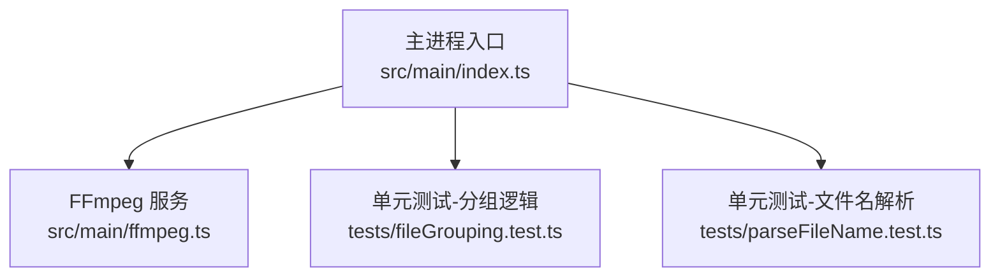
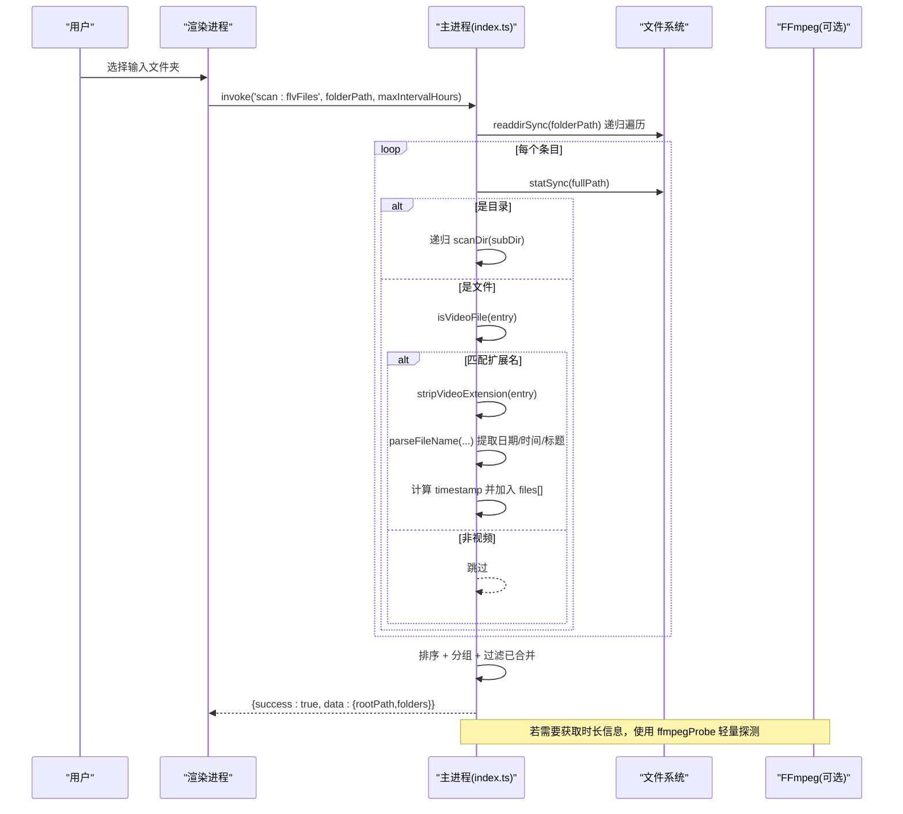
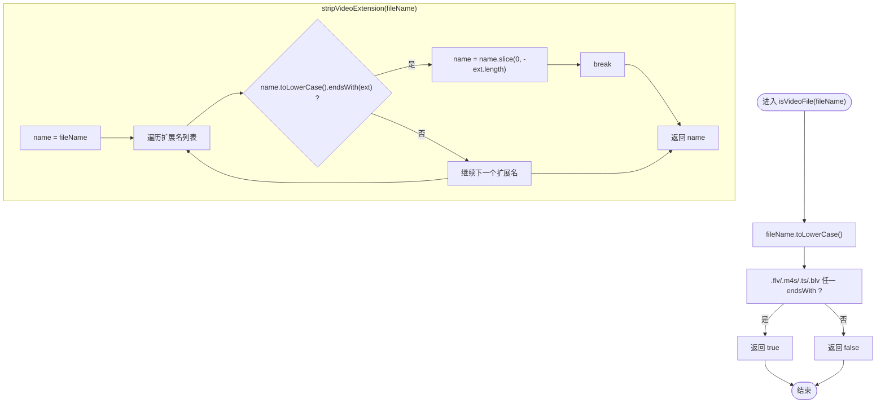
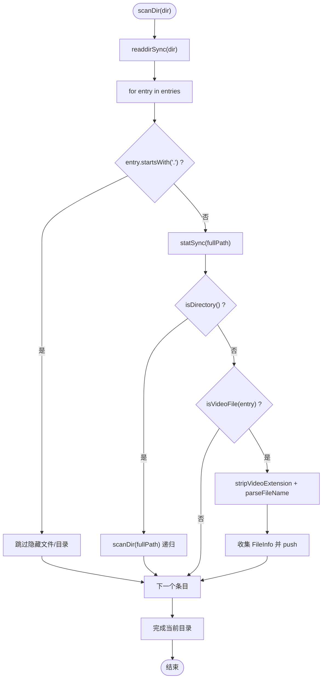
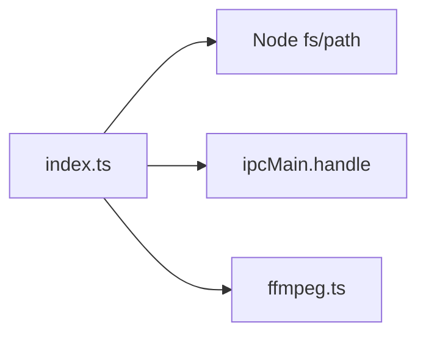

# 视频文件识别算法

<cite>
**本文引用的文件**   
- [src/main/index.ts](file://src/main/index.ts)
- [src/main/ffmpeg.ts](file://src/main/ffmpeg.ts)
- [tests/fileGrouping.test.ts](file://tests/fileGrouping.test.ts)
- [tests/parseFileName.test.ts](file://tests/parseFileName.test.ts)
</cite>

## 目录
1. [简介](#简介)
2. [项目结构](#项目结构)
3. [核心组件](#核心组件)
4. [架构总览](#架构总览)
5. [详细组件分析](#详细组件分析)
6. [依赖关系分析](#依赖关系分析)
7. [性能考量](#性能考量)
8. [故障排查指南](#故障排查指南)
9. [结论](#结论)
10. [附录：示例与边界情况](#附录示例与边界情况)

## 简介
本文件围绕“视频文件识别算法”展开，重点解析以下能力：
- isVideoFile 函数：判断文件名是否属于支持的视频扩展名集合（大小写不敏感）
- stripVideoExtension 函数：剥离视频扩展名，用于后续按日期+标题分组
- 支持的扩展名列表：.flv、.m4s、.ts、.blv
- 文件过滤策略与递归目录遍历实现细节
- 错误处理机制、隐藏文件跳过逻辑与文件系统访问异常处理
- 性能优化技巧与可改进点
- 实际代码示例路径与边界情况处理说明

## 项目结构
本项目为 Electron 应用，主进程负责文件系统扫描、FFmpeg 调用与 IPC 通信；渲染进程提供 UI。与视频识别相关的关键逻辑集中在主进程入口文件中，同时通过测试用例覆盖关键分支。

图表来源
- [src/main/index.ts:126-143](file://src/main/index.ts#L126-L143)
- [src/main/ffmpeg.ts:1-305](file://src/main/ffmpeg.ts#L1-305)
- [tests/fileGrouping.test.ts:1-170](file://tests/fileGrouping.test.ts#L1-L170)
- [tests/parseFileName.test.ts:1-77](file://tests/parseFileName.test.ts#L1-L77)

章节来源
- [src/main/index.ts:126-143](file://src/main/index.ts#L126-L143)
- [src/main/ffmpeg.ts:1-305](file://src/main/ffmpeg.ts#L1-305)
- [tests/fileGrouping.test.ts:1-170](file://tests/fileGrouping.test.ts#L1-L170)
- [tests/parseFileName.test.ts:1-77](file://tests/parseFileName.test.ts#L1-L77)

## 核心组件
- 视频扩展名常量与识别函数
  - VIDEO_EXTENSIONS：定义支持的视频扩展名集合
  - isVideoFile：基于小写后缀匹配进行快速判定
  - stripVideoExtension：去除已识别的扩展名，返回纯名称部分
- 扫描与分组
  - scan:flvFiles：递归扫描目录、过滤视频文件、解析文件名、按时间间隔分组、过滤已合并结果
- FFmpeg 辅助
  - ffmpegProbe：轻量探测视频时长等元信息，避免全文件解析
  - mergeVideos / convertToMp4：合并与转码流程（与识别间接相关）

章节来源
- [src/main/index.ts:126-143](file://src/main/index.ts#L126-L143)
- [src/main/index.ts:145-345](file://src/main/index.ts#L145-L345)
- [src/main/ffmpeg.ts:12-77](file://src/main/ffmpeg.ts#L12-L77)

## 架构总览
下图展示了从用户选择输入目录到识别并分组视频文件的整体流程，以及识别函数的作用位置。

图表来源
- [src/main/index.ts:145-345](file://src/main/index.ts#L145-L345)
- [src/main/ffmpeg.ts:12-77](file://src/main/ffmpeg.ts#L12-L77)

## 详细组件分析

### 1) isVideoFile 与 stripVideoExtension
- 支持的扩展名列表：.flv、.m4s、.ts、.blv
- 大小写不敏感处理：统一转换为小写后再做 endsWith 匹配
- 剥离扩展名：按顺序尝试匹配扩展名，命中后截取前缀并返回

图表来源
- [src/main/index.ts:126-143](file://src/main/index.ts#L126-L143)

章节来源
- [src/main/index.ts:126-143](file://src/main/index.ts#L126-L143)

### 2) 文件过滤策略与递归目录遍历
- 过滤策略
  - 仅保留以 .flv/.m4s/.ts/.blv 结尾的文件（大小写不敏感）
  - 忽略隐藏文件：跳过以 “.” 开头的条目
- 递归遍历
  - 使用同步递归 scanDir(dir) 遍历子目录
  - 对每个文件执行 isVideoFile 判定，再解析文件名并收集元数据
- 分组与去重
  - 按日期+标题+时间间隔阈值分组
  - 过滤已合并的 MP4 输出（含大小写不敏感匹配）

图表来源
- [src/main/index.ts:181-212](file://src/main/index.ts#L181-L212)
- [src/main/index.ts:126-143](file://src/main/index.ts#L126-L143)

章节来源
- [src/main/index.ts:181-212](file://src/main/index.ts#L181-L212)
- [src/main/index.ts:126-143](file://src/main/index.ts#L126-L143)

### 3) 错误处理与异常防护
- 扫描阶段
  - 对 statSync 或无法访问的条目使用 try/catch 捕获并跳过
- 已合并检测
  - hasMergedVideo 内部对 readdirSync/statSync 均包裹 try/catch，遇到不存在或不可访问目录时安全返回
- 顶层异常
  - scan:flvFiles 外层 try/catch 将异常包装为 {success:false,message} 返回

章节来源
- [src/main/index.ts:208-211](file://src/main/index.ts#L208-L211)
- [src/main/index.ts:309-335](file://src/main/index.ts#L309-L335)
- [src/main/index.ts:342-344](file://src/main/index.ts#L342-L344)

### 4) 性能特性与优化建议
- 当前实现
  - 使用同步递归 readdirSync/statSync，在大目录场景可能阻塞主进程事件循环
- 优化方向
  - 改为异步 fs.promises.readdir 递归，或使用 worker 线程并行扫描
  - 预构建扩展名集合为 Set 提升匹配效率（当前 some 遍历开销较小，但可扩展）
  - 对大目录采用惰性读取与分批处理，降低内存峰值

章节来源
- [src/main/index.ts:181-212](file://src/main/index.ts#L181-L212)

### 5) 与 FFmpeg 的协作（轻量探测）
- ffmpegProbe 仅读取文件头，命中 Duration 即终止，毫秒级完成
- 在需要估算进度或时长时使用，避免全文件解析带来的性能损耗

章节来源
- [src/main/ffmpeg.ts:12-58](file://src/main/ffmpeg.ts#L12-L58)

## 依赖关系分析
- index.ts 依赖 Node.js 内置 fs/path 模块进行文件系统操作
- index.ts 通过 ipcMain.handle 暴露 scan:flvFiles 接口给渲染进程
- ffmpeg.ts 提供 getVideoInfo/mergeVideos/convertToMp4 等能力，供主进程在其他功能中使用

图表来源
- [src/main/index.ts:1-6](file://src/main/index.ts#L1-L6)
- [src/main/ffmpeg.ts:1-11](file://src/main/ffmpeg.ts#L1-L11)

章节来源
- [src/main/index.ts:1-6](file://src/main/index.ts#L1-L6)
- [src/main/ffmpeg.ts:1-11](file://src/main/ffmpeg.ts#L1-L11)

## 性能考量
- 同步 IO 风险：大目录扫描会阻塞主进程，建议在 PRD 要求下评估迁移至异步方案
- 扩展名匹配：some 遍历开销低，但若未来扩展名增多，可考虑 Set 或正则一次性匹配
- 已合并检测：hasMergedVideo 同样使用同步递归，存在相同阻塞风险，建议异步化

[本节为通用指导，不直接分析具体文件]

## 故障排查指南
- 扫描失败
  - 检查输入路径是否存在且可读
  - 查看返回的 message 字段定位具体错误
- 无法访问文件或目录
  - 确认权限与占用情况（如录制中文件被锁定）
  - 程序已对异常进行 try/catch 保护，不会中断整体扫描
- 未识别到视频
  - 确认扩展名是否为 .flv/.m4s/.ts/.blv（大小写均可）
  - 检查文件名是否包含隐藏前缀 “.”

章节来源
- [src/main/index.ts:342-344](file://src/main/index.ts#L342-L344)
- [src/main/index.ts:208-211](file://src/main/index.ts#L208-L211)
- [src/main/index.ts:181-212](file://src/main/index.ts#L181-L212)

## 结论
- isVideoFile 与 stripVideoExtension 实现了简洁高效的视频识别与扩展名剥离
- 支持 .flv/.m4s/.ts/.blv 四种扩展名，大小写不敏感
- 扫描逻辑具备基础健壮性（隐藏文件跳过、异常捕获），但在大规模目录场景下需关注同步 IO 的性能影响
- 与 FFmpeg 的轻量探测配合，可在需要时高效获取时长等元信息

[本节为总结性内容，不直接分析具体文件]

## 附录：示例与边界情况

### 示例一：完整识别流程（路径参考）
- 选择输入目录 -> 触发 scan:flvFiles -> 递归扫描 -> 过滤视频 -> 解析文件名 -> 分组 -> 过滤已合并 -> 返回结果
- 参考路径
  - [src/main/index.ts:145-345](file://src/main/index.ts#L145-L345)

### 示例二：大小写不敏感匹配（路径参考）
- 文件名 “Test.FLV”、“video.M4S” 等均能被正确识别
- 参考路径
  - [src/main/index.ts:126-143](file://src/main/index.ts#L126-L143)

### 示例三：隐藏文件跳过（路径参考）
- 以 “.” 开头的条目会被跳过，避免系统隐藏文件干扰
- 参考路径
  - [src/main/index.ts:181-212](file://src/main/index.ts#L181-L212)

### 示例四：已合并视频过滤（路径参考）
- 若目标目录下已存在同名日期的 MP4 输出，则对应分组将被过滤掉
- 参考路径
  - [src/main/index.ts:309-339](file://src/main/index.ts#L309-L339)

### 边界情况清单（路径参考）
- 空目录：返回空分组
- 无扩展名或非视频扩展名：被过滤
- 非标准命名：解析回退为“未知日期/未知时间”，标题取剩余部分
- 中文文件名：正常识别与解析
- 正在录制的片段：在合并阶段会被探测并跳过（与识别间接相关）
- 参考路径
  - [tests/parseFileName.test.ts:25-76](file://tests/parseFileName.test.ts#L25-L76)
  - [tests/fileGrouping.test.ts:83-169](file://tests/fileGrouping.test.ts#L83-L169)
  - [src/main/ffmpeg.ts:98-117](file://src/main/ffmpeg.ts#L98-L117)