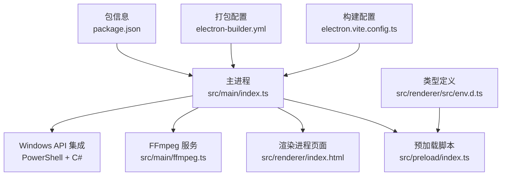
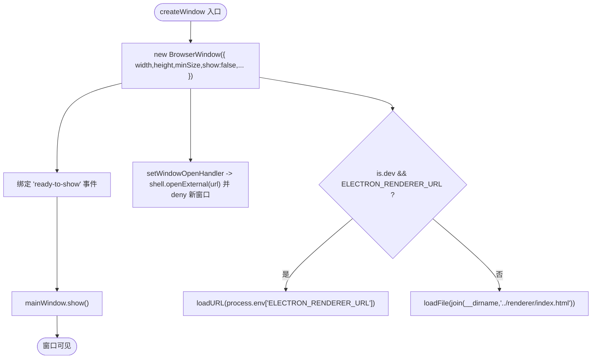
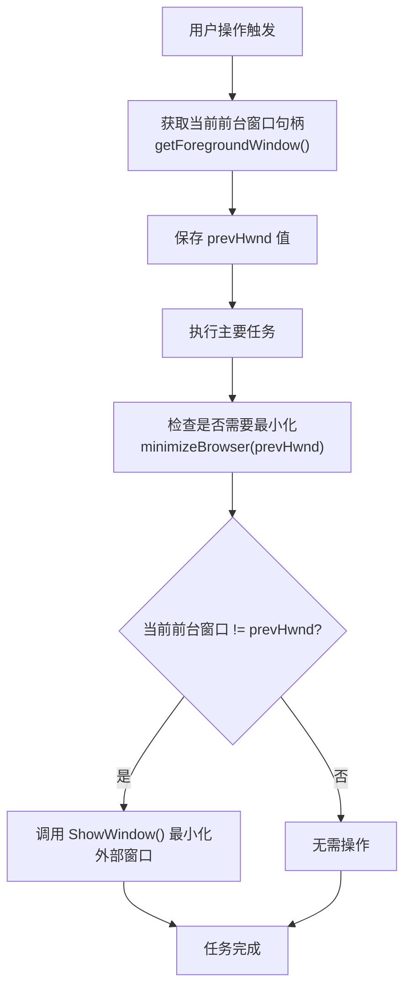
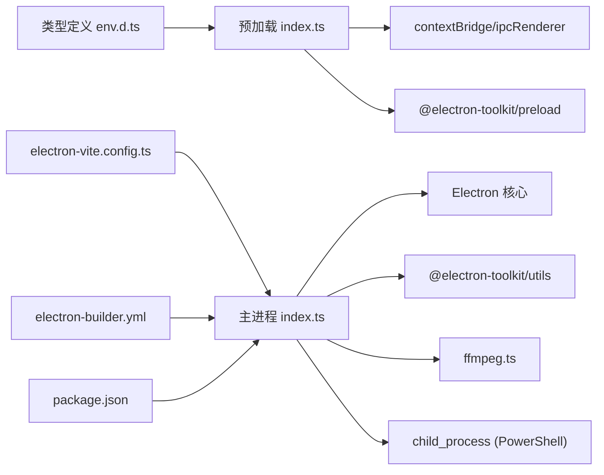

# 窗口生命周期管理

<cite>
**本文引用的文件**   
- [src/main/index.ts](file://src/main/index.ts)
- [src/preload/index.ts](file://src/preload/index.ts)
- [src/renderer/src/env.d.ts](file://src/renderer/src/env.d.ts)
- [package.json](file://package.json)
- [electron.vite.config.ts](file://electron.vite.config.ts)
- [electron-builder.yml](file://electron-builder.yml)
- [deliverables/software-company/视频合并app-增量设计-sequence.mermaid](file://deliverables/software-company/视频合并app-增量设计-sequence.mermaid)
</cite>

## 更新摘要
**所做更改**   
- 新增智能浏览器窗口管理功能章节，详细说明 getForegroundWindow() 和 minimizeBrowser(prevHwnd) 函数
- 更新 IPC 通信机制，添加浏览器窗口焦点检测和控制接口
- 增强跨平台兼容性说明，特别关注 Windows 平台的 Win32 API 集成
- 更新预加载脚本和类型定义，包含新的浏览器管理 API

## 目录
1. [简介](#简介)
2. [项目结构](#项目结构)
3. [核心组件](#核心组件)
4. [架构总览](#架构总览)
5. [详细组件分析](#详细组件分析)
6. [依赖关系分析](#依赖关系分析)
7. [性能考量](#性能考量)
8. [故障排查指南](#故障排查指南)
9. [结论](#结论)
10. [附录](#附录)

## 简介
本文件聚焦于 Electron 应用的窗口生命周期管理，围绕 BrowserWindow 的创建与配置、显示策略与安全设置展开，系统梳理应用启动流程（app.whenReady() 事件处理、窗口创建时机、开发/生产环境差异）、窗口事件监听机制（ready-to-show、browser-window-created、activate、window-all-closed），并说明外部链接打开的安全控制、菜单配置与快捷键支持。**最新更新**：新增了智能浏览器窗口管理功能，通过 PowerShell 脚本与 C# 代码集成 Win32 API，实现前台窗口检测和自动最小化外部浏览器的能力。同时给出多窗口管理策略、窗口状态持久化建议与跨平台兼容性注意事项，帮助开发者掌握 Electron 标准启动模式与窗口管理最佳实践。

## 项目结构
本项目采用 Electron + Vite 的多进程架构：
- 主进程入口位于 src/main/index.ts，负责应用生命周期、窗口创建、IPC 路由与系统集成。
- 预加载脚本位于 src/preload/index.ts，通过 contextBridge 暴露安全 API 给渲染进程。
- 渲染进程类型定义位于 src/renderer/src/env.d.ts，提供 TypeScript 类型支持。
- 构建与打包由 electron-vite 与 electron-builder 协同完成，配置文件见 electron.vite.config.ts 与 electron-builder.yml。
- 包元信息与脚本定义在 package.json。



**图表来源**
- [src/main/index.ts:1-10](file://src/main/index.ts#L1-L10)
- [src/preload/index.ts:1-10](file://src/preload/index.ts#L1-L10)
- [src/renderer/src/env.d.ts:1-10](file://src/renderer/src/env.d.ts#L1-L10)
- [electron.vite.config.ts:1-21](file://electron.vite.config.ts#L1-L21)
- [electron-builder.yml:1-26](file://electron-builder.yml#L1-L26)
- [package.json:1-20](file://package.json#L1-L20)

**章节来源**
- [src/main/index.ts:1-10](file://src/main/index.ts#L1-L10)
- [src/preload/index.ts:1-10](file://src/preload/index.ts#L1-L10)
- [src/renderer/src/env.d.ts:1-10](file://src/renderer/src/env.d.ts#L1-L10)
- [electron.vite.config.ts:1-21](file://electron.vite.config.ts#L1-L21)
- [electron-builder.yml:1-26](file://electron-builder.yml#L1-L26)
- [package.json:1-20](file://package.json#L1-L20)

## 核心组件
- 主进程入口与窗口管理：负责 app 生命周期、BrowserWindow 创建、事件监听、外部链接拦截、菜单与快捷键初始化。
- **新增**：智能浏览器窗口管理：通过 PowerShell 脚本调用 C# 代码，使用 Win32 GetForegroundWindow() 和 ShowWindow() API 实现前台窗口检测和最小化功能。
- 预加载桥接：统一封装 IPC 调用，返回标准化结果并在失败时抛出错误，简化渲染端使用。
- 构建与打包：提供开发与预览入口、资源打包与平台目标配置。

**章节来源**
- [src/main/index.ts:67-97](file://src/main/index.ts#L67-97)
- [src/main/index.ts:87-127](file://src/main/index.ts#L87-L127)
- [src/preload/index.ts:20-49](file://src/preload/index.ts#L20-49)
- [package.json:8-16](file://package.json#L8-L16)
- [electron.vite.config.ts:5-20](file://electron.vite.config.ts#L5-L20)

## 架构总览
下图展示从应用启动到窗口就绪的关键时序，包括 whenReady、浏览器窗口创建、快捷键注册、首次显示以及激活与关闭行为。**新增**：智能浏览器窗口管理流程，包括前台窗口检测和自动最小化逻辑。

```mermaid
sequenceDiagram
participant App as "Electron 应用"
participant Main as "主进程 index.ts"
participant Win as "BrowserWindow"
participant Menu as "Menu"
participant Opt as "optimizer(快捷键)"
participant WinAPI as "Win32 API (PowerShell+C#)"
App->>Main : app.whenReady()
Main->>Menu : setApplicationMenu(null)
Main->>App : setAppUserModelId(...)
App->>Main : browser-window-created(_, window)
Main->>Opt : watchWindowShortcuts(window)
Main->>Win : createWindow()
Win-->>Main : ready-to-show
Main->>Win : show()
App->>Main : activate
Main->>Main : getAllWindows().length === 0 ? createWindow() : 忽略
App->>Main : window-all-closed
alt 非 macOS
Main->>App : quit()
else macOS
Main-->>App : 保持运行
end
Note over WinAPI : 智能窗口管理
Main->>WinAPI : getForegroundWindow()
WinAPI-->>Main : 当前前台窗口句柄
Main->>WinAPI : minimizeBrowser(prevHwnd)
WinAPI-->>Main : 最小化外部浏览器
```

**图表来源**
- [src/main/index.ts:505-529](file://src/main/index.ts#L505-L529)
- [src/main/index.ts:69-97](file://src/main/index.ts#L69-97)
- [src/main/index.ts:87-127](file://src/main/index.ts#L87-L127)

**章节来源**
- [src/main/index.ts:505-529](file://src/main/index.ts#L505-L529)
- [src/main/index.ts:69-97](file://src/main/index.ts#L69-97)
- [src/main/index.ts:87-127](file://src/main/index.ts#L87-L127)

## 详细组件分析

### 窗口创建与显示策略
- 窗口实例：在主进程中维护一个全局 mainWindow 引用，便于后续管理与复用。
- 创建参数：设置初始宽高、最小尺寸、标题；webPreferences 中指定 preload 路径，sandbox 当前为 false（设计文档提出可迁移至 true）。
- 显示策略：默认 show: false，等待 ready-to-show 后再显式 show，避免白屏闪烁。
- 资源加载：开发环境优先 loadURL(ELECTRON_RENDERER_URL)，生产环境 loadFile(renderer/index.html)。



**图表来源**
- [src/main/index.ts:69-97](file://src/main/index.ts#L69-97)

**章节来源**
- [src/main/index.ts:69-97](file://src/main/index.ts#L69-97)

### 智能浏览器窗口管理功能
**新增功能**：系统实现了智能的浏览器窗口管理能力，专门用于处理外部浏览器窗口抢焦点的问题。

#### 前台窗口检测
- **getForegroundWindow()**：获取当前系统前台窗口的句柄
- 实现方式：通过 PowerShell 脚本嵌入 C# 代码，调用 Win32 GetForegroundWindow() API
- 返回值：返回前台窗口的整数句柄值，非 Windows 平台返回 0
- 错误处理：如果执行失败或无法获取句柄，返回 0

#### 外部浏览器最小化
- **minimizeBrowser(prevHwnd)**：智能最小化抢焦点的外部浏览器窗口
- 实现逻辑：
  - 延迟 2 秒后再次检查前台窗口
  - 比较当前前台窗口句柄与之前保存的句柄
  - 如果句柄不同且不为 0，则调用 ShowWindow() API 最小化该窗口
- 平台限制：仅在 Windows 平台生效，其他平台直接返回
- 安全性：使用 try-catch 包裹所有操作，确保异常不会影响主程序

#### IPC 接口暴露
- **browser:getForegroundWindow**：获取前台窗口句柄的 IPC 通道
- **browser:minimize**：最小化外部浏览器的 IPC 通道
- 预加载脚本暴露：通过 api.getForegroundWindow() 和 api.minimizeBrowser() 方法



**图表来源**
- [src/main/index.ts:87-127](file://src/main/index.ts#L87-L127)
- [src/preload/index.ts:54-56](file://src/preload/index.ts#L54-L56)

**章节来源**
- [src/main/index.ts:87-127](file://src/main/index.ts#L87-L127)
- [src/preload/index.ts:54-56](file://src/preload/index.ts#L54-L56)
- [src/renderer/src/env.d.ts:30-32](file://src/renderer/src/env.d.ts#L30-L32)

### 应用启动流程与环境差异
- 启动钩子：app.whenReady() 后执行初始化逻辑。
- 菜单与模型 ID：移除默认菜单栏，设置应用用户模型 ID（Windows 任务栏分组等）。
- 快捷键：监听 browser-window-created，对每个新建窗口调用 optimizer.watchWindowShortcuts 以启用内置快捷键（如 F5 刷新、Ctrl+R 刷新、Alt+F4 退出等）。
- 激活行为：macOS 下当所有窗口关闭后再次点击 Dock 图标会触发 activate，若没有窗口则重新创建。
- 关闭行为：在非 macOS 平台，window-all-closed 时退出应用；macOS 保持运行以支持 Dock 图标与多窗口。

**章节来源**
- [src/main/index.ts:505-529](file://src/main/index.ts#L505-529)

### 外部链接打开的安全控制
- 拦截策略：通过 webContents.setWindowOpenHandler 拦截所有新窗口请求，统一交由 shell.openExternal 在系统浏览器中打开，并返回 deny 阻止内部创建新窗口。
- 优势：防止恶意页面在应用内打开任意 URL，降低 XSS 与导航劫持风险。

**章节来源**
- [src/main/index.ts:87-90](file://src/main/index.ts#L87-L90)

### 菜单配置与快捷键支持
- 菜单：应用启动时通过 Menu.setApplicationMenu(null) 移除默认菜单，适合工具类应用减少干扰。
- 快捷键：借助 @electron-toolkit/utils 的 optimizer.watchWindowShortcuts 自动为窗口注入常用快捷键，无需手动注册。

**章节来源**
- [src/main/index.ts:507-514](file://src/main/index.ts#L507-L514)

### 窗口事件监听机制
- ready-to-show：用于延迟显示窗口，确保渲染内容准备完毕再呈现。
- browser-window-created：为新创建的窗口注册快捷键。
- activate：macOS 下的应用激活事件，保证无窗口时能重建主窗口。
- window-all-closed：跨平台差异化退出逻辑。

**章节来源**
- [src/main/index.ts:83-85](file://src/main/index.ts#L83-85)
- [src/main/index.ts:512-514](file://src/main/index.ts#L512-L514)
- [src/main/index.ts:518-522](file://src/main/index.ts#L518-L522)
- [src/main/index.ts:525-529](file://src/main/index.ts#L525-L529)

### 预加载桥接与 IPC 调用规范
- 统一封装：preload 中的 invokeApi 将 ipcRenderer.invoke 的结果解包，成功返回 data，失败抛错，简化渲染端调用。
- 暴露接口：通过 contextBridge.exposeInMainWorld 将 api 对象暴露给渲染进程，包含配置、文件夹选择、扫描、视频处理、进度查询等方法。
- **新增**：浏览器窗口管理 API：getForegroundWindow() 和 minimizeBrowser(prevHwnd) 方法。
- 类型声明：渲染端 env.d.ts 定义了 Window.api 的类型，提升 TypeScript 体验。

**章节来源**
- [src/preload/index.ts:9-18](file://src/preload/index.ts#L9-L18)
- [src/preload/index.ts:20-49](file://src/preload/index.ts#L20-L49)
- [src/preload/index.ts:54-56](file://src/preload/index.ts#L54-L56)
- [src/renderer/src/env.d.ts:30-32](file://src/renderer/src/env.d.ts#L30-L32)

### 多窗口管理策略
- 当前实现：单窗口模型，主窗口引用保存在 mainWindow，activate 时检查是否有窗口存在，若无则重建。
- 扩展建议：
  - 使用 Map 或数组管理多个窗口实例，按业务域分配窗口。
  - 为每个窗口设置唯一标识（如基于路由或任务 ID），便于 IPC 路由与状态同步。
  - 在 window-all-closed 中统计剩余窗口数，仅当全部关闭时才退出应用（macOS 除外）。
  - 利用 browser-window-created 集中注入快捷键、日志、崩溃上报等横切能力。

**章节来源**
- [src/main/index.ts:518-522](file://src/main/index.ts#L518-L522)
- [src/main/index.ts:525-529](file://src/main/index.ts#L525-L529)

### 窗口状态持久化与恢复
- 当前实现：未直接持久化窗口位置、大小、最大化状态等 UI 状态。
- 建议方案：
  - 在 close 事件中保存窗口 bounds（x,y,width,height,maximized）到 userData 目录的配置文件中。
  - 在 createWindow 前读取配置并应用，注意边界校验（如屏幕分辨率变化导致坐标越界）。
  - 针对多显示器场景，检测窗口所在屏幕并修正坐标。

**章节来源**
- [src/main/index.ts:30-65](file://src/main/index.ts#L30-L65)

### 跨平台兼容性考虑
- macOS：
  - 保留应用运行以支持 Dock 图标与多窗口。
  - 可通过 app.on('open-file'/'open-url') 处理系统级打开事件。
- Windows/Linux：
  - window-all-closed 时退出应用。
  - 任务栏图标与窗口分组由 app.setUserModelId 控制。
  - **新增**：智能浏览器窗口管理功能仅在 Windows 平台有效，其他平台会自动跳过相关操作。
- 通用：
  - 外部链接一律通过 shell.openExternal 打开，避免沙箱与 CSP 限制问题。
  - 快捷键由 optimizer.watchWindowShortcuts 统一管理，减少平台差异。

**章节来源**
- [src/main/index.ts:518-529](file://src/main/index.ts#L518-L529)
- [src/main/index.ts:510-514](file://src/main/index.ts#L510-L514)
- [src/main/index.ts:87-127](file://src/main/index.ts#L87-L127)

### 安全设置与沙箱迁移建议
- 当前设置：webPreferences.sandbox 为 false，preload 通过 contextBridge 暴露受限 API。
- 设计文档建议：将 sandbox 改为 true，并通过 spawn 在 main 进程执行 FFmpeg，符合沙箱约束；同时保留 CSP、IPC 白名单与收敛 electronAPI 作为最小安全基线。
- 迁移验证清单：
  - 窗口正常加载与显示。
  - contextBridge 注入成功，api 方法可用。
  - 关键 IPC 往返正常。
  - FFmpeg 子进程可正常启动并完成操作。
  - 控制台无沙箱相关阻断报错。

**章节来源**
- [src/main/index.ts:77-81](file://src/main/index.ts#L77-L81)
- [deliverables/software-company/视频合并app-增量设计-sequence.mermaid:1-106](file://deliverables/software-company/视频合并app-增量设计-sequence.mermaid#L1-L106)

### Windows 平台特定功能
**新增章节**：智能浏览器窗口管理功能深度解析

#### Win32 API 集成架构
- **技术栈**：Electron + PowerShell + C# + Win32 API
- **核心 API**：
  - `GetForegroundWindow()`：获取当前活动窗口句柄
  - `ShowWindow()`：控制窗口显示状态（参数 6 = SW_MINIMIZE）
- **执行流程**：
  1. 主进程通过 execFile 调用 PowerShell.exe
  2. PowerShell 动态编译 C# 代码
  3. C# 代码调用 user32.dll 中的 Win32 API
  4. 返回窗口句柄或执行窗口操作

#### 错误处理与健壮性
- 所有 Win32 API 调用都包裹在 try-catch 块中
- 执行失败时返回默认值（0 表示无前台窗口）
- 使用 windowsHide: true 隐藏 PowerShell 控制台窗口
- 异步执行不阻塞主线程

**章节来源**
- [src/main/index.ts:87-127](file://src/main/index.ts#L87-L127)

## 依赖关系分析
- 主进程依赖：
  - Electron 核心模块：app、shell、BrowserWindow、ipcMain、dialog、Menu。
  - 工具库：@electron-toolkit/utils（electronApp、optimizer、is）。
  - 业务模块：./ffmpeg（视频探测、合并、转换）。
  - **新增**：child_process.execFile（用于调用 PowerShell）。
- 预加载依赖：
  - electron 的 contextBridge 与 ipcRenderer。
  - @electron-toolkit/preload 提供的 electronAPI。
- 构建与打包：
  - electron-vite 负责开发与构建管线。
  - electron-builder 负责产物打包与平台目标。



**图表来源**
- [src/main/index.ts:1-6](file://src/main/index.ts#L1-L6)
- [src/preload/index.ts:1-3](file://src/preload/index.ts#L1-L3)
- [src/renderer/src/env.d.ts:1-10](file://src/renderer/src/env.d.ts#L1-L10)
- [electron.vite.config.ts:1-21](file://electron.vite.config.ts#L1-L21)
- [electron-builder.yml:1-26](file://electron-builder.yml#L1-L26)
- [package.json:1-20](file://package.json#L1-L20)

**章节来源**
- [src/main/index.ts:1-6](file://src/main/index.ts#L1-L6)
- [src/preload/index.ts:1-3](file://src/preload/index.ts#L1-L3)
- [src/renderer/src/env.d.ts:1-10](file://src/renderer/src/env.d.ts#L1-L10)
- [electron.vite.config.ts:1-21](file://electron.vite.config.ts#L1-L21)
- [electron-builder.yml:1-26](file://electron-builder.yml#L1-L26)
- [package.json:1-20](file://package.json#L1-L20)

## 性能考量
- 窗口显示优化：使用 ready-to-show 延迟显示，避免首帧白屏。
- 资源加载策略：开发环境使用内存热更新 URL，生产环境加载本地 HTML，减少网络开销。
- 外部链接：统一走系统浏览器，避免在主进程内创建额外窗口带来的资源消耗。
- 快捷键注册：集中式注册，避免重复监听与内存泄漏。
- **新增**：Win32 API 调用优化：
  - 异步执行避免阻塞主线程
  - 延迟 2 秒检查避免频繁调用
  - 条件判断减少不必要的窗口操作
  - 错误处理防止异常传播

## 故障排查指南
- 窗口无法显示：
  - 检查是否绑定了 ready-to-show 且正确调用 show。
  - 确认开发环境变量 ELECTRON_RENDERER_URL 是否存在。
- 外部链接未打开：
  - 确认 setWindowOpenHandler 已正确返回 deny 并调用 shell.openExternal。
- 快捷键无效：
  - 确认 browser-window-created 中调用了 optimizer.watchWindowShortcuts。
- 应用无法退出（Windows/Linux）：
  - 检查 window-all-closed 分支是否正确调用 app.quit。
- 沙箱模式下异常：
  - 参考设计文档中的迁移验证清单逐项核对。
- **新增**：智能窗口管理功能问题：
  - PowerShell 未安装或不可用：检查系统 PowerShell 版本
  - Win32 API 调用失败：确认运行在 Windows 平台
  - 浏览器未最小化：检查前台窗口句柄比较逻辑
  - 权限问题：确认应用程序有足够权限访问系统 API

**章节来源**
- [src/main/index.ts:83-90](file://src/main/index.ts#L83-L90)
- [src/main/index.ts:512-514](file://src/main/index.ts#L512-L514)
- [src/main/index.ts:525-529](file://src/main/index.ts#L525-L529)
- [src/main/index.ts:87-127](file://src/main/index.ts#L87-L127)
- [deliverables/software-company/视频合并app-增量设计-sequence.mermaid:1-106](file://deliverables/software-company/视频合并app-增量设计-sequence.mermaid#L1-L106)

## 结论
本项目遵循 Electron 的标准启动模式与窗口管理实践：在 whenReady 后创建窗口、通过 ready-to-show 控制显示、集中注册快捷键、统一拦截外部链接并交由系统浏览器打开。**最新更新**：新增了智能浏览器窗口管理功能，通过 PowerShell 脚本与 C# 代码集成 Win32 API，实现了前台窗口检测和自动最小化外部浏览器的能力，显著提升了用户体验。当前为单窗口模型，具备清晰的激活与关闭逻辑，跨平台兼容良好。建议在后续迭代中引入窗口状态持久化、多窗口管理与沙箱加固，进一步提升用户体验与安全性。

## 附录
- 关键代码片段路径（供快速定位）：
  - 窗口创建与显示：[src/main/index.ts:69-97](file://src/main/index.ts#L69-97)
  - **新增**：智能窗口管理功能：[src/main/index.ts:87-127](file://src/main/index.ts#L87-L127)
  - **新增**：IPC 接口处理：[src/main/index.ts:628-637](file://src/main/index.ts#L628-L637)
  - **新增**：预加载 API 暴露：[src/preload/index.ts:54-56](file://src/preload/index.ts#L54-L56)
  - **新增**：类型定义：[src/renderer/src/env.d.ts:30-32](file://src/renderer/src/env.d.ts#L30-L32)
  - 外部链接安全控制：[src/main/index.ts:87-90](file://src/main/index.ts#L87-L90)
  - 应用启动与事件监听：[src/main/index.ts:505-529](file://src/main/index.ts#L505-L529)
  - 预加载桥接与 API 暴露：[src/preload/index.ts:20-49](file://src/preload/index.ts#L20-L49)
  - 构建与打包配置：[electron.vite.config.ts:5-20](file://electron.vite.config.ts#L5-L20)、[electron-builder.yml:1-26](file://electron-builder.yml#L1-L26)
  - 包信息与脚本：[package.json:8-16](file://package.json#L8-L16)