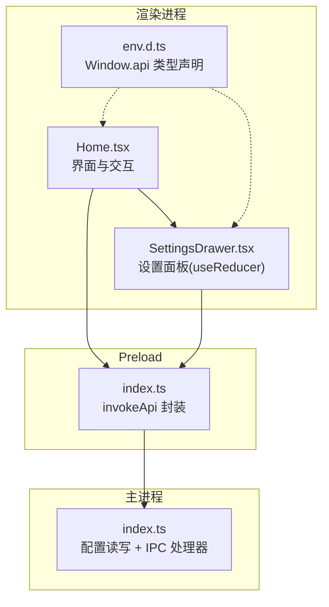
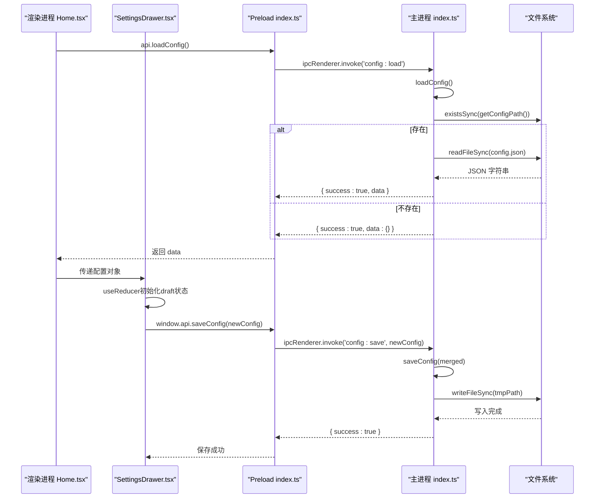
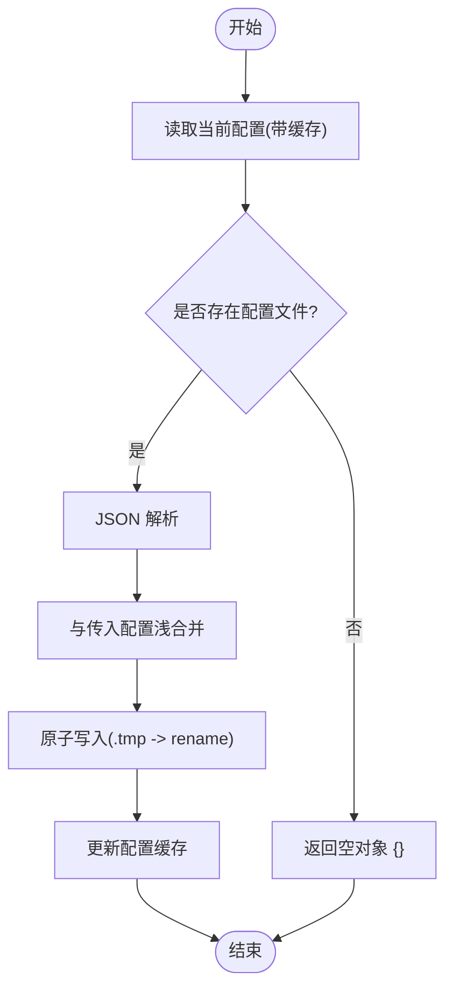
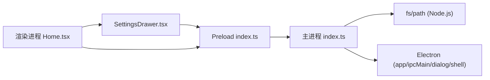

# 配置管理系统

<cite>
**本文引用的文件列表**
- [src/main/index.ts](file://src/main/index.ts)
- [src/preload/index.ts](file://src/preload/index.ts)
- [src/renderer/src/pages/Home.tsx](file://src/renderer/src/pages/Home.tsx)
- [src/renderer/src/pages/SettingsDrawer.tsx](file://src/renderer/src/pages/SettingsDrawer.tsx)
- [src/renderer/src/env.d.ts](file://src/renderer/src/env.d.ts)
- [tests/configAndUtils.test.ts](file://tests/configAndUtils.test.ts)
- [deliverables/software-company/视频合并app-增量设计-2026-07-06.md](file://deliverables/software-company/视频合并app-增量设计-2026-07-06.md)
</cite>

## 更新摘要
**变更内容**
- SettingsDrawer组件状态管理从多个useState钩子重构为集中式useReducer模式
- 新增DraftConfig类型定义和draftReducer函数，提供类型安全的状态更新
- 优化了设置面板的状态管理架构，提高可维护性和类型安全性
- 增强了网络信息获取和配置监听机制

## 目录
1. [简介](#简介)
2. [项目结构](#项目结构)
3. [核心组件](#核心组件)
4. [架构总览](#架构总览)
5. [详细组件分析](#详细组件分析)
6. [依赖关系分析](#依赖关系分析)
7. [性能与并发特性](#性能与并发特性)
8. [故障排查指南](#故障排查指南)
9. [结论](#结论)
10. [附录：配置项说明](#附录配置项说明)

## 简介
本文件面向开发者，系统化阐述"视频合并应用"的配置管理能力。重点覆盖以下方面：
- AppConfig 接口设计与字段语义
- 配置文件存储路径选择逻辑（含开发/生产差异与环境变量覆盖）
- 配置的读取、保存、合并策略与默认值处理
- 版本兼容与迁移方案（旧 userData 迁移）
- 输入输出文件夹路径、并发数、时间间隔阈值等关键配置项
- 初始化流程、热重载机制现状与数据持久化方案
- **新增**：SettingsDrawer组件的集中式状态管理模式
- 扩展方法与最佳实践

## 项目结构
配置管理贯穿主进程、preload 桥接层与渲染进程 UI：
- 主进程负责配置文件的实际读写、IPC 暴露、路径解析与迁移
- preload 提供统一 API 封装，将 IPC 调用结果标准化为成功/失败语义
- 渲染进程在启动时加载配置并驱动界面行为（如自动扫描、设置面板）
- **新增**：SettingsDrawer组件采用useReducer模式管理设置草稿状态



**图表来源**
- [src/renderer/src/pages/Home.tsx:44-102](file://src/renderer/src/pages/Home.tsx#L44-L102)
- [src/renderer/src/pages/SettingsDrawer.tsx:56-84](file://src/renderer/src/pages/SettingsDrawer.tsx#L56-84)
- [src/preload/index.ts:9-18](file://src/preload/index.ts#L9-L18)
- [src/main/index.ts:101-110](file://src/main/index.ts#L101-L110)

**章节来源**
- [src/main/index.ts:16-65](file://src/main/index.ts#L16-L65)
- [src/preload/index.ts:20-49](file://src/preload/index.ts#L20-L49)
- [src/renderer/src/pages/Home.tsx:44-102](file://src/renderer/src/pages/Home.tsx#L44-L102)
- [src/renderer/src/pages/SettingsDrawer.tsx:56-84](file://src/renderer/src/pages/SettingsDrawer.tsx#L56-84)
- [src/renderer/src/env.d.ts:3-28](file://src/renderer/src/env.d.ts#L3-L28)

## 核心组件
- 配置模型：AppConfig 接口定义所有可持久化的用户偏好与运行时参数
- 配置服务：loadConfig/saveConfig/getConfigPath 实现配置读取、写入与路径计算
- IPC 通道：config:load / config:save 暴露给渲染进程
- Preload 桥接：统一错误包装与返回值解包
- **新增**：SettingsDrawer状态管理：DraftConfig类型 + draftReducer函数
- 渲染侧消费：Home 页面在启动时加载配置并驱动后续操作

**章节来源**
- [src/main/index.ts:18-28](file://src/main/index.ts#L18-L28)
- [src/main/index.ts:30-65](file://src/main/index.ts#L30-L65)
- [src/main/index.ts:101-110](file://src/main/index.ts#L101-L110)
- [src/preload/index.ts:20-49](file://src/preload/index.ts#L20-L49)
- [src/renderer/src/pages/Home.tsx:44-102](file://src/renderer/src/pages/Home.tsx#L44-L102)
- [src/renderer/src/pages/SettingsDrawer.tsx:14-54](file://src/renderer/src/pages/SettingsDrawer.tsx#L14-54)

## 架构总览
配置系统采用"主进程持久化 + preload 安全桥接 + 渲染进程消费"的三段式架构。IPC 作为唯一访问点，避免渲染进程直接访问文件系统。



**图表来源**
- [src/main/index.ts:38-52](file://src/main/index.ts#L38-L52)
- [src/main/index.ts:101-104](file://src/main/index.ts#L101-L104)
- [src/preload/index.ts:9-18](file://src/preload/index.ts#L9-L18)
- [src/renderer/src/pages/Home.tsx:44-77](file://src/renderer/src/pages/Home.tsx#L44-L77)
- [src/renderer/src/pages/SettingsDrawer.tsx:106-114](file://src/renderer/src/pages/SettingsDrawer.tsx#L106-114)

## 详细组件分析

### 配置模型：AppConfig 接口
- 字段概览
  - inputFolder?: string — 输入文件夹路径
  - outputFolder?: string — 输出文件夹路径
  - outputFileName?: string — 输出文件名模板或固定名
  - darkMode?: boolean — 是否深色模式
  - concurrency?: number — 批量合并并发度
  - maxIntervalHours?: number — 按时间间隔分组的最大小时阈值
  - autoOpenWebsite?: boolean — 完成后是否自动打开网站
  - autoOpenFolder?: boolean — 完成后是否自动打开输出文件夹
  - pluginLinkage?: boolean — B站插件联动开关
  - autoCloseBrowser?: boolean — 打开B站后最小化浏览器
  - autoCloseApp?: boolean — 投稿完成后关闭App
  - runInBackground?: boolean — 后台运行模式
  - controlEnabled?: boolean — 远程控制服务器启用
  - controlPort?: number — 控制端口号
  - controlPassword?: string — 控制密码
  - hiddenFolderKeys?: string[] — 隐藏/排除的分组键集合
- 类型来源
  - 主进程内联定义
  - 渲染进程通过 env.d.ts 中的 Window.api 类型引用保持一致

**章节来源**
- [src/main/index.ts:201-216](file://src/main/index.ts#L201-L216)
- [src/renderer/src/env.d.ts:52-69](file://src/renderer/src/env.d.ts#L52-L69)

### SettingsDrawer组件状态管理重构

**新增** SettingsDrawer组件采用了集中式的状态管理模式，从之前的多个useState钩子重构为useReducer模式：

#### DraftConfig类型定义
```typescript
interface DraftConfig {
  maxIntervalHours: number
  concurrency: number
  autoOpenFolder: boolean
  autoOpenWebsite: boolean
  pluginLinkage: boolean
  autoCloseBrowser: boolean
  autoCloseApp: boolean
  runInBackground: boolean
  controlEnabled: boolean
  controlPort: number
  controlPassword: string
}
```

#### 动作类型定义
```typescript
type DraftAction = 
  | { type: 'init'; payload: DraftConfig } 
  | { type: 'update'; key: keyof DraftConfig; value: unknown }
```

#### Reducer函数实现
```typescript
const draftReducer = (state: DraftConfig, action: DraftAction): DraftConfig => {
  switch (action.type) {
    case 'init':
      return { ...action.payload }
    case 'update':
      return { ...state, [action.key]: action.value as any }
    default:
      return state
  }
}
```

#### 状态管理优势
- **类型安全**：通过TypeScript严格类型检查确保状态更新的正确性
- **可预测性**：集中式状态更新逻辑便于调试和测试
- **可维护性**：统一的更新模式减少重复代码
- **性能优化**：useReducer相比多个useState减少了不必要的重渲染

**章节来源**
- [src/renderer/src/pages/SettingsDrawer.tsx:14-54](file://src/renderer/src/pages/SettingsDrawer.tsx#L14-54)
- [src/renderer/src/pages/SettingsDrawer.tsx:56-84](file://src/renderer/src/pages/SettingsDrawer.tsx#L56-84)

### 配置文件路径选择逻辑
- 默认路径
  - 使用 app.getPath('userData') 拼接 'config.json'
  - 若目录不存在则递归创建
- 开发期覆盖
  - 当 is.dev 为真且存在环境变量 ELECTRON_RENDERER_URL 时，会设置 userData 到项目内 user-data 目录，便于调试
- 环境变量覆盖（迁移阶段）
  - 通过 VIDEO_MERGE_USER_DATA 可在应用启动早期覆盖 userData 根目录（用于迁移与调试）

**章节来源**
- [src/main/index.ts:218-224](file://src/main/index.ts#L218-L224)
- [src/main/index.ts:500-503](file://src/main/index.ts#L500-L503)
- [deliverables/software-company/视频合并app-增量设计-2026-07-06.md:356-362](file://deliverables/software-company/视频合并app-增量设计-2026-07-06.md#L356-L362)

### 配置读取与写入实现
- 读取流程
  - 尝试读取 config.json；若存在则 JSON.parse 后返回对象；否则返回空对象 {}
  - 异常捕获并记录日志，保证健壮性
  - **新增**：支持配置缓存机制，避免重复文件I/O
- 写入流程
  - 先读取当前配置，再与传入配置浅合并，最后写回文件
  - **新增**：原子写入机制，先写临时文件再重命名，防止写入中断导致配置损坏
  - 写入失败捕获异常并记录日志
- IPC 暴露
  - config:load 返回 { success:true, data }
  - config:save 接收部分更新对象，内部执行合并与持久化



**图表来源**
- [src/main/index.ts:226-261](file://src/main/index.ts#L226-L261)
- [src/main/index.ts:101-110](file://src/main/index.ts#L101-L110)

**章节来源**
- [src/main/index.ts:226-261](file://src/main/index.ts#L226-L261)
- [src/main/index.ts:101-110](file://src/main/index.ts#L101-L110)

### 配置合并策略与默认值处理
- 合并策略
  - 使用对象展开运算符进行浅合并：{ ...current, ...incoming }
  - 支持部分更新：未提供的字段保留原值
  - 可通过显式传入 undefined 来清除某字段
- 默认值处理
  - 首次运行无配置文件时返回空对象 {}
  - 渲染进程在加载后对可选字段做条件赋值，缺失字段保持界面默认状态
  - **新增**：SettingsDrawer中定义了完整的初始草稿状态，包含所有设置的默认值

**章节来源**
- [src/main/index.ts:246-261](file://src/main/index.ts#L246-L261)
- [tests/configAndUtils.test.ts:8-46](file://tests/configAndUtils.test.ts#L8-L46)
- [src/renderer/src/pages/Home.tsx:51-77](file://src/renderer/src/pages/Home.tsx#L51-L77)
- [src/renderer/src/pages/SettingsDrawer.tsx:42-54](file://src/renderer/src/pages/SettingsDrawer.tsx#L42-54)

### 版本兼容与迁移方案
- 旧 userData 迁移
  - 应用启动时优先执行迁移：检查旧路径下的 config.json，若存在则复制到新默认 userData 目录并删除旧文件
  - 迁移完成后，后续配置读写均落到新的默认 userData 位置
- 环境变量覆盖
  - 开发/调试场景可通过 VIDEO_MERGE_USER_DATA 指定 userData 根目录，便于验证迁移与配置读写

**章节来源**
- [deliverables/software-company/视频合并app-增量设计-2026-07-06.md:356-362](file://deliverables/software-company/视频合并app-增量设计-2026-07-06.md#L356-L362)

### 初始化流程与热重载机制
- 初始化流程
  - 渲染进程启动后调用 api.loadConfig() 获取配置
  - 根据配置填充输入/输出路径、并发数、时间间隔阈值、自动打开开关、隐藏分组键等
  - 若已配置输入路径，立即触发一次自动扫描
  - **新增**：SettingsDrawer打开时使用useReducer初始化草稿状态，支持实时编辑
- 热重载机制
  - **新增**：实现了配置文件监听机制，支持手机端修改配置后桌面端实时同步
  - 使用fs.watch监听config.json文件变更，防抖处理避免频繁刷新
  - 配置变更时通知渲染进程重新加载配置

**章节来源**
- [src/renderer/src/pages/Home.tsx:44-102](file://src/renderer/src/pages/Home.tsx#L44-L102)
- [src/renderer/src/pages/SettingsDrawer.tsx:64-84](file://src/renderer/src/pages/SettingsDrawer.tsx#L64-84)
- [src/main/index.ts:267-333](file://src/main/index.ts#L267-333)

### 数据持久化方案
- 持久化介质
  - 本地 JSON 文件：config.json
- 持久化时机
  - 选择输入/输出文件夹时自动保存对应字段
  - 渲染进程显式调用 saveConfig 保存其他设置
  - **新增**：SettingsDrawer保存时同时更新本地状态和远程配置
- 一致性保障
  - 写入前读取当前配置并合并，避免覆盖未修改字段
  - **新增**：原子写入机制确保配置文件的完整性
  - **新增**：配置缓存机制提升读取性能

**章节来源**
- [src/main/index.ts:246-261](file://src/main/index.ts#L246-261)
- [src/main/index.ts:367-378](file://src/main/index.ts#L367-378)
- [src/renderer/src/pages/SettingsDrawer.tsx:106-114](file://src/renderer/src/pages/SettingsDrawer.tsx#L106-114)

### 扩展方法与设计模式
- 单一职责
  - 配置路径计算、读取、保存各自独立函数，便于测试与替换
- 可扩展点
  - 新增配置字段：在 AppConfig 中声明并在渲染侧消费
  - 自定义合并策略：替换 saveConfig 中的合并逻辑（例如深合并或校验）
  - 多格式配置：在 getConfigPath 中引入版本后缀或不同文件格式
- 安全边界
  - 通过 preload 统一封装 IPC，避免渲染进程直接访问系统资源
- **新增**：状态管理模式
  - SettingsDrawer采用useReducer模式，提供类型安全的状态更新
  - 支持复杂的业务逻辑封装在reducer函数中

**章节来源**
- [src/main/index.ts:218-261](file://src/main/index.ts#L218-261)
- [src/preload/index.ts:9-18](file://src/preload/index.ts#L9-L18)
- [src/renderer/src/pages/SettingsDrawer.tsx:31-40](file://src/renderer/src/pages/SettingsDrawer.tsx#L31-40)

## 依赖关系分析
- 模块耦合
  - 渲染进程仅依赖 preload 暴露的 api，不直接依赖主进程
  - 主进程集中处理配置 I/O 与 IPC，降低跨进程复杂度
  - **新增**：SettingsDrawer与Home组件通过props进行状态同步
- 外部依赖
  - Electron 的 app、ipcMain、dialog、shell 等
  - Node.js 的 fs、path 等标准库



**图表来源**
- [src/renderer/src/pages/Home.tsx:44-102](file://src/renderer/src/pages/Home.tsx#L44-L102)
- [src/renderer/src/pages/SettingsDrawer.tsx:56-84](file://src/renderer/src/pages/SettingsDrawer.tsx#L56-84)
- [src/preload/index.ts:20-49](file://src/preload/index.ts#L20-L49)
- [src/main/index.ts:1-6](file://src/main/index.ts#L1-L6)

**章节来源**
- [src/main/index.ts:1-6](file://src/main/index.ts#L1-L6)
- [src/preload/index.ts:1-18](file://src/preload/index.ts#L1-L18)
- [src/renderer/src/pages/Home.tsx:1-10](file://src/renderer/src/pages/Home.tsx#L1-L10)

## 性能与并发特性
- 配置读写
  - 同步 I/O，适用于小体积 JSON 配置，开销极低
  - **新增**：配置缓存机制避免重复文件I/O操作
- 并发相关配置
  - concurrency 控制批量合并任务并行度，影响 CPU/IO 占用与吞吐
- 时间间隔阈值
  - maxIntervalHours 影响分组算法的时间窗口，过大可能合并无关片段，过小导致过多分组
- **新增**：状态管理性能
  - useReducer模式相比多个useState减少了不必要的组件重渲染
  - 集中式状态更新提高了大型表单的性能表现

**章节来源**
- [src/main/index.ts:421-469](file://src/main/index.ts#L421-L469)
- [src/renderer/src/pages/Home.tsx:59-64](file://src/renderer/src/pages/Home.tsx#L59-L64)
- [src/renderer/src/pages/SettingsDrawer.tsx:57](file://src/renderer/src/pages/SettingsDrawer.tsx#L57)

## 故障排查指南
- 常见问题
  - 配置文件不存在：loadConfig 返回空对象，渲染进程使用默认状态
  - 写入失败：保存时捕获异常并记录日志，建议检查磁盘权限与路径有效性
  - 路径非法：选择文件夹后自动保存，若路径无效需重新选择
  - **新增**：状态更新异常：检查useReducer的动作类型是否正确匹配
- 定位步骤
  - 查看控制台日志中 [loadConfig]/[saveConfig] 的输出
  - 确认 userData 目录是否正确（开发期可能被覆盖）
  - 检查是否有权限问题或路径被占用
  - **新增**：检查SettingsDrawer中draft状态的初始化是否正确

**章节来源**
- [src/main/index.ts:226-261](file://src/main/index.ts#L226-L261)
- [src/main/index.ts:500-503](file://src/main/index.ts#L500-L503)
- [src/renderer/src/pages/SettingsDrawer.tsx:64-84](file://src/renderer/src/pages/SettingsDrawer.tsx#L64-84)

## 结论
该配置管理系统以简洁可靠的 JSON 文件为核心，结合 Electron 的 userData 目录与环境变量覆盖，实现了跨平台一致的用户偏好持久化。通过 preload 的安全桥接与统一的 IPC 协议，保证了渲染进程与主进程之间的清晰边界。**新增的SettingsDrawer组件状态管理重构**显著提升了代码的可维护性和类型安全性，采用集中式的useReducer模式提供了更好的状态更新控制和性能优化。系统还实现了配置文件监听机制，支持手机端修改配置后桌面端的实时同步。

## 附录：配置项说明
- 输入输出文件夹路径
  - inputFolder: 源视频所在目录
  - outputFolder: 合并后的 MP4 输出目录
- 并发数设置
  - concurrency: 批量合并时的并行任务数，建议根据硬件能力调整
- 时间间隔阈值
  - maxIntervalHours: 同一标题下，相邻片段最大时间间隔（小时），用于判断是否属于同一场直播
- 自动化选项
  - autoOpenWebsite: 完成后自动打开B站投稿页面
  - autoOpenFolder: 完成后自动打开输出文件夹
  - pluginLinkage: B站插件联动，自动传递视频给插件进行投稿
  - autoCloseBrowser: 打开B站后最小化浏览器窗口
  - autoCloseApp: 投稿完成后自动退出应用
  - runInBackground: 后台运行模式，关闭窗口后最小化到托盘
- 远程控制
  - controlEnabled: 启用手机控制面板功能
  - controlPort: 控制服务器端口号，默认9820
  - controlPassword: 访问控制面板所需的密码
- 其他选项
  - outputFileName: 输出文件名模板或固定名
  - darkMode: 界面主题
  - hiddenFolderKeys: 需要隐藏的分组键数组

**章节来源**
- [src/main/index.ts:201-216](file://src/main/index.ts#L201-L216)
- [src/renderer/src/pages/Home.tsx:51-77](file://src/renderer/src/pages/Home.tsx#L51-L77)
- [src/renderer/src/pages/SettingsDrawer.tsx:42-54](file://src/renderer/src/pages/SettingsDrawer.tsx#L42-54)