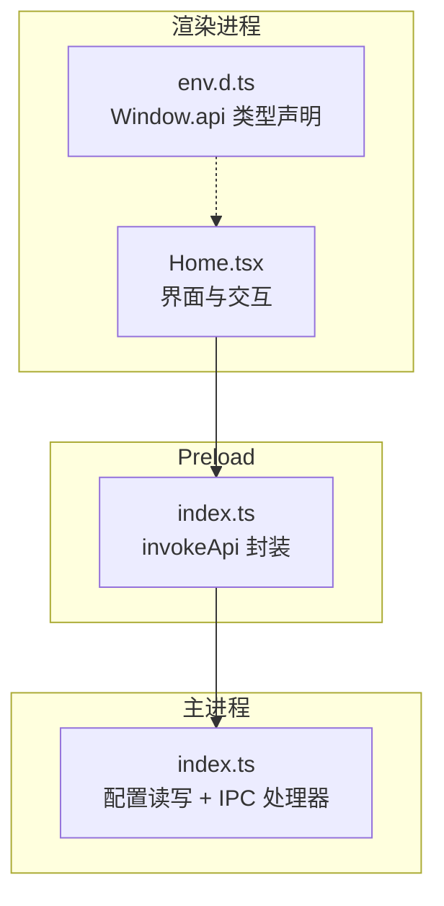
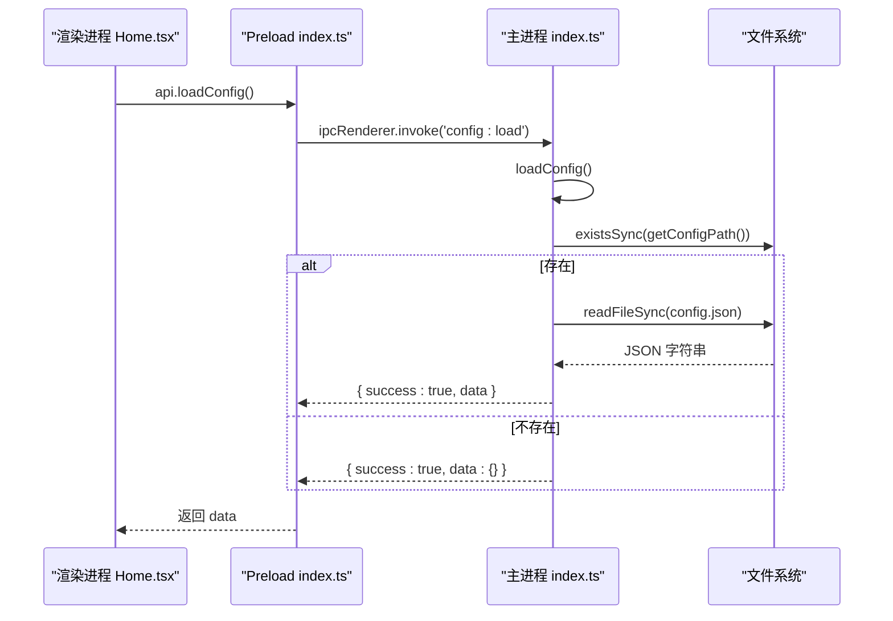
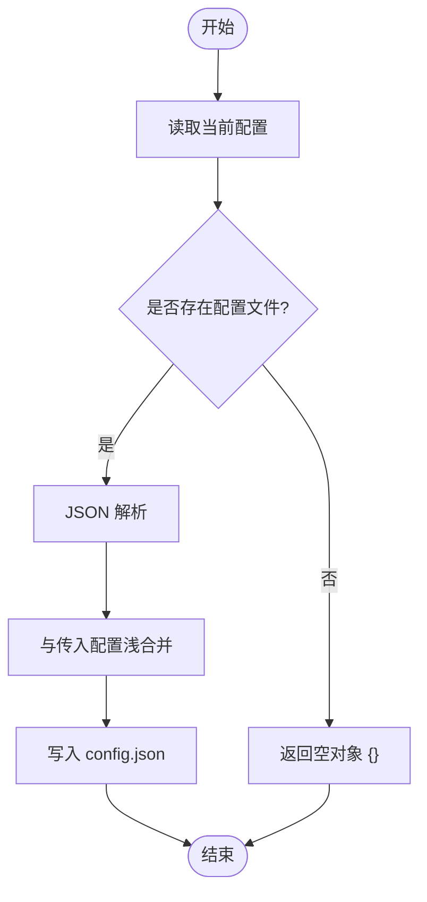
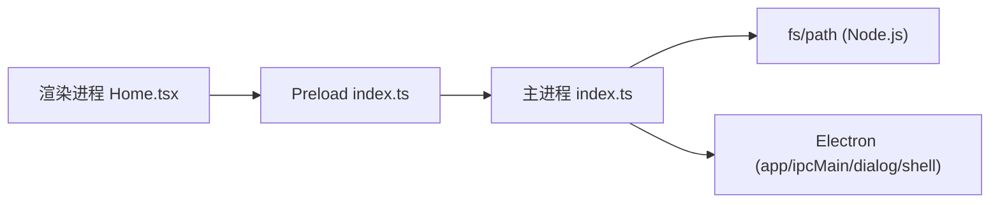

# 配置管理系统

<cite>
**本文引用的文件列表**
- [src/main/index.ts](file://src/main/index.ts)
- [src/preload/index.ts](file://src/preload/index.ts)
- [src/renderer/src/pages/Home.tsx](file://src/renderer/src/pages/Home.tsx)
- [src/renderer/src/env.d.ts](file://src/renderer/src/env.d.ts)
- [tests/configAndUtils.test.ts](file://tests/configAndUtils.test.ts)
- [deliverables/software-company/视频合并app-增量设计-2026-07-06.md](file://deliverables/software-company/视频合并app-增量设计-2026-07-06.md)
</cite>

## 目录
1. [简介](#简介)
2. [项目结构](#项目结构)
3. [核心组件](#核心组件)
4. [架构总览](#架构总览)
5. [详细组件分析](#详细组件分析)
6. [依赖关系分析](#依赖关系分析)
7. [性能与并发特性](#性能与并发特性)
8. [故障排查指南](#故障排查指南)
9. [结论](#结论)
10. [附录：配置项说明](#附录配置项说明)

## 简介
本文件面向开发者，系统化阐述“视频合并应用”的配置管理能力。重点覆盖以下方面：
- AppConfig 接口设计与字段语义
- 配置文件存储路径选择逻辑（含开发/生产差异与环境变量覆盖）
- 配置的读取、保存、合并策略与默认值处理
- 版本兼容与迁移方案（旧 userData 迁移）
- 输入输出文件夹路径、并发数、时间间隔阈值等关键配置项
- 初始化流程、热重载机制现状与数据持久化方案
- 扩展方法与最佳实践

## 项目结构
配置管理贯穿主进程、preload 桥接层与渲染进程 UI：
- 主进程负责配置文件的实际读写、IPC 暴露、路径解析与迁移
- preload 提供统一 API 封装，将 IPC 调用结果标准化为成功/失败语义
- 渲染进程在启动时加载配置并驱动界面行为（如自动扫描、设置面板）

图表来源
- [src/renderer/src/pages/Home.tsx:44-102](file://src/renderer/src/pages/Home.tsx#L44-L102)
- [src/preload/index.ts:9-18](file://src/preload/index.ts#L9-L18)
- [src/main/index.ts:101-110](file://src/main/index.ts#L101-L110)

章节来源
- [src/main/index.ts:16-65](file://src/main/index.ts#L16-L65)
- [src/preload/index.ts:20-49](file://src/preload/index.ts#L20-L49)
- [src/renderer/src/pages/Home.tsx:44-102](file://src/renderer/src/pages/Home.tsx#L44-L102)
- [src/renderer/src/env.d.ts:3-28](file://src/renderer/src/env.d.ts#L3-L28)

## 核心组件
- 配置模型：AppConfig 接口定义所有可持久化的用户偏好与运行时参数
- 配置服务：loadConfig/saveConfig/getConfigPath 实现配置读取、写入与路径计算
- IPC 通道：config:load / config:save 暴露给渲染进程
- Preload 桥接：统一错误包装与返回值解包
- 渲染侧消费：Home 页面在启动时加载配置并驱动后续操作

章节来源
- [src/main/index.ts:18-28](file://src/main/index.ts#L18-L28)
- [src/main/index.ts:30-65](file://src/main/index.ts#L30-L65)
- [src/main/index.ts:101-110](file://src/main/index.ts#L101-L110)
- [src/preload/index.ts:20-49](file://src/preload/index.ts#L20-L49)
- [src/renderer/src/pages/Home.tsx:44-102](file://src/renderer/src/pages/Home.tsx#L44-L102)

## 架构总览
配置系统采用“主进程持久化 + preload 安全桥接 + 渲染进程消费”的三段式架构。IPC 作为唯一访问点，避免渲染进程直接访问文件系统。

图表来源
- [src/main/index.ts:38-52](file://src/main/index.ts#L38-L52)
- [src/main/index.ts:101-104](file://src/main/index.ts#L101-L104)
- [src/preload/index.ts:9-18](file://src/preload/index.ts#L9-L18)
- [src/renderer/src/pages/Home.tsx:44-77](file://src/renderer/src/pages/Home.tsx#L44-L77)

## 详细组件分析

### 配置模型：AppConfig 接口
- 字段概览
  - inputFolder?: string — 输入文件夹路径
  - outputFolder?: string — 输出文件夹路径
  - outputFileName?: string — 输出文件名模板或固定名
  - darkMode?: boolean — 是否深色模式
  - concurrency?: number — 批量合并并发度
  - maxIntervalHours?: number — 按时间间隔分组的最大小时阈值
  - autoOpenWebsite?: boolean — 完成后是否自动打开网站
  - autoOpenFolder?: boolean — 完成后是否自动打开输出文件夹
  - hiddenFolderKeys?: string[] — 隐藏/排除的分组键集合
- 类型来源
  - 主进程内联定义
  - 渲染进程通过 env.d.ts 中的 Window.api 类型引用保持一致

章节来源
- [src/main/index.ts:18-28](file://src/main/index.ts#L18-L28)
- [src/renderer/src/env.d.ts:30-35](file://src/renderer/src/env.d.ts#L30-L35)

### 配置文件路径选择逻辑
- 默认路径
  - 使用 app.getPath('userData') 拼接 'config.json'
  - 若目录不存在则递归创建
- 开发期覆盖
  - 当 is.dev 为真且存在环境变量 ELECTRON_RENDERER_URL 时，会设置 userData 到项目内 user-data 目录，便于调试
- 环境变量覆盖（迁移阶段）
  - 通过 VIDEO_MERGE_USER_DATA 可在应用启动早期覆盖 userData 根目录（用于迁移与调试）

章节来源
- [src/main/index.ts:30-36](file://src/main/index.ts#L30-L36)
- [src/main/index.ts:500-503](file://src/main/index.ts#L500-L503)
- [deliverables/software-company/视频合并app-增量设计-2026-07-06.md:356-362](file://deliverables/software-company/视频合并app-增量设计-2026-07-06.md#L356-L362)

### 配置读取与写入实现
- 读取流程
  - 尝试读取 config.json；若存在则 JSON.parse 后返回对象；否则返回空对象 {}
  - 异常捕获并记录日志，保证健壮性
- 写入流程
  - 先读取当前配置，再与传入配置浅合并，最后写回文件
  - 写入失败捕获异常并记录日志
- IPC 暴露
  - config:load 返回 { success:true, data }
  - config:save 接收部分更新对象，内部执行合并与持久化

图表来源
- [src/main/index.ts:38-65](file://src/main/index.ts#L38-L65)
- [src/main/index.ts:101-110](file://src/main/index.ts#L101-L110)

章节来源
- [src/main/index.ts:38-65](file://src/main/index.ts#L38-L65)
- [src/main/index.ts:101-110](file://src/main/index.ts#L101-L110)

### 配置合并策略与默认值处理
- 合并策略
  - 使用对象展开运算符进行浅合并：{ ...current, ...incoming }
  - 支持部分更新：未提供的字段保留原值
  - 可通过显式传入 undefined 来清除某字段
- 默认值处理
  - 首次运行无配置文件时返回空对象 {}
  - 渲染进程在加载后对可选字段做条件赋值，缺失字段保持界面默认状态

章节来源
- [src/main/index.ts:54-65](file://src/main/index.ts#L54-L65)
- [tests/configAndUtils.test.ts:8-46](file://tests/configAndUtils.test.ts#L8-L46)
- [src/renderer/src/pages/Home.tsx:51-77](file://src/renderer/src/pages/Home.tsx#L51-L77)

### 版本兼容与迁移方案
- 旧 userData 迁移
  - 应用启动时优先执行迁移：检查旧路径下的 config.json，若存在则复制到新默认 userData 目录并删除旧文件
  - 迁移完成后，后续配置读写均落到新的默认 userData 位置
- 环境变量覆盖
  - 开发/调试场景可通过 VIDEO_MERGE_USER_DATA 指定 userData 根目录，便于验证迁移与配置读写

章节来源
- [deliverables/software-company/视频合并app-增量设计-2026-07-06.md:356-362](file://deliverables/software-company/视频合并app-增量设计-2026-07-06.md#L356-L362)

### 初始化流程与热重载机制
- 初始化流程
  - 渲染进程启动后调用 api.loadConfig() 获取配置
  - 根据配置填充输入/输出路径、并发数、时间间隔阈值、自动打开开关、隐藏分组键等
  - 若已配置输入路径，立即触发一次自动扫描
- 热重载机制
  - 当前未实现配置文件监听与热重载
  - 如需热重载，可在主进程增加 fs.watch 监听 config.json，变更时广播事件至渲染进程刷新

章节来源
- [src/renderer/src/pages/Home.tsx:44-102](file://src/renderer/src/pages/Home.tsx#L44-L102)

### 数据持久化方案
- 持久化介质
  - 本地 JSON 文件：config.json
- 持久化时机
  - 选择输入/输出文件夹时自动保存对应字段
  - 渲染进程显式调用 saveConfig 保存其他设置
- 一致性保障
  - 写入前读取当前配置并合并，避免覆盖未修改字段

章节来源
- [src/main/index.ts:112-124](file://src/main/index.ts#L112-L124)
- [src/main/index.ts:367-378](file://src/main/index.ts#L367-L378)
- [src/main/index.ts:54-65](file://src/main/index.ts#L54-L65)

### 扩展方法与设计模式
- 单一职责
  - 配置路径计算、读取、保存各自独立函数，便于测试与替换
- 可扩展点
  - 新增配置字段：在 AppConfig 中声明并在渲染侧消费
  - 自定义合并策略：替换 saveConfig 中的合并逻辑（例如深合并或校验）
  - 多格式配置：在 getConfigPath 中引入版本后缀或不同文件格式
- 安全边界
  - 通过 preload 统一封装 IPC，避免渲染进程直接访问系统资源

章节来源
- [src/main/index.ts:30-65](file://src/main/index.ts#L30-L65)
- [src/preload/index.ts:9-18](file://src/preload/index.ts#L9-L18)

## 依赖关系分析
- 模块耦合
  - 渲染进程仅依赖 preload 暴露的 api，不直接依赖主进程
  - 主进程集中处理配置 I/O 与 IPC，降低跨进程复杂度
- 外部依赖
  - Electron 的 app、ipcMain、dialog、shell 等
  - Node.js 的 fs、path 等标准库

图表来源
- [src/renderer/src/pages/Home.tsx:44-102](file://src/renderer/src/pages/Home.tsx#L44-L102)
- [src/preload/index.ts:20-49](file://src/preload/index.ts#L20-L49)
- [src/main/index.ts:1-6](file://src/main/index.ts#L1-L6)

章节来源
- [src/main/index.ts:1-6](file://src/main/index.ts#L1-L6)
- [src/preload/index.ts:1-18](file://src/preload/index.ts#L1-L18)
- [src/renderer/src/pages/Home.tsx:1-10](file://src/renderer/src/pages/Home.tsx#L1-L10)

## 性能与并发特性
- 配置读写
  - 同步 I/O，适用于小体积 JSON 配置，开销极低
- 并发相关配置
  - concurrency 控制批量合并任务并行度，影响 CPU/IO 占用与吞吐
- 时间间隔阈值
  - maxIntervalHours 影响分组算法的时间窗口，过大可能合并无关片段，过小导致过多分组

章节来源
- [src/main/index.ts:421-469](file://src/main/index.ts#L421-L469)
- [src/renderer/src/pages/Home.tsx:59-64](file://src/renderer/src/pages/Home.tsx#L59-L64)

## 故障排查指南
- 常见问题
  - 配置文件不存在：loadConfig 返回空对象，渲染进程使用默认状态
  - 写入失败：保存时捕获异常并记录日志，建议检查磁盘权限与路径有效性
  - 路径非法：选择文件夹后自动保存，若路径无效需重新选择
- 定位步骤
  - 查看控制台日志中 [loadConfig]/[saveConfig] 的输出
  - 确认 userData 目录是否正确（开发期可能被覆盖）
  - 检查是否有权限问题或路径被占用

章节来源
- [src/main/index.ts:38-65](file://src/main/index.ts#L38-L65)
- [src/main/index.ts:500-503](file://src/main/index.ts#L500-L503)

## 结论
该配置管理系统以简洁可靠的 JSON 文件为核心，结合 Electron 的 userData 目录与环境变量覆盖，实现了跨平台一致的用户偏好持久化。通过 preload 的安全桥接与统一的 IPC 协议，保证了渲染进程与主进程之间的清晰边界。当前未实现热重载，但提供了清晰的扩展点以便未来增强。

## 附录：配置项说明
- 输入输出文件夹路径
  - inputFolder: 源视频所在目录
  - outputFolder: 合并后的 MP4 输出目录
- 并发数设置
  - concurrency: 批量合并时的并行任务数，建议根据硬件能力调整
- 时间间隔阈值
  - maxIntervalHours: 同一标题下，相邻片段最大时间间隔（小时），用于判断是否属于同一场直播
- 其他选项
  - outputFileName: 输出文件名模板或固定名
  - darkMode: 界面主题
  - autoOpenWebsite/autoOpenFolder: 完成后自动打开网站或输出文件夹
  - hiddenFolderKeys: 需要隐藏的分组键数组

章节来源
- [src/main/index.ts:18-28](file://src/main/index.ts#L18-L28)
- [src/renderer/src/pages/Home.tsx:51-77](file://src/renderer/src/pages/Home.tsx#L51-L77)