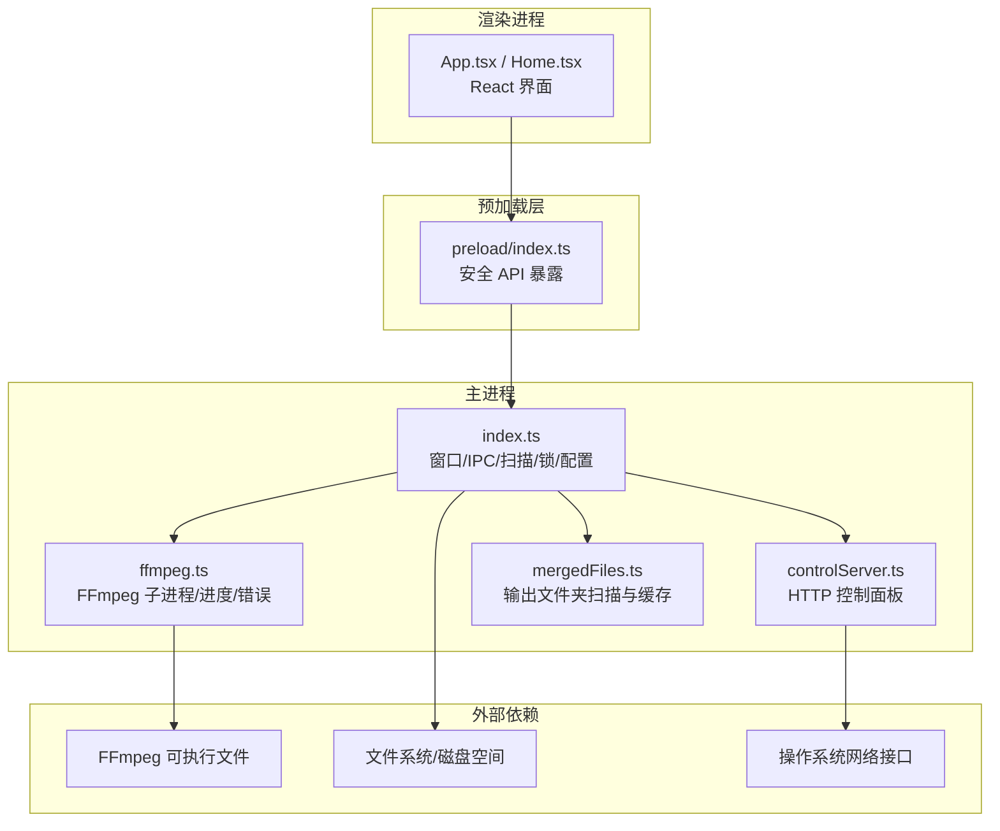
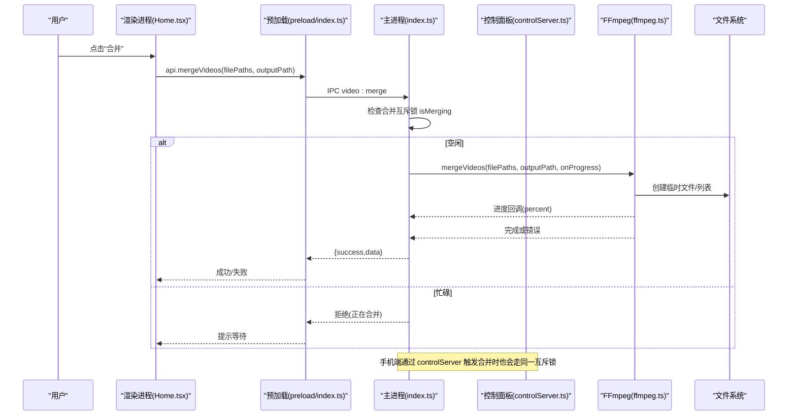
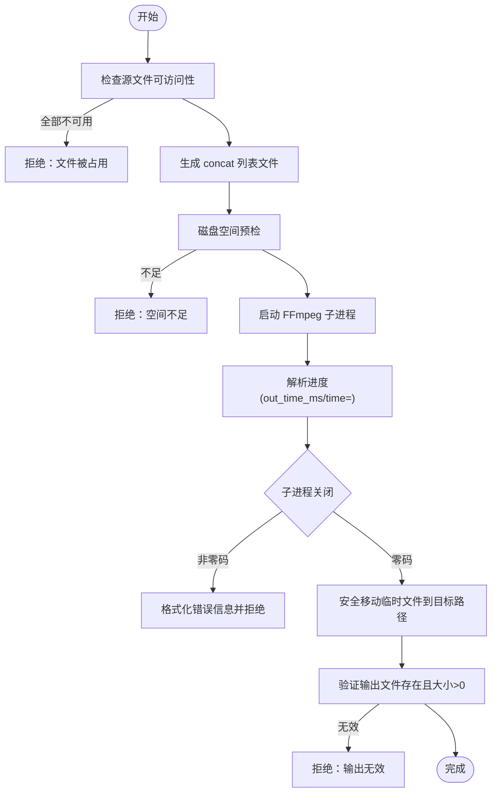
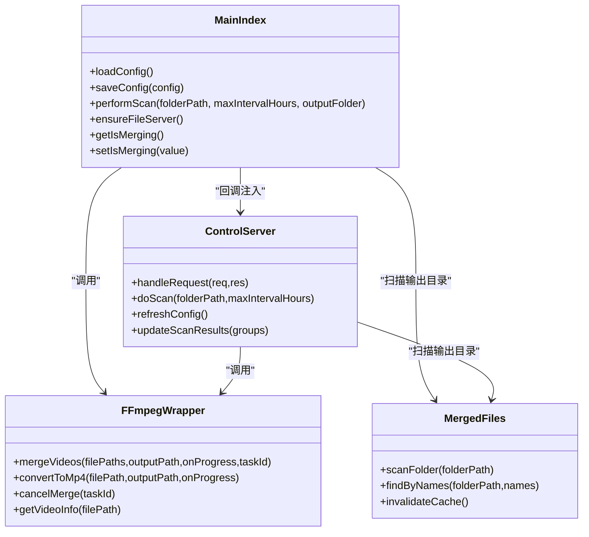

# 应用稳定性保障

<cite>
**本文引用的文件列表**
- [package.json](file://package.json)
- [electron.vite.config.ts](file://electron.vite.config.ts)
- [src/main/index.ts](file://src/main/index.ts)
- [src/main/controlServer.ts](file://src/main/controlServer.ts)
- [src/main/ffmpeg.ts](file://src/main/ffmpeg.ts)
- [src/main/mergedFiles.ts](file://src/main/mergedFiles.ts)
- [src/preload/index.ts](file://src/preload/index.ts)
- [src/renderer/src/App.tsx](file://src/renderer/src/App.tsx)
- [src/renderer/src/pages/Home.tsx](file://src/renderer/src/pages/Home.tsx)
- [tests/ffmpegSafety.test.ts](file://tests/ffmpegSafety.test.ts)
- [tests/mergeLock.test.ts](file://tests/mergeLock.test.ts)
- [tests/configAndUtils.test.ts](file://tests/configAndUtils.test.ts)
- [tests/mergedFilesCache.test.ts](file://tests/mergedFilesCache.test.ts)
</cite>

## 目录
1. [简介](#简介)
2. [项目结构](#项目结构)
3. [核心组件](#核心组件)
4. [架构总览](#架构总览)
5. [详细组件分析](#详细组件分析)
6. [依赖关系分析](#依赖关系分析)
7. [性能与资源管理](#性能与资源管理)
8. [故障排查指南](#故障排查指南)
9. [结论](#结论)
10. [附录](#附录)

## 简介
本文件围绕“视频合并应用”的稳定性保障进行系统化分析与说明，覆盖进程级互斥、错误处理、超时保护、配置持久化与同步、并发控制、缓存策略、外部进程（FFmpeg）安全调用、以及多端（桌面端、手机端、浏览器插件）协作时的状态一致性。文档面向开发者与维护者，既提供高层架构视图，也深入到关键实现路径与测试用例，帮助读者快速定位风险点并制定优化方案。

## 项目结构
该应用基于 Electron + React + TypeScript 构建，主进程负责系统能力、FFmpeg 子进程调度、本地 HTTP 服务与 IPC；渲染进程为 React UI；预加载脚本桥接安全 API；同时内置局域网控制面板（手机网页）与本地文件服务器（供浏览器插件访问）。

图表来源
- [src/main/index.ts:1-120](file://src/main/index.ts#L1-L120)
- [src/main/controlServer.ts:1-120](file://src/main/controlServer.ts#L1-L120)
- [src/main/ffmpeg.ts:1-60](file://src/main/ffmpeg.ts#L1-L60)
- [src/main/mergedFiles.ts:1-40](file://src/main/mergedFiles.ts#L1-L40)
- [src/preload/index.ts:1-40](file://src/preload/index.ts#L1-L40)
- [src/renderer/src/App.tsx:1-49](file://src/renderer/src/App.tsx#L1-L49)

章节来源
- [package.json:1-42](file://package.json#L1-L42)
- [electron.vite.config.ts:1-21](file://electron.vite.config.ts#L1-L21)

## 核心组件
- 主进程入口与 IPC：负责窗口生命周期、托盘、配置读写、扫描分组、合并流程、本地文件服务器、控制服务器集成等。
- 控制面板服务器：提供移动端网页与 REST API，支持登录限频、扫描、合并、批量合并、排除/恢复分组、上传联动等。
- FFmpeg 封装：子进程启动、进度解析、错误友好提示、超时与取消、临时文件清理、磁盘空间预检、安全移动输出。
- 已合并文件模块：输出目录 MP4 扫描与缓存，按直播时间倒序排序，避免频繁 IO。
- 预加载桥接：统一返回格式包装，简化渲染进程调用。
- 渲染界面：主题、设置、扫描结果展示、合并与投稿交互。

章节来源
- [src/main/index.ts:180-800](file://src/main/index.ts#L180-L800)
- [src/main/controlServer.ts:180-730](file://src/main/controlServer.ts#L180-L730)
- [src/main/ffmpeg.ts:150-390](file://src/main/ffmpeg.ts#L150-L390)
- [src/main/mergedFiles.ts:49-104](file://src/main/mergedFiles.ts#L49-L104)
- [src/preload/index.ts:1-93](file://src/preload/index.ts#L1-L93)
- [src/renderer/src/App.tsx:1-49](file://src/renderer/src/App.tsx#L1-L49)
- [src/renderer/src/pages/Home.tsx:1-200](file://src/renderer/src/pages/Home.tsx#L1-L200)

## 架构总览
下图展示了从用户操作到最终输出的关键链路，包括桌面端与手机端协同、浏览器插件联动、以及错误与超时保护。

图表来源
- [src/main/index.ts:778-800](file://src/main/index.ts#L778-L800)
- [src/main/ffmpeg.ts:169-390](file://src/main/ffmpeg.ts#L169-L390)
- [src/main/controlServer.ts:363-430](file://src/main/controlServer.ts#L363-L430)
- [src/preload/index.ts:36-44](file://src/preload/index.ts#L36-L44)

## 详细组件分析

### 主进程稳定性机制（index.ts）
- 配置管理与原子写入
  - 使用临时文件 + rename 的原子写入策略，防止写入中断导致配置损坏。
  - 启动时清理残留 .tmp 文件，避免脏状态。
  - 配置文件变更监听（防抖），自动刷新控制服务器缓存并通知渲染进程。
- 扫描与分组
  - 递归扫描输入目录，按文件名中的日期+标题+时间戳进行分组，过滤录制中片段与已合并项。
  - 一次性收集输出目录 MP4 集合，避免逐组重复扫描，提升性能。
- 合并互斥锁
  - 全局布尔锁 isMerging，桌面端与手机端均通过回调共享，防止重复合并。
- 本地文件服务器
  - 动态分配端口，注册文件并提供带范围请求的流式下载。
  - 接收插件“完成信号”，并设置超时自动重置，避免状态卡死。
  - 定期清理过期文件注册，释放内存。
- 托盘与后台运行
  - 关闭窗口时根据配置隐藏到托盘而非退出，减少意外关闭导致的任务中断。

章节来源
- [src/main/index.ts:241-326](file://src/main/index.ts#L241-L326)
- [src/main/index.ts:479-718](file://src/main/index.ts#L479-L718)
- [src/main/index.ts:778-800](file://src/main/index.ts#L778-L800)
- [src/main/index.ts:55-148](file://src/main/index.ts#L55-L148)
- [src/main/index.ts:334-429](file://src/main/index.ts#L334-L429)

### 控制面板服务器（controlServer.ts）
- 认证与限频
  - 登录接口支持密码校验与 IP 限频（60秒内失败5次锁定），防止暴力破解。
- 状态机与互斥
  - 状态 idle/scanning/merging/uploading，结合主进程合并锁回调，确保跨端互斥。
- 扫描复用
  - 优先调用主进程的扫描函数，保证手机端与桌面端列表一致。
- 合并与批量合并
  - 单条与批量合并均更新进度、任务索引，完成后刷新缓存并重新扫描。
- 上传联动
  - 将输出文件注册到本地文件服务器，打开 B 站投稿页，支持手动重置投稿状态。
- 配置同步
  - 修改配置后即时刷新内存缓存，并通过回调通知主进程同步。

章节来源
- [src/main/controlServer.ts:239-282](file://src/main/controlServer.ts#L239-L282)
- [src/main/controlServer.ts:330-430](file://src/main/controlServer.ts#L330-L430)
- [src/main/controlServer.ts:432-492](file://src/main/controlServer.ts#L432-L492)
- [src/main/controlServer.ts:518-570](file://src/main/controlServer.ts#L518-L570)
- [src/main/controlServer.ts:593-673](file://src/main/controlServer.ts#L593-L673)

### FFmpeg 安全与健壮性（ffmpeg.ts）
- 子进程管理
  - 活跃任务映射，支持取消（SIGTERM -> SIGKILL 兜底）。
  - 30 分钟超时保护，超时后终止进程并清理临时文件。
- 进度解析
  - 优先解析 -progress 格式的 out_time_ms，回退传统 time= 格式。
- 错误友好化
  - 常见错误翻译为中文提示（权限、文件不存在、内存不足、被系统终止等）。
- 磁盘空间预检
  - 在合并前估算所需空间并与可用空间比较，提前拒绝以避免中途失败。
- 安全输出
  - 先写临时文件，成功后再安全移动到目标路径，必要时备份已有文件。
- 探测优化
  - ffmpegProbe 仅读取文件头获取时长等信息，10 秒超时兜底，避免损坏文件阻塞。

图表来源
- [src/main/ffmpeg.ts:169-390](file://src/main/ffmpeg.ts#L169-L390)

章节来源
- [src/main/ffmpeg.ts:1-60](file://src/main/ffmpeg.ts#L1-L60)
- [src/main/ffmpeg.ts:169-390](file://src/main/ffmpeg.ts#L169-L390)
- [tests/ffmpegSafety.test.ts:74-219](file://tests/ffmpegSafety.test.ts#L74-L219)

### 已合并文件缓存（mergedFiles.ts）
- 缓存策略
  - 按目录路径独立缓存，TTL 12 秒，支持主动失效。
- 排序规则
  - 从文件名解析直播时间戳，按最新在前排序，便于投稿选择。
- 查找接口
  - 根据文件名集合快速映射到完整路径，用于手机端上传。

章节来源
- [src/main/mergedFiles.ts:1-104](file://src/main/mergedFiles.ts#L1-L104)
- [tests/mergedFilesCache.test.ts:1-108](file://tests/mergedFilesCache.test.ts#L1-L108)

### 预加载与渲染进程（preload/index.ts, App.tsx, Home.tsx）
- 预加载桥接
  - 统一包装 IPC 返回格式，成功返回 data，失败抛出错误，简化上层调用。
- 渲染交互
  - 启动时加载配置、自动扫描、显示合并进度与状态，支持主题切换与设置保存。
  - 通过轮询获取进度，避免 contextBridge 监听器回调不稳定问题。

章节来源
- [src/preload/index.ts:1-93](file://src/preload/index.ts#L1-L93)
- [src/renderer/src/App.tsx:1-49](file://src/renderer/src/App.tsx#L1-L49)
- [src/renderer/src/pages/Home.tsx:1-200](file://src/renderer/src/pages/Home.tsx#L1-L200)

## 依赖关系分析
- 主进程与 FFmpeg：通过 child_process.spawn 直接调用，避免 asar 虚拟文件系统限制，需重定向到 unpacked 目录。
- 主进程与控制服务器：通过回调注入方式共享状态（扫描、合并锁、配置、文件服务器），降低耦合度。
- 渲染进程与主进程：通过 preload 暴露的安全 API 进行 IPC，统一错误处理。
- 控制面板与主进程：通过 setScanCallback 复用主进程扫描逻辑，保证数据一致性。

图表来源
- [src/main/index.ts:180-800](file://src/main/index.ts#L180-L800)
- [src/main/controlServer.ts:174-730](file://src/main/controlServer.ts#L174-L730)
- [src/main/ffmpeg.ts:150-390](file://src/main/ffmpeg.ts#L150-L390)
- [src/main/mergedFiles.ts:49-104](file://src/main/mergedFiles.ts#L49-L104)

章节来源
- [src/main/index.ts:1-120](file://src/main/index.ts#L1-L120)
- [src/main/controlServer.ts:1-120](file://src/main/controlServer.ts#L1-L120)
- [src/main/ffmpeg.ts:1-60](file://src/main/ffmpeg.ts#L1-L60)
- [src/main/mergedFiles.ts:1-40](file://src/main/mergedFiles.ts#L1-L40)

## 性能与资源管理
- 扫描优化
  - 一次性收集输出目录 MP4 集合，避免每个分组重复递归扫描。
  - 控制面板对合并文件数量采用 5 秒缓存，状态轮询精度无需很高。
- 合并进度
  - 使用 -progress pipe:2 实时解析 out_time_ms，提高进度准确性。
- 资源清理
  - 合并完成后删除临时列表与临时输出文件，避免磁盘堆积。
  - 本地文件服务器定时清理过期注册，释放内存。
- 并发控制
  - 合并互斥锁防止桌面端与手机端同时触发合并，避免资源竞争。

章节来源
- [src/main/index.ts:685-718](file://src/main/index.ts#L685-L718)
- [src/main/controlServer.ts:284-308](file://src/main/controlServer.ts#L284-L308)
- [src/main/ffmpeg.ts:294-320](file://src/main/ffmpeg.ts#L294-L320)
- [src/main/index.ts:138-148](file://src/main/index.ts#L138-L148)

## 故障排查指南
- 合并失败常见原因
  - 权限不足：检查输出目录写入权限。
  - 文件不存在：确认源文件路径有效。
  - 文件格式不兼容或损坏：尝试转换或替换源文件。
  - 内存不足：关闭其他程序或分批合并。
  - 被系统终止：可能因 OOM 或外部杀进程。
- 超时与取消
  - 合并超过 30 分钟会被强制终止，检查是否有文件仍在录制中。
  - 可通过 cancelMerge 主动取消当前任务。
- 配置异常
  - 若配置损坏，检查是否存在 .tmp 残留文件，应用启动时会清理。
  - 手机端修改配置后，桌面端会收到 config-changed 事件并刷新。
- 上传状态卡住
  - 本地文件服务器的“完成信号”有 15 分钟超时自动重置，避免状态卡死。
  - 可通过 /api/upload/reset 手动重置投稿状态。

章节来源
- [src/main/ffmpeg.ts:18-37](file://src/main/ffmpeg.ts#L18-L37)
- [src/main/ffmpeg.ts:279-290](file://src/main/ffmpeg.ts#L279-L290)
- [src/main/index.ts:269-326](file://src/main/index.ts#L269-L326)
- [src/main/index.ts:62-78](file://src/main/index.ts#L62-L78)
- [src/main/controlServer.ts:485-492](file://src/main/controlServer.ts#L485-L492)

## 结论
该应用在稳定性方面采取了多层次防护：进程级互斥、错误友好化、超时与取消、原子写入与脏文件清理、缓存与 TTL、磁盘空间预检、以及跨端状态同步。这些机制共同保障了在复杂环境下的可靠运行。建议持续完善单元测试覆盖率，特别是边界条件与异常路径，并在生产环境中加强日志与监控，以便快速定位问题。

## 附录
- 构建与脚本
  - 开发、打包、测试命令见 package.json。
- 类型与配置
  - 主进程配置对象包含输入输出目录、并发数、最大间隔、自动行为、控制面板开关与端口、隐藏分组键等。

章节来源
- [package.json:8-16](file://package.json#L8-L16)
- [src/main/index.ts:196-211](file://src/main/index.ts#L196-L211)