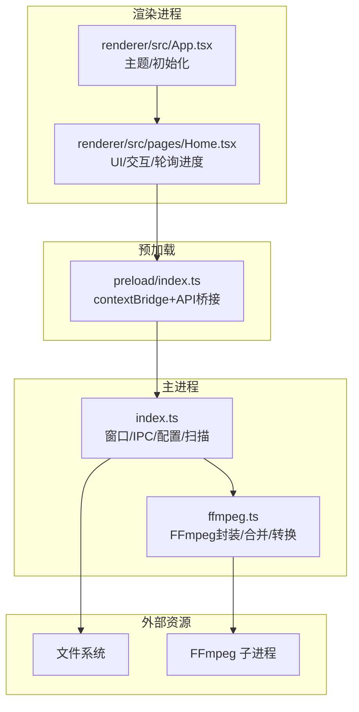
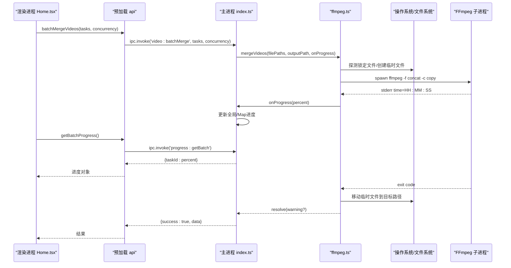
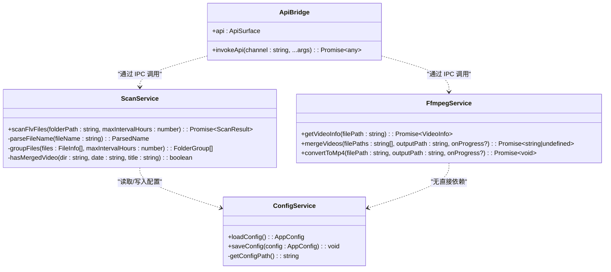
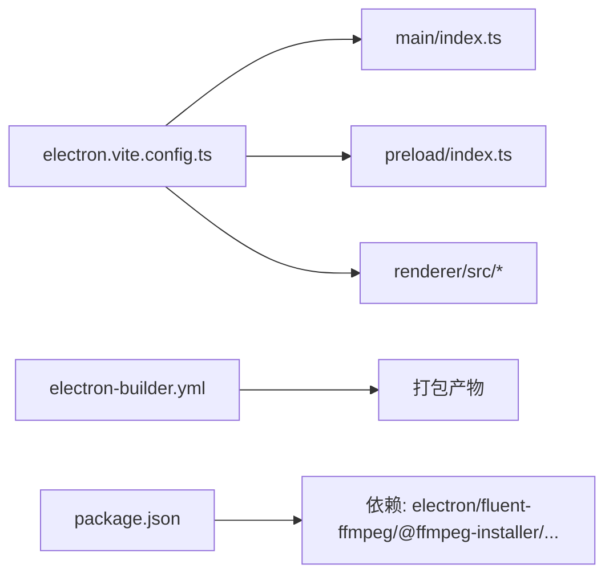
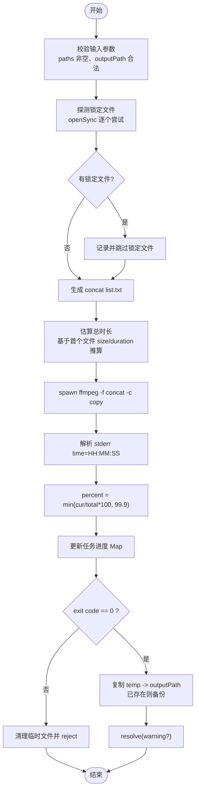
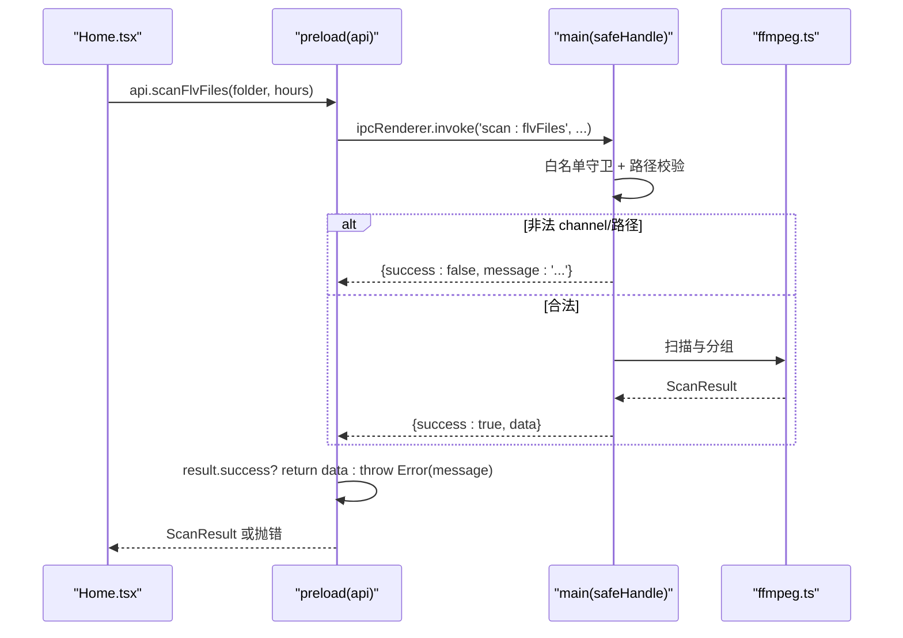
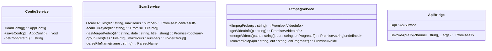

# 架构设计

<cite>
**本文引用的文件**
- [src/main/index.ts](file://src/main/index.ts)
- [src/main/ffmpeg.ts](file://src/main/ffmpeg.ts)
- [src/preload/index.ts](file://src/preload/index.ts)
- [src/renderer/src/App.tsx](file://src/renderer/src/App.tsx)
- [src/renderer/src/pages/Home.tsx](file://src/renderer/src/pages/Home.tsx)
- [electron.vite.config.ts](file://electron.vite.config.ts)
- [electron-builder.yml](file://electron-builder.yml)
- [package.json](file://package.json)
- [tests/ffmpegParsing.test.ts](file://tests/ffmpegParsing.test.ts)
- [tests/fileGrouping.test.ts](file://tests/fileGrouping.test.ts)
- [deliverables/software-company/视频合并app-增量设计-sequence.mermaid](file://deliverables/software-company/视频合并app-增量设计-sequence.mermaid)
- [deliverables/software-company/视频合并app-增量设计-class.mermaid](file://deliverables/software-company/视频合并app-增量设计-class.mermaid)
</cite>

## 目录
1. [引言](#引言)
2. [项目结构](#项目结构)
3. [核心组件](#核心组件)
4. [架构总览](#架构总览)
5. [详细组件分析](#详细组件分析)
6. [依赖关系分析](#依赖关系分析)
7. [性能与扩展性](#性能与扩展性)
8. [故障排查指南](#故障排查指南)
9. [结论](#结论)
10. [附录：关键流程图与时序图](#附录关键流程图与时序图)

## 引言
本架构文档面向架构师与高级开发者，系统性阐述该 Electron 应用的进程模型、IPC 通信机制、事件驱动与数据流设计，并深入解析 FFmpeg 集成方案、文件系统操作策略与错误处理机制。文档同时给出架构图表、技术决策与权衡说明，以及可扩展点与自定义选项，帮助读者快速理解并在此基础上进行二次开发或优化。

## 项目结构
应用采用标准 Electron 多进程架构：主进程负责系统能力（窗口、对话框、文件系统、外部程序）；预加载脚本通过 contextBridge 暴露最小 API 给渲染进程；渲染进程使用 React + Ant Design 构建 UI。FFmpeg 作为外部二进制由主进程以子进程方式调用，避免阻塞 UI。

图表来源
- [src/main/index.ts:1-120](file://src/main/index.ts#L1-L120)
- [src/main/ffmpeg.ts:1-120](file://src/main/ffmpeg.ts#L1-L120)
- [src/preload/index.ts:1-64](file://src/preload/index.ts#L1-L64)
- [src/renderer/src/App.tsx:1-49](file://src/renderer/src/App.tsx#L1-L49)
- [src/renderer/src/pages/Home.tsx:1-120](file://src/renderer/src/pages/Home.tsx#L1-L120)

章节来源
- [electron.vite.config.ts:1-21](file://electron.vite.config.ts#L1-L21)
- [electron-builder.yml:1-26](file://electron-builder.yml#L1-L26)
- [package.json:1-42](file://package.json#L1-L42)

## 核心组件
- 主进程（index.ts）
  - 窗口生命周期管理、安全策略（禁止新窗口打开外部链接）、用户配置读写（userData/config.json）。
  - IPC 处理器：配置、文件夹选择、文件扫描、视频信息获取、单任务合并、批量并行合并、进度查询、打开目录/外链等。
  - 文件分组算法：按文件名中的日期+时间+标题解析，结合最大间隔阈值将片段归为同一场直播组，过滤已合并结果。
- 预加载（preload/index.ts）
  - 统一 invokeApi 包装器：对主进程返回的 {success, data?, message?} 做解包，成功返回 data，失败抛错。
  - 通过 contextBridge 暴露受限 API 到 window.api，避免直接暴露 ipcRenderer。
- 渲染进程（App.tsx / Home.tsx）
  - App.tsx：应用级主题与语言设置，启动时读取配置。
  - Home.tsx：输入/输出目录选择、扫描、分组展示、批量合并、进度轮询、自动打开输出目录与网站等。
- FFmpeg 集成（ffmpeg.ts）
  - 轻量探测：仅读文件头提取时长/编码/分辨率，命中 Duration 即终止子进程。
  - 合并：基于 concat demuxer + stream copy，不重新编码，速度极快；支持并发任务队列与进度回调。
  - 转换：H.264 + AAC 转码 MP4，带进度回调与临时文件原子替换策略。
  - 健壮性：锁定文件探测与跳过、超时保护、输出覆盖备份、清理临时文件。

章节来源
- [src/main/index.ts:100-530](file://src/main/index.ts#L100-L530)
- [src/preload/index.ts:1-64](file://src/preload/index.ts#L1-L64)
- [src/renderer/src/App.tsx:1-49](file://src/renderer/src/App.tsx#L1-L49)
- [src/renderer/src/pages/Home.tsx:120-760](file://src/renderer/src/pages/Home.tsx#L120-L760)
- [src/main/ffmpeg.ts:1-305](file://src/main/ffmpeg.ts#L1-L305)

## 架构总览
下图展示了从渲染进程发起请求到主进程执行、再到外部 FFmpeg 子进程的完整时序，以及进度轮询的数据回流路径。

图表来源
- [src/main/index.ts:421-478](file://src/main/index.ts#L421-L478)
- [src/main/ffmpeg.ts:146-244](file://src/main/ffmpeg.ts#L146-L244)
- [src/preload/index.ts:42-48](file://src/preload/index.ts#L42-L48)
- [src/renderer/src/pages/Home.tsx:204-298](file://src/renderer/src/pages/Home.tsx#L204-L298)

## 详细组件分析

### 主进程：窗口、配置与 IPC 总线
- 窗口与安全
  - 禁用默认菜单，设置应用标识，监听激活事件保证单实例行为。
  - 拦截新窗口打开，强制使用系统浏览器打开外链，防止内部页面被劫持。
- 配置管理
  - 在 userData 下维护 config.json，提供 load/save 接口，支持深色模式、并发数、自动打开开关等。
- 文件扫描与分组
  - 递归扫描指定目录，识别支持的 FLV/M4S/TS/BLV 格式。
  - 解析文件名中的日期+时间+标题，按标题相同且时间间隔不超过阈值的规则分组，过滤已合并结果。
- 批量并行合并
  - 接收任务列表与并发度，内部维护工作线程池，每个任务独立更新 Map 中 taskId -> progress。
  - 完成后清理进度记录，返回各任务结果数组。
- 进度查询
  - 提供单任务与批量任务的进度查询接口，渲染端通过轮询获取最新状态。

章节来源
- [src/main/index.ts:69-97](file://src/main/index.ts#L69-L97)
- [src/main/index.ts:102-110](file://src/main/index.ts#L102-L110)
- [src/main/index.ts:146-345](file://src/main/index.ts#L146-L345)
- [src/main/index.ts:421-478](file://src/main/index.ts#L421-L478)
- [src/main/index.ts:496-498](file://src/main/index.ts#L496-L498)

### 预加载：安全桥接与统一解包
- 统一 invokeApi
  - 调用 ipcRenderer.invoke(channel, ...args)，并对返回体做标准化解包：{success:true} 返回 data，{success:false} 抛出错误。
- 暴露 API
  - 通过 contextBridge.exposeInMainWorld 暴露受限方法集，避免直接暴露底层 IPC 能力。
- 兼容性
  - 在非隔离环境下回退到 window.electron/window.api 挂载。

章节来源
- [src/preload/index.ts:9-18](file://src/preload/index.ts#L9-L18)
- [src/preload/index.ts:21-49](file://src/preload/index.ts#L21-L49)
- [src/preload/index.ts:51-63](file://src/preload/index.ts#L51-L63)

### 渲染进程：React 界面与交互流程
- 应用初始化
  - 启动时加载配置，根据 darkMode 切换主题。
- 核心交互
  - 选择输入/输出目录后自动保存配置。
  - 扫描后展示分组表格，支持全选/取消、排除/恢复隐藏分组。
  - 批量合并时构造任务列表，启动进度轮询（每 500ms），计算总体进度与各任务进度。
  - 合并完成后根据设置自动打开输出目录与 B 站投稿页面（仅首次）。
- 错误提示
  - 通过 message 组件反馈成功/警告/错误信息。

章节来源
- [src/renderer/src/App.tsx:10-30](file://src/renderer/src/App.tsx#L10-L30)
- [src/renderer/src/pages/Home.tsx:44-102](file://src/renderer/src/pages/Home.tsx#L44-L102)
- [src/renderer/src/pages/Home.tsx:183-298](file://src/renderer/src/pages/Home.tsx#L183-L298)
- [src/renderer/src/pages/Home.tsx:269-284](file://src/renderer/src/pages/Home.tsx#L269-L284)

### FFmpeg 集成：探测、合并与转换
- 路径与打包适配
  - 通过 @ffmpeg-installer/ffmpeg 安装二进制，asar 打包后需重定向到 app.asar.unpacked 才能 spawn。
- 轻量探测
  - 使用 spawn 启动 ffmpeg -i，捕获 stderr，匹配 Duration 后立即 kill，毫秒级完成。
- 合并流程
  - 生成临时 list.txt，使用 concat demuxer + -c copy 拼接多个源文件为 MP4。
  - 实时解析 stderr 中的 time=HH:MM:SS，结合估算总时长计算百分比进度。
  - 合并成功后将临时文件复制到目标路径，若目标存在则先备份再覆盖。
- 转换流程
  - 使用 fluent-ffmpeg 库，设置 H.264 + AAC，启用 faststart，onProgress 回调推进 UI。
- 健壮性与容错
  - 合并前 openSync 探测锁定文件，自动跳过正在录制的片段。
  - 30 分钟超时保护，异常时清理临时文件并拒绝 Promise。
  - 错误信息包含退出码与最后若干行日志，便于定位问题。

章节来源
- [src/main/ffmpeg.ts:8-11](file://src/main/ffmpeg.ts#L8-L11)
- [src/main/ffmpeg.ts:13-58](file://src/main/ffmpeg.ts#L13-L58)
- [src/main/ffmpeg.ts:87-245](file://src/main/ffmpeg.ts#L87-L245)
- [src/main/ffmpeg.ts:254-304](file://src/main/ffmpeg.ts#L254-L304)

### 类与模块关系（代码级）

图表来源
- [src/main/index.ts:102-110](file://src/main/index.ts#L102-L110)
- [src/main/index.ts:146-345](file://src/main/index.ts#L146-L345)
- [src/main/ffmpeg.ts:65-77](file://src/main/ffmpeg.ts#L65-L77)
- [src/main/ffmpeg.ts:87-245](file://src/main/ffmpeg.ts#L87-L245)
- [src/preload/index.ts:21-49](file://src/preload/index.ts#L21-L49)

## 依赖关系分析
- 构建与打包
  - electron-vite 分离 main/preload/renderer 构建管线，react 插件用于渲染侧。
  - electron-builder 配置产物名称、NSIS 安装包、asarUnpack 解包 ffmpeg 二进制与 resources。
- 运行时依赖
  - Electron 33、Ant Design 5、React 18、fluent-ffmpeg、@ffmpeg-installer/ffmpeg。
- 测试依赖
  - Vitest 运行单元测试，覆盖 FFmpeg 输出解析、文件分组、IPC 解包等逻辑。

图表来源
- [electron.vite.config.ts:1-21](file://electron.vite.config.ts#L1-L21)
- [electron-builder.yml:11-13](file://electron-builder.yml#L11-L13)
- [package.json:17-20](file://package.json#L17-L20)

章节来源
- [electron.vite.config.ts:1-21](file://electron.vite.config.ts#L1-L21)
- [electron-builder.yml:1-26](file://electron-builder.yml#L1-L26)
- [package.json:1-42](file://package.json#L1-L42)

## 性能与扩展性
- 性能特性
  - 合并采用 concat demuxer + stream copy，避免重编码，耗时接近 I/O 上限。
  - 批量合并使用并发队列，可配置并发度，充分利用多核 CPU 与磁盘吞吐。
  - 进度轮询频率 500ms，平衡 UI 流畅度与 IPC 开销。
- 扩展点
  - 新增视频格式：扩展 VIDEO_EXTENSIONS 常量与 isVideoFile 判断。
  - 新增分组策略：调整 parseFileName 与 groupFiles 逻辑，支持更多命名规范。
  - 新增导出格式：在 convertToMp4 基础上增加其他编码器参数或封装新的转换函数。
  - 新增 IPC 通道：在 preload 暴露 API，并在 main 注册对应 handler。
- 约束条件
  - 当前未开启 sandbox（sandbox: false），出于 FFmpeg 子进程 spawn 兼容考虑；后续评估 sandbox 可行性。
  - 路径校验与白名单守卫尚未实现，建议引入 ALLOWED_IPC_CHANNELS 与 validateFolderPath 增强安全性。
  - 严格类型与 any 消除、Promise 反模式修复已在评审清单中提出，建议逐步落地。

[本节为通用指导，无需源码引用]

## 故障排查指南
- 常见错误与定位
  - 合并失败（exit code 非零）：查看 ffmpeg.ts 中记录的最后若干行 stderr，确认输入文件是否损坏或编码不一致。
  - 锁定文件导致跳过：检查是否有录制进程仍在写入源文件，等待其释放或手动停止录制。
  - 输出覆盖失败：目标文件可能被占用或权限不足，尝试关闭占用进程或以管理员权限运行。
  - 超时（30 分钟）：可能源文件过大或大量片段仍在录制，适当增大超时或分批处理。
- 调试建议
  - 在主进程 console.log 中搜索“FFmpeg 合并命令”、“进度”等关键字，观察实际命令行与进度曲线。
  - 使用系统工具（如 Process Explorer）确认 FFmpeg 子进程是否存在及资源占用情况。
  - 在渲染端 message 组件中查看错误消息，必要时在 Home.tsx 的 catch 分支打印更详细的堆栈。

章节来源
- [src/main/ffmpeg.ts:200-244](file://src/main/ffmpeg.ts#L200-L244)
- [src/main/ffmpeg.ts:154-160](file://src/main/ffmpeg.ts#L154-L160)
- [src/renderer/src/pages/Home.tsx:286-298](file://src/renderer/src/pages/Home.tsx#L286-L298)

## 结论
该应用采用清晰的三进程边界与最小化 API 暴露策略，结合 FFmpeg 子进程实现高性能的视频合并与转换。批量并发与进度轮询提升了用户体验，健壮的错误处理与临时文件策略保障了稳定性。建议在后续迭代中完善 IPC 白名单与路径校验、评估 sandbox 可行性、提升类型严格度与测试覆盖率，以进一步增强安全性与可维护性。

[本节为总结，无需源码引用]

## 附录：关键流程图与时序图

### 批量合并流程图（算法视角）

图表来源
- [src/main/ffmpeg.ts:98-117](file://src/main/ffmpeg.ts#L98-L117)
- [src/main/ffmpeg.ts:146-170](file://src/main/ffmpeg.ts#L146-L170)
- [src/main/ffmpeg.ts:174-206](file://src/main/ffmpeg.ts#L174-L206)
- [src/main/ffmpeg.ts:209-234](file://src/main/ffmpeg.ts#L209-L234)

### 增量设计序列图（来自仓库）

图表来源
- [deliverables/software-company/视频合并app-增量设计-sequence.mermaid](file://deliverables/software-company/视频合并app-增量设计-sequence.mermaid)

### 增量设计类图（来自仓库）

图表来源
- [deliverables/software-company/视频合并app-增量设计-class.mermaid](file://deliverables/software-company/视频合并app-增量设计-class.mermaid)