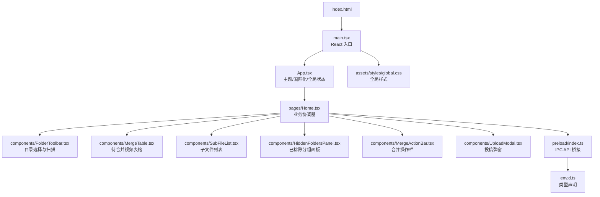
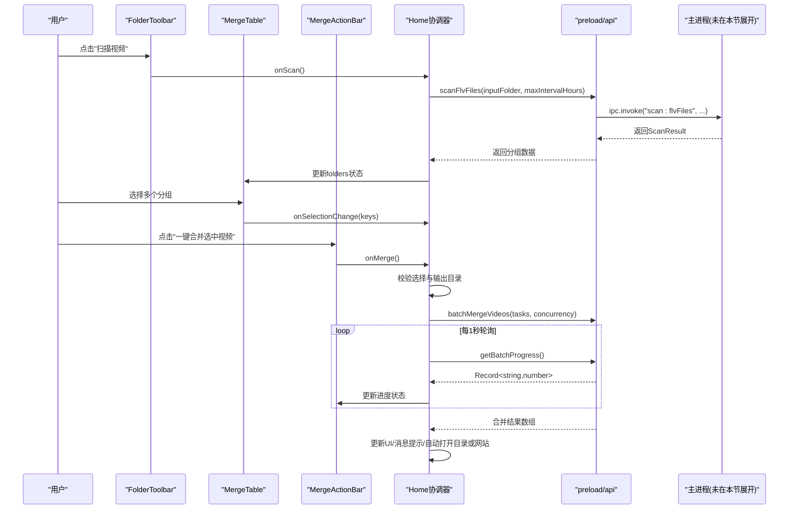
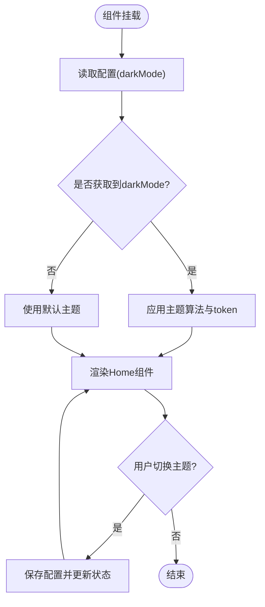
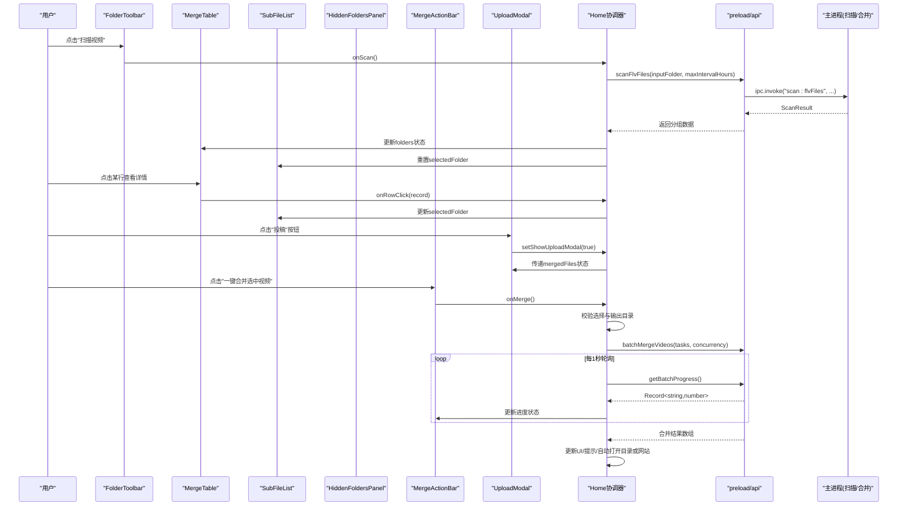
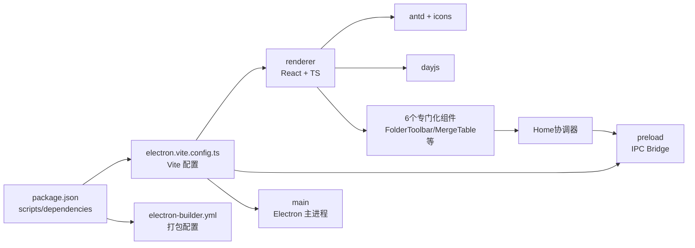

# 渲染进程架构

<cite>
**本文引用的文件列表**
- [src/renderer/src/main.tsx](file://src/renderer/src/main.tsx)
- [src/renderer/src/App.tsx](file://src/renderer/src/App.tsx)
- [src/renderer/src/pages/Home.tsx](file://src/renderer/src/pages/Home.tsx)
- [src/renderer/src/components/FolderToolbar.tsx](file://src/renderer/src/components/FolderToolbar.tsx)
- [src/renderer/src/components/MergeTable.tsx](file://src/renderer/src/components/MergeTable.tsx)
- [src/renderer/src/components/SubFileList.tsx](file://src/renderer/src/components/SubFileList.tsx)
- [src/renderer/src/components/HiddenFoldersPanel.tsx](file://src/renderer/src/components/HiddenFoldersPanel.tsx)
- [src/renderer/src/components/MergeActionBar.tsx](file://src/renderer/src/components/MergeActionBar.tsx)
- [src/renderer/src/components/UploadModal.tsx](file://src/renderer/src/components/UploadModal.tsx)
- [src/renderer/src/pages/SettingsDrawer.tsx](file://src/renderer/src/pages/SettingsDrawer.tsx)
- [src/preload/index.ts](file://src/preload/index.ts)
- [src/renderer/src/env.d.ts](file://src/renderer/src/env.d.ts)
- [src/renderer/src/assets/styles/global.css](file://src/renderer/src/assets/styles/global.css)
- [src/renderer/index.html](file://src/renderer/index.html)
- [electron.vite.config.ts](file://electron.vite.config.ts)
- [package.json](file://package.json)
- [electron-builder.yml](file://electron-builder.yml)
</cite>

## 更新摘要
**变更内容**
- 重构了Home.tsx组件，将其分解为6个专门化的子组件以提高可维护性和可测试性
- 新增FolderToolbar组件处理输入输出目录选择和扫描功能
- 新增MergeTable组件管理待合并视频表格展示和选择操作
- 新增SubFileList组件显示选中任务的子文件列表
- 新增HiddenFoldersPanel组件管理已排除分组的恢复功能
- 新增MergeActionBar组件处理合并操作和进度显示
- 新增UploadModal组件提供投稿文件选择和管理界面
- 更新了组件层次结构和状态管理模式

## 目录
1. [简介](#简介)
2. [项目结构](#项目结构)
3. [核心组件](#核心组件)
4. [架构总览](#架构总览)
5. [详细组件分析](#详细组件分析)
6. [依赖关系分析](#依赖关系分析)
7. [性能考量](#性能考量)
8. [故障排查指南](#故障排查指南)
9. [结论](#结论)
10. [附录](#附录)

## 简介
本文件聚焦于渲染进程的架构与实现，面向前端开发者，系统化阐述 React 应用结构、组件层次设计、状态管理模式、主题管理、国际化支持、响应式布局、事件处理机制、用户交互流程、组件间通信模式、性能优化策略以及用户体验设计原则。同时涵盖构建配置、开发环境设置与调试技巧，展示现代 Web 应用在 Electron 中的最佳实践。

**更新** 经过重大架构重构，Home.tsx已被分解为6个专门化的组件，每个组件负责特定的UI职责，显著提高了代码的可维护性和可测试性。

## 项目结构
渲染进程采用 Vite + React + TypeScript 技术栈，通过 electron-vite 统一构建主进程、预加载脚本与渲染进程。入口为 index.html，由 main.tsx 启动 React 应用，App 作为根组件提供主题与国际化上下文，Home 页面作为协调器管理6个子组件的状态和业务逻辑。

**图表来源**
- [src/renderer/index.html:1-13](file://src/renderer/index.html#L1-L13)
- [src/renderer/src/main.tsx:1-37](file://src/renderer/src/main.tsx#L1-L37)
- [src/renderer/src/App.tsx:1-59](file://src/renderer/src/App.tsx#L1-L59)
- [src/renderer/src/pages/Home.tsx:1-678](file://src/renderer/src/pages/Home.tsx#L1-L678)
- [src/renderer/src/components/FolderToolbar.tsx:1-62](file://src/renderer/src/components/FolderToolbar.tsx#L1-L62)
- [src/renderer/src/components/MergeTable.tsx:1-139](file://src/renderer/src/components/MergeTable.tsx#L1-L139)
- [src/renderer/src/components/SubFileList.tsx:1-41](file://src/renderer/src/components/SubFileList.tsx#L1-L41)
- [src/renderer/src/components/HiddenFoldersPanel.tsx:1-69](file://src/renderer/src/components/HiddenFoldersPanel.tsx#L1-L69)
- [src/renderer/src/components/MergeActionBar.tsx:1-103](file://src/renderer/src/components/MergeActionBar.tsx#L1-L103)
- [src/renderer/src/components/UploadModal.tsx:1-140](file://src/renderer/src/components/UploadModal.tsx#L1-L140)
- [src/preload/index.ts:1-96](file://src/preload/index.ts#L1-L96)
- [src/renderer/src/env.d.ts:1-73](file://src/renderer/src/env.d.ts#L1-L73)
- [src/renderer/src/assets/styles/global.css:1-15](file://src/renderer/src/assets/styles/global.css#L1-L15)

章节来源
- [src/renderer/index.html:1-13](file://src/renderer/index.html#L1-L13)
- [src/renderer/src/main.tsx:1-37](file://src/renderer/src/main.tsx#L1-L37)
- [electron.vite.config.ts:1-21](file://electron.vite.config.ts#L1-L21)
- [package.json:1-42](file://package.json#L1-L42)

## 核心组件
- 入口与挂载：main.tsx 使用 ReactDOM.createRoot 在 StrictMode 下挂载 App 根组件，并引入全局样式，包含错误边界处理。
- 根组件：App.tsx 负责主题（深色/浅色）切换、Ant Design 国际化（中文）、从持久化配置加载主题偏好，并通过 props 向 Home 组件传递状态与回调。
- 页面协调器：Home.tsx 作为主要业务协调器，管理6个子组件的状态，包括目录选择、扫描、分组显示、批量合并、进度轮询、隐藏/恢复分组、设置抽屉和投稿弹窗等完整业务流程。
- 专门化子组件：
  - FolderToolbar：处理输入输出目录选择和扫描功能
  - MergeTable：管理待合并视频的表格展示和选择操作
  - SubFileList：显示选中任务的子文件列表详情
  - HiddenFoldersPanel：管理已排除分组的恢复功能
  - MergeActionBar：处理合并操作和进度显示
  - UploadModal：提供投稿文件选择和管理界面
- IPC 桥接：preload/index.ts 暴露统一的 window.api 接口，封装 invokeApi 自动解包 {success, data?, message?} 的返回格式，简化调用方错误处理。
- 类型定义：env.d.ts 集中声明 Window.api 方法签名及数据结构（AppConfig、FolderGroup、ScanResult、VideoInfo 等），确保类型安全。

**更新** 新增了6个专门化的子组件，每个组件都有明确的职责边界，提高了代码的可读性和可测试性。

章节来源
- [src/renderer/src/main.tsx:1-37](file://src/renderer/src/main.tsx#L1-L37)
- [src/renderer/src/App.tsx:1-59](file://src/renderer/src/App.tsx#L1-L59)
- [src/renderer/src/pages/Home.tsx:1-678](file://src/renderer/src/pages/Home.tsx#L1-L678)
- [src/renderer/src/components/FolderToolbar.tsx:1-62](file://src/renderer/src/components/FolderToolbar.tsx#L1-L62)
- [src/renderer/src/components/MergeTable.tsx:1-139](file://src/renderer/src/components/MergeTable.tsx#L1-L139)
- [src/renderer/src/components/SubFileList.tsx:1-41](file://src/renderer/src/components/SubFileList.tsx#L1-L41)
- [src/renderer/src/components/HiddenFoldersPanel.tsx:1-69](file://src/renderer/src/components/HiddenFoldersPanel.tsx#L1-L69)
- [src/renderer/src/components/MergeActionBar.tsx:1-103](file://src/renderer/src/components/MergeActionBar.tsx#L1-L103)
- [src/renderer/src/components/UploadModal.tsx:1-140](file://src/renderer/src/components/UploadModal.tsx#L1-L140)
- [src/preload/index.ts:1-96](file://src/preload/index.ts#L1-L96)
- [src/renderer/src/env.d.ts:1-73](file://src/renderer/src/env.d.ts#L1-L73)

## 架构总览
渲染进程整体遵循"轻量 UI + 明确职责"的原则，经过重构后具有更清晰的组件层次：
- 组件层次清晰：入口 -> 根组件 -> 页面协调器 -> 专门化子组件，避免深层嵌套。
- 状态管理本地化：使用 useState/useEffect/useRef 管理 UI 状态与副作用，减少跨组件共享复杂度。
- 主题与国际化：通过 Ant Design ConfigProvider 注入主题算法与语言包，统一全局样式行为。
- IPC 通信：通过 preload 暴露的 window.api 进行异步调用，统一错误包装与返回值解包。
- 构建与打包：electron-vite 负责开发与构建，electron-builder 负责产物打包与平台目标。

**图表来源**
- [src/renderer/src/pages/Home.tsx:211-235](file://src/renderer/src/pages/Home.tsx#L211-L235)
- [src/renderer/src/pages/Home.tsx:248-423](file://src/renderer/src/pages/Home.tsx#L248-L423)
- [src/renderer/src/components/FolderToolbar.tsx:16-57](file://src/renderer/src/components/FolderToolbar.tsx#L16-L57)
- [src/renderer/src/components/MergeTable.tsx:23-134](file://src/renderer/src/components/MergeTable.tsx#L23-L134)
- [src/renderer/src/components/MergeActionBar.tsx:20-98](file://src/renderer/src/components/MergeActionBar.tsx#L20-L98)
- [src/preload/index.ts:33-49](file://src/preload/index.ts#L33-L49)

## 详细组件分析

### 入口与挂载（main.tsx）
- 职责：创建 React 根节点，启用 StrictMode，挂载 App 组件，引入全局样式，包含错误边界处理。
- 关键点：
  - 使用 createRoot 替代旧版 render，提升并发特性支持。
  - 实现 ErrorBoundary 类组件捕获渲染错误，提供友好的错误展示界面。
  - 全局样式覆盖默认边距与字体，确保一致的视觉基线。

**更新** 新增了错误边界处理，提升了应用的健壮性。

章节来源
- [src/renderer/src/main.tsx:1-37](file://src/renderer/src/main.tsx#L1-L37)
- [src/renderer/src/assets/styles/global.css:1-15](file://src/renderer/src/assets/styles/global.css#L1-L15)

### 根组件（App.tsx）
- 职责：
  - 主题管理：维护 darkMode 状态，根据配置初始化，切换时持久化保存。
  - 国际化：通过 ConfigProvider 设置 zh_CN 语言包。
  - 主题算法：根据 darkMode 切换 defaultAlgorithm/darkAlgorithm，并自定义 token（主色、圆角）。
  - 向下透传：将 darkMode 与 onToggleDarkMode 传递给 Home 组件。
- 关键点：
  - 使用 useEffect 在启动时读取配置，避免闪烁。
  - 对 window.api 存在性做防御性检查，增强鲁棒性。
  - 同步原生主题到窗口标题栏颜色。

**图表来源**
- [src/renderer/src/App.tsx:6-46](file://src/renderer/src/App.tsx#L6-L46)

章节来源
- [src/renderer/src/App.tsx:1-59](file://src/renderer/src/App.tsx#L1-L59)

### 页面协调器（Home.tsx）
- 职责：
  - 作为业务协调器，管理6个专门化子组件的状态和交互。
  - 目录选择：输入/输出文件夹选择，默认联动输出目录。
  - 扫描：递归扫描 FLV 片段，按日期+标题和时间间隔分组，过滤已合并项。
  - 分组展示：协调 MergeTable 组件展示待合并分组，支持全选/取消全选/排除/恢复。
  - 批量合并：构造任务列表，调用批量合并接口，轮询进度，统计成功/失败，自动打开输出目录与网站。
  - 设置面板：协调 SettingsDrawer 组件编辑最大间隔、并发数、自动打开开关，保存后生效。
  - 投稿管理：协调 UploadModal 组件管理已合并文件的投稿功能。
- 关键状态：
  - inputFolder/outputFolder：目录路径
  - folders/hidddenFolders/hiddenFolderKeys：分组数据与隐藏集合
  - selectedRowKeys：当前选中行
  - scanning/processing：扫描与合并状态
  - progress/batchProgress/elapsedSeconds：进度与计时
  - autoOpenWebsite/autoOpenFolder：自动化开关
  - showSettings/draft*：设置面板临时值
  - mergedFiles/uploadSelectedKeys/uploading：投稿相关状态
- 关键交互：
  - 首次加载：读取配置并自动扫描（若已有输入目录）。
  - 扫描完成：计算总片段数并提示。
  - 合并流程：启动定时器累计用时；每 1秒 轮询 getBatchProgress；完成后清理定时器与状态。
  - 自动打开：仅首次打开输出目录与 B 站投稿页，使用 ref 标记避免重复。
  - 插件联动：支持B站插件自动投稿和浏览器最小化功能。

**更新** 重构后的Home.tsx专注于状态管理和业务逻辑协调，UI渲染委托给专门的子组件。

**图表来源**
- [src/renderer/src/pages/Home.tsx:211-235](file://src/renderer/src/pages/Home.tsx#L211-L235)
- [src/renderer/src/pages/Home.tsx:248-423](file://src/renderer/src/pages/Home.tsx#L248-L423)
- [src/renderer/src/pages/Home.tsx:500-678](file://src/renderer/src/pages/Home.tsx#L500-L678)
- [src/preload/index.ts:33-49](file://src/preload/index.ts#L33-L49)

章节来源
- [src/renderer/src/pages/Home.tsx:1-678](file://src/renderer/src/pages/Home.tsx#L1-L678)

### 专门化子组件

#### FolderToolbar 组件
- 职责：处理输入输出目录选择和扫描功能的UI展示。
- 特点：使用 React.memo 优化性能，提供清晰的表单界面。
- 关键属性：inputFolder、outputFolder、scanning 状态，以及 onSelectInput、onSelectOutput、onScan 回调。

章节来源
- [src/renderer/src/components/FolderToolbar.tsx:1-62](file://src/renderer/src/components/FolderToolbar.tsx#L1-L62)

#### MergeTable 组件
- 职责：管理待合并视频的表格展示和选择操作。
- 特点：包含全选/取消全选/排除选中/查看已排除等功能按钮。
- 关键属性：folders 数据源，selectedRowKeys 选中状态，以及各种操作回调。

章节来源
- [src/renderer/src/components/MergeTable.tsx:1-139](file://src/renderer/src/components/MergeTable.tsx#L1-L139)

#### SubFileList 组件
- 职责：显示选中任务的子文件列表详情。
- 特点：提供滚动容器展示大量文件信息，包含文件大小格式化。
- 关键属性：selectedFolder 当前选中的文件夹信息。

章节来源
- [src/renderer/src/components/SubFileList.tsx:1-41](file://src/renderer/src/components/SubFileList.tsx#L1-L41)

#### HiddenFoldersPanel 组件
- 职责：管理已排除分组的恢复功能。
- 特点：提供单个恢复和全部恢复操作，显示排除分组的详细信息。
- 关键属性：hiddenFolders 排除列表，onRestoreOne 和 onRestoreAll 回调。

章节来源
- [src/renderer/src/components/HiddenFoldersPanel.tsx:1-69](file://src/renderer/src/components/HiddenFoldersPanel.tsx#L1-L69)

#### MergeActionBar 组件
- 职责：处理合并操作和进度显示。
- 特点：显示总体进度和每个任务的详细进度条，支持打开目录操作。
- 关键属性：processing、progress、statusText、elapsedSeconds、batchProgress 等状态。

章节来源
- [src/renderer/src/components/MergeActionBar.tsx:1-103](file://src/renderer/src/components/MergeActionBar.tsx#L1-L103)

#### UploadModal 组件
- 职责：提供投稿文件选择和管理界面。
- 特点：模态框形式展示已合并文件，支持多选和批量投稿。
- 关键属性：visible、mergedFiles、uploading、selectedKeys 以及相关的操作回调。

章节来源
- [src/renderer/src/components/UploadModal.tsx:1-140](file://src/renderer/src/components/UploadModal.tsx#L1-L140)

### IPC 桥接（preload/index.ts）
- 职责：
  - 统一封装 invokeApi，自动解包 {success, data?, message?}，失败抛错，成功返回 data。
  - 暴露 window.api 给渲染进程，包括配置、对话框、扫描、视频处理、批量合并与进度查询。
- 关键点：
  - 使用 contextBridge 暴露 API，保障安全隔离。
  - 兼容非 contextIsolated 环境，降级赋值 window.electron/window.api。
  - 支持配置变更监听，实现手机端操作后的实时同步。

**更新** 新增了更多API接口，包括手机控制、网络信息获取、后台运行等功能。

章节来源
- [src/preload/index.ts:1-96](file://src/preload/index.ts#L1-L96)

### 类型声明（env.d.ts）
- 职责：
  - 扩展 Window 接口，定义 api 方法签名与参数/返回类型。
  - 定义 AppConfig、FlvFile、FolderGroup、ScanResult、VideoInfo 等数据结构。
- 关键点：
  - 集中类型定义，避免分散声明导致不一致。
  - 为批量合并与进度轮询提供精确类型约束。

章节来源
- [src/renderer/src/env.d.ts:1-73](file://src/renderer/src/env.d.ts#L1-L73)

### 全局样式（global.css）
- 职责：
  - 重置默认边距与盒模型，统一字体族，设置根容器高度与背景色。
- 关键点：
  - 基础样式稳定，便于主题层叠加。

章节来源
- [src/renderer/src/assets/styles/global.css:1-15](file://src/renderer/src/assets/styles/global.css#L1-L15)

## 依赖关系分析
- 构建与运行：
  - electron-vite 提供 dev/build/preview 命令，react 插件用于 JSX/TSX 编译。
  - package.json 中 scripts 定义了开发、构建、预览、打包与测试命令。
- 运行时依赖：
  - antd 与 @ant-design/icons 提供 UI 组件与图标。
  - dayjs 用于时间格式化。
  - zustand 在 devDependencies 中，当前渲染进程未直接使用，可作为未来状态管理扩展点。
- 打包配置：
  - electron-builder.yml 指定应用 ID、产品名称、asarUnpack 规则与 NSIS 安装器选项。

**图表来源**
- [package.json:1-42](file://package.json#L1-L42)
- [electron.vite.config.ts:1-21](file://electron.vite.config.ts#L1-L21)
- [electron-builder.yml:1-26](file://electron-builder.yml#L1-L26)
- [src/renderer/src/pages/Home.tsx:5-10](file://src/renderer/src/pages/Home.tsx#L5-L10)

章节来源
- [package.json:1-42](file://package.json#L1-L42)
- [electron.vite.config.ts:1-21](file://electron.vite.config.ts#L1-L21)
- [electron-builder.yml:1-26](file://electron-builder.yml#L1-L26)

## 性能考量
- 渲染优化：
  - 所有子组件都使用 React.memo 包裹，降低不必要的重渲染概率。
  - 使用 useCallback 包裹事件处理器，减少子组件重渲染概率。
  - 使用 useRef 存储定时器与开关标记，避免闭包陈旧引用导致的内存泄漏或重复操作。
  - 进度轮询间隔设置为 1秒，平衡实时性与开销。
- 数据处理：
  - 扫描结果在渲染前进行过滤（隐藏分组），减少表格渲染压力。
  - 格式化函数（百分比、时间、大小）保持纯函数，避免复杂计算混入渲染路径。
  - 使用 useMemo 缓存表格列配置，避免每次渲染重新计算。
- 资源与构建：
  - 使用 Vite 按需加载与热更新，提升开发体验。
  - 打包时通过 asarUnpack 保留 FFmpeg 相关资源，避免运行时解压影响性能。

**更新** 新增的子组件都采用了性能优化措施，包括 React.memo 和 useMemo 的使用。

## 故障排查指南
- 常见问题定位：
  - window.api 未定义：检查 preload 是否正确暴露，确认 contextIsolated 环境下的 contextBridge 调用。
  - 配置加载失败：捕获异常并忽略，避免阻塞启动；可在控制台查看警告信息。
  - 扫描失败：检查输入目录权限与路径有效性；确认递归扫描逻辑与文件匹配规则。
  - 批量合并失败：核对任务列表构造（taskId、filePaths、outputPath、folderName），关注并发数设置。
  - 进度不更新：确认轮询接口 getBatchProgress 是否正常返回，检查定时器清理逻辑。
  - 子组件状态不同步：检查 Home 协调器的状态传递和回调函数是否正确绑定。
- 调试建议：
  - 在浏览器 DevTools 中查看网络与 Console 日志。
  - 使用 console.warn/console.error 输出关键中间状态。
  - 针对 IPC 调用，可在 preload 层打印 channel 与参数，辅助定位问题。
  - 使用 React DevTools 检查组件树和状态变化。

**更新** 新增了针对新架构的故障排查建议。

章节来源
- [src/preload/index.ts:9-18](file://src/preload/index.ts#L9-L18)
- [src/renderer/src/App.tsx:10-22](file://src/renderer/src/App.tsx#L10-L22)
- [src/renderer/src/pages/Home.tsx:211-235](file://src/renderer/src/pages/Home.tsx#L211-L235)
- [src/renderer/src/pages/Home.tsx:248-423](file://src/renderer/src/pages/Home.tsx#L248-L423)

## 结论
渲染进程经过重大架构重构后，以清晰的组件层次与专门化的子组件为核心，结合 Ant Design 的主题与国际化能力，提供了良好的用户体验。Home.tsx 作为协调器专注于状态管理和业务逻辑，6个专门化子组件各司其职，显著提高了代码的可维护性和可测试性。通过 preload 的统一 IPC 桥接，渲染进程与主进程通信简洁可靠。配合 Vite 与 electron-builder 的构建与打包配置，实现了高效的开发与交付流程。建议在后续迭代中继续优化组件间的通信模式和状态同步机制。

**更新** 新的架构设计使得代码更加模块化和可维护，为未来的功能扩展奠定了良好基础。

## 附录

### 构建与开发环境设置
- 开发：
  - 执行 npm run dev 启动 electron-vite 开发服务器，支持热更新。
- 构建：
  - 执行 npm run build 生成生产构建产物。
- 预览：
  - 执行 npm run preview 预览构建结果。
- 打包：
  - 执行 npm run dist 使用 electron-builder 打包安装包。
- 测试：
  - 执行 npm run test 运行 Vitest 测试套件。

章节来源
- [package.json:8-16](file://package.json#L8-L16)

### 主题管理与国际化
- 主题：
  - 通过 ConfigProvider 的 theme.algorithm 切换 defaultAlgorithm/darkAlgorithm。
  - 自定义 token（colorPrimary、borderRadius）统一品牌风格。
  - 同步原生主题到窗口标题栏颜色。
- 国际化：
  - 通过 locale={zh_CN} 设置中文语言包，确保组件文案一致。

章节来源
- [src/renderer/src/App.tsx:35-47](file://src/renderer/src/App.tsx#L35-L47)

### 响应式设计实现
- 使用 Ant Design Layout 与 Card/Table 等组件的内置响应式能力。
- 通过 CSS 基础重置与根容器高度设置，适配不同窗口尺寸。
- 表格滚动区域与分页关闭，适合桌面端大列表展示。
- 专门化子组件采用卡片式布局，具有良好的视觉层次。

**更新** 新增的子组件都采用了响应式设计，确保在不同屏幕尺寸下的良好显示效果。

章节来源
- [src/renderer/src/components/MergeTable.tsx:116-131](file://src/renderer/src/components/MergeTable.tsx#L116-L131)
- [src/renderer/src/assets/styles/global.css:7-14](file://src/renderer/src/assets/styles/global.css#L7-L14)

### 组件间通信模式
- 父子通信：
  - App 通过 props 向 Home 传递 darkMode 与 onToggleDarkMode。
  - Home 通过 props 向6个子组件传递状态和操作回调。
- 跨层通信：
  - Home 通过 window.api 调用 preload 暴露的 IPC 接口，间接与主进程通信。
- 状态同步：
  - 使用 useState 管理本地状态，useEffect 处理副作用（配置加载、自动扫描）。
  - 使用 useRef 管理定时器与一次性开关标记。
  - 子组件通过回调函数向上层传递用户操作。

**更新** 新的架构采用了更清晰的父子组件通信模式，状态集中在Home协调器中管理。

章节来源
- [src/renderer/src/App.tsx:52](file://src/renderer/src/App.tsx#L52)
- [src/renderer/src/pages/Home.tsx:551-672](file://src/renderer/src/pages/Home.tsx#L551-L672)
- [src/preload/index.ts:21-81](file://src/preload/index.ts#L21-L81)

### 用户体验设计原则
- 即时反馈：
  - 扫描与合并过程中提供 loading 状态与进度条。
  - 各子组件都有相应的加载状态和用户反馈。
- 明确提示：
  - 使用 message.success/warning/error 提示用户操作结果。
- 容错与恢复：
  - 隐藏/恢复分组功能允许用户灵活控制待合并范围。
  - 错误边界组件捕获渲染错误并提供友好提示。
- 自动化便利：
  - 合并完成后自动打开输出目录与 B 站投稿页面，减少重复操作。
  - 支持插件联动和浏览器自动最小化功能。
- 模块化界面：
  - 专门化的子组件提供清晰的界面分区，提升操作效率。

**更新** 新的组件架构提供了更好的用户体验，每个功能模块都有独立的界面和交互逻辑。

章节来源
- [src/renderer/src/pages/Home.tsx:211-235](file://src/renderer/src/pages/Home.tsx#L211-L235)
- [src/renderer/src/pages/Home.tsx:248-423](file://src/renderer/src/pages/Home.tsx#L248-L423)
- [src/renderer/src/main.tsx:6-28](file://src/renderer/src/main.tsx#L6-L28)