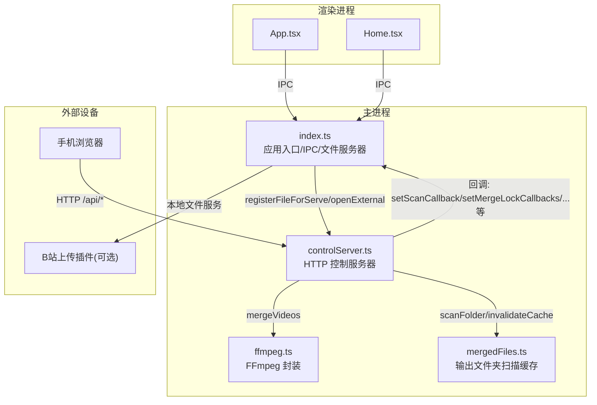
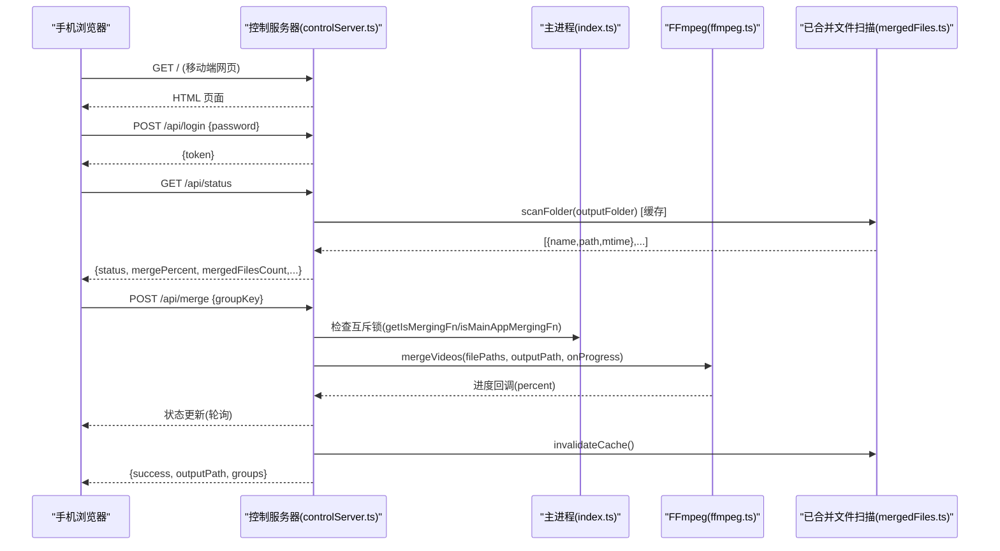
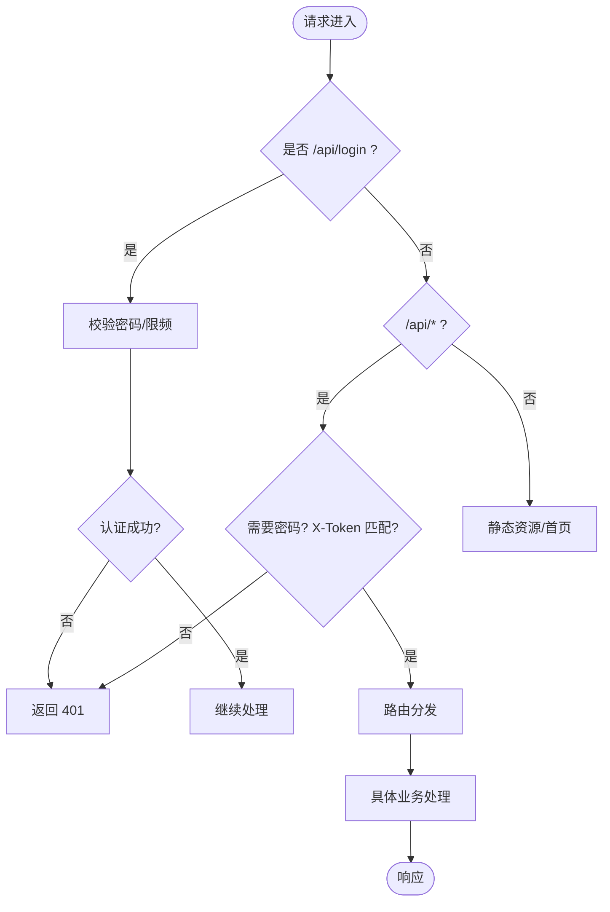
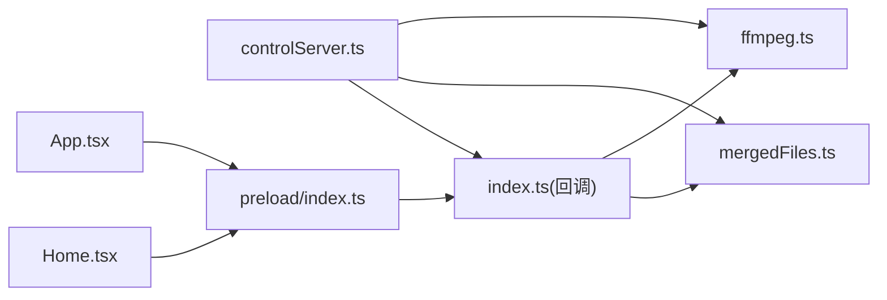

# 移动端控制服务器

<cite>
**本文引用的文件**
- [src/main/controlServer.ts](file://src/main/controlServer.ts)
- [src/main/index.ts](file://src/main/index.ts)
- [src/main/ffmpeg.ts](file://src/main/ffmpeg.ts)
- [src/main/mergedFiles.ts](file://src/main/mergedFiles.ts)
- [src/preload/index.ts](file://src/preload/index.ts)
- [src/renderer/src/App.tsx](file://src/renderer/src/App.tsx)
- [src/renderer/src/pages/Home.tsx](file://src/renderer/src/pages/Home.tsx)
- [package.json](file://package.json)
- [产品需求文档.md](file://产品需求文档.md)
</cite>

## 目录
1. [简介](#简介)
2. [项目结构](#项目结构)
3. [核心组件](#核心组件)
4. [架构总览](#架构总览)
5. [详细组件分析](#详细组件分析)
6. [依赖关系分析](#依赖关系分析)
7. [性能与并发特性](#性能与并发特性)
8. [故障排查指南](#故障排查指南)
9. [结论](#结论)
10. [附录：API 参考](#附录api-参考)

## 简介
本项目是一个基于 Electron + React 的视频合并桌面应用，同时内置一个“局域网手机控制面板”服务。通过该服务，同一 WiFi 下的手机浏览器可以访问本地 Web 页面，完成登录、扫描分组、合并视频、查看已合并文件、批量操作以及配置管理等操作。服务端采用原生 Node.js HTTP 服务，提供 REST API 与内嵌的移动端 HTML 界面，并通过回调机制与主进程（Electron）共享状态与能力。

## 项目结构
- 主进程负责：
  - 启动并管理“移动端控制服务器”
  - 提供 IPC 接口给渲染进程
  - 管理 FFmpeg 任务、进度、互斥锁
  - 提供本地文件服务器供插件使用
- 控制服务器模块负责：
  - 监听局域网端口，处理 REST API
  - 维护应用状态（空闲、扫描中、合并中、投稿中）
  - 调用主进程提供的回调执行扫描、合并、打开外部链接等
  - 提供移动端网页（HTML/CSS/JS 内嵌在 TS 中）
- 渲染进程负责：
  - 展示 UI、发起 IPC 请求
  - 轮询或监听状态变化
  - 显示合并进度、已合并文件列表、设置项等

图表来源
- [src/main/index.ts:1-120](file://src/main/index.ts#L1-L120)
- [src/main/controlServer.ts:1-120](file://src/main/controlServer.ts#L1-L120)
- [src/main/ffmpeg.ts:1-60](file://src/main/ffmpeg.ts#L1-L60)
- [src/main/mergedFiles.ts:1-40](file://src/main/mergedFiles.ts#L1-L40)

章节来源
- [src/main/index.ts:1-120](file://src/main/index.ts#L1-L120)
- [src/main/controlServer.ts:1-120](file://src/main/controlServer.ts#L1-L120)
- [package.json:1-42](file://package.json#L1-L42)
- [产品需求文档.md:1-60](file://产品需求文档.md#L1-L60)

## 核心组件
- 控制服务器（controlServer.ts）
  - 提供 REST API 与移动端网页
  - 维护应用状态、合并进度、排除列表、投稿状态
  - 通过回调与主进程协作（扫描、合并、打开外部链接、互斥锁等）
- 主进程（index.ts）
  - 启动控制服务器，注入回调
  - 实现 performScan 扫描逻辑，按标题+时间间隔分组
  - 管理本地文件服务器（为插件提供临时 URL）
  - 暴露 IPC 接口给渲染进程
- FFmpeg 封装（ffmpeg.ts）
  - 合并 FLV 分段为 MP4（stream copy），支持进度回调、错误友好化、超时与取消
  - 探测视频信息（时长、编码、分辨率）
- 已合并文件扫描（mergedFiles.ts）
  - 扫描输出目录中的 MP4，带缓存与失效机制
  - 根据文件名解析直播时间戳排序
- 预加载与渲染（preload/index.ts, App.tsx, Home.tsx）
  - 统一包装 IPC 调用，自动解包返回结果
  - 渲染端展示状态、进度、设置、已合并文件列表

章节来源
- [src/main/controlServer.ts:1-120](file://src/main/controlServer.ts#L1-L120)
- [src/main/index.ts:1-120](file://src/main/index.ts#L1-L120)
- [src/main/ffmpeg.ts:1-120](file://src/main/ffmpeg.ts#L1-L120)
- [src/main/mergedFiles.ts:1-60](file://src/main/mergedFiles.ts#L1-L60)
- [src/preload/index.ts:1-93](file://src/preload/index.ts#L1-L93)
- [src/renderer/src/App.tsx:1-49](file://src/renderer/src/App.tsx#L1-L49)
- [src/renderer/src/pages/Home.tsx:1-200](file://src/renderer/src/pages/Home.tsx#L1-L200)

## 架构总览
控制服务器作为独立 HTTP 服务运行在主进程中，对外暴露一组 REST API；内部通过回调与主进程共享状态与能力，避免直接耦合。移动端通过浏览器访问控制服务器的首页与 API，完成远程操控。

图表来源
- [src/main/controlServer.ts:280-430](file://src/main/controlServer.ts#L280-L430)
- [src/main/mergedFiles.ts:49-95](file://src/main/mergedFiles.ts#L49-L95)
- [src/main/ffmpeg.ts:169-390](file://src/main/ffmpeg.ts#L169-L390)
- [src/main/index.ts:36-42](file://src/main/index.ts#L36-L42)

## 详细组件分析

### 控制服务器（controlServer.ts）
- 职责
  - 启动 HTTP 服务，监听端口（默认 9820）
  - 路由处理：登录、状态查询、分组列表、扫描、合并、批量合并、投稿、配置读写、排除/恢复分组、手机端直传视频等
  - 移动端网页内嵌（HTML/CSS/JS 字符串）
  - 状态管理：appStatus、mergePercent、currentMergeTask、uploadFileNames 等
  - 认证与限频：可选密码校验，登录失败次数限制（IP 维度）
  - 与主进程协作：通过回调函数进行扫描、合并、打开外部链接、互斥锁、提交完成信号重置等
- 关键设计点
  - 扫描由主进程执行，保证手机列表与桌面端一致（setScanCallback/updateScanResults）
  - 合并互斥：同时检查 isMainAppMergingFn 与 getIsMergingFn，防止桌面端与手机端同时合并
  - 已合并文件列表缓存：5 秒 TTL，减少频繁磁盘扫描
  - 投稿流程：注册本地文件 URL -> 打开 B 站投稿页 -> 等待插件完成信号 -> 自动切换状态
  - 手机端直传视频：接收 raw body，校验扩展名，写入输出目录，刷新缓存

图表来源
- [src/main/controlServer.ts:216-330](file://src/main/controlServer.ts#L216-L330)
- [src/main/controlServer.ts:331-430](file://src/main/controlServer.ts#L331-L430)

章节来源
- [src/main/controlServer.ts:1-120](file://src/main/controlServer.ts#L1-L120)
- [src/main/controlServer.ts:216-330](file://src/main/controlServer.ts#L216-L330)
- [src/main/controlServer.ts:331-430](file://src/main/controlServer.ts#L331-L430)
- [src/main/controlServer.ts:432-492](file://src/main/controlServer.ts#L432-L492)
- [src/main/controlServer.ts:494-570](file://src/main/controlServer.ts#L494-L570)
- [src/main/controlServer.ts:593-673](file://src/main/controlServer.ts#L593-L673)
- [src/main/controlServer.ts:675-731](file://src/main/controlServer.ts#L675-L731)

### 主进程（index.ts）
- 职责
  - 启动控制服务器，注入回调（配置、扫描、互斥锁、文件服务、外部链接等）
  - 实现 performScan：递归扫描输入目录，识别视频文件，按日期+标题+时间间隔分组，过滤录制中/已合并组
  - 本地文件服务器：为插件提供临时 URL，支持完成信号与超时重置
  - IPC 处理器：配置、对话框、扫描、视频处理、进度、网络信息等
- 关键设计点
  - 扫描分组算法：相同标题且时间间隔不超过阈值归为一组；若跨组但同标题且间隔满足阈值可合并到已有组
  - 过滤逻辑：跳过正在录制的 PART 片段；过滤已合并的 MP4（基于输出目录集合）
  - 原子写入配置：先写 .tmp 再重命名，避免中断损坏
  - 配置文件监听：fs.watch 防抖通知渲染进程同步变更

章节来源
- [src/main/index.ts:1-120](file://src/main/index.ts#L1-L120)
- [src/main/index.ts:479-718](file://src/main/index.ts#L479-L718)
- [src/main/index.ts:213-326](file://src/main/index.ts#L213-L326)
- [src/main/index.ts:55-148](file://src/main/index.ts#L55-L148)

### FFmpeg 封装（ffmpeg.ts）
- 职责
  - 合并多个 FLV 为单个 MP4（stream copy，不重新编码）
  - 探测视频信息（时长、编码、分辨率）
  - 错误友好化：将 FFmpeg 原始错误映射为用户可读中文提示
  - 进度上报：优先解析 out_time_ms，fallback 解析 time=
  - 超时与取消：30 分钟超时，支持 SIGTERM/SIGKILL 终止
- 关键设计点
  - 使用 concat demuxer 拼接文件列表，生成临时输出后安全移动到目标路径
  - 预检磁盘空间（statfsSync），不足则拒绝
  - 活跃任务管理 Map，便于取消与清理

章节来源
- [src/main/ffmpeg.ts:1-120](file://src/main/ffmpeg.ts#L1-L120)
- [src/main/ffmpeg.ts:169-390](file://src/main/ffmpeg.ts#L169-L390)
- [src/main/ffmpeg.ts:392-466](file://src/main/ffmpeg.ts#L392-L466)

### 已合并文件扫描（mergedFiles.ts）
- 职责
  - 扫描输出目录中的 MP4 文件，按直播时间倒序排列
  - 提供缓存与失效机制（TTL 12 秒，主动失效）
  - 根据文件名解析直播时间戳（YYYY-MM-DD_HH-mm-ss）
- 关键设计点
  - 缓存键为 folderPath，命中则直接返回
  - findByNames 用于从文件名映射完整路径（投稿时）

章节来源
- [src/main/mergedFiles.ts:1-104](file://src/main/mergedFiles.ts#L1-L104)

### 预加载与渲染（preload/index.ts, App.tsx, Home.tsx）
- 职责
  - preload 统一包装 IPC 调用，自动解包 {success,data,message} 格式
  - App.tsx 初始化主题与语言
  - Home.tsx 加载配置、自动扫描、显示分组、进度、已合并文件、设置抽屉等
- 关键设计点
  - 渲染端通过 window.api 调用后端能力，包括控制服务器地址获取、网络信息、已合并文件列表、投稿等
  - 配置变更监听：onConfigUpdated 回调，手机端修改配置后桌面端同步

章节来源
- [src/preload/index.ts:1-93](file://src/preload/index.ts#L1-L93)
- [src/renderer/src/App.tsx:1-49](file://src/renderer/src/App.tsx#L1-L49)
- [src/renderer/src/pages/Home.tsx:1-200](file://src/renderer/src/pages/Home.tsx#L1-L200)

## 依赖关系分析
- 控制服务器依赖
  - ffmpeg.ts：合并视频
  - mergedFiles.ts：扫描输出目录
  - index.ts：通过回调接入主进程能力（扫描、互斥锁、文件服务、外部链接）
- 主进程依赖
  - controlServer.ts：启动与控制
  - ffmpeg.ts：合并与转换
  - mergedFiles.ts：输出目录扫描
- 渲染进程依赖
  - preload/index.ts：IPC 桥接
  - App.tsx/Home.tsx：UI 与交互

图表来源
- [src/main/controlServer.ts:1-120](file://src/main/controlServer.ts#L1-L120)
- [src/main/index.ts:1-120](file://src/main/index.ts#L1-L120)
- [src/preload/index.ts:1-93](file://src/preload/index.ts#L1-L93)

章节来源
- [src/main/controlServer.ts:1-120](file://src/main/controlServer.ts#L1-L120)
- [src/main/index.ts:1-120](file://src/main/index.ts#L1-L120)
- [src/preload/index.ts:1-93](file://src/preload/index.ts#L1-L93)

## 性能与并发特性
- 扫描优化
  - 控制服务器复用主进程扫描结果，避免重复扫描
  - 已合并文件列表缓存（5 秒 TTL），降低高频轮询对磁盘的压力
- 合并性能
  - 使用 stream copy 模式，不重新编码，速度接近 I/O 上限
  - 预估总时长基于首个文件大小与时长推算，提高进度准确性
  - 磁盘空间预检，避免中途失败
- 并发与互斥
  - 合并互斥锁：桌面端与手机端同时合并会被拒绝
  - 扫描互斥标志：防止并发扫描导致状态不一致
- 内存与资源
  - 活跃合并任务 Map 管理子进程，支持取消与清理
  - 本地文件服务器定期清理过期注册（30 分钟未访问）

[本节为通用性能讨论，无需特定文件引用]

## 故障排查指南
- 登录失败频繁被限流
  - 现象：POST /api/login 返回 429
  - 原因：同一 IP 在 60 秒内失败超过 5 次
  - 解决：等待 60 秒后重试，或检查密码配置
- 合并失败常见错误
  - 权限问题：无法写入输出目录
  - 源文件不存在：路径错误或文件被占用
  - 格式不兼容/损坏：FLV 头异常或编码不支持
  - 内存不足：系统 OOM 或进程被终止
  - 建议：查看 FFmpeg 错误友好化消息，确认输出目录权限与磁盘空间
- 进度不更新
  - 可能原因：out_time_ms 解析失败，回退到 time= 解析
  - 建议：检查 FFmpeg 版本与输出格式，确保控制台能输出进度行
- 已合并文件列表不刷新
  - 可能原因：缓存未失效
  - 解决：触发 invalidateCache（合并完成后会自动调用）

章节来源
- [src/main/controlServer.ts:240-270](file://src/main/controlServer.ts#L240-L270)
- [src/main/ffmpeg.ts:18-37](file://src/main/ffmpeg.ts#L18-L37)
- [src/main/mergedFiles.ts:25-31](file://src/main/mergedFiles.ts#L25-L31)

## 结论
移动端控制服务器以轻量 HTTP 服务形式嵌入主进程，通过回调机制与桌面端深度协作，实现了“手机即遥控器”的便捷体验。其设计兼顾了安全性（可选密码与限频）、一致性（共享扫描结果与互斥锁）、性能（缓存与 stream copy）与可维护性（模块化与测试覆盖）。对于直播录屏用户而言，这一方案显著降低了操作门槛，提升了合并与投稿效率。

[本节为总结，无需特定文件引用]

## 附录：API 参考
以下列出控制服务器主要 REST API（仅描述用途与参数要点，不包含代码内容）：

- 认证
  - POST /api/login
    - 请求体：{ password }
    - 成功返回：{ success: true, token }
    - 失败返回：401 或 429（限频）
- 状态
  - GET /api/status
    - 返回：应用状态、合并进度、当前任务、已合并文件数量、投稿文件名列表等
- 分组
  - GET /api/groups
    - 返回：上次扫描的分组列表
  - POST /api/scan
    - 触发扫描（使用主进程扫描逻辑），返回最新分组
  - POST /api/groups/exclude
    - 请求体：{ keys[] }
    - 功能：排除指定分组，持久化 hiddenFolderKeys，同步主进程
  - POST /api/groups/restore
    - 请求体：{ keys[] }
    - 功能：恢复指定分组，重新扫描并应用新的排除列表
  - GET /api/groups/excluded
    - 返回：被排除的分组详情（需全量扫描）
- 合并
  - POST /api/merge
    - 请求体：{ groupKey }
    - 功能：合并单组分组的视频片段，返回输出路径与最新分组
  - POST /api/merge/batch
    - 请求体：{ groupKeys[] }
    - 功能：批量合并多个分组，返回所有输出路径与最新分组
- 投稿
  - POST /api/upload
    - 请求体：{ filePaths[] | fileNames[] }
    - 功能：注册本地文件 URL，打开 B 站投稿页，保持 uploading 状态直到插件完成
  - POST /api/upload/reset
    - 功能：手动重置投稿状态
- 配置
  - GET /api/config
    - 返回：当前配置对象
  - POST /api/config
    - 请求体：部分配置字段
    - 功能：增量更新配置并持久化
- 手机端直传视频
  - POST /api/upload/video?name=xxx.mp4
    - 请求体：raw 二进制数据
    - 功能：校验扩展名，写入输出目录，刷新缓存

章节来源
- [src/main/controlServer.ts:232-330](file://src/main/controlServer.ts#L232-L330)
- [src/main/controlServer.ts:331-430](file://src/main/controlServer.ts#L331-L430)
- [src/main/controlServer.ts:432-492](file://src/main/controlServer.ts#L432-L492)
- [src/main/controlServer.ts:494-570](file://src/main/controlServer.ts#L494-L570)
- [src/main/controlServer.ts:593-673](file://src/main/controlServer.ts#L593-L673)
- [src/main/controlServer.ts:675-731](file://src/main/controlServer.ts#L675-L731)