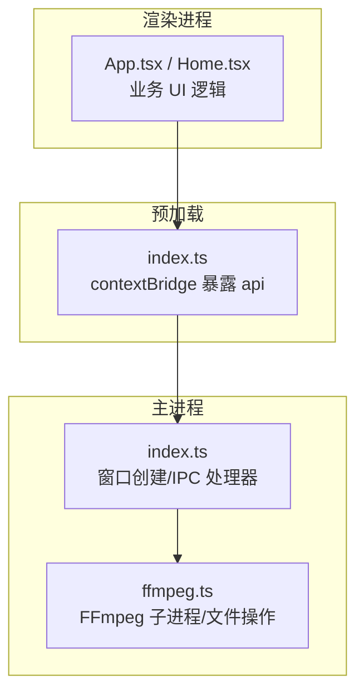
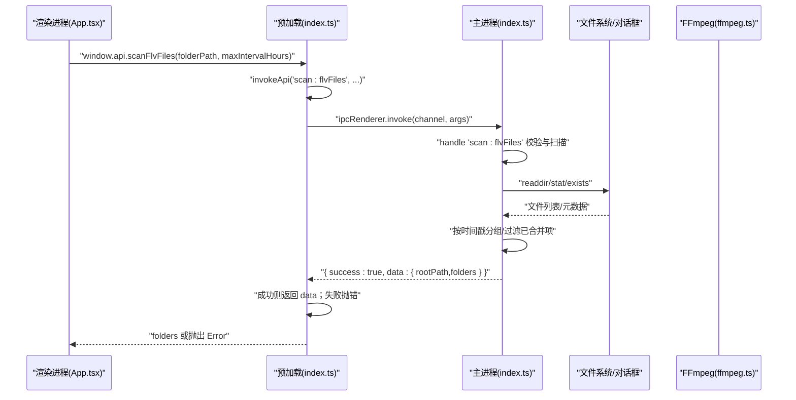
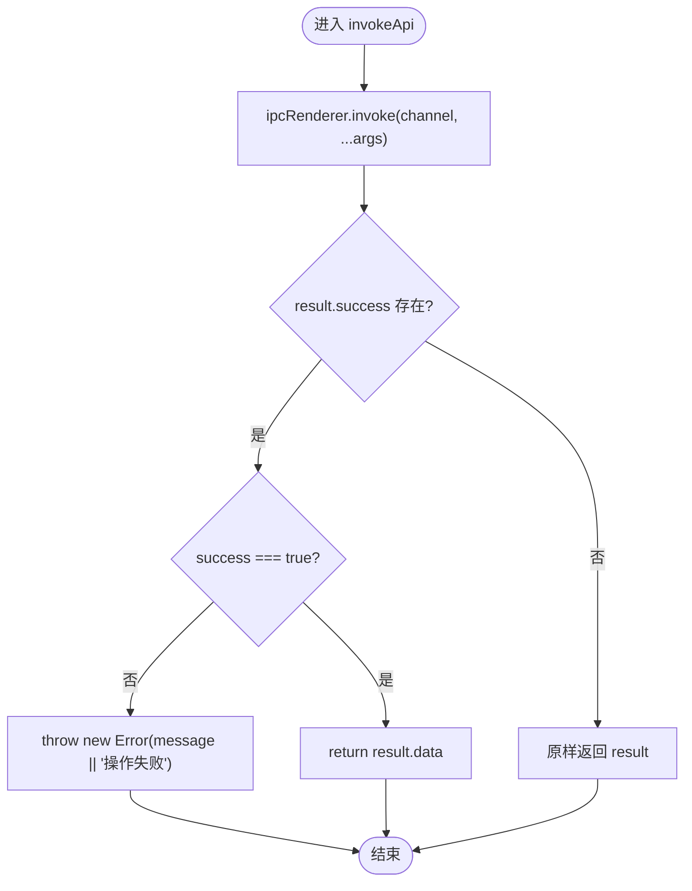
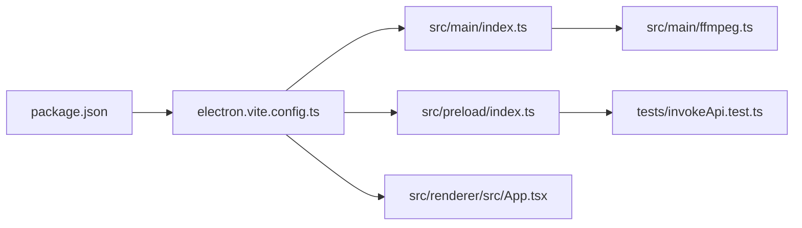

# 预加载安全层

<cite>
**本文引用的文件**   
- [src/preload/index.ts](file://src/preload/index.ts)
- [src/main/index.ts](file://src/main/index.ts)
- [src/main/ffmpeg.ts](file://src/main/ffmpeg.ts)
- [src/renderer/src/App.tsx](file://src/renderer/src/App.tsx)
- [electron.vite.config.ts](file://electron.vite.config.ts)
- [package.json](file://package.json)
- [tests/invokeApi.test.ts](file://tests/invokeApi.test.ts)
- [deliverables/software-company/视频合并app-增量设计-2026-07-06.md](file://deliverables/software-company/视频合并app-增量设计-2026-07-06.md)
- [deliverables/software-company/视频合并app-QA验证-2026-07-06.md](file://deliverables/software-company/视频合并app-QA验证-2026-07-06.md)
</cite>

## 目录
1. [引言](#引言)
2. [项目结构](#项目结构)
3. [核心组件](#核心组件)
4. [架构总览](#架构总览)
5. [详细组件分析](#详细组件分析)
6. [依赖关系分析](#依赖关系分析)
7. [性能与安全权衡](#性能与安全权衡)
8. [故障排查指南](#故障排查指南)
9. [结论](#结论)
10. [附录：安全审计清单与最佳实践](#附录安全审计清单与最佳实践)

## 引言
本文件面向安全开发者，系统化阐述本 Electron 应用的“预加载安全层”设计与实现。重点覆盖以下主题：
- contextBridge 的安全 API 暴露机制、权限控制与沙箱隔离原理
- 安全的 IPC 调用封装、错误处理策略与异常捕获
- 为什么需要预加载脚本、安全风险防护措施与最佳实践
- API 白名单设计、参数验证与安全边界定义
- 安全审计清单与常见漏洞防护方案

## 项目结构
本项目采用主进程（main）、预加载（preload）与渲染进程（renderer）三进程模型，结合 Electron 的上下文隔离能力，将系统级能力收敛在预加载层并通过最小化 API 暴露给渲染进程。

图表来源
- [src/main/index.ts:69-97](file://src/main/index.ts#L69-L97)
- [src/preload/index.ts:1-64](file://src/preload/index.ts#L1-L64)
- [src/main/ffmpeg.ts:1-305](file://src/main/ffmpeg.ts#L1-L305)
- [src/renderer/src/App.tsx:1-49](file://src/renderer/src/App.tsx#L1-L49)

章节来源
- [src/main/index.ts:69-97](file://src/main/index.ts#L69-L97)
- [src/preload/index.ts:1-64](file://src/preload/index.ts#L1-L64)
- [src/main/ffmpeg.ts:1-305](file://src/main/ffmpeg.ts#L1-L305)
- [src/renderer/src/App.tsx:1-49](file://src/renderer/src/App.tsx#L1-L49)

## 核心组件
- 预加载桥接层：通过 contextBridge.exposeInMainWorld 向渲染进程暴露受限 API，统一封装 invokeApi 对 IPC 返回结果进行解包与错误抛出。
- 主进程 IPC 处理器：集中注册 channel 处理器，执行文件系统、对话框、FFmpeg 等系统能力，并维护进度状态。
- FFmpeg 集成：在主进程内通过 spawn 或 fluent-ffmpeg 启动外部二进制，完成视频信息探测、合并与转码。
- 渲染进程：仅通过 window.api 调用受控接口，不直接访问 Node/Electron 原生对象。

章节来源
- [src/preload/index.ts:9-49](file://src/preload/index.ts#L9-L49)
- [src/main/index.ts:101-498](file://src/main/index.ts#L101-L498)
- [src/main/ffmpeg.ts:65-305](file://src/main/ffmpeg.ts#L65-L305)
- [src/renderer/src/App.tsx:10-30](file://src/renderer/src/App.tsx#L10-L30)

## 架构总览
下图展示从渲染进程到主进程的完整调用链，包括预加载层的统一封装与主进程的错误包装约定。

图表来源
- [src/preload/index.ts:9-18](file://src/preload/index.ts#L9-L18)
- [src/main/index.ts:146-345](file://src/main/index.ts#L146-L345)
- [src/main/ffmpeg.ts:87-245](file://src/main/ffmpeg.ts#L87-L245)

## 详细组件分析

### 预加载层：contextBridge 暴露与 invokeApi 封装
- 暴露策略：仅在 process.contextIsolated 为真时通过 contextBridge.exposeInMainWorld 注入 window.api 与 electronAPI；否则回退到 window 直挂（兼容旧环境）。
- 统一封装：invokeApi 负责调用 ipcRenderer.invoke，并对后端统一返回格式 { success, data?, message? } 进行解包：success=false 时抛出 Error，success=true 时返回 data。
- 安全边界：仅暴露必要方法（配置、对话框、扫描、视频处理、进度），避免直接暴露原始 ipcRenderer 或 Node API。

图表来源
- [src/preload/index.ts:9-18](file://src/preload/index.ts#L9-L18)

章节来源
- [src/preload/index.ts:20-63](file://src/preload/index.ts#L20-L63)
- [tests/invokeApi.test.ts:14-22](file://tests/invokeApi.test.ts#L14-L22)

### 主进程：IPC 处理器与系统能力收敛
- 窗口与偏好设置：创建 BrowserWindow 时指定 preload 路径，当前 sandbox 设置为 false（见下文“风险与建议”）。
- IPC 通道：集中注册 config、dialog、scan、video、progress 等通道，统一以 { success, data?, message? } 返回。
- 进度管理：使用内存变量与 Map 存储单任务与批量任务的进度，供渲染进程轮询获取。
- 外部程序：通过 spawn 或 fluent-ffmpeg 调用 FFmpeg，所有危险操作均在主进程执行，渲染进程不可直达。

章节来源
- [src/main/index.ts:69-97](file://src/main/index.ts#L69-L97)
- [src/main/index.ts:101-498](file://src/main/index.ts#L101-L498)
- [src/main/ffmpeg.ts:1-305](file://src/main/ffmpeg.ts#L1-L305)

### 渲染进程：最小权限调用
- 仅通过 window.api 调用受控接口，如 loadConfig/saveConfig/scanFlvFiles/video:* 等。
- 错误处理：基于 invokeApi 的抛错约定，上层 try/catch 即可捕获业务错误。

章节来源
- [src/renderer/src/App.tsx:10-30](file://src/renderer/src/App.tsx#L10-L30)

## 依赖关系分析
- 构建与打包：electron-vite 负责 main/preload/renderer 三方构建；@electron-toolkit/preload 提供基础 electronAPI 暴露。
- 运行时依赖：electron 提供进程与窗口能力；fluent-ffmpeg 与 @ffmpeg-installer/ffmpeg 用于媒体处理。
- 测试：vitest 对 invokeApi 解包逻辑进行单元测试，确保前后端契约一致。

图表来源
- [package.json:1-42](file://package.json#L1-L42)
- [electron.vite.config.ts:1-21](file://electron.vite.config.ts#L1-L21)
- [src/main/index.ts:1-6](file://src/main/index.ts#L1-L6)
- [src/preload/index.ts:1-3](file://src/preload/index.ts#L1-L3)
- [src/renderer/src/App.tsx:1-5](file://src/renderer/src/App.tsx#L1-L5)
- [tests/invokeApi.test.ts:1-6](file://tests/invokeApi.test.ts#L1-6)

章节来源
- [package.json:17-40](file://package.json#L17-L40)
- [electron.vite.config.ts:5-20](file://electron.vite.config.ts#L5-L20)

## 性能与安全权衡
- 预加载层职责单一：只做最小化 API 暴露与 IPC 解包，避免引入额外计算。
- 主进程串行/并行：批量合并通过并发 worker 提升吞吐，但需限制 concurrency 防止资源耗尽。
- 进度轮询：渲染进程定时轮询 progress:get/getBatch，简单可靠，但应合理设置间隔（设计文档建议 300ms 级别常量）。

[本节为通用讨论，不直接分析具体文件]

## 故障排查指南
- 预加载未生效：确认 webPreferences.preload 指向正确且 contextIsolation 开启；检查 process.contextIsolated 分支是否走 contextBridge 注入。
- IPC 无响应：核对 channel 名称与主进程 handler 注册一致；查看主进程日志与返回值是否符合 { success, data?, message? } 约定。
- 错误被吞：渲染侧 try/catch 捕获 invokeApi 抛出的 Error；主进程 handler 中 catch 后返回 { success:false, message }。
- 沙箱相关报错：若启用 sandbox:true，需确保 preload 仅使用 contextBridge/ipcRenderer，避免 Node API 直接访问。

章节来源
- [src/preload/index.ts:51-63](file://src/preload/index.ts#L51-L63)
- [src/main/index.ts:101-110](file://src/main/index.ts#L101-L110)
- [tests/invokeApi.test.ts:40-48](file://tests/invokeApi.test.ts#L40-L48)

## 结论
本项目通过预加载层实现了“最小权限 + 统一封装”的安全基线：渲染进程仅能调用受限 API，所有系统能力集中在主进程并由统一返回协议约束。当前实现已具备较好的可维护性与可扩展性，但在沙箱隔离、CSP 与 IPC 白名单方面仍有加固空间（详见附录）。

[本节为总结性内容，不直接分析具体文件]

## 附录：安全审计清单与最佳实践

### 1) 为什么需要预加载脚本
- 隔离原则：渲染进程默认不应拥有 Node/Electron 原生能力，预加载作为唯一可信桥梁，收敛权限入口。
- 最小暴露：仅暴露业务必需 API，避免直接暴露 ipcRenderer 或全局危险对象。
- 统一契约：通过 invokeApi 统一解包与错误语义，降低上层调用复杂度与出错概率。

章节来源
- [src/preload/index.ts:20-49](file://src/preload/index.ts#L20-L49)
- [src/preload/index.ts:9-18](file://src/preload/index.ts#L9-L18)

### 2) contextBridge 安全 API 暴露机制与权限控制
- 条件注入：仅在 contextIsolated 环境下使用 contextBridge.exposeInMainWorld 注入；非隔离环境回退到 window 直挂（兼容模式）。
- 白名单式暴露：api 对象仅包含配置、对话框、扫描、视频处理、进度等方法，不包含底层 ipcRenderer。
- 类型与契约：前端通过 window.api 调用，后端统一返回 { success, data?, message? }，失败抛错由 invokeApi 统一处理。

章节来源
- [src/preload/index.ts:51-63](file://src/preload/index.ts#L51-L63)
- [src/preload/index.ts:20-49](file://src/preload/index.ts#L20-L49)
- [tests/invokeApi.test.ts:14-22](file://tests/invokeApi.test.ts#L14-L22)

### 3) 沙箱隔离原理与现状
- 概念：sandbox:true 会进一步限制渲染进程能力，禁止直接访问 Node API，仅允许受控 API（如 ipcRenderer/contextBridge）。
- 现状：当前窗口 webPreferences.sandbox 设置为 false（见下节“风险与建议”），因此尚未启用渲染进程沙箱。
- 影响：启用 sandbox 后，需确保 preload 仅使用 contextBridge/ipcRenderer，任何 Node API 调用必须迁移至主进程。

章节来源
- [src/main/index.ts:77-81](file://src/main/index.ts#L77-L81)
- [deliverables/software-company/视频合并app-增量设计-2026-07-06.md:344-353](file://deliverables/software-company/视频合并app-增量设计-2026-07-06.md#L344-L353)

### 4) 安全的 IPC 调用封装与错误处理
- 统一封装：invokeApi 负责调用 ipcRenderer.invoke，并对返回体进行解包与错误抛出。
- 主进程约定：所有 handler 返回 { success, data?, message? }，失败时携带 message。
- 渲染侧处理：try/catch 捕获 invokeApi 抛出的 Error，向上层传递用户可读消息。

章节来源
- [src/preload/index.ts:9-18](file://src/preload/index.ts#L9-L18)
- [src/main/index.ts:101-110](file://src/main/index.ts#L101-L110)
- [tests/invokeApi.test.ts:40-48](file://tests/invokeApi.test.ts#L40-L48)

### 5) API 白名单设计与参数验证
- 白名单守卫：设计文档提出通过 safeHandle 与 ALLOWED_IPC_CHANNELS 白名单注册 channel，拒绝未授权通道。
- 入参校验：folderPath/outputPath 需满足非空、绝对路径、存在/可写、不在 BLOCKED_PATH_ROOTS 等规则。
- 当前实现：主进程各 handler 直接注册，尚未看到统一的 safeHandle 与白名单注册代码（见“待落地项”）。

章节来源
- [deliverables/software-company/视频合并app-增量设计-2026-07-06.md:455-477](file://deliverables/software-company/视频合并app-增量设计-2026-07-06.md#L455-L477)
- [deliverables/software-company/视频合并app-增量设计-class.mermaid:54-79](file://deliverables/software-company/视频合并app-增量设计-class.mermaid#L54-L79)

### 6) 安全边界定义与外部程序调用
- 外部程序：FFmpeg 在主进程通过 spawn 或 fluent-ffmpeg 调用，渲染进程不可直达，符合最小权限原则。
- 路径安全：输出目录创建、临时文件写入均位于 tmpdir 或用户可控目录，应避免任意路径写入。
- 超时保护：合并流程设置了超时与清理逻辑，避免长时间占用资源。

章节来源
- [src/main/ffmpeg.ts:87-245](file://src/main/ffmpeg.ts#L87-L245)
- [src/main/index.ts:390-403](file://src/main/index.ts#L390-L403)

### 7) 常见安全风险与防护方案
- 风险：渲染进程可直接访问 Node/Electron 原生对象（当前 sandbox:false）。
  - 防护：启用 sandbox:true，移除对 Node API 的直接依赖，仅通过 contextBridge 暴露受限 API。
- 风险：IPC 通道未做白名单与入参校验。
  - 防护：引入 safeHandle 与 ALLOWED_IPC_CHANNELS，对所有输入进行严格校验与越界检查。
- 风险：CSP 缺失导致远程脚本注入风险。
  - 防护：在生产环境设置 session.setContentSecurityPolicy，限制 script-src/style-src 等源。
- 风险：userData 误置安装/项目目录导致配置持久化失效。
  - 防护：回归 app.getPath('userData') 默认路径，并提供迁移逻辑兼容旧配置。

章节来源
- [src/main/index.ts:77-81](file://src/main/index.ts#L77-L81)
- [deliverables/software-company/视频合并app-增量设计-2026-07-06.md:344-353](file://deliverables/software-company/视频合并app-增量设计-2026-07-06.md#L344-L353)
- [deliverables/software-company/视频合并app-增量设计-2026-07-06.md:455-477](file://deliverables/software-company/视频合并app-增量设计-2026-07-06.md#L455-L477)

### 8) 安全审计清单（建议逐项核对）
- 预加载层
  - 仅通过 contextBridge 暴露最小 API 集合
  - 不直接引用 Node/Electron 原生模块
  - 统一 invokeApi 解包与错误抛出
- 主进程
  - 所有 IPC 通道经白名单注册（safeHandle）
  - 所有路径参数进行合法性与越界校验
  - 外部程序调用（spawn/child_process）在主进程执行
  - 错误统一包装为 { success:false, message }
- 渲染进程
  - 仅通过 window.api 调用
  - 错误处理完备（try/catch）
- 运行期
  - 启用 sandbox:true（若可行）
  - 设置 CSP（生产环境）
  - userData 回归默认路径并支持迁移

章节来源
- [src/preload/index.ts:20-63](file://src/preload/index.ts#L20-L63)
- [src/main/index.ts:101-498](file://src/main/index.ts#L101-L498)
- [deliverables/software-company/视频合并app-增量设计-2026-07-06.md:455-477](file://deliverables/software-company/视频合并app-增量设计-2026-07-06.md#L455-L477)

### 9) 最佳实践
- 渐进式加固：优先落实 CSP + IPC 白名单 + 收敛 electronAPI；再评估 sandbox:true 的可行性与回归成本。
- 常量与类型集中管理：魔法值与共享类型统一到 shared/constants.ts 与 shared/types.ts，避免散落硬编码。
- 错误语义一致：前后端统一 { success, data?, message? } 约定，前端统一解包与抛错。
- 测试驱动：对关键路径（invokeApi、路径校验、safeHandle）补充单测，保障契约稳定。

章节来源
- [deliverables/software-company/视频合并app-增量设计-2026-07-06.md:455-477](file://deliverables/software-company/视频合并app-增量设计-2026-07-06.md#L455-L477)
- [tests/invokeApi.test.ts:1-70](file://tests/invokeApi.test.ts#L1-70)