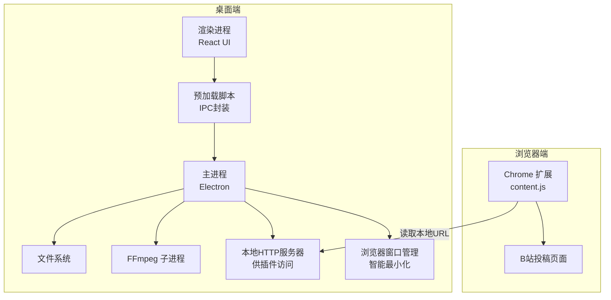
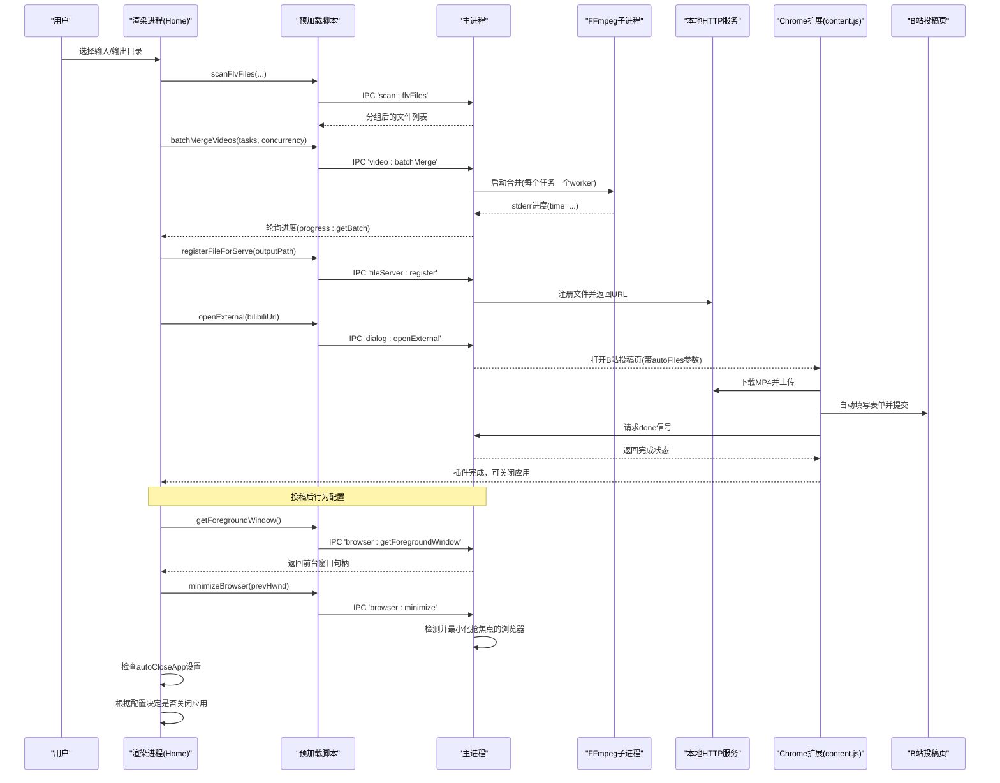
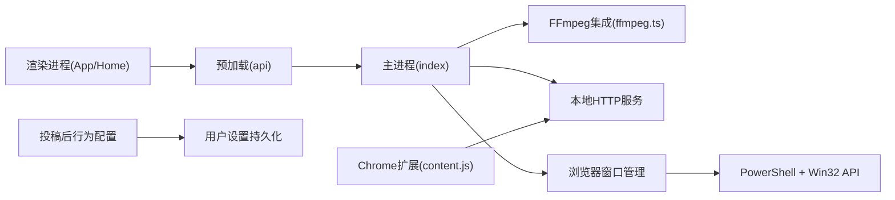
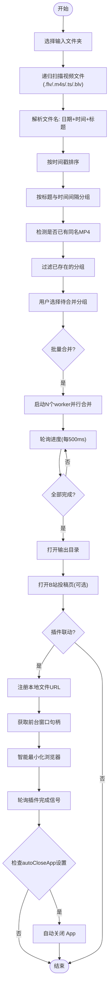
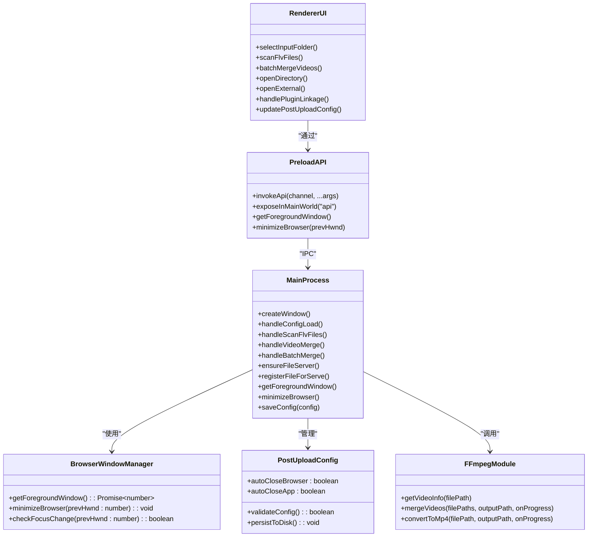

# B站集成系统

<cite>
**本文引用的文件**   
- [package.json](file://package.json)
- [产品需求文档.md](file://产品需求文档.md)
- [src/main/index.ts](file://src/main/index.ts)
- [src/main/ffmpeg.ts](file://src/main/ffmpeg.ts)
- [src/preload/index.ts](file://src/preload/index.ts)
- [src/renderer/src/App.tsx](file://src/renderer/src/App.tsx)
- [src/renderer/src/pages/Home.tsx](file://src/renderer/src/pages/Home.tsx)
- [bilibili-extension/manifest.json](file://bilibili-extension/manifest.json)
- [bilibili-extension/content.js](file://bilibili-extension/content.js)
- [bilibili-extension/popup.js](file://bilibili-extension/popup.js)
- [electron.vite.config.ts](file://electron.vite.config.ts)
- [tests/ffmpegParsing.test.ts](file://tests/ffmpegParsing.test.ts)
- [tests/fileGrouping.test.ts](file://tests/fileGrouping.test.ts)
</cite>

## 更新摘要
**变更内容**   
- 新增投稿后行为配置选项（autoCloseBrowser、autoCloseApp），增强用户对上传流程的控制能力
- 增强可见性设置处理机制，改进B站自定义UI组件兼容性
- 改进浏览器窗口管理逻辑，提供更智能的焦点检测和最小化功能
- 优化插件联动流程，实现更无缝的自动化投稿体验

## 目录
1. [简介](#简介)
2. [项目结构](#项目结构)
3. [核心组件](#核心组件)
4. [架构总览](#架构总览)
5. [详细组件分析](#详细组件分析)
6. [依赖关系分析](#依赖关系分析)
7. [性能与可靠性](#性能与可靠性)
8. [故障排查指南](#故障排查指南)
9. [结论](#结论)
10. [附录](#附录)

## 简介
本项目是一个面向直播录制的桌面应用，主要解决"将多段FLV分段视频合并为单个MP4"的需求，并进一步提供与B站投稿流程的联动能力。用户选择录制文件夹后，应用自动扫描、按标题和时间间隔分组识别同一场直播的分段文件，支持批量并行合并，并在完成后自动打开输出目录和B站投稿页面；若启用插件联动，可将本地生成的MP4通过内置HTTP服务提供给Chrome插件，实现自动上传与提交。**最新的功能增强包括投稿后行为配置选项，允许用户自定义是否自动最小化浏览器窗口和自动关闭应用程序，以及增强的可见性设置处理机制，显著提升了用户体验和控制能力。**

## 项目结构
- 主进程（Electron）：负责文件系统操作、FFmpeg调用、IPC接口、配置持久化、本地文件服务器、**智能浏览器窗口管理**等
- 预加载脚本：封装IPC调用，向渲染进程暴露统一API
- 渲染进程（React + Ant Design）：提供UI交互、进度展示、设置面板、批量任务管理
- Chrome扩展：在B站投稿页注入自动化脚本，完成上传、填写表单、封面设置与提交
- 测试用例：覆盖FFmpeg解析逻辑与文件分组算法

**图表来源**
- [src/main/index.ts:1-724](file://src/main/index.ts#L1-L724)
- [src/main/ffmpeg.ts:1-305](file://src/main/ffmpeg.ts#L1-L305)
- [src/preload/index.ts:1-77](file://src/preload/index.ts#L1-L77)
- [src/renderer/src/pages/Home.tsx:1-872](file://src/renderer/src/pages/Home.tsx#L1-L872)
- [bilibili-extension/content.js:1-1037](file://bilibili-extension/content.js#L1-L1037)

章节来源
- [package.json:1-42](file://package.json#L1-L42)
- [electron.vite.config.ts:1-21](file://electron.vite.config.ts#L1-L21)

## 核心组件
- 主进程模块
  - IPC路由与业务编排：文件夹选择、扫描、合并、转换、批量处理、进度轮询、本地文件服务、**智能浏览器窗口管理**、外部链接与窗口控制
  - 配置管理：读写用户数据目录下的JSON配置文件，持久化输入/输出路径、并发数、时间阈值、**投稿后行为配置**等
- FFmpeg集成模块
  - 快速探测：仅读取文件头获取时长、编码、分辨率等信息
  - 合并：使用concat demuxer直接拼接多个FLV并输出MP4（流拷贝，不重新编码）
  - 转换：对单文件进行转码（H.264 + AAC），优化MP4头部以便在线播放
- 预加载脚本
  - 统一封装IPC调用，返回标准化结果对象，失败时抛出错误
- 渲染界面
  - 主题切换、设置抽屉、分组列表、批量任务进度、自动打开目录/网站、**智能浏览器窗口管理**、插件联动流程
- B站扩展
  - 在投稿页注入助手面板，自动上传、设置创作声明、**增强的可见范围设置**、封面、提交；支持多P批量上传

**章节来源**
- [src/main/index.ts:1-724](file://src/main/index.ts#L1-L724)
- [src/main/ffmpeg.ts:1-305](file://src/main/ffmpeg.ts#L1-L305)
- [src/preload/index.ts:1-77](file://src/preload/index.ts#L1-L77)
- [src/renderer/src/App.tsx:1-49](file://src/renderer/src/App.tsx#L1-L49)
- [src/renderer/src/pages/Home.tsx:1-872](file://src/renderer/src/pages/Home.tsx#L1-L872)
- [bilibili-extension/manifest.json:1-18](file://bilibili-extension/manifest.json#L1-18)
- [bilibili-extension/content.js:1-1037](file://bilibili-extension/content.js#L1-1037)

## 架构总览
整体采用Electron三进程模型：主进程承载系统与媒体处理能力，预加载桥接安全API，渲染进程专注交互。FFmpeg以子进程方式运行，避免阻塞主线程。本地HTTP服务作为桥接层，让Chrome扩展能跨域访问本地生成的MP4，从而完成自动化投稿。**最新的架构增强包括投稿后行为配置系统和改进的浏览器窗口管理，确保在打开外部浏览器时不会抢占用户当前工作焦点，并提供更灵活的自动化控制选项。**

**图表来源**
- [src/main/index.ts:1-724](file://src/main/index.ts#L1-L724)
- [src/main/ffmpeg.ts:1-305](file://src/main/ffmpeg.ts#L1-L305)
- [src/preload/index.ts:1-77](file://src/preload/index.ts#L1-L77)
- [src/renderer/src/pages/Home.tsx:1-872](file://src/renderer/src/pages/Home.tsx#L1-L872)
- [bilibili-extension/content.js:1-1037](file://bilibili-extension/content.js#L1-1037)

## 详细组件分析

### 主进程（Electron）
- 职责
  - 窗口创建与生命周期管理
  - 配置加载/保存（userData/config.json）
  - 文件夹选择与递归扫描，按文件名中的日期+时间+标题解析，基于时间间隔阈值进行同场直播分组
  - 合并/转换任务调度与进度上报
  - 批量并行合并（工作队列+Promise.all）
  - 本地HTTP服务：为插件提供MP4下载与完成信号
  - **智能浏览器窗口管理：获取前台窗口句柄、检测焦点变化、自动最小化抢焦点的外部浏览器**
  - 外部链接与系统目录打开
- 关键设计点
  - 扫描分组：先按时间戳排序，再根据标题一致性与最大间隔阈值合并到同一组；同时检测是否已存在同名MP4以避免重复合并
  - 进度估算：基于首个文件的时长与大小推算总时长，结合stderr中time字段计算百分比
  - 超时保护：合并任务最长30分钟，超时清理临时文件并报错
  - 并发控制：通过固定数量worker并行执行任务，避免过多IO争用
  - **智能窗口管理：仅在Windows平台生效，通过PowerShell调用Win32 API获取前台窗口句柄，延迟2秒后检查是否有新窗口抢占焦点，如有则自动最小化**

**更新** 新增投稿后行为配置选项（autoCloseBrowser、autoCloseApp），增强配置管理系统

**章节来源**
- [src/main/index.ts:1-724](file://src/main/index.ts#L1-724)

### FFmpeg集成
- 职责
  - 快速探测：仅读文件头，提取Duration、是否有音视频流、分辨率、编码
  - 合并：使用concat demuxer直接拼接，stream copy模式，速度极快
  - 转换：libx264 + aac编码，添加faststart优化
- 关键设计点
  - 打包适配：asar内无法直接spawn exe，需重定向至unpacked目录
  - 进度解析：正则匹配stderr中的time字段，换算为百分比
  - 健壮性：跳过被占用的源文件，生成临时输出后再原子替换目标文件

**章节来源**
- [src/main/ffmpeg.ts:1-305](file://src/main/ffmpeg.ts#L1-L305)
- [tests/ffmpegParsing.test.ts:1-148](file://tests/ffmpegParsing.test.ts#L1-L148)

### 预加载脚本
- 职责
  - 封装ipcRenderer.invoke，统一成功/失败返回值格式
  - 向渲染进程暴露api命名空间，包含配置、文件、视频处理、进度、文件服务、**浏览器窗口管理**等API
- 关键设计点
  - 错误透传：后端返回{success:false,message}时抛错，前端可直接catch
  - **新增API：getForegroundWindow()获取前台窗口句柄，minimizeBrowser(prevHwnd)最小化抢焦点的浏览器**

**更新** 新增浏览器窗口管理相关API接口

**章节来源**
- [src/preload/index.ts:1-77](file://src/preload/index.ts#L1-L77)

### 渲染界面（React + AntD）
- 职责
  - 主题与国际化配置
  - 输入/输出目录选择与自动扫描
  - 分组列表展示、隐藏/恢复分组
  - 批量合并任务发起、总体与单项进度显示
  - 合并完成后自动打开输出目录与B站投稿页，**智能最小化浏览器窗口并等待插件完成**
  - **投稿后行为配置：支持用户自定义是否自动最小化浏览器和自动关闭应用程序**
- 关键设计点
  - 进度轮询：每500ms从主进程拉取批量进度，计算总体进度
  - 自动化联动：根据开关决定是否注册本地文件URL、打开网站、**智能窗口管理**、轮询完成信号后关闭应用
  - **智能窗口流程：在打开浏览器前记录前台窗口句柄，打开后检查是否有新窗口抢占焦点，如有则自动最小化**
  - **配置管理：新增autoCloseBrowser和autoCloseApp配置项，支持用户自定义投稿后行为**

**更新** 集成投稿后行为配置功能，增强用户控制和自动化体验

**章节来源**
- [src/renderer/src/App.tsx:1-49](file://src/renderer/src/App.tsx#L1-L49)
- [src/renderer/src/pages/Home.tsx:1-872](file://src/renderer/src/pages/Home.tsx#L1-L872)

### B站扩展（Chrome Extension）
- 职责
  - 在投稿页注入助手面板，自动上传视频、设置创作声明、**增强的可见范围设置**、封面、提交
  - 支持多P批量上传，自动点击队列卡片进入编辑页继续上传
- 关键设计点
  - 元素定位：多种选择器与文本匹配策略，兼容动态DOM
  - 截帧封面：从视频截取一帧生成图片，上传为封面
  - 与桌面端协作：通过http://127.0.0.1端口下载MP4，完成后回调桌面端
  - **增强的可见性设置：改进check-radio-v2组件兼容性，支持多种UI结构和备用定位方案**

**更新** 增强可见性设置处理机制，改进B站自定义UI组件兼容性

**章节来源**
- [bilibili-extension/manifest.json:1-18](file://bilibili-extension/manifest.json#L1-18)
- [bilibili-extension/content.js:1-1037](file://bilibili-extension/content.js#L1-1037)
- [bilibili-extension/popup.js:1-8](file://bilibili-extension/popup.js#L1-8)

## 依赖关系分析
- 运行时依赖
  - fluent-ffmpeg：封装FFmpeg命令
  - @ffmpeg-installer/ffmpeg：提供平台对应的FFmpeg二进制
- 开发依赖
  - electron、electron-vite、react、antd、dayjs、zustand、vitest等
- 构建配置
  - electron-vite分别构建main/preload/renderer，React插件用于渲染进程

**图表来源**
- [package.json:1-42](file://package.json#L1-42)
- [electron.vite.config.ts:1-21](file://electron.vite.config.ts#L1-21)
- [src/main/index.ts:1-724](file://src/main/index.ts#L1-724)
- [src/main/ffmpeg.ts:1-305](file://src/main/ffmpeg.ts#L1-L305)
- [src/preload/index.ts:1-77](file://src/preload/index.ts#L1-L77)
- [src/renderer/src/App.tsx:1-49](file://src/renderer/src/App.tsx#L1-L49)
- [src/renderer/src/pages/Home.tsx:1-872](file://src/renderer/src/pages/Home.tsx#L1-L872)
- [bilibili-extension/content.js:1-1037](file://bilibili-extension/content.js#L1-1037)

章节来源
- [package.json:1-42](file://package.json#L1-42)
- [electron.vite.config.ts:1-21](file://electron.vite.config.ts#L1-21)

## 性能与可靠性
- 合并性能
  - 使用concat demuxer与stream copy，避免重编码，速度接近磁盘IO上限
  - 预估总时长基于首文件比特率推算，减少额外探测开销
- 并发策略
  - 默认并发数3，可通过设置调整，平衡CPU与磁盘IO
- 可靠性保障
  - 超时保护（30分钟）、临时文件原子替换、被占用文件跳过、错误信息清晰
  - 进度轮询机制稳定，避免事件监听丢失
  - **智能窗口管理：仅在Windows平台生效，异步执行不影响主流程，异常捕获确保稳定性**
  - **投稿后行为配置：配置项持久化存储，支持用户个性化设置**
- 资源占用
  - Electron内核较大，但功能丰富；FFmpeg子进程按需启动，结束后释放

**更新** 新增投稿后行为配置的性能考虑和可靠性保障

[本节为通用指导，无需具体文件引用]

## 故障排查指南
- 无法找到FFmpeg或合并失败
  - 检查asar.unpack路径映射是否正确
  - 查看stderr最后若干行日志，确认exit code与错误原因
- 进度长时间不更新
  - 确认源文件未被录制软件占用
  - 检查网络/磁盘IO瓶颈
- 插件无法访问本地文件
  - 确认本地HTTP服务已启动且端口可达
  - 检查host_permissions与CORS响应头
- 合并后未自动生成MP4
  - 检查输出目录权限与同名文件覆盖策略
  - 查看备份文件是否存在（_backup.mp4）
- **智能窗口管理问题**
  - **确认操作系统为Windows（该功能仅支持Windows）**
  - **检查PowerShell执行权限和Win32 API调用是否正常**
  - **验证浏览器窗口句柄获取和最小化操作是否成功**
- **投稿后行为配置问题**
  - **检查config.json文件中autoCloseBrowser和autoCloseApp配置项是否正确保存**
  - **确认设置面板中的开关状态与实际配置同步**
  - **验证插件联动模式下配置项的优先级和生效顺序**

**更新** 新增投稿后行为配置相关的故障排查指南

**章节来源**
- [src/main/ffmpeg.ts:1-305](file://src/main/ffmpeg.ts#L1-L305)
- [src/main/index.ts:1-724](file://src/main/index.ts#L1-L724)

## 结论
本系统以Electron为核心，结合FFmpeg的高效合并能力与Chrome扩展的自动化投稿能力，形成"本地处理—网页上传"的一体化工作流。**最新的增强功能包括投稿后行为配置选项和改进的浏览器窗口管理，显著提升了用户体验和控制能力。用户现在可以自定义是否在打开外部浏览器时自动最小化窗口，以及在插件投稿完成后是否自动关闭应用程序，实现了更加灵活和个性化的自动化工作流程。**通过合理的分组算法、并发控制、进度反馈和智能窗口管理，显著降低用户操作成本，提升批量处理效率与体验。

**更新** 强调投稿后行为配置功能和增强的浏览器窗口管理对用户体验的提升

[本节为总结，无需具体文件引用]

## 附录

### 关键流程图：文件分组、合并与投稿后行为配置

**图表来源**
- [src/main/index.ts:1-724](file://src/main/index.ts#L1-L724)
- [src/renderer/src/pages/Home.tsx:1-872](file://src/renderer/src/pages/Home.tsx#L1-L872)
- [bilibili-extension/content.js:1-1037](file://bilibili-extension/content.js#L1-1037)

### 类图：主进程与FFmpeg模块（含投稿后行为配置）

**图表来源**
- [src/main/index.ts:1-724](file://src/main/index.ts#L1-L724)
- [src/main/ffmpeg.ts:1-305](file://src/main/ffmpeg.ts#L1-L305)
- [src/preload/index.ts:1-77](file://src/preload/index.ts#L1-L77)
- [src/renderer/src/pages/Home.tsx:1-872](file://src/renderer/src/pages/Home.tsx#L1-L872)

### 测试要点
- FFmpeg解析
  - 时长解析：标准HH:MM:SS.ss格式正确转换为秒
  - 进度解析：time字段换算百分比，边界值限制在99.9%
  - 视频流信息：识别编码、分辨率、音频存在性
- 文件分组
  - 空列表、单文件、相同标题不同间隔、不同标题、自定义阈值、混合场景
- **智能窗口管理（概念测试）**
  - **前台窗口句柄获取：Windows平台下正确返回当前活动窗口句柄**
  - **焦点变化检测：浏览器打开后能正确检测到焦点转移**
  - **自动最小化：抢焦点的浏览器窗口能被成功最小化**
  - **平台兼容性：非Windows平台下功能正常降级**
- **投稿后行为配置（新增测试）**
  - **配置持久化：autoCloseBrowser和autoCloseApp配置正确保存到config.json**
  - **配置加载：应用启动时正确读取并应用用户配置**
  - **UI同步：设置面板开关状态与实际配置保持一致**
  - **行为验证：插件投稿完成后根据配置正确执行关闭操作**

**更新** 新增投稿后行为配置的测试要点说明

**章节来源**
- [tests/ffmpegParsing.test.ts:1-148](file://tests/ffmpegParsing.test.ts#L1-L148)
- [tests/fileGrouping.test.ts:1-170](file://tests/fileGrouping.test.ts#L1-L170)