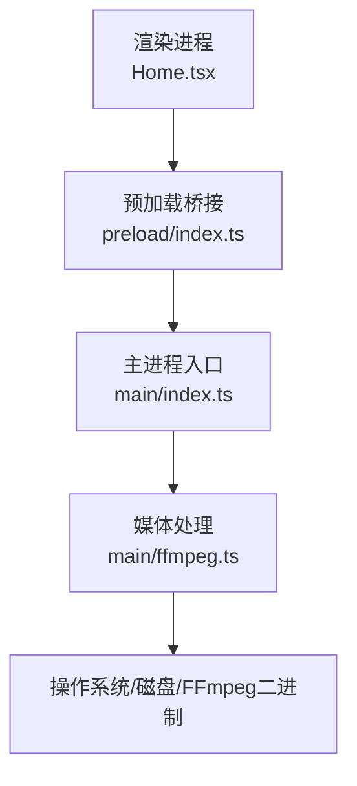
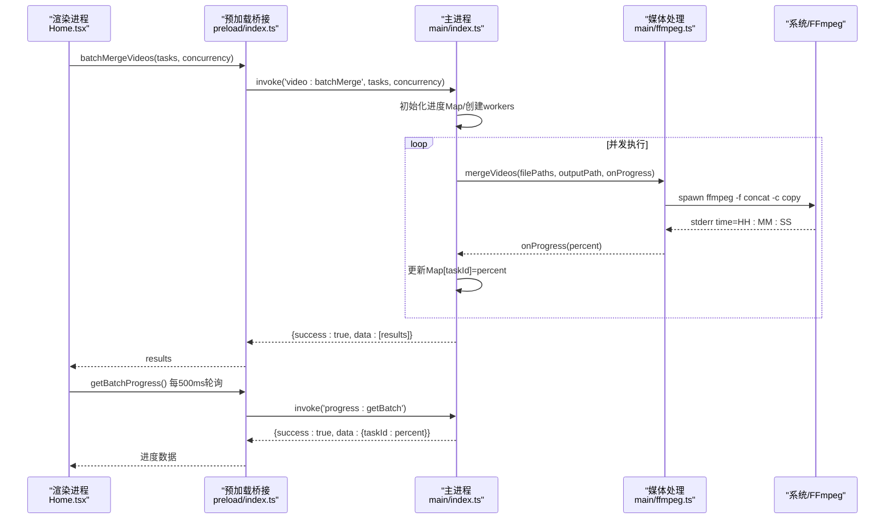
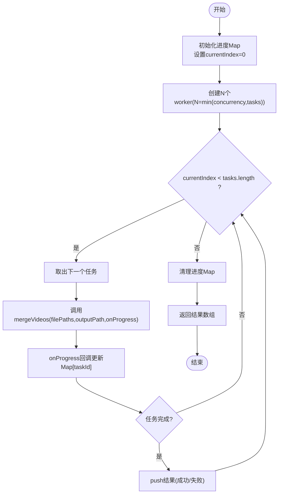
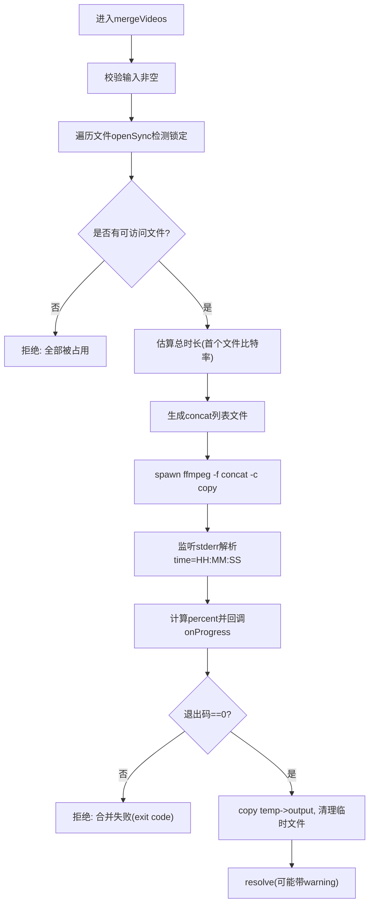
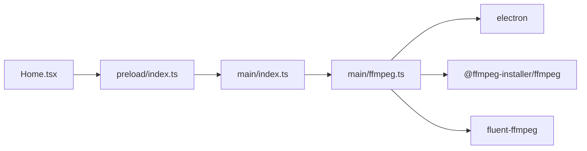

# 批量操作模块

<cite>
**本文引用的文件**   
- [src/main/index.ts](file://src/main/index.ts)
- [src/main/ffmpeg.ts](file://src/main/ffmpeg.ts)
- [src/preload/index.ts](file://src/preload/index.ts)
- [src/renderer/src/pages/Home.tsx](file://src/renderer/src/pages/Home.tsx)
- [package.json](file://package.json)
</cite>

## 目录
1. [简介](#简介)
2. [项目结构](#项目结构)
3. [核心组件](#核心组件)
4. [架构总览](#架构总览)
5. [详细组件分析](#详细组件分析)
6. [依赖关系分析](#依赖关系分析)
7. [性能与资源优化](#性能与资源优化)
8. [故障排查指南](#故障排查指南)
9. [结论](#结论)
10. [附录：扩展与最佳实践](#附录扩展与最佳实践)

## 简介
本模块聚焦“批量视频合并”能力，提供并行处理、任务队列管理、并发控制、进度同步、错误处理与结果聚合等完整链路。渲染进程通过 IPC 调用主进程的批量合并接口，主进程基于工作线程模型（Promise.all + 共享索引）实现并发执行，并通过临时 Map 维护每个任务的实时进度；底层使用 FFmpeg 的 concat demuxer 进行流拷贝式拼接，避免重编码带来的高开销。

## 项目结构
- 主进程负责：IPC 路由、配置持久化、批量任务调度、FFmpeg 子进程编排、进度存储与查询。
- 预加载层负责：统一封装 IPC 调用，自动解包返回结构并抛错。
- 渲染进程负责：用户交互、任务构建、轮询进度、结果展示与后续动作。
- 媒体处理层负责：探测视频信息、合并与转换的具体实现。

图表来源
- [src/renderer/src/pages/Home.tsx:1-760](file://src/renderer/src/pages/Home.tsx#L1-L760)
- [src/preload/index.ts:1-64](file://src/preload/index.ts#L1-L64)
- [src/main/index.ts:1-530](file://src/main/index.ts#L1-L530)
- [src/main/ffmpeg.ts:1-305](file://src/main/ffmpeg.ts#L1-L305)

章节来源
- [src/main/index.ts:1-530](file://src/main/index.ts#L1-L530)
- [src/main/ffmpeg.ts:1-305](file://src/main/ffmpeg.ts#L1-L305)
- [src/preload/index.ts:1-64](file://src/preload/index.ts#L1-L64)
- [src/renderer/src/pages/Home.tsx:1-760](file://src/renderer/src/pages/Home.tsx#L1-L760)
- [package.json:1-42](file://package.json#L1-L42)

## 核心组件
- 批量任务模型
  - 任务对象包含：唯一标识、源文件路径数组、输出路径、分组名称。
  - 结果对象包含：任务标识、分组名称、成功标志、警告或错误信息。
- 并发控制
  - 通过并发数参数限制同时运行的 worker 数量，内部以共享索引从任务队列中顺序取任务，保证公平分配。
- 进度同步
  - 主进程维护一个 Map<taskId, progress>，worker 在执行 mergeVideos 时回调更新对应 taskId 的进度；渲染进程每 500ms 轮询获取并计算总体进度。
- 错误处理
  - 单个任务失败不影响其他任务；失败任务进度标记为负值用于前端异常态显示；最终汇总所有结果返回给渲染端。
- 结果聚合
  - 所有 worker 完成后，清理进度记录并返回结果数组，渲染端统计成功/失败数量并提示。

章节来源
- [src/main/index.ts:406-478](file://src/main/index.ts#L406-L478)
- [src/renderer/src/pages/Home.tsx:204-298](file://src/renderer/src/pages/Home.tsx#L204-L298)

## 架构总览
批量合并的整体流程如下：

图表来源
- [src/main/index.ts:421-478](file://src/main/index.ts#L421-L478)
- [src/main/ffmpeg.ts:87-245](file://src/main/ffmpeg.ts#L87-L245)
- [src/preload/index.ts:42-48](file://src/preload/index.ts#L42-L48)
- [src/renderer/src/pages/Home.tsx:221-242](file://src/renderer/src/pages/Home.tsx#L221-L242)

## 详细组件分析

### 主进程：批量合并调度器
- 任务队列与并发控制
  - 使用共享索引 currentIndex 在多个 worker 之间安全地取出下一个任务，避免重复执行。
  - workers 数量为 Math.min(concurrency, tasks.length)，确保不会超过任务总数。
- 进度存储与查询
  - 使用 Map 保存每个 taskId 的当前进度；完成或失败后删除记录，避免内存泄漏。
  - 提供独立 IPC 接口供渲染端轮询。
- 错误隔离与结果聚合
  - 单个 worker 捕获异常并将对应 taskId 进度置为 -1，同时记录错误消息；最终汇总所有结果返回。

图表来源
- [src/main/index.ts:421-469](file://src/main/index.ts#L421-L469)

章节来源
- [src/main/index.ts:406-478](file://src/main/index.ts#L406-L478)

### 媒体处理：合并与进度估算
- 快速探测
  - 使用 spawn 启动 FFmpeg 仅读取文件头，解析 Duration、分辨率、编码等信息，毫秒级完成。
- 可访问性检查
  - 对每个源文件尝试 openSync/closeSync 判断是否被占用，跳过正在录制的片段并给出警告。
- 时长估算
  - 若首个文件可探测到时长且大小大于0，则用第一个文件的比特率推算总时长，作为进度分母；否则回退为0，不显示精确百分比。
- 合并策略
  - 使用 concat demuxer 直接拼接 FLV 并输出为 MP4（stream copy），避免重编码，速度极快。
- 进度解析
  - 实时解析 stderr 中的 time=HH:MM:SS，结合估算总时长计算百分比，上限 99.9%。
- 超时保护
  - 设置 30 分钟超时，超时则清理临时文件并拒绝 Promise。
- 输出落盘
  - 先写入临时文件，成功后复制并重命名覆盖目标文件；如目标存在则备份旧文件。

图表来源
- [src/main/ffmpeg.ts:87-245](file://src/main/ffmpeg.ts#L87-L245)

章节来源
- [src/main/ffmpeg.ts:12-58](file://src/main/ffmpeg.ts#L12-L58)
- [src/main/ffmpeg.ts:87-245](file://src/main/ffmpeg.ts#L87-L245)

### 预加载桥接：统一 API 封装
- 统一返回结构
  - 后端统一返回 { success, data?, message? }；成功返回 data，失败抛出 Error(message)。
- 暴露批量相关接口
  - batchMergeVideos：提交批量任务与并发数。
  - getBatchProgress：轮询获取各任务进度。

章节来源
- [src/preload/index.ts:9-18](file://src/preload/index.ts#L9-L18)
- [src/preload/index.ts:42-48](file://src/preload/index.ts#L42-L48)

### 渲染进程：任务构建与进度轮询
- 任务构建
  - 根据选中的分组生成任务对象，包含 taskId、filePaths、outputPath、folderName。
- 进度轮询
  - 每 500ms 调用 getBatchProgress，将各任务进度映射到状态，并计算总体进度（正数累加平均）。
- 结果处理
  - 统计成功/失败数量，移除已成功的分组，提示警告或错误信息，必要时打开输出目录或外部网站。

章节来源
- [src/renderer/src/pages/Home.tsx:204-298](file://src/renderer/src/pages/Home.tsx#L204-L298)

## 依赖关系分析
- 运行时依赖
  - electron：跨进程通信与窗口管理。
  - fluent-ffmpeg：高级封装（主要用于 convertToMp4）。
  - @ffmpeg-installer/ffmpeg：提供打包后可用的 FFmpeg 二进制。
- 关键耦合点
  - main/index.ts 依赖 main/ffmpeg.ts 提供的合并与转换函数。
  - preload/index.ts 作为 IPC 代理，屏蔽底层细节。
  - renderer/Home.tsx 通过 window.api 调用，关注业务逻辑与用户体验。

图表来源
- [package.json:17-20](file://package.json#L17-L20)
- [src/main/index.ts:1-6](file://src/main/index.ts#L1-L6)
- [src/main/ffmpeg.ts:1-6](file://src/main/ffmpeg.ts#L1-L6)
- [src/preload/index.ts:1-3](file://src/preload/index.ts#L1-L3)
- [src/renderer/src/pages/Home.tsx:1-5](file://src/renderer/src/pages/Home.tsx#L1-L5)

章节来源
- [package.json:17-20](file://package.json#L17-L20)

## 性能与资源优化
- 并发数配置
  - 建议范围 2-4，依据 CPU 核数与磁盘 IO 能力调整；过大可能导致磁盘争用与上下文切换开销上升。
- 内存管理
  - 任务完成后立即清理进度 Map 条目，避免长期运行导致内存增长。
  - 大文件合并尽量使用 stream copy，减少内存占用。
- CPU 使用率控制
  - 合并阶段为 I/O 密集，CPU 占用较低；如需转码（convertToMp4）会显著增加 CPU 负载，应谨慎开启。
- 超时与健壮性
  - 合并过程设置 30 分钟超时，防止长时间挂起；失败时清理临时文件，避免磁盘碎片。
- 进度估算优化
  - 优先使用真实时长估算；当无法探测时长时，回退为占位显示，避免误导用户。

章节来源
- [src/main/index.ts:463-469](file://src/main/index.ts#L463-L469)
- [src/main/ffmpeg.ts:154-160](file://src/main/ffmpeg.ts#L154-L160)
- [src/main/ffmpeg.ts:127-144](file://src/main/ffmpeg.ts#L127-L144)

## 故障排查指南
- 常见错误与定位
  - “所有源文件都被占用”：部分片段仍在录制中，等待释放或跳过后再试。
  - “合并失败 (exit code X)”：查看 FFmpeg stderr 最后若干行日志，确认输入格式一致性。
  - “移动输出文件失败”：目标路径不可写或被占用，检查权限与同名文件。
  - “启动 FFmpeg 失败”：确认 FFmpeg 二进制可用，路径正确。
- 调试建议
  - 启用控制台日志，观察 onProgress 回调频率与数值变化。
  - 降低并发数，逐步定位瓶颈。
  - 检查磁盘空间与写入权限。

章节来源
- [src/main/ffmpeg.ts:110-117](file://src/main/ffmpeg.ts#L110-L117)
- [src/main/ffmpeg.ts:200-206](file://src/main/ffmpeg.ts#L200-L206)
- [src/main/ffmpeg.ts:231-244](file://src/main/ffmpeg.ts#L231-L244)

## 结论
该批量操作模块通过简洁而稳健的并发模型、可靠的进度同步机制以及完善的错误处理，实现了高效的视频合并流水线。采用流拷贝策略大幅提升了吞吐，配合合理的并发与超时策略，兼顾了性能与稳定性。

## 附录：扩展与最佳实践
- 扩展批量操作类型
  - 新增任务类型可在主进程添加新的 IPC 处理器，复用 worker 模型与进度 Map 机制。
  - 在 ffmpeg.ts 中实现对应的处理函数，遵循统一的 onProgress 回调约定。
- 优先级与重试
  - 可在任务队列中加入优先级字段，按优先级排序后由 worker 依次取出；失败任务可加入重试队列，支持指数退避与最大重试次数。
- 资源监控
  - 可引入系统指标采集（CPU、内存、磁盘 IO），动态调整并发数，避免系统过载。
- 代码示例路径（不含具体代码内容）
  - 批量任务提交与并发控制：[src/main/index.ts:421-469](file://src/main/index.ts#L421-L469)
  - 进度轮询与总体进度计算：[src/renderer/src/pages/Home.tsx:221-236](file://src/renderer/src/pages/Home.tsx#L221-L236)
  - 进度查询接口：[src/main/index.ts:472-478](file://src/main/index.ts#L472-L478)
  - 合并实现与进度解析：[src/main/ffmpeg.ts:162-191](file://src/main/ffmpeg.ts#L162-L191)
  - 预加载桥接封装：[src/preload/index.ts:42-48](file://src/preload/index.ts#L42-L48)