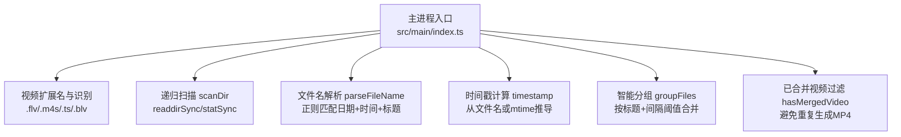
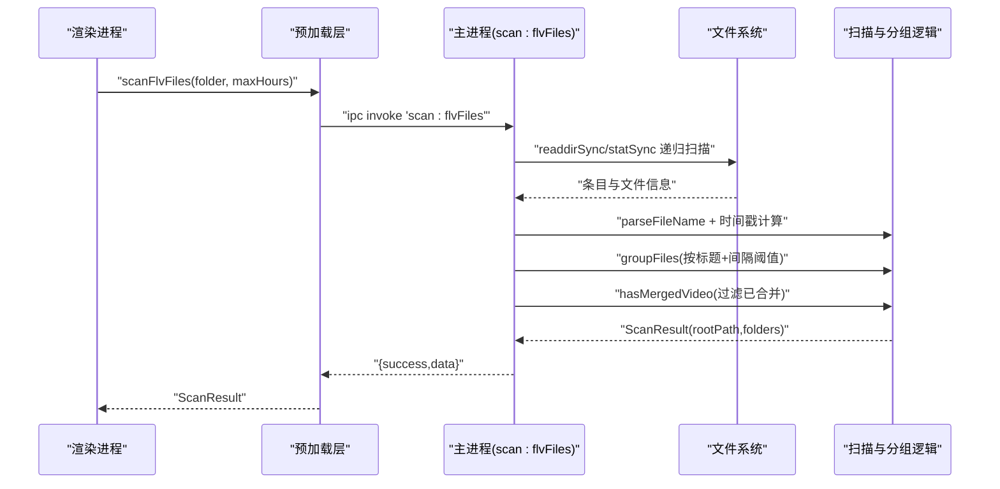
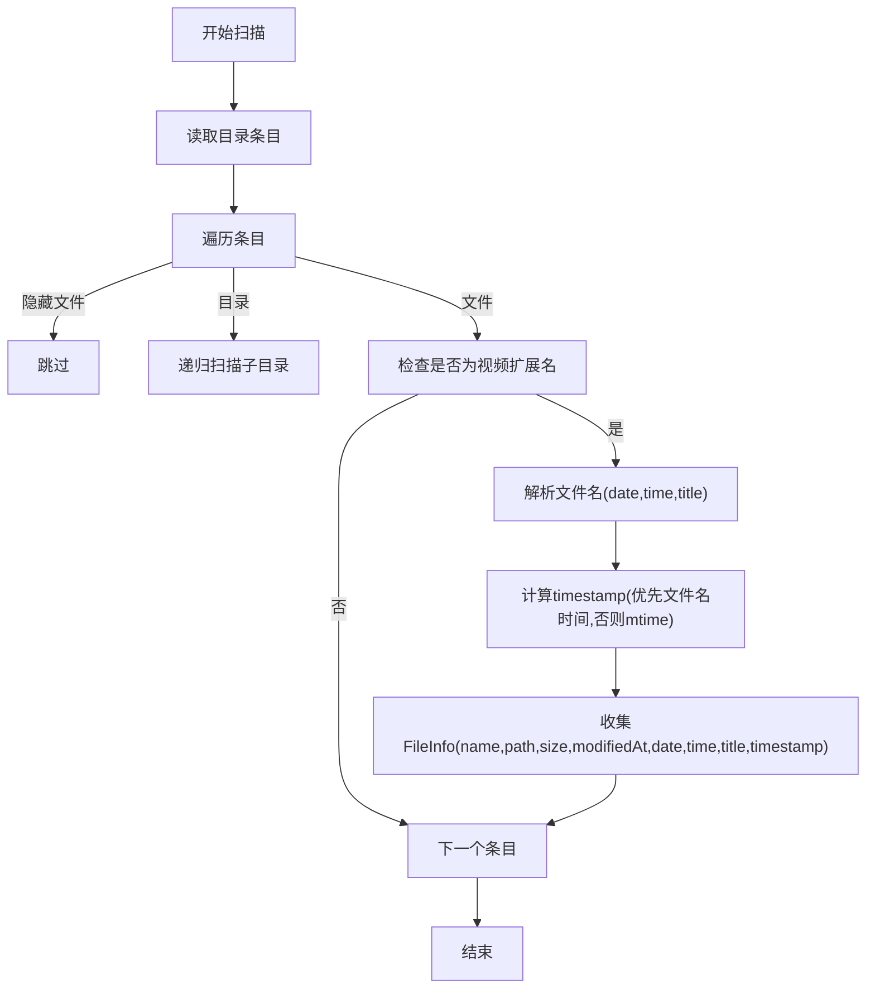
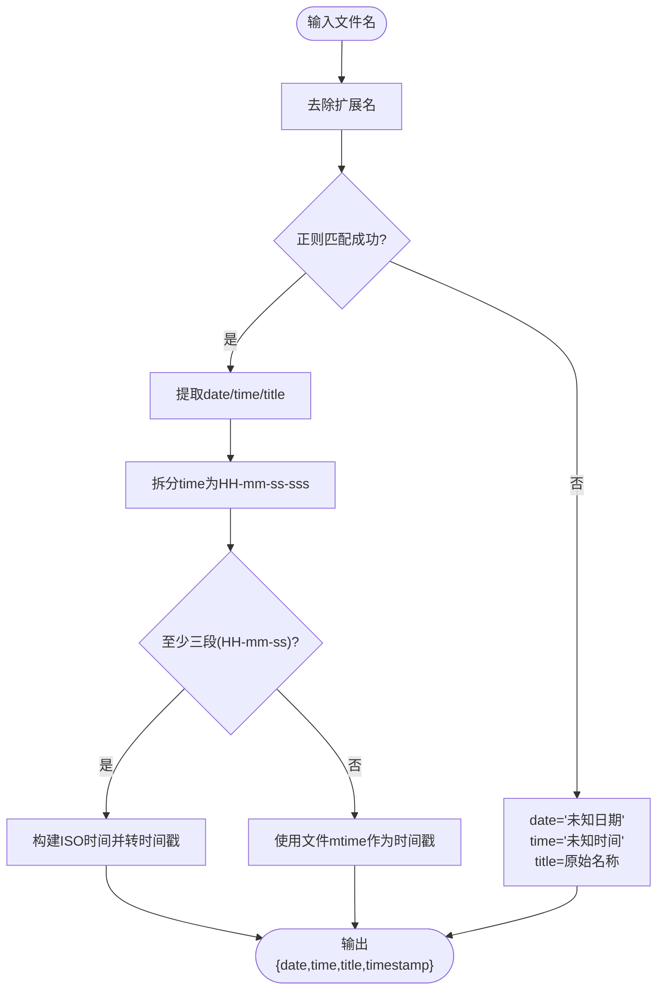
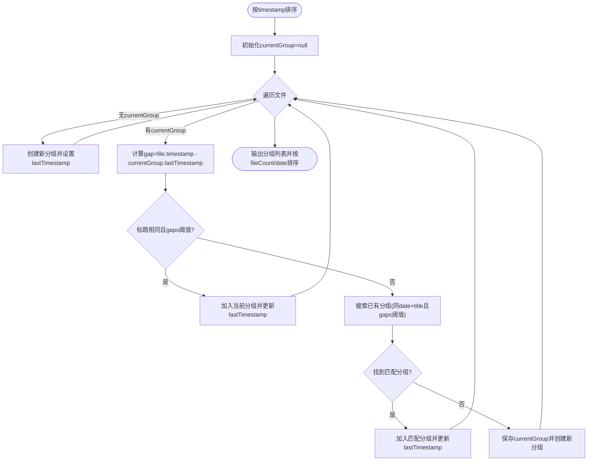
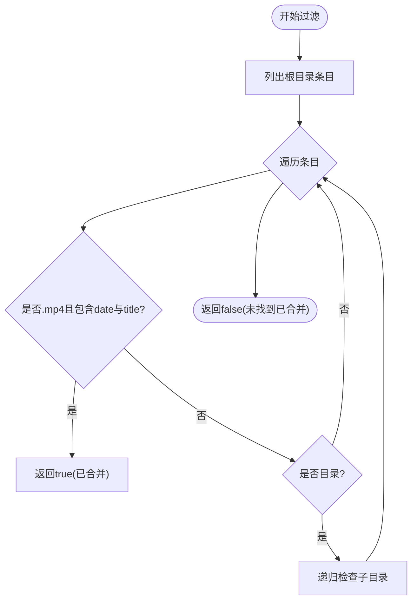
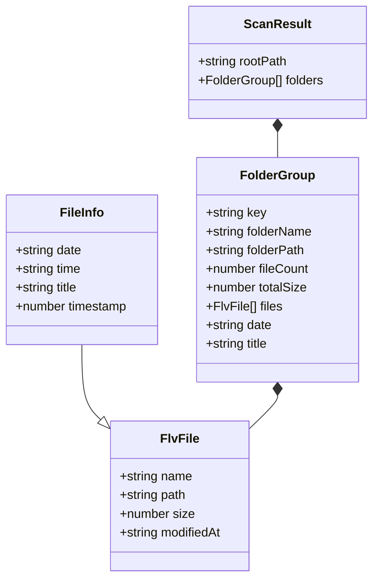
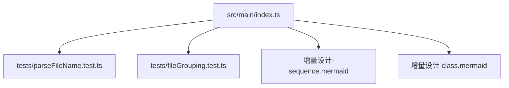

# 文件扫描模块

<cite>
**本文引用的文件**
- [src/main/index.ts](file://src/main/index.ts)
- [src/main/ffmpeg.ts](file://src/main/ffmpeg.ts)
- [tests/fileGrouping.test.ts](file://tests/fileGrouping.test.ts)
- [tests/parseFileName.test.ts](file://tests/parseFileName.test.ts)
- [deliverables/software-company/视频合并app-增量设计-sequence.mermaid](file://deliverables/software-company/视频合并app-增量设计-sequence.mermaid)
- [deliverables/software-company/视频合并app-增量设计-class.mermaid](file://deliverables/software-company/视频合并app-增量设计-class.mermaid)
- [deliverables/software-company/视频合并app-架构评审-2026-07-06.md](file://deliverables/software-company/视频合并app-架构评审-2026-07-06.md)
</cite>

## 目录
1. [简介](#简介)
2. [项目结构](#项目结构)
3. [核心组件](#核心组件)
4. [架构总览](#架构总览)
5. [详细组件分析](#详细组件分析)
6. [依赖关系分析](#依赖关系分析)
7. [性能考量](#性能考量)
8. [故障排查指南](#故障排查指南)
9. [结论](#结论)
10. [附录](#附录)

## 简介
本文件聚焦“文件扫描模块”，围绕递归目录扫描、视频文件识别（FLV、M4S、TS、BLV）、文件名解析与智能分组策略展开，详细说明时间戳提取机制、日期时间格式匹配规则、分组阈值判断逻辑，以及文件信息收集（大小、修改时间、路径等）的实现细节。同时给出扫描流程、分组算法和错误处理的代码级示例路径，并提供大目录扫描的内存管理与 I/O 优化建议，以及扩展新文件格式与自定义分组规则的指导。

## 项目结构
与文件扫描相关的核心实现位于主进程入口中，包含：
- 支持的视频扩展名集合与识别函数
- 递归扫描与文件信息收集
- 文件名解析（日期、时间、标题）
- 基于时间与标题的智能分组
- 已合并视频过滤（避免重复输出）

图表来源
- [src/main/index.ts:126-143](file://src/main/index.ts#L126-L143)
- [src/main/index.ts:145-216](file://src/main/index.ts#L145-L216)
- [src/main/index.ts:218-307](file://src/main/index.ts#L218-L307)
- [src/main/index.ts:309-345](file://src/main/index.ts#L309-L345)

章节来源
- [src/main/index.ts:126-143](file://src/main/index.ts#L126-L143)
- [src/main/index.ts:145-216](file://src/main/index.ts#L145-L216)
- [src/main/index.ts:218-307](file://src/main/index.ts#L218-L307)
- [src/main/index.ts:309-345](file://src/main/index.ts#L309-L345)

## 核心组件
- 视频扩展名与识别
  - 支持的扩展名：.flv、.m4s、.ts、.blv
  - isVideoFile(fileName) 通过小写后缀匹配判定
  - stripVideoExtension(fileName) 用于去除扩展名以便解析
- 递归扫描与信息收集
  - scanDir(dir) 使用 readdirSync + statSync 遍历子目录
  - 对每个文件记录 name、path、size、modifiedAt
- 文件名解析
  - 期望格式：YYYY-MM-DD HH-mm-ss-sss 标题
  - 未匹配时回退为“未知日期/未知时间/原始名称”
- 时间戳提取
  - 若时间部分存在至少三段（HH-mm-ss），则构造 ISO 时间并取毫秒时间戳
  - 否则回退到文件 mtime
- 智能分组
  - 以 date + title 作为分组键
  - 按 timestamp 排序后，比较相邻文件的时间间隔是否超过阈值（小时×60×60×1000）
  - 若标题相同且间隔在阈值内，归入同一组；否则尝试并入已有同标题组，仍不满足则新建分组
- 已合并视频过滤
  - hasMergedVideo(dir, date, title) 递归检查是否存在同名 MP4（含 date 与 title 关键字）
  - 过滤掉已合并的分组，避免重复处理

章节来源
- [src/main/index.ts:126-143](file://src/main/index.ts#L126-L143)
- [src/main/index.ts:145-216](file://src/main/index.ts#L145-L216)
- [src/main/index.ts:218-307](file://src/main/index.ts#L218-L307)
- [src/main/index.ts:309-345](file://src/main/index.ts#L309-L345)

## 架构总览
扫描流程由渲染进程通过 IPC 调用主进程的 scan:flvFiles 处理器触发，内部完成递归扫描、解析、分组与过滤，最终返回结构化结果供 UI 展示与后续合并操作使用。

图表来源
- [deliverables/software-company/视频合并app-增量设计-sequence.mermaid:35-48](file://deliverables/software-company/视频合并app-增量设计-sequence.mermaid#L35-L48)
- [src/main/index.ts:145-216](file://src/main/index.ts#L145-L216)
- [src/main/index.ts:218-307](file://src/main/index.ts#L218-L307)
- [src/main/index.ts:309-345](file://src/main/index.ts#L309-L345)

## 详细组件分析

### 递归目录扫描与信息收集
- 遍历策略
  - 使用同步 API readdirSync 读取目录条目，statSync 获取文件属性
  - 跳过以点号开头的隐藏条目
  - 遇到目录则递归进入
- 文件筛选
  - 仅保留支持的视频扩展名（.flv/.m4s/.ts/.blv）
- 信息收集
  - 记录 name、path、size、modifiedAt（ISO 字符串）
  - 解析出 date、time、title，并计算 timestamp

图表来源
- [src/main/index.ts:181-212](file://src/main/index.ts#L181-L212)
- [src/main/index.ts:126-143](file://src/main/index.ts#L126-L143)

章节来源
- [src/main/index.ts:181-212](file://src/main/index.ts#L181-L212)
- [src/main/index.ts:126-143](file://src/main/index.ts#L126-L143)

### 文件名解析与时间戳提取
- 解析规则
  - 先去除视频扩展名
  - 使用正则匹配：YYYY-MM-DD HH-mm-ss-sss 标题
  - 未匹配则回退为“未知日期/未知时间/原始名称”
- 时间戳提取
  - 将 HH-mm-ss 组合为 ISO 时间字符串并转换为毫秒时间戳
  - 若时间片段不足三段，则回退到文件的 mtime

图表来源
- [src/main/index.ts:164-179](file://src/main/index.ts#L164-L179)
- [src/main/index.ts:191-196](file://src/main/index.ts#L191-L196)
- [tests/parseFileName.test.ts:8-23](file://tests/parseFileName.test.ts#L8-L23)

章节来源
- [src/main/index.ts:164-179](file://src/main/index.ts#L164-L179)
- [src/main/index.ts:191-196](file://src/main/index.ts#L191-L196)
- [tests/parseFileName.test.ts:8-23](file://tests/parseFileName.test.ts#L8-L23)

### 智能分组策略与阈值判断
- 分组键
  - key = date + "_" + title
- 排序
  - 所有文件按 timestamp 升序排列
- 阈值
  - MAX_INTERVAL_MS = maxIntervalHours × 60 × 60 × 1000
- 合并规则
  - 若当前文件与当前分组的 lastTimestamp 差值 ≤ MAX_INTERVAL_MS 且标题相同，直接加入当前分组
  - 否则遍历已有分组，寻找同 date + title 且 gap ≤ MAX_INTERVAL_MS 的分组进行合并
  - 若无匹配，保存当前分组并创建新分组
- 输出排序
  - 按 fileCount 降序，其次按 date 倒序

图表来源
- [src/main/index.ts:216-307](file://src/main/index.ts#L216-L307)
- [tests/fileGrouping.test.ts:28-68](file://tests/fileGrouping.test.ts#L28-L68)

章节来源
- [src/main/index.ts:216-307](file://src/main/index.ts#L216-L307)
- [tests/fileGrouping.test.ts:28-68](file://tests/fileGrouping.test.ts#L28-L68)

### 已合并视频过滤
- 目的
  - 避免对已合并生成的 MP4 再次处理
- 规则
  - 在当前根目录下递归查找 .mp4 文件
  - 若文件名同时包含 date 与 title（不区分大小写），则认为已合并
- 行为
  - 过滤掉这些分组，不再参与后续合并

图表来源
- [src/main/index.ts:309-345](file://src/main/index.ts#L309-L345)

章节来源
- [src/main/index.ts:309-345](file://src/main/index.ts#L309-L345)

### 类与数据结构概览

图表来源
- [deliverables/software-company/视频合并app-增量设计-class.mermaid:76-119](file://deliverables/software-company/视频合并app-增量设计-class.mermaid#L76-L119)

## 依赖关系分析
- 主进程入口负责：
  - 定义视频扩展名与识别函数
  - 提供 IPC 处理器 scan:flvFiles
  - 执行递归扫描、解析、分组与过滤
- 测试用例覆盖：
  - 文件名解析逻辑（tests/parseFileName.test.ts）
  - 分组算法（tests/fileGrouping.test.ts）
- 设计文档与时序图：
  - 异步扫描时序与 IPC 校验（deliverables/software-company/视频合并app-增量设计-sequence.mermaid）
  - 类结构与数据模型（deliverables/software-company/视频合并app-增量设计-class.mermaid）

图表来源
- [src/main/index.ts:126-143](file://src/main/index.ts#L126-L143)
- [src/main/index.ts:145-216](file://src/main/index.ts#L145-L216)
- [src/main/index.ts:218-307](file://src/main/index.ts#L218-L307)
- [src/main/index.ts:309-345](file://src/main/index.ts#L309-L345)
- [tests/parseFileName.test.ts:8-23](file://tests/parseFileName.test.ts#L8-L23)
- [tests/fileGrouping.test.ts:28-68](file://tests/fileGrouping.test.ts#L28-L68)
- [deliverables/software-company/视频合并app-增量设计-sequence.mermaid:35-48](file://deliverables/software-company/视频合并app-增量设计-sequence.mermaid#L35-L48)
- [deliverables/software-company/视频合并app-增量设计-class.mermaid:76-119](file://deliverables/software-company/视频合并app-增量设计-class.mermaid#L76-L119)

章节来源
- [src/main/index.ts:126-143](file://src/main/index.ts#L126-L143)
- [src/main/index.ts:145-216](file://src/main/index.ts#L145-L216)
- [src/main/index.ts:218-307](file://src/main/index.ts#L218-L307)
- [src/main/index.ts:309-345](file://src/main/index.ts#L309-L345)
- [tests/parseFileName.test.ts:8-23](file://tests/parseFileName.test.ts#L8-L23)
- [tests/fileGrouping.test.ts:28-68](file://tests/fileGrouping.test.ts#L28-L68)
- [deliverables/software-company/视频合并app-增量设计-sequence.mermaid:35-48](file://deliverables/software-company/视频合并app-增量设计-sequence.mermaid#L35-L48)
- [deliverables/software-company/视频合并app-增量设计-class.mermaid:76-119](file://deliverables/software-company/视频合并app-增量设计-class.mermaid#L76-L119)

## 性能考量
- 当前实现使用同步 I/O（readdirSync/statSync），在大目录场景可能阻塞主线程。设计文档提出异步化改进建议（fs.promises.readdir + withFileTypes）。
- 内存管理
  - 扫描阶段将所有 FileInfo 对象放入数组，随后排序与分组，需关注大目录下的内存占用
  - 可考虑流式处理或分批聚合以降低峰值内存
- I/O 优化
  - 使用异步递归减少阻塞
  - 仅在文件节点上调用 stat，避免不必要的元数据开销
- 进度与超时
  - 合并阶段采用 FFmpeg 子进程与实时 stderr 解析，具备超时保护与失败清理（参考 ffmpeg.ts）

章节来源
- [deliverables/software-company/视频合并app-增量设计-sequence.mermaid:35-48](file://deliverables/software-company/视频合并app-增量设计-sequence.mermaid#L35-L48)
- [deliverables/software-company/视频合并app-架构评审-2026-07-06.md:67-78](file://deliverables/software-company/视频合并app-架构评审-2026-07-06.md#L67-L78)
- [src/main/ffmpeg.ts:152-219](file://src/main/ffmpeg.ts#L152-L219)

## 故障排查指南
- 常见错误
  - 无法访问的文件：扫描过程中捕获异常并跳过
  - 已合并视频检测失败：确保输出文件名包含 date 与 title 关键字
  - 分组阈值不当：调整 maxIntervalHours 以避免误分组或过度拆分
- 诊断要点
  - 检查文件名是否符合 YYYY-MM-DD HH-mm-ss-sss 标题 规范
  - 确认 timestamp 是否正确（优先文件名时间，否则 mtime）
  - 验证分组排序与过滤逻辑是否符合预期

章节来源
- [src/main/index.ts:181-212](file://src/main/index.ts#L181-L212)
- [src/main/index.ts:309-345](file://src/main/index.ts#L309-L345)
- [tests/parseFileName.test.ts:8-23](file://tests/parseFileName.test.ts#L8-L23)
- [tests/fileGrouping.test.ts:28-68](file://tests/fileGrouping.test.ts#L28-L68)

## 结论
文件扫描模块通过明确的扩展名识别、稳健的文件名解析与时间戳提取、以及基于标题与时间阈值的智能分组，实现了直播分段视频的自动组织与去重。配合已合并视频过滤，有效避免重复处理。针对大目录场景，建议推进异步扫描与流式聚合，以提升响应性与内存效率。

## 附录

### 扩展新文件格式支持
- 步骤
  - 在 VIDEO_EXTENSIONS 中添加新扩展名（如 .mkv）
  - 确保 stripVideoExtension 能正确去除新扩展名
  - 如有必要，更新文件名解析正则或解析逻辑以适配新的命名约定
- 影响范围
  - isVideoFile、stripVideoExtension、parseFileName、scanDir 均会受影响
- 验证
  - 新增单元测试覆盖新扩展名的识别与解析

章节来源
- [src/main/index.ts:126-143](file://src/main/index.ts#L126-L143)
- [src/main/index.ts:164-179](file://src/main/index.ts#L164-L179)
- [src/main/index.ts:181-212](file://src/main/index.ts#L181-L212)

### 自定义分组规则
- 思路
  - 修改分组键（例如引入更多字段或自定义哈希）
  - 调整阈值判断逻辑（例如按文件大小、分辨率、编码一致性等维度）
  - 增加多条件合并策略（标题相同且编码一致且间隔小于阈值）
- 实施
  - 在分组循环中扩展条件判断
  - 更新排序与过滤逻辑以反映新的分组语义
- 验证
  - 补充测试用例覆盖边界情况与混合场景

章节来源
- [src/main/index.ts:218-307](file://src/main/index.ts#L218-L307)
- [tests/fileGrouping.test.ts:28-68](file://tests/fileGrouping.test.ts#L28-L68)

### 代码示例路径（不含具体代码内容）
- 扫描流程入口与递归扫描
  - [src/main/index.ts:145-216](file://src/main/index.ts#L145-L216)
- 文件名解析与时间戳提取
  - [src/main/index.ts:164-179](file://src/main/index.ts#L164-L179)
  - [src/main/index.ts:191-196](file://src/main/index.ts#L191-L196)
  - [tests/parseFileName.test.ts:8-23](file://tests/parseFileName.test.ts#L8-L23)
- 智能分组与阈值判断
  - [src/main/index.ts:218-307](file://src/main/index.ts#L218-L307)
  - [tests/fileGrouping.test.ts:28-68](file://tests/fileGrouping.test.ts#L28-L68)
- 已合并视频过滤
  - [src/main/index.ts:309-345](file://src/main/index.ts#L309-L345)
- 合并与进度（参考）
  - [src/main/ffmpeg.ts:152-219](file://src/main/ffmpeg.ts#L152-L219)