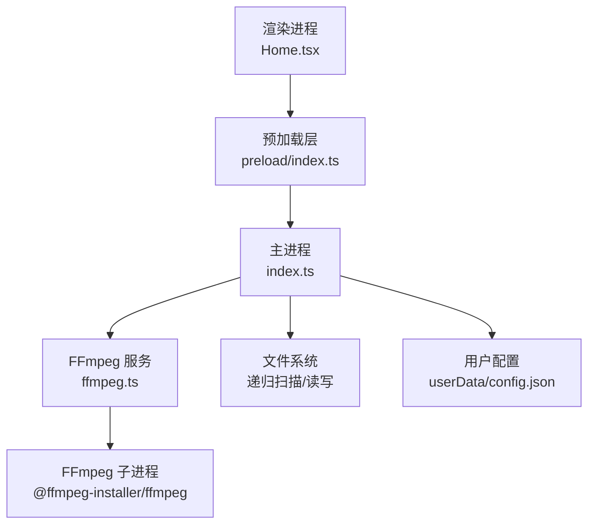
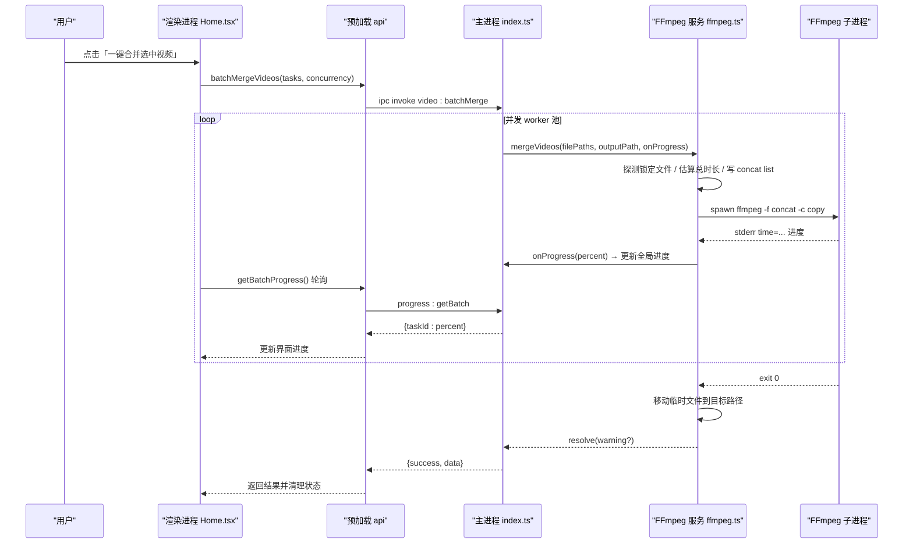
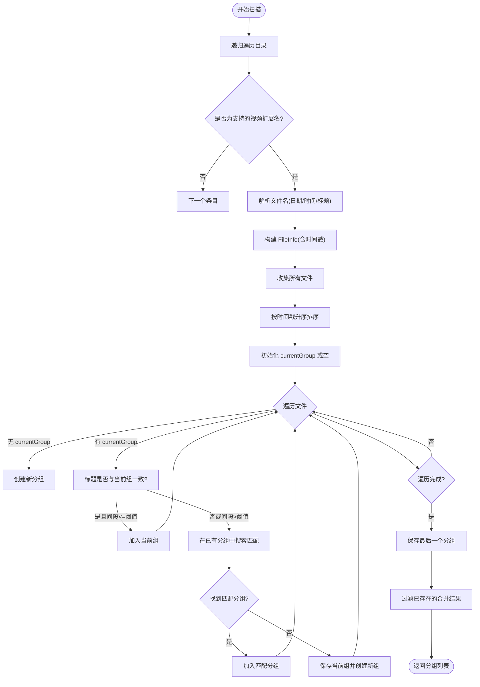
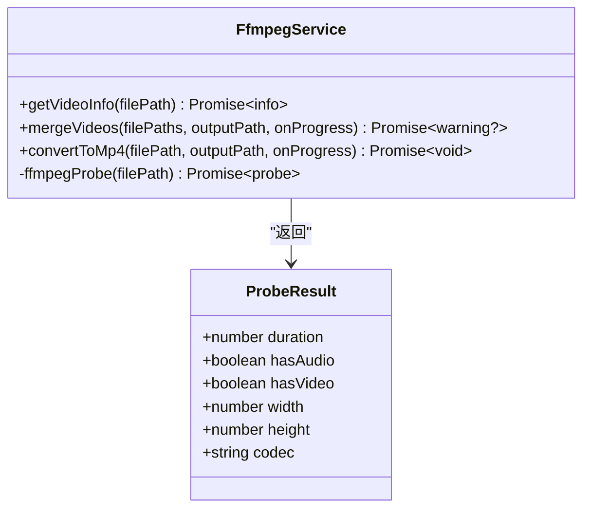
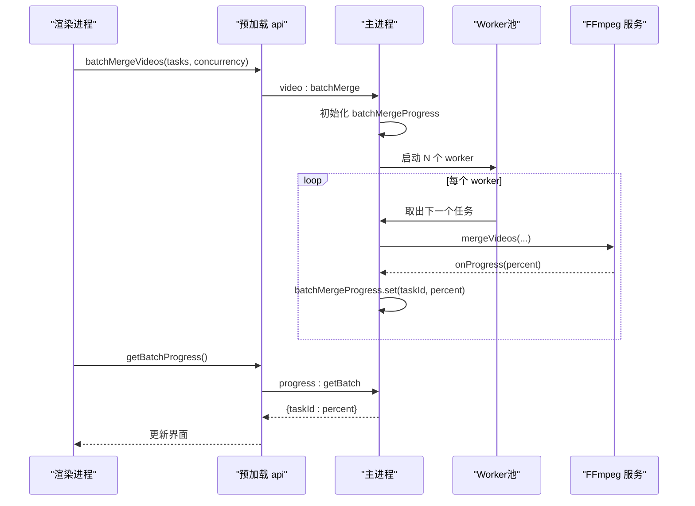
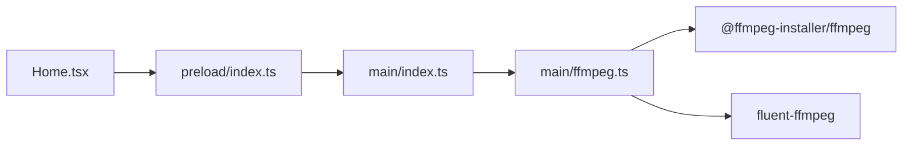

# 核心功能

<cite>
**本文引用的文件**   
- [src/main/index.ts](file://src/main/index.ts)
- [src/main/ffmpeg.ts](file://src/main/ffmpeg.ts)
- [src/preload/index.ts](file://src/preload/index.ts)
- [src/renderer/src/pages/Home.tsx](file://src/renderer/src/pages/Home.tsx)
- [tests/fileGrouping.test.ts](file://tests/fileGrouping.test.ts)
- [tests/parseFileName.test.ts](file://tests/parseFileName.test.ts)
- [tests/ffmpegParsing.test.ts](file://tests/ffmpegParsing.test.ts)
- [tests/configAndUtils.test.ts](file://tests/configAndUtils.test.ts)
- [tests/invokeApi.test.ts](file://tests/invokeApi.test.ts)
- [package.json](file://package.json)
</cite>

## 目录
1. [简介](#简介)
2. [项目结构](#项目结构)
3. [核心组件](#核心组件)
4. [架构总览](#架构总览)
5. [详细组件分析](#详细组件分析)
6. [依赖关系分析](#依赖关系分析)
7. [性能与并发](#性能与并发)
8. [故障排查指南](#故障排查指南)
9. [结论](#结论)
10. [附录：配置项与使用方式](#附录配置项与使用方式)

## 简介
本项目是一个基于 Electron 的桌面应用，面向直播录制的分段视频（FLV/M4S/TS/BLV）进行自动扫描、智能分组与批量合并。核心能力包括：
- 递归扫描输入目录，识别支持的视频格式并解析文件名中的日期、时间与标题
- 按“日期 + 标题 + 时间间隔阈值”将片段归为同一场直播的分组
- 通过 FFmpeg concat demuxer 以流拷贝模式快速拼接为 MP4
- 支持批量并行合并，提供实时进度与失败重试提示
- 持久化用户配置（输入输出路径、合并策略、并发度等）

## 项目结构
应用采用标准三段式进程模型：渲染进程（React UI）、预加载脚本（IPC 桥接）、主进程（业务逻辑与系统调用）。核心实现集中在主进程的 index.ts 与 ffmpeg.ts，预加载层统一封装 IPC 调用，渲染层负责交互与状态展示。

图表来源
- [src/main/index.ts:1-120](file://src/main/index.ts#L1-L120)
- [src/main/ffmpeg.ts:1-30](file://src/main/ffmpeg.ts#L1-L30)
- [src/preload/index.ts:1-64](file://src/preload/index.ts#L1-L64)
- [src/renderer/src/pages/Home.tsx:1-120](file://src/renderer/src/pages/Home.tsx#L1-L120)

章节来源
- [src/main/index.ts:1-120](file://src/main/index.ts#L1-L120)
- [src/main/ffmpeg.ts:1-30](file://src/main/ffmpeg.ts#L1-L30)
- [src/preload/index.ts:1-64](file://src/preload/index.ts#L1-L64)
- [src/renderer/src/pages/Home.tsx:1-120](file://src/renderer/src/pages/Home.tsx#L1-L120)
- [package.json:1-42](file://package.json#L1-L42)

## 核心组件
- 文件扫描与智能分组：递归遍历目录，过滤支持的视频扩展名，解析文件名提取日期、时间、标题；按时间戳排序后，依据“相同日期+相同标题+间隔不超过阈值”的策略进行分组，同时检测是否已存在同名合并结果以避免重复处理。
- 视频信息探测：通过轻量级探针读取文件头，获取时长、编码、分辨率等信息，用于估算合并总时长与进度计算。
- 合并与转换：使用 FFmpeg concat demuxer 直接拼接（stream copy），避免重编码；也提供转码为 MP4 的能力（H.264 + AAC）。
- 批量并行合并：基于任务队列与固定并发 worker 数，对多个分组并行执行合并，维护每个任务的独立进度。
- 配置管理：持久化用户设置到 userData 目录下的 JSON 文件，支持增量合并保存。

章节来源
- [src/main/index.ts:126-345](file://src/main/index.ts#L126-L345)
- [src/main/ffmpeg.ts:12-77](file://src/main/ffmpeg.ts#L12-L77)
- [src/main/ffmpeg.ts:87-245](file://src/main/ffmpeg.ts#L87-L245)
- [src/main/ffmpeg.ts:254-305](file://src/main/ffmpeg.ts#L254-L305)
- [src/main/index.ts:16-65](file://src/main/index.ts#L16-L65)
- [src/main/index.ts:405-478](file://src/main/index.ts#L405-L478)

## 架构总览
从用户操作到最终输出的关键调用链如下：

图表来源
- [src/main/index.ts:405-478](file://src/main/index.ts#L405-L478)
- [src/main/ffmpeg.ts:87-245](file://src/main/ffmpeg.ts#L87-L245)
- [src/preload/index.ts:42-49](file://src/preload/index.ts#L42-L49)
- [src/renderer/src/pages/Home.tsx:183-298](file://src/renderer/src/pages/Home.tsx#L183-L298)

## 详细组件分析

### 文件扫描与智能分组
- 支持的扩展名：.flv、.m4s、.ts、.blv
- 文件名解析规则：期望形如 “YYYY-MM-DD HH-mm-ss-sss 标题”，若不符合则回退为“未知日期/未知时间”，标题为空时标记为“未命名”
- 时间戳计算：优先使用文件名中的时分秒构造时间戳；否则回退到文件修改时间
- 分组策略：
  - 先按时间戳升序排序
  - 维护当前分组，当新文件的标题与当前分组一致且时间间隔不超过阈值（默认 2.5 小时）时加入当前组
  - 若不满足条件，则在已有分组中查找匹配（同日期+同标题且间隔在阈值内），找到则追加，否则结束当前组并创建新组
  - 最后按文件数量降序、日期降序排序
- 去重检测：扫描完成后检查根目录下是否存在包含“日期+标题”的 .mp4 文件（含递归子目录），若存在则过滤该分组，避免重复合并

图表来源
- [src/main/index.ts:145-345](file://src/main/index.ts#L145-L345)
- [tests/fileGrouping.test.ts:28-68](file://tests/fileGrouping.test.ts#L28-L68)
- [tests/parseFileName.test.ts:8-23](file://tests/parseFileName.test.ts#L8-L23)

章节来源
- [src/main/index.ts:126-345](file://src/main/index.ts#L126-L345)
- [tests/fileGrouping.test.ts:1-170](file://tests/fileGrouping.test.ts#L1-170)
- [tests/parseFileName.test.ts:1-77](file://tests/parseFileName.test.ts#L1-77)

### 视频信息探测与进度估算
- 快速探测：通过启动 FFmpeg 子进程仅读取文件头，一旦捕获 Duration 即终止，毫秒级完成
- 解析内容：时长、是否有音视频流、编码名称、分辨率
- 合并总时长估算：取第一个可访问文件的时长与大小，计算比特率，再根据所有可访问文件总大小推算总时长，用于进度百分比计算
- 进度回调：解析 FFmpeg 输出的 time=HH:MM:SS.SS，换算为百分比并限制上限 99.9%

图表来源
- [src/main/ffmpeg.ts:12-77](file://src/main/ffmpeg.ts#L12-L77)
- [src/main/ffmpeg.ts:87-245](file://src/main/ffmpeg.ts#L87-L245)
- [src/main/ffmpeg.ts:254-305](file://src/main/ffmpeg.ts#L254-L305)

章节来源
- [src/main/ffmpeg.ts:12-77](file://src/main/ffmpeg.ts#L12-L77)
- [src/main/ffmpeg.ts:87-245](file://src/main/ffmpeg.ts#L87-L245)
- [tests/ffmpegParsing.test.ts:1-148](file://tests/ffmpegParsing.test.ts#L1-L148)

### 批量并行合并与并发控制
- 任务结构：每个任务包含 taskId、filePaths、outputPath、folderName
- 并发模型：维护一个索引 currentIndex，worker 循环取出任务执行；并发数为 Math.min(concurrency, tasks.length)
- 进度跟踪：Map<taskId, number> 记录每个任务的进度，渲染端每 500ms 轮询一次，计算总体进度为各任务平均
- 错误处理：单个任务失败不影响其他任务，失败任务进度设为 -1，最终汇总成功/失败数量并提示

图表来源
- [src/main/index.ts:405-478](file://src/main/index.ts#L405-L478)
- [src/preload/index.ts:42-49](file://src/preload/index.ts#L42-L49)
- [src/renderer/src/pages/Home.tsx:221-242](file://src/renderer/src/pages/Home.tsx#L221-L242)

章节来源
- [src/main/index.ts:405-478](file://src/main/index.ts#L405-L478)
- [src/preload/index.ts:42-49](file://src/preload/index.ts#L42-L49)
- [src/renderer/src/pages/Home.tsx:221-242](file://src/renderer/src/pages/Home.tsx#L221-L242)

### 配置管理与用户偏好
- 存储位置：userData 目录下的 config.json（开发模式下指向项目内 user-data）
- 字段说明：inputFolder、outputFolder、darkMode、concurrency、maxIntervalHours、autoOpenWebsite、autoOpenFolder、hiddenFolderKeys
- 合并策略：saveConfig 会先 loadConfig 读取现有配置，再以浅合并覆盖新增字段，保留未更新的旧值

章节来源
- [src/main/index.ts:16-65](file://src/main/index.ts#L16-L65)
- [src/main/index.ts:500-503](file://src/main/index.ts#L500-L503)
- [tests/configAndUtils.test.ts:1-110](file://tests/configAndUtils.test.ts#L1-L110)

## 依赖关系分析
- 外部依赖
  - @ffmpeg-installer/ffmpeg：提供平台适配的 FFmpeg 二进制
  - fluent-ffmpeg：Node.js 封装，便于发起转换任务与监听事件
- 内部模块耦合
  - 主进程 index.ts 依赖 ffmpeg.ts 提供的合并/转换/探测能力
  - 预加载层 preload/index.ts 暴露统一的 API 给渲染进程，屏蔽 IPC 细节
  - 渲染进程 Home.tsx 通过 window.api 调用后端能力，管理 UI 状态与进度

图表来源
- [src/renderer/src/pages/Home.tsx:1-120](file://src/renderer/src/pages/Home.tsx#L1-L120)
- [src/preload/index.ts:1-64](file://src/preload/index.ts#L1-L64)
- [src/main/index.ts:1-120](file://src/main/index.ts#L1-L120)
- [src/main/ffmpeg.ts:1-30](file://src/main/ffmpeg.ts#L1-L30)
- [package.json:17-20](file://package.json#L17-L20)

章节来源
- [package.json:17-20](file://package.json#L17-L20)
- [src/main/ffmpeg.ts:1-30](file://src/main/ffmpeg.ts#L1-L30)
- [src/preload/index.ts:1-64](file://src/preload/index.ts#L1-L64)
- [src/renderer/src/pages/Home.tsx:1-120](file://src/renderer/src/pages/Home.tsx#L1-L120)

## 性能与并发
- 合并速度优化
  - 使用 concat demuxer + stream copy（-c copy）避免重编码，极大提升速度
  - 通过只读文件头探测时长，避免全文件扫描
  - 预估总时长基于首个文件比特率与总大小，减少额外 IO
- 并发控制
  - 并发数由用户配置决定，默认 3，建议 2-4，避免磁盘 I/O 争用
  - 任务队列采用单索引递增分配，保证顺序稳定且不重复
- 进度反馈
  - 每 500ms 轮询一次批量进度，渲染端平滑显示总体进度与各任务进度
- 超时保护
  - 合并过程设置 30 分钟超时，防止长时间阻塞（可能因录制中文件导致）

章节来源
- [src/main/ffmpeg.ts:87-245](file://src/main/ffmpeg.ts#L87-L245)
- [src/main/index.ts:405-478](file://src/main/index.ts#L405-L478)
- [src/renderer/src/pages/Home.tsx:221-242](file://src/renderer/src/pages/Home.tsx#L221-L242)

## 故障排查指南
- 文件被占用
  - 现象：部分源文件无法读取，提示正在录制中
  - 处理：自动跳过被占用的文件，合并仍可进行；若全部被占用则报错
- 合并失败
  - 现象：FFmpeg 退出码非 0，返回错误信息
  - 处理：查看最近日志行，确认输入文件完整性与路径合法性
- 输出文件覆盖冲突
  - 现象：目标路径已有同名文件
  - 处理：自动备份为 _backup.mp4 后再覆盖；若失败则抛出错误
- 进度异常
  - 现象：进度不更新或超过 100%
  - 处理：检查 totalDuration 是否为 0；确保 FFmpeg 输出包含 time= 信息
- 批量任务部分失败
  - 现象：个别任务失败，其余成功
  - 处理：查看对应 taskId 的进度为 -1，定位具体错误消息

章节来源
- [src/main/ffmpeg.ts:98-118](file://src/main/ffmpeg.ts#L98-L118)
- [src/main/ffmpeg.ts:200-244](file://src/main/ffmpeg.ts#L200-L244)
- [src/main/ffmpeg.ts:210-234](file://src/main/ffmpeg.ts#L210-L234)
- [src/main/ffmpeg.ts:174-191](file://src/main/ffmpeg.ts#L174-L191)
- [src/main/index.ts:447-455](file://src/main/index.ts#L447-L455)

## 结论
本应用围绕“扫描—分组—合并”的核心链路，结合轻量探测与流拷贝策略，实现了高效可靠的批量合并能力。通过合理的并发控制与进度反馈机制，兼顾了用户体验与系统稳定性。测试用例覆盖了文件名解析、分组算法、FFmpeg 输出解析与 IPC 解包等关键环节，有助于保障功能的正确性与可扩展性。

## 附录：配置项与使用方式

### 配置项说明
- inputFolder：输入文件夹路径（自动记忆）
- outputFolder：输出文件夹路径（自动记忆）
- darkMode：深色模式开关
- concurrency：并行合并数（建议 2-4）
- maxIntervalHours：同场直播判定间隔（小时，默认 2.5）
- autoOpenWebsite：合并完成后自动打开 B 站投稿页面
- autoOpenFolder：合并完成后自动打开输出文件夹
- hiddenFolderKeys：排除的分组键集合（用于隐藏某些分组）

章节来源
- [src/main/index.ts:16-28](file://src/main/index.ts#L16-L28)
- [src/main/index.ts:500-503](file://src/main/index.ts#L500-L503)
- [src/renderer/src/pages/Home.tsx:667-755](file://src/renderer/src/pages/Home.tsx#L667-L755)

### 使用方法
- 选择输入文件夹并扫描：自动发现分组，显示待合并列表
- 选择输出文件夹：指定合并后的 MP4 保存位置
- 选择要合并的分组：支持全选/取消全选/排除/恢复
- 一键合并：按并发数并行执行，实时显示总体与各任务进度
- 完成后自动打开输出文件夹与投稿页面（可按配置关闭）

章节来源
- [src/renderer/src/pages/Home.tsx:141-165](file://src/renderer/src/pages/Home.tsx#L141-L165)
- [src/renderer/src/pages/Home.tsx:183-298](file://src/renderer/src/pages/Home.tsx#L183-L298)
- [src/preload/index.ts:21-49](file://src/preload/index.ts#L21-L49)