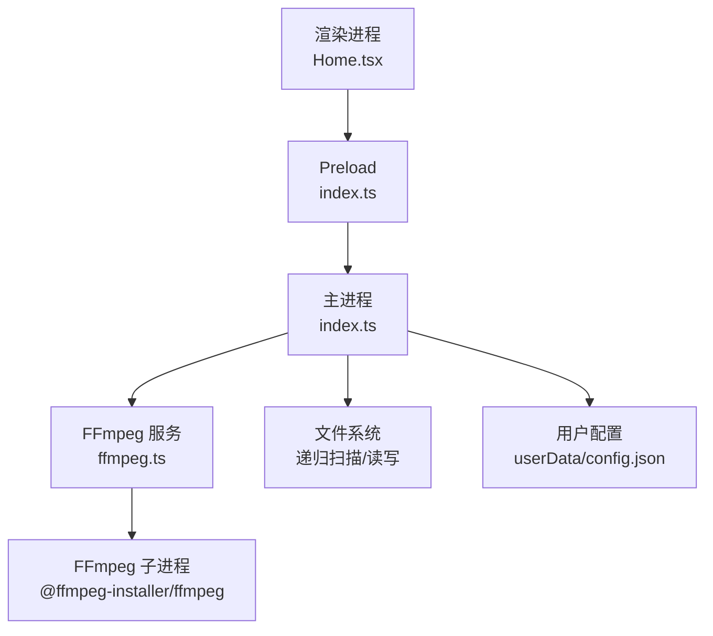
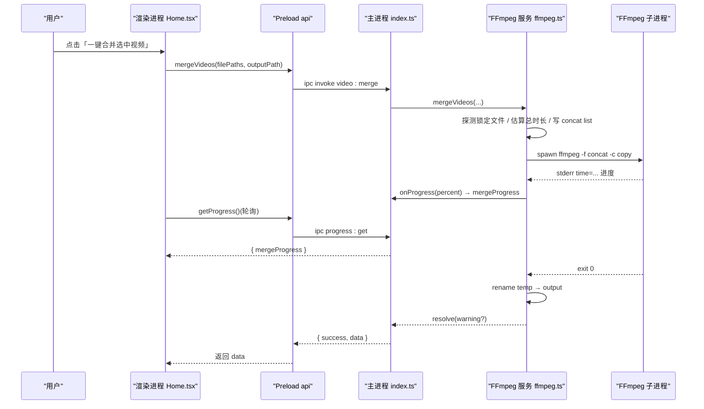
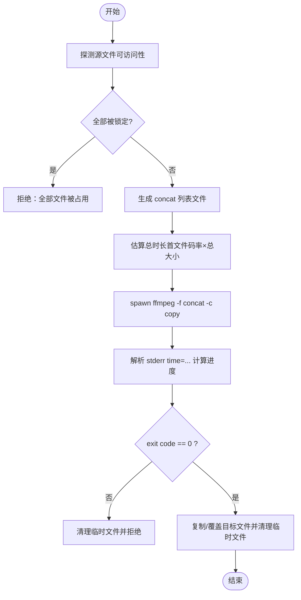
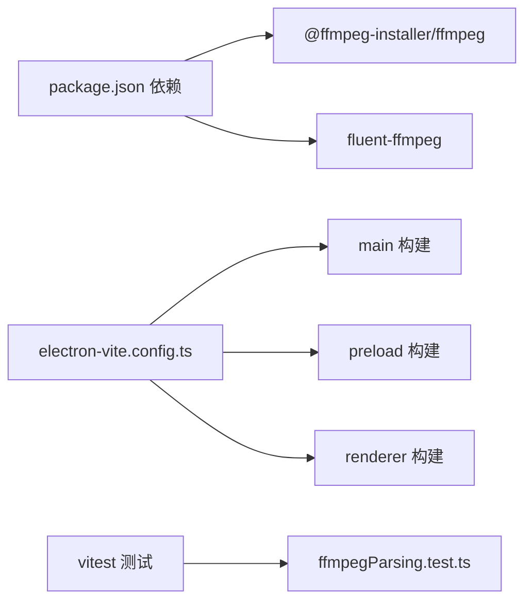

# 视频处理模块

<cite>
**本文引用的文件**   
- [src/main/ffmpeg.ts](file://src/main/ffmpeg.ts)
- [src/main/index.ts](file://src/main/index.ts)
- [src/preload/index.ts](file://src/preload/index.ts)
- [src/renderer/src/pages/Home.tsx](file://src/renderer/src/pages/Home.tsx)
- [electron.vite.config.ts](file://electron.vite.config.ts)
- [package.json](file://package.json)
- [tests/ffmpegParsing.test.ts](file://tests/ffmpegParsing.test.ts)
</cite>

## 目录
1. [简介](#简介)
2. [项目结构](#项目结构)
3. [核心组件](#核心组件)
4. [架构总览](#架构总览)
5. [详细组件分析](#详细组件分析)
6. [依赖关系分析](#依赖关系分析)
7. [性能与优化建议](#性能与优化建议)
8. [故障排查指南](#故障排查指南)
9. [结论](#结论)
10. [附录：扩展与新格式支持](#附录：扩展与新格式支持)

## 简介
本模块基于 Electron + FFmpeg，提供 FLV 分段视频的自动扫描、分组、合并为 MP4 的能力，并包含单文件转码（FLV→MP4）与视频信息探测。核心思路是“流拷贝拼接”（concat demuxer + stream copy），在避免重编码的前提下实现极速合并；同时通过轻量探测（仅读取文件头）获取时长、分辨率等元数据，结合 stderr 实时解析实现进度追踪。

## 项目结构
- 主进程负责 IPC 路由、配置管理、文件扫描与分组、并发控制以及调用底层视频处理函数。
- Preload 层暴露最小 API 给渲染进程，统一解包 IPC 返回结果。
- 渲染进程提供 UI 交互、轮询进度、展示任务状态。
- ffmpeg.ts 封装 FFmpeg 子进程调用、参数构建、临时文件管理与错误恢复。

图表来源
- [src/main/index.ts:1-530](file://src/main/index.ts#L1-L530)
- [src/preload/index.ts:1-64](file://src/preload/index.ts#L1-L64)
- [src/main/ffmpeg.ts:1-305](file://src/main/ffmpeg.ts#L1-L305)

章节来源
- [src/main/index.ts:1-120](file://src/main/index.ts#L1-L120)
- [src/preload/index.ts:1-64](file://src/preload/index.ts#L1-L64)
- [src/main/ffmpeg.ts:1-30](file://src/main/ffmpeg.ts#L1-L30)
- [electron.vite.config.ts:1-21](file://electron.vite.config.ts#L1-L21)
- [package.json:1-42](file://package.json#L1-L42)

## 核心组件
- FFmpeg 集成与路径适配：解决 asar 打包后无法直接 spawn 二进制的问题，设置可执行路径。
- 视频信息探测：快速读取文件头，提取时长、是否有音视频流、分辨率与编码类型。
- 合并算法：使用 concat demuxer + stream copy，生成列表文件，写入临时输出，成功后覆盖目标文件。
- 格式转换：使用 fluent-ffmpeg 将输入转为 H.264+AAC 的 MP4，带 faststart 优化。
- 进度追踪：解析 FFmpeg stderr 中的 time=HH:MM:SS，结合估算或真实总时长计算百分比。
- 临时文件管理：所有中间产物写入系统临时目录，失败时清理，成功时原子式移动。
- 并发控制：批量合并采用工作线程池模型，限制并发数，聚合各任务进度。

章节来源
- [src/main/ffmpeg.ts:8-11](file://src/main/ffmpeg.ts#L8-L11)
- [src/main/ffmpeg.ts:13-58](file://src/main/ffmpeg.ts#L13-L58)
- [src/main/ffmpeg.ts:87-245](file://src/main/ffmpeg.ts#L87-L245)
- [src/main/ffmpeg.ts:254-304](file://src/main/ffmpeg.ts#L254-L304)
- [src/main/index.ts:421-469](file://src/main/index.ts#L421-L469)

## 架构总览
从 UI 到 FFmpeg 的完整调用链如下：

图表来源
- [src/main/index.ts:391-403](file://src/main/index.ts#L391-L403)
- [src/main/ffmpeg.ts:162-245](file://src/main/ffmpeg.ts#L162-L245)
- [src/preload/index.ts:36-48](file://src/preload/index.ts#L36-L48)
- [src/renderer/src/pages/Home.tsx:183-236](file://src/renderer/src/pages/Home.tsx#L183-L236)

## 详细组件分析

### FFmpeg 集成方案
- 路径重定向：将 @ffmpeg-installer/ffmpeg 的路径从 app.asar 映射到 app.asar.unpacked，确保 spawn 能正确启动二进制。
- 命令行参数构建：
  - 合并：-f concat -safe 0 -i <list.txt> -c copy -y <temp.mp4>
  - 转换：libx264 + aac，-movflags +faststart
- 子进程生命周期：stderr 实时解析，close/error 事件处理退出码与异常，超时保护（30 分钟）。

章节来源
- [src/main/ffmpeg.ts:8-11](file://src/main/ffmpeg.ts#L8-L11)
- [src/main/ffmpeg.ts:162-174](file://src/main/ffmpeg.ts#L162-L174)
- [src/main/ffmpeg.ts:270-302](file://src/main/ffmpeg.ts#L270-L302)
- [src/main/ffmpeg.ts:154-160](file://src/main/ffmpeg.ts#L154-L160)

### 视频信息探测机制
- 轻量探测：spawn ffmpeg -i，只读文件头，遇到 Duration 即终止，毫秒级完成。
- 解析内容：
  - 时长：Duration HH:MM:SS.sss
  - 是否含视频/音频流
  - 视频编码、分辨率
- 对外接口：getVideoInfo 返回 duration、codec、width、height。

章节来源
- [src/main/ffmpeg.ts:13-58](file://src/main/ffmpeg.ts#L13-L58)
- [src/main/ffmpeg.ts:65-77](file://src/main/ffmpeg.ts#L65-L77)
- [tests/ffmpegParsing.test.ts:8-55](file://tests/ffmpegParsing.test.ts#L8-L55)

### 合并算法实现
- 前置校验：openSync 探测每个源文件是否被占用，跳过正在录制的片段；若全部不可用则拒绝。
- 列表文件：在系统临时目录生成 merge-list-*.txt，每行 file 'path'，escape 单引号。
- 合并策略：concat demuxer + stream copy，不重新编码，速度极快。
- 进度估算：
  - 优先尝试基于首文件 size/duration 推算 bitrate，再按 totalSize/bitrate 估算 totalDuration。
  - 实际进度以 time=HH:MM:SS 为准，上限 99.9%。
- 临时输出：merge-temp-*.mp4，完成后复制/覆盖目标路径，失败清理。

图表来源
- [src/main/ffmpeg.ts:98-117](file://src/main/ffmpeg.ts#L98-L117)
- [src/main/ffmpeg.ts:146-170](file://src/main/ffmpeg.ts#L146-L170)
- [src/main/ffmpeg.ts:178-191](file://src/main/ffmpeg.ts#L178-L191)
- [src/main/ffmpeg.ts:200-234](file://src/main/ffmpeg.ts#L200-L234)

章节来源
- [src/main/ffmpeg.ts:87-245](file://src/main/ffmpeg.ts#L87-L245)

### 格式转换功能
- 使用 fluent-ffmpeg 进行转码：
  - 视频编码：libx264
  - 音频编码：aac
  - 输出选项：-movflags +faststart（便于网络播放）
- 进度回调：fluent-ffmpeg 的 progress 事件 percent 字段驱动 UI。
- 输出安全：先写入临时文件，成功后覆盖目标，失败清理。

章节来源
- [src/main/ffmpeg.ts:254-304](file://src/main/ffmpeg.ts#L254-L304)

### 流式处理原理
- 合并阶段：concat demuxer 直接拼接已编码帧，无需解码/重编码，属于“流拷贝”。
- 进度解析：实时监听 stderr，匹配 time=HH:MM:SS，换算为当前秒数，除以估算总时长得到百分比。
- 转换阶段：fluent-ffmpeg 内部流式读取输入、编码、写出输出，on('progress') 回调提供百分比。

章节来源
- [src/main/ffmpeg.ts:162-174](file://src/main/ffmpeg.ts#L162-L174)
- [src/main/ffmpeg.ts:178-191](file://src/main/ffmpeg.ts#L178-L191)
- [src/main/ffmpeg.ts:270-302](file://src/main/ffmpeg.ts#L270-L302)

### 进度追踪机制
- 单任务：主进程维护 mergeProgress/convertProgress，渲染进程每 300ms 轮询 progress:get。
- 批量任务：Map<taskId, number> 记录每个任务的进度，渲染进程轮询 progress:getBatch。
- 进度上限：合并进度最大 99.9%，避免 100% 提前触发。

章节来源
- [src/main/index.ts:9-14](file://src/main/index.ts#L9-L14)
- [src/main/index.ts:496-498](file://src/main/index.ts#L496-L498)
- [src/main/index.ts:472-478](file://src/main/index.ts#L472-L478)
- [src/main/ffmpeg.ts:187](file://src/main/ffmpeg.ts#L187)

### 临时文件管理策略
- 列表文件：merge-list-*.txt（系统临时目录）
- 临时输出：merge-temp-*.mp4 / convert-temp-*.mp4
- 清理时机：
  - 超时：清理临时输出与列表文件
  - 失败：清理临时输出
  - 成功：复制/覆盖目标后删除临时输出
- 覆盖保护：若目标存在，先尝试删除，失败则备份为 _backup.mp4 再覆盖。

章节来源
- [src/main/ffmpeg.ts:146-152](file://src/main/ffmpeg.ts#L146-L152)
- [src/main/ffmpeg.ts:154-160](file://src/main/ffmpeg.ts#L154-L160)
- [src/main/ffmpeg.ts:198-234](file://src/main/ffmpeg.ts#L198-L234)

### 错误处理与异常恢复
- 文件锁定：openSync 探测，跳过录制中片段；全部锁定则拒绝。
- 超时保护：30 分钟超时，清理临时文件并拒绝。
- 退出码非零：保留最后若干行 stderr 日志，拒绝并清理临时输出。
- 覆盖失败：备份已有文件，若仍失败则拒绝。
- 启动失败：捕获 spawn error，清理临时文件并拒绝。

章节来源
- [src/main/ffmpeg.ts:98-117](file://src/main/ffmpeg.ts#L98-L117)
- [src/main/ffmpeg.ts:154-160](file://src/main/ffmpeg.ts#L154-L160)
- [src/main/ffmpeg.ts:200-206](file://src/main/ffmpeg.ts#L200-L206)
- [src/main/ffmpeg.ts:209-234](file://src/main/ffmpeg.ts#L209-L234)
- [src/main/ffmpeg.ts:237-243](file://src/main/ffmpeg.ts#L237-L243)

### 批量处理与并发控制
- 任务队列：数组 tasks，currentIndex 指针顺序分配。
- 工作线程：创建 min(concurrency, tasks.length) 个 worker，Promise.all 并行执行。
- 进度聚合：Map<taskId, number>，渲染端轮询显示每个任务进度。
- 结果汇总：success/failure 标记，warning/error 消息透传。

章节来源
- [src/main/index.ts:421-469](file://src/main/index.ts#L421-L469)
- [src/main/index.ts:472-478](file://src/main/index.ts#L472-L478)

### 代码示例（路径引用）
- 单文件合并：参考合并入口与参数构建
  - [src/main/ffmpeg.ts:87-245](file://src/main/ffmpeg.ts#L87-L245)
- 批量处理：参考批量合并处理器
  - [src/main/index.ts:421-469](file://src/main/index.ts#L421-L469)
- 进度回调：参考进度解析与上报
  - [src/main/ffmpeg.ts:178-191](file://src/main/ffmpeg.ts#L178-L191)
  - [src/main/index.ts:496-498](file://src/main/index.ts#L496-L498)

## 依赖关系分析
- 运行时依赖：
  - @ffmpeg-installer/ffmpeg：提供 FFmpeg 二进制
  - fluent-ffmpeg：高级封装，用于转码流程
- 构建与打包：
  - electron-vite：分离 main/preload/renderer 构建
  - electron-builder：asarUnpack 解包 ffmpeg 二进制与资源
- 测试：
  - vitest：单元测试（注意：当前测试未 import 真实源码，覆盖率有限）

图表来源
- [package.json:17-20](file://package.json#L17-L20)
- [electron.vite.config.ts:1-21](file://electron.vite.config.ts#L1-L21)
- [tests/ffmpegParsing.test.ts:1-10](file://tests/ffmpegParsing.test.ts#L1-L10)

章节来源
- [package.json:1-42](file://package.json#L1-L42)
- [electron.vite.config.ts:1-21](file://electron.vite.config.ts#L1-L21)
- [tests/ffmpegParsing.test.ts:1-148](file://tests/ffmpegParsing.test.ts#L1-L148)

## 性能与优化建议
- 并发控制
  - 合理设置 concurrency（默认 3），根据 CPU 核数与磁盘 I/O 能力调整。
  - 多组合并串行改为受限并发，避免过多 FFmpeg 子进程争抢资源。
- 内存使用
  - 合并阶段为流拷贝，内存占用低；转码阶段需关注 libx264 缓冲与帧队列。
  - 大文件转码时建议分批处理，避免峰值内存过高。
- 磁盘 I/O 优化
  - 临时文件与输出文件尽量位于同一物理盘，减少跨盘复制开销。
  - 避免与录制进程共享同一目录，降低锁竞争。
- 进度估算改进
  - 对每个可访问文件执行 ffmpegProbe 求和真实 duration，替代首文件码率×总大小的估算。
  - 当 totalDuration=0 时，提供平滑占位进度，避免 0→100 跳变。
- 扫描异步化
  - 将同步 readdirSync/statSync 替换为 fs.promises 递归，避免阻塞主进程事件循环。

[本节为通用指导，不直接分析具体文件]

## 故障排查指南
- 合并失败（exit code 非零）
  - 查看最后若干行 stderr 日志，定位具体错误原因。
  - 检查源文件是否被其他进程占用（录制中）。
  - 确认输出目录是否存在且可写。
- 进度无变化
  - 检查 totalDuration 是否为 0（探针失败导致）。
  - 确认 FFmpeg 正常输出 time=HH:MM:SS。
- 超时（30 分钟）
  - 部分源文件可能仍在录制中，等待或跳过后再试。
- 覆盖失败
  - 目标文件可能被占用或权限不足，尝试关闭占用进程或以管理员权限运行。

章节来源
- [src/main/ffmpeg.ts:200-206](file://src/main/ffmpeg.ts#L200-L206)
- [src/main/ffmpeg.ts:154-160](file://src/main/ffmpeg.ts#L154-L160)
- [src/main/ffmpeg.ts:209-234](file://src/main/ffmpeg.ts#L209-L234)

## 结论
该模块在架构上清晰、核心合并算法高效（免转码拼接），具备较好的健壮性与用户体验细节。但仍有产品级缺口（如格式转换未接入 UI）、安全加固（sandbox/CSP/userData 路径）、代码质量（strict/魔法值/重复类型）与测试有效性（import 真实源码）等方面需要完善。建议优先补齐 PRD 交付项与夯实测试与安全地基，再迭代高级特性。

[本节为总结，不直接分析具体文件]

## 附录：扩展与新格式支持
- 新增支持格式
  - 在 VIDEO_EXTENSIONS 中添加新扩展名（如 .mkv/.webm），并在扫描逻辑中识别。
  - 若需转码，可在 convertToMp4 中调整编码器与参数。
- 自定义处理流程
  - 在 mergeVideos 中增加预处理步骤（如关键帧对齐、流一致性校验）。
  - 在 convertToMp4 中扩展输出选项（如码率、预设、滤镜）。
- 扩展点
  - 进度估算：改为真实时长求和，提升准确性。
  - 并发控制：引入任务队列与优先级。
  - 错误恢复：断点续合并、失败重试。

章节来源
- [src/main/index.ts:127-132](file://src/main/index.ts#L127-L132)
- [src/main/ffmpeg.ts:254-304](file://src/main/ffmpeg.ts#L254-L304)