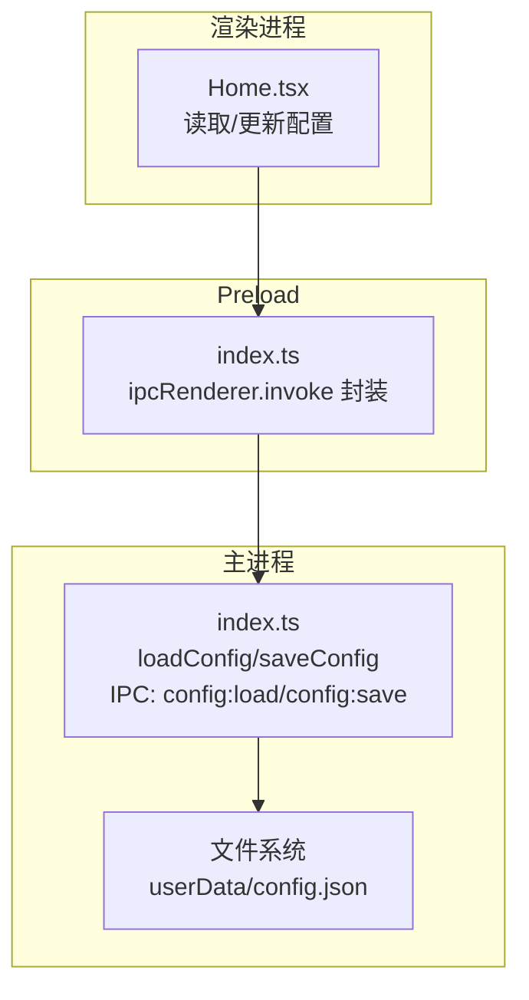
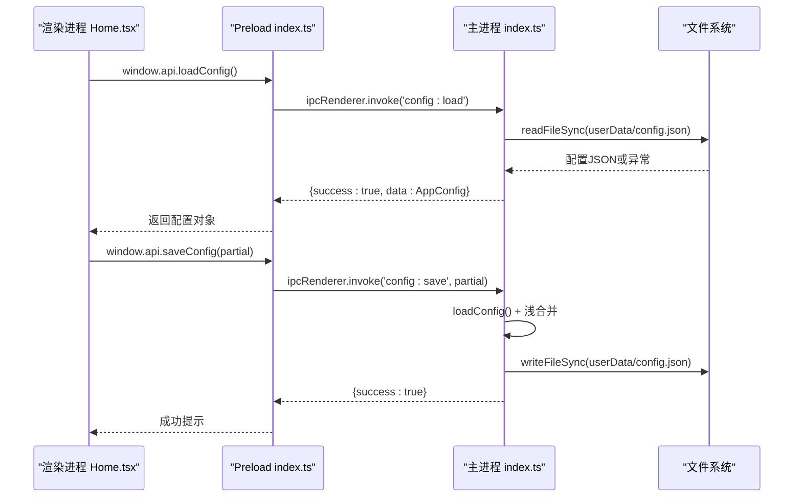
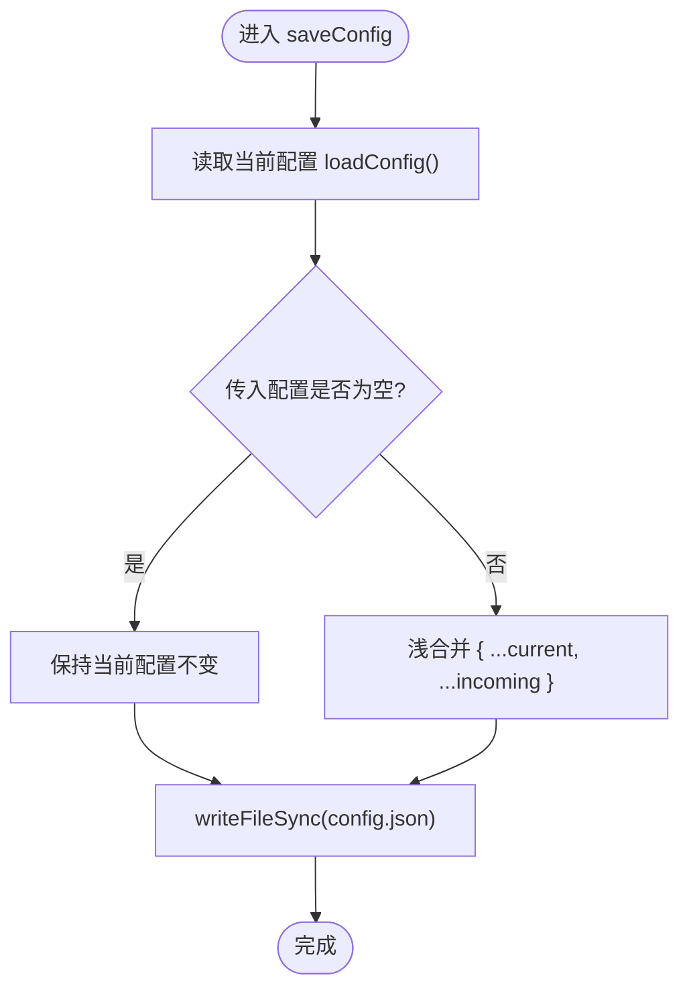
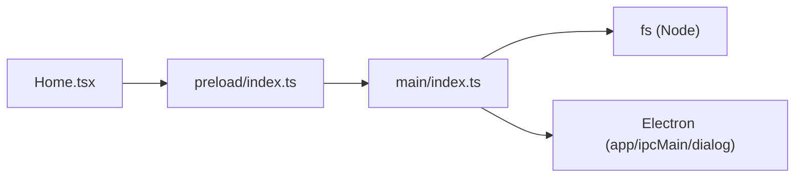

# 配置管理模块

<cite>
**本文引用的文件列表**
- [src/main/index.ts](file://src/main/index.ts)
- [src/preload/index.ts](file://src/preload/index.ts)
- [src/renderer/src/pages/Home.tsx](file://src/renderer/src/pages/Home.tsx)
- [tests/configAndUtils.test.ts](file://tests/configAndUtils.test.ts)
</cite>

## 目录
1. [简介](#简介)
2. [项目结构](#项目结构)
3. [核心组件](#核心组件)
4. [架构总览](#架构总览)
5. [详细组件分析](#详细组件分析)
6. [依赖关系分析](#依赖关系分析)
7. [性能与可靠性](#性能与可靠性)
8. [故障排查指南](#故障排查指南)
9. [结论](#结论)
10. [附录：扩展与迁移指南](#附录扩展与迁移指南)

## 简介
本章节聚焦“配置管理模块”，围绕用户配置的存储机制、配置项定义与默认值管理、JSON 结构与字段含义、数据校验规则、加载/保存/合并逻辑，以及开发/生产环境差异、迁移策略和版本兼容性进行系统化说明。同时提供从渲染进程到主进程的完整调用流程示例路径，帮助开发者快速理解并扩展配置能力。

## 项目结构
配置相关代码主要分布在以下位置：
- 主进程（Electron Main）：负责配置文件的读写、IPC 处理、应用启动时 userData 路径设置等
- Preload：暴露安全的 API 给渲染进程
- 渲染进程（React UI）：读取配置、展示设置面板、触发保存
- 测试：覆盖配置合并逻辑

图表来源
- [src/main/index.ts:102-110](file://src/main/index.ts#L102-L110)
- [src/preload/index.ts:21-24](file://src/preload/index.ts#L21-L24)
- [src/renderer/src/pages/Home.tsx:44-77](file://src/renderer/src/pages/Home.tsx#L44-L77)

章节来源
- [src/main/index.ts:16-65](file://src/main/index.ts#L16-L65)
- [src/preload/index.ts:1-24](file://src/preload/index.ts#L1-L24)
- [src/renderer/src/pages/Home.tsx:44-102](file://src/renderer/src/pages/Home.tsx#L44-L102)

## 核心组件
- 配置数据结构：AppConfig（可选字段，用于描述用户偏好与上次选择的路径等）
- 配置文件路径：基于 Electron 的 userData 目录，文件名固定为 config.json
- 加载逻辑：loadConfig 从磁盘读取 JSON，失败或不存在返回空对象
- 保存逻辑：saveConfig 先读取当前配置，再与传入的新配置浅合并后持久化
- IPC 通道：config:load、config:save
- 预加载桥接：preload 将 loadConfig/saveConfig 暴露为 window.api.loadConfig/saveConfig
- 渲染交互：Home.tsx 在启动时自动加载配置，并在设置面板中保存变更

章节来源
- [src/main/index.ts:18-28](file://src/main/index.ts#L18-L28)
- [src/main/index.ts:30-65](file://src/main/index.ts#L30-L65)
- [src/main/index.ts:102-110](file://src/main/index.ts#L102-L110)
- [src/preload/index.ts:21-24](file://src/preload/index.ts#L21-L24)
- [src/renderer/src/pages/Home.tsx:44-77](file://src/renderer/src/pages/Home.tsx#L44-L77)

## 架构总览
配置管理的端到端流程如下：

图表来源
- [src/main/index.ts:102-110](file://src/main/index.ts#L102-L110)
- [src/preload/index.ts:9-18](file://src/preload/index.ts#L9-L18)
- [src/renderer/src/pages/Home.tsx:676-691](file://src/renderer/src/pages/Home.tsx#L676-L691)

## 详细组件分析

### 配置数据结构与默认值
- 字段定义（全部可选）：
  - inputFolder?: string — 上次选择的输入文件夹
  - outputFolder?: string — 上次选择的输出文件夹
  - outputFileName?: string — 输出文件名模板（未使用）
  - darkMode?: boolean — 深色模式开关（未使用）
  - concurrency?: number — 并行合并数（界面可配置）
  - maxIntervalHours?: number — 同场直播判定间隔（小时）
  - autoOpenWebsite?: boolean — 完成后自动打开网站
  - autoOpenFolder?: boolean — 完成后自动打开输出文件夹
  - hiddenFolderKeys?: string[] — 已排除分组键集合
- 默认值策略：
  - 首次运行无配置文件时，loadConfig 返回空对象 {}
  - 渲染层对部分字段有本地默认值（如 maxIntervalHours=2.5、concurrency=3），这些默认值仅在内存中使用，不会写入配置文件，除非用户显式保存

章节来源
- [src/main/index.ts:18-28](file://src/main/index.ts#L18-L28)
- [src/renderer/src/pages/Home.tsx:28-39](file://src/renderer/src/pages/Home.tsx#L28-L39)

### 配置文件存储与路径
- 存储位置：app.getPath('userData') 下的 config.json
- 开发模式：通过 app.setPath('userData', ...) 将 userData 指向项目内 user-data 目录，便于调试
- 打包后：使用系统默认 userData 目录（例如 Windows 下 %APPDATA% 子目录）

章节来源
- [src/main/index.ts:30-36](file://src/main/index.ts#L30-L36)
- [src/main/index.ts:500-503](file://src/main/index.ts#L500-L503)

### 配置加载与保存逻辑
- 加载（loadConfig）：
  - 若存在 config.json，则解析 JSON 并返回；否则返回 {}
  - 捕获异常并记录日志，保证健壮性
- 保存（saveConfig）：
  - 先读取当前配置，再将传入的部分配置与其浅合并（新值覆盖旧值）
  - 以格式化 JSON 写入文件，确保可读性与后续维护友好
- 合并语义：
  - 支持部分更新：只覆盖传入的字段，其余保留
  - 支持清空字段：将某字段设为 undefined 可实现“清除”效果（由浅合并特性决定）

图表来源
- [src/main/index.ts:54-65](file://src/main/index.ts#L54-L65)

章节来源
- [src/main/index.ts:38-65](file://src/main/index.ts#L38-L65)
- [tests/configAndUtils.test.ts:8-46](file://tests/configAndUtils.test.ts#L8-L46)

### IPC 接口与预加载桥接
- 主进程 IPC：
  - config:load → 返回 { success: true, data: AppConfig }
  - config:save → 接收 AppConfig 片段，执行保存，返回 { success: true }
- 预加载桥接：
  - 统一封装 invokeApi，自动解包 { success, data?, message? } 格式
  - 暴露 window.api.loadConfig / window.api.saveConfig 供渲染进程调用

章节来源
- [src/main/index.ts:102-110](file://src/main/index.ts#L102-L110)
- [src/preload/index.ts:9-18](file://src/preload/index.ts#L9-L18)
- [src/preload/index.ts:21-24](file://src/preload/index.ts#L21-L24)

### 渲染进程中的配置使用
- 启动时自动加载配置：
  - 调用 window.api.loadConfig()
  - 根据返回的配置初始化输入/输出目录、并发数、间隔阈值、自动打开开关、隐藏分组键等
- 设置面板保存：
  - 用户修改后点击保存，调用 window.api.saveConfig({ ... }) 仅提交变更字段
  - 成功后给出提示并关闭抽屉

章节来源
- [src/renderer/src/pages/Home.tsx:44-77](file://src/renderer/src/pages/Home.tsx#L44-L77)
- [src/renderer/src/pages/Home.tsx:676-691](file://src/renderer/src/pages/Home.tsx#L676-L691)

### 数据验证规则
- 当前实现未对配置字段进行类型或范围校验，直接按 JSON 原样读写
- 建议的验证维度（实践指导，非现有实现）：
  - 路径字段：检查是否存在、是否可读/可写
  - 数值字段：限制范围（如 concurrency ∈ [1, 8]，maxIntervalHours ∈ [0.5, 12]）
  - 布尔字段：强制布尔类型
  - 数组字段：去重、长度上限
- 可在 saveConfig 前增加校验函数，或在 IPC 入口处集中校验

章节来源
- [src/main/index.ts:38-65](file://src/main/index.ts#L38-L65)

## 依赖关系分析
- 主进程依赖：
  - Electron：app.getPath('userData')、ipcMain.handle、dialog、Menu
  - Node.js fs：existsSync/readFileSync/writeFileSync/mkdirSync
- 预加载依赖：
  - electron.contextBridge/exposeInMainWorld
  - electron.ipcRenderer.invoke
- 渲染进程依赖：
  - React 状态管理与 Ant Design 组件
  - window.api 暴露的方法

图表来源
- [src/renderer/src/pages/Home.tsx:44-77](file://src/renderer/src/pages/Home.tsx#L44-L77)
- [src/preload/index.ts:1-24](file://src/preload/index.ts#L1-L24)
- [src/main/index.ts:1-5](file://src/main/index.ts#L1-L5)

章节来源
- [src/main/index.ts:1-5](file://src/main/index.ts#L1-L5)
- [src/preload/index.ts:1-24](file://src/preload/index.ts#L1-L24)
- [src/renderer/src/pages/Home.tsx:44-77](file://src/renderer/src/pages/Home.tsx#L44-L77)

## 性能与可靠性
- 加载/保存均为同步 I/O，简单可靠；对于频繁保存场景可考虑异步化与批处理
- 合并策略采用浅合并，时间复杂度 O(n)，n 为配置字段数量，开销极低
- 错误处理：
  - 读取失败返回空对象，避免崩溃
  - 写入失败记录错误日志，不中断业务流程
- 建议：
  - 引入轻量级校验与默认值填充，提升鲁棒性
  - 对大体积配置（未来可能）考虑增量保存或压缩

[本节为通用建议，不直接分析具体文件]

## 故障排查指南
- 常见问题与定位：
  - 配置未持久化：检查是否在开发模式下设置了自定义 userData 路径，确认该目录是否有写入权限
  - 保存无效：查看主进程控制台日志，确认 saveConfig 是否抛出异常
  - 字段丢失：确认前端是否传入了正确的字段名，且未被覆盖为 undefined
- 关键日志点：
  - loadConfig 打印路径与读取结果
  - saveConfig 打印写入内容与成功/失败信息

章节来源
- [src/main/index.ts:38-65](file://src/main/index.ts#L38-L65)
- [src/main/index.ts:500-503](file://src/main/index.ts#L500-L503)

## 结论
配置管理模块采用简洁可靠的 JSON 文件持久化方案，结合 IPC 桥接实现了跨进程的安全访问。当前实现具备基本的加载、保存与浅合并能力，满足日常使用需求。建议在后续迭代中加入数据校验、默认值填充、迁移脚本与更完善的错误恢复机制，以提升稳定性与可维护性。

[本节为总结，不直接分析具体文件]

## 附录：扩展与迁移指南

### 添加新配置项的步骤
- 在主进程定义新的字段（可选）：
  - 在 AppConfig 接口中添加新字段
  - 在 saveConfig 的合并逻辑中自然支持新字段
- 在渲染进程中：
  - 在启动时读取并初始化新字段
  - 在设置面板中新增控件，并在保存时提交新字段
- 在测试中：
  - 补充针对新字段的合并与边界用例

章节来源
- [src/main/index.ts:18-28](file://src/main/index.ts#L18-L28)
- [src/renderer/src/pages/Home.tsx:44-77](file://src/renderer/src/pages/Home.tsx#L44-L77)
- [tests/configAndUtils.test.ts:8-46](file://tests/configAndUtils.test.ts#L8-L46)

### 配置文件 JSON 结构与字段含义
- 根对象为 AppConfig，所有字段可选
- 常见字段含义：
  - inputFolder/outputFolder：上次选择的输入/输出目录
  - concurrency/maxIntervalHours：并行度与分组间隔
  - autoOpenWebsite/autoOpenFolder：完成后自动打开行为
  - hiddenFolderKeys：被排除的分组键集合
- 注意：
  - 未设置的字段不会出现在文件中
  - 渲染层默认值仅影响内存状态，不会自动写入

章节来源
- [src/main/index.ts:18-28](file://src/main/index.ts#L18-L28)
- [src/renderer/src/pages/Home.tsx:28-39](file://src/renderer/src/pages/Home.tsx#L28-L39)

### 开发环境与生产环境的差异
- 开发环境：
  - 通过 app.setPath('userData', join(__dirname, '../../user-data')) 将配置落盘到项目目录，便于调试
- 生产环境：
  - 使用系统默认 userData 目录，避免安装目录只读导致写入失败

章节来源
- [src/main/index.ts:500-503](file://src/main/index.ts#L500-L503)

### 配置迁移与版本兼容
- 现状：
  - 当前代码未实现显式的配置迁移逻辑
  - 首次运行若无配置文件，将返回空对象，渲染层使用内存默认值
- 建议方案：
  - 在应用启动时检测配置文件是否存在，若不存在则创建包含默认值的初始配置
  - 当配置结构升级时，提供迁移脚本，将旧字段映射到新字段，并清理废弃字段
  - 在保存前进行最小化校验，拒绝非法值并回滚

章节来源
- [src/main/index.ts:38-52](file://src/main/index.ts#L38-L52)
- [src/renderer/src/pages/Home.tsx:28-39](file://src/renderer/src/pages/Home.tsx#L28-L39)

### 典型操作流程示例（路径引用）
- 读取配置：
  - 渲染进程：window.api.loadConfig()
  - 预加载桥接：invokeApi('config:load')
  - 主进程：ipcMain.handle('config:load') → loadConfig()
- 更新配置：
  - 渲染进程：window.api.saveConfig({ concurrency, maxIntervalHours, ... })
  - 预加载桥接：invokeApi('config:save', partial)
  - 主进程：ipcMain.handle('config:save') → saveConfig(partial)

章节来源
- [src/renderer/src/pages/Home.tsx:44-77](file://src/renderer/src/pages/Home.tsx#L44-L77)
- [src/preload/index.ts:21-24](file://src/preload/index.ts#L21-L24)
- [src/main/index.ts:102-110](file://src/main/index.ts#L102-L110)