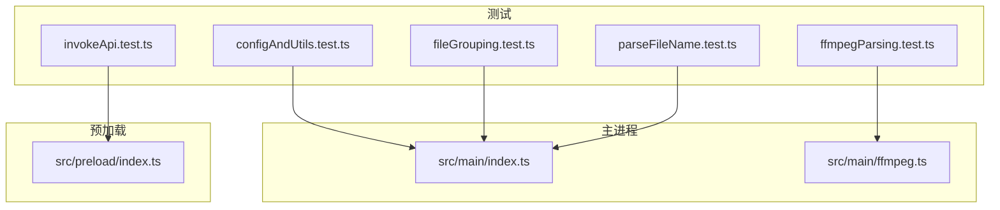
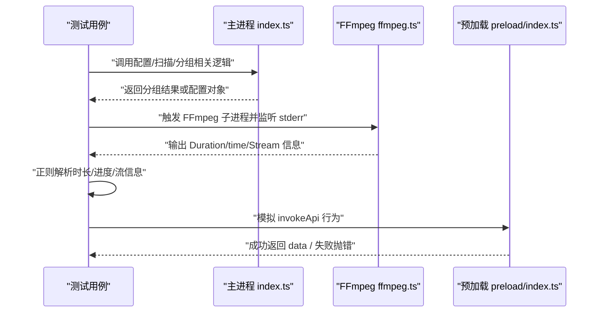
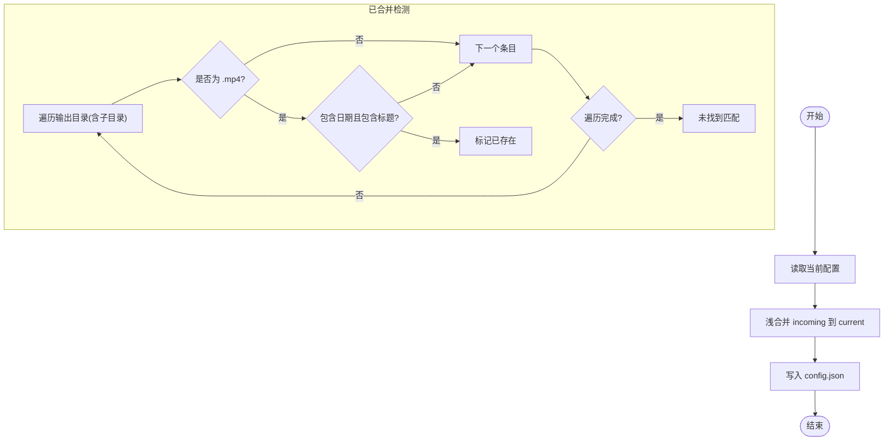
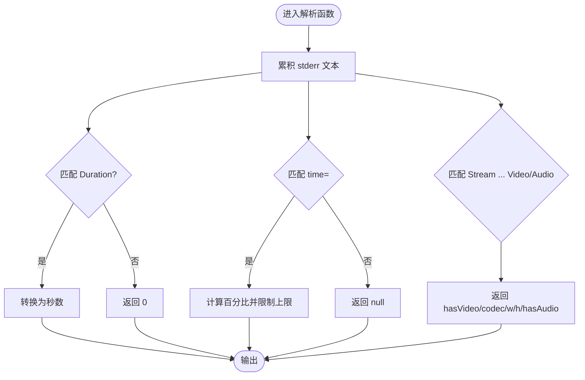
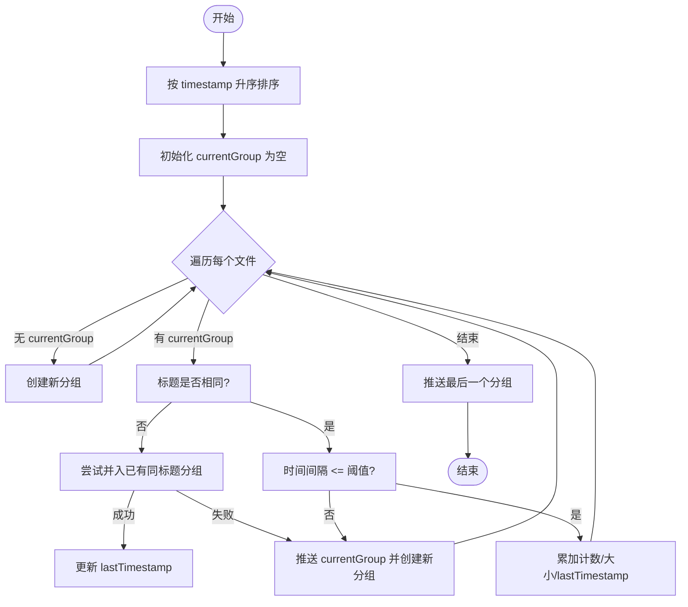
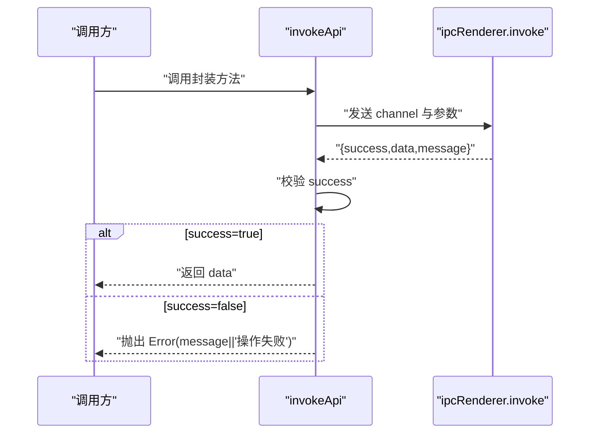
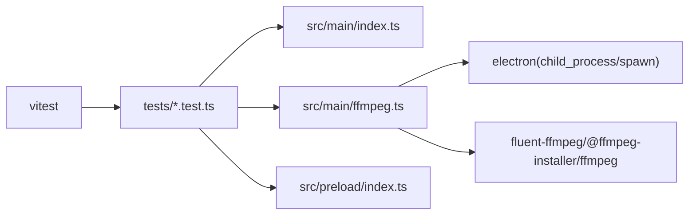

# 测试指南

<cite>
**本文引用的文件**
- [package.json](file://package.json)
- [src/main/index.ts](file://src/main/index.ts)
- [src/main/ffmpeg.ts](file://src/main/ffmpeg.ts)
- [src/preload/index.ts](file://src/preload/index.ts)
- [tests/configAndUtils.test.ts](file://tests/configAndUtils.test.ts)
- [tests/ffmpegParsing.test.ts](file://tests/ffmpegParsing.test.ts)
- [tests/fileGrouping.test.ts](file://tests/fileGrouping.test.ts)
- [tests/invokeApi.test.ts](file://tests/invokeApi.test.ts)
- [tests/parseFileName.test.ts](file://tests/parseFileName.test.ts)
</cite>

## 目录
1. [简介](#简介)
2. [项目结构](#项目结构)
3. [核心组件](#核心组件)
4. [架构总览](#架构总览)
5. [详细组件分析](#详细组件分析)
6. [依赖关系分析](#依赖关系分析)
7. [性能与稳定性考量](#性能与稳定性考量)
8. [故障排查指南](#故障排查指南)
9. [结论](#结论)
10. [附录](#附录)

## 简介
本指南面向测试开发者与质量保证人员，系统化说明本项目的测试策略、Vitest 框架使用方式、单元测试与集成测试编写规范，并结合现有测试用例进行实战指导。文档同时给出覆盖率建议与持续集成配置思路，帮助团队为新功能快速补充高质量测试。

## 项目结构
本项目采用 Electron + React 的桌面应用架构，测试集中在 tests 目录下，主要覆盖主进程逻辑（文件扫描、分组、配置）、FFmpeg 输出解析、预加载层 IPC 解包等关键路径。

图表来源
- [package.json:1-42](file://package.json#L1-L42)
- [src/main/index.ts:1-530](file://src/main/index.ts#L1-L530)
- [src/main/ffmpeg.ts:1-305](file://src/main/ffmpeg.ts#L1-L305)
- [src/preload/index.ts:1-64](file://src/preload/index.ts#L1-L64)
- [tests/configAndUtils.test.ts:1-110](file://tests/configAndUtils.test.ts#L1-L110)
- [tests/ffmpegParsing.test.ts:1-148](file://tests/ffmpegParsing.test.ts#L1-L148)
- [tests/fileGrouping.test.ts:1-170](file://tests/fileGrouping.test.ts#L1-L170)
- [tests/invokeApi.test.ts:1-70](file://tests/invokeApi.test.ts#L1-L70)
- [tests/parseFileName.test.ts:1-77](file://tests/parseFileName.test.ts#L1-L77)

章节来源
- [package.json:1-42](file://package.json#L1-L42)

## 核心组件
- 配置合并与持久化：主进程负责读取/保存用户配置，并实现增量合并策略。
- 文件扫描与分组：按文件名中的日期、时间、标题将 FLV 片段归并为“同一场直播”的组，支持时间间隔阈值控制。
- FFmpeg 输出解析：从 stderr 中解析时长、进度百分比、视频流信息（编码、分辨率、是否有音频）。
- 预加载 IPC 解包：统一处理后端返回的 { success, data?, message? } 格式，成功返回 data，失败抛出错误。
- 文件名解析：从标准命名中提取日期、时间、标题，非标准时回退为默认值。

章节来源
- [src/main/index.ts:17-65](file://src/main/index.ts#L17-L65)
- [src/main/index.ts:145-345](file://src/main/index.ts#L145-L345)
- [src/main/ffmpeg.ts:13-77](file://src/main/ffmpeg.ts#L13-L77)
- [src/preload/index.ts:9-18](file://src/preload/index.ts#L9-L18)
- [src/main/index.ts:164-179](file://src/main/index.ts#L164-L179)

## 架构总览
下图展示了测试与源码模块之间的对应关系，以及关键数据流。

图表来源
- [src/main/index.ts:145-345](file://src/main/index.ts#L145-L345)
- [src/main/ffmpeg.ts:174-191](file://src/main/ffmpeg.ts#L174-L191)
- [src/preload/index.ts:9-18](file://src/preload/index.ts#L9-L18)

## 详细组件分析

### 配置合并与已合并检测
- 配置合并：采用浅合并策略，新字段覆盖旧字段；空更新保留旧配置；可通过传入 undefined 清除字段。
- 已合并检测：通过目标目录递归扫描 MP4 文件，判断是否包含日期与标题（大小写不敏感）以判定重复。

图表来源
- [src/main/index.ts:38-65](file://src/main/index.ts#L38-L65)
- [src/main/index.ts:309-345](file://src/main/index.ts#L309-L345)

章节来源
- [tests/configAndUtils.test.ts:8-46](file://tests/configAndUtils.test.ts#L8-L46)
- [tests/configAndUtils.test.ts:48-83](file://tests/configAndUtils.test.ts#L48-L83)
- [src/main/index.ts:38-65](file://src/main/index.ts#L38-L65)
- [src/main/index.ts:309-345](file://src/main/index.ts#L309-L345)

### FFmpeg 输出解析
- 时长解析：从 stderr 中匹配 Duration 行，换算为秒数。
- 进度解析：匹配 time=HH:MM:SS.ms，结合总时长计算百分比，上限限制在 99.9%。
- 视频流信息：识别 Video/Audio 流，提取编码、分辨率。

图表来源
- [src/main/ffmpeg.ts:26-57](file://src/main/ffmpeg.ts#L26-L57)
- [src/main/ffmpeg.ts:178-191](file://src/main/ffmpeg.ts#L178-L191)

章节来源
- [tests/ffmpegParsing.test.ts:8-55](file://tests/ffmpegParsing.test.ts#L8-L55)
- [tests/ffmpegParsing.test.ts:57-97](file://tests/ffmpegParsing.test.ts#L57-L97)
- [tests/ffmpegParsing.test.ts:99-147](file://tests/ffmpegParsing.test.ts#L99-L147)
- [src/main/ffmpeg.ts:26-57](file://src/main/ffmpeg.ts#L26-L57)
- [src/main/ffmpeg.ts:178-191](file://src/main/ffmpeg.ts#L178-L191)

### 文件分组算法
- 输入：按时间戳排序后的文件列表。
- 规则：相同标题且相邻时间间隔不超过阈值（小时）则归入同一组；否则新建分组或尝试并入已有同标题分组。
- 输出：分组统计（数量、总大小、文件夹名等）。

图表来源
- [src/main/index.ts:216-307](file://src/main/index.ts#L216-L307)

章节来源
- [tests/fileGrouping.test.ts:83-169](file://tests/fileGrouping.test.ts#L83-L169)
- [src/main/index.ts:216-307](file://src/main/index.ts#L216-L307)

### 预加载 IPC 解包
- 成功：返回 data 字段（可为 undefined/null/数组/字符串/数字等）。
- 失败：抛出错误，优先使用 message，否则使用默认消息。
- 非标准返回：若无 success 字段，原样返回。

图表来源
- [src/preload/index.ts:9-18](file://src/preload/index.ts#L9-L18)

章节来源
- [tests/invokeApi.test.ts:24-69](file://tests/invokeApi.test.ts#L24-L69)
- [src/preload/index.ts:9-18](file://src/preload/index.ts#L9-L18)

### 文件名解析
- 标准格式：YYYY-MM-DD HH-mm-ss-ms 标题.flv，可提取 date/time/title。
- 非标准：回退为“未知日期/未知时间”，title 取剩余部分或“未命名”。

章节来源
- [tests/parseFileName.test.ts:25-76](file://tests/parseFileName.test.ts#L25-L76)
- [src/main/index.ts:164-179](file://src/main/index.ts#L164-L179)

## 依赖关系分析
- 测试与源码耦合点：
  - 配置与分组：tests 直接验证 src/main/index.ts 中的合并与分组逻辑。
  - FFmpeg 解析：tests 验证 src/main/ffmpeg.ts 中正则与进度计算。
  - 预加载解包：tests 验证 src/preload/index.ts 的 invokeApi 行为。
- 外部依赖：
  - fluent-ffmpeg 与 @ffmpeg-installer/ffmpeg：用于视频处理与子进程启动。
  - electron：主进程窗口、IPC、文件系统访问。
  - vitest：测试运行器。

图表来源
- [package.json:17-40](file://package.json#L17-L40)
- [src/main/ffmpeg.ts:1-10](file://src/main/ffmpeg.ts#L1-L10)
- [src/main/index.ts:1-6](file://src/main/index.ts#L1-L6)
- [src/preload/index.ts:1-3](file://src/preload/index.ts#L1-L3)

章节来源
- [package.json:17-40](file://package.json#L17-L40)

## 性能与稳定性考量
- 进度估算：基于首个文件的码率估算总时长，避免全量探测带来的开销；当无法获取时长时回退为 0，防止除零异常。
- 进度上限：进度百分比限制在 99.9%，避免 UI 显示 100% 导致误判完成。
- 超时保护：合并过程设置超时，清理临时文件并拒绝任务，防止长时间挂起。
- 并发合并：批量合并通过工作线程池并行执行，提升吞吐。

章节来源
- [src/main/ffmpeg.ts:127-144](file://src/main/ffmpeg.ts#L127-L144)
- [src/main/ffmpeg.ts:178-191](file://src/main/ffmpeg.ts#L178-L191)
- [src/main/ffmpeg.ts:154-160](file://src/main/ffmpeg.ts#L154-L160)
- [src/main/index.ts:421-469](file://src/main/index.ts#L421-L469)

## 故障排查指南
- 常见错误定位：
  - 合并失败：检查 FFmpeg 退出码与最后若干行 stderr，确认源文件是否被占用或路径非法。
  - 进度异常：核对总时长估算是否合理，确认 time= 输出是否符合预期。
  - 分组异常：检查文件名解析是否正确，确认时间戳排序与间隔阈值设置。
  - IPC 解包异常：确认后端返回结构是否包含 success 字段，message 是否提供。
- 调试建议：
  - 在主进程中打印关键中间变量（如 totalDuration、percent、group 统计）。
  - 对 FFmpeg 子进程命令进行日志记录，便于复现问题。
  - 使用最小数据集构造回归用例，确保边界条件稳定。

章节来源
- [src/main/ffmpeg.ts:200-244](file://src/main/ffmpeg.ts#L200-L244)
- [src/main/index.ts:391-403](file://src/main/index.ts#L391-L403)
- [src/preload/index.ts:9-18](file://src/preload/index.ts#L9-L18)

## 结论
本项目测试覆盖了配置管理、文件分组、FFmpeg 输出解析、IPC 解包与文件名解析等核心路径，具备良好的健壮性与可读性。建议在后续迭代中：
- 引入覆盖率报告与阈值，确保新增代码具备相应测试。
- 完善端到端与渲染层测试，形成更完整的保障体系。
- 针对真实 FFmpeg 产出的边界场景（如超大文件、损坏文件）补充专项用例。

## 附录

### Vitest 配置与使用
- 脚本入口：通过 package.json 的 test 脚本执行 vitest run。
- 配置文件：仓库根目录未发现显式 vitest.config.*，默认使用 Vitest 约定式配置。
- 运行方式：
  - 本地运行：npm test 或 npx vitest run
  - 指定文件：npx vitest run tests/xxx.test.ts
  - 监听模式：npx vitest（开发阶段）

章节来源
- [package.json:8-16](file://package.json#L8-L16)

### 测试策略与最佳实践
- 单元层面：
  - 纯函数与正则解析：以多组输入覆盖正常、边界与异常路径（如空串、缺失字段、特殊字符）。
  - 状态与流程：对分组算法、进度计算等复杂逻辑绘制流程图，逐分支断言。
- 集成层面：
  - IPC 解包：模拟后端返回结构，验证成功/失败/非标准返回的处理。
  - 文件 IO：谨慎使用真实文件系统，必要时 mock fs 或仅测试路径拼接与转义逻辑。
- 模拟与桩：
  - 对于 child_process/spawn 与 FFmpeg 输出，建议使用桩或注入可替换的解析函数，避免对外部二进制强依赖。
- 命名与组织：
  - 测试文件与源码模块一一对应，描述清晰，用例分组使用 describe 包裹业务域。
- 断言风格：
  - 使用 toBeCloseTo 比较浮点数，toThrow 捕获错误，toHaveLength 校验集合长度。

章节来源
- [tests/configAndUtils.test.ts:8-46](file://tests/configAndUtils.test.ts#L8-L46)
- [tests/ffmpegParsing.test.ts:8-55](file://tests/ffmpegParsing.test.ts#L8-L55)
- [tests/fileGrouping.test.ts:83-169](file://tests/fileGrouping.test.ts#L83-L169)
- [tests/invokeApi.test.ts:24-69](file://tests/invokeApi.test.ts#L24-L69)
- [tests/parseFileName.test.ts:25-76](file://tests/parseFileName.test.ts#L25-L76)

### 覆盖率要求与持续集成建议
- 覆盖率基线：
  - 建议设定语句/分支/函数/行覆盖率阈值（例如 ≥80%），并在 CI 中阻断低覆盖率提交。
- 报告生成：
  - 使用 Vitest 内置或插件生成 HTML/JSON 报告，归档至制品库。
- CI 流水线：
  - 安装依赖 → 类型检查 → 运行测试 → 生成覆盖率报告 → 上传报告。
  - 缓存 node_modules 与 Vitest 缓存目录，缩短构建时间。
- 质量门禁：
  - tsc 编译通过、测试全部通过、覆盖率达标作为合并前提。

[本节为通用建议，无需源码引用]

### 新功能测试编写指引
- 步骤：
  1) 明确需求与边界条件，列出输入输出与异常路径。
  2) 在 tests 下新增对应测试文件，使用 describe/it 组织用例。
  3) 对涉及外部依赖（fs、child_process、网络）的部分进行 mock 或隔离。
  4) 编写断言覆盖正常、边界与异常场景。
  5) 本地运行 npm test 确认通过，提交前再次验证。
- 模拟数据准备：
  - 使用工厂函数生成结构化数据（如 makeFile），减少样板代码。
  - 对正则输入准备典型与非典型样本，确保鲁棒性。
- 示例参考：
  - 配置合并与已合并检测：见 tests/configAndUtils.test.ts
  - FFmpeg 解析：见 tests/ffmpegParsing.test.ts
  - 文件分组：见 tests/fileGrouping.test.ts
  - IPC 解包：见 tests/invokeApi.test.ts
  - 文件名解析：见 tests/parseFileName.test.ts

章节来源
- [tests/configAndUtils.test.ts:1-110](file://tests/configAndUtils.test.ts#L1-L110)
- [tests/ffmpegParsing.test.ts:1-148](file://tests/ffmpegParsing.test.ts#L1-L148)
- [tests/fileGrouping.test.ts:1-170](file://tests/fileGrouping.test.ts#L1-L170)
- [tests/invokeApi.test.ts:1-70](file://tests/invokeApi.test.ts#L1-L70)
- [tests/parseFileName.test.ts:1-77](file://tests/parseFileName.test.ts#L1-L77)