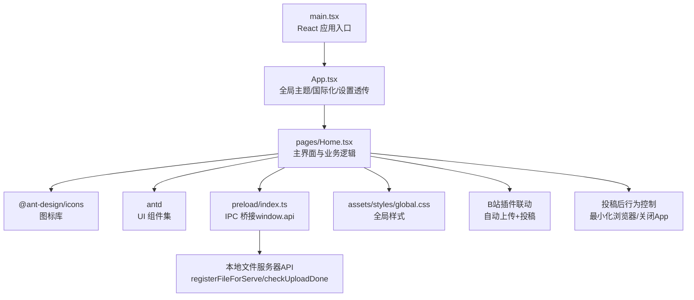
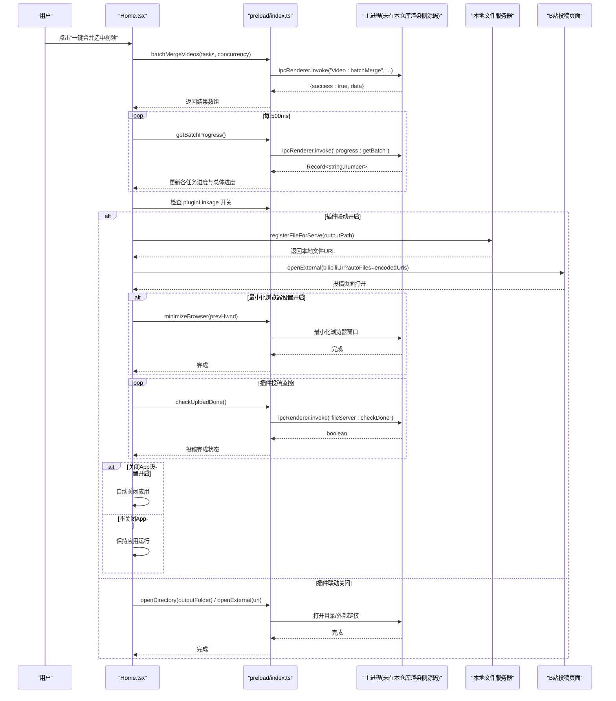
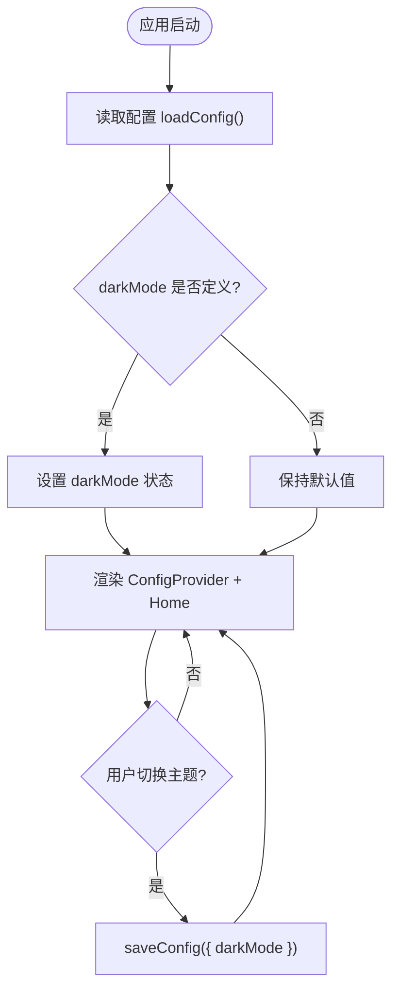
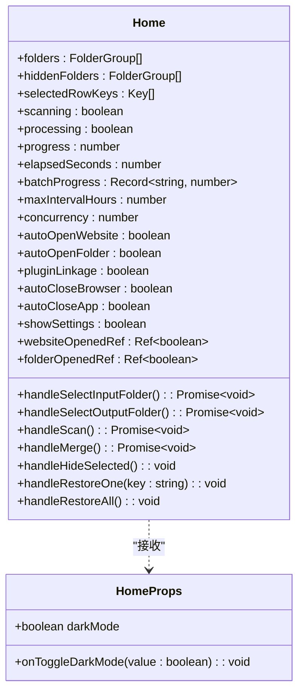
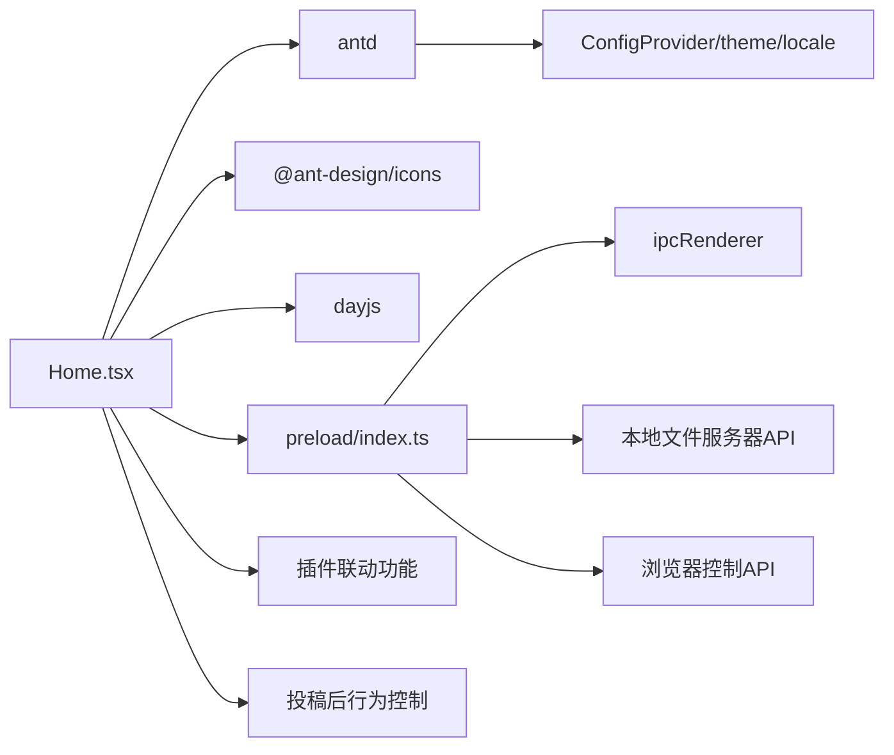

# 用户界面

<cite>
**本文引用的文件**   
- [App.tsx](file://src/renderer/src/App.tsx)
- [Home.tsx](file://src/renderer/src/pages/Home.tsx)
- [main.tsx](file://src/renderer/src/main.tsx)
- [global.css](file://src/renderer/src/assets/styles/global.css)
- [env.d.ts](file://src/renderer/src/env.d.ts)
- [preload/index.ts](file://src/preload/index.ts)
- [index.ts](file://src/main/index.ts)
- [package.json](file://package.json)
</cite>

## 更新摘要
**变更内容**   
- 新增插件联动设置功能，支持B站插件自动上传和投稿
- 增强自动网站打开功能，支持URL参数编码传递视频文件
- 集成本地文件服务器API，实现与Chrome插件的无缝协作
- 优化合并完成后的自动化流程，支持插件联动模式下的自动关闭应用
- **新增投稿后行为控制选项**：添加"打开B站页面后最小化浏览器"和"投稿完成后关闭 App"两个新的开关设置

## 目录
1. [简介](#简介)
2. [项目结构](#项目结构)
3. [核心组件](#核心组件)
4. [架构总览](#架构总览)
5. [详细组件分析](#详细组件分析)
6. [依赖关系分析](#依赖关系分析)
7. [性能与体验考量](#性能与体验考量)
8. [故障排查指南](#故障排查指南)
9. [结论](#结论)
10. [附录：定制与扩展指南](#附录定制与扩展指南)

## 简介
本文件面向 UI 开发者与设计师，系统化说明视频合并应用的 React 用户界面。内容覆盖组件架构、Ant Design 使用方式、主题配置、响应式布局、状态管理、交互流程、样式定制方法、可访问性与用户体验原则，并提供最佳实践与扩展建议。**最新更新**包含插件联动设置、自动网站打开功能和URL参数编码改进等增强功能，以及新增的投稿后行为控制选项。

## 项目结构
渲染进程采用 Electron + React 18 + Ant Design 5 技术栈，入口为 main.tsx，根组件 App.tsx 提供全局主题与国际化，页面级组件 Home.tsx 承载主界面业务逻辑与交互，现已集成插件联动和本地文件服务器功能。

**图表来源**
- [main.tsx:1-11](file://src/renderer/src/main.tsx#L1-L11)
- [App.tsx:1-49](file://src/renderer/src/App.tsx#L1-L49)
- [Home.tsx:1-872](file://src/renderer/src/pages/Home.tsx#L1-L872)
- [preload/index.ts:1-77](file://src/preload/index.ts#L1-L77)
- [global.css:1-15](file://src/renderer/src/assets/styles/global.css#L1-L15)

**章节来源**
- [main.tsx:1-11](file://src/renderer/src/main.tsx#L1-L11)
- [App.tsx:1-49](file://src/renderer/src/App.tsx#L1-L49)
- [Home.tsx:1-872](file://src/renderer/src/pages/Home.tsx#L1-L872)
- [preload/index.ts:1-77](file://src/preload/index.ts#L1-L77)
- [global.css:1-15](file://src/renderer/src/assets/styles/global.css#L1-L15)

## 核心组件
- 根组件 App.tsx
  - 职责：加载并持久化主题模式（深色/浅色），通过 ConfigProvider 注入 antd 主题与中文语言包，向子组件传递 darkMode 与切换回调。
  - 关键能力：
    - 启动时从 window.api.loadConfig 读取 darkMode 并初始化本地状态。
    - 切换主题时调用 window.api.saveConfig 持久化。
    - 通过 theme.darkAlgorithm / theme.defaultAlgorithm 动态切换算法。
    - 统一 token 配置（如 colorPrimary、borderRadius）。
- 页面组件 Home.tsx
  - 职责：实现"选择输入/输出目录 → 扫描 FLV 片段 → 分组展示 → 批量合并 → 进度反馈"的完整工作流；维护隐藏分组、设置面板等辅助功能；**新增插件联动设置和自动网站打开功能**。
  - 关键能力：
    - 自动扫描：首次加载若存在 inputFolder，则立即执行 scanFlvFiles 并过滤已排除分组。
    - 目录选择：selectFolder/selectOutputFolder 打开系统对话框并更新路径。
    - 扫描：scanFlvFiles(folder, maxIntervalHours)，按时间间隔分组，支持隐藏/恢复。
    - 批量合并：batchMergeVideos(tasks, concurrency)，轮询 getBatchProgress 计算总体进度与单任务进度。
    - **插件联动**：成功后根据 pluginLinkage 开关注册文件到本地服务器，传递URL参数到B站投稿页面。
    - **自动网站打开**：支持 autoOpenWebsite 和 autoOpenFolder 独立控制，仅首次合并后打开。
    - **URL参数编码**：使用 encodeURIComponent 对文件URL进行安全编码。
    - **插件投稿监控**：开启插件联动时轮询检查投稿完成状态，完成后自动关闭应用。
    - **投稿后行为控制**：支持打开B站页面后最小化浏览器和投稿完成后关闭App两个新选项。
    - 结果处理：成功后移除对应分组，可选自动打开输出目录与投稿网站。
    - 设置抽屉：保存并发数、判定间隔、自动打开开关、插件联动开关等配置。
- 全局样式 global.css
  - 职责：重置默认边距、设置根容器高度、字体族与背景色，确保基础视觉一致性。
- 类型与环境 env.d.ts
  - 职责：声明 Window.api 接口及共享数据结构（AppConfig、FolderGroup、ScanResult、VideoInfo 等），保证 TypeScript 类型安全。**新增本地文件服务器相关接口定义**。
- IPC 桥 preload/index.ts
  - 职责：封装 invokeApi，统一成功/失败返回格式，暴露 window.api 给渲染进程调用。**新增 registerFileForServe 和 checkUploadDone API**。

**章节来源**
- [App.tsx:1-49](file://src/renderer/src/App.tsx#L1-L49)
- [Home.tsx:1-872](file://src/renderer/src/pages/Home.tsx#L1-L872)
- [global.css:1-15](file://src/renderer/src/assets/styles/global.css#L1-L15)
- [env.d.ts:1-88](file://src/renderer/src/env.d.ts#L1-L88)
- [preload/index.ts:1-77](file://src/preload/index.ts#L1-L77)

## 架构总览
渲染进程通过 preload 暴露的 window.api 与主进程通信，完成配置读写、目录选择、文件扫描与视频合并等操作。UI 层基于 Ant Design 5 构建，使用 ConfigProvider 进行主题与语言配置。**新增本地文件服务器集成，支持Chrome插件联动和自动投稿流程，以及投稿后行为控制功能**。

**图表来源**
- [Home.tsx:198-371](file://src/renderer/src/pages/Home.tsx#L198-L371)
- [preload/index.ts:54-56](file://src/preload/index.ts#L54-L56)

## 详细组件分析

### 根组件 App.tsx 分析
- 主题与国际化
  - 使用 ConfigProvider 包裹应用，设置 locale 为 zh_CN。
  - 根据 darkMode 在 theme.darkAlgorithm 与 theme.defaultAlgorithm 之间切换。
  - 通过 token 统一 primary 颜色与圆角半径。
- 状态与持久化
  - 使用 useState 管理 darkMode，useEffect 在启动时加载配置。
  - 切换时调用 saveConfig 持久化。
- 组件树
  - 将 darkMode 与 onToggleDarkMode 作为 props 传递给 Home 组件。

**图表来源**
- [App.tsx:6-46](file://src/renderer/src/App.tsx#L6-L46)

**章节来源**
- [App.tsx:1-49](file://src/renderer/src/App.tsx#L1-L49)

### 主页组件 Home.tsx 分析
- 数据与状态
  - 输入/输出目录、扫描结果 folders、隐藏分组 hiddenFolders、选中行 selectedRowKeys、扫描/处理中状态 scanning/processing、进度 progress、计时 elapsedSeconds、批处理进度 batchProgress、设置项（并发、间隔、自动打开开关、**插件联动开关、最小化浏览器开关、关闭App开关**）、草稿设置 draft*。
  - **新增**：websiteOpenedRef 和 folderOpenedRef 用于跟踪首次打开状态。
- 生命周期与初始化
  - 启动时加载配置，若存在 inputFolder 则自动扫描并按 hiddenFolderKeys 过滤显示。
  - **新增**：加载 pluginLinkage、autoCloseBrowser、autoCloseApp 配置并初始化状态。
- 交互流程
  - 选择目录：handleSelectInputFolder/handleSelectOutputFolder。
  - 扫描：handleScan，按 maxIntervalHours 分组，更新 folders 与 hiddenFolders。
  - **增强合并流程**：handleMerge，构造 tasks，启动轮询 getBatchProgress，统计成功/失败，清理已完成分组，**根据开关状态执行自动打开和插件联动**。
  - **插件联动处理**：成功后根据 pluginLinkage 开关调用 registerFileForServe 注册文件，构建带URL参数的B站投稿链接，轮询检查投稿完成状态。
  - **URL参数编码**：使用 encodeURIComponent 对文件URL进行安全编码，避免特殊字符问题。
  - **浏览器最小化控制**：当开启插件联动且启用最小化设置时，记录当前前台窗口句柄，打开B站页面后检查焦点变化并最小化浏览器。
  - **投稿完成后自动关闭**：插件联动模式下，投稿完成后根据 autoCloseApp 设置决定是否自动关闭应用。
  - 隐藏/恢复：handleHideSelected/handleRestoreOne/handleRestoreAll，同步到 hiddenFolderKeys 并持久化。
  - 设置抽屉：Drawer 内编辑 draft*，保存时写入实际值并持久化，**新增插件联动开关、最小化浏览器开关、关闭App开关**。
- 表格与列表
  - Table 展示分组信息，支持全选/取消全选/排除选中。
  - 选中行后在下方卡片展示子文件列表与大小汇总。
- 进度展示
  - 总体进度条 + 每个任务的独立进度条，支持异常/成功状态标识。
- 错误提示
  - 使用 message.warning/error/success 进行用户反馈。

**图表来源**
- [Home.tsx:10-45](file://src/renderer/src/pages/Home.tsx#L10-L45)
- [Home.tsx:112-165](file://src/renderer/src/pages/Home.tsx#L112-L165)
- [Home.tsx:198-371](file://src/renderer/src/pages/Home.tsx#L198-L371)
- [Home.tsx:387-423](file://src/renderer/src/pages/Home.tsx#L387-L423)
- [Home.tsx:742-867](file://src/renderer/src/pages/Home.tsx#L742-L867)

**章节来源**
- [Home.tsx:1-872](file://src/renderer/src/pages/Home.tsx#L1-L872)

### 类型与环境 env.d.ts 分析
- Window.api 接口
  - 配置：loadConfig/saveConfig
  - 目录：selectFolder/selectOutputFolder/openDirectory/openExternal
  - 扫描：scanFlvFiles
  - 视频：getVideoInfo/mergeVideos/convertVideo/batchMergeVideos
  - 进度：getProgress/getBatchProgress
  - **新增**：本地文件服务器 registerFileForServe/checkUploadDone
  - **新增**：浏览器控制 getForegroundWindow/minimizeBrowser
- 数据结构
  - AppConfig：**新增 pluginLinkage、autoCloseBrowser、autoCloseApp 字段**，包含输入/输出目录、并发、间隔、自动打开开关、插件联动开关、隐藏分组键等。
  - FlvFile：文件名、路径、大小、修改时间。
  - FolderGroup：分组键、名称、路径、文件数量、总大小、文件列表、日期、标题。
  - ScanResult：根路径与分组列表。
  - VideoInfo：时长、编码、宽高。

**章节来源**
- [env.d.ts:1-88](file://src/renderer/src/env.d.ts#L1-L88)

### 预加载脚本 preload/index.ts 分析
- 统一调用封装
  - invokeApi 对 IPC 返回值进行解包，成功返回 data，失败抛出 Error。
- 暴露 API
  - 将 api 对象挂载到 window.api，供渲染进程直接调用。
  - **新增**：registerFileForServe 和 checkUploadDone API，用于本地文件服务器通信。
  - **新增**：getForegroundWindow 和 minimizeBrowser API，用于浏览器窗口控制。
- 兼容处理
  - 在非 contextIsolated 环境下回退赋值 window.electron/window.api。

**章节来源**
- [preload/index.ts:1-77](file://src/preload/index.ts#L1-L77)

### 全局样式 global.css 分析
- 重置与基础样式
  - 清除默认 margin/padding，box-sizing 设为 border-box。
  - html/body/#root 高度 100%，设置系统字体族。
  - body 背景色 #f5f5f5。

**章节来源**
- [global.css:1-15](file://src/renderer/src/assets/styles/global.css#L1-L15)

## 依赖关系分析
- 运行时依赖
  - antd 5：UI 组件与主题系统。
  - @ant-design/icons：图标资源。
  - dayjs：时间格式化（当前 Home.tsx 未使用导入，但 package.json 仍保留）。
- 开发依赖
  - react/react-dom：UI 框架。
  - electron/electron-builder/electron-vite：打包与运行环境。
  - typescript/vitest：类型检查与测试。
  - zustand：声明在 devDependencies，但源码未使用。

**图表来源**
- [Home.tsx:1-6](file://src/renderer/src/pages/Home.tsx#L1-L6)
- [package.json:17-40](file://package.json#L17-L40)

**章节来源**
- [package.json:1-42](file://package.json#L1-L42)
- [Home.tsx:1-6](file://src/renderer/src/pages/Home.tsx#L1-L6)

## 性能与体验考量
- 进度轮询
  - 每 500ms 轮询一次批量进度，避免阻塞渲染线程，同时保证进度刷新及时。
  - **新增**：插件投稿监控轮询，每秒检查一次投稿完成状态，最多等待10分钟。
- 并发控制
  - 通过 concurrency 参数限制并行合并任务数，避免过多 FFmpeg 子进程导致资源争用。
- 大列表渲染
  - 表格启用固定滚动区域，减少重排；子文件列表使用最大高度与滚动，提升长列表可读性。
- 用户体验
  - 操作前校验（如未选文件夹、未选任务）给出明确提示。
  - **增强的自动打开功能**：合并完成后自动打开输出目录与投稿网站（仅首次），减少重复操作。
  - **插件联动体验**：开启后自动传递视频给插件，投稿完成后自动关闭应用，提供无缝的用户体验。
  - **URL参数编码**：使用 encodeURIComponent 确保URL参数安全传输，避免特殊字符导致的错误。
  - **投稿后行为控制**：提供最小化浏览器和自动关闭App的选项，让用户完全控制应用退出行为。
  - 深色/浅色主题切换即时生效，提升不同环境下的可读性。

## 故障排查指南
- 无法加载配置或主题未生效
  - 检查 window.api 是否存在，确认 preload 是否正确暴露 api。
  - 查看 App.tsx 中 useEffect 的异步加载与 catch 分支。
- 扫描失败或无结果
  - 确认输入目录有效且包含 FLV 文件。
  - 检查 scanFlvFiles 调用与 maxIntervalHours 参数。
  - 查看 message 提示与 console 日志。
- 合并失败
  - 检查输出目录是否可写。
  - 关注 getBatchProgress 返回的任务状态，定位失败任务。
  - 查看 message.error 中的错误信息。
- **插件联动问题**
  - 检查 registerFileForServe 调用是否成功，确认本地文件服务器正常运行。
  - 验证 URL 参数编码是否正确，特别是包含特殊字符的文件路径。
  - 检查 checkUploadDone 轮询是否正常，确认插件投稿状态获取。
  - 查看控制台日志中的 "[App] 插件投稿完成，自动关闭" 消息。
- **浏览器最小化问题**
  - 检查 getForegroundWindow 和 minimizeBrowser API 调用是否成功。
  - 确认 Windows 平台下 PowerShell 命令执行正常。
  - 验证 prevHwnd 句柄是否正确记录和比较。
- **自动关闭App问题**
  - 检查 autoCloseApp 设置是否正确保存和加载。
  - 确认插件投稿完成检测逻辑正常工作。
  - 查看控制台日志中的关闭决策信息。
- **自动打开目录/网站无效**
  - 确认 autoOpenFolder/autoOpenWebsite/pluginLinkage 开关状态。
  - 检查 openDirectory/openExternal 调用是否被拦截。
  - 验证 websiteOpenedRef/folderOpenedRef 状态是否正确跟踪首次打开。

**章节来源**
- [App.tsx:10-22](file://src/renderer/src/App.tsx#L10-L22)
- [Home.tsx:156-180](file://src/renderer/src/pages/Home.tsx#L156-L180)
- [Home.tsx:198-371](file://src/renderer/src/pages/Home.tsx#L198-L371)
- [preload/index.ts:9-18](file://src/preload/index.ts#L9-L18)

## 结论
该界面以 React + Ant Design 5 为核心，通过 App.tsx 集中管理主题与国际化，Home.tsx 实现完整的扫描与合并工作流，配合 preload 提供的 IPC 桥完成跨进程操作。**最新版本集成了插件联动功能，支持自动上传和投稿，提供了更加智能化的用户体验，并通过新增的投稿后行为控制选项，让用户能够完全自定义应用退出行为**。整体结构清晰、交互直观，具备较好的可扩展性与可定制性。

## 附录：定制与扩展指南

### Ant Design 组件使用与属性
- Layout/Header/Content/Card/Table/Progress/Switch/Drawer/Input/Button/Space/Tag/Message/Typography
  - 常用属性参考：
    - Table：dataSource、columns、rowKey、rowSelection、scroll、pagination、size、onRow。
    - Progress：percent、status、format、size。
    - Switch：checked、onChange、checkedChildren/unCheckedChildren。
    - Drawer：open、onClose、width、footer。
    - Input：value、readOnly、placeholder、type、min/max/step。
    - Button：icon、loading、disabled、onClick、type、size。
    - Card：title、extra、size。
    - Space：direction、size、wrap。
    - Tag：color。
    - Typography：Title、Text、level/type。
- 事件处理
  - 按钮 onClick、Table onRow、Switch onChange、Input onChange 等。
- 示例路径
  - 表格列定义与渲染：[Home.tsx:435-484](file://src/renderer/src/pages/Home.tsx#L435-L484)
  - 进度条与任务进度：[Home.tsx:695-727](file://src/renderer/src/pages/Home.tsx#L695-L727)
  - 设置抽屉与保存：[Home.tsx:742-867](file://src/renderer/src/pages/Home.tsx#L742-L867)

**章节来源**
- [Home.tsx:435-484](file://src/renderer/src/pages/Home.tsx#L435-L484)
- [Home.tsx:695-727](file://src/renderer/src/pages/Home.tsx#L695-L727)
- [Home.tsx:742-867](file://src/renderer/src/pages/Home.tsx#L742-L867)

### 主题配置与深色模式
- 通过 ConfigProvider 的 theme 属性设置 algorithm 与 token。
- 动态切换：根据 darkMode 状态选择 darkAlgorithm/defaultAlgorithm。
- 统一风格：设置 colorPrimary、borderRadius 等 token。
- 示例路径
  - 主题配置与切换：[App.tsx:32-46](file://src/renderer/src/App.tsx#L32-L46)

**章节来源**
- [App.tsx:32-46](file://src/renderer/src/App.tsx#L32-L46)

### 响应式设计
- 使用 Flex 布局与 Space 组件实现自适应排列。
- 表格启用纵向滚动，避免超长列表溢出。
- 输入框与按钮在窄屏下换行显示。
- 示例路径
  - 头部与内容区布局：[Home.tsx:486-557](file://src/renderer/src/pages/Home.tsx#L486-L557)
  - 输入与按钮组合：[Home.tsx:527-557](file://src/renderer/src/pages/Home.tsx#L527-L557)

**章节来源**
- [Home.tsx:486-557](file://src/renderer/src/pages/Home.tsx#L486-L557)

### 自定义样式与 CSS 变量
- 全局样式 reset 与基础字体、背景色。
- 如需覆盖 AntD 样式，可在组件内通过 style 或 className 局部覆盖，或通过 ConfigProvider 的 theme 调整 token。
- 示例路径
  - 全局样式：[global.css:1-15](file://src/renderer/src/assets/styles/global.css#L1-L15)

**章节来源**
- [global.css:1-15](file://src/renderer/src/assets/styles/global.css#L1-L15)

### 可访问性与用户体验原则
- 键盘可达性：按钮与开关具备默认焦点行为，便于键盘导航。
- 语义化标签：使用 Title/Text 等 Typography 组件增强语义。
- 色彩对比：深色模式下注意文本与背景对比度，必要时调整 token。
- 反馈及时性：message 提示与进度条实时更新，降低等待焦虑。
- 容错与引导：操作前校验与错误提示，帮助用户快速修正。
- **插件联动体验**：提供清晰的开关选项和状态反馈，让用户了解自动化流程的执行情况。
- **投稿后行为控制**：通过直观的开关设置，让用户完全控制应用退出行为，提升用户体验。

### 最佳实践与扩展建议
- 组件拆分
  - 将扫描、合并、设置等逻辑拆分为独立 Hook 或子组件，提高复用性与可测试性。
- 状态管理
  - 当前使用 useState/useRef 管理本地状态，适合中等复杂度；未来可考虑引入轻量状态库（如 Zustand）统一管理。
- 错误边界
  - 增加 React Error Boundary 捕获渲染错误，提升稳定性。
- 国际化
  - 当前使用 zh_CN，可按需扩展多语言包。
- 主题扩展
  - 通过 ConfigProvider 的 theme 扩展更多 token，建立品牌设计系统。
- 无障碍优化
  - 为关键控件添加 aria-* 属性，提升屏幕阅读器友好度。
- **插件联动扩展**
  - 可考虑增加更多平台支持（如YouTube、抖音等），通过统一的插件接口实现。
  - 支持自定义投稿模板和元数据配置。
  - 提供插件安装和配置向导，简化用户设置流程。
- **投稿后行为控制扩展**
  - 可增加更多行为选项，如最小化其他窗口、发送通知等。
  - 支持条件触发，如仅在特定条件下执行自动关闭。
  - 提供行为历史记录，让用户了解自动操作的执行情况。

### 插件联动功能详解
- **功能概述**
  - 通过本地文件服务器为Chrome插件提供视频文件访问。
  - 自动传递视频URL到B站投稿页面，支持URL参数编码。
  - 轮询检查插件投稿状态，完成后自动关闭应用。
- **配置选项**
  - pluginLinkage：启用插件联动模式。
  - autoOpenWebsite：自动打开投稿页面。
  - autoOpenFolder：自动打开输出文件夹。
  - **autoCloseBrowser**：打开B站页面后最小化浏览器。
  - **autoCloseApp**：投稿完成后关闭 App。
- **工作流程**
  1. 合并完成后检查 pluginLinkage 开关状态。
  2. 调用 registerFileForServe 注册视频文件到本地服务器。
  3. 构建带URL参数的B站投稿链接，使用 encodeURIComponent 编码。
  4. 如果启用最小化设置，记录当前前台窗口句柄。
  5. 打开B站投稿页面，传递视频文件URL。
  6. 如果启用最小化设置且浏览器抢了焦点，最小化浏览器窗口。
  7. 轮询 checkUploadDone 检查投稿完成状态。
  8. 投稿完成后根据 autoCloseApp 设置决定是否自动关闭应用。
- **错误处理**
  - 单个文件注册失败不影响其他文件处理。
  - URL参数编码失败时降级处理，不传递参数。
  - 插件投稿超时（10分钟）时停止轮询。
  - 浏览器最小化失败时静默忽略，不影响主要流程。

**章节来源**
- [Home.tsx:284-357](file://src/renderer/src/pages/Home.tsx#L284-L357)
- [Home.tsx:846-865](file://src/renderer/src/pages/Home.tsx#L846-L865)
- [preload/index.ts:54-56](file://src/preload/index.ts#L54-L56)