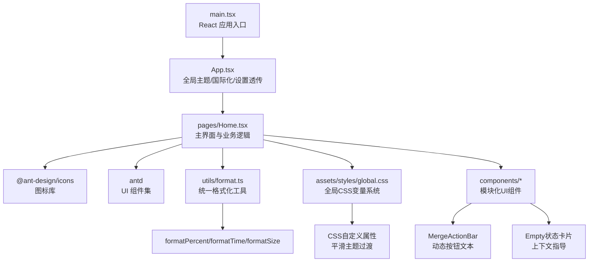
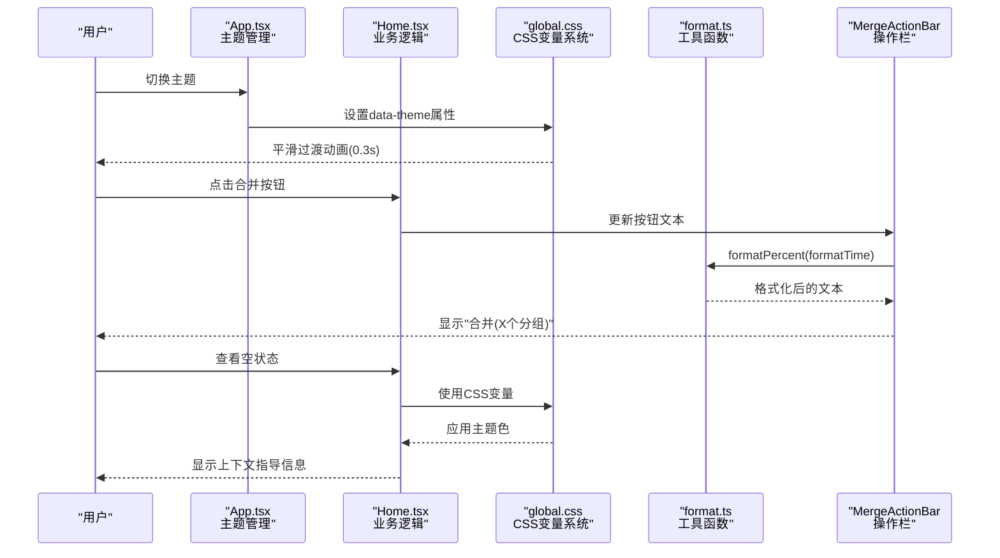
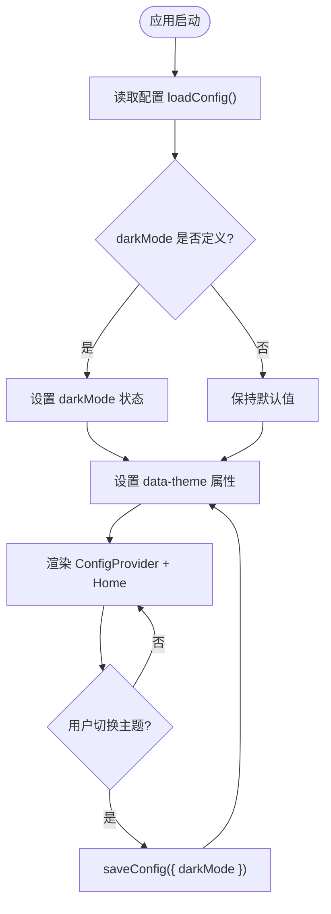
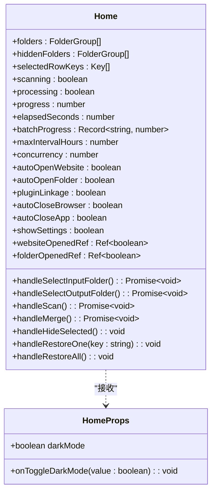
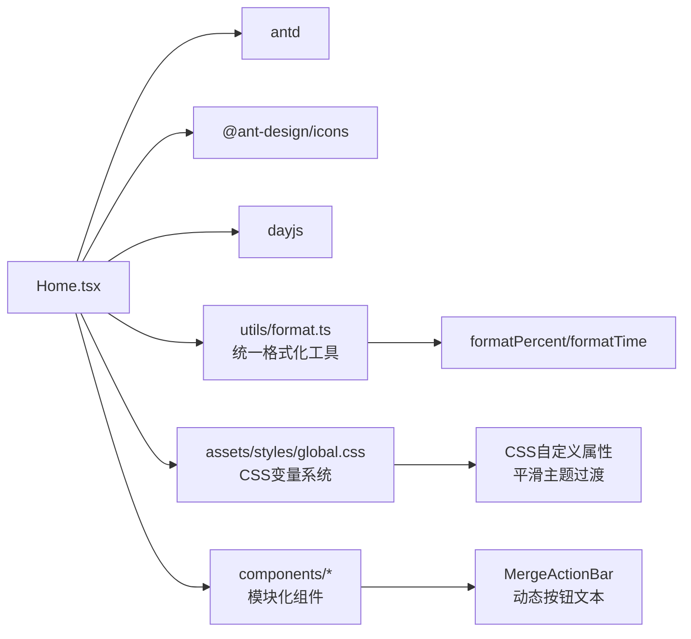

# 用户界面

<cite>
**本文引用的文件**   
- [App.tsx](file://src/renderer/src/App.tsx)
- [Home.tsx](file://src/renderer/src/pages/Home.tsx)
- [main.tsx](file://src/renderer/src/main.tsx)
- [global.css](file://src/renderer/src/assets/styles/global.css)
- [format.ts](file://src/renderer/src/utils/format.ts)
- [MergeActionBar.tsx](file://src/renderer/src/components/MergeActionBar.tsx)
- [FolderToolbar.tsx](file://src/renderer/src/components/FolderToolbar.tsx)
- [MergeTable.tsx](file://src/renderer/src/components/MergeTable.tsx)
- [SubFileList.tsx](file://src/renderer/src/components/SubFileList.tsx)
- [HiddenFoldersPanel.tsx](file://src/renderer/src/components/HiddenFoldersPanel.tsx)
- [UploadModal.tsx](file://src/renderer/src/components/UploadModal.tsx)
- [SettingsDrawer.tsx](file://src/renderer/src/pages/SettingsDrawer.tsx)
- [env.d.ts](file://src/renderer/src/env.d.ts)
- [preload/index.ts](file://src/preload/index.ts)
- [index.ts](file://src/main/index.ts)
- [package.json](file://package.json)
</cite>

## 更新摘要
**变更内容**   
- **引入全局CSS变量系统**：实现平滑的浅色/深色主题过渡效果，Header背景色和边框颜色现在使用CSS自定义属性替代硬编码值
- **新增格式化工具函数**：在format.ts中集中管理常用格式化操作，包括百分比、时间、文件大小和上传文件名格式化
- **动态按钮文本显示**：合并操作按钮现在显示选中的分组数量，提供更好的用户反馈
- **空状态卡片优化**：提供上下文相关的指导信息，改善用户体验
- **增强的主题切换体验**：通过CSS变量实现更流畅的主题过渡动画

## 目录
1. [简介](#简介)
2. [项目结构](#项目结构)
3. [核心组件](#核心组件)
4. [架构总览](#架构总览)
5. [详细组件分析](#详细组件分析)
6. [依赖关系分析](#依赖关系分析)
7. [性能与体验考量](#性能与体验考量)
8. [故障排查指南](#故障排查指南)
9. [结论](#结论)
10. [附录：定制与扩展指南](#附录定制与扩展指南)

## 简介
本文件面向 UI 开发者与设计师，系统化说明视频合并应用的 React 用户界面。内容覆盖组件架构、Ant Design 使用方式、主题配置、响应式布局、状态管理、交互流程、样式定制方法、可访问性与用户体验原则，并提供最佳实践与扩展建议。**最新更新**引入了全局CSS变量系统实现平滑的主题过渡，新增了统一的格式化工具函数库，优化了按钮文本显示和空状态提示，提供了更加流畅的用户体验。

## 项目结构
渲染进程采用 Electron + React 18 + Ant Design 5 技术栈，入口为 main.tsx，根组件 App.tsx 提供全局主题与国际化，页面级组件 Home.tsx 承载主界面业务逻辑与交互，现已集成插件联动和本地文件服务器功能。**新版本引入了全局CSS变量系统和统一的格式化工具函数，提升了主题切换的流畅性和代码复用性**。

**图表来源**
- [main.tsx:1-11](file://src/renderer/src/main.tsx#L1-L11)
- [App.tsx:1-59](file://src/renderer/src/App.tsx#L1-L59)
- [Home.tsx:1-678](file://src/renderer/src/pages/Home.tsx#L1-L678)
- [format.ts:1-28](file://src/renderer/src/utils/format.ts#L1-L28)
- [global.css:1-187](file://src/renderer/src/assets/styles/global.css#L1-L187)
- [MergeActionBar.tsx:1-103](file://src/renderer/src/components/MergeActionBar.tsx#L1-L103)

**章节来源**
- [main.tsx:1-11](file://src/renderer/src/main.tsx#L1-L11)
- [App.tsx:1-59](file://src/renderer/src/App.tsx#L1-L59)
- [Home.tsx:1-678](file://src/renderer/src/pages/Home.tsx#L1-L678)
- [format.ts:1-28](file://src/renderer/src/utils/format.ts#L1-L28)
- [global.css:1-187](file://src/renderer/src/assets/styles/global.css#L1-L187)

## 核心组件
- 根组件 App.tsx
  - 职责：加载并持久化主题模式（深色/浅色），通过 ConfigProvider 注入 antd 主题与中文语言包，向子组件传递 darkMode 与切换回调。
  - 关键能力：
    - 启动时从 window.api.loadConfig 读取 darkMode 并初始化本地状态。
    - 切换主题时调用 window.api.saveConfig 持久化。
    - 通过 theme.darkAlgorithm / theme.defaultAlgorithm 动态切换算法。
    - 统一 token 配置（如 colorPrimary、borderRadius）。
    - **新增**：通过 data-theme 属性控制全局CSS变量切换。
- 页面组件 Home.tsx
  - 职责：实现"选择输入/输出目录 → 扫描 FLV 片段 → 分组展示 → 批量合并 → 进度反馈"的完整工作流；维护隐藏分组、设置面板等辅助功能；**新增插件联动设置和自动网站打开功能**。
  - 关键能力：
    - 自动扫描：首次加载若存在 inputFolder，则立即执行 scanFlvFiles 并过滤已排除分组。
    - 目录选择：selectFolder/selectOutputFolder 打开系统对话框并更新路径。
    - 扫描：scanFlvFiles(folder, maxIntervalHours)，按时间间隔分组，支持隐藏/恢复。
    - 批量合并：batchMergeVideos(tasks, concurrency)，轮询 getBatchProgress 计算总体进度与单任务进度。
    - **插件联动**：成功后根据 pluginLinkage 开关注册文件到本地服务器，传递URL参数到B站投稿页面。
    - **自动网站打开**：支持 autoOpenWebsite 和 autoOpenFolder 独立控制，仅首次合并后打开。
    - **URL参数编码**：使用 encodeURIComponent 对文件URL进行安全编码。
    - **插件投稿监控**：开启插件联动时轮询检查投稿完成状态，完成后自动关闭应用。
    - **投稿后行为控制**：支持打开B站页面后最小化浏览器和投稿完成后关闭App两个新选项。
    - 结果处理：成功后移除对应分组，可选自动打开输出目录与投稿网站。
    - 设置抽屉：保存并发数、判定间隔、自动打开开关、插件联动开关等配置。
    - **空状态优化**：根据当前状态显示上下文相关的指导信息。
- 全局样式 global.css
  - 职责：**重构为CSS变量系统**，定义设计令牌（Design Tokens）统一管理颜色和阴影，实现平滑的主题过渡动画，优化Ant Design组件样式适配。
  - **新增特性**：
    - 完整的CSS自定义属性体系，包含背景色、边框色、文本色、功能色、阴影等
    - 深色模式下的完整变量映射
    - 平滑的过渡动画（0.3s ease）
    - 优化的组件样式适配（Card、Progress、Table、Button、Switch等）
- 格式化工具 format.ts
  - 职责：**新增的统一格式化工具库**，集中管理常用的数据格式化操作。
  - **新增功能**：
    - formatPercent：智能百分比格式化（小于1%显示一位小数，否则整数）
    - formatTime：秒数转换为mm:ss或hh:mm:ss格式
    - formatSize：字节大小转换为KB/MB/GB显示
    - formatUploadName：从合并文件名提取简洁显示名
- 合并操作栏 MergeActionBar
  - 职责：显示合并进度和操作按钮，**新增动态按钮文本显示选中分组数量**。
  - **改进特性**：
    - 按钮文本根据选中状态动态变化："一键合并选中视频（X个分组）"
    - 使用统一的格式化工具函数
    - 优化的进度条样式和状态显示
- 其他组件
  - FolderToolbar：输入输出目录选择和扫描操作
  - MergeTable：视频分组表格展示和管理
  - SubFileList：选中任务的子文件列表展示
  - HiddenFoldersPanel：已排除分组的恢复管理
  - UploadModal：待投稿文件的上传管理
  - SettingsDrawer：应用设置配置面板

**章节来源**
- [App.tsx:1-59](file://src/renderer/src/App.tsx#L1-L59)
- [Home.tsx:1-678](file://src/renderer/src/pages/Home.tsx#L1-L678)
- [global.css:1-187](file://src/renderer/src/assets/styles/global.css#L1-L187)
- [format.ts:1-28](file://src/renderer/src/utils/format.ts#L1-L28)
- [MergeActionBar.tsx:1-103](file://src/renderer/src/components/MergeActionBar.tsx#L1-L103)

## 架构总览
渲染进程通过 preload 暴露的 window.api 与主进程通信，完成配置读写、目录选择、文件扫描与视频合并等操作。UI 层基于 Ant Design 5 构建，使用 ConfigProvider 进行主题与语言配置。**最新版本引入了全局CSS变量系统和统一的格式化工具函数，实现了更流畅的主题切换体验和更好的代码复用性**。

**图表来源**
- [App.tsx:50-54](file://src/renderer/src/App.tsx#L50-L54)
- [global.css:13-58](file://src/renderer/src/assets/styles/global.css#L13-L58)
- [format.ts:1-28](file://src/renderer/src/utils/format.ts#L1-L28)
- [MergeActionBar.tsx:52-54](file://src/renderer/src/components/MergeActionBar.tsx#L52-L54)

## 详细组件分析

### 根组件 App.tsx 分析
- 主题与国际化
  - 使用 ConfigProvider 包裹应用，设置 locale 为 zh_CN。
  - 根据 darkMode 在 theme.darkAlgorithm 与 theme.defaultAlgorithm 之间切换。
  - 通过 token 统一 primary 颜色与圆角半径。
  - **新增**：通过 data-theme 属性控制全局CSS变量切换。
- 状态与持久化
  - 使用 useState 管理 darkMode，useEffect 在启动时加载配置。
  - 切换时调用 saveConfig 持久化。
- 组件树
  - 将 darkMode 与 onToggleDarkMode 作为 props 传递给 Home 组件。

**图表来源**
- [App.tsx:6-33](file://src/renderer/src/App.tsx#L6-L33)
- [App.tsx:50-54](file://src/renderer/src/App.tsx#L50-L54)

**章节来源**
- [App.tsx:1-59](file://src/renderer/src/App.tsx#L1-L59)

### 主页组件 Home.tsx 分析
- 数据与状态
  - 输入/输出目录、扫描结果 folders、隐藏分组 hiddenFolders、选中行 selectedRowKeys、扫描/处理中状态 scanning/processing、进度 progress、计时 elapsedSeconds、批处理进度 batchProgress、设置项（并发、间隔、自动打开开关、**插件联动开关、最小化浏览器开关、关闭App开关**）、草稿设置 draft*。
  - **新增**：websiteOpenedRef 和 folderOpenedRef 用于跟踪首次打开状态。
- 生命周期与初始化
  - 启动时加载配置，若存在 inputFolder 则自动扫描并按 hiddenFolderKeys 过滤显示。
  - **新增**：加载 pluginLinkage、autoCloseBrowser、autoCloseApp 配置并初始化状态。
- 交互流程
  - 选择目录：handleSelectInputFolder/handleSelectOutputFolder。
  - 扫描：handleScan，按 maxIntervalHours 分组，更新 folders 与 hiddenFolders。
  - **增强合并流程**：handleMerge，构造 tasks，启动轮询 getBatchProgress，统计成功/失败，清理已完成分组，**根据开关状态执行自动打开和插件联动**。
  - **插件联动处理**：成功后根据 pluginLinkage 开关调用 registerFileForServe 注册文件，构建带URL参数的B站投稿链接，轮询检查投稿完成状态。
  - **URL参数编码**：使用 encodeURIComponent 对文件URL进行安全编码，避免特殊字符问题。
  - **浏览器最小化控制**：当开启插件联动且启用最小化设置时，记录当前前台窗口句柄，打开B站页面后检查焦点变化并最小化浏览器。
  - **投稿完成后自动关闭**：插件联动模式下，投稿完成后根据 autoCloseApp 设置决定是否自动关闭应用。
  - 隐藏/恢复：handleHideSelected/handleRestoreOne/handleRestoreAll，同步到 hiddenFolderKeys 并持久化。
  - 设置抽屉：Drawer 内编辑 draft*，保存时写入实际值并持久化，**新增插件联动开关、最小化浏览器开关、关闭App开关**。
- 表格与列表
  - Table 展示分组信息，支持全选/取消全选/排除选中。
  - 选中行后在下方卡片展示子文件列表与大小汇总。
- 进度展示
  - 总体进度条 + 每个任务的独立进度条，支持异常/成功状态标识。
- 错误提示
  - 使用 message.warning/error/success 进行用户反馈。
  - **空状态优化**：根据当前状态显示不同的指导信息。

**图表来源**
- [Home.tsx:16-57](file://src/renderer/src/pages/Home.tsx#L16-L57)
- [Home.tsx:248-423](file://src/renderer/src/pages/Home.tsx#L248-L423)
- [Home.tsx:601-622](file://src/renderer/src/pages/Home.tsx#L601-L622)

**章节来源**
- [Home.tsx:1-678](file://src/renderer/src/pages/Home.tsx#L1-L678)

### 全局样式 global.css 分析
- **重构为CSS变量系统**
  - 定义了完整的设计令牌（Design Tokens）体系
  - 包含背景色、边框色、文本色、功能色、阴影等完整变量集合
  - 支持浅色和深色模式的完整变量映射
- **平滑主题过渡**
  - body 背景色添加 0.3s ease 过渡动画
  - Header 背景色和边框颜色使用CSS变量，支持平滑切换
  - 所有相关元素都添加了适当的过渡效果
- **组件样式优化**
  - Card：添加悬停阴影效果和圆角优化
  - Progress：优化进度条动画和渐变效果
  - Table：改进行悬停效果
  - Button：添加点击缩放和悬停亮度效果
  - Switch：优化开关切换动画
  - Tag：统一圆角样式
- **滚动条美化**
  - 自定义滚动条样式，支持深浅色模式
  - 半透明背景和圆角设计
- **Drawer优化**
  - 添加平滑的打开/关闭动画
  - 深色模式下优化关闭按钮和标题颜色
- **空状态优化**
  - 统一空状态文字颜色使用CSS变量

**章节来源**
- [global.css:1-187](file://src/renderer/src/assets/styles/global.css#L1-L187)

### 格式化工具 format.ts 分析
- **统一的格式化接口**
  - formatPercent：智能百分比格式化，小于1%显示一位小数，否则显示整数
  - formatTime：秒数转换为mm:ss或hh:mm:ss格式，自动判断是否需要小时显示
  - formatSize：字节大小转换为KB/MB/GB显示，保留适当的小数位
  - formatUploadName：从合并文件名提取简洁显示名，支持日期和标题提取
- **代码复用性提升**
  - 集中管理所有格式化逻辑，避免重复代码
  - 统一的格式化风格和规范
  - 便于维护和测试

**章节来源**
- [format.ts:1-28](file://src/renderer/src/utils/format.ts#L1-L28)

### 合并操作栏 MergeActionBar 分析
- **动态按钮文本显示**
  - 根据选中分组数量动态显示按钮文本
  - 未选中时显示："一键合并选中视频"
  - 选中多个时显示："一键合并选中视频（X个分组）"
- **统一的格式化工具使用**
  - 使用 formatPercent 格式化进度百分比
  - 使用 formatTime 格式化已用时间
- **优化的视觉反馈**
  - 使用CSS变量确保主题一致性
  - 改进的进度条样式和状态显示
  - 清晰的分组进度展示

**章节来源**
- [MergeActionBar.tsx:1-103](file://src/renderer/src/components/MergeActionBar.tsx#L1-L103)

### 类型与环境 env.d.ts 分析
- Window.api 接口
  - 配置：loadConfig/saveConfig
  - 目录：selectFolder/selectOutputFolder/openDirectory/openExternal
  - 扫描：scanFlvFiles
  - 视频：getVideoInfo/mergeVideos/convertVideo/batchMergeVideos
  - 进度：getProgress/getBatchProgress
  - **新增**：本地文件服务器 registerFileForServe/checkUploadDone
  - **新增**：浏览器控制 getForegroundWindow/minimizeBrowser
- 数据结构
  - AppConfig：**新增 pluginLinkage、autoCloseBrowser、autoCloseApp 字段**，包含输入/输出目录、并发、间隔、自动打开开关、插件联动开关、隐藏分组键等。
  - FlvFile：文件名、路径、大小、修改时间。
  - FolderGroup：分组键、名称、路径、文件数量、总大小、文件列表、日期、标题。
  - ScanResult：根路径与分组列表。
  - VideoInfo：时长、编码、宽高。

**章节来源**
- [env.d.ts:1-88](file://src/renderer/src/env.d.ts#L1-L88)

### 预加载脚本 preload/index.ts 分析
- 统一调用封装
  - invokeApi 对 IPC 返回值进行解包，成功返回 data，失败抛出 Error。
- 暴露 API
  - 将 api 对象挂载到 window.api，供渲染进程直接调用。
  - **新增**：registerFileForServe 和 checkUploadDone API，用于本地文件服务器通信。
  - **新增**：getForegroundWindow 和 minimizeBrowser API，用于浏览器窗口控制。
- 兼容处理
  - 在非 contextIsolated 环境下回退赋值 window.electron/window.api。

**章节来源**
- [preload/index.ts:1-77](file://src/preload/index.ts#L1-L77)

## 依赖关系分析
- 运行时依赖
  - antd 5：UI 组件与主题系统。
  - @ant-design/icons：图标资源。
  - dayjs：时间格式化（当前 Home.tsx 未使用导入，但 package.json 仍保留）。
- 开发依赖
  - react/react-dom：UI 框架。
  - electron/electron-builder/electron-vite：打包与运行环境。
  - typescript/vitest：类型检查与测试。
  - zustand：声明在 devDependencies，但源码未使用。

**图表来源**
- [Home.tsx:1-11](file://src/renderer/src/pages/Home.tsx#L1-L11)
- [format.ts:1-28](file://src/renderer/src/utils/format.ts#L1-L28)
- [global.css:1-187](file://src/renderer/src/assets/styles/global.css#L1-L187)

**章节来源**
- [package.json:1-42](file://package.json#L1-L42)
- [Home.tsx:1-11](file://src/renderer/src/pages/Home.tsx#L1-L11)

## 性能与体验考量
- 进度轮询
  - 每 1000ms 轮询一次批量进度，避免阻塞渲染线程，同时保证进度刷新及时。
  - **新增**：插件投稿监控轮询，每秒检查一次投稿完成状态，最多等待10分钟。
- 并发控制
  - 通过 concurrency 参数限制并行合并任务数，避免过多 FFmpeg 子进程导致资源争用。
- 大列表渲染
  - 表格启用固定滚动区域，减少重排；子文件列表使用最大高度与滚动，提升长列表可读性。
- 用户体验
  - 操作前校验（如未选文件夹、未选任务）给出明确提示。
  - **增强的自动打开功能**：合并完成后自动打开输出目录与投稿网站（仅首次），减少重复操作。
  - **插件联动体验**：开启后自动传递视频给插件，投稿完成后自动关闭应用，提供无缝的用户体验。
  - **URL参数编码**：使用 encodeURIComponent 确保URL参数安全传输，避免特殊字符导致的错误。
  - **投稿后行为控制**：提供最小化浏览器和自动关闭App的选项，让用户完全控制应用退出行为。
  - **平滑主题切换**：通过CSS变量实现0.3s的平滑过渡动画，提升主题切换体验。
  - **动态按钮反馈**：合并按钮显示选中分组数量，提供更好的操作反馈。
  - **上下文指导**：空状态卡片根据当前状态显示相关的指导信息。
  - **统一格式化**：使用统一的格式化工具函数，确保数据展示的一致性。

## 故障排查指南
- 无法加载配置或主题未生效
  - 检查 window.api 是否存在，确认 preload 是否正确暴露 api。
  - 查看 App.tsx 中 useEffect 的异步加载与 catch 分支。
  - **新增**：检查 data-theme 属性是否正确设置。
- 主题切换不流畅
  - **新增**：检查 global.css 中的CSS变量是否正确定义。
  - **新增**：确认 transition 属性是否正确应用到相关元素。
  - **新增**：验证深色模式下的变量映射是否完整。
- 格式化显示异常
  - **新增**：检查 format.ts 中的格式化函数是否正确导入和使用。
  - **新增**：验证传入的参数类型是否符合预期。
  - **新增**：检查边界情况处理（如负数、超大数值等）。
- 按钮文本显示不正确
  - **新增**：检查 selectedRowKeys 状态是否正确更新。
  - **新增**：验证 MergeActionBar 组件的props传递是否正常。
  - **新增**：确认动态文本逻辑是否正确执行。
- 空状态提示不准确
  - **新增**：检查 Home.tsx 中的条件判断逻辑。
  - **新增**：验证 inputFolder 和 scanning/processing 状态是否正确。
  - **新增**：确认不同状态下的提示文案是否合适。
- 扫描失败或无结果
  - 确认输入目录有效且包含 FLV 文件。
  - 检查 scanFlvFiles 调用与 maxIntervalHours 参数。
  - 查看 message 提示与 console 日志。
- 合并失败
  - 检查输出目录是否可写。
  - 关注 getBatchProgress 返回的任务状态，定位失败任务。
  - 查看 message.error 中的错误信息。
- **插件联动问题**
  - 检查 registerFileForServe 调用是否成功，确认本地文件服务器正常运行。
  - 验证 URL 参数编码是否正确，特别是包含特殊字符的文件路径。
  - 检查 checkUploadDone 轮询是否正常，确认插件投稿状态获取。
  - 查看控制台日志中的 "[App] 插件投稿完成，自动关闭" 消息。
- **浏览器最小化问题**
  - 检查 getForegroundWindow 和 minimizeBrowser API 调用是否成功。
  - 确认 Windows 平台下 PowerShell 命令执行正常。
  - 验证 prevHwnd 句柄是否正确记录和比较。
- **自动关闭App问题**
  - 检查 autoCloseApp 设置是否正确保存和加载。
  - 确认插件投稿完成检测逻辑正常工作。
  - 查看控制台日志中的关闭决策信息。
- **自动打开目录/网站无效**
  - 确认 autoOpenFolder/autoOpenWebsite/pluginLinkage 开关状态。
  - 检查 openDirectory/openExternal 调用是否被拦截。
  - 验证 websiteOpenedRef/folderOpenedRef 状态是否正确跟踪首次打开。

**章节来源**
- [App.tsx:10-24](file://src/renderer/src/App.tsx#L10-L24)
- [App.tsx:50-54](file://src/renderer/src/App.tsx#L50-L54)
- [global.css:60-63](file://src/renderer/src/assets/styles/global.css#L60-L63)
- [format.ts:1-28](file://src/renderer/src/utils/format.ts#L1-L28)
- [MergeActionBar.tsx:52-54](file://src/renderer/src/components/MergeActionBar.tsx#L52-L54)
- [Home.tsx:601-622](file://src/renderer/src/pages/Home.tsx#L601-L622)

## 结论
该界面以 React + Ant Design 5 为核心，通过 App.tsx 集中管理主题与国际化，Home.tsx 实现完整的扫描与合并工作流，配合 preload 提供的 IPC 桥完成跨进程操作。**最新版本引入了全局CSS变量系统和统一的格式化工具函数，实现了更流畅的主题切换体验、更好的代码复用性和更一致的用户界面。通过动态按钮文本显示、优化的空状态提示和完善的格式化工具，整体用户体验得到了显著提升**。整体结构清晰、交互直观，具备较好的可扩展性与可定制性。

## 附录：定制与扩展指南

### Ant Design 组件使用与属性
- Layout/Header/Content/Card/Table/Progress/Switch/Drawer/Input/Button/Space/Tag/Message/Typography
  - 常用属性参考：
    - Table：dataSource、columns、rowKey、rowSelection、scroll、pagination、size、onRow。
    - Progress：percent、status、format、size。
    - Switch：checked、onChange、checkedChildren/unCheckedChildren。
    - Drawer：open、onClose、width、footer。
    - Input：value、readOnly、placeholder、type、min/max/step。
    - Button：icon、loading、disabled、onClick、type、size。
    - Card：title、extra、size。
    - Space：direction、size、wrap。
    - Tag：color。
    - Typography：Title、Text、level/type。
- 事件处理
  - 按钮 onClick、Table onRow、Switch onChange、Input onChange 等。
- 示例路径
  - 表格列定义与渲染：[Home.tsx:435-484](file://src/renderer/src/pages/Home.tsx#L435-L484)
  - 进度条与任务进度：[Home.tsx:695-727](file://src/renderer/src/pages/Home.tsx#L695-L727)
  - 设置抽屉与保存：[Home.tsx:742-867](file://src/renderer/src/pages/Home.tsx#L742-L867)

**章节来源**
- [Home.tsx:435-484](file://src/renderer/src/pages/Home.tsx#L435-L484)
- [Home.tsx:695-727](file://src/renderer/src/pages/Home.tsx#L695-L727)
- [Home.tsx:742-867](file://src/renderer/src/pages/Home.tsx#L742-L867)

### 主题配置与深色模式
- 通过 ConfigProvider 的 theme 属性设置 algorithm 与 token。
- 动态切换：根据 darkMode 状态选择 darkAlgorithm/defaultAlgorithm。
- 统一风格：设置 colorPrimary、borderRadius 等 token。
- **新增CSS变量系统**：
  - 通过 data-theme 属性控制全局CSS变量切换
  - 完整的浅色/深色模式变量映射
  - 平滑的过渡动画效果
- 示例路径
  - 主题配置与切换：[App.tsx:35-47](file://src/renderer/src/App.tsx#L35-L47)
  - CSS变量定义：[global.css:13-58](file://src/renderer/src/assets/styles/global.css#L13-L58)

**章节来源**
- [App.tsx:35-47](file://src/renderer/src/App.tsx#L35-L47)
- [global.css:13-58](file://src/renderer/src/assets/styles/global.css#L13-L58)

### 响应式设计
- 使用 Flex 布局与 Space 组件实现自适应排列。
- 表格启用纵向滚动，避免超长列表溢出。
- 输入框与按钮在窄屏下换行显示。
- 示例路径
  - 头部与内容区布局：[Home.tsx:502-548](file://src/renderer/src/pages/Home.tsx#L502-L548)
  - 输入与按钮组合：[Home.tsx:527-557](file://src/renderer/src/pages/Home.tsx#L527-L557)

**章节来源**
- [Home.tsx:502-548](file://src/renderer/src/pages/Home.tsx#L502-L548)

### 自定义样式与 CSS 变量
- **全新的CSS变量系统**：
  - 设计令牌（Design Tokens）统一管理颜色和阴影
  - 支持浅色和深色模式的完整变量映射
  - 平滑的过渡动画效果
  - 优化的组件样式适配
- 如需覆盖 AntD 样式，可在组件内通过 style 或 className 局部覆盖，或通过 ConfigProvider 的 theme 调整 token。
- 示例路径
  - 全局样式变量：[global.css:13-58](file://src/renderer/src/assets/styles/global.css#L13-L58)
  - 组件样式优化：[global.css:65-187](file://src/renderer/src/assets/styles/global.css#L65-L187)

**章节来源**
- [global.css:13-58](file://src/renderer/src/assets/styles/global.css#L13-L58)
- [global.css:65-187](file://src/renderer/src/assets/styles/global.css#L65-L187)

### 格式化工具函数使用
- **统一的格式化接口**：
  - formatPercent：智能百分比格式化
  - formatTime：时间格式转换
  - formatSize：文件大小格式化
  - formatUploadName：上传文件名格式化
- **使用示例**：
  - 进度显示：`{formatPercent(progress)}%`
  - 时间显示：`已用时 ${formatTime(elapsedSeconds)}`
  - 大小显示：`合计 ${formatSize(totalSize)}`
  - 文件名显示：`{formatUploadName(fileName)}`
- 示例路径
  - 百分比格式化：[MergeActionBar.tsx:36](file://src/renderer/src/components/MergeActionBar.tsx#L36)
  - 时间格式化：[MergeActionBar.tsx:36](file://src/renderer/src/components/MergeActionBar.tsx#L36)
  - 大小格式化：[SubFileList.tsx:20](file://src/renderer/src/components/SubFileList.tsx#L20)
  - 文件名格式化：[UploadModal.tsx:49](file://src/renderer/src/components/UploadModal.tsx#L49)

**章节来源**
- [format.ts:1-28](file://src/renderer/src/utils/format.ts#L1-L28)
- [MergeActionBar.tsx:36](file://src/renderer/src/components/MergeActionBar.tsx#L36)
- [SubFileList.tsx:20](file://src/renderer/src/components/SubFileList.tsx#L20)
- [UploadModal.tsx:49](file://src/renderer/src/components/UploadModal.tsx#L49)

### 可访问性与用户体验原则
- 键盘可达性：按钮与开关具备默认焦点行为，便于键盘导航。
- 语义化标签：使用 Title/Text 等 Typography 组件增强语义。
- 色彩对比：深色模式下注意文本与背景对比度，必要时调整 token。
- 反馈及时性：message 提示与进度条实时更新，降低等待焦虑。
- 容错与引导：操作前校验与错误提示，帮助用户快速修正。
- **插件联动体验**：提供清晰的开关选项和状态反馈，让用户了解自动化流程的执行情况。
- **投稿后行为控制**：通过直观的开关设置，让用户完全控制应用退出行为，提升用户体验。
- **平滑主题切换**：0.3s的过渡动画让主题切换更加自然流畅。
- **动态反馈**：按钮文本根据操作状态动态变化，提供更好的操作反馈。
- **上下文指导**：空状态卡片根据当前状态显示相关的指导信息。

### 最佳实践与扩展建议
- 组件拆分
  - 将扫描、合并、设置等逻辑拆分为独立 Hook 或子组件，提高复用性与可测试性。
- 状态管理
  - 当前使用 useState/useRef 管理本地状态，适合中等复杂度；未来可考虑引入轻量状态库（如 Zustand）统一管理。
- 错误边界
  - 增加 React Error Boundary 捕获渲染错误，提升稳定性。
- 国际化
  - 当前使用 zh_CN，可按需扩展多语言包。
- 主题扩展
  - 通过 ConfigProvider 的 theme 扩展更多 token，建立品牌设计系统。
  - **利用CSS变量系统**：通过扩展CSS变量实现更多主题变体。
- 无障碍优化
  - 为关键控件添加 aria-* 属性，提升屏幕阅读器友好度。
- **插件联动扩展**
  - 可考虑增加更多平台支持（如YouTube、抖音等），通过统一的插件接口实现。
  - 支持自定义投稿模板和元数据配置。
  - 提供插件安装和配置向导，简化用户设置流程。
- **投稿后行为控制扩展**
  - 可增加更多行为选项，如最小化其他窗口、发送通知等。
  - 支持条件触发，如仅在特定条件下执行自动关闭。
  - 提供行为历史记录，让用户了解自动操作的执行情况。
- **格式化工具扩展**
  - 可以添加更多格式化函数，如数字格式化、日期格式化等。
  - 支持自定义格式化规则和本地化格式。
- **CSS变量系统扩展**
  - 可以添加更多的设计令牌，如字体大小、间距、动画时长等。
  - 支持动态主题切换和自定义主题创建。

### 插件联动功能详解
- **功能概述**
  - 通过本地文件服务器为Chrome插件提供视频文件访问。
  - 自动传递视频URL到B站投稿页面，支持URL参数编码。
  - 轮询检查插件投稿状态，完成后自动关闭应用。
- **配置选项**
  - pluginLinkage：启用插件联动模式。
  - autoOpenWebsite：自动打开投稿页面。
  - autoOpenFolder：自动打开输出文件夹。
  - **autoCloseBrowser**：打开B站页面后最小化浏览器。
  - **autoCloseApp**：投稿完成后关闭 App。
- **工作流程**
  1. 合并完成后检查 pluginLinkage 开关状态。
  2. 调用 registerFileForServe 注册视频文件到本地服务器。
  3. 构建带URL参数的B站投稿链接，使用 encodeURIComponent 编码。
  4. 如果启用最小化设置，记录当前前台窗口句柄。
  5. 打开B站投稿页面，传递视频文件URL。
  6. 如果启用最小化设置且浏览器抢了焦点，最小化浏览器窗口。
  7. 轮询 checkUploadDone 检查投稿完成状态。
  8. 投稿完成后根据 autoCloseApp 设置决定是否自动关闭应用。
- **错误处理**
  - 单个文件注册失败不影响其他文件处理。
  - URL参数编码失败时降级处理，不传递参数。
  - 插件投稿超时（10分钟）时停止轮询。
  - 浏览器最小化失败时静默忽略，不影响主要流程。

**章节来源**
- [Home.tsx:340-404](file://src/renderer/src/pages/Home.tsx#L340-L404)
- [SettingsDrawer.tsx:241-275](file://src/renderer/src/pages/SettingsDrawer.tsx#L241-L275)