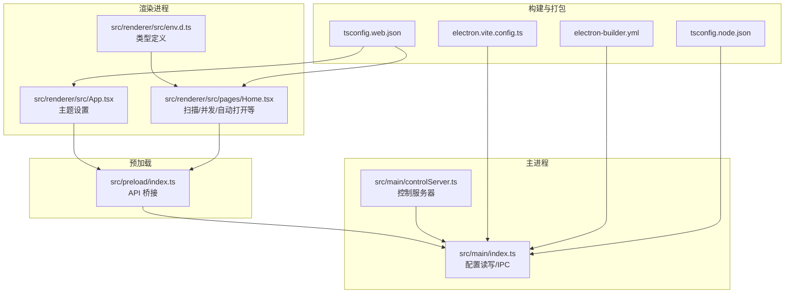
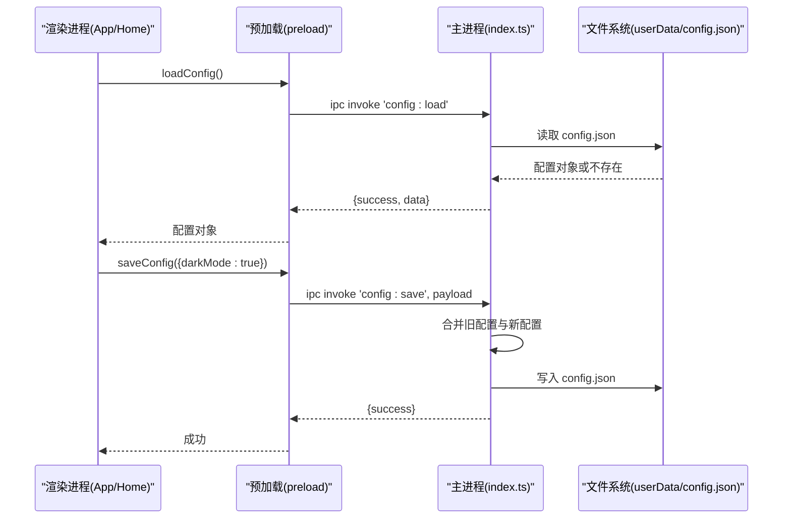
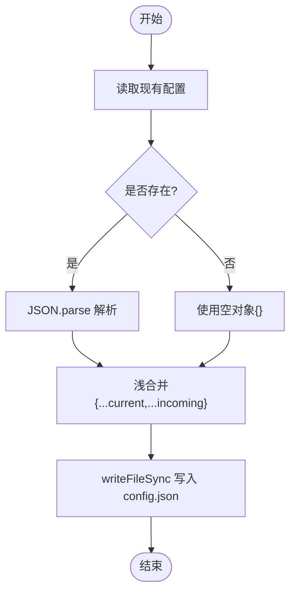
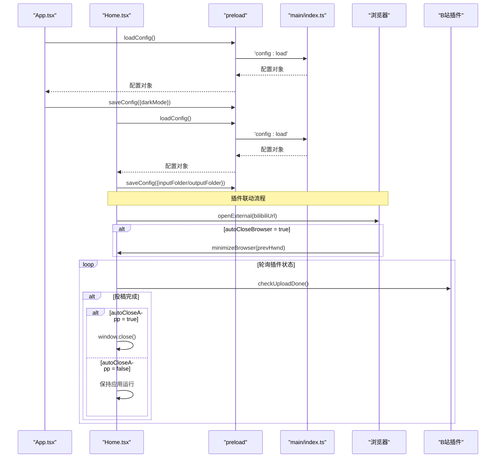

# 配置管理

<cite>
**本文引用的文件**
- [src/main/index.ts](file://src/main/index.ts)
- [src/preload/index.ts](file://src/preload/index.ts)
- [src/renderer/src/App.tsx](file://src/renderer/src/App.tsx)
- [src/renderer/src/pages/Home.tsx](file://src/renderer/src/pages/Home.tsx)
- [src/renderer/src/env.d.ts](file://src/renderer/src/env.d.ts)
- [src/main/controlServer.ts](file://src/main/controlServer.ts)
- [electron.vite.config.ts](file://electron.vite.config.ts)
- [electron-builder.yml](file://electron-builder.yml)
- [tsconfig.node.json](file://tsconfig.node.json)
- [tsconfig.web.json](file://tsconfig.web.json)
- [tests/configAndUtils.test.ts](file://tests/configAndUtils.test.ts)
</cite>

## 更新摘要
**变更内容**
- 新增 autoCloseBrowser 配置项说明，用于控制打开B站页面后是否最小化浏览器
- 新增 autoCloseApp 配置项说明，用于控制投稿完成后是否自动关闭应用程序
- 更新配置项清单，补充这两个新字段的默认值和使用说明
- 更新相关流程图和架构图以反映新的配置项

## 目录
1. [简介](#简介)
2. [项目结构](#项目结构)
3. [核心组件](#核心组件)
4. [架构总览](#架构总览)
5. [详细组件分析](#详细组件分析)
6. [依赖关系分析](#依赖关系分析)
7. [性能与可靠性](#性能与可靠性)
8. [故障排查指南](#故障排查指南)
9. [结论](#结论)
10. [附录](#附录)

## 简介
本文件面向运维人员与高级用户，系统化说明视频合并应用的"配置管理"能力：配置文件的位置、格式、生命周期、字段含义与取值范围、验证规则、版本兼容与迁移策略、环境变量覆盖、打包与部署注意事项，以及最佳实践与模板建议。

## 项目结构
应用采用 Electron + Vite 多进程架构，配置由主进程持久化到系统默认 userData 目录下的 JSON 文件；渲染进程通过 preload 暴露的 API 读取与保存配置。

图示来源
- [src/main/index.ts:1-120](file://src/main/index.ts#L1-L120)
- [src/main/controlServer.ts:1-50](file://src/main/controlServer.ts#L1-L50)
- [src/preload/index.ts:1-64](file://src/preload/index.ts#L1-L64)
- [src/renderer/src/App.tsx:1-48](file://src/renderer/src/App.tsx#L1-L48)
- [src/renderer/src/pages/Home.tsx:1-120](file://src/renderer/src/pages/Home.tsx#L1-L120)
- [src/renderer/src/env.d.ts:40-50](file://src/renderer/src/env.d.ts#L40-L50)
- [electron.vite.config.ts:1-21](file://electron.vite.config.ts#L1-L21)
- [electron-builder.yml:1-26](file://electron-builder.yml#L1-L26)
- [tsconfig.node.json:1-19](file://tsconfig.node.json#L1-L19)
- [tsconfig.web.json:1-18](file://tsconfig.web.json#L1-L18)

章节来源
- [src/main/index.ts:1-120](file://src/main/index.ts#L1-L120)
- [src/main/controlServer.ts:1-50](file://src/main/controlServer.ts#L1-L50)
- [src/preload/index.ts:1-64](file://src/preload/index.ts#L1-L64)
- [src/renderer/src/App.tsx:1-48](file://src/renderer/src/App.tsx#L1-L48)
- [src/renderer/src/pages/Home.tsx:1-120](file://src/renderer/src/pages/Home.tsx#L1-L120)
- [src/renderer/src/env.d.ts:40-50](file://src/renderer/src/env.d.ts#L40-L50)
- [electron.vite.config.ts:1-21](file://electron.vite.config.ts#L1-L21)
- [electron-builder.yml:1-26](file://electron-builder.yml#L1-L26)
- [tsconfig.node.json:1-19](file://tsconfig.node.json#L1-L19)
- [tsconfig.web.json:1-18](file://tsconfig.web.json#L1-L18)

## 核心组件
- 配置存储位置与文件名
  - 路径：系统默认 userData 目录（Windows 通常为 %APPDATA%/video-merger），文件名为 config.json。
  - 开发模式可自定义 userData 根目录（见环境变量）。
- 配置接口（IPC）
  - 加载：config:load → 返回当前配置对象。
  - 保存：config:save → 合并并持久化配置。
- 配置项清单（AppConfig）
  - inputFolder: string | undefined
  - outputFolder: string | undefined
  - outputFileName: string | undefined
  - darkMode: boolean | undefined
  - concurrency: number | undefined
  - maxIntervalHours: number | undefined
  - autoOpenWebsite: boolean | undefined
  - autoOpenFolder: boolean | undefined
  - pluginLinkage: boolean | undefined
  - autoCloseBrowser: boolean | undefined
  - autoCloseApp: boolean | undefined
  - controlEnabled?: boolean
  - controlPort?: number
  - hiddenFolderKeys: string[] | undefined
- 默认值与行为
  - 首次运行无配置文件时返回空对象 {}，后续按"浅合并"策略更新。
  - 选择输入/输出文件夹后会自动保存对应字段。
  - 主题切换会保存 darkMode。
- 渲染侧使用
  - App.tsx 启动时加载 darkMode 并保存变更。
  - Home.tsx 启动时加载 inputFolder、maxIntervalHours、concurrency、autoOpenWebsite、autoOpenFolder、pluginLinkage、autoCloseBrowser、autoCloseApp、hiddenFolderKeys 等，并在界面中生效。

章节来源
- [src/main/index.ts:141-155](file://src/main/index.ts#L141-L155)
- [src/main/index.ts:101-110](file://src/main/index.ts#L101-L110)
- [src/main/index.ts:112-124](file://src/main/index.ts#L112-L124)
- [src/main/index.ts:367-378](file://src/main/index.ts#L367-L378)
- [src/preload/index.ts:21-24](file://src/preload/index.ts#L21-L24)
- [src/renderer/src/App.tsx:10-30](file://src/renderer/src/App.tsx#L10-L30)
- [src/renderer/src/pages/Home.tsx:79-85](file://src/renderer/src/pages/Home.tsx#L79-L85)

## 架构总览
配置数据流从渲染进程发起 IPC 请求，经 preload 桥接到主进程处理，最终落盘为 JSON 文件。

图示来源
- [src/preload/index.ts:9-18](file://src/preload/index.ts#L9-L18)
- [src/main/index.ts:101-110](file://src/main/index.ts#L101-L110)
- [src/main/index.ts:38-65](file://src/main/index.ts#L38-L65)

## 详细组件分析

### 配置模型与持久化
- 模型定义
  - 字段类型与可选性见 AppConfig 接口。
- 持久化实现
  - getConfigPath：基于 app.getPath('userData') 拼接 config.json。
  - loadConfig：存在则解析 JSON，失败返回空对象。
  - saveConfig：先读取现有配置，再浅合并传入对象，最后写回。
- 测试覆盖
  - tests 中对"浅合并"逻辑进行断言，确保未修改字段保留、undefined 可清空字段。

图示来源
- [src/main/index.ts:30-65](file://src/main/index.ts#L30-L65)
- [tests/configAndUtils.test.ts:8-46](file://tests/configAndUtils.test.ts#L8-L46)

章节来源
- [src/main/index.ts:16-66](file://src/main/index.ts#L16-L66)
- [tests/configAndUtils.test.ts:8-46](file://tests/configAndUtils.test.ts#L8-L46)

### 配置项说明与取值范围
- inputFolder
  - 作用：上次选择的输入文件夹路径。
  - 类型：string | undefined
  - 默认：undefined
  - 验证：由调用方在对话框中选择后保存；建议为空字符串或有效绝对路径。
- outputFolder
  - 作用：上次选择的输出文件夹路径。
  - 类型：string | undefined
  - 默认：undefined
  - 验证：同上。
- outputFileName
  - 作用：输出文件命名模板（预留字段）。
  - 类型：string | undefined
  - 默认：undefined
  - 验证：暂未在代码中使用，未来扩展时可加入合法性校验。
- darkMode
  - 作用：是否启用深色主题。
  - 类型：boolean | undefined
  - 默认：undefined（首次运行时不强制）
  - 验证：布尔值。
- concurrency
  - 作用：批量并行合并时的并发度。
  - 类型：number | undefined
  - 默认：undefined（渲染侧有 UI 默认值，但配置层未固化）
  - 验证：正整数更合理，当前未做严格校验。
- maxIntervalHours
  - 作用：扫描分组的时间间隔阈值（小时）。
  - 类型：number | undefined
  - 默认：undefined（渲染侧有 UI 默认值）
  - 验证：正数更合理，当前未做严格校验。
- autoOpenWebsite / autoOpenFolder
  - 作用：完成后自动打开网站/输出文件夹开关。
  - 类型：boolean | undefined
  - 默认：undefined
  - 验证：布尔值。
- pluginLinkage
  - 作用：是否启用B站插件联动功能。
  - 类型：boolean | undefined
  - 默认：false
  - 验证：布尔值。
- autoCloseBrowser
  - 作用：打开B站页面后是否最小化浏览器窗口。
  - 类型：boolean | undefined
  - 默认：false
  - 验证：布尔值。当启用插件联动且打开B站页面时，如果此选项开启，会在打开页面后自动最小化浏览器窗口，不影响其他正在使用的窗口。
- autoCloseApp
  - 作用：投稿完成后是否自动关闭应用程序。
  - 类型：boolean | undefined
  - 默认：true
  - 验证：布尔值。当启用插件联动且检测到投稿完成时，如果此选项开启，会自动退出视频合并工具应用程序。
- hiddenFolderKeys
  - 作用：隐藏已合并分组的键集合（用于过滤显示）。
  - 类型：string[] | undefined
  - 默认：undefined
  - 验证：数组元素应为唯一标识键。

**新增** 添加了 autoCloseBrowser 和 autoCloseApp 两个配置项的详细说明，包括其默认值、验证规则和具体使用场景。

章节来源
- [src/main/index.ts:141-155](file://src/main/index.ts#L141-L155)
- [src/renderer/src/pages/Home.tsx:79-85](file://src/renderer/src/pages/Home.tsx#L79-L85)
- [src/renderer/src/pages/Home.tsx:313-345](file://src/renderer/src/pages/Home.tsx#L313-L345)
- [src/renderer/src/App.tsx:10-30](file://src/renderer/src/App.tsx#L10-L30)

### 生命周期与初始化流程
- 应用启动
  - 主进程创建窗口前，渲染进程在 App/Home 启动阶段调用 loadConfig 恢复用户偏好。
- 自动保存
  - 选择输入/输出文件夹后，立即 saveConfig 持久化对应字段。
- 主题切换
  - 切换 darkMode 后立即 saveConfig。
- 插件联动流程
  - 当启用插件联动且打开B站页面时，根据 autoCloseBrowser 设置决定是否最小化浏览器。
  - 轮询检查插件投稿状态，完成后根据 autoCloseApp 设置决定是否关闭应用程序。

图示来源
- [src/renderer/src/App.tsx:10-30](file://src/renderer/src/App.tsx#L10-L30)
- [src/renderer/src/pages/Home.tsx:79-85](file://src/renderer/src/pages/Home.tsx#L79-L85)
- [src/renderer/src/pages/Home.tsx:313-345](file://src/renderer/src/pages/Home.tsx#L313-L345)
- [src/main/index.ts:101-110](file://src/main/index.ts#L101-L110)
- [src/main/index.ts:112-124](file://src/main/index.ts#L112-L124)
- [src/main/index.ts:367-378](file://src/main/index.ts#L367-L378)

章节来源
- [src/renderer/src/App.tsx:10-30](file://src/renderer/src/App.tsx#L10-L30)
- [src/renderer/src/pages/Home.tsx:79-85](file://src/renderer/src/pages/Home.tsx#L79-L85)
- [src/renderer/src/pages/Home.tsx:313-345](file://src/renderer/src/pages/Home.tsx#L313-L345)
- [src/main/index.ts:101-124](file://src/main/index.ts#L101-L124)
- [src/main/index.ts:367-378](file://src/main/index.ts#L367-L378)

### 环境变量与开发期覆盖
- 环境变量
  - VIDEO_MERGE_USER_DATA：若设置，可在应用启动早期覆盖 userData 根目录，便于调试。
  - ELECTRON_RENDERER_URL：开发模式下用于指定渲染入口 URL。
- 构建期配置
  - electron.vite.config.ts：定义 main/preload/renderer 构建选项与别名。
  - tsconfig.node.json/tsconfig.web.json：分别控制 Node 端与 Web 端的编译选项。

章节来源
- [src/main/index.ts:500-503](file://src/main/index.ts#L500-L503)
- [src/main/index.ts:92-96](file://src/main/index.ts#L92-L96)
- [electron.vite.config.ts:1-21](file://electron.vite.config.ts#L1-L21)
- [tsconfig.node.json:1-19](file://tsconfig.node.json#L1-L19)
- [tsconfig.web.json:1-18](file://tsconfig.web.json#L1-L18)

### 打包与部署相关
- electron-builder.yml
  - 产物名、安装器行为、asarUnpack 列表（包含 ffmpeg 二进制）等。
- 注意
  - 配置目录位于系统 userData，不受打包产物影响；ffmpeg 二进制需 unpack 以便 spawn 正确执行。

章节来源
- [electron-builder.yml:1-26](file://electron-builder.yml#L1-L26)

## 依赖关系分析
- 模块耦合
  - 渲染进程仅通过 preload 暴露的 api 访问配置，避免直接依赖主进程。
  - 主进程集中处理配置 I/O，保持高内聚。
- 外部依赖
  - Electron 提供 app.getPath('userData')、ipcMain/ipcRenderer、dialog 等能力。
  - fs/path 用于本地 JSON 读写与路径拼接。

图示来源
- [src/preload/index.ts:21-24](file://src/preload/index.ts#L21-L24)
- [src/main/index.ts:101-110](file://src/main/index.ts#L101-L110)

章节来源
- [src/preload/index.ts:1-64](file://src/preload/index.ts#L1-L64)
- [src/main/index.ts:101-110](file://src/main/index.ts#L101-L110)

## 性能与可靠性
- 配置读写
  - 小体积 JSON，I/O 开销极低；仅在关键操作（选择目录、主题切换）时触发保存。
- 并发与稳定性
  - 配置保存采用"先读后写+浅合并"，避免覆盖未修改字段。
- 进度与任务
  - 配置本身不参与重计算，不影响视频处理性能。

[本节为通用指导，无需源码引用]

## 故障排查指南
- 无法读取配置
  - 检查 userData 目录是否存在且可写；确认 config.json 是否为合法 JSON。
  - 查看主进程日志中的 [loadConfig]/[saveConfig] 输出定位问题。
- 配置未生效
  - 确认渲染进程是否正确调用 loadConfig/saveConfig。
  - 检查字段名是否与 AppConfig 一致。
- 开发环境路径异常
  - 确认是否设置了 VIDEO_MERGE_USER_DATA；注意 setPath 需在首次 getPath 之前调用。
- 打包后行为差异
  - 确认 electron-builder.yml 的 asarUnpack 包含 ffmpeg 二进制；配置目录仍位于 userData，不受 asar 影响。
- 插件联动问题
  - 检查 autoCloseBrowser 和 autoCloseApp 配置是否正确设置。
  - 确认B站插件是否正常运行且能够响应上传完成检测。

章节来源
- [src/main/index.ts:38-65](file://src/main/index.ts#L38-L65)
- [src/main/index.ts:500-503](file://src/main/index.ts#L500-L503)
- [electron-builder.yml:11-13](file://electron-builder.yml#L11-L13)
- [src/renderer/src/pages/Home.tsx:313-345](file://src/renderer/src/pages/Home.tsx#L313-L345)

## 结论
本项目将用户配置集中于主进程，以 JSON 形式持久化至系统默认 userData 目录，并通过 preload 暴露统一 API 供渲染进程使用。配置项涵盖常用交互偏好与功能开关，支持浅合并更新与开发期环境变量覆盖。结合构建与打包配置，可在不同环境下稳定运行。新增的 autoCloseBrowser 和 autoCloseApp 配置项进一步增强了插件联动的自动化程度，为用户提供更流畅的使用体验。

[本节为总结，无需源码引用]

## 附录

### 配置文件位置与示例
- 位置
  - Windows：%APPDATA%\video-merger\config.json
  - macOS：~/Library/Application Support/video-merger/config.json
  - Linux：~/.config/video-merger/config.json
- 示例（概念性）
  - 一个合法的 config.json 应包含上述 AppConfig 定义的若干字段，值为相应类型。

[本节为概念性说明，无需源码引用]

### 版本兼容性与迁移策略
- 向后兼容
  - 新增字段均为可选，旧版配置不会因缺少新字段而报错。
  - 保存采用浅合并，历史字段得以保留。
- 向前兼容
  - 若未来引入破坏性变更，建议在应用启动时检测配置版本并进行迁移（例如清理废弃字段、转换枚举值等）。
- 迁移参考
  - 设计文档中提出过"旧 userData 迁移方案"的概念时序，可作为未来迁移实现的参考思路。

章节来源
- [src/main/index.ts:54-65](file://src/main/index.ts#L54-L65)
- [deliverables/software-company/视频合并app-增量设计-sequence.mermaid:1-33](file://deliverables/software-company/视频合并app-增量设计-sequence.mermaid#L1-L33)

### 环境变量清单
- VIDEO_MERGE_USER_DATA
  - 作用：覆盖 userData 根目录（开发调试用）。
  - 时机：需在首次获取路径前设置。
- ELECTRON_RENDERER_URL
  - 作用：开发模式下指定渲染入口 URL。

章节来源
- [src/main/index.ts:500-503](file://src/main/index.ts#L500-L503)
- [src/main/index.ts:92-96](file://src/main/index.ts#L92-L96)

### 构建与打包要点
- electron.vite.config.ts
  - 定义了 main/preload/renderer 的插件与别名，便于开发与生产一致性。
- electron-builder.yml
  - 配置了安装包名称、快捷方式、asarUnpack 等；确保 ffmpeg 二进制不被压缩导致 spawn 失败。

章节来源
- [electron.vite.config.ts:1-21](file://electron.vite.config.ts#L1-L21)
- [electron-builder.yml:1-26](file://electron-builder.yml#L1-L26)

### 最佳实践建议
- 配置字段
  - 对数值型字段增加最小/最大限制（如 concurrency ≥ 1，maxIntervalHours > 0）。
  - 对路径字段进行存在性与权限校验，避免非法路径写入。
- 错误处理
  - 对 JSON 解析失败、磁盘不可写等异常给出明确提示与回退策略。
- 安全加固
  - 考虑在 IPC 层增加白名单与参数校验，防止越界路径访问。
- 可观测性
  - 为配置读写增加结构化日志，便于问题定位。
- 插件联动优化
  - 合理设置 autoCloseBrowser 和 autoCloseApp 配置，平衡用户体验与自动化需求。
  - 为插件联动流程添加超时处理和错误重试机制。

[本节为通用指导，无需源码引用]