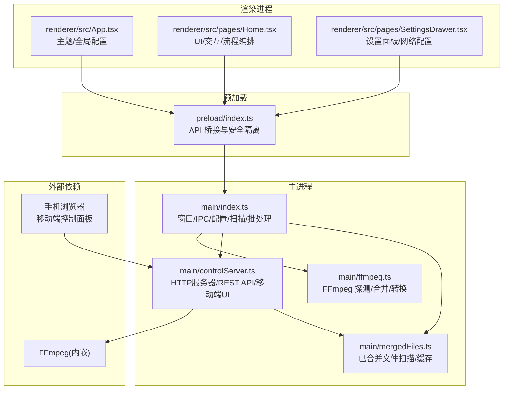
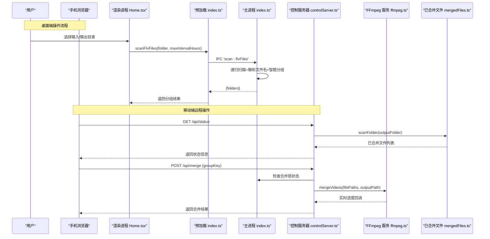
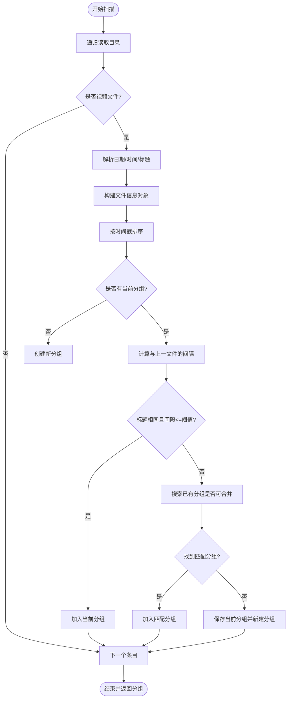
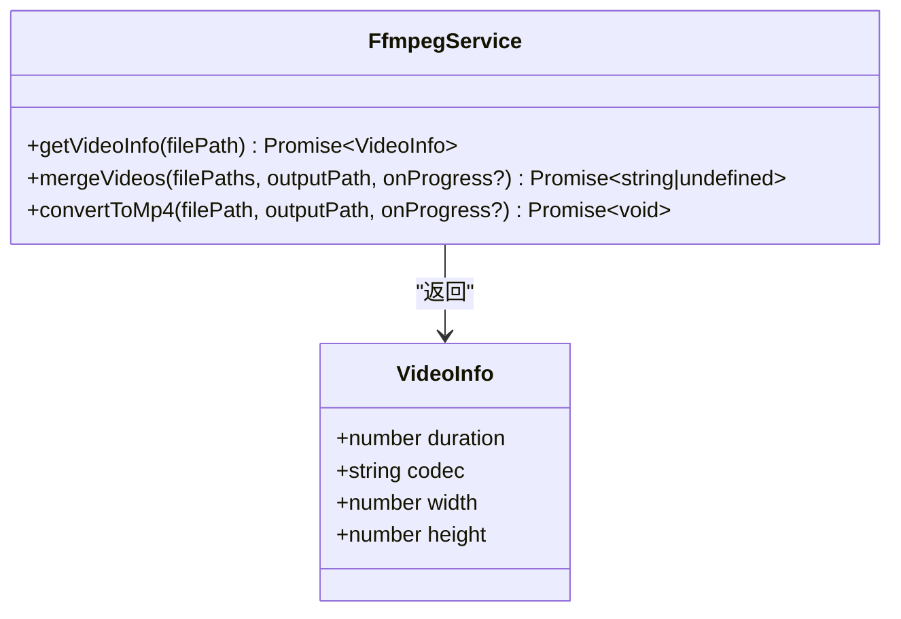
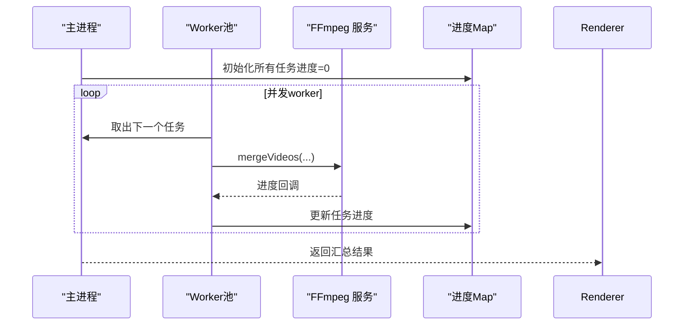
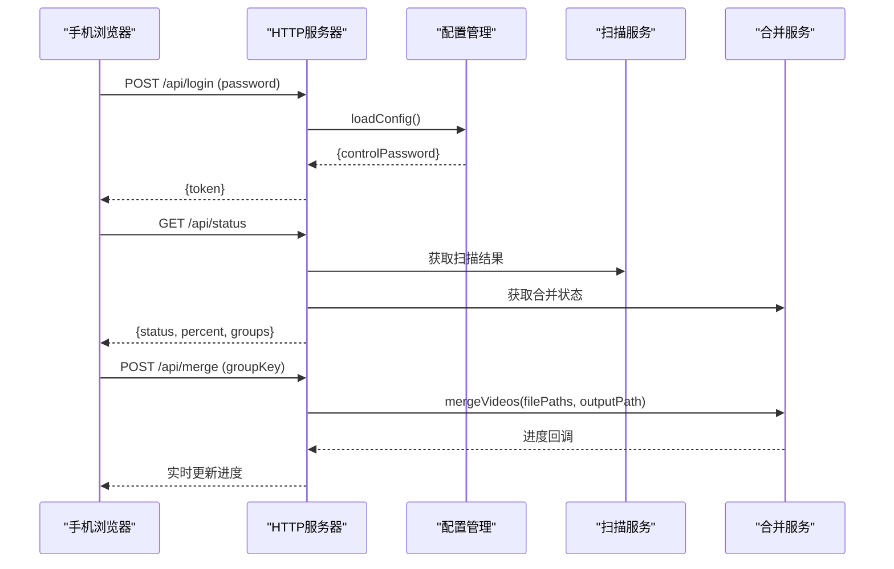
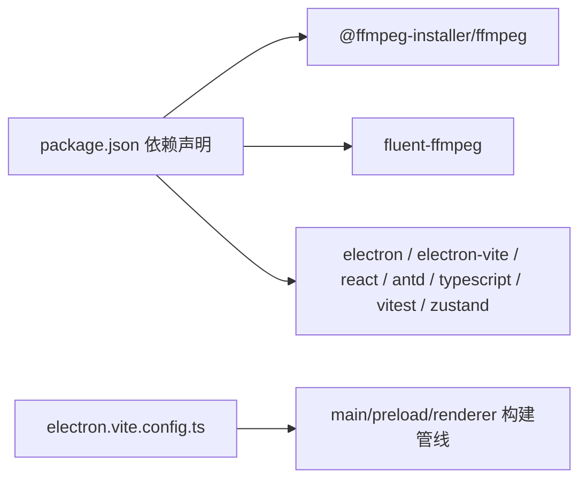

# 项目概述

<cite>
**本文引用的文件列表**
- [package.json](file://package.json)
- [electron.vite.config.ts](file://electron.vite.config.ts)
- [src/main/index.ts](file://src/main/index.ts)
- [src/main/ffmpeg.ts](file://src/main/ffmpeg.ts)
- [src/main/controlServer.ts](file://src/main/controlServer.ts)
- [src/main/mergedFiles.ts](file://src/main/mergedFiles.ts)
- [src/preload/index.ts](file://src/preload/index.ts)
- [src/renderer/src/App.tsx](file://src/renderer/src/App.tsx)
- [src/renderer/src/pages/Home.tsx](file://src/renderer/src/pages/Home.tsx)
- [src/renderer/src/pages/SettingsDrawer.tsx](file://src/renderer/src/pages/SettingsDrawer.tsx)
- [README.md](file://README.md)
- [产品需求文档.md](file://产品需求文档.md)
- [deliverables/software-company/视频合并app-增量设计-class.mermaid](file://deliverables/software-company/视频合并app-增量设计-class.mermaid)
</cite>

## 更新摘要
**所做更改**
- 新增手机控制面板功能章节，详细说明局域网远程控制架构
- 更新核心功能列表，包含移动端控制、B站投稿助手等特色功能
- 完善技术栈说明，增加Zustand状态管理和更多依赖信息
- 增强快速开始指南，提供详细的构建和部署说明
- 更新架构图表，展示新的HTTP服务器和移动端交互流程
- 补充配置管理说明，涵盖所有新增的配置选项

## 目录
1. [简介](#简介)
2. [项目结构](#项目结构)
3. [核心组件](#核心组件)
4. [架构总览](#架构总览)
5. [详细组件分析](#详细组件分析)
6. [依赖关系分析](#依赖关系分析)
7. [性能与并发特性](#性能与并发特性)
8. [快速开始指南](#快速开始指南)
9. [故障排查指南](#故障排查指南)
10. [结论](#结论)

## 简介
本项目是一个基于 Electron + React + FFmpeg 的跨平台桌面应用，专为直播录制用户设计。自动扫描 FLV 分段文件，智能分组后一键合并为完整的 MP4 视频。其核心价值在于：
- 自动发现并智能分组直播分段片段
- 一键批量合并，支持并行处理
- 提供直观的用户界面与进度反馈
- 内嵌 FFmpeg，无需用户额外安装
- **新增**：手机端局域网远程控制，随时随地管理合并任务
- **新增**：B站投稿助手，配合Chrome扩展一键投稿

技术栈选择理由与优势：
- Electron 提供跨平台桌面能力，结合 Vite 构建，开发体验高效
- React + Ant Design 提供现代化 UI，交互友好
- FFmpeg 作为底层媒体引擎，负责高效的流复制合并与转码
- TypeScript 提升类型安全与可维护性
- Zustand 提供轻量级状态管理，简化复杂状态逻辑

## 项目结构
仓库采用分层组织：主进程、预加载脚本、渲染进程、测试与交付物。关键目录与职责如下：
- src/main：Electron 主进程逻辑，包含窗口管理、IPC 路由、配置持久化、文件扫描与分组、FFmpeg 调用封装、**HTTP 控制服务器**
- src/preload：桥接层，将受控 API 暴露给渲染进程
- src/renderer：React 前端页面与状态管理，提供用户交互与可视化
- tests：单元测试覆盖配置、工具函数、FFmpeg 解析、文件分组等
- deliverables：设计与评审产物（含类图、序列图等）

**图表来源**
- [src/main/index.ts:1000-1180](file://src/main/index.ts#L1000-L1180)
- [src/main/controlServer.ts:1-80](file://src/main/controlServer.ts#L1-L80)
- [src/main/mergedFiles.ts:1-30](file://src/main/mergedFiles.ts#L1-L30)
- [src/preload/index.ts:1-64](file://src/preload/index.ts#L1-L64)
- [src/renderer/src/App.tsx:1-49](file://src/renderer/src/App.tsx#L1-L49)
- [src/renderer/src/pages/Home.tsx:1-120](file://src/renderer/src/pages/Home.tsx#L1-L120)
- [src/renderer/src/pages/SettingsDrawer.tsx:1-100](file://src/renderer/src/pages/SettingsDrawer.tsx#L1-L100)

**章节来源**
- [package.json:1-42](file://package.json#L1-L42)
- [electron.vite.config.ts:1-21](file://electron.vite.config.ts#L1-L21)

## 核心组件
- 主进程服务
  - 配置服务：读取/保存用户设置（输入输出路径、并发数、间隔阈值、自动打开开关等），持久化到用户数据目录
  - 扫描与分组服务：递归扫描文件夹，识别视频扩展名，按文件名时间戳与标题进行智能分组，过滤已合并结果
  - FFmpeg 集成：封装探测、合并（流复制）、转换（H.264+AAC）三大能力，提供进度回调与错误处理
  - 批处理调度：基于工作线程池实现多任务并行合并，统一进度聚合
  - **新增**：HTTP 控制服务器：提供 REST API 和移动端网页，支持局域网远程控制和实时状态监控
  - **新增**：已合并文件管理：扫描输出文件夹中的 MP4 文件，提供缓存机制避免频繁磁盘 I/O
- 预加载桥接
  - 统一 IPC 调用包装，返回标准化成功/失败结构，简化渲染端调用
  - **新增**：网络信息获取：提供局域网 IP 和控制端口查询
  - **新增**：控制服务器管理：动态启停 HTTP 服务器
- 渲染界面
  - 主题切换与配置加载
  - 文件夹选择、扫描、分组展示、排除/恢复、批量合并、进度条、自动打开输出目录与投稿页
  - **新增**：设置面板：包含远程控制配置、网络信息显示、后台运行设置
  - **新增**：投稿弹窗：显示已合并文件列表，支持批量选择和一键投稿

**章节来源**
- [src/main/index.ts:16-66](file://src/main/index.ts#L16-L66)
- [src/main/index.ts:145-345](file://src/main/index.ts#L145-L345)
- [src/main/index.ts:405-478](file://src/main/index.ts#L405-L478)
- [src/main/index.ts:1000-1180](file://src/main/index.ts#L1000-L1180)
- [src/main/ffmpeg.ts:60-77](file://src/main/ffmpeg.ts#L60-L77)
- [src/main/ffmpeg.ts:87-245](file://src/main/ffmpeg.ts#L87-L245)
- [src/main/ffmpeg.ts:254-304](file://src/main/ffmpeg.ts#L254-L304)
- [src/main/controlServer.ts:1-150](file://src/main/controlServer.ts#L1-L150)
- [src/main/mergedFiles.ts:1-104](file://src/main/mergedFiles.ts#L1-L104)
- [src/preload/index.ts:20-49](file://src/preload/index.ts#L20-L49)
- [src/renderer/src/App.tsx:6-46](file://src/renderer/src/App.tsx#L6-L46)
- [src/renderer/src/pages/Home.tsx:104-298](file://src/renderer/src/pages/Home.tsx#L104-L298)
- [src/renderer/src/pages/SettingsDrawer.tsx:48-298](file://src/renderer/src/pages/SettingsDrawer.tsx#L48-L298)

## 架构总览
系统采用经典的主进程-预加载-渲染三层架构，通过 IPC 通信；视频处理由 FFmpeg 完成，主进程负责调度与进度上报，渲染进程负责交互与展示。**新增**的 HTTP 控制服务器允许同一局域网内的设备通过浏览器访问移动端控制面板，实现远程操作。

**图表来源**
- [src/renderer/src/pages/Home.tsx:183-298](file://src/renderer/src/pages/Home.tsx#L183-L298)
- [src/preload/index.ts:32-48](file://src/preload/index.ts#L32-L48)
- [src/main/index.ts:1000-1180](file://src/main/index.ts#L1000-L1180)
- [src/main/controlServer.ts:284-430](file://src/main/controlServer.ts#L284-L430)
- [src/main/mergedFiles.ts:49-95](file://src/main/mergedFiles.ts#L49-L95)
- [src/main/ffmpeg.ts:87-245](file://src/main/ffmpeg.ts#L87-L245)

## 详细组件分析

### 主进程：配置与窗口管理
- 配置读写：使用用户数据目录下的 JSON 文件持久化，支持合并写入与异常保护
- 窗口创建：隐藏默认菜单，设置最小尺寸，开发模式加载 URL，生产模式加载本地 HTML
- 快捷键优化：启用窗口快捷键监听
- **新增**：托盘图标：支持后台运行模式，关闭窗口时最小化到系统托盘
- **新增**：配置文件监听：实时监控配置文件变更，同步到控制服务器和渲染进程

**章节来源**
- [src/main/index.ts:16-66](file://src/main/index.ts#L16-L66)
- [src/main/index.ts:67-97](file://src/main/index.ts#L67-L97)
- [src/main/index.ts:337-354](file://src/main/index.ts#L337-L354)
- [src/main/index.ts:284-330](file://src/main/index.ts#L284-L330)

### 主进程：文件扫描与智能分组
- 支持的视频扩展：FLV、M4S、TS、BLV
- 文件名解析：从名称中提取日期、时间戳与标题，未匹配则回退为未知
- 排序与分组：按时间戳升序，依据标题一致性与最大间隔阈值进行分组
- 去重策略：若目标目录下已存在同名 MP4（含子目录递归检查），则过滤该组避免重复合并

**图表来源**
- [src/main/index.ts:145-345](file://src/main/index.ts#L145-L345)

**章节来源**
- [src/main/index.ts:126-144](file://src/main/index.ts#L126-L144)
- [src/main/index.ts:145-345](file://src/main/index.ts#L145-L345)

### 主进程：FFmpeg 集成（探测/合并/转换）
- 探测：通过 spawn 启动 FFmpeg 仅读取文件头，毫秒级获取时长、编码、分辨率等信息
- 合并：使用 concat demuxer 直接拼接多个源文件并输出 MP4（stream copy，不重新编码），内部估算总时长以驱动进度
- 转换：使用 fluent-ffmpeg 将任意视频转换为 H.264+AAC 的 MP4，开启 faststart 优化
- 超时与清理：合并过程设置 30 分钟超时，失败时清理临时文件与列表文件

**图表来源**
- [src/main/ffmpeg.ts:60-77](file://src/main/ffmpeg.ts#L60-L77)
- [src/main/ffmpeg.ts:87-245](file://src/main/ffmpeg.ts#L87-L245)
- [src/main/ffmpeg.ts:254-304](file://src/main/ffmpeg.ts#L254-L304)

**章节来源**
- [src/main/ffmpeg.ts:1-30](file://src/main/ffmpeg.ts#L1-L30)
- [src/main/ffmpeg.ts:60-77](file://src/main/ffmpeg.ts#L60-L77)
- [src/main/ffmpeg.ts:87-245](file://src/main/ffmpeg.ts#L87-L245)
- [src/main/ffmpeg.ts:254-304](file://src/main/ffmpeg.ts#L254-L304)

### 主进程：批量并行合并
- 任务模型：每个任务包含 taskId、文件路径数组、输出路径、分组名称
- 并发控制：根据传入的并发数创建 worker 数量，依次从任务队列取任务执行
- 进度聚合：使用 Map 记录各任务进度，渲染端轮询获取并计算总体进度
- 结果汇总：返回每个任务的 success/warning/error 信息

**图表来源**
- [src/main/index.ts:405-478](file://src/main/index.ts#L405-L478)
- [src/main/ffmpeg.ts:87-245](file://src/main/ffmpeg.ts#L87-L245)

**章节来源**
- [src/main/index.ts:405-478](file://src/main/index.ts#L405-L478)

### 新增：HTTP 控制服务器与移动端控制面板
- **HTTP 服务器**：基于 Node.js http 模块创建，监听指定端口（默认 9820），支持 CORS 跨域请求
- **REST API 接口**：
  - `/api/login` - 登录认证（支持密码保护和限频保护）
  - `/api/status` - 获取应用状态和合并进度
  - `/api/groups` - 获取视频分组列表
  - `/api/scan` - 触发文件扫描
  - `/api/merge` - 合并单个分组
  - `/api/merge/batch` - 批量合并多个分组
  - `/api/config` - 读取/更新配置
  - `/api/upload` - 上传视频到 B 站
  - `/api/merged-files` - 获取已合并文件列表
- **移动端 UI**：内置响应式 HTML 页面，适配手机屏幕，提供完整的控制功能
- **状态同步**：与主应用共享扫描结果和合并状态，确保两端数据一致性
- **安全机制**：IP 限频保护、密码认证、合并互斥锁防止并发冲突

**图表来源**
- [src/main/controlServer.ts:232-430](file://src/main/controlServer.ts#L232-L430)
- [src/main/controlServer.ts:1474-1509](file://src/main/controlServer.ts#L1474-L1509)

**章节来源**
- [src/main/controlServer.ts:1-150](file://src/main/controlServer.ts#L1-L150)
- [src/main/controlServer.ts:232-731](file://src/main/controlServer.ts#L232-L731)
- [src/main/controlServer.ts:1474-1509](file://src/main/controlServer.ts#L1474-L1509)

### 新增：已合并文件管理
- **文件扫描**：递归扫描输出文件夹中的所有 MP4 文件
- **智能排序**：从文件名提取直播时间戳，按时间倒序排列（最新在前）
- **缓存机制**：12秒 TTL 缓存，避免频繁磁盘 I/O 操作
- **路径映射**：支持根据文件名查找完整路径，便于批量操作
- **缓存失效**：合并完成后主动刷新缓存，确保数据一致性

**章节来源**
- [src/main/mergedFiles.ts:1-104](file://src/main/mergedFiles.ts#L1-L104)

### 预加载桥接与渲染界面
- 预加载：统一 invokeApi 包装，自动解包 {success,data,message}，失败抛错
- 渲染：Ant Design 布局，支持深色/浅色主题，抽屉式设置面板，表格展示分组，进度条实时更新
- **新增**：网络信息获取：显示局域网 IP 和控制端口，方便手机访问
- **新增**：控制服务器管理：动态启停 HTTP 服务器，支持端口和密码配置
- **新增**：设置面板增强：包含远程控制开关、端口配置、密码设置、后台运行选项

**章节来源**
- [src/preload/index.ts:1-64](file://src/preload/index.ts#L1-L64)
- [src/renderer/src/App.tsx:6-46](file://src/renderer/src/App.tsx#L6-L46)
- [src/renderer/src/pages/Home.tsx:413-756](file://src/renderer/src/pages/Home.tsx#L413-L756)
- [src/renderer/src/pages/SettingsDrawer.tsx:48-298](file://src/renderer/src/pages/SettingsDrawer.tsx#L48-L298)

## 依赖关系分析
- 运行时依赖
  - @ffmpeg-installer/ffmpeg：内嵌 FFmpeg 二进制，解决打包后 asar 路径问题
  - fluent-ffmpeg：Node 封装，用于转码与进度事件
- 开发依赖
  - electron、electron-vite、react、antd、typescript、vitest、zustand 等
- 构建配置
  - electron-vite 分别编译 main、preload、renderer，React 插件启用

**图表来源**
- [package.json:17-40](file://package.json#L17-L40)
- [electron.vite.config.ts:1-21](file://electron.vite.config.ts#L1-L21)

**章节来源**
- [package.json:1-42](file://package.json#L1-L42)
- [electron.vite.config.ts:1-21](file://electron.vite.config.ts#L1-L21)

## 性能与并发特性
- 合并性能：采用 concat demuxer 与 stream copy，避免重新编码，速度接近磁盘 I/O 上限
- 进度估算：基于首个文件时长与大小推算总时长，提高进度准确性
- 并发合并：通过工作池限制同时执行的合并任务数，平衡 CPU 与 I/O 压力
- 资源占用：Electron 内核带来一定内存开销，但通过合理并发与流式处理保持良好体验
- **新增**：HTTP 服务器性能：轻量级 Node.js HTTP 服务器，低内存占用，支持高并发请求
- **新增**：文件扫描缓存：12秒 TTL 缓存机制，减少频繁的磁盘 I/O 操作
- **新增**：配置变更监听：防抖处理，避免频繁的文件读写和状态同步

## 快速开始指南
- 环境要求
  - Node.js 与 npm（或 pnpm/yarn）
  - Windows 10 及以上（推荐）
  - 至少 500MB 磁盘空间（含内置 Chromium 和 FFmpeg）
  - 建议 4GB 以上内存
- 安装步骤
  - 克隆仓库并进入项目根目录
  - 安装依赖：npm install
  - 开发运行：npm run dev
  - 构建打包：npm run build；发布打包：npm run dist
  - **Windows 一键打包**：build.bat
  - **macOS/Linux 打包**：chmod +x build.sh && ./build.sh
- 基本使用方法
  - 启动应用后，选择输入文件夹与输出文件夹
  - 点击"扫描视频"，系统将自动发现并分组直播分段文件
  - 勾选需要合并的分组，点击"一键合并选中视频"
  - 观察进度条与单个任务进度，完成后自动打开输出目录与投稿页面（可按设置开关）
- **新增**：手机控制面板使用
  - 在设置面板中启用"手机控制面板"
  - 设置控制端口（默认 9820）和密码（可选）
  - 在同一 WiFi 下，用手机浏览器访问 `http://[电脑IP]:[端口]`
  - 输入密码后即可远程控制合并任务

**章节来源**
- [package.json:8-15](file://package.json#L8-L15)
- [README.md:48-89](file://README.md#L48-L89)
- [src/renderer/src/pages/Home.tsx:112-165](file://src/renderer/src/pages/Home.tsx#L112-L165)
- [src/renderer/src/pages/Home.tsx:183-298](file://src/renderer/src/pages/Home.tsx#L183-L298)
- [src/renderer/src/pages/SettingsDrawer.tsx:256-293](file://src/renderer/src/pages/SettingsDrawer.tsx#L256-L293)

## 故障排查指南
- 无法扫描或分组为空
  - 确认输入目录包含 .flv/.m4s/.ts/.blv 文件，且命名符合预期格式
  - 检查是否存在权限问题导致无法访问文件或目录
- 合并失败或超时
  - 部分源文件可能被录制程序占用，应用会自动跳过被占用的文件并提示警告
  - 合并超过 30 分钟会触发超时，建议检查磁盘 I/O 与并发设置
- 输出文件无法覆盖
  - 若目标路径已有同名 MP4，应用会尝试备份并重命名，如仍失败请手动释放占用
- 进度不更新
  - 渲染端每 500ms 轮询批量进度，确保网络/IPC 通道正常；如遇异常可查看控制台日志
- **新增**：手机控制面板无法访问
  - 确认防火墙允许端口 9820 的入站连接
  - 检查电脑和手机是否在同一局域网段
  - 验证控制服务器是否已启动（查看应用日志）
  - 确认密码设置正确（如果设置了密码）
- **新增**：配置不同步问题
  - 检查配置文件权限，确保应用有读写权限
  - 重启应用以重新加载配置
  - 查看控制台日志中的配置变更通知

**章节来源**
- [src/main/ffmpeg.ts:110-125](file://src/main/ffmpeg.ts#L110-L125)
- [src/main/ffmpeg.ts:154-161](file://src/main/ffmpeg.ts#L154-L161)
- [src/main/ffmpeg.ts:200-244](file://src/main/ffmpeg.ts#L200-L244)
- [src/renderer/src/pages/Home.tsx:221-236](file://src/renderer/src/pages/Home.tsx#L221-L236)
- [src/main/controlServer.ts:239-270](file://src/main/controlServer.ts#L239-L270)
- [src/main/index.ts:284-330](file://src/main/index.ts#L284-L330)

## 结论
本项目以 Electron + React + FFmpeg 为核心，围绕直播分段视频的自动化合并场景，提供了从扫描、分组、批处理到可视化的完整解决方案。通过流复制合并与并发调度，兼顾效率与易用性；内嵌 FFmpeg 降低用户门槛。**新增的手机控制面板功能**进一步提升了用户体验，让用户可以随时随地通过手机远程控制合并任务。后续可在更多格式支持、更精细的进度预估与错误恢复方面持续优化。