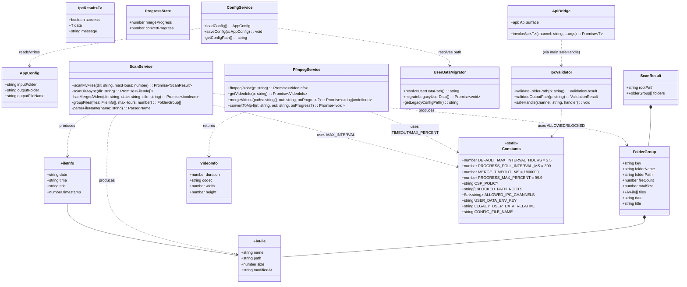
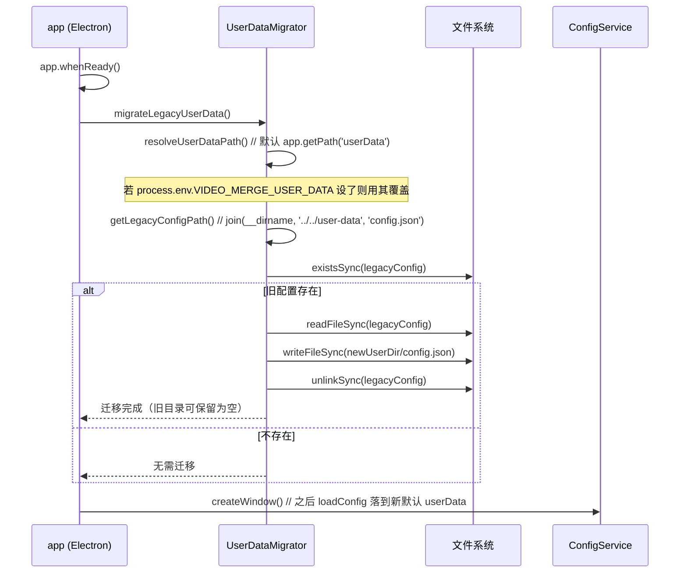
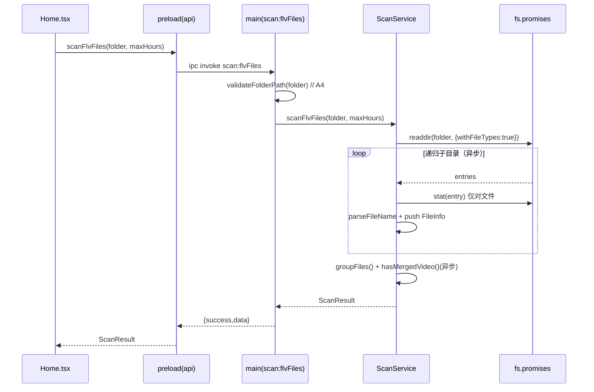
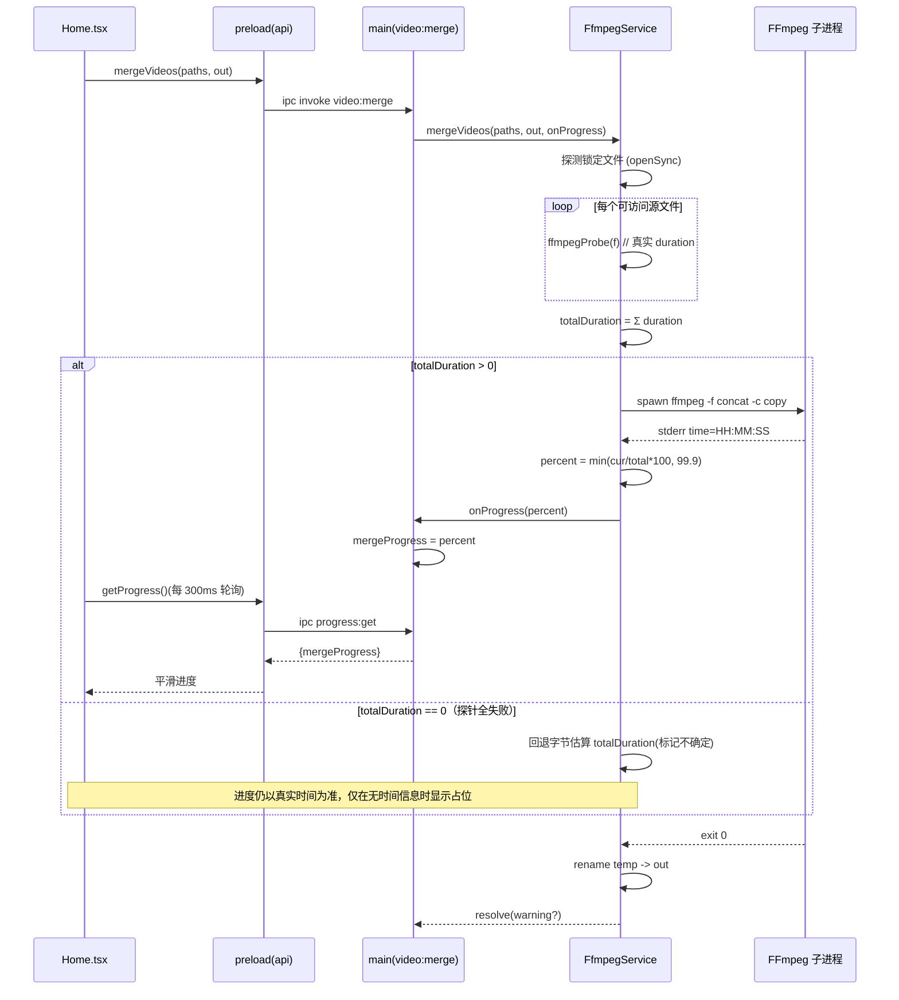
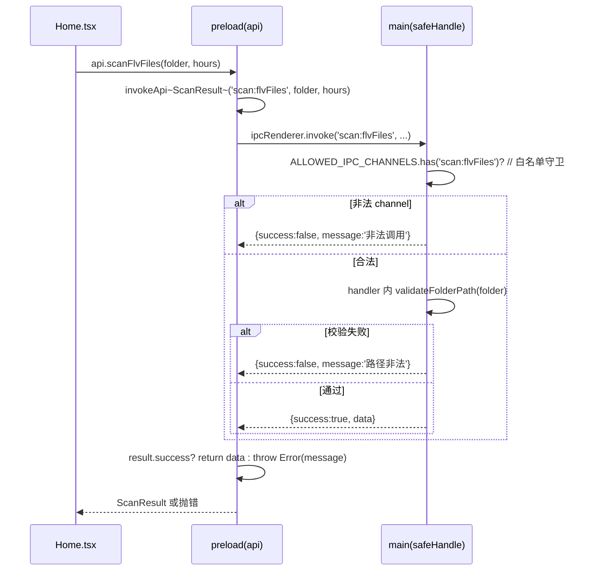
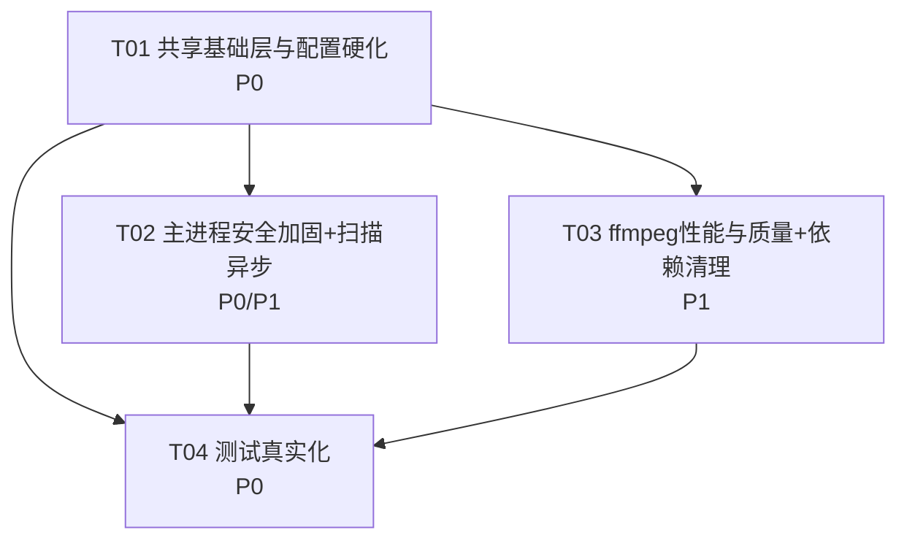

# 视频合并 App — 增量设计文档（加固改造 v1.1）

**文档类型**：增量架构设计 + 任务分解（仅设计，不含实现代码）
**基线版本**：v1.0（已完成 MVP，见 `产品需求文档.md`）
**依据**：`视频合并app-增量PRD-2026-07-06.md`（已确认）、`视频合并app-架构评审-2026-07-06.md`、`src/**` 实际源码
**编写日期**：2026-07-06
**编写人**：Bob（架构师 / software-architect）
**语言**：中文（文档与注释）；代码维持 TypeScript

---

# Part A：系统设计

## 1. 实现方案与框架选型（不引入新框架）

### 1.1 核心技术挑战

| 挑战 | 对应决策/需求 | 方案 |
|------|--------------|------|
| 渲染进程隔离不足（`sandbox:false`） | A1 | `webPreferences.sandbox = true`；ffmpeg 在主进程 `spawn`，沙箱不影响子进程；preload 仅用 `contextBridge`+`ipcRenderer`，符合沙箱约束 |
| 无 CSP、暴露完整 `ipcRenderer`、userData 误置安装目录 | A2/A3/A4/A5 | 生产环境 `session.setContentSecurityPolicy` + `index.html` meta 双保险；收敛 preload 暴露；`userData` 回归 Electron 默认并做旧配置迁移；IPC 入参白名单 + 路径合法性/越界校验 |
| 扫描同步阻塞主进程 | B1 | `readdirSync`/`statSync` → `fs.promises.readdir`(withFileTypes) + `fs.promises.stat` 递归异步化 |
| 进度估算失真（首文件码率×大小） | B2 | 合并前对各源文件 `ffmpegProbe` 取真实 `duration` 求和作 `totalDuration`；未知时回退字节估算并标记不确定 |
| 未开 `strict`、魔法值、`any`、重复类型、Promise 反模式、测试零覆盖 | C1–C7 | 开启 `strict` 并一次性修完所有引爆点；常量/类型集中单一来源；`new Promise(async...)` 改为外 async + 内普通 Promise；测试改为 `import` 真实源码 + mock ffmpeg |

### 1.2 框架与库选型

**不引入任何新框架/新依赖**，完全沿用现有技术栈：

- Electron 33 + React 18 + electron-vite 2 + electron-builder 25 + Ant Design 5
- fluent-ffmpeg / @ffmpeg-installer/ffmpeg（视频处理，维持现状）
- TypeScript 5（本次仅改 `tsconfig` 开关，不升版）
- vitest（测试，仅改用例引用方式，不换框架）

**架构模式**：维持既有「主进程 / preload / 渲染进程」三段式，仅做加固与质量改造，进程边界与数据流不变。

---

## 2. 文件列表（标注 新增 / 修改）

### 2.1 新增文件

| 相对路径 | 作用 |
|----------|------|
| `src/shared/constants.ts` | 集中魔法值、CSP 策略串、IPC 白名单、敏感目录黑名单、userData 相关常量（C3 / A2 / A4 / A3） |
| `src/shared/types.ts` | 类型单一来源：`AppConfig` / `FlvFile` / `FileInfo` / `FolderGroup` / `ScanResult` / `VideoInfo` / `IpcResult` / `ProgressState`（C5） |
| `src/main/security.ts` | IPC 入参校验（`validateFolderPath` / `validateOutputPath`）、channel 白名单守卫 `safeHandle`（A4） |
| `src/main/userData.ts` | 旧 `userData` 配置迁移 `migrateLegacyUserData` 与环境变量覆盖解析（A3） |
| `tests/mocks/ffmpeg.ts` | 测试中 mock 的 ffmpeg 路径与探针桩，供 5 个测试文件复用（C7） |

### 2.2 修改文件

| 相对路径 | 改动点 |
|----------|--------|
| `tsconfig.node.json` | 开启 `strict`/`noUnusedLocals`/`noUnusedParameters`；`include` 增加 `src/shared`；`composite` 维持（C1） |
| `tsconfig.web.json` | 同上；`include` 增加 `src/shared`（C1） |
| `src/main/index.ts` | A1（`sandbox:true`）、A2（CSP 设置）、A3（移除 `setPath`、调用迁移）、A4（handler 走 `safeHandle` + 入参校验）、B1（扫描异步）、C2（handler 参数去 `any`）、C3（`2.5`→常量）、C4（移除 `relative` 导入）、C5（import 共享类型） |
| `src/main/ffmpeg.ts` | B2（真实时长求和）、C2（类型对齐 `VideoInfo`）、C3（`30*60*1000`/`99.9`→常量）、C6（`new Promise(async...)` 修复） |
| `src/preload/index.ts` | A5（移除 `@electron-toolkit/preload` 的 `electronAPI` 暴露）、C2（`invokeApi` 返回类型去 `any`，泛型化） |
| `src/renderer/src/env.d.ts` | C5（改为从 `src/shared/types.ts` import 类型，保持 `Window.api` 类型） |
| `src/renderer/index.html` | A2（增加 CSP `<meta http-equiv>` 作为防御纵深） |
| `src/renderer/src/pages/Home.tsx` | C3（轮询 `300`、默认 `2.5` 改用常量）、C4（移除未用 `dayjs` 导入）、C2（`catch (err: any)` → `unknown`） |
| `package.json` | C4（移除未用依赖 `zustand`、`dayjs`、`@electron-toolkit/preload`） |
| `tests/parseFileName.test.ts` | C7（import 真实 `parseFileName`，移除本地副本） |
| `tests/fileGrouping.test.ts` | C7（import 真实分组逻辑） |
| `tests/ffmpegParsing.test.ts` | C7（import 真实 `ffmpegProbe`/`getVideoInfo` 解析，mock ffmpeg） |
| `tests/invokeApi.test.ts` | C7（import 真实 `invokeApi`） |
| `tests/configAndUtils.test.ts` | C7（import 真实 `loadConfig`/`saveConfig` 合并与 `hasMergedVideo`） |

### 2.3 不改动文件

`electron.vite.config.ts`、`electron-builder.yml`、`src/renderer/src/App.tsx`、`src/renderer/src/main.tsx`、`src/renderer/src/assets/styles/global.css`。

---

## 3. 数据结构与接口（Mermaid classDiagram）



**关键接口签名（A4 / C2 / C5）**

```ts
// src/main/security.ts
export type ValidationResult =
  | { ok: true; path: string }
  | { ok: false; error: string }

export function validateFolderPath(p: unknown): ValidationResult
export function validateOutputPath(p: unknown): ValidationResult
export function safeHandle(
  channel: string,
  handler: (event: IpcMainInvokeEvent, ...args: unknown[]) => unknown
): void

// src/main/userData.ts
export function resolveUserDataPath(): string
export function migrateLegacyUserData(): Promise<void>

// src/preload/index.ts
export async function invokeApi<T = unknown>(
  channel: string, ...args: unknown[]
): Promise<T>
```

---

## 4. 程序调用流程（Mermaid sequenceDiagram）

### 4.1 旧 userData 配置迁移时序（A3）



### 4.2 异步扫描时序（B1）



### 4.3 真实时长进度时序（B2）



### 4.4 IPC 校验 + preload 调用时序（A4 / A5 / C2）



---

## 5. 待明确（Anything UNCLEAR）与三项决策落实

### 5.1 A1 sandbox 落实 + 沙箱验证清单

- **落实**：`src/main/index.ts` `webPreferences.sandbox` 由 `false` 改为 `true`；ffmpeg 在主进程 `spawn`，不受沙箱影响；preload 仅用 `contextBridge.exposeInMainWorld('api', api)` + `ipcRenderer`，符合沙箱约束（沙箱内禁止 Node API，但 `ipcRenderer`/`contextBridge` 被 Electron 显式允许）。
- **沙箱验证清单（实现后逐项确认）**：
  1. 应用启动后窗口正常 `loadURL`/`loadFile` 并显示，无白屏/崩溃；
  2. `contextBridge` 注入成功：`window.api` 存在且 `loadConfig`/`scanFlvFiles` 等方法可调用；
  3. 关键 IPC 调用（`dialog:selectFolder`、`scan:flvFiles`、`video:merge`、`progress:get`）往返正常；
  4. 合并任务能正常 `spawn` FFmpeg 子进程并完成拼接；
  5. 控制台无 `Blocked … in sandboxed renderer` 类报错。
- **回退方案**：若实测沙箱破坏某能力（如某些 Electron API 不可达），则回退为 `sandbox:false`，但**保留 A2（CSP）+ A4（IPC 校验）+ A5（收敛 electronAPI）** 作为最小安全基线；默认按 `true` 实现。

### 5.2 A3 userData 落实 + 迁移方案

- **落实**：删除 `src/main/index.ts:356-357` 的 `app.setPath('userData', join(__dirname,'../../user-data'))`；配置读写自然落到 `app.getPath('userData')`（系统默认，如 `%APPDATA%/video-merger`）。
- **迁移方案**（`src/main/userData.ts`，应用 `whenReady` 时最先执行）：
  - 计算旧路径：`join(__dirname, '../../user-data', 'config.json')`（与原代码同口径，物理位置不变）；
  - 若存在 → 复制到新默认 `userData/config.json` → 删除旧文件（旧目录留空即可）；
  - 开发期可通过环境变量 `VIDEO_MERGE_USER_DATA=<path>` 覆盖 `userData` 根目录以便调试（通过 `resolveUserDataPath()` 在 `app.whenReady` 前若存在则 `app.setPath('userData', envValue)`；注意 `setPath` 须早于首次 `getPath`）。

### 5.3 C1 strict 落实 + strict 引爆点与统一修复策略

- **落实**：`tsconfig.node.json` 与 `tsconfig.web.json` 开启 `"strict": true`（含 `strictNullChecks`/`strictFunctionTypes` 等子集）及 `noUnusedLocals`/`noUnusedParameters`；**一次性修完**（不采用 `// @ts-expect-error` 灰度），`tsc -b` 全绿作为交付门槛。
- **strict 引爆点（逐文件）**：

| 文件 | 引爆点 | 修复策略 |
|------|--------|----------|
| `src/preload/index.ts` | `invokeApi(): Promise<any>`；`window.electron = electronAPI` 依赖 `// @ts-ignore` | 泛型化 `invokeApi<T>` 返回 `Promise<T>`；移除 `electronAPI` 暴露（A5），删除 `@ts-ignore` |
| `src/main/index.ts` | `catch (error: any)`（多处）；`import { join, relative, dirname }` 中 `relative` 未用；handler 入参 `folderPath`/`outputPath` 裸 `string` 无校验；`process.env[...]` 索引 | `catch (error)` + `error instanceof Error ? error.message : '...'`；删 `relative`（C4）；入参经 `validateXxx` 后使用（A4）；`noUnusedParameters` 下 `_event` 以 `_` 前缀豁免 |
| `src/main/ffmpeg.ts` | `new Promise(async (resolve,reject)=>{...})`（C6）；`catch (err: any)`；`fluent-ffmpeg` `.on('progress', info => info.percent)` 中 `info` 可能为 `number\|undefined`；`reject(new Error((e as any).message))` | 外函数 `async`、内 `new Promise((resolve,reject)=>{...})`，`run().catch(reject)`；`catch (err)` 用 `instanceof Error`；`info.percent ?? 0`；统一 `err instanceof Error` 取值 |
| `src/renderer/src/pages/Home.tsx` | `import dayjs`（C4 未用，`noUnusedLocals` 报错）；`catch (err: any)`；魔法值 `300`/`2.5` | 删 `dayjs`；`catch (err)` + 类型收窄；改用 `PROGRESS_POLL_INTERVAL_MS`/`DEFAULT_MAX_INTERVAL_HOURS` |
| `src/renderer/src/env.d.ts` | 重复声明 `AppConfig`/`FlvFile`/`FolderGroup` 与 index.ts 漂移 | 改为 `import type {...} from '../../shared/types'`，仅 `declare global { interface Window {...} }` 引用（C5） |

- **统一修复约定（共享知识见 §8）**：`catch` 统一用 `unknown` + `instanceof Error` 收窄；`any` 一律消除（preload 用泛型、handler 用校验后类型）；类型只来自 `src/shared/types.ts`；常量只来自 `src/shared/constants.ts`。

### 5.4 不在本次范围

- W4「大量静默 `catch`」本次**不全面治理**，仅在被改动到的函数内顺手补最小错误透出（如 `reject(new Error(...))` 已带 message），不新增全局错误总线。
- B3（多组合并并行）仅评估不实现：当前 `Home.tsx` 串行 `for+await` 维持；若未来做，应与后续任务队列（评审 I6）合并，避免多 ffmpeg 子进程资源争用。
- 不实现 I1/I2/I3/I5–I12（PRD 非目标）。

---

# Part B：任务分解

## 6. 依赖包列表（应基本为空，仅确认移除项）

**新增依赖：无**（不引入任何新框架/新库）。

**移除依赖（C4 + A5 连带）**：

```
- zustand@^5.0.1            # devDependency，源码从未 import（确认无引用后移除）
- dayjs@^1.11.13            # devDependency，仅 Home.tsx:5 误导入未用，移除导入后一并卸载
- @electron-toolkit/preload@^3.0.1  # devDependency，A5 移除 electronAPI 暴露后不再引用
```

> 保留：`@electron-toolkit/utils`（main 仍用 `electronApp`/`optimizer`/`is`）。`@ffmpeg-installer/ffmpeg`、`fluent-ffmpeg`、`antd` 等维持。

## 7. 任务列表（有序、含依赖、标注 P0/P1/P2 与改动文件）

> 分组原则：按「共享层 / 主进程 / ffmpeg+渲染+依赖 / 测试」分层；首任务为基础设施；每个任务 ≥3 个相关文件；任务间尽量仅依赖 T01。

### T01 — 共享基础层与配置硬化（P0，基建，无前置依赖）

- **Source Files**：`tsconfig.node.json`(改)、`tsconfig.web.json`(改)、`src/shared/constants.ts`(新)、`src/shared/types.ts`(新)、`src/preload/index.ts`(改)、`src/renderer/src/env.d.ts`(改)
- **Dependencies**：无
- **Priority**：P0
- **覆盖**：C1（开启 `strict`/`noUnusedLocals`/`noUnusedParameters`，两 tsconfig `include` 增加 `src/shared`）、C3（常量集中定义）、C5（`types.ts` 单一来源）、A5+C2（preload 移除 `electronAPI` 暴露、`invokeApi` 泛型化去 `any`）、env.d.ts 改 import 共享类型
- **验收**：`tsc -b` 在共享层与 preload 范围内通过；`window.api` 类型仍完整

### T02 — 主进程安全加固 + 扫描异步（P0 / P1，依赖 T01）

- **Source Files**：`src/main/index.ts`(改)、`src/main/security.ts`(新)、`src/main/userData.ts`(新)、`src/renderer/index.html`(改)
- **Dependencies**：T01
- **Priority**：P0（A1/A2/A3/A4 为 P0；B1 为 P1，随本任务一并落地）
- **覆盖**：
  - A1：`webPreferences.sandbox = true`
  - A2：`session.defaultSession.setContentSecurityPolicy(CSP_POLICY)`（仅生产包；dev 跳过以免破坏 Vite HMR ws）+ `index.html` 增加 CSP `<meta>` 防御纵深
  - A3：删除 `setPath('userData',...)`；`app.whenReady` 最先 `await migrateLegacyUserData()`；支持 `VIDEO_MERGE_USER_DATA` 环境变量
  - A4：所有 `ipcMain.handle` 改为 `safeHandle`，handler 内对 `folderPath`/`outputPath` 走 `validateFolderPath`/`validateOutputPath`
  - B1：`scan:flvFiles`/`hasMergedVideo` 改 `fs.promises.readdir`(withFileTypes)+`stat` 异步递归
  - C2：`catch (error: any)`→`unknown`+`instanceof Error`；handler 入参经校验后使用
  - C3：`2.5`→`DEFAULT_MAX_INTERVAL_HOURS`
  - C4：移除 `relative` 导入
  - C5：从 `src/shared/types.ts` import `AppConfig`/`FolderGroup`/`ScanResult` 等

### T03 — ffmpeg 性能与质量 + 依赖清理（P1，依赖 T01）

- **Source Files**：`src/main/ffmpeg.ts`(改)、`src/renderer/src/pages/Home.tsx`(改)、`package.json`(改)
- **Dependencies**：T01
- **Priority**：P1（B2/C6 为 P1；C3/C2/C4 收尾）
- **覆盖**：
  - B2：`mergeVideos` 合并前对各可访问文件 `ffmpegProbe` 取真实 `duration` 求和得 `totalDuration`；为 0 时回退字节估算并标记不确定
  - C6：`new Promise(async (resolve,reject)=>{...})` → 外层 `async function mergeVideos` + 内层 `new Promise((resolve,reject)=>{... run().catch(reject)})`
  - C3：`30*60*1000`→`MERGE_TIMEOUT_MS`、`99.9`→`PROGRESS_MAX_PERCENT`；Home.tsx 轮询 `300`→`PROGRESS_POLL_INTERVAL_MS`、默认 `2.5`→`DEFAULT_MAX_INTERVAL_HOURS`
  - C2：`getVideoInfo` 返回对齐 `VideoInfo`；`catch (err: any)`→`unknown`；`info.percent ?? 0`
  - C4：Home.tsx 移除 `dayjs` 导入；`package.json` 移除 `zustand`/`dayjs`/`@electron-toolkit/preload`

### T04 — 测试真实化（P0，依赖 T01/T02/T03）

- **Source Files**：`tests/parseFileName.test.ts`(改)、`tests/fileGrouping.test.ts`(改)、`tests/ffmpegParsing.test.ts`(改)、`tests/invokeApi.test.ts`(改)、`tests/configAndUtils.test.ts`(改)、`tests/mocks/ffmpeg.ts`(新)
- **Dependencies**：T01（共享类型/常量）、T02（真实 `index.ts` 导出）、T03（真实 `ffmpeg.ts` 导出）
- **Priority**：P0（C7）
- **覆盖**：
  - 5 个测试文件改为 `import` 真实 `parseFileName`/`groupFiles`/`ffmpegProbe`/`getVideoInfo`/`invokeApi`/`loadConfig`/`saveConfig`/`hasMergedVideo`（从 `src/main/index.ts` / `src/main/ffmpeg.ts` / `src/preload/index.ts` 导出，需补充导出语句）
  - 对 ffmpeg / fs 做 mock（`tests/mocks/ffmpeg.ts` 提供探针桩与 list 生成桩），保留既有用例断言
  - `vitest run` 全绿，且覆盖真实函数（消除实际零覆盖）

> 任务总数：**4 个**（≤5，满足硬上限）；首个为基础设施；每个任务 ≥3 文件；T02/T03/T04 仅依赖 T01，无过长线性链。

## 8. 共享知识（跨文件约定，供 Engineer 实现）

```
1. 常量唯一来源：所有魔法值（2.5h / 300ms / 1800000ms / 99.9 / CSP / 敏感目录 / IPC 白名单）
   只定义在 src/shared/constants.ts，禁止在业务文件中硬编码。
2. 类型唯一来源：AppConfig / FlvFile / FileInfo / FolderGroup / ScanResult / VideoInfo /
   IpcResult / ProgressState 只在 src/shared/types.ts 定义并 export；main/preload/renderer
   统一 import，禁止三处重复声明。
3. IPC 校验规则：
   - 所有 channel 通过 security.ts 的 ALLOWED_IPC_CHANNELS 白名单注册（safeHandle）；
   - folderPath：非空 + 绝对路径 + 存在且为目录 + 不在 BLOCKED_PATH_ROOTS；
   - outputPath：非空 + 绝对路径 + 父目录可写/可创建 + 不在 BLOCKED_PATH_ROOTS；
   - 校验失败返回 {success:false, message:'...'}，绝不静默执行。
4. strict 修复约定：catch 一律用 unknown 并 instanceof Error 收窄取 message；
   any 一律消除（preload 用泛型、handler 用校验后类型）；未用变量/参数用
   noUnusedLocals/Parameters 暴露后删除（_ 前缀参数豁免）。
5. CSP 策略：生产包通过 session.setContentSecurityPolicy 设置（dev 跳过 HMR）；
   style-src 必须含 'unsafe-inline' 以兼容 AntD 内联样式；无远程源。
6. userData：默认走 app.getPath('userData')；启动优先 migrateLegacyUserData()；
   调试可用 VIDEO_MERGE_USER_DATA 覆盖。
7. Promise 约定：禁止 new Promise(async (resolve,reject)=>{...})；
   异步主体用 async 函数 + run().catch(reject) 或外层 async 函数返回内层普通 Promise。
```

## 9. 任务依赖图（Mermaid）



---

**文档版本**：v1.1（增量设计）
**状态**：待 team-lead 确认后进入实现排期
**附**：序列图见 `视频合并app-增量设计-sequence.mermaid`；类图见 `视频合并app-增量设计-class.mermaid`
