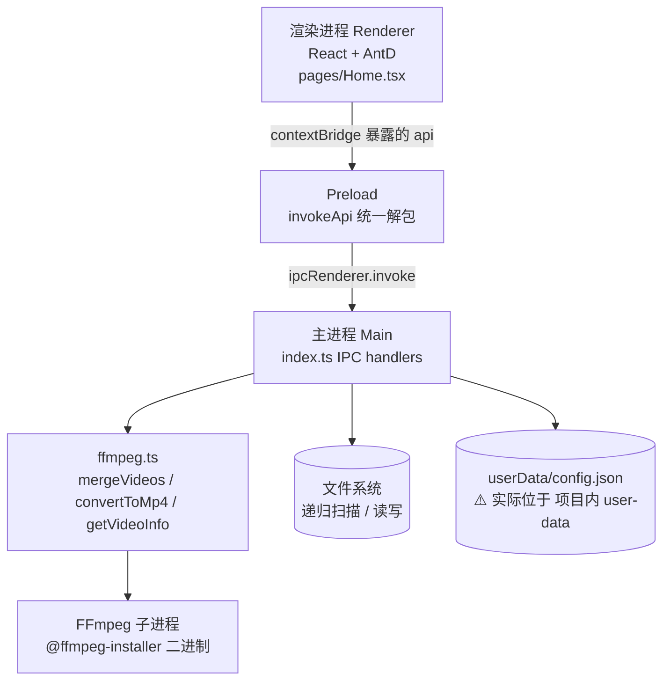
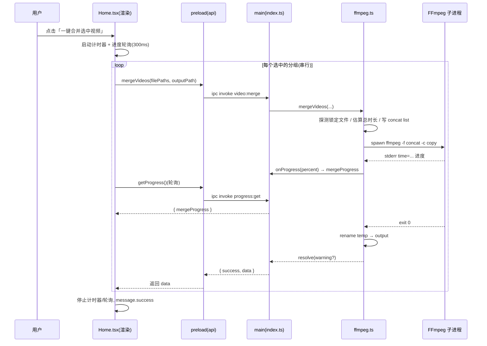

# 视频合并 App — 架构评审报告

**评审对象**：`D:\qoder\视频合并app`（已开发完成的 Electron 桌面应用）
**评审日期**：2026-07-06
**评审人**：Bob（架构师 / software-architect）
**评审方法**：实际读取 PRD + 4 个配置文件 + 全部 9 个源码文件（`src/main/*`、`src/preload/*`、`src/renderer/*`）+ 5 个测试文件，逐行核对后下结论，不凭空推断。

---

## 0. 项目概况与基线

- **技术栈**：Electron 33 + React 18 + Ant Design 5 + electron-vite 2 + electron-builder 25 + fluent-ffmpeg / @ffmpeg-installer/ffmpeg + vitest。
- **进程模型**：标准三段式（主进程 / preload / 渲染进程）。
- **核心能力**：扫描文件夹内 FLV 分段 → 按「日期 + 标题 + 时间间隔」自动分组（判定同一场直播）→ 通过 FFmpeg `concat demuxer` + `stream copy` 直接拼接为 MP4。
- **代码规模**：主进程 ~381 行（`index.ts`）+ ~303 行（`ffmpeg.ts`）；preload ~57 行；渲染进程 `Home.tsx` ~422 行；测试 5 个文件共 ~400 行。

---

## 1. 系统架构总览

### 1.1 进程与模块关系

### 1.2 合并调用链（关键路径）

---

## 2. 优点（Strengths）

| # | 优点 | 具体代码依据 |
|---|------|------|
| S1 | **进程边界清晰、安全基线达标** | `src/main/index.ts:57-60` 的 `webPreferences` 只设 `preload` 与 `sandbox:false`，未关闭 `contextIsolation`（Electron 33 默认 `true`）、未开启 `nodeIntegration`（默认 `false`）；preload 通过 `contextBridge.exposeInMainWorld('api', api)`（`src/preload/index.ts:45-57`）暴露**有限方法**，而非原始 `ipcRenderer`。 |
| S2 | **合并算法思路正确、性能达标** | `src/main/ffmpeg.ts:162-170` 采用 `concat demuxer` + `-c copy` **流拷贝（不重新编码）**，拼接极快，实际远优于 PRD 6.1「合并 10 段 <30s、转码≥1.5x」的要求（因免转码，相对时长几乎瞬时）。 |
| S3 | **打包链路规范，规避 asar 经典坑** | `electron.vite.config.ts` 正确分离 main/preload/renderer；`electron-builder.yml:11-13` 用 `asarUnpack` 解包 ffmpeg 二进制与 `resources`；`src/main/ffmpeg.ts:9` 用 `app.asar → app.asar.unpacked` 重定向，解决 asar 虚拟文件系统内无法 `spawn` exe 的问题。 |
| S4 | **健壮性细节到位** | 合并前用 `openSync` 探测锁定文件并自动跳过正在录制的片段（`ffmpeg.ts:98-117`）；30 分钟超时保护（`ffmpeg.ts:154-160`）；输出文件已存在时自动备份（`ffmpeg.ts:209-224`）；已合并视频自动过滤避免重复（`index.ts:250-280`）。 |
| S5 | **FFmpeg 探测轻量** | `ffmpegProbe`（`ffmpeg.ts:13-32`）仅读文件头、命中 `Duration:` 立即 `kill`，毫秒级完成，避免全文件解析。 |
| S6 | **UI/UX 较友好** | `App.tsx:1-20` 用 `ConfigProvider` + 中文 locale + 主题 token；进度条 + 已用时长（`Home.tsx:382-404`）；分组表格支持全选/取消、子文件列表（`Home.tsx:319-379`）；「FFmpeg 就绪」状态标签降低技术小白的不安。 |
| S7 | **外部进程不阻塞 JS 主线程** | 合并/转换均通过 `spawn`/`fluent-ffmpeg` 启动独立 FFmpeg 子进程（`ffmpeg.ts:174`、`ffmpeg.ts:269`），CPU 密集型工作在子进程，主进程仅做进度解析，不会因转码卡死渲染。 |
| S8 | **测试覆盖核心算法逻辑分支（理念可取）** | 5 个测试文件对文件名解析、文件分组、时长/进度正则、配置合并、IPC 解包、路径转义等都有较完整用例（详见不足 W5 关于实现方式的重大缺陷）。 |

---

## 3. 不足（Weaknesses）

### W1. 缺失功能（对照 PRD）

| PRD 要求 | 现状 | 证据 |
|---------|------|------|
| 2.2.3 单文件/批量「格式转换 FLV→MP4」（高优先级） | **后端已实现但 UI 从未调用**，用户不可用 | `convertToMp4`（`ffmpeg.ts:253-302`）、`video:convert` handler（`index.ts:337-349`）、preload `convertVideo`（`preload:38-39`）均存在；但 `Home.tsx` 全文未出现 `convertVideo` —— **实质死代码**。 |
| 2.2.1/2.2.2 显示「时长、创建时间」 | 未实现 | `getVideoInfo`（`ffmpeg.ts:65-77`、`preload:35`）已实现但 `Home.tsx` 未调用；文件列表仅展示 日期/标题/段数/大小（`Home.tsx:206-255`），无时长列。 |
| 2.2.4 自定义输出文件名 | 未实现 | 输出名由 `genMergeFileName` 自动生成（`Home.tsx:41-47`），UI 无文件名输入框。 |
| 2.2.5 支持取消正在进行的操作 | 未实现 | `video:merge` 为一次性 ipc，仅进度轮询、无 abort 通道、无取消按钮（`Home.tsx:112-181`）。 |
| 2.1 日志记录（低优先级） | 仅 `console.log`，无日志文件/面板 | 主进程多处 `console.log/error`，无用户可见日志。 |

> **结论**：PRD 中「格式转换」「显示时长」「自定义文件名」「取消操作」四项均未真正交付给用户，尽管后端代码已写好——这是本次评审最值得关注的产品级缺口。

### W2. 性能瓶颈

- **扫描阻塞主进程**：`scan:flvFiles` 使用**同步递归** `readdirSync`（`index.ts:142-173`），大目录（数千文件）会阻塞主进程事件循环，导致 IPC 响应卡顿。PRD「扫描 100 文件 <5s」可满足，但规模上升后风险明显。
- **多组合并串行**：`Home.tsx:145-168` 的 `for` 循环对每组 `await`，未并行；虽 concat copy 快，但多组大视频时可优化。
- **进度估算失真**：总时长用「首文件码率 × 总大小」推算（`ffmpeg.ts:127-144`），VBR 下严重失准；且 `totalDuration=0` 时进度恒为 0 直到 100%（`ffmpeg.ts:182` 守卫），用户看不到中间进度。

### W3. 安全隐患

- **`sandbox:false`**（`index.ts:59`）削弱渲染进程隔离。
- **暴露完整 `ipcRenderer`**：preload 除自定义 `api` 外，还暴露 `@electron-toolkit/preload` 的 `electronAPI`（含完整 `ipcRenderer` 的 `invoke/send/on`，`preload:1-2,47`），渲染进程理论上可 invoke 任意 channel。
- **无 Content-Security-Policy**：本地内容无远程源，风险低，但属 Electron 安全清单欠项。
- **`userData` 写到安装/项目目录**：`app.setPath('userData', join(__dirname,'../../user-data'))`（`index.ts:356-357`）使配置写入 `resources/user-data`；若安装到 `Program Files` 可能为只读，导致 `saveConfig` 静默失败（被 `catch` 吞掉），**正式版配置持久化可能失效**。
- **IPC 入参未校验**：`folderPath`/`outputPath` 直接来自渲染进程（`index.ts:107,322,337`），未做路径合法性/越界校验（本地工具风险低，但属最小权限缺失）。

### W4. 代码质量与可维护性

- **Promise 反模式**：`mergeVideos` 使用 `new Promise(async (resolve,reject)=>{...})`（`ffmpeg.ts:92`），async 执行器内异常不会触发外层 `reject`。
- **大量静默吞错**：`catch { /* ignore */ }` 遍布（`index.ts:35,44`，`ffmpeg.ts:135,198` 等），不利排障。
- **魔法值未提取**：`2.5`h（`index.ts:107`）、`30*60*1000`（`ffmpeg.ts:160`）、`300`ms 轮询（`Home.tsx:133`）、`99.9` 上限（`ffmpeg.ts:187`）。
- **类型安全弱**：`tsconfig.node.json`/`tsconfig.web.json` 均未开启 `strict`；preload 的 `invokeApi` 返回 `any`（`preload:9-18`），与 `env.d.ts` 声明的类型**脱钩**（运行时无类型约束）。
- **死代码 / 未用依赖**：`zustand` 安装但未使用；`dayjs` 在 `Home.tsx:5` 导入但未使用；`relative` 在 `index.ts:2` 导入未用。
- **类型重复声明**：`AppConfig/FlvFile/FolderGroup` 在 `env.d.ts` 与 `index.ts` 内联各写一遍，易漂移。
- **合并正确性风险**：`concat demuxer + copy`（`ffmpeg.ts:162-170`）要求各段流参数完全一致；代码未校验首帧是否为关键帧/参数是否一致，异常段可能产生花屏或音画不同步。

### W5. 测试覆盖缺口（关键）

> **5 个测试文件全部「重新实现」被测函数（镜像副本），并未 `import` 真实源码**——因此它们验证的是副本，源码改动（含引入 bug）不会被捕获，**对发布代码的实际覆盖率 ≈ 0**。

| 测试文件 | 重实现的副本 | 源码位置 |
|---------|------|------|
| `configAndUtils.test.ts:9-11` | `mergeConfig` | `index.ts:39-45` |
| `ffmpegParsing.test.ts:9-17` / `:100-108` | `parseDuration` / `parseVideoInfo` | `ffmpeg.ts:35-41` / `:43-49` |
| `fileGrouping.test.ts:28-68` | `groupFiles` | `index.ts:179-246` |
| `parseFileName.test.ts:8-23` | `parseFileName` | `index.ts:125-140` |
| `invokeApi.test.ts:14-22` | `invokeApi` | `preload:9-18` |

- 无 `Home.tsx` / 渲染逻辑测试；无真实 FFmpeg 集成测试（合并/转换端到端）；无 IPC handler 异常路径测试（如全文件锁定 `reject`）；无 E2E。
- 测试未纳入 CI，无覆盖率门禁。

### W6. 用户体验缺陷

- 无取消/暂停（W1）；进度在估算失败时 0→100 跳变（W2）；无任务队列/并发数设置（PRD 5.2 待决策项仍未做）；失败仅 toast，无诊断入口；`maxIntervalHours` 等设置不持久化，重启丢失。

---

## 4. 改进建议（Improvements）

| # | 建议 | 价值 | 预期效果 | 成本 / 风险 |
|---|------|------|---------|------------|
| I1 | **把「格式转换 / 获取信息」接上 UI** | 补齐 PRD 高优先级功能、消除死代码 | 用户可用单文件转 MP4、列表显示时长 | 低（UI 加按钮+调用，~0.5d）/ 低 |
| I2 | **增加取消 / 中止机制** | 满足 PRD 2.2.5、提升可控性 | 长任务可中断 | 中（abort IPC + 主进程 `kill` child + UI 按钮，~1d）/ 中 |
| I3 | **可编辑输出文件名 + 输出设置面板** | 满足 PRD 2.2.4 | 用户自定义命名 | 低（~0.5d）/ 低 |
| I4 | **改写为真实单元测试（import 真实模块 + mock ffmpeg）** | 让测试真正守护代码、防回归 | 覆盖率真实可量化 | 中（~1-2d）/ 低 |
| I5 | **合并前预览（缩略图/时长/分辨率）** | 降低拼错顺序风险 | 可视化确认 | 中（~1-2d）/ 中 |
| I6 | **并行转码/合并 + 任务队列 + 并发数配置** | 多组大视频提速，满足 PRD 5.2 | 吞吐提升 | 中高 / 中（需管理多 child + 进度聚合） |
| I7 | **格式/分辨率/码率配置**（复用 `convertToMp4` 的 libx264 参数） | 高级需求（PRD 5.2 待决策） | 灵活输出 | 中 / 低 |
| I8 | **断点续合并 / 失败重试** | 大文件容错 | 容错增强 | 中高 / 中 |
| I9 | **轨道编辑 / 片段拖拽排序 / 增删片段** | 灵活性 | 可控拼接 | 高 / 中高 |
| I10 | **国际化（i18n）框架** | 多语言 | 文案可抽离 | 低-中 / 低 |
| I11 | **自动更新（electron-updater）** | 用户免手动升级 | 无缝升级 | 中 / 中（需更新服务器/签名） |
| I12 | **崩溃上报 / 日志收集（如 sentry-electron）** | 线上可观测 | 排障能力 | 低-中 / 低（需告知隐私） |
| I13 | **安全加固**：启用 sandbox（如可行）、加 CSP、`userData` 回归默认路径、IPC 入参校验 | 符合 Electron 安全清单、避免正式版配置失效 | 更安全稳健 | 低-中 / 低（需回归 preload 行为） |
| I14 | **扫描异步化**（readdir 改异步 / worker） | 大目录不卡 UI | 响应更顺 | 低 / 低 |
| I15 | **类型与代码质量**：开 `strict`、消 `any`、提魔法值为常量、清未用依赖(dayjs/zustand/relative)、合并重复类型声明、修 Promise 反模式 | 可维护性 | 长期收益 | 低 / 低 |
| I16 | **关键帧/流一致性校验后再 concat，或提供「安全模式」（concat filter 重编码）兜底** | 提升合并正确性 | 减少花屏 | 中 / 低 |

**优先级建议**：先落地 I1 / I2 / I3（补齐 PRD 交付）、I4（让测试真正有效）、I13 / I15（安全与质量地基）；再视用户反馈推进 I5–I12 高级功能。

---

## 5. 总体评价

这是一个**架构选型合理、打包链路规范、核心合并思路正确**的 MVP：进程边界符合 Electron 安全基线，合并采用免转码的 stream copy 既快又省资源，并内置了锁定文件跳过、超时保护、已合并过滤等贴心细节，UI 对技术小白也足够友好。

但距 PRD 仍有**产品级缺口**：格式转换、时长展示、自定义文件名、取消操作四项后端已写好却未接入 UI（死代码），使 PRD 高优先级功能未真正交付；测试虽多却因「重实现而非引用真实源码」而**实际零覆盖**；安全上 `sandbox:false`、暴露完整 ipcRenderer、无 CSP、`userData` 误置安装目录等在正式发布前需加固；代码质量上未开 `strict`、魔法值、静默吞错、未用依赖等也待清理。

整体评价：**核心骨架良好（B+），功能完成度与工程质量（测试/安全/类型）偏弱（C）**。建议按第 4 节优先级，优先补齐 PRD 交付项并夯实测试与安全地基，再迭代高级特性。
